# Appendix A: State and World Systems Technical Reference

## A.1 Comparative Overview

This appendix details the State and World Systems used in three Close Combat clones: OpenCombat-SDL (2005-2008), OpenCombat (2020-2024), and CloseCombatFree (2011-2012). These systems handle unit behavior, environmental interaction, and spatial reasoning for tactical wargame simulation.

### Side-by-Side Comparison Table

| Aspect               | OpenCombat-SDL                       | OpenCombat (Rust)                             | CloseCombatFree                            |
| -------------------- | ------------------------------------ | --------------------------------------------- | ------------------------------------------ |
| **State Representation** | 64-bit bitfield                      | Three-tier hierarchy (Phase/Behavior/Gesture) | Dual-state (Runtime Status + Health State) |
| **Max States**           | 64 hardcoded                         | Unlimited (enums)                             | Unlimited (QString strings)                |
| **Composition Model**    | Orthogonal (bitwise AND/OR)          | Hierarchical containment                      | Single value (mutually exclusive)          |
| **State Transitions**    | Action-based with auto-prerequisites | Message-driven with event sourcing            | Imperative with order queue                |
| **Type Safety**          | Compile-time (enum indices)          | Compile-time (Rust enums)                     | Runtime (string comparison)                |
| **Visual Sync**          | Manual animation state tracking      | Manual with frame-counted gestures            | Automatic via QML State system             |
| **Networking**           | Not implemented                      | Message-based synchronization                 | Not implemented                            |
| **Persistence**          | Single integer serialization         | JSON message log replay                       | QML file human-readable format             |

### Strengths and Weaknesses Summary

**OpenCombat-SDL (Bitfield Approach)**

*Strengths:*
- Memory efficiency: 64 states in 8 bytes
- Fast queries through bitwise operations
- Orthogonal composition supports complex state combinations
- Cache-friendly single-integer storage

*Weaknesses:*
- Limited to 64 concurrent states
- Requires recompilation to add states
- Lacks built-in state hierarchy
- Developers must manually enforce mutex states (e.g., Standing vs Prone)

**OpenCombat (Three-Tier Hierarchy)**

*Strengths:*
- Separates temporal scales (Phase/Behavior/Gesture)
- Event sourcing enables deterministic replay and network synchronization
- Explicit state relationships through containment
- Tracks gesture completion with frame accuracy

*Weaknesses:*
- Requires managing three state systems
- Increases developer cognitive load
- Adds message passing overhead
- Synchronization across tiers becomes complex

**CloseCombatFree (Dual-State System)**

*Strengths:*
- Fully moddable through string-based states
- Uses QML for declarative visual transitions
- Debugging remains human-readable
- New states require no recompilation

*Weaknesses:*
- Only one status at a time (no orthogonal composition)
- String comparison creates overhead
- Lacks compile-time type safety
- State machine remains implicit (no transition validation)

---

## A.2 OpenCombat-SDL State System

### A.2.1 Bitfield Architecture

OpenCombat-SDL represents all unit states in a **64-bit bitfield**. This compact format stores states efficiently and enables fast queries while supporting orthogonal state composition.

**Bitfield Layout:**


**Pseudocode - State Operations:**

```pseudocode
class State:
    private:
        unsigned long long _bits  // 64-bit storage
    
    public:
        function IsSet(stateIndex):
            flag = 1 << stateIndex
            return (_bits AND flag) != 0
        
        function Set(stateIndex):
            flag = 1 << stateIndex
            _bits = _bits OR flag
        
        function UnSet(stateIndex):
            flag = 1 << stateIndex
            flag = NOT flag
            _bits = _bits AND flag
        
        function GetBits():
            return _bits
        
        function SetBits(value):
            _bits = value
```

**State Combinations Example:**

A soldier who is prone, crawling, and reloading:


### A.2.2 Three-Layer State Hierarchy

OpenCombat-SDL organizes states into three conceptual layers, though stored as a flat bitfield.


**Valid State Combinations:**

| Posture  | Movement | Combat   | Behavior     | Meaning                             |
| -------- | -------- | -------- | ------------ | ----------------------------------- |
| Standing | Stopped  | Reloaded | Defending    | Soldier on guard, ready to fire     |
| Prone    | Crawling | Reloaded | -            | Soldier crawling forward cautiously |
| Standing | Running  | -        | FindingCover | Soldier running to find protection  |
| Prone    | Stopped  | Firing   | Ambushing    | Prone soldier firing in ambush      |

### A.2.3 Prerequisite and Action System

States transition through an action system where each action has requirements and outcomes. When requirements aren't met, the system chains prerequisite actions automatically.

**Action Definition Format:**

```
Name                Group   Time    Requirements                    Adds                    Subtracts
-----------------------------------------------------------------------------------------------------------------
StandingFire        Combat  400     Standing Reloaded               Firing                  Reloaded
ProneFire           Combat  600     Prone Reloaded                  Firing                  Reloaded
Run                 Move    200     Standing                        Running Moving          Stopped
WalkTo              Move    200     Standing                        Walking Moving          Stopped
SneakTo             Move    400     Prone                           Crawling Moving         Stopped
LieDown             Stance  500     Standing                        Prone                   Standing
StandUp             Stance  500     Prone                           Standing                Prone
Stop                Move    0       (none)                          Stopped                 Moving Walking Running
```

**Pseudocode - Prerequisite Chaining:**

```pseudocode
function ExecuteAction(unit, action):
    // Check if requirements are met
    for each requiredState in action.Requirements:
        if NOT unit.state.IsSet(requiredState):
            // Find action that provides this state
            prereqAction = FindActionThatAddsState(requiredState)
            if prereqAction != NULL:
                // Prepend prerequisite to queue
                unit.actionQueue.PushFront(prereqAction)
                return DEFERRED  // Try again next frame
            else:
                return FAILURE  // Cannot fulfill requirements
    
    // All requirements met - execute
    action.Execute(unit)
    return SUCCESS

function FindActionThatAddsState(targetState):
    for each availableAction in Actions:
        if targetState in availableAction.Adds:
            return availableAction
    return NULL
```

**Automatic Chaining Example:**

```mermaid
flowchart TB
    A[Order: RunTo x,y] --> B{Check Requirements}
    B -->|Requires Standing| C[Not Standing!]
    C --> D[Find Action That Sets Standing]
    D --> E[StandUp Action]
    E --> F[Insert StandUp Before Run]
    F --> G[Queue: StandUp → RunTo]
    G --> H[Execute StandUp]
    H --> I{Standing?}
    I -->|Yes| J[Execute RunTo]
```



### A.2.4 World and Terrain Grid

OpenCombat-SDL uses a **tile-based world** with multiple data layers for spatial queries and rendering efficiency.

**Grid Structure:**


**Parallel Array Storage:**

```pseudocode
class World:
    // Per-tile data (parallel arrays for cache efficiency)
    elements: Array of Element*      // Terrain type per tile
    elevations: Array of int         // Height values per tile
    objects: Array of Object*          // Linked lists (head pointers)
    buildingIndices: Array of int      // Building associations
    
    function GetArrayIndex(tileX, tileY):
        return tileY * width + tileX
    
    function GetTileElement(x, y):
        index = GetArrayIndex(x, y)
        return elements[index]
    
    function GetTileElevation(x, y):
        index = GetArrayIndex(x, y)
        return elevations[index]
```

**Spatial Object Storage:**

Objects (soldiers, vehicles) are stored in tile-linked lists for efficient spatial queries:

```pseudocode
class Object:
    NextObject: Object*     // Linked list pointer
    PrevObject: Object*
    Position: Point

class World:
    tileObjects: Array of Object*  // Head of list per tile
    
    function AddObject(obj, tileX, tileY):
        index = GetArrayIndex(tileX, tileY)
        // Insert at head of tile's linked list
        obj.NextObject = tileObjects[index]
        if obj.NextObject != NULL:
            obj.NextObject.PrevObject = obj
        tileObjects[index] = obj
    
    function MoveObject(obj, fromX, fromY, toX, toY):
        // Remove from old tile
        oldIndex = GetArrayIndex(fromX, fromY)
        if obj.PrevObject != NULL:
            obj.PrevObject.NextObject = obj.NextObject
        else:
            tileObjects[oldIndex] = obj.NextObject
        if obj.NextObject != NULL:
            obj.NextObject.PrevObject = obj.PrevObject
        
        // Add to new tile
        AddObject(obj, toX, toY)
```

**Element (Terrain Type) Definition:**

```pseudocode
class Element:
    Index: int                    // Database index
    Height: int                   // Visual height in meters
    Name: string                  // Human-readable name
    BlocksHeight: bool            // Blocks line of sight?
    Passable: bool                // Can units walk through?
    
    Cover[4]: Array of int        // Cover % by stance:
                                  // [0]=Prone, [1]=Low, [2]=Medium, [3]=High
    Hindrance[4]: Array of int    // Movement hindrance by stance
    Protection[5]: Array of int   // Damage protection (includes Top)
    Movement[3]: Array of float   // Speed multipliers:
                                  // [0]=Prone, [1]=Crouch, [2]=Standing
```

**Terrain Examples:**

| Name        | Passable | BlocksHeight | Cover(Prone) | Cover(Standing) | Movement(Prone) |
| ----------- | -------- | ------------ | ------------ | --------------- | --------------- |
| Grass Field | Yes      | No           | 50%          | 0%              | 1.0x            |
| High Grass  | Yes      | No           | 53%          | 53%             | 0.667x          |
| Stone Wall  | No       | Yes          | 93%          | 93%             | 0.5x            |
| Deep Water  | No       | No           | 0%           | 0%              | 0.0x            |
| Trench      | Yes      | No           | 78%          | 10%             | 0.4x            |

### A.2.5 Line of Sight (LOS) Calculations

OpenCombat-SDL calculates visibility using a **3D Bresenham algorithm** that traces lines through the terrain grid.

**Pseudocode - 3D Bresenham LOS:**

```pseudocode
function CalculateLOS(fromPoint, toPoint, world):
    // Calculate elevations with eye height offset (+2m for shooter)
    z1 = (world.GetElevation(fromPoint) + 2) * HEIGHT_MODIFIER
    z2 = world.GetElevation(toPoint) * HEIGHT_MODIFIER
    
    // 3D Bresenham setup
    dx = toPoint.x - fromPoint.x
    dy = toPoint.y - fromPoint.y
    dz = z2 - z1
    
    x_inc = Sign(dx)
    y_inc = Sign(dy)
    z_inc = Sign(dz)
    
    l = Abs(dx)
    m = Abs(dy)
    n = Abs(dz)
    
    pixel = [fromPoint.x, fromPoint.y, z1]
    dx2 = l * 2
    dy2 = m * 2
    dz2 = n * 2
    
    // Trace along major axis
    if l >= m AND l >= n:  // X is major
        err_1 = dy2 - l
        err_2 = dz2 - l
        for i = 0 to l-1:
            // Check if current tile blocks LOS
            z3 = world.GetElevation(pixel[0], pixel[1]) * HEIGHT_MODIFIER
            element = world.GetElement(pixel[0], pixel[1])
            
            if z3 > pixel[2] AND element.BlocksHeight:
                return BLOCKED at (pixel[0], pixel[1], pixel[2])
            
            // Step along line
            if err_1 > 0:
                pixel[1] = pixel[1] + y_inc
                err_1 = err_1 - dx2
            if err_2 > 0:
                pixel[2] = pixel[2] + z_inc
                err_2 = err_2 - dx2
            err_1 = err_1 + dy2
            err_2 = err_2 + dz2
            pixel[0] = pixel[0] + x_inc
    
    // Similar for Y-major and Z-major axes...
    
    return CLEAR
```

**Building System - Dual View Architecture:**

```pseudocode
class Building:
    Position: Point
    BoundaryPoints: Array of Point  // Polygon vertices
    Tiles: Array of int               // Tile indices belonging to building
    InteriorGraphic: Image
    ExteriorGraphic: Image

function RenderBuildings(world, screen):
    for each building in world.buildings:
        // Show interior if: debug mode OR soldiers inside
        showInterior = debugMode OR building.HasOccupants()
        
        if showInterior:
            screen.Blit(building.InteriorGraphic, building.Position)
        else:
            screen.Blit(building.ExteriorGraphic, building.Position)

function PopulateBuildingTiles(world, building):
    // Calculate bounding box in tile coordinates
    si = building.Position.x / TILE_SIZE
    sj = building.Position.y / TILE_SIZE
    ni = building.Width / TILE_SIZE
    nj = building.Height / TILE_SIZE
    
    // Test each tile in bounding box
    for n = sj to sj+nj:
        for m = si to si+ni:
            tileCenterX = m * TILE_SIZE + TILE_SIZE/2
            tileCenterY = n * TILE_SIZE + TILE_SIZE/2
            
            if PointInPolygon(tileCenterX, tileCenterY, building.BoundaryPoints):
                // Mark tile as belonging to this building (1-based index)
                index = n * world.width + m
                world.buildingIndices[index] = building.ID
                building.Tiles.Append(index)
```

---

## A.3 OpenCombat State System

### A.3.1 Phase/Behavior/Gesture Hierarchy

OpenCombat organizes state into three tiers by timescale and authority. This structure separates concerns and ensures deterministic simulation.


**Tier 1: Phase State**

```pseudocode
enum Phase:
    Placement                    // Initial unit deployment
    Battle                      // Active combat
    End(Victorious, EndReason)  // Game over

enum Victorious:
    SideA, SideB, Draw

enum EndReason:
    AllEnemiesDead
    ObjectiveCaptured
    Timeout
    Surrender

function Phase.CanIssueOrders():
    return this == Phase.Battle

function Phase.IsTerminal():
    return this matches Phase.End(_, _)
```

**Tier 2: Behavior State**

```pseudocode
enum Behavior:
    // Movement behaviors
    MoveTo(WorldPaths)
    MoveFastTo(WorldPaths)
    SneakTo(WorldPaths)
    DriveTo(WorldPaths)
    RotateTo(Angle)
    
    // Combat behaviors
    Idle(Body)
    Defend(Angle)
    Hide(Angle)
    SuppressFire(WorldPoint)
    EngageSoldier(SoldierIndex)
    
    // Terminal behaviors
    Dead
    Unconscious

enum Body:
    StandUp
    Crouched
    Lying

enum BehaviorPropagation:
    OnChange     // Only update when behavior changes (Defend, Hide)
    Regularly    // Update every frame (MoveTo, MoveFastTo)
    Never        // No propagation (Dead, Unconscious, DriveTo)

function Behavior.Propagation():
    match this:
        case Idle(_), Defend(_), Hide(_):
            return BehaviorPropagation.OnChange
        case Dead, Unconscious:
            return BehaviorPropagation.Never
        case MoveTo(_), MoveFastTo(_), SneakTo(_), DriveTo(_), RotateTo(_):
            return BehaviorPropagation.Regularly
        case SuppressFire(_), EngageSoldier(_):
            return BehaviorPropagation.Regularly
```

**Tier 3: Gesture State**

```pseudocode
enum Gesture:
    Idle
    Reloading(completionFrame: u64, weapon: WeaponClass)
    Aiming(completionFrame: u64, weapon: WeaponClass)
    Firing(completionFrame: u64, weapon: WeaponClass)

function Gesture.IsComplete(currentFrame: u64):
    match this:
        case Idle:
            return true
        case Reloading(endFrame, _):
            return currentFrame >= endFrame
        case Aiming(endFrame, _):
            return currentFrame >= endFrame
        case Firing(endFrame, _):
            return currentFrame >= endFrame

function Gesture.Next(currentFrame: u64, soldier: Soldier):
    match this:
        case Reloading(_, weapon):
            if soldier.HasTarget():
                return Aiming(currentFrame + AIM_FRAMES, weapon)
            else:
                return Idle
        case Aiming(_, weapon):
            return Firing(currentFrame + FIRE_FRAMES, weapon)
        case Firing(_, weapon):
            if soldier.NeedsReload(weapon):
                return Reloading(currentFrame + RELOAD_FRAMES, weapon)
            else if soldier.HasTarget():
                return Aiming(currentFrame + AIM_FRAMES, weapon)
            else:
                return Idle
        case Idle:
            return Idle
```

### A.3.2 Modified ECS with Embedded Components

OpenCombat implements a modified Entity Component System where entities store their components directly.

```pseudocode
struct Soldier:
    index: SoldierIndex
    worldPosition: WorldPoint
    behavior: Behavior
    gesture: Gesture
    order: Order
    orientation: Angle
    alive: bool
    health: float
    underFire: int
    
    // Embedded components
    weaponInventory: WeaponInventory
    visibilityModifiers: VisibilityModifiers
    movementStats: MovementStats
```

### A.3.3 Event-Sourced Deterministic Simulation

State changes occur through messages rather than direct mutation, allowing deterministic replay and network synchronization.

**Message Hierarchy:**

```pseudocode
enum BattleStateMessage:
    // Frame counter
    IncrementFrameI
    
    // Entity updates
    Soldier(SoldierIndex, SoldierMessage)
    Vehicle(VehicleIndex, VehicleMessage)
    
    // Combat effects
    PushBulletFire(BulletFire)
    PushExplosion(Explosion)
    
    // Game flow
    SetPhase(Phase)
    SetVisibilities(HashMap<(SoldierIndex, SoldierIndex), Visibility>)

enum SoldierMessage:
    // Position and orientation
    SetWorldPosition(WorldPoint)
    SetOrientation(Angle)
    
    // State changes
    SetBehavior(Behavior)
    SetGesture(Gesture)
    SetOrder(Order)
    SetAlive(bool)
    
    // Progress tracking
    ReachBehaviorStep
    
    // Combat status
    IncreaseUnderFire(u32)
    DecreaseUnderFire
    
    // Weapon actions
    ReloadWeapon(WeaponClass)
    WeaponShot(WeaponClass, Shot)
```

**Pseudocode - Event Sourcing:**

```pseudocode
class BattleState:
    phase: Phase
    frame_i: u64
    soldiers: Array of Soldier
    vehicles: Array of Vehicle
    bullets: Array of BulletFire
    explosions: Array of Explosion
    visibilities: HashMap of Visibility
    
    function Apply(message: BattleStateMessage):
        match message:
            case IncrementFrameI:
                frame_i = frame_i + 1
            
            case Soldier(index, soldierMsg):
                soldiers[index].Apply(soldierMsg)
            
            case PushBulletFire(bullet):
                bullets.Append(bullet)
            
            case PushExplosion(explosion):
                explosions.Append(explosion)
            
            case SetPhase(phase):
                this.phase = phase
            
            case SetVisibilities(vis):
                visibilities = vis
    
    function ApplySoldierMessage(index: SoldierIndex, msg: SoldierMessage):
        soldier = soldiers[index]
        match msg:
            case SetWorldPosition(pos):
                soldier.worldPosition = pos
                spatialIndex.Update(index, pos)
            
            case SetBehavior(behavior):
                soldier.behavior = behavior
                OnBehaviorChanged(index, behavior)
            
            case SetGesture(gesture):
                soldier.gesture = gesture
            
            case SetAlive(alive):
                soldier.alive = alive
                if not alive:
                    soldier.behavior = Behavior.Dead
                    soldier.gesture = Gesture.Idle
```

**Server Tick Processing:**

```pseudocode
class ServerRunner:
    state: BattleState
    
    function Tick():
        // 1. Collect inputs from all clients
        inputs = CollectInputs()
        
        // 2. Generate messages from all systems
        messages = []
        messages.AppendAll(movementSystem.Update(state))
        messages.AppendAll(combatSystem.Update(state))
        messages.AppendAll(behaviorSystem.Update(state))
        
        // 3. Apply all messages
        for message in messages:
            state.Apply(message)
        
        // 4. Cleanup finished effects
        CleanupFinishedEffects()
        
        // 5. Broadcast to clients
        BroadcastStateChanges()
        
        // 6. Increment frame
        state.Apply(IncrementFrameI)
```

### A.3.4 Dual Coordinate System

OpenCombat employs two coordinate systems for different purposes:

```pseudocode
struct WorldPoint:
    x: float  // Continuous world coordinates in pixels
    y: float

struct GridPoint:
    x: int    // Discrete tile grid coordinates
    y: int

struct WorldPoint:
    function ToGrid(tileWidth: int, tileHeight: int) -> GridPoint:
        return GridPoint(
            x = Floor(this.x / tileWidth),
            y = Floor(this.y / tileHeight)
        )
    
    function ToScene(camera: Camera) -> ScenePoint:
        return ScenePoint(
            x = (this.x - camera.position.x) * camera.zoom,
            y = (this.y - camera.position.y) * camera.zoom
        )

struct GridPoint:
    function ToWorldCenter(tileWidth: int, tileHeight: int) -> WorldPoint:
        return WorldPoint(
            x = this.x * tileWidth + tileWidth/2,
            y = this.y * tileHeight + tileHeight/2
        )
```

**Coordinate Usage Patterns:**

| System          | Coordinate Type | Rationale                  |
| --------------- | --------------- | -------------------------- |
| Physics, Combat | WorldPoint      | Sub-pixel precision needed |
| Terrain lookups | GridPoint       | Efficient array indexing   |
| Pathfinding     | GridPoint       | Discrete graph nodes       |
| Rendering       | ScenePoint      | Camera-relative positions  |
| Input           | WindowPoint     | Screen-space mouse/touch   |

### A.3.5 State Propagation and Messaging

Behavior propagation rules control when state changes transmit to clients:

```pseudocode
function SendBehaviorUpdates(behaviorChanges):
    for (index, behavior) in behaviorChanges:
        match behavior.Propagation():
            case BehaviorPropagation.OnChange:
                // Send behavior change event only when changed
                Broadcast(Message.BehaviorChanged(index, behavior))
            
            case BehaviorPropagation.Regularly:
                // Include in regular position updates
                AddToSyncBatch(index)
            
            case BehaviorPropagation.Never:
                // Don't send updates (terminal states)
                pass
```

**Dynamic Behavior Override:**

```pseudocode
function GenerateDynamicBehaviorMessages(state: BattleState):
    messages = []
    
    for (index, soldier) in state.soldiers:
        match soldier.behavior:
            case MoveTo(paths):
                // Check for threats
                enemy = FindVisibleEnemy(state, soldier)
                if enemy != NULL:
                    // Override: Engage instead of move
                    messages.Append(
                        BattleStateMessage.Soldier(
                            index,
                            SoldierMessage.SetBehavior(
                                Behavior.EngageSoldier(enemy)
                            )
                        )
                    )
                else if IsUnderFire(state, soldier):
                    // Override: Sneak instead of run
                    messages.Append(
                        BattleStateMessage.Soldier(
                            index,
                            SoldierMessage.SetBehavior(
                                Behavior.SneakTo(paths)
                            )
                        )
                    )
            
            case Idle(body):
                enemy = FindVisibleEnemy(state, soldier)
                if enemy != NULL:
                    messages.Append(
                        BattleStateMessage.Soldier(
                            index,
                            SoldierMessage.SetBehavior(
                                Behavior.EngageSoldier(enemy)
                            )
                        )
                    )
    
    return messages
```

---

## A.4 CloseCombatFree State System

### A.4.1 Dual-State Architecture

CloseCombatFree divides state into two categories, each with clear responsibilities:


**Runtime Status Values:**

| Status        | Description             | Interruptible     |
| ------------- | ----------------------- | ----------------- |
| READY         | Idle, awaiting orders   | Yes               |
| MOVING        | Normal movement         | Yes               |
| MOVING FAST   | Sprinting               | Yes               |
| SNEAKING      | Stealth movement        | Yes               |
| AMBUSHING     | In ambush mode          | Yes               |
| DEFENDING     | Defensive stance        | Yes               |
| ROTATING      | Turret/soldier rotation | No                |
| FIRING        | Actively firing         | No                |
| RELOADING     | Reloading weapons       | No                |
| KIA           | Killed in action        | No                |
| DAMAGED       | Unit damaged            | Context-dependent |
| WOUNDED       | Personnel wounded       | Context-dependent |
| INCAPACITATED | Unable to act           | No                |

**Health States (QML):**

```qml
// QML State definitions in Unit.qml/Tank.qml
states: [
    State {
        name: "healthy"
        PropertyChanges { target: unit; opacity: 1.0 }
    },
    State {
        name: "damaged"
        PropertyChanges { target: unit; opacity: 0.7 }
        PropertyChanges { target: smokeEffect; visible: true }
    },
    State {
        name: "destroyed"
        PropertyChanges { target: unit; visible: false }
        PropertyChanges { target: wreck; visible: true }
    }
]
```

### A.4.2 QML State System

The QML State system manages visual transitions:

```pseudocode
class QMLUnit:
    // C++ backend property
    property unitStatus: QString  // "READY", "MOVING", etc.
    
    // QML visual states
    states: [
        State {
            name: "healthy_base"
            PropertyChanges { target: unit; opacity: 1.0 }
        },
        State {
            name: "damaged_base"
            PropertyChanges { target: unit; opacity: 0.7 }
            PropertyChanges { target: damageEffect; visible: true }
        },
        State {
            name: "destroyed_base"
            StateChangeScript {
                script: { explodeAnimation.run() }
            }
            PropertyChanges { target: unit; visible: false }
        }
    ]
    
    transitions: [
        Transition {
            from: "healthy"
            to: "damaged"
            PropertyAnimation {
                target: unit
                property: "opacity"
                duration: 500
            }
        }
    ]
```

### A.4.3 Three-Tier World Architecture

CloseCombatFree structures the world in three hierarchical layers:


**Scenario Tier:**

```pseudocode
class CcfQmlBaseScenario:
    // Properties
    scenarioFile: QString
    scenarioWinStatus: QString
    aimLineRotation: int
    isCampaign: bool
    mapFile: QString
    zoom: float
    zoomPoint: Point
    paused: bool
    menuBackgroundColor: Color
    units: List of QObject
    
    // Timers
    sceneUpdateTimer: Timer (1000ms interval)
    rotationTimer: Timer (120ms interval)
    effectsTimer: Timer (80ms interval)
    followingTimer: Timer (20ms interval)
```

**Map Tier:**

```pseudocode
class CcfQmlBaseMap:
    // Properties
    backgroundImage: QString    // Path to terrain texture
    hipsometricImage: QString   // Path to height map
    propOpacity: float
    
    // Methods
    function PixelInfo(x: float, y: float): int
        // Returns sum of RGB values at coordinate
        // Elevation = result / 10 (meters)
    
    function IsTargetVisible(x1, y1, x2, y2): bool
        // Elevation-based LOS check
    
    function CheckForTerrainInLOS(x1, y1, x2, y2, currentUnit): int
        // Returns distance where LOS is blocked
    
    function TerrainInfo(x, y): Map
        // Returns objectType, cover, heightOverZero
```

**Props Tier:**

```pseudocode
class Prop:
    objectName: QString    // "tree", "house", etc.
    cover: QString         // "none", "poor", "average", "great"
    topVisible: bool       // For roof/building visibility
    
    function RemoveTop()
    function ToggleTop()
```

### A.4.4 Cartesian Coordinate System with Hipsometric Elevation

CloseCombatFree uses Cartesian coordinates with elevation from a height map image.

```pseudocode
class CcfQmlBaseMap:
    // Images
    mBackgroundImage: Image   // Terrain artwork
    mHipsometricImage: Image  // Height map (RGB sum = elevation)
    
    function PixelInfo(x: float, y: float): int:
        // Scale coordinates to hipsometric image size
        scaleFactorX = mBackgroundImage.width / mHipsometricImage.width
        scaleFactorY = mBackgroundImage.height / mHipsometricImage.height
        
        pixel = mHipsometricImage.GetPixel(
            x / scaleFactorX,
            y / scaleFactorY
        )
        
        // Return sum of RGB (0-765)
        return pixel.Red + pixel.Green + pixel.Blue
    
    function GetElevation(x: float, y: float): float:
        // Height in meters (max 76.5m)
        return PixelInfo(x, y) / 10.0
```

**Coordinate Systems:**

| System      | Units  | Description                   |
| ----------- | ------ | ----------------------------- |
| World       | Pixels | Absolute map coordinates      |
| Screen      | Pixels | Viewport-relative (with zoom) |
| Hipsometric | Pixels | Scaled for height lookup      |

### A.4.5 Dual LOS Implementation

CloseCombatFree requires both LOS systems to confirm visibility.

**System 1: Elevation-Based LOS**

```pseudocode
function IsTargetVisible(x1, y1, x2, y2):
    distance = TargetDistance(x1, y1, x2, y2)
    slope = (y2 - y1) / (x2 - x1)
    intercept = y1 - (slope * x1)
    
    originHeight = PixelInfo(x1, y1)
    targetHeight = PixelInfo(x2, y2)
    
    // Raycast along the line
    for i = 0 to distance:
        if x2 >= x1:
            if x > x2: break
            x = x1 + i
        else:
            if x < x2: break
            x = x1 - i
        
        y = (slope * x) + intercept
        currentHeight = PixelInfo(x, y)
        
        // If terrain is higher than both observer and target, blocks LOS
        if currentHeight > originHeight AND currentHeight > targetHeight:
            return false
    
    return true
```

**System 2: Obstacle-Based LOS**

```pseudocode
function IsObstacleInLOS(items, x1, y1, x2, y2, currentUnit):
    distance = TargetDistance(x1, y1, x2, y2)
    slope = (y2 - y1) / (x2 - x1)
    intercept = y1 - (slope * x1)
    
    for i = 0 to distance:
        if x2 >= x1:
            if x > x2: break
            x = x1 + i
        else:
            if x < x2: break
            x = x1 - i
        
        y = (slope * x) + intercept
        
        // Check collision with all props
        for each item in items:
            if item == currentUnit: continue
            
            // Check if point is inside prop bounds
            if x >= item.x AND x <= item.x + item.width AND
               y >= item.y AND y <= item.y + item.height:
                return true  // Obstacle found
    
    return false
```

**Combined LOS Check:**

```pseudocode
function CanSee(observer, target, world):
    // Both checks must pass
    elevationClear = world.map.IsTargetVisible(
        observer.x, observer.y,
        target.x, target.y
    )
    
    obstacleClear = NOT world.engine.IsObstacleInLOS(
        world.map.GetProps(),
        observer.x, observer.y,
        target.x, target.y,
        observer
    )
    
    return elevationClear AND obstacleClear
```

### A.4.6 Declarative Content Definition

CloseCombatFree's modding system uses QML for content definition.

**Map Definition Example:**

```qml
Map {
    backgroundImage: "img/maps/test2.png"
    hipsometricImage: "img/maps/hipsometric_test1.png"
    
    HouseBasic_tst {
        id: house1
        x: 20
        y: 50
    }
    
    Tree_tst {
        x: 220
        y: 30
    }
    
    PropCluster {
        numberOfObjects: 10
        baseElement: "Tree_tst.qml"
    }
}
```

**Prop Definition Example:**

```qml
Prop {
    objectName: "tree"
    cover: "average"
    width: top.width
    height: top.height
    
    Rectangle {
        id: base
        width: 4
        height: 4
        color: "#4f1708"
        
        Image {
            id: top
            visible: topVisible
            source: "../../img/maps/props/Tree1.png"
            width: 25
            height: width
        }
    }
}
```

---

## A.5 Design Pattern Comparison

### A.5.1 State Management Approaches


### A.5.2 When to Use Each Pattern

**Choose Bitfields (OpenCombat-SDL style) when:**

| Scenario                             | Rationale                                     |
| ------------------------------------ | --------------------------------------------- |
| Memory-constrained environments      | 8 bytes for 64 states                         |
| Need orthogonal state combinations   | Prone, crawling, and reloading simultaneously |
| Fast state queries required          | Single CPU instruction for bit check          |
| State set is well-defined and stable | Adding states requires recompilation          |
| Multiplayer not required             | Manual serialization                          |

**Choose Three-Tier Hierarchy (OpenCombat style) when:**

| Scenario                         | Rationale                                    |
| -------------------------------- | -------------------------------------------- |
| Deterministic replay needed      | Event sourcing enables perfect replay        |
| Network synchronization required | Messages serialize and synchronize naturally |
| Complex state relationships      | Hierarchical containment clarifies ownership |
| Frame-accurate timing            | Gesture completion at specific frames        |
| Team can handle complexity       | Three systems require careful coordination   |

**Choose Dual-State (CloseCombatFree style) when:**

| Scenario                       | Rationale                           |
| ------------------------------ | ----------------------------------- |
| Maximum moddability required   | String states need no recompilation |
| Visual-logic separation valued | QML handles visual transitions      |
| Rapid iteration needed         | Content creators can add states     |
| Simple mental model preferred  | Only two state concepts             |
| Single-player only             | No networking complexity            |

### A.5.3 Trade-offs Analysis

| Trade-off      | Bitfield  | Three-Tier | Dual-State |
| -------------- | --------- | ---------- | ---------- |
| Memory         | Excellent | Good       | Moderate   |
| CPU (queries)  | Excellent | Good       | Moderate   |
| Type safety    | Good      | Excellent  | Poor       |
| Extensibility  | Poor      | Good       | Excellent  |
| Debugging      | Moderate  | Good       | Excellent  |
| Networking     | Poor      | Excellent  | Poor       |
| Learning curve | Low       | High       | Low        |
| Moddability    | Poor      | Moderate   | Excellent  |

---

## A.6 Implementation Recommendations

### A.6.1 For New Close Combat Clone Projects

**Recommended Hybrid Architecture:**


**Core Components:**

1. **Phase**: Simple enum (Placement, Battle, End)
   - Controls global game flow
   - Drives UI availability

2. **Behavior**: Scriptable components
   ```json
   {
       "type": "Defend",
       "parameters": {
           "facing": 45,
           "field_of_fire": 60,
           "reaction_range": 100
       }
   }
   ```

3. **Gesture**: Enum with completion times
   - Frame-accurate for deterministic replay
   - Automatic transitions

4. **Capability Flags**: Bitfield for orthogonal traits
   - CanMove, CanFire, IsProne, IsSuppressed
   - Fast queries via bitwise operations

5. **Visual State**: Declarative UI layer
   - Separate from gameplay logic
   - Smooth transitions via animation system

### A.6.2 State System Design Guidelines

**Guideline 1: Separate Game Logic from Visual State**

```pseudocode
// DON'T: Visual state affects gameplay
if unit.opacity < 0.5:
    unit.canFire = false  // Visual affecting logic

// DO: Gameplay state determines visuals
if unit.behavior == Behavior.Hide:
    unit.visualState = VisualState.Concealed
```

**Guideline 2: Use Immutable Messages for State Changes**

```pseudocode
// DON'T: Direct mutation
soldier.position.x += 5

// DO: Message passing
ApplyMessage(SoldierMessage.SetWorldPosition(newPosition))
```

**Guideline 3: Cache State Queries**

```pseudocode
// Cache expensive state combinations
class Unit:
    cachedCanFire: bool
    cachedAt: Frame
    
    function CanFire():
        if currentFrame != cachedAt:
            cachedCanFire = ComputeCanFire()
            cachedAt = currentFrame
        return cachedCanFire
```

**Guideline 4: Validate State Transitions**

```pseudocode
function CanTransition(from: State, to: State) -> bool:
    // Define valid transitions explicitly
    validTransitions = {
        (Ready, Moving): true,
        (Ready, Firing): true,
        (Moving, Firing): true,  // Can fire while moving
        (Dead, Any): false       // Dead units can't do anything
    }
    
    return validTransitions[(from, to)] ?? false
```

**Guideline 5: Make States Data-Driven**

```json
{
    "states": [
        {
            "id": "hiding",
            "name": "Hiding",
            "can_fire": false,
            "can_move": false,
            "visibility_modifier": -0.9,
            "animation": "crouch_idle"
        }
    ]
}
```

### A.6.3 World System Recommendations

**For Terrain/World Systems:**

1. **Use tile-based grids for performance**
   - O(1) terrain lookups
   - Efficient spatial partitioning
   - Cache-friendly iteration

2. **Implement opacity-based LOS**
   - More realistic than binary visible/hidden
   - Accumulated opacity creates gradients of risk
   - Behavior modifiers add tactical depth

3. **Support height maps for easy elevation editing**
   - Grayscale/RGB images are easy to create
   - Visual editing in standard tools
   - Smooth elevation changes

4. **Make terrain properties fully data-driven**
   - JSON/YAML configuration
   - Hot-reloadable for rapid iteration
   - Modder-friendly

5. **Integrate with standard map editors**
   - Tiled, etc.
   - Export to game-specific format
   - Support custom properties

**LOS Optimization:**

```pseudocode
class VisibilitySystem:
    cache: HashMap<(Observer, Target), (Visibility, Frame)>
    
    function CanSee(observer, target):
        key = (observer.id, target.id)
        if key in cache:
            (visibility, cachedFrame) = cache[key]
            if cachedFrame == currentFrame:
                return visibility
        
        // Compute and cache
        visibility = ComputeVisibility(observer, target)
        cache[key] = (visibility, currentFrame)
        return visibility
```

### A.6.4 Recommended Technology Stack

Based on the analysis of the three clones:

| Component     | Recommendation                         |
| ------------- | -------------------------------------- |
| Language      | Rust or modern C++                     |
| State system  | Hybrid (Hierarchical + Bitfield flags) |
| Networking    | Event-sourced message passing          |
| Map format    | TMX (Tiled) with custom properties     |
| Terrain data  | Height maps (PNG) + JSON metadata      |
| UI Framework  | Immediate mode GUI or declarative      |
| Serialization | JSON for saves, binary for runtime     |

---

## Appendix Summary

The state and world systems of the three Close Combat clones take different approaches to solve the same problems.

OpenCombat-SDL shows how bitfields efficiently represent complex state combinations, though they impose hard limits and extensibility challenges.

OpenCombat proves hierarchical state separation enables deterministic simulation and network synchronization, though it increases architectural complexity.

CloseCombatFree demonstrates how simple string-based states combined with declarative visual states maximize moddability and ease of use, trading type safety for flexibility.

Key takeaways:
- Each approach serves different project goals
- A hybrid system combining hierarchical gameplay states with bitfield capability flags offers the best balance
- Event sourcing works best when determinism or networking is required
- Data-driven design supports modding and rapid iteration
- Terrain systems should balance realism (opacity-based LOS) with performance (tile-based grids)

For new Close Combat clone projects, the hybrid architecture in Section A.6.1 synthesizes the strengths of all three approaches while avoiding their weaknesses.
