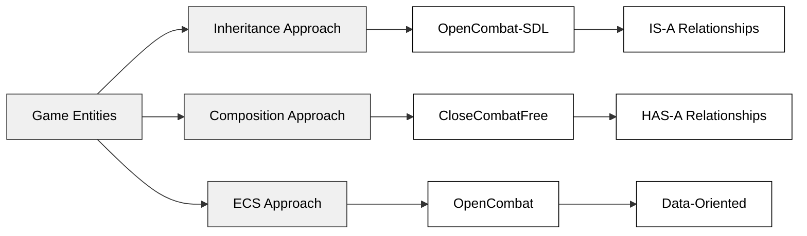
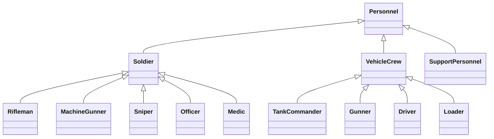
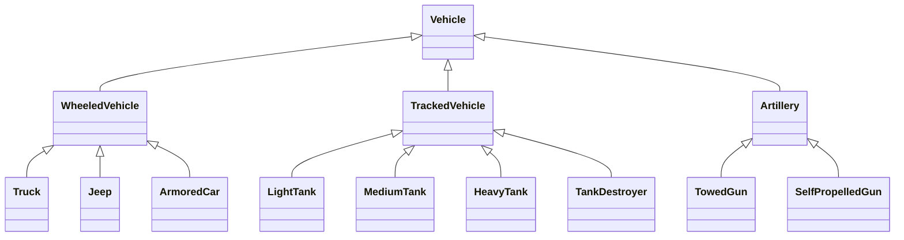
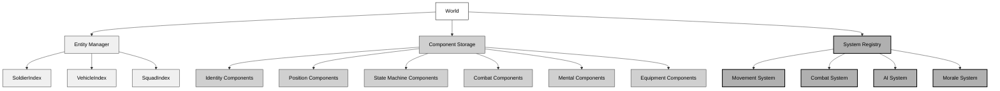
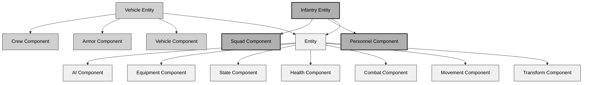
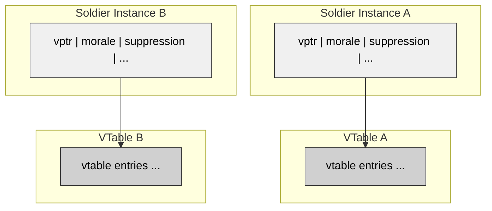
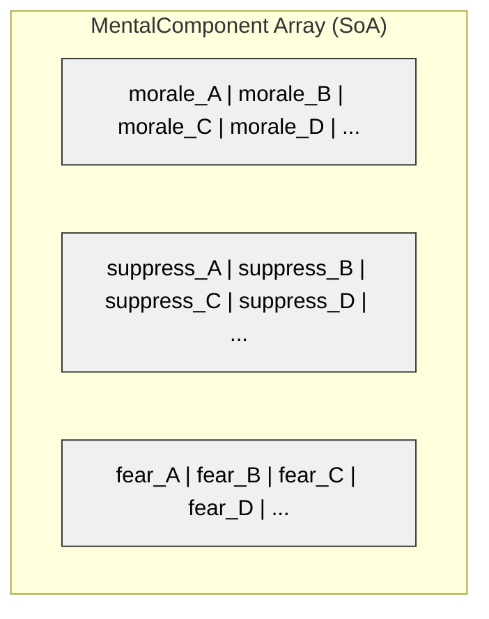
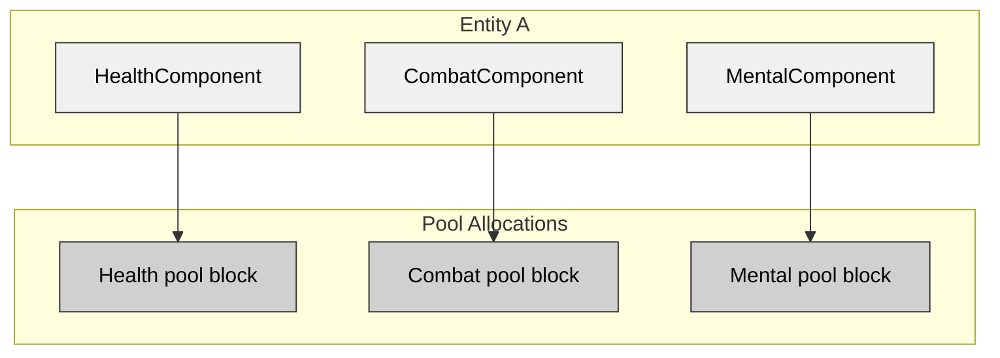

# Appendix B: Unit, Vehicle, and Squad Attribute Systems

## B.1 Comparative Overview

### B.1.1 Architectural Paradigms

The three Close Combat clones take different approaches to entity modeling in tactical wargames:

| Feature         | OpenCombat-SDL   | OpenCombat (Rust)   | CloseCombatFree       |
| --------------- | ---------------- | ------------------- | --------------------- |
| **Architecture**    | Deep Inheritance | Modified ECS        | Component Composition |
| **Language**        | C++              | Rust                | C++/QML               |
| **Period**          | 2005-2008        | 2020-2024           | 2011-2012             |
| **Data Model**      | OOP Hierarchy    | Component Graph     | Property Trees        |
| **Flexibility**     | Low              | High                | Medium                |
| **Type Safety**     | Runtime          | Compile-time        | Runtime               |
| **Modding Support** | Limited          | Configuration files | QML-based             |

### B.1.2 Design Philosophy Comparison



**Inheritance Model (OpenCombat-SDL):**
Entities specialize through class derivation. Behavior lives in virtual function overrides, and polymorphism provides runtime type flexibility. The approach carries risks: fragile base classes and deep hierarchies.

**Composition Model (CloseCombatFree):**
Entities assemble from reusable components. Behavior emerges through component interactions, offering more flexibility than inheritance. The tradeoff comes in component coordination complexity.

**ECS Model (OpenCombat):**
Entities serve as lightweight identifiers. Data stores in contiguous component arrays, and systems process homogeneous data sets. Developers must manage cache coherency and archetype complexity.

## B.2 OpenCombat-SDL Entity System

### B.2.1 Class Hierarchy Architecture

OpenCombat-SDL uses traditional object-oriented design with deep inheritance hierarchies for personnel and vehicles.

#### Soldier Class Hierarchy



#### Vehicle Class Hierarchy



### B.2.2 Core Attributes System

#### Base Personnel Attributes

```pseudocode
class Personnel:
    // Identity
    string unitId
    string name
    enum rank
    enum nationality

    // Physical State
    float health  // 0.0 - 1.0
    enum condition  // HEALTHY, WOUNDED, CRITICAL, DEAD
    float fatigue  // 0.0 - 1.0

    // Position & Movement
    Vector2D position
    float facing  // degrees
    float speed
    enum stance  // PRONE, CROUCH, STANDING
    enum movementState  // STATIONARY, WALKING, RUNNING, CRAWLING

    // Combat Capabilities
    Weapon primaryWeapon
    Weapon secondaryWeapon
    int ammunition[weaponSlots]
    float accuracy
    float reactionTime

    // Mental State
    float morale  // 0.0 - 1.0
    float suppression  // 0.0 - 1.0
    float experience  // 0.0 - 1.0
    float leadership

    // Command
    Personnel leader
    List<Personnel> subordinates
    enum commandLevel
```

#### Specialized Soldier Attributes

```pseudocode
class Rifleman extends Soldier:
    float rifleSkill
    float grenadeSkill
    int grenadeCount
    boolean hasEntrenchingTool

class MachineGunner extends Soldier:
    float machineGunSkill
    float sustainedFireBonus
    int beltSize
    float setupTime
    boolean isDeployed

class Sniper extends Soldier:
    float marksmanship
    float concealment
    float observationRange
    int shotsTaken

class Officer extends Soldier:
    float commandRadius
    float commandBonus
    List<Order> activeOrders
    enum commandStyle  // CAUTIOUS, BALANCED, AGGRESSIVE
```

### B.2.3 Vehicle Attribute System

#### Base Vehicle Attributes

```pseudocode
class Vehicle:
    // Identity
    string vehicleId
    string vehicleName
    enum vehicleType
    enum faction

    // Physical State
    float hullIntegrity  // 0.0 - 1.0
    Map<Component, float> componentHealth
    enum mobilityState  // OPERATIONAL, DAMAGED, IMMOBILIZED, DESTROYED

    // Position & Movement
    Vector2D position
    float hullFacing
    float turretFacing  // if applicable
    float currentSpeed
    float maxSpeed
    float turnRate
    enum gear  // REVERSE, NEUTRAL, GEAR_1, GEAR_2, etc.

    // Armor System
    Armor hullArmor
    Armor turretArmor
    Map<HitLocation, Armor> armorValues

    // Armament
    Weapon mainGun
    Weapon secondaryGun
    List<Weapon> machineGuns
    int mainGunAmmo
    int secondaryAmmo

    // Crew
    Map<CrewPosition, Personnel> crew
    boolean isCommanderExposed
    boolean isLoaderExposed

    // Tactical
    float spottingRange
    float radioRange
    boolean hasRadio
    enum tacticalPosture
```

#### Tank-Specific Attributes

```pseudocode
class Tank extends TrackedVehicle:
    // Gun System
    float gunAccuracy
    float reloadTime
    float turretTraverseSpeed
    float gunDepression
    float gunElevation
    enum gunStatus

    // Armor Details
    int frontalArmorThickness
    int sideArmorThickness
    int rearArmorThickness
    enum armorType  // RHA, CAST, WELDED, etc.

    // Protection Systems
    boolean hasSmokeLauncher
    int smokeCharges
    boolean hasExternalFuelTanks
    float fireSuppressionChance
```

### B.2.4 Squad Organization System

#### Squad Structure

```pseudocode
class Squad:
    // Identity
    string squadId
    string squadName
    enum squadType  // RIFLE, WEAPONS, HQ, TANK, etc.
    enum faction

    // Composition
    Personnel squadLeader
    List<Personnel> members
    int maxSize
    int currentSize

    // State
    enum squadState  // IDLE, MOVING, ENGAGING, RETREATING, PINNED
    Vector2D formationCenter
    enum formationType
    float cohesion

    // Command
    Platoon parentPlatoon
    List<Order> squadOrders
    Order currentOrder

    // Tactical
    float effectiveMorale
    float suppressionLevel
    float combatEffectiveness

    // Methods
    function calculateEffectiveMorale()
    function updateCohesion()
    function assignOrder(Order order)
    function disband()
```

#### Platoon Structure

```pseudocode
class Platoon:
    string platoonId
    Personnel platoonLeader
    Personnel platoonSergeant
    List<Squad> squads
    Company parentCompany
    List<Order> platoonOrders
```

### B.2.5 Two-Tier Command System

#### Order System

```pseudocode
class Order:
    enum orderType:
        MOVE_TO_POSITION
        ATTACK_POSITION
        DEFEND_POSITION
        RETREAT
        HOLD_FIRE
        FIRE_AT_WILL
        ASSAULT
        SUPPORT_BY_FIRE
        RECONNOITER
        TAKE_COVER
        REGROUP

    Vector2D targetPosition
    Entity targetEntity
    int priority
    float timeout
    OrderParameters parameters

class OrderParameters:
    // Movement Parameters
    enum movementSpeed  // SLOW, NORMAL, FAST
    enum routeType  // DIRECT, COVERED, SAFE
    boolean avoidEnemyContact

    // Combat Parameters
    enum engagementRules
    float holdFireRange
    boolean allowFallback

    // Formation Parameters
    enum formation
    float spacing
```

#### Action System

```pseudocode
class Action:
    enum actionType:
        MOVE
        SHOOT
        RELOAD
        TAKE_COVER
        CHANGE_STANCE
        SPOT_ENEMY
        COMMUNICATE
        USE_EQUIPMENT
        FIRST_AID
        ENTRENCH

    float startTime
    float duration
    float completionProgress
    enum actionState  // PENDING, ACTIVE, COMPLETED, INTERRUPTED

    function canPerform(Personnel actor)
    function performTick(deltaTime)
    function interrupt()
    function complete()
```

#### Order-to-Action Translation

```pseudocode
class CommandProcessor:
    function processOrders():
        for each squad in activeSquads:
            if squad.hasActiveOrder():
                actions = translateOrderToActions(squad.currentOrder, squad)
                distributeActionsToMembers(actions, squad)

    function translateOrderToActions(order, squad):
        actionQueue = new Queue()

        switch order.type:
            case MOVE_TO_POSITION:
                path = calculatePath(squad.formationCenter, order.targetPosition)
                for each waypoint in path:
                    for each member in squad.members:
                        actionQueue.add(createMoveAction(member, waypoint))

            case ATTACK_POSITION:
                approachActions = calculateApproach(squad, order.targetPosition)
                actionQueue.addAll(approachActions)
                fireActions = assignFirePositions(squad, order.targetEntity)
                actionQueue.addAll(fireActions)

        return actionQueue
```

### B.2.6 Attribute Calculation Example

```pseudocode
function calculateCombatEffectiveness(soldier):
    baseEffectiveness = soldier.experience * 0.4 +
                       soldier.health * 0.3 +
                       soldier.morale * 0.2 +
                       (1.0 - soldier.fatigue) * 0.1

    // Modifiers
    if soldier.suppression > 0.5:
        baseEffectiveness *= (1.0 - soldier.suppression * 0.8)

    if soldier.condition == WOUNDED:
        baseEffectiveness *= 0.7
    else if soldier.condition == CRITICAL:
        baseEffectiveness *= 0.3

    if soldier.stance == PRONE:
        baseEffectiveness *= 1.1
    else if soldier.stance == CROUCH:
        baseEffectiveness *= 1.0
    else:
        baseEffectiveness *= 0.9

    // Leadership bonus
    if soldier.leader and distance(soldier, soldier.leader) < 50:
        baseEffectiveness *= (1.0 + soldier.leader.leadership * 0.2)

    return clamp(baseEffectiveness, 0.0, 1.0)
```

## B.3 OpenCombat Entity System

### B.3.1 Modified ECS Architecture

OpenCombat uses a hybrid ECS architecture that embeds components with both data and behavior. This approach departs from pure data-oriented designs.

#### Core Architecture



#### Type-Safe Index Wrappers

```pseudocode
// Index types provide compile-time safety
struct SoldierIndex:
    uint32 value
    uint32 generation

    function isValid(): boolean
    function toRaw(): uint32

struct VehicleIndex:
    uint32 value
    uint32 generation

struct SquadIndex:
    uint32 value
    uint32 generation

// Index management
class EntityManager:
    Map<SoldierIndex, Soldier> soldiers
    Map<VehicleIndex, Vehicle> vehicles
    Map<SquadIndex, Squad> squads

    function createSoldier(): SoldierIndex
    function destroySoldier(index: SoldierIndex)
    function getSoldier(index: SoldierIndex): Soldier
    function isValid(index: SoldierIndex): boolean
```

### B.3.2 Component Definitions

#### Identity Component

```pseudocode
struct Identity:
    string name
    string unitId
    enum UnitType:
        TYPE1
        BREN_GUNNER
        MG34_GUNNER
        OFFICER
        VEHICLE_CREW
    enum Faction
    int experienceLevel  // 1-5
    int campaignExperience
```

#### Position Component

```pseudocode
struct Position:
    Vector2D worldPosition
    float facing  // radians
    float speed
    float maxSpeed

    enum Stance:
        PRONE
        KNEELING
        STANDING
        CRAWLING

    enum MovementState:
        STATIONARY
        WALKING
        RUNNING
        CRAWLING
        SPRINTING

    Vector2D destination
    List<Vector2D> path
    int currentPathIndex
```

#### State Machine Component

```pseudocode
struct StateMachine:
    enum State:
        IDLE
        MOVING
        ENGAGING
        TAKING_COVER
        RELOADING
        PINNED
        RETREATING
        DEAD

    State currentState
    State previousState
    float stateEnterTime
    Map<State, List<State>> validTransitions

    function canTransitionTo(newState: State): boolean
    function transitionTo(newState: State): boolean
    function getStateDuration(): float
```

#### Combat Component

```pseudocode
struct Combat:
    // Offensive
    float baseAccuracy
    float currentAccuracy
    float weaponSkill
    float reactionTime

    // Defensive
    float coverEffectiveness
    enum CoverType:
        NONE
        LIGHT
        MEDIUM
        HEAVY

    // Targeting
    SoldierIndex currentTarget
    List<SoldierIndex> knownEnemies
    List<SoldierIndex> suspectedEnemies
    float lastShotTime
    float timeBetweenShots

    // Suppression
    float suppressionLevel
    float suppressionDecayRate
    boolean isPinned
    boolean isBroken
```

#### Mental Component

```pseudocode
struct Mental:
    float morale  // 0.0 - 1.0
    float baseMorale
    float suppression
    float fear
    float confidence

    // Dynamic modifiers
    float leadershipBonus
    float proximityToEnemies
    float friendlyCasualtyImpact
    float recentSuccessBonus

    // Personality (for AI)
    float aggressiveness
    float caution
    float initiative

    function updateMorale(deltaTime: float)
    function applySuppression(amount: float)
    function recoverMorale(amount: float)
```

#### Equipment Component

```pseudocode
struct Equipment:
    Weapon primaryWeapon
    Weapon secondaryWeapon
    List<Grenade> grenades
    List<Item> inventory

    int primaryAmmo
    int secondaryAmmo
    int maxPrimaryAmmo
    int maxSecondaryAmmo

    boolean hasBinoculars
    boolean hasRadio
    boolean hasEntrenchingTool
    boolean hasFirstAidKit

    Armor helmet
    Armor bodyArmor

    function canFire(): boolean
    function reload(): float  // returns time to reload
    function getTotalWeight(): float
```

### B.3.3 Weapon System Components

#### Weapon Definitions

```pseudocode
struct Weapon:
    string name
    enum WeaponType:
        RIFLE
        SUBMACHINE_GUN
        MACHINE_GUN
        SNIPER_RIFLE
        PISTOL
        GRENADE
        MELEE

    // Ballistics
    float damage
    float armorPenetration
    float range
    float effectiveRange
    float maxRange

    // Fire characteristics
    float rateOfFire  // rounds per minute
    enum FireMode:
        SINGLE
        SEMI_AUTO
        FULL_AUTO
        BURST
    List<FireMode> availableModes

    // Handling
    float accuracy
    float recoil
    float setupTime
    boolean requiresSetup

    // Ammunition
    int magazineSize
    int currentAmmo
    float reloadTime
    enum AmmoType
```

#### Soldier Type Configurations

```pseudocode
// Type1: Basic Rifleman
SoldierType TYPE1:
    identity.type = TYPE1
    equipment.primaryWeapon = KAR98K or M1_GARAND
    equipment.secondaryWeapon = null or PISTOL
    equipment.grenades = 2-4
    combat.baseAccuracy = 0.6
    combat.weaponSkill = 0.5
    mental.baseMorale = 0.6

// Bren Gunner: Light Machine Gun
SoldierType BREN:
    identity.type = BREN_GUNNER
    equipment.primaryWeapon = BREN_GUN
    equipment.secondaryWeapon = PISTOL
    equipment.grenades = 1-2
    combat.baseAccuracy = 0.55
    combat.weaponSkill = 0.7
    combat.setupTime = 3.0  // seconds
    equipment.requiresSetup = true
    mental.baseMorale = 0.65

// MG34 Gunner: German Machine Gun
SoldierType MG34:
    identity.type = MG34_GUNNER
    equipment.primaryWeapon = MG34
    equipment.secondaryWeapon = PISTOL
    equipment.grenades = 0-1
    combat.baseAccuracy = 0.6
    combat.weaponSkill = 0.75
    combat.setupTime = 5.0
    equipment.requiresSetup = true
    mental.baseMorale = 0.65
```

### B.3.4 Vehicle System

#### Vehicle Component Structure

```pseudocode
struct VehicleComponents:
    VehicleIdentity identity
    VehiclePhysics physics
    VehicleArmor armor
    VehicleWeapons weapons
    VehicleCrew crew
    VehicleState state

struct VehicleIdentity:
    string name
    enum VehicleType:
        T26
        PANZER_III
        PANZER_IV
        SHERMAN
        // etc.
    enum Faction
    string description

struct VehiclePhysics:
    Vector2D position
    float hullFacing
    float turretFacing
    float currentSpeed
    float maxSpeed
    float turnRate
    float acceleration
    float turretTraverseSpeed
    Map<Gear, float> gearRatios
    enum Gear currentGear

struct VehicleArmor:
    int hullFront
    int hullSide
    int hullRear
    int turretFront
    int turretSide
    int turretRear
    enum ArmorType
    Map<HitLocation, float> angleModifiers

struct VehicleWeapons:
    Weapon mainGun
    Weapon coaxialMG
    List<Weapon> hullMGs
    int mainGunAmmo
    int mgAmmo
    float gunDepression
    float gunElevation
    float reloadTime
    float currentReloadProgress

struct VehicleCrew:
    Map<CrewPosition, SoldierIndex> crewPositions

    enum CrewPosition:
        COMMANDER
        GUNNER
        DRIVER
        LOADER
        HULL_GUNNER
        RADIO_OPERATOR

    boolean commanderExposed
    float crewQuality  // average of crew experience
    float crewMorale
```

#### T26 Tank Configuration Example

```pseudocode
VehicleType T26:
    identity:
        name = "T-26"
        type = LIGHT_TANK
        faction = SOVIET

    physics:
        maxSpeed = 30  // km/h
        turnRate = 25  // degrees per second
        turretTraverseSpeed = 15

    armor:
        hullFront = 15
        hullSide = 15
        hullRear = 15
        turretFront = 15
        turretSide = 15
        turretRear = 15
        armorType = HOMOGENEOUS

    weapons:
        mainGun = "45mm_20K"
        coaxialMG = "DT_MACHINE_GUN"
        mainGunAmmo = 122
        mgAmmo = 3528
        gunDepression = -6
        gunElevation = 18
        reloadTime = 4.5

    crew:
        positions = [COMMANDER, GUNNER, DRIVER, LOADER]
        commanderExposed = false
        crewQuality = calculated_from_individuals
```

### B.3.5 Squad Management System

#### Squad Component

```pseudocode
struct Squad:
    SquadIdentity identity
    List<SoldierIndex> members
    SquadIndex squadId

    SoldierIndex leader
    SoldierIndex assistantLeader

    enum SquadType:
        RIFLE_SQUAD
        WEAPONS_TEAM
        HEADQUARTERS
        TANK_SECTION

    // Formation
    Vector2D centerPosition
    enum Formation:
        COLUMN
        LINE
        WEDGE
        DIAMOND
        FREE
    float spacing

    // State
    float cohesion
    float averageMorale
    float suppressionLevel
    enum SquadState

    // Command
    Order currentOrder
    Queue<Order> orderQueue

    function addMember(soldier: SoldierIndex)
    function removeMember(soldier: SoldierIndex)
    function assignLeader(soldier: SoldierIndex)
    function updateFormation()
    function calculateCohesion()
    function disband(): List<SoldierIndex>
```

#### Dynamic Leadership

```pseudocode
function updateSquadLeadership(squad: Squad):
    // Check if leader is alive/capable
    if not isValid(squad.leader) or not isCapable(squad.leader):
        // Find next highest ranking capable soldier
        newLeader = findHighestRankingCapable(squad.members)
        if newLeader exists:
            squad.leader = newLeader
            broadcastLeadershipChange(squad, newLeader)
            applyLeadershipBonus(squad, newLeader)

    // Check if assistant leader is needed/capable
    if squad.assistantLeader is null or not isCapable(squad.assistantLeader):
        newAssistant = findNextHighestRanking(squad.members, exclude=[squad.leader])
        squad.assistantLeader = newAssistant

function isCapable(soldier: SoldierIndex): boolean:
    mental = getComponent<Mental>(soldier)
    state = getComponent<StateMachine>(soldier)

    return mental.morale > 0.3 and
           mental.suppression < 0.7 and
           state.currentState != DEAD and
           state.currentState != RETREATING
```

### B.3.6 Attribute-Driven AI System

#### AI Component

```pseudocode
struct AI:
    // Perception
    List<EnemyContact> knownEnemies
    List<Vector2D> lastKnownPositions
    float awarenessLevel

    // Decision weights
    float selfPreservationWeight
    float missionFocusWeight
    float teamCohesionWeight

    // Behavior state
    enum BehaviorMode:
        DEFENSIVE
        BALANCED
        AGGRESSIVE
        RETREATING
        HOLDING

    BehaviorMode currentMode
    float modeConfidence

    // Tactical considerations
    float distanceToNearestCover
    float distanceToEnemies
    float friendlyStrengthRatio
    float ammunitionStatus

    function evaluateSituation(deltaTime: float)
    function selectAction(): ActionType
    function calculateUtility(action: ActionType): float
```

#### Reactive Decision Making

```pseudocode
function processAI(soldier: SoldierIndex, deltaTime: float):
    ai = getComponent<AI>(soldier)
    mental = getComponent<Mental>(soldier)
    combat = getComponent<Combat>(soldier)

    // Update perception
    updateKnownEnemies(soldier, ai)
    updateTacticalSituation(soldier, ai)

    // Check for state changes
    if mental.suppression > 0.8 and mental.morale < 0.3:
        ai.currentMode = RETREATING
    else if combat.knownEnemies.size > 0 and mental.morale > 0.5:
        ai.currentMode = AGGRESSIVE
    else if mental.morale < 0.4:
        ai.currentMode = DEFENSIVE
    else:
        ai.currentMode = BALANCED

    // Select action based on mode
    bestAction = selectBestAction(soldier, ai)
    executeAction(soldier, bestAction)

function selectBestAction(soldier: SoldierIndex, ai: AI): ActionType:
    actions = getAvailableActions(soldier)
    bestUtility = -infinity
    bestAction = null

    for action in actions:
        utility = calculateUtility(soldier, ai, action)
        if utility > bestUtility:
            bestUtility = utility
            bestAction = action

    return bestAction

function calculateUtility(soldier: SoldierIndex, ai: AI, action: ActionType): float:
    baseUtility = 0.0

    switch action:
        case TAKE_COVER:
            baseUtility = ai.selfPreservationWeight * (1.0 - ai.distanceToNearestCover)
            if ai.distanceToEnemies < 100:
                baseUtility *= 2.0

        case ENGAGE_ENEMY:
            baseUtility = ai.missionFocusWeight * combatEffectiveness(soldier)
            if combat.ammunition < 10:
                baseUtility *= 0.3

        case MOVE_TO_POSITION:
            baseUtility = ai.missionFocusWeight * 0.5
            if ai.friendlyStrengthRatio < 0.5:
                baseUtility *= 0.2

        case RETREAT:
            baseUtility = ai.selfPreservationWeight * (1.0 - mental.morale)
            if mental.suppression > 0.7:
                baseUtility *= 3.0

    // Add randomness for organic feel
    baseUtility += random(-0.1, 0.1)

    return baseUtility
```

### B.3.7 System Processing Order

```pseudocode
class GameWorld:
    function update(deltaTime: float):
        // Phase 1: Perception & Input
        PerceptionSystem.update(deltaTime)
        InputSystem.update(deltaTime)

        // Phase 2: AI Decision Making
        AISystem.update(deltaTime)

        // Phase 3: State Transitions
        StateMachineSystem.update(deltaTime)

        // Phase 4: Combat Resolution
        CombatSystem.update(deltaTime)

        // Phase 5: Movement & Physics
        MovementSystem.update(deltaTime)
        VehicleSystem.update(deltaTime)

        // Phase 6: Mental State
        MoraleSystem.update(deltaTime)

        // Phase 7: Squad Coherence
        SquadSystem.update(deltaTime)

        // Phase 8: Cleanup
        DeathSystem.update(deltaTime)
```

## B.4 CloseCombatFree Entity System

### B.4.1 Component Composition Model

CloseCombatFree builds entities by assembling independent components instead of using class inheritance.

#### Architecture Overview



### B.4.2 QML Property System

CloseCombatFree uses QML's property system for reactive attribute management. Property changes automatically update dependent systems.

#### Property Declaration Pattern

```pseudocode
// Base Entity Properties
Entity:
    // Identity properties
    property string entityId
    property string displayName
    property enum entityType
    property enum faction

    // Transform properties (auto-notify)
    property Vector2D position
    property float rotation
    property float scale: 1.0

    // State properties
    property enum state: IDLE
    property float stateTime

    // Component references
    property MovementComponent movement
    property CombatComponent combat
    property HealthComponent health
    property EquipmentComponent equipment

    // Computed property (reactive)
    property bool isAlive: health.current > 0
    property bool isMoving: movement.speed > 0
    property bool canFight: isAlive and not isSuppressed()

    // Signal for state changes
    signal stateChanged(enum newState, enum oldState)
    signal propertyChanged(string propertyName)
```

#### Reactive Property Binding

```pseudocode
// Example: Suppression affects accuracy
Soldier:
    property CombatComponent combat
    property MentalComponent mental

    // Reactive binding - updates automatically
    property float effectiveAccuracy:
        combat.baseAccuracy * (1.0 - mental.suppression * 0.5)

    // Conditional binding
    property bool canSeeEnemy:
        mental.fear < 0.8 and combat.spottedEnemies.length > 0

    // Complex computed property
    property float combatEffectiveness: {
        var base = combat.skill * 0.4 +
                   mental.morale * 0.3 +
                   health.percentage * 0.3

        if (mental.suppressed)
            base *= 0.5
        if (equipment.isHeavyWeapon)
            base *= 0.8

        return base
    }
```

### B.4.3 Core Unit Components

#### Transform Component

```pseudocode
TransformComponent:
    property Vector2D position
    property float rotation  // degrees
    property Vector2D forward:
        Vector2D.fromAngle(rotation)
    property Vector2D right:
        Vector2D.fromAngle(rotation + 90)

    // World space calculations
    function worldToLocal(point: Vector2D): Vector2D
    function localToWorld(point: Vector2D): Vector2D
    function distanceTo(other: Entity): float
    function directionTo(other: Entity): float

    // Smooth rotation
    function rotateTowards(target: float, speed: float, deltaTime: float)
```

#### Movement Component

```pseudocode
MovementComponent:
    property float maxSpeed
    property float acceleration
    property float turnSpeed
    property float currentSpeed: 0
    property Vector2D velocity
    property Vector2D destination
    property List<Vector2D> path
    property int pathIndex

    enum MovementMode:
        WALK
        RUN
        SPRINT
        CRAWL
        SNEAK

    property MovementMode mode: WALK

    // Mode multipliers
    property Map<MovementMode, float> speedMultipliers: {
        WALK: 1.0,
        RUN: 1.5,
        SPRINT: 2.0,
        CRAWL: 0.3,
        SNEAK: 0.5
    }

    // Noise generation
    property float noiseLevel:
        currentSpeed * mode.noiseMultiplier

    function moveTo(destination: Vector2D)
    function followPath(path: List<Vector2D>)
    function stop()
    function setMode(mode: MovementMode)

    // Physics update
    function update(deltaTime: float):
        if hasDestination:
            direction = normalize(destination - position)
            targetSpeed = maxSpeed * speedMultipliers[mode]
            currentSpeed = lerp(currentSpeed, targetSpeed, acceleration * deltaTime)
            velocity = direction * currentSpeed
            position += velocity * deltaTime
```

#### Combat Component

```pseudocode
CombatComponent:
    // Weapon reference
    property Weapon currentWeapon
    property List<Weapon> weapons

    // Combat stats
    property float baseAccuracy
    property float baseReactionTime
    property float baseCourage

    // Dynamic stats (affected by conditions)
    property float currentAccuracy: baseAccuracy
    property float currentReactionTime: baseReactionTime

    // Targeting
    property Entity currentTarget
    property List<Entity> validTargets
    property float targetPriority

    // Engagement
    property bool isEngaging
    property float lastShotTime
    property float timeSinceLastShot: currentTime - lastShotTime
    property bool canFire:
        currentWeapon.ammo > 0 and
        timeSinceLastShot >= currentWeapon.fireInterval

    // Suppression
    property float suppressionLevel: 0
    property bool isSuppressed: suppressionLevel > 0.5
    property float suppressionRecovery: 0.1  // per second

    // Cover
    property CoverType currentCover: NONE
    property float coverEffectiveness: 0

    function update(deltaTime: float):
        // Recover from suppression
        suppressionLevel = max(0, suppressionLevel - suppressionRecovery * deltaTime)

        // Update accuracy based on conditions
        updateAccuracy()

        // Auto-target if needed
        if not currentTarget and validTargets.length > 0:
            selectBestTarget()

    function updateAccuracy():
        var accuracy = baseAccuracy

        if isSuppressed:
            accuracy *= (1 - suppressionLevel * 0.7)
        if currentCover != NONE:
            accuracy *= (1 + coverEffectiveness * 0.2)

        currentAccuracy = accuracy
```

#### Health Component

```pseudocode
HealthComponent:
    property float maxHealth: 100
    property float currentHealth: maxHealth
    property float percentage: currentHealth / maxHealth

    enum HealthState:
        HEALTHY
        LIGHT_WOUND
        MODERATE_WOUND
        SEVERE_WOUND
        CRITICAL
        DEAD

    property HealthState state: HEALTHY

    // Injury tracking
    property List<Injury> injuries
    property float bloodLossRate: 0
    property float painLevel: 0

    // Effects on performance
    property float mobilityModifier: 1.0
    property float accuracyModifier: 1.0

    // State transitions
    onCurrentHealthChanged:
        updateState()
        updateModifiers()

    function takeDamage(amount: float, type: DamageType, location: HitLocation):
        // Apply damage reduction based on armor/location
        var actualDamage = calculateDamage(amount, type, location)
        currentHealth -= actualDamage

        // Create injury record
        injuries.append(createInjury(type, location, actualDamage))

        // Check for critical effects
        if actualDamage > maxHealth * 0.3:
            painLevel += 0.3

        emit(damageTaken, actualDamage, location)

    function heal(amount: float):
        currentHealth = min(maxHealth, currentHealth + amount)
        painLevel = max(0, painLevel - 0.1)

    function updateState():
        var oldState = state

        if currentHealth <= 0:
            state = DEAD
        else if currentHealth < maxHealth * 0.1:
            state = CRITICAL
        else if currentHealth < maxHealth * 0.3:
            state = SEVERE_WOUND
        else if currentHealth < maxHealth * 0.6:
            state = MODERATE_WOUND
        else if currentHealth < maxHealth * 0.9:
            state = LIGHT_WOUND
        else:
            state = HEALTHY

        if state != oldState:
            emit(stateChanged, state, oldState)

    function updateModifiers():
        switch state:
            case HEALTHY:
                mobilityModifier = 1.0
                accuracyModifier = 1.0
            case LIGHT_WOUND:
                mobilityModifier = 0.95
                accuracyModifier = 0.95
            case MODERATE_WOUND:
                mobilityModifier = 0.8
                accuracyModifier = 0.85
            case SEVERE_WOUND:
                mobilityModifier = 0.5
                accuracyModifier = 0.7
            case CRITICAL:
                mobilityModifier = 0.1
                accuracyModifier = 0.5
            case DEAD:
                mobilityModifier = 0
                accuracyModifier = 0
```

### B.4.4 Tank-Specific Properties

#### Vehicle Component

```pseudocode
VehicleComponent:
    property VehicleType vehicleType
    property VehicleClass vehicleClass  // LIGHT, MEDIUM, HEAVY, etc.
    property Faction faction

    // Movement
    property float maxRoadSpeed
    property float maxOffroadSpeed
    property float currentMaxSpeed  // affected by terrain
    property float turnRate
    property float acceleration
    property float deceleration

    // Dimensions
    property float length
    property float width
    property float height
    property float groundClearance

    // State
    property bool engineRunning
    property float engineHealth
    property float trackHealth
    property bool immobilized: trackHealth <= 0

    enum MobilityState:
        FULLY_OPERATIONAL
        DAMAGED
        IMMOBILIZED
        DESTROYED

    property MobilityState mobilityState:
        if not engineRunning or engineHealth <= 0:
            return DAMAGED
        if trackHealth <= 0:
            return IMMOBILIZED
        if healthComponent.state == DEAD:
            return DESTROYED
        return FULLY_OPERATIONAL
```

#### Armor Component

```pseudocode
ArmorComponent:
    // Base armor values (mm)
    property int hullFrontArmor
    property int hullSideArmor
    property int hullRearArmor
    property int turretFrontArmor
    property int turretSideArmor
    property int turretRearArmor

    // Effective armor (accounts for angling)
    property Map<HitLocation, float> effectiveArmor

    // Component armor (internal modules)
    property Map<Component, int> componentArmor

    enum Component:
        ENGINE
        TRANSMISSION
        FUEL_TANK
        AMMO_STORAGE
        CREW_COMPARTMENT
        TURRET_RING
        GUN_BREECH
        OPTICS

    // Armor type
    property enum ArmorType:
        ROLLED_HOMOGENEOUS
        CAST
        WELDED
        SPACED
        COMPOSITE

    property float armorQuality: 1.0  // multiplier

    function calculateEffectiveArmor(location: HitLocation, hitAngle: float): float:
        var baseArmor = getBaseArmor(location)
        var angleBonus = calculateAngleBonus(hitAngle)
        return baseArmor * angleBonus * armorQuality

    function checkPenetration(projectile: Projectile, location: HitLocation, angle: float): bool:
        var effective = calculateEffectiveArmor(location, angle)
        var penetration = projectile.penetrationAtDistance(distance)
        return penetration > effective
```

#### Turret System

```pseudocode
TurretComponent:
    property float traverseSpeed  // degrees per second
    property float elevationSpeed
    property float depressionLimit  // negative angle
    property float elevationLimit
    property float currentRotation  // relative to hull
    property float currentElevation

    property Entity target
    property Vector2D targetPosition
    property bool isTracking: target != null

    property float stabilization  // 0-1, affects firing on move
    property bool hasStabilizer: stabilization > 0

    // Rotation limits
    property bool hasFullRotation: true
    property float leftLimit: -180
    property float rightLimit: 180

    function update(deltaTime: float):
        if isTracking and target:
            var targetAngle = calculateRelativeAngle(target)
            var targetElevation = calculateElevation(target)

            // Clamp to limits
            targetAngle = clamp(targetAngle, leftLimit, rightLimit)
            targetElevation = clamp(targetElevation, depressionLimit, elevationLimit)

            // Smooth rotation
            currentRotation = moveTowards(currentRotation, targetAngle, traverseSpeed * deltaTime)
            currentElevation = moveTowards(currentElevation, targetElevation, elevationSpeed * deltaTime)

    function canFireAt(target: Entity): bool:
        var angle = calculateRelativeAngle(target)
        var elevation = calculateElevation(target)

        return angle >= leftLimit and angle <= rightLimit and
               elevation >= depressionLimit and elevation <= elevationLimit
```

### B.4.5 Crew/Soldier System

#### Crew Component

```pseudocode
CrewComponent:
    property Map<CrewPosition, Entity> crew
    property int maxCrew
    property int currentCrew: crew.size
    property float crewQuality  // average of individual skills

    enum CrewPosition:
        COMMANDER
        GUNNER
        LOADER
        DRIVER
        ASSISTANT_DRIVER
        HULL_MACHINE_GUNNER
        RADIO_OPERATOR

    // Position-specific status
    property bool commanderExposed
    property bool gunnerExposed
    property bool loaderExposed
    property bool driverExposed

    // Vital positions
    property List<CrewPosition> vitalPositions: [DRIVER, GUNNER]
    property bool hasMinimumCrew: checkMinimumCrew()

    // Performance modifiers based on crew
    property float reloadModifier: 1.0
    property float accuracyModifier: 1.0
    property float spottingModifier: 1.0

    function addCrewMember(position: CrewPosition, soldier: Entity)
    function removeCrewMember(position: CrewPosition)
    function isPositionFilled(position: CrewPosition): bool
    function getCrewMember(position: CrewPosition): Entity

    function checkMinimumCrew(): bool:
        for position in vitalPositions:
            if not isPositionFilled(position):
                return false
        return true

    function calculateCrewModifiers():
        // Reload speed
        if isPositionFilled(LOADER):
            var loader = getCrewMember(LOADER)
            reloadModifier = 0.7 + (0.3 * loader.skill)
        else:
            reloadModifier = 2.0  // Much slower without loader

        // Gunner accuracy
        if isPositionFilled(GUNNER):
            var gunner = getCrewMember(GUNNER)
            accuracyModifier = 0.5 + (0.5 * gunner.skill)
        else:
            accuracyModifier = 0.3

        // Commander spotting
        if isPositionFilled(COMMANDER):
            var commander = getCrewMember(COMMANDER)
            spottingModifier = 0.6 + (0.4 * commander.skill)
            if commanderExposed:
                spottingModifier *= 1.3
        else:
            spottingModifier = 0.4

    // Called when crew takes damage
    function onCrewCasualty(position: CrewPosition):
        emit(crewCasualty, position)

        // Check for position reassignment
        if position == COMMANDER and isPositionFilled(GUNNER):
            // Gunner takes over command
            promoteCrewMember(GUNNER, COMMANDER)
        else if position == GUNNER and isPositionFilled(LOADER):
            // Loader becomes gunner
            promoteCrewMember(LOADER, GUNNER)

        updateCrewStatus()
```

### B.4.6 Infantry vs Vehicle Architecture Differences

| Aspect      | Infantry Entity                   | Vehicle Entity                                     |
| ----------- | --------------------------------- | -------------------------------------------------- |
| **Base Class**  | Entity                            | Entity                                             |
| **Movement**    | MovementComponent (2D grid)       | VehicleComponent (physics-based)                   |
| **Health**      | HealthComponent (single pool)     | HealthComponent + ArmorComponent + ComponentHealth |
| **Combat**      | CombatComponent (personal weapon) | TurretComponent + WeaponsComponent                 |
| **Mental**      | MentalComponent (individual)      | CrewComponent aggregates crew mental states        |
| **Cover**       | CoverType enum                    | Armor angles, hull down positions                  |
| **Suppression** | Direct suppression value          | Crew suppression via CrewComponent                 |
| **Leadership**  | SquadComponent reference          | Commander position in CrewComponent                |

#### State Machine Differences

```pseudocode
// Infantry State Machine
InfantryStateMachine:
    states: [IDLE, WALKING, RUNNING, ENGAGING, TAKING_COVER, PINNED, RETREATING, DEAD]

    // Transitions triggered by mental state
    onMentalComponent.suppressionLevel > 0.7:
        transitionTo(PINNED)

    onMentalComponent.morale < 0.2:
        transitionTo(RETREATING)

// Vehicle State Machine
VehicleStateMachine:
    states: [IDLE, MOVING, ENGAGING, HULL_DOWN, BUTTONED_UP, IMMOBILIZED, DESTROYED]

    // Transitions based on crew and damage
    onCrewComponent.commanderExposed and underFire:
        setCommanderExposed(false)  // Button up

    onArmorComponent.componentDestroyed(ENGINE):
        transitionTo(IMMOBILIZED)

    onHealthComponent.state == DEAD:
        transitionTo(DESTROYED)
```

### B.4.7 Health/Condition State Transitions

```pseudocode
// Health state transition diagram
StateTransitionDiagram HealthStates:
    HEALTHY:
        -> LIGHT_WOUND: damage > 0
        -> DEAD: fatalDamage

    LIGHT_WOUND:
        -> HEALTHY: healed
        -> MODERATE_WOUND: damage > threshold
        -> DEAD: fatalDamage

    MODERATE_WOUND:
        -> LIGHT_WOUND: healed
        -> SEVERE_WOUND: damage > threshold
        -> DEAD: fatalDamage

    SEVERE_WOUND:
        -> MODERATE_WOUND: healed
        -> CRITICAL: damage > threshold or bloodLoss > limit
        -> DEAD: fatalDamage

    CRITICAL:
        -> SEVERE_WOUND: emergencyCare and stable
        -> DEAD: noCare or fatalDamage

    DEAD:
        -> [terminal state]

// Transition handling
function onStateTransition(from: HealthState, to: HealthState):
    emit(stateChanged, from, to)

    switch to:
        case LIGHT_WOUND:
            applyModifier("speed", 0.95)
            applyModifier("accuracy", 0.95)
            emit(bleeding, light)

        case MODERATE_WOUND:
            applyModifier("speed", 0.8)
            applyModifier("accuracy", 0.85)
            emit(bleeding, moderate)
            emit(requiresAid)

        case SEVERE_WOUND:
            applyModifier("speed", 0.5)
            applyModifier("accuracy", 0.7)
            emit(bleeding, severe)
            emit(requiresImmediateAid)

        case CRITICAL:
            applyModifier("speed", 0.1)
            applyModifier("accuracy", 0.5)
            emit(bleeding, critical)
            emit(unconsciousnessRisk)

        case DEAD:
            applyModifier("speed", 0)
            applyModifier("accuracy", 0)
            emit(killed)
            disableAllComponents()
```

## B.5 Attribute System Comparison

### B.5.1 Data Storage Patterns

| Feature          | OpenCombat-SDL   | OpenCombat          | CloseCombatFree  |
| ---------------- | ---------------- | ------------------- | ---------------- |
| **Storage Model**    | Object instances | Component arrays    | Property objects |
| **Memory Layout**    | Scattered (heap) | Contiguous (SoA)    | Mixed            |
| **Access Pattern**   | Pointer chasing  | Index-based         | Property lookup  |
| **Cache Efficiency** | Low              | High                | Medium           |
| **Memory Overhead**  | High (vtables)   | Low                 | Medium           |
| **Flexibility**      | Compile-time     | Runtime composition | Runtime binding  |

#### Memory Layout Visualization

**OpenCombat-SDL (OOP)**:


**OpenCombat (ECS)**:


**CloseCombatFree (Component Composition)**:


### B.5.2 Access Patterns and Performance

```pseudocode
// OpenCombat-SDL: Virtual function dispatch
function updateSoldier(soldier: Soldier):
    soldier.update()
    soldier.calculateMorale()
    soldier.updateActions()

// OpenCombat: Direct array access
function updateMentalStates(mentalComponents: Array<MentalComponent>):
    for mental in mentalComponents:
        mental.morale += mental.recoveryRate * deltaTime
        mental.suppression = max(0, mental.suppression - decay)

// CloseCombatFree: Property binding
function updateHealth(healthComponents: List<HealthComponent>):
    for health in healthComponents:
        health.percentage = health.current / health.max
        // Triggers automatic updates to dependent systems
```

#### Performance Comparison Table

| Operation       | OOP (SDL)              | ECS (Rust)             | Composition (QML)         |
| --------------- | ---------------------- | ---------------------- | ------------------------- |
| **Attribute Read**  | O(1) with indirection  | O(1) direct            | O(1) property lookup      |
| **Attribute Write** | O(1) with indirection  | O(1) direct            | O(1) with notification    |
| **Batch Update**    | O(n) with cache misses | O(n) cache friendly    | O(n) with signal overhead |
| **Type Check**      | Runtime (dynamic_cast) | Compile-time (indices) | Runtime (type property)   |
| **Add Attribute**   | Requires inheritance   | Add component          | Add property              |
| **Memory/Entity**   | ~500-1000 bytes        | ~200-400 bytes         | ~300-600 bytes            |

### B.5.3 Modifiability Comparison

| Aspect               | OpenCombat-SDL           | OpenCombat            | CloseCombatFree |
| -------------------- | ------------------------ | --------------------- | --------------- |
| **Add New Soldier Type** | Create subclass          | Add configuration     | Create QML type |
| **Add New Attribute**    | Add to base class        | Add component field   | Add property    |
| **Change Behavior**      | Override virtual methods | Add or modify systems | Bind new logic  |
| **Data-Driven**          | Limited (ini files)      | Extensive (JSON/TOML) | Extensive (QML) |
| **Modding Support**      | Requires recompilation   | Config files          | QML scripts     |
| **Runtime Flexibility**  | None                     | High                  | Very high       |

#### Modification Examples

**Adding a New Soldier Type**:

```pseudocode
// OpenCombat-SDL: Inheritance approach
class Flamethrower : public Soldier:
    float flameRange
    int fuelCapacity
    function attack(): override

// OpenCombat: Configuration approach
{
    "soldier_type": "FLAMETHROWER",
    "equipment": {
        "primary": "FLAMETHROWER_M2",
        "fuel": 100
    },
    "combat": {
        "range": 40,
        "special": "FLAME_ATTACK"
    }
}

// CloseCombatFree: QML Component approach
FlamethrowerSoldier : Soldier {
    property int fuelCapacity: 100
    property float flameRange: 40

    CombatComponent {
        specialAttack: flameAttack
    }
}
```

**Adding a New Attribute**:

```pseudocode
// OpenCombat-SDL: Modify base class
class Personnel:
    float camouflageSkill  // Added to base class
    // All subclasses inherit automatically

// OpenCombat: Add component field
struct Mental:
    float camouflageSkill  // Added field
    // All soldiers with Mental component receive it

// CloseCombatFree: Add property
Soldier:
    property float camouflageSkill: 0.5
    // Available immediately with binding support
```

## B.6 Design Recommendations

### B.6.1 When to Use Each Approach

#### Use Deep Inheritance (OpenCombat-SDL Style) When:

- **Fixed entity types**: The game maintains a stable set of entity types that won't change
- **Strong IS-A relationships**: Entities fit cleanly into a taxonomy (e.g., all Tanks ARE Vehicles)
- **Behavior specialization**: Subtypes require significantly different implementations
- **Team expertise**: The team has strong OOP experience
- **Simple modding**: Mods don't need to add new entity types

**Best for**: Traditional wargames, board game adaptations, games with fixed unit rosters

#### Use ECS (OpenCombat Style) When:

- **Many entity types**: The game features dozens or hundreds of entity variations
- **Complex interactions**: Systems process many entities with specific component combinations
- **Performance critical**: Batch processing and cache efficiency matter
- **Data-driven design**: Entities should be defined in configuration files
- **Extensibility**: New entity types must be added without code changes

**Best for**: Large-scale strategy games, sandbox games, games with heavy modding support

#### Use Component Composition (CloseCombatFree Style) When:

- **Reactive systems**: Properties need to automatically update dependents
- **Visual scripting**: Designers should create entity types without programmers
- **Flexible binding**: Attributes require complex interdependencies
- **UI integration**: Entity properties map directly to UI controls
- **Rapid iteration**: Entity behavior needs frequent tweaking

**Best for**: Editor-heavy games, games with complex state machines, designer-driven projects

### B.6.2 Hybrid Patterns

Modern games often combine approaches for optimal results:

#### Pattern 1: ECS Core with OOP Behaviors

```pseudocode
// Core data in ECS
Entity: uint32
PositionComponent: [x, y, facing]
HealthComponent: [current, max]

// Complex behaviors as objects
class AIStrategy:
    abstract function evaluate(entity: Entity)

class AggressiveStrategy extends AIStrategy:
    function evaluate(entity: Entity):
        pos = getComponent<Position>(entity)
        health = getComponent<Health>(entity)
        // Implement aggressive behavior logic

// Strategy assigned as component reference
AIComponent:
    AIStrategy currentStrategy
```

#### Pattern 2: Composition with ECS Storage

```pseudocode
// Entity has components
Entity:
    List<Component> components

// Components stored ECS-style for performance
ComponentStorage:
    Array<Transform> transforms  // SoA
    Array<Combat> combatData     // SoA

// Reactive bindings for gameplay logic
ReactiveSystem:
    when Health.current < 0:
        trigger DeathEvent
    when Morale.suppression > threshold:
        set State.pinned
```

#### Pattern 3: Inheritance for Types, Composition for State

```pseudocode
// Type hierarchy (static)
abstract class UnitType:
    string displayName
    float baseSpeed
    WeaponType defaultWeapon

class RiflemanType extends UnitType:
    displayName = "Rifleman"
    baseSpeed = 1.0

// Instance state (dynamic components)
class UnitInstance:
    UnitType type
    List<StateComponent> currentState

    // Current state as components
    Position position
    Health health
    MentalState mental

    function getSpeed():
        return type.baseSpeed * health.mobilityModifier
```

### B.6.3 Implementation Guidelines

#### For Attribute Systems:

1. **Separate static and dynamic data**
   - Static: Unit type definitions, weapon stats (load from config)
   - Dynamic: Current health, position, state (runtime only)

2. **Use normalized values (0.0-1.0) where possible**
   ```pseudocode
   health: 0.0 to 1.0 (percentage)
   morale: 0.0 to 1.0 (fraction of max)
   suppression: 0.0 to 1.0 (relative to breaking point)
   ```

3. **Implement dirty flags for derived attributes**
   ```pseudocode
   class CombatStats:
       float baseAccuracy
       float _effectiveAccuracy  // cached
       boolean _accuracyDirty = true

       function getEffectiveAccuracy():
           if _accuracyDirty:
               _effectiveAccuracy = calculateEffective()
               _accuracyDirty = false
           return _effectiveAccuracy
   ```

4. **Use events for cross-system communication**
   ```pseudocode
   events:
       UnitTookDamage(unit, amount, source)
       UnitDied(unit, killer)
       SquadBroken(squad)
       VehicleImmobilized(vehicle)
   ```

5. **Implement save/load with serialization layers**
   ```pseudocode
   // Save only runtime state
   SavedState:
       unitId -> position, health, ammo, state
       // Type definitions load from config
   ```

#### For Squad Systems:

1. **Maintain separation of concerns**
   - Squad: Formation, orders, cohesion
   - Individual: Actions, personal state, targeting
   - Communication: Leader bonuses, information sharing

2. **Use influence maps for tactical AI**
   ```pseudocode
   DangerMap:
       Grid of threat values
       Updated from known enemy positions/weapons
       Used for pathfinding and cover selection
   ```

3. **Implement command delay/radio simulation**
   ```pseudocode
   OrderTransmission:
       Order order
       float transmissionTime
       float reliability  // affected by distance, equipment

   // Higher command levels increase delays
   ```

#### For Vehicle Systems:

1. **Model crew as separate entities or detailed components**
   ```pseudocode
   // Option A: Crew as separate soldier entities
   Vehicle.crewPositions: Map<Position, SoldierIndex>

   // Option B: Crew as embedded components
   Vehicle.crew: List<CrewMember>
   CrewMember: skill, health, position, state
   ```

2. **Implement component damage realistically**
   ```pseudocode
   ComponentHealth:
       ENGINE: affects mobility
       TRACKS: affects steering/mobility
       GUN: affects firing capability
       OPTICS: affects accuracy/spotting
       RADIO: affects communication
   ```

3. **Use proper ballistics for armor penetration**
   ```pseudocode
   PenetrationCheck:
       projectileVelocityAtDistance
       projectilePenetration
       armorThicknessAtHitAngle
       armorQuality
       // Result: penetration yes/no, spall damage, crew shock
   ```

### B.6.4 Performance Optimization Checklist

- [ ] Batch attribute updates by system
- [ ] Use spatial partitioning for proximity queries
- [ ] Cache frequently accessed derived values
- [ ] Implement LOD for AI (simpler behavior for distant units)
- [ ] Use object pooling for projectiles and effects
- [ ] Profile memory access patterns
- [ ] Consider multithreading for system updates
- [ ] Implement culling for off-screen entities

---

## B.7 Summary

This appendix examines three approaches to modeling unit, vehicle, and squad attributes in tactical wargames:

1. **OpenCombat-SDL** uses traditional OOP with deep inheritance, ideal for games with stable, well-defined entity types. Its two-tier command system (Orders → Actions) clearly separates strategic intent from tactical execution.

2. **OpenCombat** implements a modified ECS architecture that optimizes cache efficiency and supports data-driven design. Type-safe indices prevent common entity management errors while the reactive AI system enables emergent tactical behavior.

3. **CloseCombatFree** demonstrates component composition with reactive property binding, providing maximum flexibility for designer-driven iteration and visual scripting.

The architecture choice depends on:
- Team expertise and preferences
- Game scale and complexity
- Modding requirements
- Performance constraints
- Iteration speed needs

Modern games typically combine approaches, using ECS for core simulation performance, composition for gameplay logic flexibility, and inheritance for clear type definitions.
