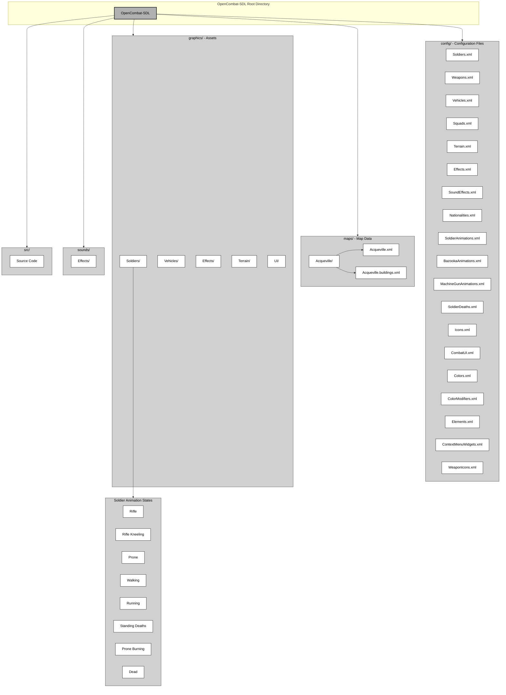
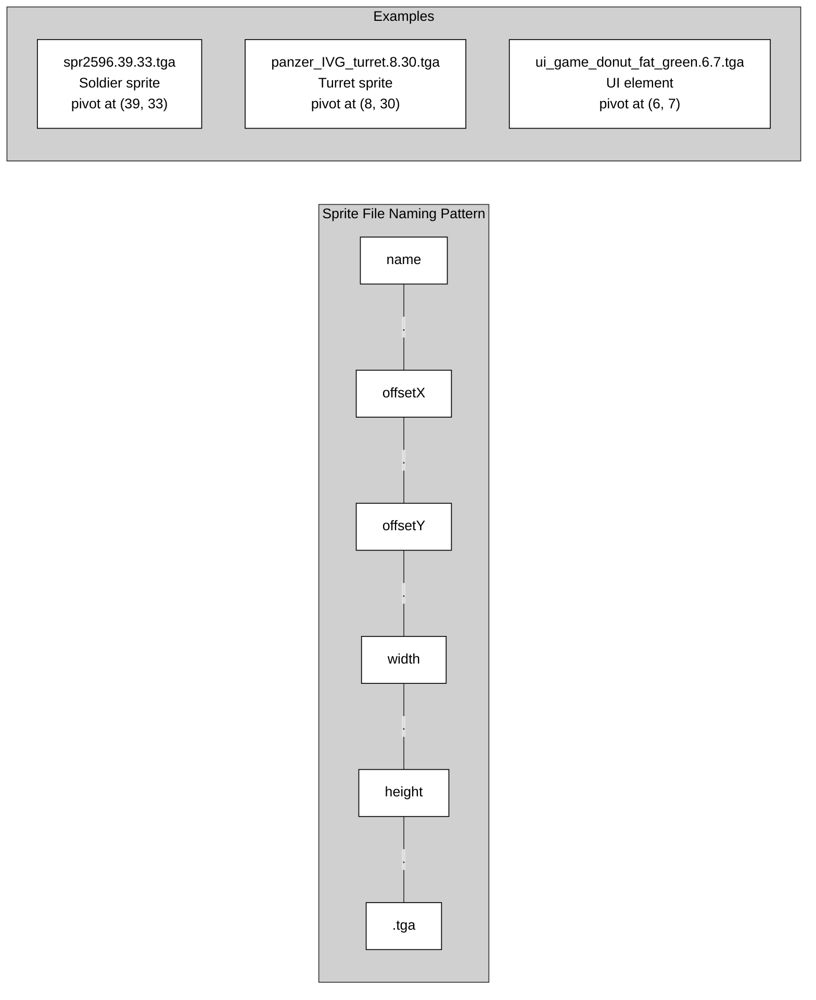
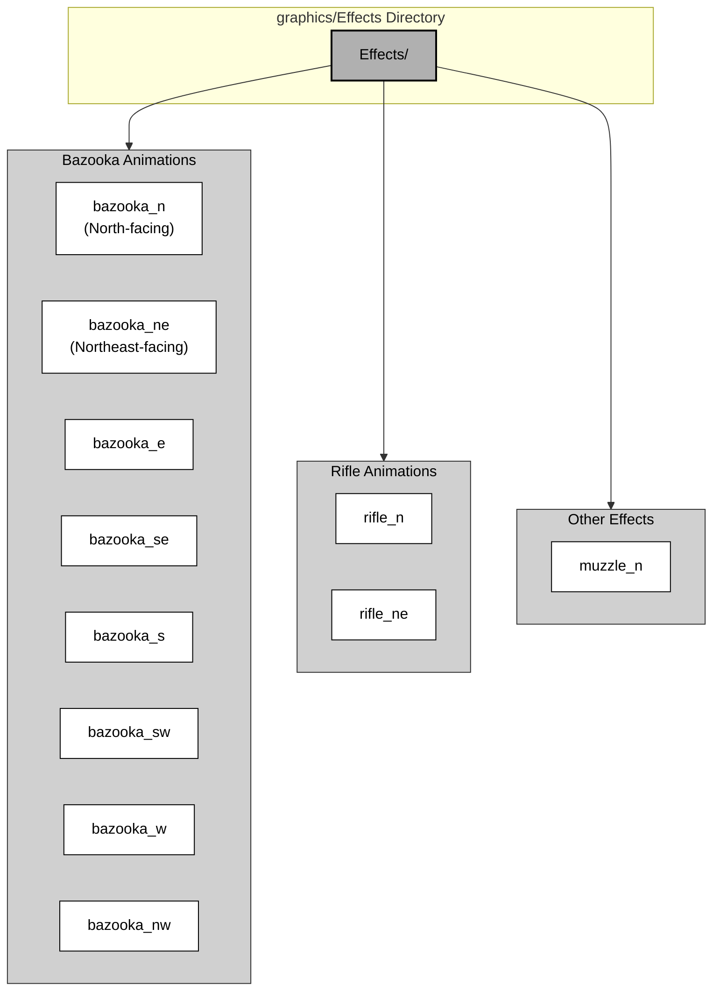
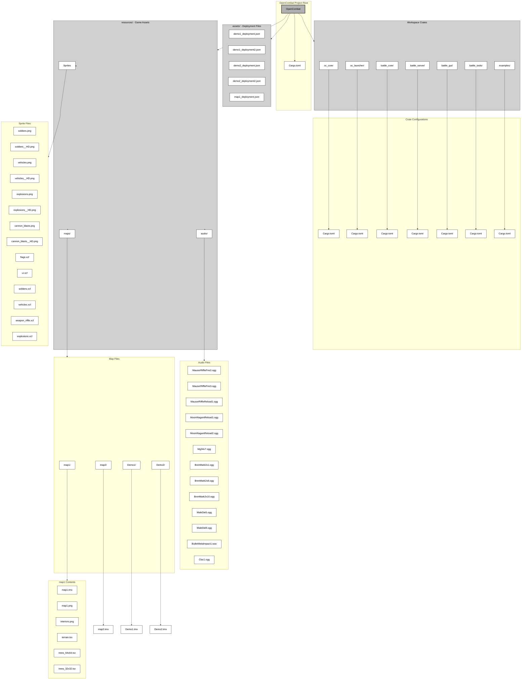
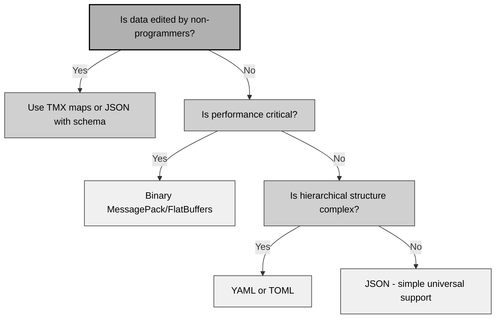
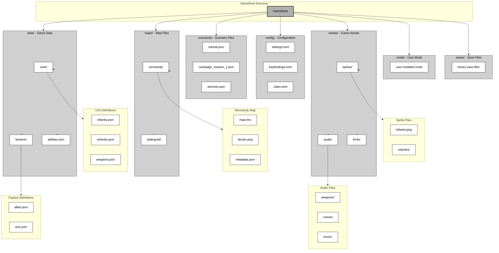
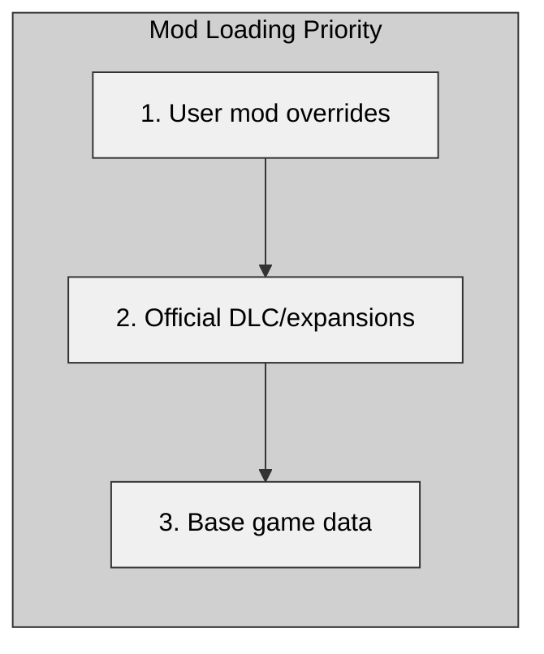
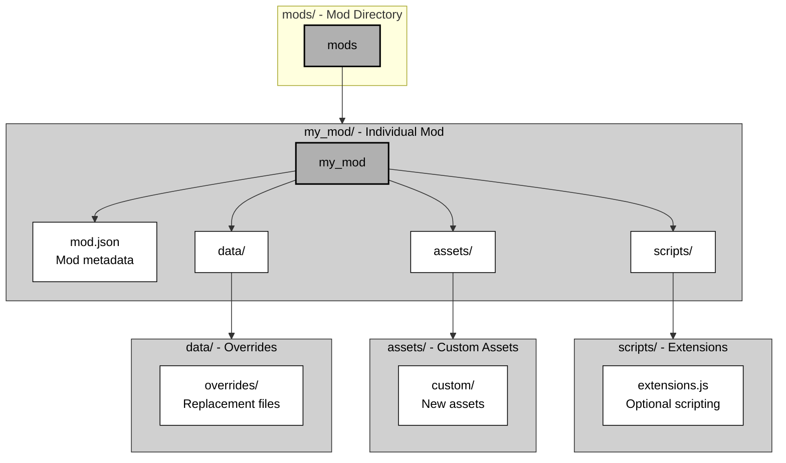

# Appendix C: File Formats and Data Hierarchy

## C.1 Comparative Overview

This appendix analyzes the file formats and data hierarchies used by three Close Combat clone implementations. These formats support modding, data migration between projects, and the design of new tactical wargame architectures.

### C.1.1 File Format Comparison Table

| Aspect | OpenCombat-SDL (C++/SDL) | OpenCombat (Rust/GGEZ) | CloseCombatFree (C++/Qt) |
|--------|-------------------------|------------------------|-------------------------|
| **Primary Data Format** | XML | JSON | QML (declarative) |
| **Map Format** | Proprietary XML-based | TMX (Tiled Map Editor) | QML-based maps |
| **Configuration** | XML files | TOML (Cargo/workspace) | key=value text files |
| **Asset Format** | TGA images, WAV audio | PNG sprites, OGG audio | PNG images |
| **Metadata Encoding** | UTF-8 XML | UTF-8 JSON/TSX | UTF-8 QML |
| **Binary Support** | No (text-only) | No (text-only) | No (text-only) |
| **Schema Validation** | None (loose parsing) | Rust type system | QML engine validation |

### C.1.2 Data Organization Approaches

**OpenCombat-SDL** uses a hierarchical XML structure where game entities are defined in separate configuration files with cross-references by name. Data is organized by entity type (Weapons, Soldiers, Squads) rather than by scenario.

**OpenCombat** uses industry-standard formats (TMX for maps, JSON for deployments) with strict separation between:
- Static world data (maps, terrain)
- Dynamic game state (unit deployments)
- Asset definitions (sprites, audio)

**CloseCombatFree** uses QML's declarative nature and treats data files as executable code. Complex behaviors can be embedded directly in data files, which blurs the line between data and logic.

### C.1.3 Modding Capabilities Summary

| Capability | OpenCombat-SDL | OpenCombat | CloseCombatFree |
|------------|---------------|------------|-----------------|
| **Data-Driven Units** | Full | Partial (hardcoded weapons) | Full |
| **Custom Scenarios** | Yes (XML maps) | Yes (JSON deployments) | Yes (QML scenarios) |
| **Asset Replacement** | Simple (file swap) | Simple (file swap) | Simple (file swap) |
| **Custom Maps** | Yes (requires map editor) | Yes (Tiled editor) | Yes (QML editing) |
| **Scripting Support** | No | No | Yes (JavaScript in QML) |
| **Hot Reload** | No | No | Yes (QML dynamic loading) |

---

## C.2 OpenCombat-SDL File System

### C.2.1 Directory Structure



### C.2.2 XML File Specifications

#### C.2.2.1 Soldiers.xml Structure

The soldier definition file establishes unit types and links state machines to animation resources.

**Root Element**: `<Soldiers>`

**Child Elements**:

| Element | Required | Description |
|---------|----------|-------------|
| `<Soldier>` | Yes (multiple) | Individual soldier type definition |
| `<Name>` | Yes | Unique identifier string |
| `<PrimaryWeapon>` | Yes | Reference to Weapons.xml entry |
| `<PrimaryWeaponNumClips>` | Yes | Initial ammunition loadout |
| `<States>` | Yes | Container for state definitions |
| `<Attributes>` | Yes | Physical capabilities |

**Example Structure**:
```xml
<?xml version="1.0" encoding="utf-8"?>
<Soldiers>
    <Soldier>
        <Name>Garand</Name>
        <PrimaryWeapon>M1 Garand</PrimaryWeapon>
        <PrimaryWeaponNumClips>4</PrimaryWeaponNumClips>
        <States>
            <State>
                <Name>Standing</Name>
                <Animation>Standing Rest</Animation>
            </State>
            <!-- Additional states... -->
        </States>
        <Attributes>
            <WalkingSpeed>2.5</WalkingSpeed>
            <WalkingAcceleration>1.0</WalkingAcceleration>
            <RunningSpeed>5.36</RunningSpeed>
            <CanMove />
            <CanFire />
            <!-- Capability flags (empty elements) -->
        </Attributes>
    </Soldier>
</Soldiers>
```

**State Definition Fields**:

| Field | Type | Description |
|-------|------|-------------|
| `Name` | String | State identifier (Standing, Prone, Walking, etc.) |
| `Animation` | String | Animation name from SoldierAnimations.xml |
| `reverse` | Boolean attribute | Play animation backwards (for transitions) |

**Attribute Fields**:

| Field | Type | Units | Description |
|-------|------|-------|-------------|
| `WalkingSpeed` | Float | m/s | Base walking velocity |
| `WalkingAcceleration` | Float | m/s² | Walking acceleration rate |
| `SneakingSpeed` | Float | m/s | Crawling/sneaking velocity |
| `RunningSpeed` | Float | m/s | Sprinting velocity |
| `RunningAcceleration` | Float | m/s² | Running acceleration rate |
| `CanMove` | Flag | - | Unit can change position |
| `CanFire` | Flag | - | Unit can engage targets |
| `CanDefend` | Flag | - | Unit can assume defensive posture |
| `CanAmbush` | Flag | - | Unit can set ambush |
| `CanSmoke` | Flag | - | Unit can deploy smoke |
| `CanSneak` | Flag | - | Unit can crawl/sneak |
| `CanMoveFast` | Flag | - | Unit can run |

#### C.2.2.2 Weapons.xml Structure

Weapon definitions specify ballistic properties, timing, and resource references.

**Root Element**: `<Weapons>`

**Weapon Element Attributes**:

| Attribute | Type | Description |
|-----------|------|-------------|
| `earthShaker` | Boolean | Indicates artillery/tank gun ( Area effect) |

**Child Elements**:

| Element | Type | Units | Description |
|---------|------|-------|-------------|
| `<Name>` | String | - | Unique weapon identifier |
| `<Icon>` | String | - | Icon reference from Icons.xml |
| `<Sound>` | String | - | Sound effect name from SoundEffects.xml |
| `<Animation>` | String | - | Animation type (Rifle, Machine Gun, Bazooka, Muzzle) |
| `<RoundsPerClip>` | Integer | - | Magazine capacity |
| `<RoundsPerBurst>` | Integer | - | Automatic fire burst size |
| `<ReloadTimeChamber>` | Integer | milliseconds | Single round reload time |
| `<ReloadTimeClip>` | Integer | milliseconds | Full magazine reload time |
| `<TimeToFire>` | Integer | milliseconds | Fire animation duration |
| `<MaxEffectiveRange>` | Integer | meters | Maximum accurate range |
| `<WeaponWeight>` | Float | pounds | Carry weight penalty |
| `<ClipWeight>` | Float | pounds | Magazine weight |
| `<CoolRate>` | Integer | milliseconds | Weapon cooling per tick |
| `<HeatRate>` | Integer | milliseconds | Heat generated per shot |
| `<BaseAccuracy>` | Float | MOA | Base accuracy (lower is better) |

**Example**:
```xml
<Weapon>
    <Name>M1 Garand</Name>
    <Icon>M1 Garand</Icon>
    <Sound>Rifle</Sound>
    <Animation>Rifle</Animation>
    <RoundsPerClip>8</RoundsPerClip>
    <RoundsPerBurst>1</RoundsPerBurst>
    <ReloadTimeChamber>400</ReloadTimeChamber>
    <ReloadTimeClip>8000</ReloadTimeClip>
    <TimeToFire>400</TimeToFire>
    <MaxEffectiveRange>460</MaxEffectiveRange>
    <WeaponWeight>10</WeaponWeight>
    <ClipWeight>1</ClipWeight>
    <CoolRate>500</CoolRate>
    <HeatRate>300</HeatRate>
    <BaseAccuracy>1.00</BaseAccuracy>
</Weapon>
```

#### C.2.2.3 Vehicles.xml Structure

Vehicle definitions nest structures for turret and hull components.

**Root Element**: `<Vehicles>`

**Vehicle Child Elements**:

| Element | Required | Description |
|---------|----------|-------------|
| `<Name>` | Yes | Vehicle type identifier |
| `<MaxRoadSpeed>` | Yes | Maximum velocity (m/s) |
| `<Acceleration>` | Yes | Acceleration rate (m/s²) |
| `<Turret>` | Conditional | Turret component (if applicable) |
| `<Hull>` | Yes | Hull component |
| `<Wreck>` | Yes | Destroyed vehicle graphic |

**Turret/Hull Structure**:

| Element | Type | Description |
|---------|------|-------------|
| `<Graphic>` | String | Sprite file path (format: `path.width.height.tga`) |
| `<PositionX>` | Integer | Offset from vehicle origin (pixels) |
| `<PositionY>` | Integer | Offset from vehicle origin (pixels) |
| `<PrimaryMuzzleX>` | Integer | Muzzle flash offset (pixels) |
| `<PrimaryMuzzleY>` | Integer | Muzzle flash offset (pixels) |
| `<RotationRate>` | Integer | Time to rotate 22.5° (milliseconds) |
| `<Weapon>` | Element | Weapon slot assignment |

**Weapon Slot Attributes**:

| Attribute | Description |
|-----------|-------------|
| `slot` | Integer slot index (0=turret primary, 1=hull secondary) |
| `clips` | Integer ammunition count |

**Example**:
```xml
<Vehicle>
    <Name>Panzer IVG</Name>
    <MaxRoadSpeed>10.55</MaxRoadSpeed>
    <Acceleration>1.32</Acceleration>
    <Turret>
        <Graphic>Vehicles/panzer_IVG_turret.8.30.tga</Graphic>
        <PositionX>12</PositionX>
        <PositionY>21</PositionY>
        <PrimaryMuzzleX>0</PrimaryMuzzleX>
        <PrimaryMuzzleY>33</PrimaryMuzzleY>
        <RotationRate>1000</RotationRate>
        <Weapon slot="0" clips="32">7.5cm L48</Weapon>
    </Turret>
    <Hull>
        <Graphic>Vehicles/panzer_IVG_hull.12.21.tga</Graphic>
        <RotationRate>2000</RotationRate>
        <Weapon slot="1" clips="8">.30 Cal MG</Weapon>
    </Hull>
    <Wreck>
        <Graphic>Vehicles/panzer_IVG_wreck.11.21.tga</Graphic>
    </Wreck>
</Vehicle>
```

#### C.2.2.4 Squads.xml Structure

Squad templates define unit compositions for scenario deployment.

**Root Element**: `<Squads>`

**Squad Structure**:

| Element | Description |
|---------|-------------|
| `<Name>` | Squad type identifier |
| `<Icon>` | Squad icon reference |
| `<Soldier>` | Individual soldier (multiple) |
| `<Vehicle>` | Optional vehicle with crew |

**Soldier Element**:

| Element | Description |
|---------|-------------|
| `<Title>` | Role (Leader, Gunner, Driver, etc.) |
| `<Rank>` | Military rank |
| `<Type>` | Soldier type from Soldiers.xml |
| `<Camo>` | Camouflage pattern reference |

**Vehicle Element**:

| Attribute | Description |
|-----------|-------------|
| `slot` | Crew position (-1=driver, 0+=crew positions) |

### C.2.3 Asset Organization

#### C.2.3.1 Sprite File Naming Convention

Sprite files follow a strict naming pattern for automatic loading:



#### C.2.3.2 Animation File Organization

Animations are stored in directional subdirectories:



### C.2.4 Hardcoded vs Configurable Elements

**Fully Configurable via XML**:
- Soldier types and attributes
- Weapon statistics
- Vehicle specifications
- Squad compositions
- Terrain objects
- Sound effects
- Visual effects
- Animation sequences

**Hardcoded in Source**:
- Game mechanics (suppression, morale)
- AI behavior algorithms
- Pathfinding logic
- Ballistic calculations
- Line-of-sight computation
- UI layout and interaction

### C.2.5 Modding Architecture Ideas

The OpenCombat-SDL project includes documentation (`docs/MODDING_ARCHITECTURE_IDEAS.md`) outlining potential improvements:

1. **Mod Directory Support**: Loading mods from separate directories without modifying base files
2. **Override System**: XML files that override base definitions
3. **Mod Manifest**: Metadata file for mod dependencies and versioning
4. **Asset Packs**: ZIP-based asset containers
5. **Hot Reload**: Runtime reloading of modified data files

---

## C.3 OpenCombat File System

### C.3.1 Directory Structure



### C.3.2 JSON Deployment Format

OpenCombat uses JSON files to define scenario deployments, separating static map data from dynamic unit placement.

#### C.3.2.1 Deployment Schema

**Root Structure**:
```json
{
    "soldiers": [ SoldierObject, ... ]
}
```

**Soldier Object**:

| Field | Type | Description |
|-------|------|-------------|
| `uuid` | Integer | Unique unit identifier |
| `side` | String | Team allegiance ("A" or "B") |
| `world_point` | Object | Position {x: float, y: float} |
| `squad_uuid` | Integer | Squad membership |
| `main_weapon` | Object | Weapon configuration |
| `magazines` | Array | Ammunition inventory |
| `order` | String | Initial order state ("Idle") |
| `behavior` | Object | Behavior state machine |

#### C.3.2.2 Weapon Configuration

Weapons use a nested structure with boolean flags and ammunition type:

```json
{
    "MosinNagantM1924": [
        false,                      // Boolean flag (possibly safety)
        {
            "MosinNagant": 5       // Ammunition type: rounds loaded
        }
    ]
}
```

**Alternative Format** (Mauser variant):
```json
{
    "MauserG41": [
        false,
        {
            "Mauser": 5
        }
    ]
}
```

#### C.3.2.3 Magazine Inventory

Magazines are stored as an array of objects:

```json
"magazines": [
    {"MosinNagant": 5},  // Magazine 1: 5 rounds
    {"MosinNagant": 5},  // Magazine 2: 5 rounds
    {"MosinNagant": 5},  // Magazine 3: 5 rounds
    {"MosinNagant": 5},  // Magazine 4: 5 rounds
    {"MosinNagant": 5},  // Magazine 5: 5 rounds
    {"MosinNagant": 5},  // Magazine 6: 5 rounds
    {"MosinNagant": 5},  // Magazine 7: 5 rounds
    {"MosinNagant": 5}   // Magazine 8: 5 rounds
]
```

#### C.3.2.4 Behavior State Machine

Behavior is defined as a state object:

```json
"behavior": {
    "Idle": "StandUp"
}
```

**Valid States**:
- `"Idle"`: Not performing any action
- `"StandUp"`: Standing posture
- (Additional states likely include prone, kneeling)

### C.3.3 TMX/TSX Map Format

OpenCombat uses the Tiled Map Editor format (TMX) for maps, enabling professional-grade map creation.

#### C.3.3.1 TMX Structure

```xml
<?xml version="1.0" encoding="UTF-8"?>
<map version="1.10" 
     tiledversion="1.10.0" 
     orientation="orthogonal" 
     renderorder="right-down" 
     width="112" 
     height="64" 
     tilewidth="5" 
     tileheight="5" 
     infinite="0">
    
    <!-- External tileset references -->
    <tileset firstgid="1" source="terrain.tsx"/>
    <tileset firstgid="2001" source="trees_64x64.tsx"/>
    <tileset firstgid="2010" source="trees_32x32.tsx"/>
    
    <!-- Background imagery -->
    <imagelayer id="2" name="background_image">
        <image source="map1.png" width="560" height="320"/>
    </imagelayer>
    
    <!-- Interior overlays -->
    <imagelayer id="6" name="interiors_image">
        <image source="interiors.png" width="560" height="320"/>
    </imagelayer>
    
    <!-- Terrain grid (CSV encoded) -->
    <layer id="1" name="terrain" width="112" height="64">
        <data encoding="csv">
            1,1,1,1,4,4,4,...
        </data>
    </layer>
    
    <!-- Decorative objects -->
    <layer id="3" name="decor" width="112" height="64">
        <data encoding="csv">
            0,0,2010,0,...
        </data>
    </layer>
    
    <!-- Gameplay zones -->
    <objectgroup id="4" name="interiors_zones">
        <object id="9" x="24.6667" y="108.667" 
                width="72.6667" height="61.3333"/>
    </objectgroup>
    
    <!-- Victory flags -->
    <objectgroup id="8" name="flags"/>
    
    <!-- Spawn locations -->
    <objectgroup id="7" name="spawn_zones">
        <object id="18" name="NW" x="0" y="0" 
                width="148.4" height="109.2"/>
        <object id="19" name="W" x="0" y="108.8" 
                width="116.2" height="85.6"/>
        <!-- Additional zones: SW, S, N, SE, E, NE -->
    </objectgroup>
</map>
```

#### C.3.3.2 TMX Map Attributes

| Attribute | Description |
|-----------|-------------|
| `orientation` | Map projection (orthogonal/isometric) |
| `renderorder` | Tile rendering sequence |
| `width` | Map width in tiles |
| `height` | Map height in tiles |
| `tilewidth` | Individual tile width (pixels) |
| `tileheight` | Individual tile height (pixels) |
| `infinite` | Infinite map support (0=disabled) |

#### C.3.3.3 Layer Types

**Image Layers**:
- `background_image`: Base terrain texture
- `interiors_image`: Building interior overlays

**Tile Layers**:
- `terrain`: Ground type grid (CSV encoded tile IDs)
- `decor`: Decorative objects (trees, rocks)

**Object Groups**:
- `interiors_zones`: Building bounding boxes
- `flags`: Victory condition locations
- `spawn_zones`: Unit deployment areas

#### C.3.3.4 Tileset References (TSX)

External tilesets are referenced by `firstgid` (first global tile ID):

```xml
<tileset firstgid="1" source="terrain.tsx"/>
<tileset firstgid="2001" source="trees_64x64.tsx"/>
<tileset firstgid="2010" source="trees_32x32.tsx"/>
```

**Tile ID Calculation**:
- Tile ID = `firstgid` + local_tile_index
- Terrain tiles: 1-2000
- Large trees: 2001-2009
- Small trees: 2010+

### C.3.4 Configuration System

#### C.3.4.1 Cargo.toml Workspace

The project uses Cargo workspace for multi-crate organization:

```toml
[workspace]
resolver = "2"

members = [
    "oc_core",        # Core game logic
    "oc_launcher",    # Game launcher UI
    "battle_core",    # Battle simulation
    "battle_server",  # Multiplayer server
    "battle_gui",     # Game GUI
    "battle_tools",   # Map/deployment editors
    "examples",       # Usage examples
]
```

#### C.3.4.2 Crate-Level Configuration

Example from `oc_launcher/Cargo.toml`:

```toml
[package]
name = "oc_launcher"
version = "0.1.0"
authors = ["Sevajol Bastien <contact@bux.fr>"]
edition = "2021"

[dependencies]
eframe = "0.22.0"      # egui framework
anyhow = "1.0.69"      # Error handling
thiserror = "1.0.39"   # Custom errors
env_logger = "0.10.0"  # Logging
image = "0.24.7"       # Image processing
```

### C.3.5 Asset Specifications

#### C.3.5.1 Sprite Format

- **Format**: PNG (Portable Network Graphics)
- **Variants**: Standard and HD (`__HD` suffix)
- **Organization**: Spritesheets containing multiple frames
- **Naming**: `category[_modifier].png`

**Sprite Categories**:
- `soldiers.png`: Infantry animations
- `vehicles.png`: Vehicle graphics
- `explosions.png`: Effect animations
- `cannon_blasts.png`: Muzzle flash effects

#### C.3.5.2 Audio Format

- **Format**: OGG Vorbis (primary), WAV (effects)
- **Naming Convention**: `[Description][Variant].[format]`
- **Categories**:
  - Weapon fire: `[Weapon]Fire[Variant].ogg`
  - Reload: `[Weapon]Reload[Variant].ogg`
  - Voices: `[Gender][Action][Variant].ogg`
  - Impacts: `[Type]Impact[Variant].wav`

**Examples**:
- `MauserRiffleFire2.ogg` - Mauser rifle fire variant 2
- `MosinNagantReload1.ogg` - Mosin-Nagant reload sound
- `BrenMark2x8.ogg` - Bren machine gun 8-round burst
- `MaleDie5.ogg` - Male soldier death sound 5
- `BulletMetalmpact1.wav` - Bullet impact on metal

---

## C.4 CloseCombatFree File System

### C.4.1 Directory Structure

```mermaid
flowchart TD
    subgraph ROOT["closecombatfree Root"]
        root["closecombatfree"]
        proj_file["closecombatfree.pro"]
    end

    subgraph CONFIG["Configuration Files"]
        cfg_config["config"]
        cfg_old["config_old"]
        cfg_dev["developer.docconf"]
        cfg_user["user.docconf"]
        cfg_icon["ccf_icon.png"]
    end

    subgraph QML["qml/ - Application Code"]
        qml_main["main.qml"]
        qml_campaigns["campaigns/"]
        qml_effects["effects/"]
        qml_gui["gui/"]
        qml_maps["maps/"]
        qml_menus["menus/"]
        qml_scenarios["scenarios/"]
        qml_units["units/"]
        qml_weather["weather/"]
    end

    subgraph CAMPAIGNS["Campaign Components"]
        camp_list["CampaignList.qml"]
        camp_map["CampaignMapList.qml"]
        camp_desc["CampaignDescriptionGui.qml"]
    end

    subgraph EFFECTS["Effect Components"]
        eff_effect["Effect.qml"]
        eff_gun["GunFireEffect.qml"]
        eff_shadow["Shadow.qml"]
        eff_exhaust["VehicleExhaust.qml"]
        eff_explode["VehicleExplosion.qml"]
    end

    subgraph GUI["GUI Components"]
        gui_defence["DefenceSphere.qml"]
        gui_order["OrderMarker.qml"]
        gui_popup["PopUpArrow.qml"]
        gui_rubber["RubberBand.qml"]
        gui_info["SimpleInfoBox.qml"]
        gui_select["UnitSelectionBox.qml"]
        gui_zoom["ZoomBox.qml"]
        gui_zbtn["ZoomButton.qml"]
        gui_menus["menus/"]
        gui_entries["menuEntries/"]
    end

    subgraph GUIMENUS["GUI Menus"]
        menu_about["AboutMenu.qml"]
        menu_bottom["BottomMenu.qml"]
        menu_ctx["ContextMenu.qml"]
        menu_opts["OptionsMenu.qml"]
        menu_prefs["PreferencesMenu.qml"]
        menu_prefs2["PreferencesMenu2.qml"]
        menu_text["PreferencesSingleTextInputEntry.qml"]
        menu_roster["RosterMenu.qml"]
        menu_soldier["SoldierMenu.qml"]
        menu_status["StatusMessageMenu.qml"]
        menu_top["TopMenu.qml"]
    end

    submenu_entry1["CardMenuEntry.qml"]
    submenu_entry2["ContextMenuEntry.qml"]
    submenu_entry3["LoadGameEntries.qml"]
    submenu_entry4["MenuEntry.qml"]
    submenu_entry5["PreferencesCheckboxEntry.qml"]
    submenu_entry6["PreferencesScreenSizeEntry.qml"]
    submenu_entry7["RosterMenuEntry.qml"]
    submenu_entry8["ScenarioMenuEntry.qml"]
    submenu_entry9["StatusMessageMenuEntry.qml"]

    subgraph MAPS["Maps"]
        map_cluster["MapCluster.qml"]
        map_props["props/"]
    end

    subgraph PROPS["Map Props"]
        prop_qml["Prop.qml"]
        prop_cluster["PropCluster.qml"]
        prop_rect["PropRectangle.qml"]
    end

    subgraph MENUS["Application Menus"]
        app_campaign["CampaignMenu.qml"]
        app_load["LoadGameMenu.qml"]
        app_main["MainMenu.qml"]
        app_saved["SavedGamesMenu.qml"]
        app_scenario["ScenarioMenu.qml"]
    end

    subgraph SCENARIOS["Scenarios"]
        scene_qml["Scenario.qml"]
    end

    subgraph UNITS["Units"]
        unit_qml["Unit.qml"]
        unit_tanks["tanks/"]
    end

    subgraph TANKS["Tank Components"]
        tank_hull["Hull.qml"]
        tank_tank["Tank.qml"]
        tank_turret["Turret.qml"]
        tank_timg["TurretImage.qml"]
    end

    subgraph WEATHER["Weather"]
        weather_qml["Weather.qml"]
    end

    subgraph MAPFILES["Map Files"]
        map_tst1["Map_tst1.qml"]
        map_tst2["Map_tst2.qml"]
        map_tst3["Map_tst3.qml"]
        map_tst4["Map_tst4.qml"]
        map_props_dir["props/"]
    end

    subgraph MAPPROPS["Map Props"]
        prop_house["HouseBasic_tst.qml"]
        prop_tree["Tree_tst.qml"]
    end

    subgraph UNITTESTS["Unit Test Files"]
        test_tank1["Tank_tst1.qml"]
        test_tank1_hull["Tank_tst1_hull.qml"]
        test_tank1_turret["Tank_tst1_turret.qml"]
        test_tank2["Tank_tst2.qml"]
        test_tank2_turret["Tank_tst2_turret.qml"]
        test_tank3["Tank_tst3.qml"]
        test_tank3_hull["Tank_tst3_hull.qml"]
    end

    subgraph SCENEFILES["Scenario Files"]
        scene_tst1["Scenario_tst1.qml"]
        scene_tst2["Scenario_tst2.qml"]
        scene_tst3["Scenario_tst3.qml"]
        scene_tst4["Scenario_tst4.qml"]
    end

    subgraph CAMPAIGNFILES["Campaign Files"]
        camp_tst1["Campaign_tst1.qml"]
    end

    subgraph SAVES["Save Files"]
        save1["temp_save1.qml"]
        save2["temp_save2.qml"]
        save3["temp_save3.qml"]
        save4["temp_save4.qml"]
    end

    subgraph EDITOR["Editor"]
        editor_qml["ScenarioEditor.qml"]
    end

    root --> proj_file
    root --> CONFIG
    root --> QML
    root --> MAPFILES
    root --> UNITTESTS
    root --> SCENEFILES
    root --> CAMPAIGNFILES
    root --> SAVES
    root --> EDITOR

    qml_main --> CAMPAIGNS
    qml_effects --> EFFECTS
    qml_gui --> GUI
    qml_maps --> MAPS
    qml_menus --> MENUS
    qml_scenarios --> SCENARIOS
    qml_units --> UNITS
    qml_weather --> WEATHER

    GUI --> gui_menus
    gui_menus --> GUIMENUS
    gui_entries --> submenu_entry1
    gui_entries --> submenu_entry2
    gui_entries --> submenu_entry3
    gui_entries --> submenu_entry4
    gui_entries --> submenu_entry5
    gui_entries --> submenu_entry6
    gui_entries --> submenu_entry7
    gui_entries --> submenu_entry8
    gui_entries --> submenu_entry9

    MAPS --> map_props
    map_props --> PROPS

    UNITS --> unit_tanks
    unit_tanks --> TANKS

    MAPFILES --> map_props_dir
    map_props_dir --> MAPPROPS

    classDef default fill:#fff,stroke:#000,stroke-width:1px,color:#000
    classDef light fill:#f0f0f0,stroke:#333,stroke-width:1px,color:#000
    classDef medium fill:#d0d0d0,stroke:#333,stroke-width:1px,color:#000
    classDef dark fill:#b0b0b0,stroke:#000,stroke-width:2px,color:#000

    class root dark
    class CONFIG,QML,MAPFILES,UNITTESTS,SCENEFILES,CAMPAIGNFILES,SAVES,EDITOR medium
```



### C.4.2 QML Declarative Data

CloseCombatFree treats data files as executable QML code, allowing complex behaviors to be embedded in data.

#### C.4.2.1 Scenario File Structure

**Scenario_tst1.qml**:
```qml
import QtQuick 2.1
import "../units/tanks/tests"
import "../qml/units"

Item {
    property string mapFile: "maps/Map_tst2.qml"
    
    id: root
    
    Tank_tst1 {
        objectName: "tank1"
        x: 150
        y: 400
    }
    
    Tank_tst3 {
        objectName: "tank2"
        x: 300
        y: 400
    }
    
    Tank_tst1 {
        objectName: "tank3"
        x: 450
        y: 400
        rotation: 90
        hullColor: "#ffffff"
    }
}
```

**Scenario Properties**:

| Property | Type | Description |
|----------|------|-------------|
| `mapFile` | String | Reference to map QML file |
| `objectName` | String | Unique instance identifier |
| `x`, `y` | Number | World position (pixels) |
| `rotation` | Number | Orientation (degrees) |

#### C.4.2.2 Map File Structure

**Map_tst1.qml**:
```qml
import QtQuick 2.1
import QmlBase 0.1
import "../qml/maps"

Map {
    backgroundImage: "img/maps/test2.png"
}
```

**Map Properties**:

| Property | Type | Description |
|----------|------|-------------|
| `backgroundImage` | String | Path to background texture |

#### C.4.2.3 Unit Definition Structure

**Tank_tst1.qml**:
```qml
import QtQuick 2.1
import QmlBase 0.1
import "../../../qml/units"
import "../../../qml/units/tanks"

Tank {
    id: root
    unitFileName: "Tank_tst1"
    unitType: "Test tank 1"
    unitLogo: "../../../img/units/tanks/generic/tank_tst1_logo.png"
    rotationSpeed: 40
    turretRotationSpeed: 35
    maxSpeed: 20
    acceleration: 2
    unitWidth: 62
    unitHeight: 100
    
    Tank_tst1_hull {
        id: hull
    }
    
    Tank_tst1_turret {
        id: turret
    }
    
    Soldier {
        role: "Commander"
    }
    
    Soldier {
        role: "Gunner"
    }
    
    Soldier {
        role: "Loader"
    }
    
    Soldier {
        role: "Assistant"
    }
    
    Soldier {
        role: "Assistant"
    }
}
```

**Unit Properties**:

| Property | Type | Description |
|----------|------|-------------|
| `unitFileName` | String | Base filename for serialization |
| `unitType` | String | Display name |
| `unitLogo` | String | Icon path |
| `rotationSpeed` | Number | Hull rotation speed (deg/sec) |
| `turretRotationSpeed` | Number | Turret rotation speed (deg/sec) |
| `maxSpeed` | Number | Maximum velocity (pixels/sec) |
| `acceleration` | Number | Acceleration rate |
| `unitWidth` | Number | Collision width (pixels) |
| `unitHeight` | Number | Collision height (pixels) |
| `hullColor` | Color | Custom hull color (hex) |

### C.4.3 Configuration Format

CloseCombatFree uses simple key=value configuration files:

#### C.4.3.1 Configuration File Structure

**config**:
```ini
# Close Combat Free - cofiguration file
# Lines beginning with '#' are comments
# Accepted format is: "option = value"
# Option names and values are expected to be given in lower case.
# Boolean switches accept "true", "false", '1', '0'
# This file should be encoded in UTF-8.

######
# General settings:
uimode = desktop
maximised = false
remember dimensions on exit = true
width = 1270
height = 706

######
# Keyboard layout:
pause = p
zoom in = =
zoom out = -
quit = q

# Orders:
follow = f
stop = s
move fast = r
move = m
sneak = n
attack = a
smoke = k
defend = d
ambush = b
toggle top menu = t
toggle bottom menu = g
```

#### C.4.3.2 Configuration Options

**Display Settings**:

| Option | Type | Description |
|--------|------|-------------|
| `uimode` | String | UI mode (desktop/tablet) |
| `maximised` | Boolean | Start maximized |
| `remember dimensions on exit` | Boolean | Save window size |
| `width` | Integer | Window width (pixels) |
| `height` | Integer | Window height (pixels) |

**Keyboard Bindings**:

| Option | Default | Description |
|--------|---------|-------------|
| `pause` | p | Pause game |
| `zoom in` | = | Zoom in |
| `zoom out` | - | Zoom out |
| `quit` | q | Exit game |
| `follow` | f | Follow unit order |
| `stop` | s | Stop order |
| `move fast` | r | Fast movement |
| `move` | m | Normal movement |
| `sneak` | n | Sneak/crawl |
| `attack` | a | Attack order |
| `smoke` | k | Deploy smoke |
| `defend` | d | Defend position |
| `ambush` | b | Ambush order |
| `toggle top menu` | t | Show/hide top menu |
| `toggle bottom menu` | g | Show/hide bottom menu |

### C.4.4 Save Game Format

Save files are valid QML files that can be loaded directly:

**temp_save1.qml**:
```qml
import QtQuick 2.1
import "../units/tanks/tests"
import "../qml/units"

Item {
    property string mapFile: "maps/Map_tst2.qml"
    
    id: root
    
    Tank_tst1 {
        objectName: "tank1"
        x: 150
        y: 400
        rotation: 0
    }
    
    Tank_tst3 {
        objectName: "tank2"
        x: 300
        y: 400
        rotation: 0
    }
    
    Tank_tst1 {
        objectName: "tank3"
        x: 450
        y: 400
        rotation: 90
    }
    
    Tank_tst1 {
        objectName: "tank4"
        x: 596
        y: 270
        rotation: 358.23760897634
    }
    
    Tank_tst2 {
        objectName: "tank5"
        x: 752
        y: 280
        rotation: 0.954841253872189
    }
    
    Tank_tst3 {
        objectName: "tank6"
        x: 617
        y: 69
        rotation: 314.565949367861
    }
}
```

**Save vs Scenario Differences**:
- Save files include precise rotation values (floating point)
- Save files capture exact positions (may differ from initial)
- Same structure allows loading saves as scenarios

---

## C.5 Format Comparison Analysis

### C.5.1 Human-Readable vs Binary

All three projects use text-based formats exclusively:

| Project | Format | Human Readability | Editability |
|---------|--------|-------------------|-------------|
| OpenCombat-SDL | XML | High | Moderate (verbose) |
| OpenCombat | JSON/TMX | Very High | High (standard formats) |
| CloseCombatFree | QML | High | Very High (executable) |

**Trade-offs**:
- **Text formats**: Easy to debug, version control friendly, human-editable
- **No binary**: Larger file sizes, slower parsing, but maximum transparency

### C.5.2 Modifiability Comparison

| Aspect | OpenCombat-SDL | OpenCombat | CloseCombatFree |
|--------|---------------|------------|-----------------|
| **Schema Flexibility** | Loose (extra elements ignored) | Strict (Rust types) | Flexible (QML dynamic) |
| **Type Safety** | Runtime validation | Compile-time checking | Runtime QML engine |
| **Error Messages** | Generic XML parser | Detailed Rust errors | QML console output |
| **Hot Reload** | Requires restart | Requires restart | Supported (QML) |
| **Validation Tools** | None | Cargo build | Qt Creator |

### C.5.3 Tool Ecosystem

**OpenCombat-SDL**:
- No specialized tools
- Generic XML editors
- Manual file editing

**OpenCombat**:
- **Tiled Map Editor**: Professional map creation
- **JSON Schema**: Could be implemented for validation
- **Rust toolchain**: Built-in formatting (rustfmt), linting (clippy)

**CloseCombatFree**:
- **Qt Creator**: Full IDE with QML support
- **QML Scene**: Runtime preview
- **Built-in editor**: ScenarioEditor.qml for in-game editing

### C.5.4 Version Control Friendliness

All formats work well with Git and other VCS:

| Format | Diffability | Merge Conflicts | Line Endings |
|--------|-------------|-----------------|--------------|
| XML | Good | Moderate | CRLF issues possible |
| JSON | Excellent | Low | Consistent |
| QML | Good | Moderate | Consistent |
| TMX | Poor (long lines) | High | Binary-like CSV |

**Recommendations**:
- Use `.gitattributes` to normalize line endings
- Consider JSON for deployment files (easier merging)
- TMX files: accept that map changes may conflict

---

## C.6 Data Architecture Recommendations

### C.6.1 Choosing File Formats

Based on the analysis of all three projects, here are recommendations for new Close Combat-style games:

#### C.6.1.1 Recommended Format by Use Case

| Use Case | Recommended Format | Rationale |
|----------|-------------------|-----------|
| **Unit Definitions** | JSON or YAML | Human-readable, schema-validatable |
| **Map Data** | TMX | Industry standard, excellent tooling |
| **Scenarios** | JSON | Consistent with units, easy to generate |
| **Configuration** | TOML | Clean syntax, good for user configs |
| **Localization** | JSON or YAML | Nested structure support |
| **Save Games** | Binary (MessagePack) | Performance, file size |
| **Asset Metadata** | JSON | Tool chain integration |

#### C.6.1.2 Format Selection Decision Tree



### C.6.2 Directory Organization

Recommended structure combining best practices:



### C.6.3 Modding Support Architecture

#### C.6.3.1 Mod Loading Priority



#### C.6.3.2 Mod Package Structure



**mod.json**:
```json
{
    "id": "my_mod",
    "name": "My Custom Mod",
    "version": "1.0.0",
    "author": "Mod Author",
    "description": "Adds new units and maps",
    "dependencies": [],
    "conflicts": [],
    "gameVersion": ">=1.0.0",
    "priority": 100
}
```

#### C.6.3.3 Override Mechanisms

| Mechanism | Implementation | Use Case |
|-----------|---------------|----------|
| **File Replacement** | Same path in mod directory | Asset swaps |
| **Data Merging** | JSON Patch or similar | Partial modifications |
| **Additive** | New IDs in mod namespace | New content |
| **Script Hooks** | Event system | Behavioral changes |

### C.6.4 Migration Strategies

#### C.6.4.1 Migrating from OpenCombat-SDL

**Step 1: XML to JSON Conversion**
```python
# Pseudo-code for Soldiers.xml → soldiers.json
import xml.etree.ElementTree as ET
import json

tree = ET.parse('Soldiers.xml')
root = tree.getroot()

soldiers = []
for soldier in root.findall('Soldier'):
    s = {
        'name': soldier.find('Name').text,
        'primaryWeapon': soldier.find('PrimaryWeapon').text,
        'clips': int(soldier.find('PrimaryWeaponNumClips').text),
        'states': [...],
        'attributes': {...}
    }
    soldiers.append(s)

with open('soldiers.json', 'w') as f:
    json.dump(soldiers, f, indent=2)
```

**Step 2: Asset Renaming**
- Convert TGA to PNG (if needed)
- Remove pivot data from filenames
- Store pivot in JSON metadata

**Step 3: Map Migration**
- Create converter for proprietary map format
- Generate TMX from XML map data
- Rebuild tilesets from terrain definitions

#### C.6.4.2 Migrating from CloseCombatFree

**Step 1: QML to JSON Extraction**
- Parse QML declarative structures
- Extract property values
- Convert to JSON schema

**Step 2: Code Separation**
- Extract logic from QML files
- Move to engine-side scripts
- Keep data as pure JSON

**Step 3: Asset Path Resolution**
- Convert relative QML paths
- Establish new asset pipeline
- Handle Qt resource system differences

#### C.6.4.3 Cross-Project Compatibility

For maximum compatibility between projects:

1. **Standardize on JSON**: Common format all can read/write
2. **Use TMX for maps**: Industry standard, multiple implementations
3. **Define common schema**: Shared unit/weapon structure
4. **Asset naming conventions**: Consistent file organization
5. **Version metadata**: Track format versions for migration

---

## C.7 Summary

This appendix analyzes the file formats and data hierarchies used by three Close Combat clone implementations:

1. **OpenCombat-SDL** uses XML-based configuration with hierarchical entity definitions. It supports data-driven content but requires specialized knowledge for editing.

2. **OpenCombat** uses modern industry standards (JSON, TMX) with strict separation of concerns, enabling professional tooling and clear data boundaries.

3. **CloseCombatFree** uses QML's declarative nature, blurring the line between data and code for maximum flexibility, though it requires understanding of Qt/QML paradigms.

Each approach has distinct advantages: XML provides explicit structure, JSON enables modern tooling integration, and QML offers runtime flexibility. New projects should consider their target audience (modders vs. players), available tooling, and team expertise when selecting file formats.

Section C.6 provides a roadmap for new implementations, suggesting JSON for unit definitions, TMX for maps, and a structured modding architecture that could support content from all three existing projects.
