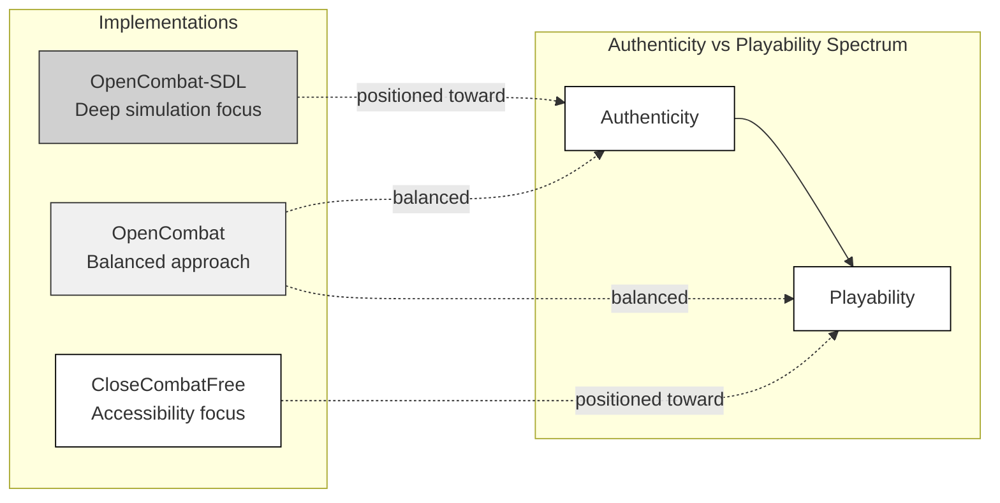
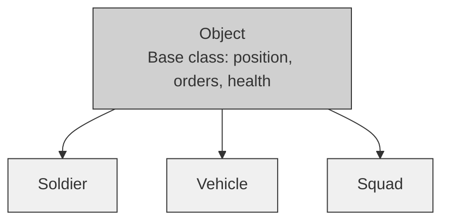
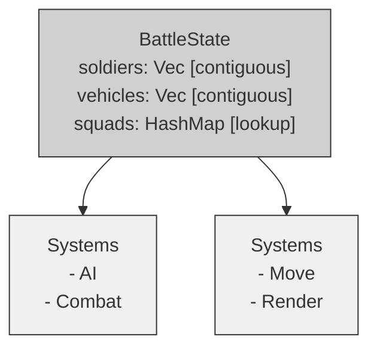
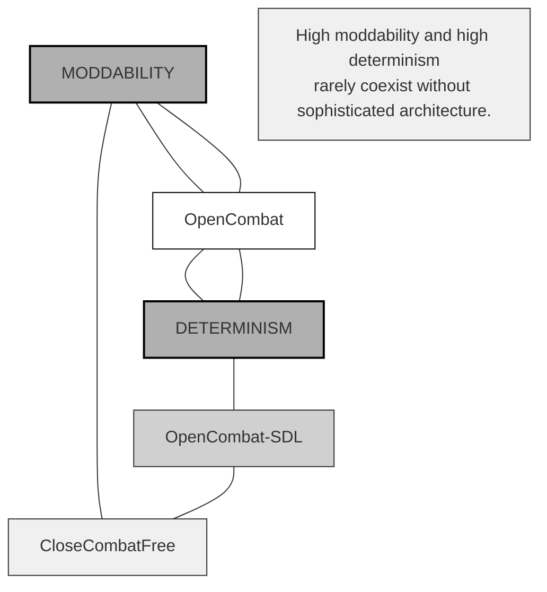
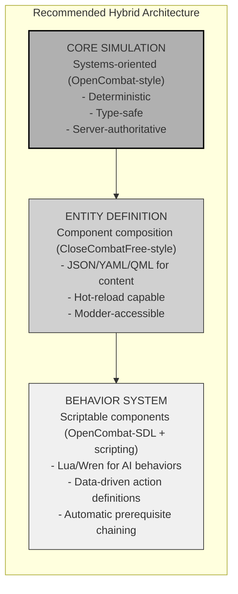
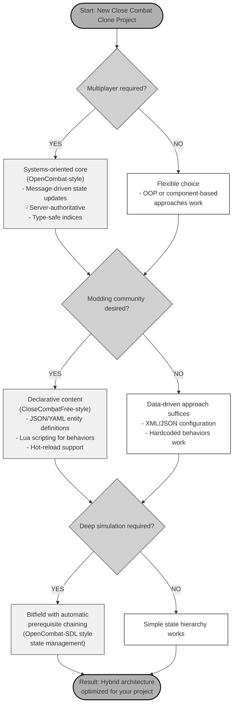

# Chapter 2: Architectural Philosophy

## The Foundations of Tactical Simulation Design

*Three implementations, two decades, one question: how do we model combat in software?*

---

## 2.1 The Nature of Tactical Wargame Simulation

### 2.1.1 What Makes Close Combat Special

Close Combat stands apart in real-time strategy games. Most RTS titles treat units as expendable resources, but Close Combat gives each soldier individual fears, skills, and a will to fight that can shatter under pressure. This human-scale approach creates unique architectural challenges.

**Key Differences:**

| Feature           | Traditional RTS               | Tactical Wargame                            |
| ----------------- | ----------------------------- | ------------------------------------------- |
| **Unit Count**        | Hundreds to thousands         | Dozens to hundreds                          |
| **Unit Identity**     | Generic ("Rifleman #47")      | Individual ("Pvt. John Miller")             |
| **Morale System**     | Binary (alive/dead)           | Continuous (suppressed → panicked → routed) |
| **Time Scale**        | Abstract (minutes per second) | Real-time (1:1 or compressed)               |
| **Combat Resolution** | Hit points, deterministic     | Ballistics, probabilistic                   |
| **Terrain Impact**    | Binary (passable/blocked)     | Complex (cover, concealment, line-of-sight) |

These differences force architectural trade-offs. Systems built for 10,000 identical units collapse when asked to track 50 individuals with unique states, complex morale interactions, and realistic ballistics.

### 2.1.2 The Simulation vs. Game Balance

Tactical wargames constantly balance **simulation authenticity** against **gameplay clarity**. This tension shapes every architectural decision:

**Authenticity Needs:**
- Realistic ballistics with projectile physics
- Detailed morale modeling based on psychology research
- Complex line-of-sight calculations
- Authentic weapon characteristics and limitations
- Realistic command and communication delays

**Playability Needs:**
- Clear feedback for player actions
- Predictable unit responses
- Manageable information display
- Reasonable learning curves
- Engaging pacing

The three implementations in this book occupy different positions on this spectrum:



### 2.1.3 The Authenticity Paradox

More realism doesn't always feel more real. When soldiers behave too erratically—ignoring orders due to morale checks, taking cover unpredictably, or panicking—players call the system "broken" instead of "realistic." The architecture must model reality while keeping player control and predictability intact.

**Three Layers of Authenticity:**

1. **Physical Layer**: Ballistics, line-of-sight, and movement physics need accuracy. Players accept realistic bullet trajectories.

2. **Tactical Layer**: Unit behaviors should follow training and doctrine. A squad ordered to defend should establish fields of fire and use cover.

3. **Psychological Layer**: Morale and suppression effects should create tension, not frustration. Suppressed soldiers should become less effective, not randomly disobedient.

---

## 2.2 The Three Philosophical Approaches

Over two decades, three architectural styles took shape in Close Combat clones. Each carries the fingerprints of its time—hardware limits, design trends, and the ambitions of its creators.

### 2.2.1 OpenCombat-SDL (2005–2008): Simulation First

**Core Idea:** Build the world from the ground up, modeling every soldier, vehicle, and squad as closely as the hardware allows. Let realistic behavior emerge naturally.

OpenCombat-SDL borrowed heavily from military simulation tools of the late 1990s and early 2000s, where accuracy often trumped flexibility.

#### Key Design Choices

**1. Objects Mirror Reality**

The game world is a collection of objects, each with its own state and rules. A simple inheritance tree keeps things organized:



This structure reflects how we think about military units:
- A soldier is a combatant with personal traits
- A vehicle is a mobile platform with crew needs
- A squad coordinates multiple soldiers

**2. State as a Bitfield**

OpenCombat-SDL packs unit states into a 64-bit field, treating each capability as an independent flag:

```cpp
// State as capability composition
class State {
    uint64_t _bits;

public:
    void Set(unsigned int state) { _bits |= (1ULL << state); }
    void Clear(unsigned int state) { _bits &= ~(1ULL << state); }
    bool IsSet(unsigned int state) const { return (_bits >> state) & 1; }
};

// A soldier can be prone, reloading, and suppressed at the same time
State soldierState;
soldierState.Set(StateProne);
soldierState.Set(StateReloading);
soldierState.Set(StateSuppressed);
```

This design lets states combine in unexpected ways, creating emergent behavior without explicit programming.

**3. Automatic Action Chaining**

Actions declare their requirements, and the system handles the rest:

```cpp
// Action definition in SoldierActions.txt
Action RunTo {
    Duration: 2000ms
    Requires: [Standing, Reloaded]
    Adds: [Moving, Running]
    Removes: [Stopped, Walking, Crawling]
}

// When a prone soldier tries to run:
// 1. The system notices the missing prerequisite: Standing
// 2. Finds the StandUp action that adds Standing
// 3. Inserts StandUp before RunTo
// 4. The soldier stands, then runs—no extra code needed
```

**4. XML for Data, C++ for Logic**

OpenCombat-SDL keeps configuration separate from behavior:

```xml
<!-- config/Soldiers.xml -->
<Soldier>
    <Name>Garand</Name>
    <WalkingSpeed>2.5</WalkingSpeed>
    <RunningSpeed>5.36</RunningSpeed>
    <PrimaryWeapon>M1 Garand</PrimaryWeapon>
</Soldier>
```

```cpp
// src/objects/Soldier.cpp - Behavior hardcoded
void Soldier::Simulate(long dt, World* world) {
    // Update position based on current action
    // Check line-of-sight to enemies
    // Update morale based on nearby threats
    // All behavior logic lives here
}
```

#### The Philosophy Behind the Code

**Context (2005–2008):**
- Object-oriented design ruled software engineering
- C++ was the default language for game development
- Military simulation tools shaped game architecture
- Modding wasn't a priority—single-player was king
- Multiplayer wasn't even on the radar

**Strengths:**
- Code structure mirrors game concepts
- Strong encapsulation prevents bugs
- Ideal for simulation-heavy games
- Ran well on hardware of the time

**Trade-offs:**

| Strength                | Weakness                             |
| ----------------------- | ------------------------------------ |
| Intuitive modeling      | Rigid class hierarchies              |
| Clean encapsulation     | Behavior changes require recompiling |
| Natural for simulations | Adding new unit types is difficult   |
| Clear organization      | Object references grow complex       |

### 2.2.2 CloseCombatFree (2011–2012): The Modding-First Philosophy

**Core Philosophy**: Content should be defined declaratively. Modders should create without recompiling. The UI *is* the game.

CloseCombatFree appeared as mobile gaming and declarative UI frameworks gained traction. Its creator saw the developer-modder divide as unnecessary—why force compilation for content creation?

#### Key Tenets

**1. Maximum Extensibility Through QML**

QML, a declarative JavaScript-like syntax, handles both UI and game content:

```qml
// units/tanks/HeavyTank.qml
Tank {
    id: root
    unitType: "Heavy Tank"
    maxSpeed: 18

    // Visual composition
    HeavyTankHull { id: hull }
    HeavyTankTurret { id: turret }

    // Crew composition
    Soldier { role: "Commander" }
    Soldier { role: "Gunner" }
    Soldier { role: "Driver" }

    // Behavior defined in QML
    function onEnemySpotted(enemy) {
        if (distanceTo(enemy) < 200) {
            turret.rotateToward(enemy)
            fire()
        }
    }
}
```

**2. Content as Code**

CloseCombatFree blurs the line between game code and game data. Scenarios, units, and maps exist as QML files:

```qml
// scenarios/BridgeDefense.qml
Item {
    // Complete scenario definition
    HeavyTank {
        x: 150; y: 500
        unitSide: "allies"
        Component.onCompleted: {
            queueOrder("Defend", 200, 450)
        }
    }

    // Victory conditions
    function checkVictory() {
        var playerAlive = !isDestroyed("player_commander")
        var timeRemaining = timer.elapsed < timeLimit
        return playerAlive && timeRemaining ? "victory" : "defeat"
    }
}
```

**3. Declarative Over Imperative**

State changes occur through property bindings instead of method calls:

```qml
// Visual state declaratively defined
states: [
    State {
        name: "healthy"
        PropertyChanges { target: unit; opacity: 1.0 }
    },
    State {
        name: "damaged"
        PropertyChanges { target: unit; opacity: 0.7 }
        PropertyChanges { target: smoke_effect; visible: true }
    }
]

// Transitions automatically animate state changes
transitions: [
    Transition {
        from: "healthy"; to: "damaged"
        PropertyAnimation { property: "opacity"; duration: 500 }
    }
]
```

**4. Community-Driven Development**

The architecture treats players as potential creators:

```cpp
// Runtime content loading without recompilation
void Scenario::loadUnit(const QString& qmlFile) {
    QQmlComponent component(&engine, qmlFile);
    QObject* unit = component.create();  // Runtime instantiation!
    units.append(unit);
}
```

**5. Hot-Reload for Rapid Iteration**

```cpp
void CcfGameManager::enableHotReload() {
    _fileWatcher = new QFileSystemWatcher(this);
    _fileWatcher->addPath("units/");
    _fileWatcher->addPath("scenarios/");

    connect(_fileWatcher, &QFileSystemWatcher::fileChanged,
            this, &CcfGameManager::reloadContent);
}
```

QML file changes appear immediately—no restart needed.

#### Why This Approach?

**Historical Context (2011–2012):**
Qt5/QML became a powerful declarative framework. Mobile development shifted toward declarative methods. Modding communities wanted deeper access. Web technologies shaped game architecture. Rapid iteration mattered more than raw performance.

**Technical Advantages:**
Everything becomes moddable through QML files. Iteration happens without compilation. Non-programmers can create content. UI and game logic integrate naturally. The declarative syntax remains designer-friendly.

**Philosophical Trade-offs:**

| Advantage           | Disadvantage                      |
| ------------------- | --------------------------------- |
| Maximum moddability | QML performance limits            |
| No recompilation    | Tight visual-logic coupling       |
| Designer-friendly   | Qt ecosystem lock-in              |
| Hot-reload          | Debugging across C++/QML boundary |
| Declarative clarity | Less control over execution order |

### 2.2.3 OpenCombat (2020–2024): The Systems-First Philosophy

**Core Philosophy**: OpenCombat treats the game as a deterministic simulation where state changes flow through messages. The architecture prioritizes verification, replay, and network synchronization.

OpenCombat emerged from trends in systems programming—Rust's ownership model, functional programming influences, and the demands of modern multiplayer games.

#### Key Tenets

**1. Correctness Through Type Safety**

Rust's type system eliminates entire classes of bugs at compile time:

```rust
// Type-safe entity indices prevent mixing up references
#[derive(Debug, Clone, Copy)]
pub struct SoldierIndex(pub usize);

#[derive(Debug, Clone, Copy)]
pub struct VehicleIndex(pub usize);

// Compiler prevents accidental misuse
let soldier = state.soldiers[soldier_idx.0];  // OK
let soldier = state.soldiers[vehicle_idx.0];  // Compile error!
```

**2. Determinism for Multiplayer**

The same inputs must produce the same outputs across all clients:

```rust
// Message-driven state updates ensure determinism
pub enum BattleStateMessage {
    Soldier(SoldierIndex, SoldierMessage),
    Vehicle(VehicleIndex, VehicleMessage),
    SetPhase(Phase),
    PushBulletFire(BulletFire),
}

// All state changes flow through messages
fn tick(&mut self) {
    let messages = collect_messages();
    for msg in messages {
        self.battle_state.apply(msg);  // Deterministic application
    }
}
```

**3. Data Flow Over Control Flow**

Systems query state, compute changes, and send messages instead of mutating directly:



**4. Three-Tier State Hierarchy**

States are organized by timescale and authority:

```rust
// Three-tier state representation
pub struct UnitState {
    phase: Phase,       // Global game state (Placement, Battle, End)
    behavior: Behavior, // Tactical decisions (MoveTo, Engage, Hide)
    gesture: Gesture,   // Moment-to-moment actions (Aiming, Firing, Reloading)
}

// Example: Soldier moving to cover
let state = UnitState {
    phase: Phase::Battle,
    behavior: Behavior::MoveTo(cover_position),
    gesture: Gesture::Crawling { end_frame: 1847 },
};
```

Each tier operates on its own timescale with distinct propagation rules.

**5. Separation of Concerns**

Simulation, networking, and rendering remain distinct:

```rust
// battle_core: Pure simulation, no I/O
pub fn tick(battle_state: &mut BattleState, messages: Vec<Message>) {
    // Update game state deterministically
}

// battle_server: Networking layer
pub async fn handle_client(stream: TcpStream) {
    // Serialize/deserialize messages
}

// battle_client: Rendering and input
pub fn render(battle_state: &BattleState) {
    // Draw the world
}
```

#### Why This Philosophy?

**Historical Context (2020–2024):**
Rust became a serious option for game development. Multiplayer shifted from optional to essential. Players expected replay and recording features. Functional programming concepts entered the mainstream. Determinism became an architectural requirement.

**Technical Advantages:**
Deterministic simulation enables multiplayer and replays. Type safety prevents synchronization bugs. Clear data flow simplifies debugging. The design offers excellent testability through pure functions on state. Memory safety comes without garbage collection.

**Philosophical Trade-offs:**

| Advantage              | Disadvantage                               |
| ---------------------- | ------------------------------------------ |
| Determinism guaranteed | More verbose than direct mutation          |
| Type safety            | Steeper learning curve for message-passing |
| Clear data flow        | Indirection through indices                |
| Testability            | Centralized state structure                |
| Memory safety          | Rust's complexity barrier                  |

---

## 2.3 Comparing the Philosophies

### 2.3.1 Values Comparison Table

| Value             | OpenCombat-SDL          | CloseCombatFree               | OpenCombat              |
| ----------------- | ----------------------- | ----------------------------- | ----------------------- |
| **Primary Goal**      | Simulation authenticity | Modding accessibility         | Multiplayer correctness |
| **Core Abstraction**  | Object-oriented         | Declarative/Component         | Systems-oriented        |
| **State Management**  | Bitfield composition    | Dual-state (runtime + visual) | Three-tier hierarchy    |
| **Behavior Location** | C++ methods             | QML functions                 | System functions        |
| **Content Creation**  | XML + recompile         | QML (no recompile)            | JSON + recompile        |
| **Execution Model**   | Immediate updates       | Property bindings             | Message queue           |
| **Determinism**       | Implicit                | Implicit                      | Explicit (design goal)  |
| **Modding Level**     | Parameters only         | Full content + behavior       | Scenarios only          |
| **Type Safety**       | Runtime                 | Runtime                       | Compile-time            |
| **Team Size**         | Small (1-3)             | Any (designer-friendly)       | Medium (3-8)            |

### 2.3.2 When Each Philosophy Shines

**Choose OpenCombat-SDL when:**
- Building a single-player simulation
- The team prefers traditional OOP
- Authenticity matters more than moddability
- Prototyping speed outweighs architectural concerns
- Targeting constrained hardware like embedded or retro platforms

**Choose CloseCombatFree when:**
- Moddability drives the design
- Non-programmers will contribute content
- The UI and game logic must integrate tightly
- Fast iteration cycles are essential
- Community development is a priority

**Choose OpenCombat when:**
- Multiplayer support is non-negotiable
- Replay and recording features are required
- The team prioritizes determinism and testability
- Working with strongly typed languages like Rust
- Correctness and anti-cheat measures are critical

### 2.3.3 Trade-offs Matrix



---

## 2.4 The Evolution of Thought

### 2.4.1 OOP → Component → ECS: The Industry Trajectory

Game architecture has moved through clear phases, each addressing flaws in the last.

**Phase 1: Deep Inheritance (1990s–2000s)**
```cpp
// Problem: Rigid hierarchies
class Vehicle : public Object { };
class Tank : public Vehicle { };
class Sherman : public Tank { };

// A boat that acts like a tank? Multiple inheritance creates the diamond problem.
```

**Phase 2: Component Composition (2000s–2010s)**
```cpp
// Solution: Composition over inheritance
class Entity {
    std::vector<Component*> components;
};

// A tank becomes an entity with Mobile, Armored, and Weapon components.
// A boat can share Mobile and Weapon components with different implementations.
```

**Phase 3: Entity-Component-System (2010s–present)**
```rust
// Solution: Data-oriented design
struct BattleState {
    positions: Vec<Point>,      // All positions stored contiguously
    velocities: Vec<Vector>,    // All velocities stored contiguously
    healths: Vec<u8>,           // All healths stored contiguously
}

// Systems process data, not objects
fn movement_system(state: &mut BattleState) {
    for (pos, vel) in state.positions.iter_mut().zip(&state.velocities) {
        *pos += *vel;
    }
}
```

### 2.4.2 Why Each Shift Happened

| From        | To          | Reason                                                                                       |
| ----------- | ----------- | -------------------------------------------------------------------------------------------- |
| **Inheritance** | **Composition** | Composition avoids rigid hierarchies and enables flexible combinations.                      |
| **Composition** | **ECS**         | ECS delivers better performance through cache-friendly data layouts and parallel processing. |
| **OOP**         | **Functional**  | Functional approaches improve correctness with immutable data and deterministic behavior.    |
| **C++**         | **Rust/Go**     | Rust and Go provide memory safety without garbage collection and ensure concurrency safety.  |
| **Hardcoded**   | **Data-driven** | Data-driven design separates content from code, making games easier to mod.                  |

### 2.4.3 What Stayed Constant

Some principles never change, even as architectures evolve.

**1. State Management Importance**

All three implementations prioritize state management:
- OpenCombat-SDL uses 64-bit bitfields for orthogonal states.
- CloseCombatFree separates runtime and visual states.
- OpenCombat employs a three-tier hierarchy (phase/behavior/gesture).

**Quote from OpenCombat-SDL documentation:**
> "State management is the foundation upon which all other systems are built. A poorly designed state architecture makes features nearly impossible to add."

**2. The Order/Action Separation**

Each project separates player intent from execution:
- OpenCombat-SDL: Order → Action → State
- CloseCombatFree: Order Queue → Status Changes
- OpenCombat: Order → Behavior → Gesture

This separation is essential—it forms the core abstraction that makes tactical games playable.

**3. Importance of Determinism**

Determinism matters even in OpenCombat-SDL, which focuses on single-player:
- Replay recording
- Bug reproduction
- Save/load reliability

OpenCombat makes determinism an explicit requirement instead of an accidental benefit.

---

## 2.5 Philosophical Questions for Your Project

Before choosing an architecture, answer these fundamental questions:

### 2.5.1 Simulation Depth vs. Accessibility

**The question:** How much complexity should players handle?

**Deep simulation (OpenCombat-SDL style):**
- Tracks morale for each soldier
- Manages ammunition in detail
- Calculates realistic ballistics
- Enforces complex command structures

**Accessible simulation (CloseCombatFree style):**
- Uses squad-level morale
- Abstracts ammunition counts
- Simplifies combat resolution
- Streamlines controls

**Decision guide:**

| Target Audience          | Recommended Depth     |
| ------------------------ | --------------------- |
| Military enthusiasts     | Deep simulation       |
| General strategy players | Moderate simulation   |
| Casual/mobile players    | Accessible simulation |
| Educational              | Configurable depth    |

### 2.5.2 Modding vs. Control

**The question:** How much control should you keep over the player experience?

**Maximum modding (CloseCombatFree):**
- Lets players alter core mechanics
- Allows new unit types without developer input
- Encourages community total conversions
- Risks fragmenting the player base with incompatible mods

**Controlled experience (OpenCombat-SDL/OpenCombat):**
- Developers curate all content
- Ensures a consistent player experience
- Simplifies balancing and tuning
- Risks alienating the community and limiting longevity

### 2.5.3 Multiplayer vs. Single-Player Focus

**The question:** Should multiplayer drive development or remain secondary?

**When multiplayer is core:**
- OpenCombat's deterministic approach works best
- Server-authoritative architecture becomes essential
- The synchronization benefits justify added complexity

**When single-player is core:**
- OpenCombat-SDL or CloseCombatFree approaches fit well
- Focus shifts to AI and emergent storytelling
- Client-authoritative setups become acceptable

**Cost comparison:**

| Feature                 | Single-Player Cost | Multiplayer Cost                      |
| ----------------------- | ------------------ | ------------------------------------- |
| State management        | 1x                 | 3x (sync, validation, reconciliation) |
| Content creation        | 1x                 | 2x (server + client assets)           |
| Testing                 | 1x                 | 5x (network conditions, latency)      |
| Architecture complexity | Baseline           | +200%                                 |

### 2.5.4 Procedural vs. Authored Content

**The question:** Should content be generated or hand-crafted?

**Procedural content:**
- Generates random maps
- Builds dynamic campaigns
- Creates emergent scenarios
- Needs robust simulation systems

**Authored content:**
- Features hand-crafted maps
- Includes scripted campaigns
- Delivers set-piece battles
- Requires strong modding tools

**Hybrid approaches:**
- Combine procedural terrain with authored elements
- Mix authored scenarios with procedural reinforcements
- Blend dynamic campaigns with authored story beats

---

## 2.6 The Hybrid Philosophy

### 2.6.1 Synthesizing the Best of All Three

Modern game development combines elements from all three approaches:



### 2.6.2 Context-Dependent Choices

Different subsystems work best with different approaches:

| Subsystem          | Recommended Approach   | Reason                   |
| ------------------ | ---------------------- | ------------------------ |
| **Core simulation**    | Systems-oriented       | Determinism, testability |
| **Entity definitions** | Component composition  | Moddability, flexibility |
| **State management**   | Three-tier hierarchy   | Clear mental model       |
| **Content authoring**  | Declarative (QML/YAML) | Designer-friendly        |
| **AI behaviors**       | Scriptable (Lua)       | Rapid iteration          |
| **Rendering**          | ECS-style              | Cache efficiency         |

### 2.6.3 Pragmatic Architecture Principles

**1. Start with the Simulation Core**

The core simulation must be:
- Deterministic
- Testable
- Server-authoritative, even for single-player games

**2. Separate Content from Mechanics**

Keep these distinct:
- Mechanics: How the game works (code)
- Content: What exists in the game (data)
- Behavior: How entities act (scripts)

**3. Design for Modding from Day One**

Even without initial modding plans, build for it:
- Externalize entity definitions
- Make behaviors scriptable
- Create clear extension APIs

**4. Embrace the Right Tool**

Use the best approach for each task:
- OOP for UI and tool code
- Functional patterns for simulation
- Data-oriented design where performance matters

### 2.6.4 The Synthesis Decision Tree



---

## 2.7 Conclusion

### 2.7.1 The Philosophical Foundation

These Close Combat clones reveal more than technical decisions—they reflect distinct visions of how software should represent reality.

- **OpenCombat-SDL** (2005–2008) treated the world as a collection of objects, modeling them with precision.
- **CloseCombatFree** (2011–2012) prioritized content creators, stripping away obstacles to make the engine accessible.
- **OpenCombat** (2020–2024) demanded correctness and determinism, enforcing them as core principles.

No single philosophy stands above the others. Each emerged from specific goals, constraints, and the era in which it was built.

### 2.7.2 The Constant Through Change

Though architectures shifted from OOP to components to systems, some truths endured:

1. **State management forms the foundation**—build it early
2. **Player intent must stay separate from execution**—the order/action split appears in every design
3. **Determinism matters**—reproducible behavior improves even single-player games
4. **Modding requires deliberate architecture**—it can't be added as an afterthought
5. **Trade-offs are inevitable**—every approach has strengths and weaknesses

### 2.7.3 Looking Forward

When designing your own tactical wargame, keep these principles in mind:

- **Let your goals drive your choices**, not trends
- **Combine the best ideas**—don't just replicate what came before
- **Stick to your philosophy**—half-measures create more problems than they solve
- **Work with the team you have**—not the one you imagine

The architecture you choose now will define your game for years. Decide carefully, execute consistently, and stay open to change.

---

## Key Takeaways

1. **Three philosophies, three priorities**: authenticity (SDL), moddability (CCF), correctness (OpenCombat)

2. **State management is everything**: every other system relies on it

3. **Determinism must be designed in**: it can't be patched on later

4. **Moddability needs commitment**: retrofitting rarely works

5. **Hybrids often succeed**: match patterns to the problem at hand

6. **Your team's skills matter**: pick paradigms they can execute well

7. **The field keeps evolving**: OOP → Components → ECS

8. **What never changes**: the importance of state, the order/action split, the need for determinism

*The philosophy you choose will shape every line of code. Make it count.*

---

*Next: [Chapter 3: State Management Patterns in Tactical Wargames](chapter_03_state_management.md)*
