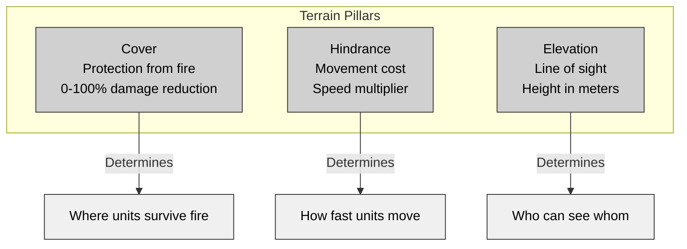

# Chapter 4: World and Terrain Architecture

## 4.1 Introduction: The Stage of Combat

In tactical wargames, terrain shapes every battle. Cover placement, hill elevation, forest density, and building layouts decide how engagements play out. A good terrain system must answer key questions: How do units move? What blocks enemy fire? Who spots whom? Where do tactical advantages emerge?

This chapter compares how three Close Combat clones solve these problems, showing different ways to handle one of game development's toughest challenges.

## 4.2 Three Philosophies of World Representation

The clones take distinct approaches to building their worlds:

```pseudocode
// OPENCOMBAT-SDL: Traditional Tile-Based
World := {
    tiles: Array[Element]     // 10x10 pixel tiles
    elevations: Array[int]    // Per-tile height
    objects: Array<ObjectList> // Linked lists per tile
    megaTiles: Array[12x12]   // Strategic regions
}

// OPENCOMMONBAT: Entity-Component with Spatial Indexing
World := {
    entities: HashMap<EntityId, Entity>
    spatialGrid: GridMap<EntityId>  // Uniform grid indexing
    terrain: Array[TerrainTile]     // Tile-based lookup
    interiors: Array<InteriorZone>  // Polygon regions
}

// CLOSECOMBATFREE: QML-Based Declarative World
World := {
    scenario: QML_Scenario      // Root container
    map: QML_Map {              // Terrain layer
        backgroundImage: Image
        hipsometricImage: Image // Height map
        props: List<Prop>       // Interactive elements
    }
}
```

### 4.2.1 OpenCombat-SDL: The Tiled World

OpenCombat-SDL builds its world with three layers of tiles:

**Base Tile (10x10 pixels)**: The smallest unit stores:
- Terrain type (Element index)
- Elevation (0-255 meters)
- Objects on the tile
- Building reference

**Mega-Tile (12x12 tiles = 120x120 pixels)**: These larger regions handle:
- Victory point placement
- Objective markers
- Rendering optimizations

**World Structure**:
```pseudocode
class Map {
    nBlocksX, nBlocksY: int           // Grid dimensions
    elements: Array<ushort>           // Terrain type per tile
    elevations: Array<uchar>          // Height per tile
    objects: Array<Object*>           // Linked list heads
    buildingIndices: Array<ushort>    // Building references
    buildings: Array<Building*>
}

// Index calculation: tile(i,j) = j * nBlocksX + i
// Parallel arrays enable fast access and cache-friendly iteration
```

### 4.2.2 OpenCombat: Entity-Component with Dual Coordinate Systems

OpenCombat blends grid-based terrain with continuous physics:

**Dual Coordinate System**:
```pseudocode
WorldPoint := { x: float, y: float }     // Continuous physics space
GridPoint := { x: int, y: int }          // Discrete terrain grid

// Conversion: O(1) operation
WorldPoint.to_grid(tileSize) -> GridPoint {
    return GridPoint(
        x: floor(this.x / tileSize),
        y: floor(this.y / tileSize)
    )
}

GridPoint.to_world(tileSize) -> WorldPoint {
    return WorldPoint(
        x: this.x * tileSize + (tileSize / 2),
        y: this.y * tileSize + (tileSize / 2)
    )
}
```

**Spatial Grid (GridMap)**: A uniform grid speeds up entity queries:
```pseudocode
class GridMap<T> {
    cellSize: float
    cells: HashMap<CellCoord, Array<T>>

    insert(entity: T, position: WorldPoint) {
        cell := position.to_cell(cellSize)
        cells[cell].add(entity)
    }

    query_radius(center: WorldPoint, radius: float) -> Array<T> {
        // Calculate affected cells
        minCell := (center - radius).to_cell(cellSize)
        maxCell := (center + radius).to_cell(cellSize)

        results := []
        for cell in range(minCell, maxCell) {
            for entity in cells[cell] {
                if distance(entity.position, center) <= radius {
                    results.add(entity)
                }
            }
        }
        return results
    }
}
```

### 4.2.3 CloseCombatFree: QML-Based Declarative Terrain

CloseCombatFree defines its world through QML components:

**Component Hierarchy**:
```pseudocode
Scenario {
    gameArea: Flickable {
        zoomArea: Item {
            scale: currentZoom

            map: Map {
                backgroundImage: "maps/field.png"
                hipsometricImage: "maps/field_height.png"

                // Props as child components
                House { x: 100, y: 200, cover: "great" }
                Tree { x: 300, y: 150, cover: "average" }
                Tree { x: 320, y: 160, cover: "average" }
            }

            units: Units { ... }
        }
    }
}
```

**Height Map System**:
```pseudocode
// Elevation encoded in RGB values
// Height = (R + G + B) / 10 meters
// Range: 0 (black) to 76.5 meters (white)

getElevationAt(worldX, worldY) -> float {
    scaleX := backgroundWidth / hipsometricWidth
    scaleY := backgroundHeight / hipsometricHeight

    pixel := hipsometricImage.pixel(
        worldX / scaleX,
        worldY / scaleY
    )

    return (pixel.red + pixel.green + pixel.blue) / 10.0
}
```

---

## 4.3 The Three Pillars of Terrain

All three games model terrain through three core attributes that shape tactical gameplay:



### 4.3.1 Cover Systems Compared

**OpenCombat-SDL: Stance-Based Cover**
```pseudocode
class Element {
    // Cover indexed by stance level
    cover: Array<float>[5]  // Prone, Low, Medium, High, Top

    // Example: Stone Wall
    cover = [0.93, 0.93, 0.93, 0.93, 0.0]  // Excellent for all stances

    // Example: High Grass
    cover = [0.53, 0.53, 0.53, 0.0, 0.0]   // Good for prone, none standing
}

// Damage calculation
calculateDamage(incomingDamage, targetStance, terrain) -> float {
    coverValue := terrain.cover[targetStance]
    return incomingDamage * (1.0 - coverValue)
}
```

**OpenCombat: Binary Coverage with Stance Modifiers**
```pseudocode
struct TerrainTile {
    coverage_stand: Option<float>   // Some(0.8) or None
    coverage_flat: Option<float>    // Some(0.7) or None
}

// Coverage application
calculateDamage(incomingDamage, stance, terrain) -> float {
    coverage := match stance {
        Standing => terrain.coverage_stand.unwrap_or(0.0)
        Prone => terrain.coverage_flat.unwrap_or(0.0)
        Crouch => terrain.coverage_flat.unwrap_or(0.0) * 0.8
    }
    return incomingDamage * (1.0 - coverage)
}
```

**CloseCombatFree: Category-Based Cover**
```pseudocode
// Cover as discrete categories
enum CoverLevel {
    None = 0.0,      // 0% protection
    Poor = 0.25,     // 25% protection
    Average = 0.5,   // 50% protection
    Great = 0.75     // 75% protection
}

Prop {
    property string cover: "none"  // "none" | "poor" | "average" | "great"
}

// Simple lookup table
coverValues := {
    "none": 0.0,
    "poor": 0.25,
    "average": 0.5,
    "great": 0.75
}
```

### 4.3.2 Hindrance and Movement Cost

**OpenCombat-SDL: Percentage-Based Hindrance**
```pseudocode
// Hindrance is percentage of normal speed (100 = full speed)
Element.hindrance: Array<int>[4]  // By stance level

// Movement speed calculation
actualSpeed := baseSpeed * (hindrance / 100.0)

// Examples:
// Grass: hindrance = 100 → full speed
// High Grass: hindrance = 67 → 67% speed
// Mud: hindrance = 40 → 40% speed
// Wall: hindrance = 0 → impassable
```

**OpenCombat: Cost-Based Movement**
```pseudocode
// Pedestrian cost: lower is faster
TerrainType.pedestrian_cost() -> int {
    match this {
        ShortGrass => 10    // Base speed
        Dirt => 11          // ~91% speed
        Mud => 11           // ~91% speed
        Underbrush => 12    // ~83% speed
        Hedge => 20         // 50% speed
        MiddleWoodLogs => 30 // 33% speed
        BrickWall => 50     // Impassable
    }
}

actualSpeed := baseSpeed / (pedestrianCost / 10.0)
```

**CloseCombatFree: Implicit Through Props**
```pseudocode
// Hindrance primarily through collision detection
// Props block movement via bounding boxes
// No explicit terrain cost system

Unit.movementSpeed := baseSpeed * terrainModifier
// Where terrainModifier determined by:
// - Elevation slope
// - Obstacle proximity
// - Special terrain zones
```

### 4.3.3 Elevation Representation

**OpenCombat-SDL: Per-Tile Elevation**
```pseudocode
// Elevation stored per tile (unsigned char: 0-255 meters)
Array<uchar> elevations  // Parallel to elements array

// Total height at position
totalElevation := baseElevation + elementHeight

// LOS calculation adds eye height
losElevation := (totalElevation + 2) * HEIGHT_MODIFIER  // +2m eye level
```

**OpenCombat: Simulated Elevation**
```pseudocode
// 2D grid with visibility modifiers
// "High ground" represented by terrain types with extended visibility

TerrainType.visibility_bonus() -> int {
    match this {
        HillTop => 10      // See 10 tiles further
        Elevated => 5      // See 5 tiles further
        _ => 0
    }
}
```

**CloseCombatFree: Height Map (Hipsometric)**
```pseudocode
// Continuous height from RGB image
getElevation(x, y) -> float {
    pixel := heightMap.sample(x, y)
    return (pixel.r + pixel.g + pixel.b) / 10.0  // 0-76.5 meters
}

// Elevation affects:
// 1. Line of sight (can see over lower terrain)
// 2. Movement speed (slopes cost more)
// 3. Cover effectiveness (higher ground advantage)
```

---

## 4.4 Line of Sight Architectures

### 4.4.1 OpenCombat-SDL: 3D Bresenham Algorithm

OpenCombat-SDL implements a 3D extension of Bresenham's line algorithm for visibility checks:

```pseudocode
function CalculateLOS(from: Point3D, to: Point3D, world: World) -> bool {
    // Calculate deltas
    dx := to.x - from.x
    dy := to.y - from.y
    dz := to.z - from.z  // Elevation difference

    // Determine major axis
    if abs(dx) >= abs(dy) and abs(dx) >= abs(dz) {
        // X is major axis
        return traceXMajor(from, to, dx, dy, dz, world)
    } else if abs(dy) >= abs(dx) and abs(dy) >= abs(dz) {
        // Y is major axis
        return traceYMajor(from, to, dx, dy, dz, world)
    } else {
        // Z (elevation) is major axis
        return traceZMajor(from, to, dx, dy, dz, world)
    }
}

function traceXMajor(from, to, dx, dy, dz, world) -> bool {
    x := from.x
    y := from.y
    z := from.z

    x_inc := if dx < 0 then -1 else 1
    y_inc := if dy < 0 then -1 else 1
    z_inc := if dz < 0 then -1 else 1

    dx2 := abs(dx) * 2
    dy2 := abs(dy) * 2
    dz2 := abs(dz) * 2

    err_y := dy2 - abs(dx)
    err_z := dz2 - abs(dx)

    for i from 0 to abs(dx) {
        // Check if current tile blocks LOS
        tileElevation := world.getElevation(x, y)
        if tileElevation > z and world.blocksHeight(x, y) {
            return false  // Blocked!
        }

        // Step along line
        if err_y > 0 {
            y := y + y_inc
            err_y := err_y - dx2
        }
        if err_z > 0 {
            z := z + z_inc
            err_z := err_z - dx2
        }
        err_y := err_y + dy2
        err_z := err_z + dz2
        x := x + x_inc
    }

    return true  // Clear line of sight
}
```

Key design choices include:
- Binary visibility: units are either visible or hidden
- Eye height offset: adds 2 meters to shooter elevation
- Height modifier: uses 1024x scaling for integer precision
- Blocking condition: `tile_elevation > line_height AND tile.BlocksHeight == true`

### 4.4.2 OpenCombat: Accumulated Opacity System

OpenCombat's visibility system uses accumulated opacity for more realistic results:

```pseudocode
// Core constants
VISIBLE_STARTS_AT := 0.5      // Opacity threshold
VISIBILITY_FIRSTS := 6        // Tiles to ignore at start
VISIBILITY_PIXEL_STEPS := 5   // Sampling resolution

function calculateVisibility(
    from: GridPoint,
    to: GridPoint,
    map: Map,
    weather: Weather,
    time: TimeOfDay
) -> Visibility {

    distance := from.distance_to(to)

    // Always see immediate vicinity
    if distance <= VISIBILITY_FIRSTS * TILE_SIZE {
        return Visible
    }

    // Raycast with opacity sampling
    steps := floor(distance / VISIBILITY_PIXEL_STEPS)
    accumulatedOpacity := 0.0

    for i from VISIBILITY_FIRSTS to steps {
        t := i / steps
        point := interpolate(from, to, t)
        grid := point.to_grid()

        if tile := map.get_tile(grid) {
            accumulatedOpacity := accumulatedOpacity + tile.opacity

            if accumulatedOpacity >= VISIBLE_STARTS_AT {
                return Hidden
            }
        }
    }

    return Visible
}

// Terrain opacity values
terrainOpacities := {
    ShortGrass: 0.0,
    MiddleGrass: 0.002,
    HighGrass: 0.1,
    Hedge: 0.25,
    Tree: 0.2,
    Building: 1.0
}
```

Visibility adjusts based on unit behavior:

```pseudocode
visibilityModifiers := {
    IdleStanding: 0.5,      // Moderate visibility
    IdleProne: -0.9,        // Difficult to spot
    Moving: 1.0,            // More visible
    Running: 2.0,           // High visibility
    Sneaking: -0.9,         // Hard to detect
    Hiding: -0.9            // Very hard to detect
}

finalVisibilityScore := baseVisibility + behaviorModifier
if finalVisibilityScore > 0 and accumulatedOpacity < 0.5 {
    return Visible
} else {
    return Hidden
}
```

### 4.4.3 CloseCombatFree: Dual LOS System

CloseCombatFree combines two visibility checks for comprehensive results:

```pseudocode
// System 1: Elevation-Based LOS
function checkElevationLOS(from: Point, to: Point, map: Map) -> bool {
    distance := from.distance_to(to)
    steps := distance / 10.0  // Check every 10 pixels

    originHeight := map.getElevation(from)
    targetHeight := map.getElevation(to)

    for i from 0 to steps {
        t := i / steps
        checkPoint := interpolate(from, to, t)
        groundHeight := map.getElevation(checkPoint)
        sightLineHeight := interpolate(originHeight, targetHeight, t)

        if groundHeight > sightLineHeight {
            return false  // Terrain blocks view
        }
    }

    return true
}

// System 2: Obstacle-Based LOS
function checkObstacleLOS(from: Point, to: Point, world: World) -> bool {
    line := Line(from, to)

    for prop in world.getProps() {
        if prop.blocksLOS and line.intersects(prop.boundingBox) {
            return false  // Prop blocks view
        }
    }

    return true
}

// Combined visibility check
function isVisible(from: Point, to: Point) -> bool {
    return checkElevationLOS(from, to) and checkObstacleLOS(from, to)
}
```

---

## 4.5 Building and Interior Systems

### 4.5.1 OpenCombat-SDL: Dual-View Building Architecture

OpenCombat-SDL handles buildings with two separate visual layers:

```pseudocode
class Building {
    position: Point              // Upper-left corner
    boundaryPoints: Array<Point> // Polygon vertices
    tiles: Array<int>            // Tile indices belonging to building
    interiorGraphic: Image       // Floor plan view
}

// Building index population via point-in-polygon
function populateBuildingIndices() {
    for building in buildings {
        // Calculate bounding box in tile coordinates
        minTile := building.position / tileSize
        maxTile := (building.position + building.size) / tileSize

        for y from minTile.y to maxTile.y {
            for x from minTile.x to maxTile.x {
                center := tileCenter(x, y)
                if pointInPolygon(center, building.boundaryPoints) {
                    buildingIndices[y * width + x] = building.id
                    building.tiles.add(y * width + x)
                }
            }
        }
    }
}

// Dual-view rendering
function renderBuilding(building, showInterior) {
    if showInterior {
        // Show floor plan, rooms, doorways
        render(building.interiorGraphic, building.position)
    } else {
        // Show walls, roof
        render(building.exteriorGraphic, building.position)
    }
}

// Automatic view switching
showInterior := debugMode or building.hasOccupants()
```

Buildings offer full protection—walls stop all incoming fire. Soldiers inside gain cover and concealment, while doors and windows create natural choke points. Line of sight remains blocked until someone enters.

### 4.5.2 OpenCombat: Interior Zones

OpenCombat defines interior spaces using polygon-based zones in TMX maps:

```pseudocode
struct InteriorZone {
    id: InteriorId
    boundary: Polygon
    cover: float           // Typically 0.95 for buildings
    opacity: float         // Line of sight blocking
    occupants: Array<SoldierId>
}

class InteriorManager {
    interiors: Array<InteriorZone>

    function isInside(position: WorldPoint) -> Option<InteriorId> {
        for interior in interiors {
            if interior.boundary.contains(position) {
                return Some(interior.id)
            }
        }
        return None
    }

    function enter(soldier: SoldierId, interior: InteriorId) {
        interior.occupants.add(soldier)
    }

    function exit(soldier: SoldierId, interior: InteriorId) {
        interior.occupants.remove(soldier)
    }

    function blocksLOS(from: WorldPoint, to: WorldPoint) -> bool {
        for interior in interiors {
            if interior.boundary.intersectsLine(from, to) {
                return true
            }
        }
        return false
    }
}
```

### 4.5.3 CloseCombatFree: QML Prop Buildings

CloseCombatFree treats buildings as interactive QML components:

```pseudocode
// HouseBasic_tst.qml
PropRectangle {
    objectName: "house"
    cover: "great"           // 75% protection
    width: 140
    height: 100

    Rectangle {              // Floor
        id: floor
        anchors.fill: parent
        anchors.margins: 5
        color: "#4f1708"
    }

    Image {                  // Roof (toggleable)
        id: roof
        visible: topVisible
        source: "HouseBasicRoof1.png"
        anchors.fill: parent
    }

    // Toggle visibility when occupied
    function toggleRoof() {
        topVisible = !topVisible
    }
}

// Automatic roof hiding
onUnitEntered: {
    if (unit.playerControlled) {
        roof.visible = false  // Show interior
        unit.opacity = 0.5    // Semi-transparent inside
    }
}

onUnitExited: {
    unit.opacity = 1.0
    if (occupants.isEmpty()) {
        roof.visible = true   // Show exterior
    }
}
```

---

## 4.6 Spatial Partitioning for Performance

### 4.6.1 OpenCombat-SDL: Tile-Linked Object Lists

```pseudocode
class World {
    // Array of linked list heads (one per tile)
    objects: Array<Object*>  // Size: nBlocksX * nBlocksY

    function addObject(obj: Object, tileX: int, tileY: int) {
        index := tileY * nBlocksX + tileX

        // Insert at head of tile's list
        obj.nextObject := objects[index]
        if obj.nextObject != null {
            obj.nextObject.prevObject := obj
        }
        objects[index] := obj
    }

    function moveObject(obj: Object, from: Point, to: Point) {
        oldTile := from / tileSize
        newTile := to / tileSize

        if oldTile == newTile {
            return  // Same tile, no update needed
        }

        // Remove from old tile
        removeFromTile(obj, oldTile)

        // Add to new tile
        addObject(obj, newTile.x, newTile.y)
    }

    function queryObjectsInRadius(center: Point, radius: float) -> Array<Object> {
        results := []

        // Calculate tile range
        minTile := (center - radius) / tileSize
        maxTile := (center + radius) / tileSize

        for y from minTile.y to maxTile.y {
            for x from minTile.x to maxTile.x {
                obj := objects[y * nBlocksX + x]
                while obj != null {
                    if distance(obj.position, center) <= radius {
                        results.add(obj)
                    }
                    obj := obj.nextObject
                }
            }
        }

        return results
    }
}
```

**Complexity Analysis**
- Insertion: O(1)
- Deletion: O(1)
- Point query: O(1)
- Radius query: O(tiles in radius × average objects per tile)

### 4.6.2 OpenCombat: Uniform Grid Spatial Index

```pseudocode
class SpatialGrid<T> {
    cellSize: float
    cells: HashMap<CellCoord, Array<T>>
    entityCells: HashMap<T, CellCoord>  // Reverse lookup

    function insert(entity: T, position: WorldPoint) {
        cell := position.to_cell(cellSize)

        // Remove from old cell if present
        if entityCells.contains(entity) {
            oldCell := entityCells[entity]
            cells[oldCell].remove(entity)
        }

        // Add to new cell
        if not cells.contains(cell) {
            cells[cell] := []
        }
        cells[cell].add(entity)
        entityCells[entity] := cell
    }

    function queryRectangle(min: WorldPoint, max: WorldPoint) -> Array<T> {
        results := []

        minCell := min.to_cell(cellSize)
        maxCell := max.to_cell(cellSize)

        for y from minCell.y to maxCell.y {
            for x from minCell.x to maxCell.x {
                cell := CellCoord(x, y)
                if cells.contains(cell) {
                    results.extend(cells[cell])
                }
            }
        }

        return results
    }

    function queryRadius(center: WorldPoint, radius: float) -> Array<T> {
        // Get approximate rectangle
        min := center - Vector2(radius, radius)
        max := center + Vector2(radius, radius)

        candidates := queryRectangle(min, max)

        // Filter by actual distance
        return candidates.filter(c =>
            distance(c.position, center) <= radius
        )
    }
}
```

### 4.6.3 CloseCombatFree: Scene Graph Spatial Query

```pseudocode
// Leverages Qt's scene graph
class Map {
    // Props are child items in QML scene graph
    props: List<Prop>

    function queryObjectsAt(x, y) -> Array<Prop> {
        // Use Qt's childAt for point queries
        return childItems.filter(child =>
            child.contains(x, y)
        )
    }

    function queryObjectsInRect(rect) -> Array<Prop> {
        return childItems.filter(child =>
            rect.intersects(child.boundingRect)
        )
    }

    // For radius queries, must iterate all props
    function queryObjectsInRadius(center, radius) -> Array<Prop> {
        return childItems.filter(child =>
            distance(child.position, center) <= radius
        )
    }
}

// Performance note: Radius queries run in O(n) time.
// This works well for smaller maps but may need optimization for large battles.
```

---

## 4.7 Destructible Terrain Architecture

The clones don't implement fully destructible terrain, but their designs leave room for it.

### 4.7.1 OpenCombat-SDL Approach

```pseudocode
class DestructibleTerrainManager {
    damagedTiles: HashMap<TileIndex, DamageLevel>

    function applyDamage(position: Point, radius: float, damage: float) {
        affectedTiles := getTilesInRadius(position, radius)

        for tile in affectedTiles {
            currentDamage := damagedTiles.get(tile, 0)
            newDamage := currentDamage + damage
            damagedTiles[tile] := newDamage

            if newDamage > DESTRUCTION_THRESHOLD {
                destroyTile(tile)
            } else {
                updateTileCover(tile, newDamage)
            }
        }

        invalidateLOSCache()
    }

    function updateTileCover(tile, damage) {
        element := getElement(tile)
        damageRatio := damage / DESTRUCTION_THRESHOLD

        for i in 0..4 {
            element.cover[i] *= (1.0 - damageRatio * 0.5)
        }
    }
}
```

### 4.7.2 OpenCombat Approach

```pseudocode
class DestructibleTerrainSystem {
    terrainModifications: HashMap<GridPoint, TerrainModification>

    function modifyTerrain(position: GridPoint, newType: TerrainType) {
        modification := TerrainModification {
            position: position,
            newType: newType,
            timestamp: now()
        }

        terrainModifications[position] := modification
        broadcast(TerrainChanged {
            position: position,
            newType: newType
        })
    }

    function getTerrainAt(position: GridPoint) -> TerrainType {
        if terrainModifications.contains(position) {
            return terrainModifications[position].newType
        }
        return baseTerrain[position]
    }
}
```

### 4.7.3 CloseCombatFree Approach

```pseudocode
// QML-based destruction
Prop {
    id: wall
    cover: "great"
    health: 100

    function takeDamage(amount) {
        health := health - amount
        if health <= 0 {
            destroy()
        } else if health < 50 {
            cover := "average"
            sprite.source := "wall_damaged.png"
        }
    }

    function destroy() {
        var rubble = Qt.createComponent("Rubble.qml").createObject(parent)
        rubble.position = position
        wall.destroy()
    }
}
```

---

## 4.8 Comparative Analysis

### 4.8.1 Terrain Representation Summary

| Aspect        | OpenCombat-SDL            | OpenCombat              | CloseCombatFree              |
| ------------- | ------------------------- | ----------------------- | ---------------------------- |
| **World Model**   | Hierarchical tiles        | Entity-Component + Grid | QML declarative              |
| **Grid Type**     | 10x10px tiles             | 5px tiles (TMX)         | Free-form                    |
| **Elevation**     | Per-tile integer (0-255m) | Simulated via terrain   | Height map (RGB, 0-76.5m)    |
| **Cover System**  | Stance-based (5 levels)   | Binary + stance         | Category (4 levels)          |
| **Hindrance**     | Percentage (0-100%)       | Cost-based (10-50)      | Implicit collision           |
| **Buildings**     | Dual-view tiles           | Interior zones          | Interactive QML props        |
| **LOS Algorithm** | 3D Bresenham              | Accumulated opacity     | Elevation + obstacle raycast |
| **Spatial Query** | Tile-linked lists         | Uniform grid            | Scene graph iteration        |
| **Moddability**   | XML data files            | TMX + JSON              | QML files                    |

### 4.8.2 Line of Sight Comparison

**Scenario: Can Soldier A see Soldier B?**

OpenCombat-SDL uses a binary 3D raycast:

```pseudocode
visible := LineOfSight.check(
    soldierA.position,
    soldierB.position,
    world
)
```

This considers distance, elevation difference, terrain blocks, and building occlusion. The result is a simple true/false.

OpenCombat calculates visibility through accumulated opacity:

```pseudocode
visibility := calculateVisibility(
    soldierA.gridPosition,
    soldierB.gridPosition,
    map,
    soldierA.behavior,
    soldierB.behavior
)
```

Behavior modifiers and stance affect the outcome, producing Visible, Partial, or Hidden results.

CloseCombatFree performs a dual check:

```pseudocode
visible := checkElevationLOS(a, b) and checkObstacleLOS(a, b)
```

The system evaluates height map profiles and prop bounding boxes to determine visibility.

OpenCombat offers the most realistic approach by modeling real-world visibility gradients. OpenCombat-SDL delivers the best performance with its simple Bresenham algorithm on a fixed grid. CloseCombatFree provides the most flexibility, allowing custom LOS logic for QML props.

### 4.8.3 Spatial Query Performance

| Operation               | OpenCombat-SDL                   | OpenCombat                   | CloseCombatFree        |
| ----------------------- | -------------------------------- | ---------------------------- | ---------------------- |
| **Point query** (at x,y)    | O(1) array index                 | O(1) grid lookup             | O(n) prop iteration    |
| **Radius query** (within r) | O(k × m) k=tiles, m=objects/tile | O(k + m) k=cells, m=entities | O(n) all props         |
| **Line of sight**           | O(line length)                   | O(line length)               | O(line length + props) |
| **Pathfinding**             | A* on grid                       | A* on grid                   | Direct path            |

---

## 4.9 Game Design Implications

### 4.9.1 Cover Density and Tactical Depth

Three key lessons emerge from these games:

1. **Cover density matters** - Too much creates stalemates, too little leads to slaughter. The ideal range is 30-40% of the map offering meaningful cover.

2. **Variety enhances tactics** - A mix of light, medium, and heavy cover creates decision points and enables risk/reward calculations.

3. **Movement over static defense** - Cover should facilitate movement rather than just provide defensive positions. Maps need multiple paths to objectives without a single "perfect" defensive spot.

### 4.9.2 Line of Sight Design Philosophy

**Binary LOS** (OpenCombat-SDL):
Players easily understand clear "safe" and "danger" zones. This approach works well for introductory tactical gameplay and enables decisive flanking maneuvers.

**Opacity-Based LOS** (OpenCombat):
Realistic visibility gradients create uncertainty. This system rewards careful positioning and patience while discouraging reckless movement across open ground.

**Height Map LOS** (CloseCombatFree):
Elevation advantages feel natural and match visual representation. Map designers can easily create interesting terrain that encourages control of high ground.

### 4.9.3 Elevation as Gameplay Driver

All three systems confirm elevation's importance for tactical depth:

- Creates natural objectives
- Enables "king of the hill" scenarios
- Provides realistic spotting mechanics
- Punishes poor positioning

**Design recommendations:**
- Include 2-3 meaningful elevation changes per map
- Ensure high ground offers clear advantages
- Balance visibility - high positions should be more exposed
- Design flanking routes around elevated positions

---

## 4.10 Synthesis: Designing World Systems

### 4.10.1 Recommended Hybrid Approach

An ideal system combines these elements:

```pseudocode
World := {
    // Grid-based terrain for performance
    terrainGrid: Array<TerrainTile>
    tileSize: 10  // pixels

    // Height map for elevation (editable in image editors)
    heightMap: Image

    // Entity-component for game objects
    entities: EntityManager
    spatialIndex: UniformGrid<Entity>

    // Dual LOS for gameplay depth
    primaryLOS: AccumulatedOpacity
    secondaryLOS: ElevationRaycast

    // Building interiors as polygon zones
    interiors: Array<InteriorZone>

    // Data-driven configuration
    terrainTypes: JSON
    mapFormat: TMX
}
```

### 4.10.2 Key Architectural Decisions

1. **Tile-based terrain** enables:
   - Fast O(1) lookups
   - Cache-friendly iteration
   - Easy serialization
   - Proven pathfinding algorithms

2. **Height maps** provide:
   - Intuitive terrain editing
   - Continuous elevation data
   - Natural line of sight
   - Clear visual representation

3. **Entity-component systems** offer:
   - Flexible object definitions
   - Data-driven design
   - Easy modding
   - Composition over inheritance

4. **Accumulated opacity LOS** delivers:
   - Realistic visibility gradients
   - Meaningful soft cover
   - Dynamic concealment
   - Tactical depth

### 4.10.3 Performance Optimization Strategies

**For large maps (1000x1000 tiles or larger)**:

```pseudocode
// 1. Hierarchical spatial indexing
spatialTree := QuadTree<Entity>(maxDepth=8, maxObjects=10)

// 2. LOD for terrain
renderTerrainLOD(cameraPosition, zoom) {
    if zoom < 0.5 {
        renderMegaTiles()      // 120x120px blocks
    } else if zoom < 1.0 {
        renderTiles()          // 10x10px tiles
    } else {
        renderDetailed()       // Full detail
    }
}

// 3. Cached LOS
losCache := HashMap<PositionPair, Visibility>

// 4. Dirty region tracking
changedTiles := Array<TileIndex>
onTerrainChange(tile) {
    changedTiles.add(tile)
    invalidateLOSCacheFor(tile)
}
```

### 4.10.4 Modding and Content Creation

For maximum moddability:

1. **Standard formats**: TMX for maps, JSON for data
2. **Hot-reloadable assets**: Watch files for changes
3. **Visual editing**: Height maps editable in Photoshop or GIMP
4. **Documentation**: Clear schema for terrain properties
5. **Examples**: Template maps demonstrating best practices

## 4.11 Conclusion

The world and terrain systems in the three Close Combat clones follow distinct design philosophies.

**OpenCombat-SDL** uses a proven tile-based approach with stance-based cover and dual-view buildings. It works best for traditional tactical gameplay with clear positions and predictable outcomes.

**OpenCombat** implements opacity-based visibility with behavioral modifiers. This system excels at realistic, nuanced tactical decisions where positioning creates uncertainty through soft cover.

**CloseCombatFree** employs a flexible height-map and prop-based system. Its strength lies in rapid content creation and terrain experimentation.

Key insights emerge from these approaches:

1. **Cover matters most** – Combat without protection becomes simple attrition.

2. **Line of sight shapes play** – The LOS algorithm determines whether players advance cautiously or attempt bold flanking maneuvers.

3. **Elevation creates objectives** – Verticality makes tactical maps interesting by providing natural conflict points.

4. **Moddability needs data-driven design** – Terrain properties should be configurable without code changes to enable community content.

5. **Performance depends on spatial partitioning** – Efficient world queries require spatial indexing, as naive O(n) searches fail at scale.

**Recommendations for new projects**:
- Start with a **tile-based grid** for performance and reliable pathfinding
- Build **opacity-based LOS** for realistic visibility
- Support **height maps** for easy elevation editing
- Make terrain properties **fully data-driven** (JSON/YAML/XML)
- Integrate with **standard map editors** like Tiled

Terrain isn't just where combat happens – it makes tactical combat interesting.

---

*Next: [Chapter 5: Unit Hierarchy and Compositional Architecture](chapter_05_unit_hierarchy.md)*
