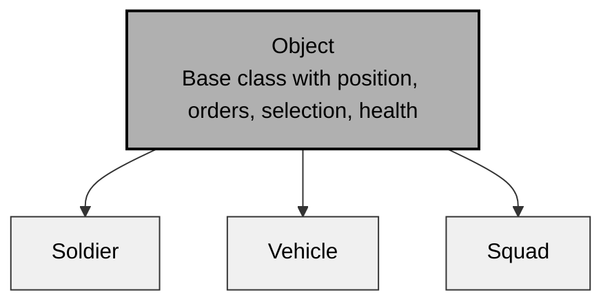
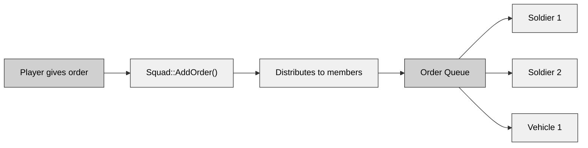
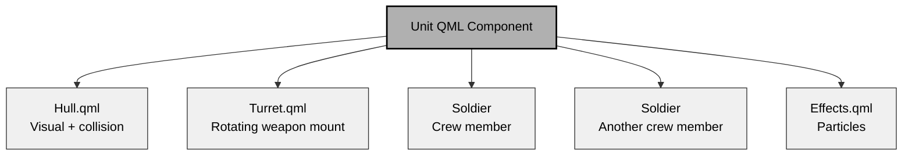
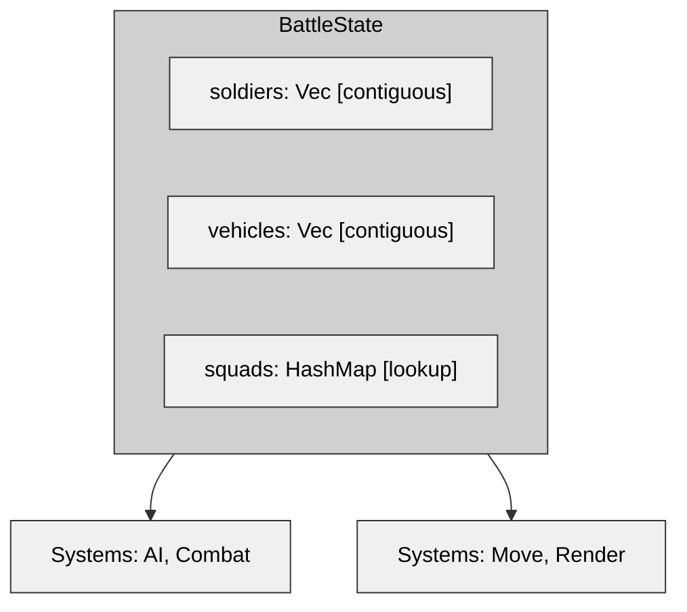
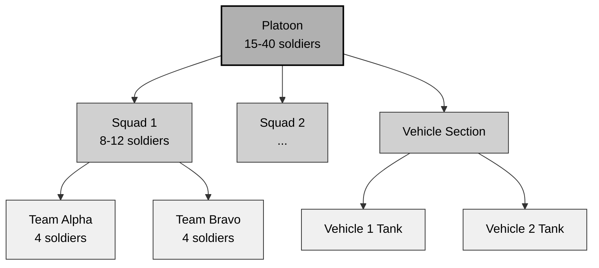
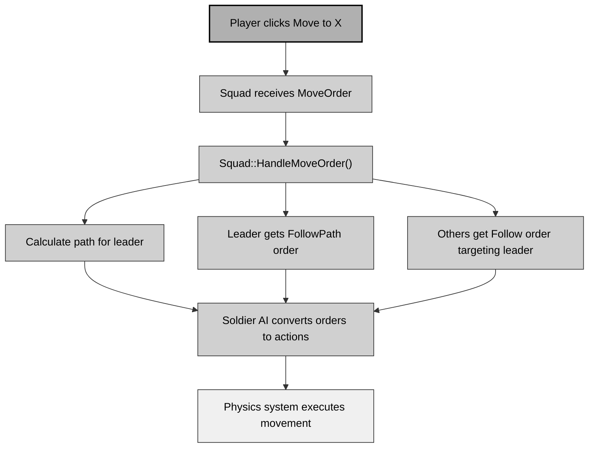
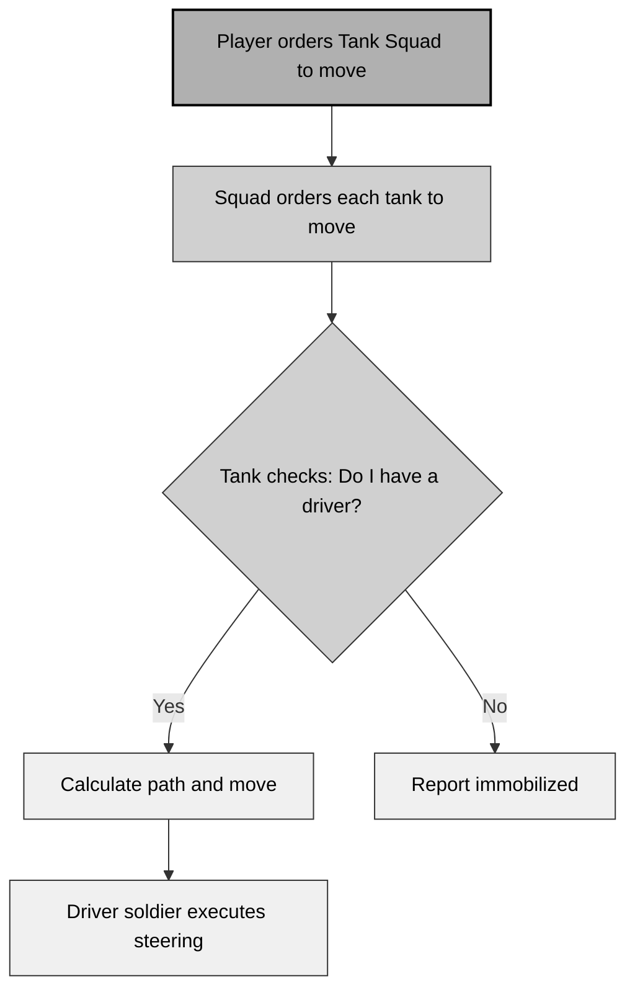
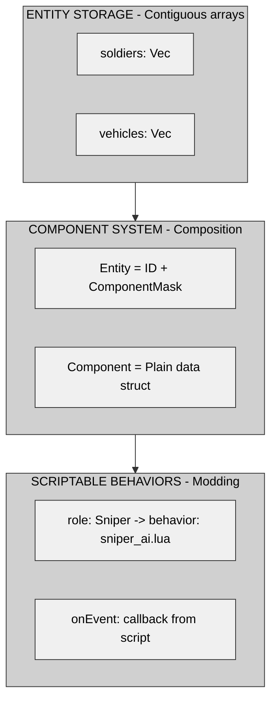

# Chapter 5: Unit Hierarchy and Compositional Architecture

## 5.1 Introduction: The Evolution of Entity Design

How you structure game entities shapes every other system in your tactical wargame. The three Close Combat clones span nearly 20 years of architectural evolution:

| Game            | Year | Pattern               | Core Philosophy                          |
| --------------- | ---- | --------------------- | ---------------------------------------- |
| **OpenCombat-SDL**  | 2005 | Deep Inheritance      | "Everything IS-A Object"                 |
| **CloseCombatFree** | 2011 | Component Composition | "Entities are composed of parts"         |
| **OpenCombat**      | 2024 | Modified ECS          | "Entities are data processed by systems" |

This chapter explores these approaches through tactical wargame requirements: **hierarchical command structures**, **aggregate relationships** like squads containing soldiers, **dynamic capabilities** where crew affects vehicle function, and **moddability** that allows adding new unit types without recompilation.

### Key Design Questions

Before examining implementations, ask these questions about your own project:

1. **Hierarchy vs. Flattening**: Should a squad be an object or contain objects?
2. **Ownership vs. Referencing**: Who owns a soldier when they board a vehicle?
3. **Capabilities**: How does a vehicle recognize it can't move without a driver?
4. **Extensibility**: Can modders add a sniper team without source code changes?
5. **Performance**: Does cache efficiency matter with 500 entities instead of 50,000?

Each project answers these differently, reflecting its era and constraints.

---

## 5.2 The Three Architectural Patterns

### 5.2.1 OpenCombat-SDL: Classical Inheritance (2005)

OpenCombat-SDL follows traditional object-oriented design. Everything inherits from a common base:



#### The "Squad as Object" Decision

**Why the team chose inheritance:**
- Squads share behaviors with Soldiers: selection, orders, and positions
- Code reuse came from inheriting order queue management
- Polymorphism allowed any Object pointer to reference Soldiers, Vehicles, or Squads

```cpp
// Squad inherits all Object capabilities
class Squad : public Object {
    std::vector<Soldier*> _soldiers;  // Non-owning refs
    std::vector<Vehicle*> _vehicles;  // Non-owning refs

    void Simulate(long dt, World* world) override {
        // Delegate to members
        for (auto* soldier : _soldiers) {
            soldier->Simulate(dt, world);
        }
    }
};
```

#### The Command Flow

A unified command interface emerged from inheritance:



#### Aggregation: What a Squad "Has" vs "Is"

Ownership revealed the critical distinction:

```cpp
// Squad does NOT own its members
class Squad : public Object {
    std::vector<Soldier*> _soldiers;  // Non-owning: World owns soldiers
};

// Squad composition uses aggregation (HAS-A), not inheritance (IS-A)
// Soldier IS-A Object, Squad HAS-A Soldiers
```

The model became hybrid:
- **Inheritance**: Squad IS-A Object for game engine uniformity
- **Aggregation**: Squad HAS-A Soldiers for tactical organization

#### The Crew Problem

Vehicles highlighted the limits of pure inheritance:

```cpp
class Vehicle : public Object {
    struct CrewSlot {
        Soldier* soldier;  // Non-owning reference
        int weaponSlot;
    };

    std::array<CrewSlot, MAX_CREW> _crew;

    bool CanMove() {
        // Must check if driver slot is filled
        return _crew[0].soldier != nullptr;
    }
};
```

**The complication:** A Vehicle is an Object, but it also contains Soldiers who are Objects. This created circular dependencies in the design.

### 5.2.2 CloseCombatFree: Component Composition (2011)

CloseCombatFree replaces deep inheritance with declarative composition using Qt's QML:



#### Composition in Practice

```qml
// units/tanks/HeavyTank.qml
Unit {
    id: tank
    unitType: "Heavy Tank"
    maxSpeed: 15

    // Visual composition
    HeavyTank_hull { id: hull }
    HeavyTank_turret { id: turret }

    // Crew composition
    Soldier { role: "Commander" }
    Soldier { role: "Gunner" }
    Soldier { role: "Driver" }
}
```

The tank contains Soldier components instead of inheriting crew capability.

#### Capabilities Through Composition

```qml
// Tank.qml
function canMove() {
    // Query children for Driver role
    for (var i = 0; i < children.length; i++) {
        if (children[i].role === "Driver" &&
            children[i].status !== "KIA") {
            return true;
        }
    }
    return false;
}
```

Capabilities emerge from composition without inheritance hierarchies.

#### Runtime Instantiation for Modding

The design allows new unit types without recompilation:

```cpp
void Scenario::loadUnit(const QString& qmlFile) {
    QQmlComponent component(&engine, qmlFile);
    QObject* unit = component.create();  // Runtime instantiation!

    // Add to scenario
    units.append(unit);
}
```

Modders can create `SniperTeam.qml`:

```qml
Unit {
    unitType: "Sniper Team"
    Soldier { role: "Spotter"; equipment: "Binoculars" }
    Soldier { role: "Sniper"; weapon: "SniperRifle" }
}
```

This approach requires no C++ code changes or recompilation, enabling pure data-driven design.

### 5.2.3 OpenCombat: Modified ECS (2024)

OpenCombat demonstrates modern data-oriented design:



#### Type-Safe Indices Replace Pointers

```rust
#[derive(Debug, Clone, Copy)]
pub struct SoldierIndex(pub usize);

#[derive(Debug, Clone, Copy)]
pub struct VehicleIndex(pub usize);

pub struct Soldier {
    uuid: SoldierIndex,
    squad_uuid: SquadUuid,  // Index reference, not pointer
}
```

**Benefits**:
- **Type safety**: The compiler prevents mixing SoldierIndex with VehicleIndex
- **Serialization**: Indices serialize as simple numbers
- **No lifetimes**: Eliminates borrowing complexity
- **Cache efficiency**: Uses contiguous Vec storage

#### Squad as Lightweight Aggregate

```rust
pub struct SquadComposition(
    pub SoldierIndex,      // Leader
    pub SquadType,
    pub Vec<SoldierIndex>  // Members (indices, not refs)
);

// Stored in BattleState
pub struct BattleState {
    squads: HashMap<SquadUuid, SquadComposition>
}
```

Squads function as relationship structures rather than entity types.

#### Bidirectional Vehicle Boarding

```rust
pub struct BattleState {
    // Soldier → Vehicle lookup
    soldiers_on_board: HashMap<SoldierIndex, VehicleBoardPlace>,

    // Vehicle → Soldiers lookup
    vehicle_board: HashMap<VehicleIndex, HashMap<OnBoardPlace, SoldierIndex>>,
}
```

Both lookups achieve O(1) performance without pointer chasing or ownership confusion.

---

## 5.3 Universal Composition Patterns

### 5.3.1 The Aggregate Pattern

**Problem**: How do you represent a squad containing soldiers?

**Three Approaches**:

| Aspect       | Inheritance (SDL)     | Composition (CCF)      | ECS (OpenCombat)           |
| ------------ | --------------------- | ---------------------- | -------------------------- |
| **Relationship** | Squad inherits Object | Unit contains Soldiers | Squad struct holds indices |
| **Storage**      | Pointers in Squad     | QML child objects      | Vec in BattleState         |
| **Lifecycle**    | World owns all        | Qt parent-child        | BattleState owns           |
| **Access**       | O(1) pointer          | O(n) traversal         | O(1) index                 |
| **Type Safety**  | Runtime casts         | Dynamic QML            | Compile-time indices       |

**Universal Pattern**:

```pseudocode
// Aggregation: HAS-A relationship
Aggregate UnitGroup {
    // Members are referenced, not owned
    members: List<EntityReference>

    // Operations delegate to members
    function issueOrder(order) {
        for member in members {
            if member.isActive() {
                member.addOrder(order)
            }
        }
    }
}
```

### 5.3.2 The Capability Pattern

**Problem**: How does a vehicle determine if it can move?

**Three Approaches**:

**Inheritance approach** (problematic):
```cpp
class Vehicle : public Object {
    // Hardcoded mobility creates issues
    bool IsMobile() override { return true; }  // Fails if no driver
};
```

**Composition approach** (dynamic):
```qml
// Capabilities depend on current state
function canMove() {
    return hasFunctionalCrew("Driver") &&
           fuel > 0 &&
           !isDestroyed;
}
```

**ECS approach** (data-driven):
```rust
pub fn can_vehicle_move(
    vehicle_idx: VehicleIndex,
    state: &BattleState
) -> bool {
    let vehicle = &state.vehicles[vehicle_idx.0];
    let crew = state.vehicle_board.get(&vehicle_idx);

    crew.map(|c| c.contains_key(&OnBoardPlace::Driver))
        .unwrap_or(false)
}
```

**Universal Pattern**:

```pseudocode
// Capabilities are calculated, not inherited
function getCapabilities(entity) {
    capabilities = {}

    // Check components or parts
    for component in entity.components {
        capabilities.add(component.provides)
    }

    // Adjust for state
    if entity.health <= 0 {
        capabilities.remove(Move)
        capabilities.remove(Fire)
    }

    return capabilities
}
```

### 5.3.3 The Behavior Pattern

**Problem**: How do different unit types exhibit distinct actions?

**Inheritance approach** (rigid):
```cpp
// Behavior hardcoded in class hierarchy
class Sniper : public Soldier {
    void SelectTarget() override {
        // Sniper-specific target selection
    }
};
```

**Composition approach** (flexible):
```qml
// Behavior as interchangeable component
Soldier {
    behavior: SniperBehavior {}  // Swappable
}

Soldier {
    behavior: MachineGunnerBehavior {}
}
```

**ECS approach** (system-driven):
```rust
// Behavior determined by component flags
if soldier.has_trait(Trait::Stealthy) {
    ai.choose_hidden_position();
} else {
    ai.choose_defensive_position();
}
```

**Universal Pattern**:

```pseudocode
// Behavior is separate from identity
Entity Soldier {
    identity: Role  // "Sniper", "Rifleman"
    behavior: BehaviorComponent
    equipment: EquipmentComponent
}

// Behavior system processes by role
BehaviorSystem {
    function update(soldier) {
        match soldier.role {
            Sniper => sniper_ai.update(soldier),
            Leader => leader_ai.update(soldier),
            _ => standard_ai.update(soldier)
        }
    }
}
```

---

## 5.4 Military Hierarchy: Soldier → Squad → Team → Platoon

### 5.4.1 The OOB Challenge

Order of Battle (OOB) structures in tactical games follow this pattern:



The structure forms a tree, not an inheritance hierarchy.

### 5.4.2 Implementing the Hierarchy

**Inheritance approach** (problematic):
```cpp
// Deep inheritance becomes brittle
class Platoon : public UnitGroup {
    std::vector<Squad*> squads;
};

class Squad : public UnitGroup {
    std::vector<Team*> teams;
};

// Platoon and Squad both inherit from UnitGroup,
// but Platoon also contains Squads, creating conflicting relationships
```

**ECS approach** (flat with parent references):
```rust
pub struct Unit {
    uuid: UnitIndex,
    unit_type: UnitType,        // Soldier, Squad, Platoon
    parent: Option<UnitIndex>,  // Parent in hierarchy
    children: Vec<UnitIndex>,   // Children in hierarchy
}

// Hierarchy becomes a property, not a type distinction
```

**Universal Pattern**:

```pseudocode
// Tree structure with explicit parent/child links
Entity Unit {
    unitType: enum { Soldier, Squad, Platoon }
    parent: Option<EntityReference>
    children: List<EntityReference>

    // Navigation
    function getRoot() -> Unit {
        if parent == null {
            return this
        }
        return parent.getRoot()
    }

    // Operations propagate down
    function issueOrder(order) {
        // Execute locally
        execute(order)

        // Forward to children
        for child in children {
            child.issueOrder(order)
        }
    }
}
```

### 5.4.3 Formation Following

Formations position units by offsetting from a leader:

```pseudocode
Formation Column {
    // Member 0 is leader at position P
    // Member 1 follows at P - (spacing behind leader)
    // Member 2 follows at P - (2 × spacing behind leader)

    function getPosition(memberIndex, leaderPosition, leaderHeading) {
        offset = memberIndex * spacing
        return leaderPosition - (leaderHeading * offset)
    }
}

Formation Line {
    // Members form line perpendicular to heading
    function getPosition(memberIndex, leaderPosition, leaderHeading) {
        perpendicular = leaderHeading.rotate(90°)
        offset = (memberIndex - centerIndex) * spacing
        return leaderPosition + (perpendicular * offset)
    }
}
```

**Implementation patterns**:

| Pattern     | Formation Storage   | Application                                         |
| ----------- | ------------------- | --------------------------------------------------- |
| **Inheritance** | Squad field         | Each soldier calculates position relative to leader |
| **Composition** | Formation component | QML calculates target positions                     |
| **ECS**         | Formation system    | System updates soldier positions each frame         |

---

## 5.5 Command and Control Relationships

### 5.5.1 Order Propagation

**Flow**: Player → Selected Unit → Subordinates



### 5.5.2 Leadership Dynamics

When the squad leader dies, the squad reorganizes.

**Inheritance approach**:
```cpp
void Squad::Update() {
    if (!leader->IsAlive()) {
        // Find new leader
        for (auto* soldier : _soldiers) {
            if (soldier->IsAlive() && soldier->HasLeadership()) {
                leader = soldier;
                break;
            }
        }
    }
}
```

**ECS approach**:
```rust
fn tick_update_squad_leaders(state: &mut BattleState) {
    for (squad_uuid, composition) in &mut state.squads {
        let leader = &state.soldiers[composition.0.0];

        if !leader.alive || leader.unconscious {
            // Promote next eligible
            for member_idx in &composition.2 {
                let member = &state.soldiers[member_idx.0];
                if member.alive && !member.unconscious {
                    composition.0 = *member_idx;
                    break;
                }
            }
        }
    }
}
```

### 5.5.3 Vehicle Command Structure

Vehicles complicate command. Crew members are soldiers, but the vehicle functions as a single unit.



Command flows through the hierarchy, but execution depends on the crew's status.

---

## 5.6 Moddability: Adding New Unit Types

### 5.6.1 The Recompilation Barrier

**Scenario**: Add a "Sniper Team" unit with two soldiers and special behaviors.

**OpenCombat-SDL** requires recompilation:
```cpp
// 1. Modify Soldier enum
enum SoldierType { Rifleman, MachineGunner, Sniper };

// 2. Add to SoldierManager
void SoldierManager::CreateSoldier(Type type) {
    switch(type) {
        case Sniper: /* ... */ break;
    }
}
```

**OpenCombat** also requires recompilation:
```rust
// 1. Modify SoldierType enum
pub enum SoldierType { Type1, Bren, Mg34, Sniper };

// 2. Add behavior in AI system
match soldier.type_ {
    Sniper => sniper_behavior(soldier),
    _ => standard_behavior(soldier),
}
```

**CloseCombatFree** needs no recompilation:
```qml
// Create units/SniperTeam.qml
Unit {
    unitType: "Sniper Team"

    Soldier { role: "Spotter"; behavior: "Recon" }
    Soldier { role: "Sniper"; behavior: "SniperAI" }
}
```

Load at runtime with `Scenario::loadUnit("units/SniperTeam.qml")`.

### 5.6.2 Designing for Modding

Good design separates identity from implementation.

**Identity** (data) includes:
- Unit type name: "Sniper Team"
- Composition: two soldiers (Spotter, Sniper)
- Equipment: sniper rifle, binoculars

**Implementation** (code) covers:
- Target selection for snipers
- Enemy marking by spotters
- Accuracy calculations

A modding-friendly architecture looks like this:

```pseudocode
// Data-driven unit definition
UnitTemplate {
    name: "Sniper Team"

    // Composition
    members: [
        { role: "Spotter", behavior: "recon.lua" },
        { role: "Sniper", behavior: "sniper.lua" }
    ]

    // Capabilities
    capabilities: [CanMove, CanHide, CanFire]

    // Behavior scripts
    onEnemySpotted: "sniper_team_enemy_spotted.lua"
    onUnderFire: "sniper_team_under_fire.lua"
}
```

### 5.6.3 Hot-Reloading Behaviors

For fast iteration, behaviors should reload without restarting the game:

```pseudocode
BehaviorSystem {
    scriptCache: Map<String, Script>

    function getBehavior(name) -> Script {
        // Check if file modified
        if fileChanged(name) || !scriptCache.contains(name) {
            scriptCache[name] = loadScript(name)
        }
        return scriptCache[name]
    }
}
```

This approach offers several advantages:
- Modders see changes immediately
- Balance tweaks require no patches
- AI improvements can be tested mid-development

---

## 5.7 Recommendations for New Projects

### 5.7.1 The Hybrid Approach

Combine the strengths of all three systems:



### 5.7.2 Type-Safe Indices

Use wrapper types for entity references to prevent errors:

```cpp
// C++
struct SoldierIndex { size_t value; };
struct VehicleIndex { size_t value; };

void moveVehicle(VehicleIndex idx);  // Compiler error if passed SoldierIndex
```

```rust
// Rust
#[derive(Debug, Clone, Copy)]
pub struct SoldierIndex(pub usize);

let soldier = state.soldiers[soldier_idx.0];  // OK
let soldier = state.soldiers[vehicle_idx.0];  // Compile error
```

### 5.7.3 Universal Entity API

Design a clean interface for all entity operations:

```pseudocode
EntityManager {
    // Creation
    createEntity(type: String) -> EntityId
    destroyEntity(id: EntityId)

    // Component access
    getComponent<T>(id: EntityId) -> Option<T>
    addComponent<T>(id: EntityId, component: T)
    removeComponent<T>(id: EntityId)

    // Relationships
    setParent(child: EntityId, parent: EntityId)
    getChildren(parent: EntityId) -> List<EntityId>

    // Queries
    query(mask: ComponentMask) -> List<EntityId>
    queryInRadius(center: Point, radius: float) -> List<EntityId>
}
```

### 5.7.4 Template/Prefab System

Define base templates and override them for specific instances:

```json
{
    "template": "GermanRifleSquad",
    "overrides": {
        "experience": "Veteran",
        "morale": 85,
        "equipment": {
            "primary": "MP40",
            "secondary": "Panzerfaust"
        }
    }
}
```

---

## 5.8 Conclusion

The progression from OpenCombat-SDL (2005) to OpenCombat (2024) shows key trends:

1. **Composition over inheritance** – Modern games use composition for flexibility.
2. **Indices over pointers** – Type-safe references prevent bugs.
3. **Data-driven design** – This approach enables modding.
4. **Contiguous storage** – Cache efficiency matters even with moderate entity counts.

### Decision Matrix

| If you need...      | Consider...                                   |
| ------------------- | --------------------------------------------- |
| Maximum moddability | Component composition (QML/JSON)              |
| Maximum performance | Modified ECS with contiguous storage          |
| Rapid development   | Deep inheritance (if the team knows OOP well) |
| Console deployment  | Data-oriented ECS (cache-friendly)            |
| Community content   | Scriptable behaviors + templates              |

### Final Recommendation

For a new Close Combat clone in 2024, build a system with:

1. **Storage**: Contiguous arrays (ECS-style) for cache efficiency.
2. **Relationships**: Type-safe indices instead of pointers.
3. **Composition**: Component-based entities.
4. **Hierarchy**: Explicit parent/child relationships.
5. **Behavior**: Scriptable logic (Lua/Wren) for moddability.
6. **Templates**: JSON-based prefabs for rapid content creation.

The ideal system should:
- Let designers add a sniper team using only data files.
- Avoid performance hits from cache misses with 500 entities.
- Catch type errors at compile time.
- Keep command hierarchies explicit and debuggable.

This architecture will serve the next generation of tactical wargames well.

---

*Next: [Chapter 6: Orders, Behaviors, and AI Architecture](chapter_06_orders_ai.md)*
