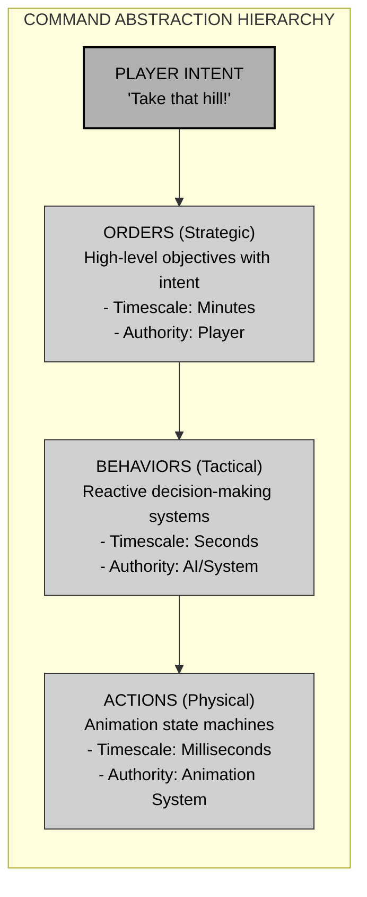
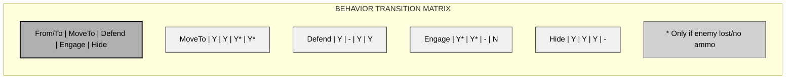
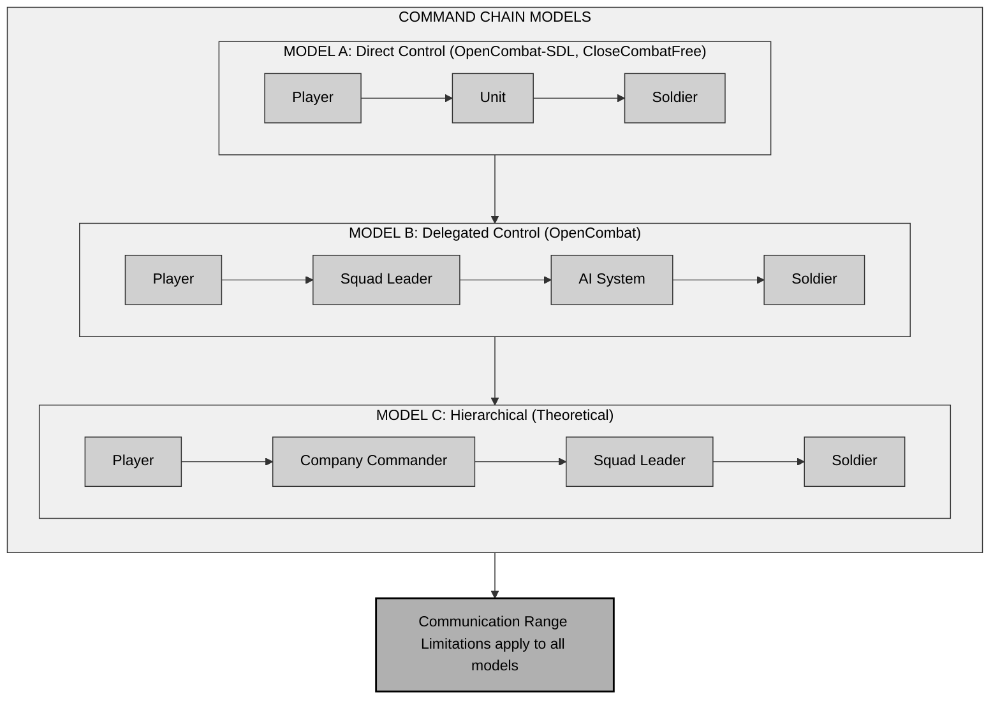
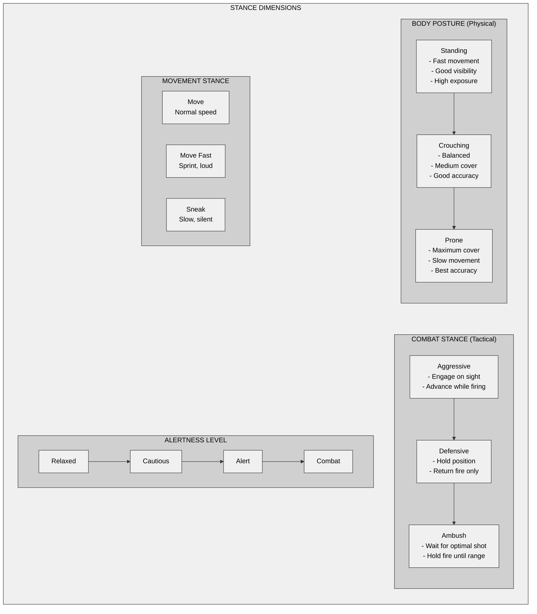
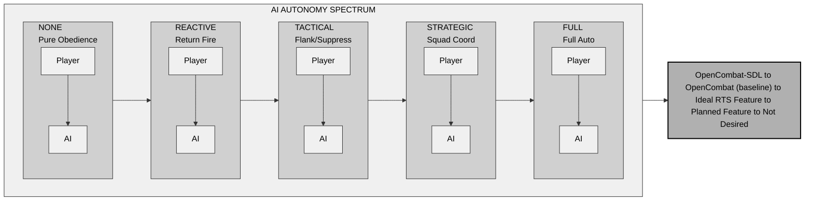

# Chapter 6: Orders, Behaviors, and AI Architecture

## 6.1 The Intent-to-Action Pipeline

Tactical wargames transform player commands into unit movement through layered abstraction. Game designers must understand this pipeline to build command systems that feel responsive yet believable.



Close Combat clones implement this hierarchy in distinct ways, each balancing player control against AI autonomy.

---

## 6.2 Three Architectural Paradigms

### 6.2.1 OpenCombat-SDL: The Pragmatic Two-Tier System

OpenCombat-SDL divides gameplay into **Orders** (player intent) and **Actions** (unit execution). This approach favors predictability over complexity.

**Core Architecture:**

```pseudocode
class OrderSystem
    // Orders represent player intent
    enum OrderType
        MoveTo(destination, speed)
        Stop
        FireAt(target)
        Ambush(arc)
        Defend(arc)
        DeploySmoke(target)

    // Actions represent physical execution
    enum ActionType
        WalkTo(destination)
        RunTo(destination)
        CrawlTo(destination)
        StandAndFire(target)
        ProneAndFire(target)
        Reload
        TakeCover

class Soldier
    Queue<Order> orders          // High-level commands
    Queue<Action> actionQueue    // Low-level execution
    State currentState

    function AddOrder(order)
        orders.enqueue(order)

    function ProcessOrders()
        if orders not empty
            order = orders.peek()
            handled = HandleOrder(order)
            if handled
                orders.dequeue()
```

**Automatic Prerequisite Resolution:**

The system automatically handles state requirements. When a player orders a soldier to fire, the engine inserts necessary preparation steps:

```pseudocode
function AddAction(action)
    // Check what state we need to be in for this action
    requiredState = GetRequiredState(action.type)

    // Build prerequisite chain
    while currentState != requiredState
        prereq = DeterminePrerequisite(currentState, requiredState)
        actionQueue.push_front(prereq)
        currentState = GetResultState(prereq)

    // Now add the original action
    actionQueue.push_back(action)
```

*Example flow*: A "Fire at enemy" command triggers automatic sequences when needed—StandUp → Reload → FireAtTarget—if the soldier is prone with an empty magazine.

**Formation-Based Movement:**

OpenCombat-SDL optimizes pathfinding by calculating one path per squad:

```pseudocode
function HandleSquadMoveOrder(squad, destination, formation)
    // Calculate single path for point man
    leaderPath = Pathfind(squad.leader.position, destination)
    squad.pointMan.AssignPath(leaderPath)

    // Other soldiers follow with formation offsets
    for each soldier in squad.members where soldier != squad.pointMan
        offset = formation.GetOffset(soldier.formationIndex)
        soldier.AssignFollowBehavior(squad.pointMan, offset)
```

This method reduces computational load from O(n) pathfinding operations to O(1), essential for real-time games with many units.

### 6.2.2 OpenCombat: The Three-Layer Behavior System

OpenCombat adds a **Behavior** layer between Orders and physical execution (called "Gestures"). This middle layer lets the AI react to changing conditions while still following player intent.

**Core Architecture:**

```pseudocode
class Order                     // Player intent
    type: OrderType
    parameters: Map
    nextOrder: Option<Order>    // Supports order chaining

enum OrderType
    Idle
    MoveTo(paths, nextOrder)
    MoveFastTo(paths, nextOrder)
    SneakTo(paths, nextOrder)
    Defend(facingAngle)
    Hide(facingAngle)
    EngageSquad(squadId)
    SuppressFire(targetPoint)

class Behavior                  // AI interpretation of orders
    type: BehaviorType
    posture: BodyPosition       // StandUp | Crouched | Lying

enum BehaviorType
    // Movement behaviors
    MoveTo(paths)
    MoveFastTo(paths)
    SneakTo(paths)
    DriveTo(paths)              // Vehicle
    RotateTo(angle)

    // Combat behaviors
    Idle(posture)
    Defend(angle)
    Hide(angle)
    SuppressFire(point)
    EngageSoldier(soldierId)

    // Terminal states
    Dead
    Unconscious

class Gesture                   // Physical execution state
    type: GestureType
    completionFrame: Frame

enum GestureType
    Idle
    Reloading(duration, weaponClass)
    Aiming(duration, weaponClass)
    Firing(duration, weaponClass)
```

**Order-to-Behavior Translation:**

```pseudocode
function TranslateOrderToBehavior(order, soldier, worldState)
    match order.type
        Idle ->
            posture = DetermineOptimalPosture(soldier, worldState)
            return Behavior.Idle(posture)

        MoveTo(paths, _) ->
            return Behavior.MoveTo(paths)

        Defend(angle) ->
            return Behavior.Defend(angle)

        EngageSquad(squadId) ->
            target = SelectTargetInSquad(squadId, soldier)
            return Behavior.EngageSoldier(target)
```

**Dynamic Behavior Override:**

The Behavior layer lets the AI react to threats and override orders when necessary.

```pseudocode
function EvaluateThreats(soldier, world)
    // Check for visible enemies
    visibleEnemy = FindVisibleEnemy(soldier, world)
    if visibleEnemy and CanEngage(soldier, visibleEnemy)
        return Behavior.EngageSoldier(visibleEnemy)

    // Check if under fire
    if soldier.feeling == UnderFire(Danger)
        cover = FindNearestCover(soldier, world)
        if cover
            return Behavior.Hide(cover.direction)

    // No immediate threats - continue with order
    return null

function UpdateSoldierBehavior(soldier, world)
    // AI can override current behavior based on threats
    override = EvaluateThreats(soldier, world)
    if override
        soldier.SetBehavior(override)
    else if soldier.currentBehavior.completed
        // Return to executing order
        newBehavior = TranslateOrderToBehavior(soldier.currentOrder, soldier, world)
        soldier.SetBehavior(newBehavior)
```

**Behavior Transition Matrix:**



The matrix shows valid transitions between behaviors, blocking illogical changes like engaging enemies while actively hiding.

### 6.2.3 CloseCombatFree: The Queue-Based Sequential System

CloseCombatFree uses a straightforward sequential order queue, where animation drives completion. The design favors clarity and accessibility over complex AI.

**Core Architecture:**

```pseudocode
class Unit
    List<Order> orders        // Sequential queue
    int currentOrderIndex     // -1 = none active
    bool isPerforming         // Lock during execution

class Order
    string operation          // "Move", "Move fast", "Sneak", "Attack", "Smoke"
    Point target
    bool performed            // Completed flag
    Color markerColor         // Visual feedback

function QueueOrder(operation, targetX, targetY)
    order = CreateOrderMarker()
    order.operation = operation
    order.target = (targetX, targetY)
    order.performed = false
    order.color = GetColorForOperation(operation)
    order.number = orders.length + 1

    orders.append(order)

    // Start processing if not already running
    if currentOrderIndex == -1
        ProcessQueue()

function ProcessQueue()
    for i from 0 to orders.length - 1
        order = orders[i]
        if order.performed
            continue

        currentOrderIndex = i

        switch order.operation
            "Move" ->
                PerformMovement(order.target, speed=1.0)
            "Move fast" ->
                PerformMovement(order.target, speed=1.5)
            "Sneak" ->
                PerformMovement(order.target, speed=0.4)
            "Attack" ->
                PerformTurretRotation(order.target)
                isFiring = true
            "Smoke" ->
                PerformTurretRotation(order.target)
                isSmoking = true

        order.performed = true
        return  // Execute one at a time

    // All orders completed
    ClearOrderQueue()

function OnActionComplete()
    // Called by animation system when action finishes
    isFiring = false
    isSmoking = false
    status = "READY"
    ProcessQueue()  // Continue to next order
```

**Visual Feedback System:**

CloseCombatFree communicates orders clearly with a consistent visual language:

```pseudocode
enum OrderColor
    Move = Green
    MoveFast = Purple
    Sneak = Yellow
    Attack = Red
    Smoke = Gray
    Defend = Blue

class OrderMarker
    int number              // Sequence number (1, 2, 3...)
    Color color             // Operation type
    bool performed          // Fade when complete

    Render()
        if performed
            opacity = 0.3
        else
            opacity = 1.0
        DrawCircle(color)
        DrawNumber(number)
```

---

## 6.3 The Command Chain: Authority and Delegation

Tactical wargames rely on military command structures. How orders move from player to individual units shapes strategic depth.

### 6.3.1 Command Hierarchy Models



### 6.3.2 Squad Coordination Patterns

**Formation-Based Coordination:**

```pseudocode
enum FormationType
    Column          // Single file - travel formation
    Line            // Horizontal spread - combat formation
    File            // Dense cluster - defensive formation
    Wedge           // V-shape - assault formation
    Vee             // Inverted V - covering formation

class SquadCoordinator
    function CalculateFormationPositions(formation, destination, memberCount)
        positions = []

        match formation
            Column ->
                for i from 0 to memberCount - 1
                    offset = (0, i * SPACING)
                    positions.append(destination + offset)

            Line ->
                width = (memberCount - 1) * SPACING
                startX = destination.x - width / 2
                for i from 0 to memberCount - 1
                    positions.append((startX + i * SPACING, destination.y))

            Wedge ->
                // Leader at point, others in expanding V
                positions.append(destination)  // Leader
                for row from 1 to (memberCount / 2) + 1
                    offset = row * SPACING
                    positions.append((destination.x - offset, destination.y + offset))
                    if positions.length < memberCount
                        positions.append((destination.x + offset, destination.y + offset))

        return positions

    function IssueFormationOrder(squad, destination, formation)
        positions = CalculateFormationPositions(formation, destination, squad.memberCount)

        for i, soldier in squad.members
            path = Pathfind(soldier.position, positions[i])
            soldier.AssignOrder(MoveTo(path))
```

**Behavior-Based Coordination:**

```pseudocode
function CoordinateSquadEngagement(squad, enemySquad)
    // Machine gunners suppress
    for soldier in squad.members
        if soldier.HasWeaponType(MachineGun)
            soldier.SetBehavior(SuppressFire(CenterOf(enemySquad)))

    // Riflemen engage specific targets
    availableEnemies = enemySquad.members.Where(e => e.alive)
    riflemen = squad.members.Where(s => s.HasWeaponType(Rifle) and not s.HasWeaponType(MachineGun))

    // Distribute targets evenly
    for i, rifleman in riflemen
        target = availableEnemies[i % availableEnemies.length]
        rifleman.SetBehavior(EngageSoldier(target))

    // Leader maintains overview
    squad.leader.SetBehavior(Defend(Facing(enemySquad)))
```

---

## 6.4 Stance Systems: Posture and Intent

Stance systems show unit posture and tactical intent to players and AI. The three games handle stance in distinct ways, each balancing simplicity against expressiveness.

### 6.4.1 Stance Taxonomy



### 6.4.2 OpenCombat-SDL: Implicit Stance

OpenCombat-SDL determines stance from the current action:

```pseudocode
enum SoldierState
    Standing
    Crouching
    Prone
    Stopped
    Moving
    Firing
    Reloading
    Dying
    Dead

function GetCurrentStance(soldier)
    if soldier.state.Contains(Prone)
        return Stance.Prone
    else if soldier.state.Contains(Crouching)
        return Stance.Crouched
    else
        return Stance.Standing

function GetStanceEffects(stance)
    match stance
        Standing ->
            return {
                movementSpeed: 1.0,
                visibility: High,
                accuracyModifier: 0.8,
                coverEffectiveness: Low
            }
        Crouched ->
            return {
                movementSpeed: 0.6,
                visibility: Medium,
                accuracyModifier: 1.0,
                coverEffectiveness: Medium
            }
        Prone ->
            return {
                movementSpeed: 0.3,
                visibility: Low,
                accuracyModifier: 1.2,
                coverEffectiveness: High
            }
```

### 6.4.3 OpenCombat: Explicit Behavior-Derived Stance

OpenCombat distinguishes body position from behavior, enabling sophisticated combinations:

```pseudocode
enum Body
    StandUp
    Crouched
    Lying

enum Behavior
    MoveTo(paths)
    Defend(angle)
    Hide(angle)
    EngageSoldier(target)
    SuppressFire(point)

function DetermineOptimalBodyPosition(soldier, behavior, threatLevel)
    match behavior
        MoveTo(_) ->
            if threatLevel > Danger
                return Body.Crouched
            else
                return Body.StandUp

        Defend(_) ->
            // Balance visibility and cover
            if soldier.HasGoodCover
                return Body.Lying
            else
                return Body.Crouched

        Hide(_) ->
            return Body.Lying  // Always prone when hiding

        EngageSoldier(target) ->
            // Dynamic based on target distance
            distance = Distance(soldier, target)
            if distance < CloseRange
                return Body.StandUp  // Faster tracking
            else if distance < MediumRange
                return Body.Crouched
            else
                return Body.Lying  // Best accuracy

function Posture.FromBehavior(behavior)
    // Posture affects hit detection and visibility
    match behavior
        MoveTo(_) | MoveFastTo(_) | Idle(_) ->
            return Posture.StandUp
        Defend(_) | SneakTo(_) | Hide(_) | SuppressFire(_) ->
            return Posture.Flat
```

---

## 6.5 Proactive vs Reactive AI

The core AI design choice in tactical games comes down to initiative: should units act on their own, or respond only to direct commands?

### 6.5.1 The Autonomy Spectrum



### 6.5.2 OpenCombat-SDL: Zero Autonomy (Pure Obedience)

```pseudocode
class SoldierAI
    function Update(soldier, world)
        // No autonomous behavior
        // Soldier only executes explicit orders
        if soldier.orders.empty()
            // Idle state - no scanning, no initiative
            return

        order = soldier.orders.peek()
        ExecuteOrder(order)
```

**Design Philosophy**: Players control every action. Soldiers function as direct extensions of player commands.

**Advantages**:
- Behavior stays predictable
- Eliminates "AI stupidity" frustrations
- Keeps accountability with the player

**Disadvantages**:
- Forces heavy micromanagement
- Feels unrealistic (real soldiers take initiative)
- Scales poorly with large unit counts

### 6.5.3 OpenCombat: Reactive Self-Preservation

```pseudocode
class ReactiveSoldierAI
    function Update(soldier, world)
        // Priority 1: Survival (cannot be overridden)
        if soldier.feeling == UnderFire(Danger)
            cover = FindCover(soldier, world)
            if cover
                soldier.SetBehavior(Hide(cover.direction))
                return

        // Priority 2: Engage visible threats
        visibleEnemy = FindVisibleEnemy(soldier, world)
        if visibleEnemy and CanEngage(soldier, visibleEnemy)
            soldier.SetBehavior(EngageSoldier(visibleEnemy))
            return

        // Priority 3: Execute player orders
        if soldier.currentOrder
            behavior = TranslateOrderToBehavior(soldier.currentOrder)
            soldier.SetBehavior(behavior)
```

**The Feeling System:**

OpenCombat models emotional state through the `Feeling` enum:

```pseudocode
enum Feeling
    UnderFire(intensity: u32)  // 0-200 scale

constants
    UNDER_FIRE_TICK = 10       // Decay per frame
    UNDER_FIRE_DANGER = 150    // Threshold for danger response
    UNDER_FIRE_WARNING = 100   // Threshold for caution

function UpdateFeeling(soldier, world)
    // Increase from nearby explosions
    for explosion in world.recentExplosions
        distance = Distance(soldier, explosion)
        if distance < 5 meters
            soldier.feeling.increase(150)
        else if distance < 10 meters
            soldier.feeling.increase(100)
        else
            soldier.feeling.increase(50)

    // Increase from nearby bullet impacts
    for bullet in world.recentBulletImpacts
        distance = Distance(soldier, bullet)
        if distance < 3 meters
            soldier.feeling.increase(100)
        else if distance < 10 meters
            soldier.feeling.increase(35)
        else
            soldier.feeling.increase(1)

    // Natural decay
    soldier.feeling.decrease(UNDER_FIRE_TICK)
```

**Design Philosophy**: Soldiers protect themselves when threatened but follow player orders otherwise.

### 6.5.4 Proactive AI: Beyond the Clones

The existing clones stop at reactive behavior. A true tactical planning system would work differently:

```pseudocode
class TacticalPlanner
    function PlanSquadAction(squad, world, strategicGoal)
        // Analyze battlefield
        threats = IdentifyThreats(squad, world)
        opportunities = IdentifyOpportunities(squad, world)

        // Generate candidate plans
        plans = []

        // Plan A: Direct assault
        plans.append(CreateAssaultPlan(squad, strategicGoal, threats))

        // Plan B: Flanking maneuver
        if HasFlankingRoute(squad, strategicGoal, world)
            plans.append(CreateFlankPlan(squad, strategicGoal, world))

        // Plan C: Suppress and advance
        if HasSuppressionCapability(squad)
            plans.append(CreateSuppressAndAdvancePlan(squad, strategicGoal))

        // Evaluate and select best plan
        bestPlan = null
        bestScore = -infinity

        for plan in plans
            score = EvaluatePlan(plan, squad, world)
            if score > bestScore
                bestScore = score
                bestPlan = plan

        return bestPlan

function EvaluatePlan(plan, squad, world)
    score = 0

    // Factor 1: Estimated casualties
    estimatedLosses = SimulateCasualties(plan, squad, world)
    score -= estimatedLosses * CASUALTY_WEIGHT

    // Factor 2: Time to completion
    estimatedTime = EstimateExecutionTime(plan)
    score -= estimatedTime * TIME_WEIGHT

    // Factor 3: Ammunition cost
    ammoCost = EstimateAmmunition(plan)
    score -= ammoCost * AMMO_WEIGHT

    // Factor 4: Success probability
    successChance = EstimateSuccess(plan, squad, world)
    score += successChance * SUCCESS_WEIGHT

    return score
```

## 6.6 Decision Architectures: GOAP vs Behavior Trees

Modern game AI relies on two main architectural patterns: **Goal-Oriented Action Planning (GOAP)** and **Behavior Trees**. Each offers distinct advantages for tactical decision-making.

### 6.6.1 Behavior Trees

Behavior Trees structure AI logic as hierarchical behaviors with standardized execution patterns.

```pseudocode
// Behavior Tree Node Types

abstract class BTNode
    function Execute(context): Status
        // Returns: Success | Failure | Running

class Selector extends BTNode
    // Tries children until one succeeds
    children: List<BTNode>

    function Execute(context)
        for child in children
            result = child.Execute(context)
            if result == Success
                return Success
            else if result == Running
                return Running
        return Failure

class Sequence extends BTNode
    // Executes children until one fails
    children: List<BTNode>

    function Execute(context)
        for child in children
            result = child.Execute(context)
            if result == Failure
                return Failure
            else if result == Running
                return Running
        return Success

class Condition extends BTNode
    // Checks world state
    predicate: Function<Context, bool>

    function Execute(context)
        if predicate(context)
            return Success
        else
            return Failure

class Action extends BTNode
    // Performs game action
    action: Function<Context, Status>

    function Execute(context)
        return action(context)
```

**Example: Soldier Behavior Tree:**

```pseudocode
class SoldierBehaviorTree
    function BuildTree()
        return Selector([
            // Priority 1: React to immediate danger
            Sequence([
                Condition(IsUnderHeavyFire),
                Selector([
                    Sequence([
                        Condition(HasNearbyCover),
                        Action(MoveToCover)
                    ]),
                    Action(ReturnFire)
                ])
            ]),

            // Priority 2: Engage visible enemies
            Sequence([
                Condition(CanSeeEnemy),
                Action(EngageTarget)
            ]),

            // Priority 3: Follow orders
            Sequence([
                Condition(HasPendingOrder),
                Action(ExecuteCurrentOrder)
            ]),

            // Priority 4: Idle behavior
            Action(IdleScan)
        ])
```

**Behavior Trees offer several benefits:**
- Clear, visual structure
- Simple debugging and modification
- Good performance (O(depth) per tick)
- Industry standard in engines like Unreal and Unity

**Limitations include:**
- Complexity grows with long-term planning needs
- Primarily reactive by design
- Requires manual structuring of all possible behaviors

### 6.6.2 Goal-Oriented Action Planning (GOAP)

GOAP inverts the decision-making process. Instead of checking conditions top-down, the AI plans backward from goals.

```pseudocode
// GOAP Components

class WorldState
    // Represents the current state of the world
    facts: Map<String, Value>

    function Get(key)
        return facts[key]

    function Set(key, value)
        facts[key] = value

    function DistanceTo(otherState)
        // Returns number of facts that differ
        differences = 0
        for key in facts.keys
            if facts[key] != otherState.facts[key]
                differences += 1
        return differences

class Action
    name: String
    cost: float
    preconditions: Map<String, Value>
    effects: Map<String, Value>

    function IsValid(state)
        // Check if all preconditions are met
        for key, value in preconditions
            if state.Get(key) != value
                return false
        return true

    function Apply(state)
        // Apply effects to state
        newState = state.Clone()
        for key, value in effects
            newState.Set(key, value)
        return newState

class GOAPPlanner
    function Plan(currentState, goalState, availableActions)
        // A* search from current state to goal
        openSet = PriorityQueue()
        openSet.Add(Node(currentState, [], 0))

        while not openSet.empty()
            current = openSet.Pop()

            // Check if goal reached
            if current.state == goalState
                return current.actions

            // Generate successors
            for action in availableActions
                if action.IsValid(current.state)
                    newState = action.Apply(current.state)
                    newActions = current.actions + [action]
                    cost = current.cost + action.cost

                    // Heuristic: estimated cost to goal
                    heuristic = newState.DistanceTo(goalState)

                    openSet.Add(Node(newState, newActions, cost + heuristic))

        return null  // No plan found
```

**Example: Soldier GOAP Domain:**

```pseudocode
// World State Facts
enum Fact
    HasWeaponLoaded
    IsInCover
    IsSafe
    CanSeeEnemy
    EnemyDead
    IsReloading

// Available Actions
actions = [
    Action(
        name: "Reload",
        cost: 3.0,
        preconditions: {IsReloading: false},
        effects: {HasWeaponLoaded: true}
    ),

    Action(
        name: "MoveToCover",
        cost: 2.0,
        preconditions: {IsInCover: false},
        effects: {IsInCover: true, IsSafe: true}
    ),

    Action(
        name: "EngageEnemy",
        cost: 1.0,
        preconditions: {
            CanSeeEnemy: true,
            HasWeaponLoaded: true
        },
        effects: {EnemyDead: true}
    ),

    Action(
        name: "TakeCover",
        cost: 0.5,
        preconditions: {IsInCover: false, IsUnderFire: true},
        effects: {IsInCover: true, IsSafe: true}
    )
]

// Example planning
function ReactToContact(soldier, world)
    currentState = WorldState({
        HasWeaponLoaded: soldier.weapon.loaded,
        IsInCover: soldier.isInCover,
        IsSafe: not soldier.underFire,
        CanSeeEnemy: CanSeeEnemy(soldier, world)
    })

    goalState = WorldState({
        IsSafe: true,
        EnemyDead: true
    })

    plan = GOAPPlanner.Plan(currentState, goalState, actions)

    if plan
        ExecutePlan(plan)
    else
        // Fallback: just take cover
        ExecuteAction(MoveToCover)
```

**GOAP's strengths include:**
- Emergent behavior from action combinations
- Natural handling of complex multi-step planning
- Easy addition of new actions without restructuring
- Proactive decision-making

**Challenges involve:**
- Higher computational cost (A* search)
- Potential for unrealistic plans
- Careful cost tuning requirements
- More difficult debugging of planned sequences

### 6.6.3 Comparative Analysis

| Aspect        | Behavior Trees               | GOAP                               |
| ------------- | ---------------------------- | ---------------------------------- |
| **Complexity**    | Linear in tree size          | Exponential in plan length         |
| **Modifiability** | Easy (add nodes)             | Easy (add actions)                 |
| **Planning**      | Reactive                     | Proactive                          |
| **Emergence**     | Limited                      | High                               |
| **Debugging**     | Visual, intuitive            | Requires plan inspection           |
| **Performance**   | O(depth)                     | O(actions^depth)                   |
| **Use Cases**     | Reactive AI, clear behaviors | Complex planning, emergent tactics |

**Recommendations for tactical wargames:**
- Implement **Behavior Trees** for individual soldier behaviors (OpenCombat's current approach)
- Consider **GOAP** for squad-level tactical planning (advanced feature)
- Combine both approaches: GOAP generates high-level plans while Behavior Trees execute individual actions

---

## 6.7 Universal Patterns for Order Systems

Across all three implementations, tactical order systems share core requirements.

### 6.7.1 The Order State Machine

```pseudocode
enum OrderState
    Pending       // Queued but not started
    Active        // Currently executing
    Interrupted   // Suspended (e.g., by combat)
    Completed     // Successfully finished
    Failed        // Could not complete (blocked, etc.)
    Cancelled     // Explicitly cancelled by player

class Order
    type: OrderType
    state: OrderState
    parameters: Map
    priority: int
    interruptible: bool
    createdAt: Time

    function Update(deltaTime)
        match state
            Pending ->
                if CanStart()
                    state = Active
                    OnStart()

            Active ->
                status = Execute(deltaTime)
                match status
                    Complete -> state = Completed
                    Failed -> state = Failed
                    Interrupted -> state = Interrupted
                    Running -> // Continue

            Interrupted ->
                if CanResume()
                    state = Active
                    OnResume()

    function Interrupt()
        if interruptible
            state = Interrupted
            OnInterrupt()
            return true
        return false
```

### 6.7.2 Priority Systems

```pseudocode
constants
    PRIORITY_SURVIVAL = 1000    // Cannot be overridden
    PRIORITY_ENGAGEMENT = 500   // Combat situations
    PRIORITY_ORDERS = 100       // Player commands
    PRIORITY_IDLE = 0           // Default state

class PriorityOrderQueue
    orders: PriorityQueue<Order>

    function Add(order)
        orders.Insert(order, order.priority)

    function Update()
        // Check if current order should be interrupted
        if not orders.empty()
            topOrder = orders.peek()

            if currentOrder and topOrder.priority > currentOrder.priority
                if currentOrder.Interrupt()
                    currentOrder = topOrder
                    orders.pop()
```

### 6.7.3 Order Chaining and Composition

```pseudocode
class ChainedOrder extends Order
    nextOrder: Option<Order>

    function OnComplete()
        if nextOrder
            return nextOrder  // Automatically queue next
        return null

// Example: Complex tactical maneuver
function CreateAssaultOrder(squad, objective)
    // Phase 1: Move to cover near objective
    approach = Order.MoveTo(coverPosition)

    // Phase 2: Suppress objective while advancing
    suppress = Order.SuppressFire(objective)
    approach.nextOrder = suppress

    // Phase 3: Assault the position
    assault = Order.MoveFastTo(objective)
    suppress.nextOrder = assault

    // Phase 4: Defend taken position
    defend = Order.Defend(objective.facing)
    assault.nextOrder = defend

    return approach

// Parallel composition
function CreateCoordinatedAttack(squad, target)
    // Fire team suppresses
    suppressOrder = Order.SuppressFire(target)
    for machineGunner in squad.MachineGunners
        machineGunner.GiveOrder(suppressOrder)

    // Assault team advances
    moveOrder = Order.MoveFastTo(flankPosition)
    for rifleman in squad.Riflemen
        rifleman.GiveOrder(moveOrder)
```

### 6.7.4 Conditional Orders

```pseudocode
enum ConditionType
    EnemyInRange(distance)
    UnderFire
    SquadMemberDown
    TimeElapsed(duration)
    AmmunitionBelow(threshold)

class ConditionalOrder extends Order
    condition: Condition
    trueOrder: Order    // Execute if condition met
    falseOrder: Order   // Execute if condition not met (optional)
    checkInterval: Time // How often to check

    function Execute(deltaTime)
        if TimeSinceLastCheck() >= checkInterval
            if Evaluate(condition)
                return Execute(trueOrder)
            else if falseOrder
                return Execute(falseOrder)
            else
                return Complete
        return Running

// Example: "Move to building, engage if enemies spotted"
function CreateCautiousAdvance(destination)
    moveOrder = Order.MoveTo(destination)

    conditional = ConditionalOrder(
        condition: EnemyInRange(50),
        trueOrder: Order.EngageNearest(),
        falseOrder: null,
        checkInterval: 1.0 seconds
    )

    moveOrder.nextOrder = conditional
    return moveOrder
```

---

## 6.8 Implementation Recommendations

Based on the comparative analysis, here's how to build a modern tactical wargame:

### 6.8.1 Recommended Hybrid Architecture

```pseudocode
class ModernOrderSystem
    // Data-driven order types for modding
    OrderRegistry orderTypes

    // Four-layer hierarchy
    Layer1: PlayerInput        // Translates clicks to orders
    Layer2: OrderInterpreter   // Converts orders to squad strategies
    Layer3: BehaviorSystem     // Individual soldier AI
    Layer4: AnimationSystem    // Physical execution

    function Initialize()
        // Load order types from data
        orderTypes.LoadFrom("config/orders.json")

    function ProcessPlayerInput(input)
        order = CreateOrderFromInput(input)
        IssueOrder(order, input.selectedUnits)

    function IssueOrder(order, recipients)
        for unit in recipients
            if unit.type == Squad
                strategy = StrategyInterpreter.Interpret(order, unit)
                unit.AssignStrategy(strategy)
            else
                behavior = BehaviorInterpreter.Interpret(order, unit)
                unit.SetBehavior(behavior)
```

### 6.8.2 Data-Driven Order Definitions

```json
{
    "order_types": [
        {
            "id": "move",
            "display_name": "Move",
            "icon": "orders/move.png",
            "cursor": "cursors/move.png",
            "parameters": [
                {"name": "destination", "type": "point", "required": true},
                {"name": "speed", "type": "enum", "values": ["walk", "run", "sneak"], "default": "walk"}
            ],
            "behavior_script": "scripts/behaviors/move.lua",
            "requires_line_of_sight": false,
            "valid_targets": ["ground", "building"]
        },
        {
            "id": "suppress",
            "display_name": "Suppress Fire",
            "icon": "orders/suppress.png",
            "cursor": "cursors/target.png",
            "parameters": [
                {"name": "target_area", "type": "point", "required": true},
                {"name": "duration", "type": "float", "default": 10.0}
            ],
            "behavior_script": "scripts/behaviors/suppress.lua",
            "requires_weapon_type": ["machine_gun", "rifle"],
            "squad_only": false
        },
        {
            "id": "assault",
            "display_name": "Assault Position",
            "icon": "orders/assault.png",
            "cursor": "cursors/attack.png",
            "parameters": [
                {"name": "destination", "type": "point", "required": true}
            ],
            "behavior_script": "scripts/behaviors/assault.lua",
            "squad_only": true,
            "coordinated": true
        }
    ]
}
```

### 6.8.3 Scriptable Squad AI

```lua
-- squad_ai/move.lua
function execute(squad, order)
    local destination = order.parameters.destination
    local speed = order.parameters.speed

    -- Select formation based on threat level
    local formation = selectFormation(squad, destination)

    -- Calculate individual paths
    local positions = formation:getPositions(destination, #squad.members)

    -- Assign to soldiers
    for i, soldier in ipairs(squad.members) do
        local path = findPath(soldier.position, positions[i])

        if speed == "sneak" then
            soldier:setBehavior(SneakTo(path))
        elseif speed == "run" then
            soldier:setBehavior(MoveFastTo(path))
        else
            soldier:setBehavior(MoveTo(path))
        end
    end
end

-- squad_ai/assault.lua (coordinated action)
function execute(squad, order)
    local destination = order.parameters.destination

    -- Split squad by role
    local suppressors = {}
    local assaulters = {}

    for _, soldier in ipairs(squad.members) do
        if soldier:hasWeapon("machine_gun") then
            table.insert(suppressors, soldier)
        else
            table.insert(assaulters, soldier)
        end
    end

    -- Phase 1: Suppress target area
    for _, mg in ipairs(suppressors) do
        mg:setBehavior(SuppressFire(destination))
    end

    -- Phase 2: After delay, assaulters advance
    schedule(2.0, function()
        for _, rifleman in ipairs(assaulters) do
            local path = findPath(rifleman.position, destination)
            rifleman:setBehavior(MoveFastTo(path))
        end
    end)
end

-- Reaction to enemy contact
function onEnemySpotted(squad, enemy)
    if squad.currentOrder == "move" then
        -- Halt and engage
        squad:halt()
        squad:orderEngage(enemy)
    elseif squad.currentOrder == "defend" then
        -- Hold position but fire at will
        for _, soldier in ipairs(squad.members) do
            if soldier:canSee(enemy) then
                soldier:setBehavior(EngageSoldier(enemy))
            end
        end
    end
end
```

### 6.8.4 Behavior Tree Configuration

```yaml
# behavior_trees/soldier_default.yaml
selector:
  name: "Root"
  children:
    # Priority 1: React to immediate threats
    - sequence:
        name: "Survival Response"
        children:
          - condition:
              name: "Is Under Fire"
              check: "soldier.underFire > DANGER_THRESHOLD"
          - selector:
              name: "Find Safety"
              children:
                - sequence:
                    name: "Move to Cover"
                    children:
                      - condition:
                          name: "Has Nearby Cover"
                          check: "world.hasCover(soldier, 20)"
                      - action:
                          name: "Move To Cover"
                          execute: "behaviors.moveToCover"
                - action:
                    name: "Return Fire"
                    execute: "behaviors.returnFire"

    # Priority 2: Engage enemies
    - sequence:
        name: "Combat Response"
        children:
          - condition:
              name: "Can See Enemy"
              check: "world.visibleEnemies(soldier).length > 0"
          - action:
              name: "Engage Target"
              execute: "behaviors.engageBestTarget"

    # Priority 3: Follow orders
    - sequence:
        name: "Execute Orders"
        children:
          - condition:
              name: "Has Active Order"
              check: "soldier.currentOrder != null"
          - action:
              name: "Execute Order"
              execute: "behaviors.executeOrder"

    # Priority 4: Idle
    - action:
        name: "Idle Scan"
        execute: "behaviors.idleScan"
```

---

## 6.9 Comparative Summary

| Feature             | OpenCombat-SDL              | OpenCombat                            | CloseCombatFree          |
| ------------------- | --------------------------- | ------------------------------------- | ------------------------ |
| **Architecture**        | Two-tier (Orders→Actions)   | Three-layer (Orders→Behavior→Gesture) | Queue-based sequential   |
| **AI Autonomy**         | None (pure obedience)       | Reactive (self-preservation)          | Minimal (state triggers) |
| **Order Types**         | 5 basic types               | 8 types + chaining                    | 7 types                  |
| **Queue Support**       | Implicit (action queue)     | Explicit (order chaining)             | Explicit (order list)    |
| **Squad Coordination**  | Formation positions         | Individual pathing + AI               | Not implemented          |
| **Prerequisites**       | Automatic (action chaining) | Gesture timing                        | Animation-driven         |
| **Override Capability** | Player only                 | AI can override orders                | Player only              |
| **Visual Feedback**     | Action markers              | Debug paths                           | Order markers            |
| **Stance System**       | Implicit (state-derived)    | Explicit (Body enum)                  | Implicit                 |
| **Moddability**         | Compiled C++                | Compiled Rust                         | Compiled C++/QML         |

**Key Insights:**

1. All three clones separate orders from actions, though their approaches differ. A two-tier system works for strict player control, while three layers allow more nuanced AI behavior.

2. AI that acts independently cuts down on micromanagement but may frustrate players who prefer precision. Hardcore wargamers want obedience; casual players appreciate initiative.

3. Formations streamline pathfinding and enable coordinated tactics. They're critical for squad-based gameplay.

4. Players need clear visual cues to understand what's happening. CloseCombatFree's color-coded order markers stand out as the most intuitive.

5. Prerequisites should happen automatically but remain visible. Soldiers shouldn't just pause—they should make it obvious why they're waiting.

6. Reactive AI needs emotional context. Without fear or suppression, units feel mechanical, and their choices seem random.

7. Scriptable behaviors let modders extend the game without touching code. Data-driven order definitions keep the game fresh longer.

---

## 6.10 Conclusion

Tactical wargames must balance player control with unit autonomy. Each Close Combat clone handles this differently, offering solutions for distinct design goals.

OpenCombat-SDL shows that simplicity works when the core simulation—ballistics, cover, suppression—is strong enough. Its automatic prerequisite system keeps control in the player's hands without adding friction.

OpenCombat adds a behavior layer, making AI feel alive while respecting player intent. The Feeling system turns combat into a psychological battle.

CloseCombatFree prioritizes clarity. Its visual order system makes tactics accessible to newcomers.

Future projects should:

- Build order types as data, not code, for easier modding
- Use behavior trees for AI that scales in complexity
- Support squad-level strategies that coordinate units automatically
- Show clear visual feedback for orders and states
- Allow conditional orders for advanced planning
- Let players adjust AI autonomy through difficulty settings
- Add feeling systems to humanize soldiers

The best order system isn't the most complex. It's the one that makes players feel like commanders, not babysitters, while keeping the simulation's logic transparent and fair.

---

*Next: [Chapter 7: Moddability and Data-Driven Architecture](chapter_07_moddability.md)*
