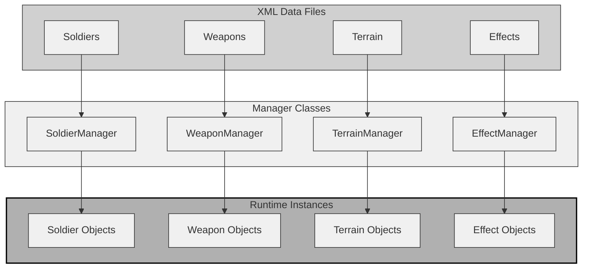
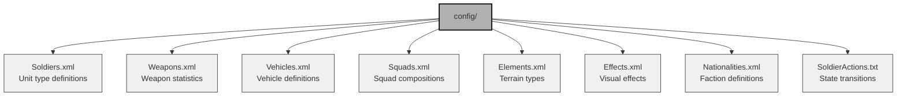
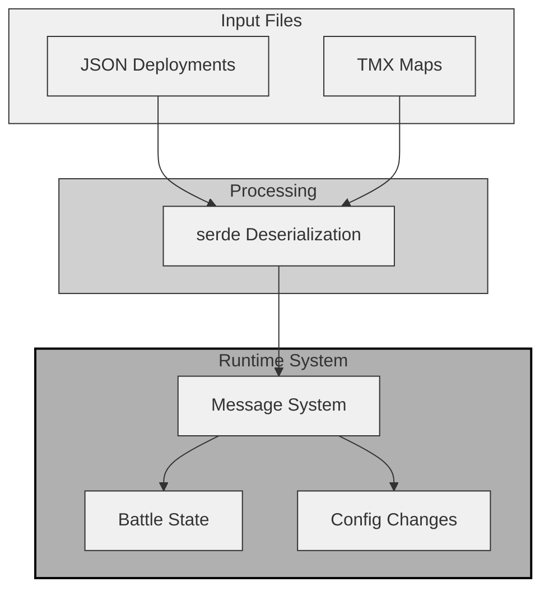
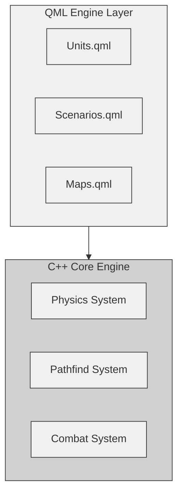
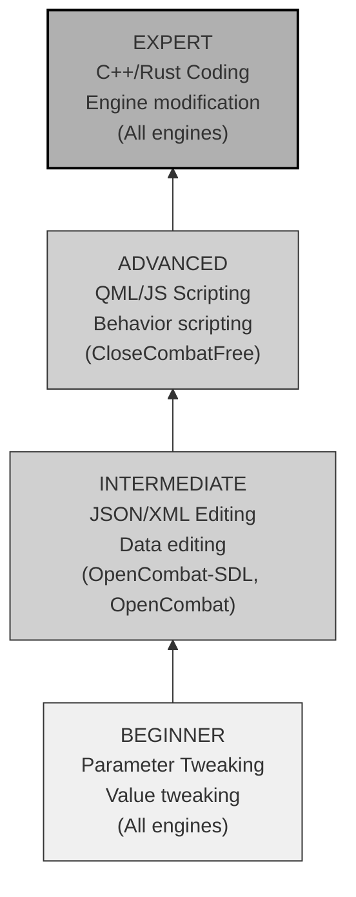
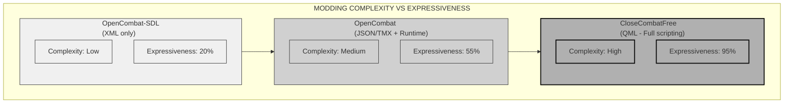
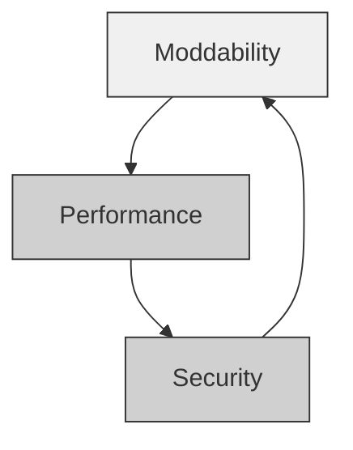
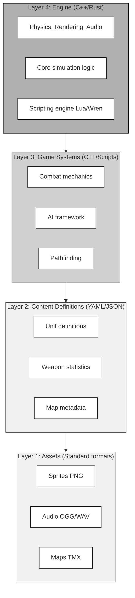

# Chapter 7: Moddability and Data-Driven Architecture

## 7.1 Introduction: The Architecture of Extensibility

Moddability shapes tactical wargame development more than most architectural choices. It defines how players extend the game and how developers refine their designs. The best modding systems erase the line between creator and player, letting communities build content that outgrows the original vision.

This chapter explores three modding approaches through Close Combat clones:

| Approach              | Implementation    | Philosophy                                   |
| --------------------- | ----------------- | -------------------------------------------- |
| **Configuration Modding** | OpenCombat-SDL    | Data separation with hardcoded behavior      |
| **Data-Driven Design**    | OpenCombat (Rust) | Message-based configuration with type safety |
| **Declarative Modding**   | CloseCombatFree   | Full QML-based content definition            |

These approaches occupy different points on the modding spectrum, each balancing accessibility, performance, and expressive power. Their trade-offs offer valuable lessons for architects designing the next generation of tactical simulations.

---

## 7.2 The Modding Spectrum: A Taxonomy of Extensibility

A framework for evaluating modding capabilities helps compare implementations. Modding ranges from simple tweaks to complete engine replacements:

### 7.2.1 The Four Levels of Modding


**Parameter Tweaking (Level 1)**: Players adjust values like weapon damage, unit speed, or visibility ranges. Non-programmers can make these changes with text editors.

**Content Addition (Level 2)**: Creators add new entities using existing templates—new soldier types with standard behaviors or maps with established terrain. This requires asset creation but no programming.

**Mechanics Changes (Level 3)**: Modders alter core game functions—new AI behaviors, suppression systems, or visibility calculations. These changes demand scripting or programming knowledge.

**Total Conversion (Level 4)**: The game transforms into something entirely different—fantasy combat, sci-fi settings, or new rule systems. This level requires deep engine modification.

### 7.2.2 Modding Capability Matrix

Architectural approaches enable different modding levels:

| Capability      | Level 1        | Level 2           | Level 3      | Level 4       |
| --------------- | -------------- | ----------------- | ------------ | ------------- |
| **Data Format**     | INI/XML/JSON   | XML/JSON + Assets | Scripting    | Full SDK      |
| **Skill Required**  | Non-programmer | Designer/Artist   | Scripter     | Programmer    |
| **Tooling**         | Text editor    | Editor tools      | IDE/Debugger | Engine source |
| **Iteration Speed** | Instant        | Minutes           | Hours        | Days          |
| **Distribution**    | Config files   | Asset packs       | Mod packages | Fork/Engine   |

---

## 7.3 OpenCombat-SDL: The Configuration Approach

OpenCombat-SDL follows the traditional modding model. It separates data from code but keeps behavior logic in compiled C++.

### 7.3.1 Architecture Overview



### 7.3.2 Data Files and Structure

OpenCombat-SDL stores moddable content in XML files:



**Example: Soldier Definition (XML)**

```xml
<!-- config/Soldiers.xml -->
<Soldier>
    <Name>Garand</Name>
    <PrimaryWeapon>M1 Garand</PrimaryWeapon>
    <PrimaryWeaponNumClips>4</PrimaryWeaponNumClips>
    <SecondaryWeapon>None</SecondaryWeapon>

    <States>
        <State>
            <Name>Standing</Name>
            <Animation>Standing Rest</Animation>
        </State>
        <State>
            <Name>Prone</Name>
            <Animation>Prone Crawl</Animation>
        </State>
    </States>

    <Attributes>
        <WalkingSpeed>2.5</WalkingSpeed>
        <RunningSpeed>5.36</RunningSpeed>
        <SneakingSpeed>0.84</SneakingSpeed>
        <CanMove/>
        <CanFire/>
        <CanDefend/>
    </Attributes>
</Soldier>
```

**Example: Weapon Definition (XML)**

```xml
<!-- config/Weapons.xml -->
<Weapon>
    <Name>M1 Garand</Name>
    <Type>Rifle</Type>
    <Damage>45</Damage>
    <Range>300</Range>
    <RateOfFire>0.5</RateOfFire>
    <ClipSize>8</ClipSize>
    <ReloadTime>2500</ReloadTime>
    <Sound>garand_fire</Sound>
</Weapon>
```

### 7.3.3 The Manager Pattern

The Manager pattern handles data loading and object creation:

```cpp
// src/objects/SoldierManager.h
class SoldierManager {
    std::vector<SoldierTemplate*> _templates;

public:
    void LoadFromXML(const std::string& filename);
    Soldier* CreateInstance(const std::string& typeName);
    SoldierTemplate* GetTemplate(const std::string& typeName);
};

// Implementation
void SoldierManager::LoadFromXML(const std::string& filename) {
    XMLDocument doc;
    doc.LoadFile(filename.c_str());

    for (auto* soldierNode = doc.FirstChildElement("Soldier");
         soldierNode != nullptr;
         soldierNode = soldierNode->NextSiblingElement("Soldier")) {

        SoldierTemplate* temp = new SoldierTemplate();
        temp->name = soldierNode->FirstChildElement("Name")->GetText();
        temp->walkingSpeed = soldierNode->FirstChildElement("WalkingSpeed")
                                         ->GetFloatText();
        // ... parse other attributes

        _templates.push_back(temp);
    }
}

Soldier* SoldierManager::CreateInstance(const std::string& typeName) {
    SoldierTemplate* temp = GetTemplate(typeName);
    if (!temp) return nullptr;

    Soldier* soldier = new Soldier();
    soldier->ApplyTemplate(temp);  // Copy template values
    return soldier;
}
```

### 7.3.4 Modding Capabilities and Limitations

**What Can Be Modded Without Recompilation:**

| Aspect             | Modifiable | Method                  |
| ------------------ | ---------- | ----------------------- |
| Unit Stats         | ✓          | Edit XML values         |
| Weapon Parameters  | ✓          | Edit XML values         |
| Squad Composition  | ✓          | Edit XML structure      |
| Terrain Properties | ✓          | Edit XML values         |
| Visual Effects     | ✓          | Edit XML and sprites    |
| Animation Mappings | ✓          | Edit XML references     |
| State Transitions  | ✓          | Edit SoldierActions.txt |

**What Requires Code Changes:**

| Aspect               | Hardcoded Location    | Change Required                  |
| -------------------- | --------------------- | -------------------------------- |
| New Soldier Types    | SoldierType enum      | Add enum and recompile           |
| New States           | SoldierState enum     | Add enum, handler, and recompile |
| New AI Behaviors     | C++ classes           | Implement logic and recompile    |
| New Weapon Mechanics | Weapon::CalculateShot | Modify C++ and recompile         |
| Pathfinding          | AStar class           | Change algorithm and recompile   |
| Physics              | Collision system      | Modify engine and recompile      |

### 7.3.5 Pain Points Analysis

The OpenCombat-SDL architecture document highlights key modding limitations:

```cpp
// Hardcoded enums prevent runtime extension
enum class SoldierState {
    IDLE = 0,
    MOVING = 1,
    FIRING = 2,
    RELOADING = 3,
    PRONE = 4,
    // Adding new states requires recompilation
};

// Behavior logic locked in C++
void Soldier::UpdateAI(float dt) {
    // AI logic is hardcoded
    if (_state == SoldierState::FIRING) {
        // Fixed firing behavior
    }
}
```

OpenCombat-SDL supports Level 1-2 modding—parameter tweaking and content addition—but requires recompilation for Level 3+ changes to game mechanics.

---

## 7.4 OpenCombat (Rust): The Data-Driven Approach

OpenCombat takes a different path, using Rust's type system and message-passing to allow runtime configuration changes without sacrificing type safety.

### 7.4.1 Architecture Overview



### 7.4.2 JSON Deployment System

OpenCombat defines scenarios in JSON, allowing precise mission setups:

```json
{
  "soldiers": [
    {
      "uuid": 0,
      "type_": "Type1",
      "side": "A",
      "world_point": {"x": 100.0, "y": 200.0},
      "squad_uuid": 0,
      "main_weapon": {
        "MosinNagantM1924": [true, {"MosinNagant": 5}]
      },
      "magazines": [
        {"MosinNagant": 5},
        {"MosinNagant": 5}
      ],
      "order": {"Defend": {"position": {"x": 100.0, "y": 200.0}}},
      "behavior": "Standard"
    },
    {
      "uuid": 1,
      "type_": "Bren",
      "side": "A",
      "world_point": {"x": 105.0, "y": 200.0},
      "squad_uuid": 0,
      "main_weapon": {
        "BrenMark2": [{"BrenCurved30": 30}]
      },
      "order": {"Suppress": {"position": {"x": 400.0, "y": 200.0}}}
    }
  ],
  "vehicles": [
    {
      "uuid": 0,
      "type_": "T26",
      "side": "A",
      "world_point": {"x": 150.0, "y": 250.0}
    }
  ],
  "squads": {
    "0": "Type1"
  }
}
```

### 7.4.3 Runtime Configuration System

OpenCombat stands out with its message-based configuration system, allowing parameters to change during runtime:

```rust
// battle_core/src/config.rs
pub struct ServerConfig {
    // Timing parameters
    pub target_cycle_duration_us: u64,
    pub flags_update_freq: u64,
    pub soldier_update_freq: u64,

    // Visibility modifiers (runtime tweakable)
    pub visibility_idle_standup_modifier: f32,
    pub visibility_idle_crouch_modifier: f32,
    pub visibility_idle_lying_modifier: f32,
    pub visibility_move_to_modifier: f32,
    pub visibility_sneak_to_modifier: f32,
    pub visibility_defend_modifier: f32,
    pub visibility_hide_modifier: f32,

    // Terrain opacity (runtime tweakable)
    pub tile_type_opacity_short_grass: f32,
    pub tile_type_opacity_high_grass: f32,
    // ... 60+ configurable parameters
}

// Message enum for runtime configuration changes
pub enum ChangeConfigMessage {
    // Visibility adjustments
    VisibilityIdleStandupModifier(f32),
    VisibilityCrouchModifier(f32),
    VisibilityLyingModifier(f32),
    VisibilityMoveToModifier(f32),
    VisibilitySneakToModifier(f32),
    VisibilityDefendModifier(f32),
    VisibilityHideModifier(f32),

    // Terrain opacity adjustments
    TileTypeOpacityShortGrass(f32),
    TileTypeOpacityHighGrass(f32),
    TileTypeOpacityUnderbrush(f32),
    // ... additional terrain types

    // Explosive radius adjustments
    ExplosiveDirectDeathRayon(ExplosiveType, Distance),
    ExplosiveRegressiveDeathRayon(ExplosiveType, Distance),

    // Combat parameters
    HideMaximumRayon(Distance),
    InaccurateFireFactorByMeter(f32),
    PathFindingHeuristicCoefficient(f32),
}

// Applying configuration changes at runtime
impl BattleState {
    pub fn apply_config_change(&mut self, msg: ChangeConfigMessage) {
        match msg {
            ChangeConfigMessage::VisibilityIdleStandupModifier(v) => {
                self.config.visibility_idle_standup_modifier = v;
            }
            ChangeConfigMessage::VisibilityCrouchModifier(v) => {
                self.config.visibility_idle_crouch_modifier = v;
            }
            // ... handle all variants
        }
    }
}
```

### 7.4.4 Tiled Map Integration

OpenCombat integrates the industry-standard Tiled editor for map creation:

```xml
<!-- resources/maps/map1/map.tmx -->
<?xml version="1.0" encoding="UTF-8"?>
<map version="1.10" orientation="orthogonal"
     width="112" height="64" tilewidth="5" tileheight="5">

  <tileset firstgid="1" source="terrain.tsx"/>

  <!-- Background imagery -->
  <imagelayer id="2" name="background_image">
    <image source="map1.png" width="560" height="320"/>
  </imagelayer>

  <!-- Terrain grid -->
  <layer id="1" name="terrain" width="112" height="64">
    <data encoding="csv">
      1,1,1,2,2,3,3,3,...
    </data>
  </layer>

  <!-- Spawn zones with properties -->
  <objectgroup id="7" name="spawn_zones">
    <object id="10" name="spawn_A" x="50" y="100" width="30" height="30">
      <properties>
        <property name="side" value="A"/>
        <property name="squad_size" value="8"/>
      </properties>
    </object>
  </objectgroup>

  <!-- Interior zones with cover values -->
  <objectgroup id="4" name="interiors_zones">
    <object id="1" name="house1" x="100" y="200" width="50" height="40">
      <properties>
        <property name="opacity" value="0.9"/>
        <property name="cover_type" value="wall"/>
      </properties>
    </object>
  </objectgroup>
</map>
```

### 7.4.5 Type System Constraints

OpenCombat's data-driven approach offers flexibility, though Rust's strong type system imposes modding limitations:

```rust
// These enums define valid types at compile time
// Adding new types requires code changes

pub enum SoldierType {
    Type1,    // Standard rifleman
    Bren,     // Light machine gunner
    Mg34,     // Heavy machine gunner
}

pub enum Weapon {
    MosinNagantM1924(bool, Option<Magazine>),
    MauserG41(bool, Option<Magazine>),
    BrenMark2(Option<Magazine>),
    Mg34(Option<Magazine>),
}

pub enum VehicleType {
    T26,  // Currently only one vehicle type
}
```

To add a new soldier type:
1. Add variant to `SoldierType` enum
2. Add sprite loading code
3. Add behavior implementations
4. Recompile the entire project

OpenCombat supports Level 2 modding—adding content with standard types—while offering exceptional runtime configurability. Level 3+ modding, however, requires recompilation due to Rust's type system.

---

## 7.5 CloseCombatFree: The Declarative Modding Revolution

CloseCombatFree takes moddability further than any other clone by using QML (Qt Meta Language). It lets players define entire game elements without recompiling the engine.

### 7.5.1 Architecture Overview



### 7.5.2 QML-Based Unit Definitions

CloseCombatFree defines units entirely in QML, a radical departure from traditional approaches:

```qml
// units/tanks/HeavyTank.qml
import QtQuick 2.1
import "../../qml/units"
import "../../qml/units/tanks"

Tank {
    id: root

    // Identity
    unitFileName: "HeavyTank"
    unitType: "Heavy Tank"
    unitLogo: "../../img/units/tanks/heavy_logo.png"

    // Performance characteristics
    maxSpeed: 18                    // km/h
    rotationSpeed: 30               // degrees/sec
    turretRotationSpeed: 25         // degrees/sec
    acceleration: 2.5               // m/s²

    // Dimensions
    unitWidth: 70
    unitHeight: 110

    // Armor values (mm)
    frontArmour: 120
    sideArmour: 90
    backArmour: 60
    turretArmour: 100

    // Combat parameters
    mainGunReloadingTime: 5000      // milliseconds

    // Visual components
    HeavyTankHull {
        id: hull
        color: "#4a6741"           // Olive drab
    }

    HeavyTankTurret {
        id: turret
        weapon: "HeavyCannon"
    }

    // Crew configuration
    Soldier { role: "Commander" }
    Soldier { role: "Gunner" }
    Soldier { role: "Loader" }
    Soldier { role: "Driver" }
    Soldier { role: "MachineGunner" }

    // Custom behavior function
    function onEnemySpotted(enemy) {
        if (distanceTo(enemy) < 200) {
            turret.rotateToward(enemy);
            if (turret.aimedAt(enemy)) {
                fire();
            }
        }
    }

    // State change handlers
    onUnitStatusChanged: {
        if (unitStatus === "RELOADING") {
            hull.showReloadIndicator();
        }
    }
}
```

### 7.5.3 QML-Based Scenario Definitions

Scenarios are complete QML documents that define missions:

```qml
// scenarios/BridgeDefense.qml
import QtQuick 2.1
import "../units/tanks"
import "../maps"

Item {
    property string mapFile: "../maps/RiverCrossing.qml"
    property string briefing: "Defend the bridge at all costs. Hold for 10 minutes."
    property int timeLimit: 600    // seconds

    id: scenario

    // Allied forces (player)
    HeavyTank {
        objectName: "player_commander"
        x: 150
        y: 500
        unitSide: "allies"
        rotation: 45

        Component.onCompleted: {
            queueOrder("Defend", 200, 450);
        }
    }

    MediumTank {
        objectName: "player_support_1"
        x: 200
        y: 520
        unitSide: "allies"
        rotation: 30
    }

    LightTank {
        objectName: "player_scout"
        x: 100
        y: 480
        unitSide: "allies"
        rotation: 60
    }

    // Enemy forces (AI)
    EnemyHeavyTank {
        objectName: "enemy_assault_1"
        x: 800
        y: 200
        unitSide: "axis"
        rotation: 180

        initialBehavior: "attack"
        attackTarget: Qt.point(200, 450)
    }

    EnemyMediumTank {
        objectName: "enemy_assault_2"
        x: 850
        y: 220
        unitSide: "axis"
        rotation: 190
    }

    EnemyMediumTank {
        objectName: "enemy_flanker"
        x: 750
        y: 600
        unitSide: "axis"
        rotation: 135

        initialBehavior: "flank"
    }

    // Victory condition logic
    function checkVictory() {
        var playerAlive = !isDestroyed("player_commander");
        var bridgeHeld = timer.elapsed < timeLimit;
        var enemiesDefeated = isDestroyed("enemy_assault_1") &&
                              isDestroyed("enemy_assault_2") &&
                              isDestroyed("enemy_flanker");

        if (enemiesDefeated && bridgeHeld) {
            return "victory_major";
        } else if (!playerAlive) {
            return "defeat";
        } else if (!bridgeHeld && playerAlive) {
            return "victory_minor";
        }
        return "ongoing";
    }

    // Scripted events
    Timer {
        id: reinforcementTimer
        interval: 300000  // 5 minutes
        onTriggered: {
            spawnUnit("EnemyHeavyTank", 900, 100, "axis");
            showMessage("Enemy reinforcements arriving!");
        }
    }
}
```

### 7.5.4 Hot-Reload Implementation

CloseCombatFree supports runtime content reloading for rapid iteration:

```cpp
// src/game/ccfgamemanager.cpp
class CcfGameManager : public QObject {
    Q_OBJECT

    QFileSystemWatcher* _fileWatcher;

public slots:
    Q_INVOKABLE void reloadScenario(const QString& scenarioFile);
    Q_INVOKABLE void reloadUnit(const QString& unitFile);

private slots:
    void onFileChanged(const QString& path) {
        if (path.endsWith(".qml")) {
            qDebug() << "File changed:" << path;
            reloadContent(path);
        }
    }
};

void CcfGameManager::enableHotReload() {
    _fileWatcher = new QFileSystemWatcher(this);
    _fileWatcher->addPath("units/");
    _fileWatcher->addPath("scenarios/");
    _fileWatcher->addPath("maps/");

    connect(_fileWatcher, &QFileSystemWatcher::fileChanged,
            this, &CcfGameManager::onFileChanged);
}

void CcfGameManager::reloadContent(const QString& path) {
    // Clear QML engine cache
    _qmlEngine->clearComponentCache();

    // Reload the specific component
    if (path.contains("units")) {
        reloadUnit(path);
    } else if (path.contains("scenarios")) {
        reloadScenario(path);
    }

    emit contentReloaded(path);
}
```

### 7.5.5 Adding New Content: Complete Example

Creating a new tank type in CloseCombatFree needs only QML files. No C++ recompilation is necessary.

**Step 1: Create Hull Component**

```qml
// units/tanks/panther/Panther_hull.qml
import QtQuick 2.1
import "../../../qml/units/tanks"

Hull {
    hullWidth: 76
    hullHeight: 118

    // Visual appearance
    Rectangle {
        id: body
        width: parent.hullWidth
        height: parent.hullHeight
        color: "#3d4a2c"  // Dunkelgelb
        radius: 3

        // Track details
        Rectangle {
            id: leftTrack
            x: -5
            y: 10
            width: 8
            height: parent.height - 20
            color: "#1a1a1a"
        }

        Rectangle {
            id: rightTrack
            x: parent.width - 3
            y: 10
            width: 8
            height: parent.height - 20
            color: "#1a1a1a"
        }
    }
}
```

**Step 2: Create Turret Component**

```qml
// units/tanks/panther/Panther_turret.qml
import QtQuick 2.1
import "../../../qml/units/tanks"

Turret {
    turretSize: 76

    Rectangle {
        id: turretBody
        width: parent.turretSize
        height: parent.turretSize * 0.9
        color: "#3d4a2c"
        radius: width / 2

        // Gun barrel
        Rectangle {
            id: barrel
            x: parent.width / 2 - 4
            y: -35
            width: 8
            height: 55
            color: "#2a3320"
            transformOrigin: Item.Bottom
        }
    }
}
```

**Step 3: Create Tank Definition**

```qml
// units/tanks/panther/Panther.qml
import QtQuick 2.1
import "../../../qml/units"
import "../../../qml/units/tanks"

Tank {
    id: root

    unitFileName: "Panther"
    unitType: "Panther Ausf. G"
    unitLogo: "../../../img/units/tanks/panther/logo.png"

    // Performance
    maxSpeed: 25
    rotationSpeed: 35
    turretRotationSpeed: 30
    acceleration: 3.5

    // Armor (mm)
    frontArmour: 140
    sideArmour: 50
    backArmour: 40
    turretArmour: 110

    // Combat
    mainGunReloadingTime: 4500

    // Visual
    unitWidth: 76
    unitHeight: 118
    hullColor: "#3d4a2c"

    // Components
    Panther_hull { id: hull }
    Panther_turret { id: turret }

    // Crew
    Soldier { role: "Commander" }
    Soldier { role: "Gunner" }
    Soldier { role: "Loader" }
    Soldier { role: "Driver" }
    Soldier { role: "RadioOperator" }
}
```

**Step 4: Use in Scenario**

```qml
// scenarios/PantherScenario.qml
import "../units/tanks/panther"

Panther {
    objectName: "elite_tank"
    x: 300
    y: 300
    unitSide: "axis"
}
```

Changes appear immediately after saving the files.

### 7.5.6 QML Modding Limitations

QML-based modding offers flexibility but comes with constraints:

| Limitation   | Description                           | Workaround                                        |
| ------------ | ------------------------------------- | ------------------------------------------------- |
| **Performance**  | QML JavaScript runs slower than C++   | Keep logic simple. Move heavy calculations to C++ |
| **C++ Boundary** | Exposing new C++ classes is difficult | Use existing C++ primitives creatively            |
| **Type Safety**  | Runtime errors may occur              | Test thoroughly. Use Qt Creator IDE               |
| **Versioning**   | No built-in mod versioning            | Implement mod.json metadata manually              |
| **Dependencies** | No automatic dependency resolution    | Document requirements clearly                     |

CloseCombatFree supports Level 3 modding (mechanics changes) through QML. Content creators can nearly reach Level 4, with the added benefit of hot-reload for fast iteration.

---

## 7.6 Comparative Analysis: The Three Approaches

### 7.6.1 Modding Capability Comparison

| Capability     | OpenCombat-SDL   | OpenCombat       | CloseCombatFree        |
| -------------- | ---------------- | ---------------- | ---------------------- |
| **New Units**      | XML templates    | JSON deployment  | QML definitions        |
| **New Weapons**    | XML parameters   | Enum variants    | QML components         |
| **New Maps**       | Not supported    | TMX files        | QML or image-based     |
| **New Scenarios**  | Not supported    | JSON deployment  | QML (full scripting)   |
| **New Behaviors**  | Requires C++     | Requires Rust    | QML functions          |
| **New States**     | Enum + C++       | Enum + Rust      | QML states             |
| **AI Logic**       | Hardcoded C++    | Hardcoded Rust   | Scriptable QML         |
| **Visual Changes** | Sprite swap      | Sprite swap      | Full QML styling       |
| **Hot Reload**     | No               | No               | Yes                    |
| **Mod Packaging**  | File replacement | File replacement | Directory-based        |
| **Type Safety**    | Runtime errors   | Compile-time     | Runtime errors         |
| **Performance**    | Native           | Native           | Good, with JS overhead |

### 7.6.2 Modder Skill Requirements



### 7.6.3 Modding Complexity vs. Expressiveness



### 7.6.4 Recommended Use Cases

| Approach        | Best For                                                  | Not Recommended For                         |
| --------------- | --------------------------------------------------------- | ------------------------------------------- |
| **OpenCombat-SDL**  | Traditional modding, parameter tweaking, content packs    | Behavior modifications or total conversions |
| **OpenCombat**      | Scenario design, balance tuning, competitive multiplayer  | New unit types or custom mechanics          |
| **CloseCombatFree** | Total conversions, rapid prototyping, educational modding | Performance-critical modifications          |

---

## 7.7 Design Patterns for Moddable Games

### 7.7.1 Pattern 1: Data-Driven Entity Component System

Moddable games work best when entity definitions stay separate from their implementation. Here's how a sniper team might be defined in YAML:

```cpp
// units/sniper.yaml
entity_type: infantry
name: Sniper Team

components:
  transform:
    size: { width: 1.5, height: 1.5 }

  visual:
    sprite: sprites/sniper_team.png
    animations:
      idle: anims/sniper_idle.png
      move: anims/sniper_move.png
      fire: anims/sniper_fire.png

  combat:
    weapon: sniper_rifle
    accuracy: 0.95
    range: 300

  ai:
    behavior_script: ai/sniper_team.lua
    default_behavior: ambush

attributes:
  camouflage: 0.9
  stealth: 0.95
  morale: 0.8
```

The runtime factory builds entities from these definitions:

```cpp
class EntityFactory {
public:
    Entity* CreateEntity(const std::string& definitionFile) {
        auto data = YAML::LoadFile(definitionFile);
        Entity* entity = new Entity();

        for (const auto& comp : data["components"]) {
            std::string type = comp.first.as<std::string>();
            entity->AddComponent(CreateComponent(type, comp.second));
        }

        entity->SetAttributes(data["attributes"]);
        return entity;
    }
};
```

### 7.7.2 Pattern 2: Scripting Layer Architecture

Scripting languages let modders customize behavior without touching the core engine. The C++ API exposes key systems to Lua:

```cpp
class ScriptAPI {
public:
    void InitializeLua() {
        lua.new_usertype<Soldier>("Soldier",
            "get_position", &Soldier::GetPosition,
            "get_health", &Soldier::GetHealth,
            "set_target", &Soldier::SetTarget,
            "add_order", &Soldier::AddOrder,
            "is_alive", &Soldier::IsAlive
        );

        lua.new_usertype<World>("World",
            "query_radius", &World::QueryRadius,
            "find_path", &World::FindPath,
            "get_terrain", &World::GetTerrain
        );
    }

    void CallBehaviorScript(const std::string& script, Soldier* soldier, World* world) {
        try {
            lua.script_file("scripts/behaviors/" + script);
            auto func = lua["OnUpdate"];
            if (func.valid()) {
                func(soldier, world, GetDeltaTime());
            }
        } catch (const sol::error& e) {
            LogError("Script error: " + std::string(e.what()));
        }
    }
};
```

Sniper teams use this Lua script for their specialized behavior:

```lua
-- ai/sniper_team.lua

function OnUpdate(soldier, world, dt)
    if not soldier:get_target() then
        local targets = world:query_radius(soldier:get_position(), 300)
        for _, target in ipairs(targets) do
            if target:is_commander() or target:is_mg_gunner() then
                soldier:set_target(target)
                break
            end
        end
    end

    if soldier:get_target() then
        if HasClearLineOfSight(soldier, soldier:get_target()) then
            soldier:add_order("AIM", soldier:get_target())
        else
            local newPos = FindConcealedPosition(soldier, world)
            soldier:add_order("SNEAK_TO", newPos)
        end
    end
end
```

### 7.7.3 Pattern 3: Hot-Reload Infrastructure

Build file-watching systems for rapid iteration:

```cpp
class HotReloadManager {
    std::unordered_map<std::string, std::time_t> _fileTimestamps;
    std::vector<std::string> _watchedPaths;

public:
    void WatchDirectory(const std::string& path, const std::string& extension) {
        _watchedPaths.push_back(path);
        ScanDirectory(path, extension);
    }

    void Update() {
        for (const auto& path : _watchedPaths) {
            CheckForChanges(path);
        }
    }

private:
    void CheckForChanges(const std::string& path) {
        for (const auto& entry : std::filesystem::directory_iterator(path)) {
            if (entry.is_regular_file()) {
                auto lastWrite = std::filesystem::last_write_time(entry);
                auto lastWriteTime = decltype(lastWrite)::clock::to_time_t(lastWrite);

                auto it = _fileTimestamps.find(entry.path().string());
                if (it != _fileTimestamps.end() && it->second < lastWriteTime) {
                    OnFileChanged(entry.path().string());
                    it->second = lastWriteTime;
                }
            }
        }
    }

    void OnFileChanged(const std::string& filePath) {
        if (filePath.ends_with(".yaml") || filePath.ends_with(".json")) {
            ReloadDataFile(filePath);
        }
        else if (filePath.ends_with(".lua")) {
            ReloadScript(filePath);
        }
        else if (filePath.ends_with(".png") || filePath.ends_with(".jpg")) {
            ReloadTexture(filePath);
        }
    }

    void ReloadDataFile(const std::string& path) {
        try {
            auto data = YAML::LoadFile(path);
            ValidateSchema(data);
            ApplyToGame(data);
            Log("Hot reloaded: " + path);
        }
        catch (const std::exception& e) {
            LogError("Failed to reload " + path + ": " + e.what());
        }
    }
};
```

### 7.7.4 Pattern 4: Mod Packaging Standard

Define a consistent mod structure for interoperability:

```mermaid
flowchart TD
    root["mod_name/"] --> mod_yaml["mod.yaml<br/>Mod metadata"]
    root --> manifest["manifest.json<br/>File manifest"]
    root --> assets["assets/"]
    root --> data["data/"]
    root --> maps["maps/"]
    root --> scenarios["scenarios/"]
    root --> scripts["scripts/"]
    root --> ui["ui/"]
    root --> docs["docs/"]
    
    assets --> assets_images["images/<br/>Textures and sprites"]
    assets --> assets_audio["audio/<br/>Sound effects"]
    assets --> assets_models["models/<br/>3D models"]
    assets --> assets_fonts["fonts/<br/>Custom fonts"]
    
    data --> data_units["units/<br/>Unit definitions"]
    data --> data_weapons["weapons/<br/>Weapon definitions"]
    data --> data_vehicles["vehicles/<br/>Vehicle definitions"]
    data --> data_factions["factions/<br/>Faction config"]
    
    maps --> maps_tmx["*.tmx<br/>Tiled map files"]
    
    scenarios --> scenarios_yaml["*.yaml<br/>Scenario definitions"]
    
    scripts --> scripts_ai["ai/<br/>AI behavior"]
    scripts --> scripts_behaviors["behaviors/<br/>Unit behavior"]
    scripts --> scripts_events["events/<br/>Event scripts"]
    
    ui --> ui_themes["themes/<br/>UI themes"]
    ui --> ui_widgets["custom_widgets/<br/>UI components"]
    
    docs --> docs_readme["README.md<br/>Documentation"]
    docs --> docs_changelog["CHANGELOG.md<br/>Version history"]
    
    classDef default fill:#fff,stroke:#000,stroke-width:1px
    classDef light fill:#f0f0f0,stroke:#333,stroke-width:1px
    classDef medium fill:#d0d0d0,stroke:#333,stroke-width:1px
    classDef dark fill:#b0b0b0,stroke:#000,stroke-width:2px
    
    class root dark
    class assets,data,maps,scenarios,scripts,ui,docs medium
    class mod_yaml,manifest light
```



**mod.yaml specification:**

```yaml
name: "Elite Units Pack"
version: "1.2.0"
author: "ModderName"
description: "Adds special forces units with unique abilities"

dependencies:
  game: ">= 1.0.0"
  mods:
    - "BaseUnitsPack >= 1.0.0"
    - "AdvancedAI >= 0.5.0"

conflicts:
  - "OtherModThatChangesSameUnits"

load_order: 100

compatibility:
  multiplayer: true
  saves: true
  achievements: false

credits:
  - name: "ArtistName"
    role: "Unit sprites"
  - name: "ScripterName"
    role: "AI behaviors"
```

---

## 7.8 Trade-Offs: Moddability vs. Performance vs. Security

### 7.8.1 The Modding Triangle



Moddability, performance, and security pull in different directions. Balancing all three demands thoughtful architecture.

### 7.8.2 Performance Considerations

| Approach              | Runtime Overhead     | Memory Usage   | Startup Time |
| --------------------- | -------------------- | -------------- | ------------ |
| **XML/JSON (SDL)**        | Low (parsed once)    | Moderate       | Fast         |
| **JSON + Runtime Config** | Very low             | Moderate       | Fast         |
| **QML (CCF)**             | Moderate (JS engine) | Higher         | Moderate     |
| **Lua Scripting**         | Low to moderate      | Moderate       | Moderate     |
| **Full C++ Mods**         | None                 | High (plugins) | Fast         |

**Optimization Strategies:**

1. Cache parsed data files to avoid repeated processing.
2. Load assets only when needed.
3. Store parsed data in binary format for faster access.
4. Reload only the portions of data that change.
5. Precompile Lua scripts to bytecode.

### 7.8.3 Security and Sandboxing

Mods downloaded from the internet need strict sandboxing:

```cpp
// Sandboxed Lua environment
sol::state CreateSandboxedLua() {
    sol::state lua;

    // Whitelist safe libraries
    lua.open_libraries(sol::lib::base, sol::lib::math,
                       sol::lib::string, sol::lib::table);

    // Remove dangerous functions
    lua["dofile"] = sol::nil;
    lua["loadfile"] = sol::nil;
    lua["os"] = sol::nil;
    lua["io"] = sol::nil;

    // Provide safe game API
    lua["Game"] = lua.create_table();
    lua["Game"]["GetUnit"] = SafeGetUnit;  // Read-only wrapper
    lua["Game"]["GetDistance"] = GetDistance;
    lua["Game"]["Log"] = SafeLog;  // Sanitized logging

    // Limit execution
    lua.set("MAX_INSTRUCTIONS", 1000000);

    return lua;
}

// Validate mod before loading
bool ValidateMod(const ModPackage& mod) {
    // Check file integrity
    if (!VerifyChecksums(mod)) {
        LogError("Mod validation failed: checksum mismatch");
        return false;
    }

    // Validate scripts
    for (const auto& script : mod.scripts) {
        if (!ValidateScriptSyntax(script)) {
            LogError("Script validation failed: " + script.path);
            return false;
        }
    }

    // Check for forbidden file access
    if (mod.HasFileAccessOutsideModDirectory()) {
        LogError("Mod validation failed: illegal file access");
        return false;
    }

    return true;
}
```

### 7.8.4 Recommendations by Use Case

| Scenario                | Recommended Approach            | Rationale                                   |
| ----------------------- | ------------------------------- | ------------------------------------------- |
| **Single-player focus**     | QML or Lua                      | Offers the most flexibility                 |
| **Multiplayer competitive** | JSON + Runtime config           | Ensures consistency                         |
| **Commercial release**      | Sandboxed Lua                   | Prioritizes security                        |
| **Open source**             | Full QML                        | Encourages community contributions          |
| **Mobile ports**            | Binary data + Limited scripting | Optimizes performance                       |
| **Educational**             | QML                             | Provides visual feedback and fast iteration |

---

## 7.9 Serialization and Persistence Strategies

### 7.9.1 Save Game Architecture

Three distinct approaches to game state serialization exist:

**Approach 1: Full State Serialization (OpenCombat-SDL)**

```cpp
// Save all entity state
void GameState::Save(const std::string& filename) {
    XMLDocument doc;

    // Save each entity
    auto* entities = doc.NewElement("Entities");
    for (auto* entity : _entities) {
        auto* elem = doc.NewElement("Entity");
        elem->SetAttribute("id", entity->GetId());
        elem->SetAttribute("type", entity->GetType());

        // Serialize position
        auto* pos = doc.NewElement("Position");
        pos->SetAttribute("x", entity->GetX());
        pos->SetAttribute("y", entity->GetY());
        elem->InsertEndChild(pos);

        // Serialize health
        elem->SetAttribute("health", entity->GetHealth());

        entities->InsertEndChild(elem);
    }

    doc.InsertEndChild(entities);
    doc.SaveFile(filename.c_str());
}
```

**Approach 2: Event Sourcing (Advanced)**

```cpp
// Save event log for replay
class EventSourcingSystem {
    std::vector<GameEvent> _eventLog;

public:
    void RecordEvent(const GameEvent& event) {
        _eventLog.push_back(event);
    }

    void Save(const std::string& filename) {
        // Save initial state + event log
        SaveGameState(filename + ".initial");
        SaveEventLog(filename + ".events");
    }

    void Load(const std::string& filename) {
        // Replay events to reconstruct state
        LoadGameState(filename + ".initial");
        auto events = LoadEventLog(filename + ".events");
        for (const auto& event : events) {
            ApplyEvent(event);
        }
    }
};
```

**Approach 3: Snapshot + Delta (CloseCombatFree)**

```cpp
// QML-based save system
// saves/game_save.qml
import QtQuick 2.1

SaveGame {
    timestamp: "2024-01-15T14:30:00Z"
    scenario: "BridgeDefense"
    elapsedTime: 450  // seconds

    // Entity snapshots
    EntitySnapshot {
        objectName: "player_commander"
        x: 150
        y: 500
        health: 85
        ammo: 24
        state: "DEFENDING"
    }

    EntitySnapshot {
        objectName: "enemy_assault_1"
        x: 800
        y: 200
        health: 0
        state: "DESTROYED"
    }

    // World state
    WorldState {
        weather: "CLEAR"
        timeOfDay: "AFTERNOON"
    }
}
```

### 7.9.2 Mod Versioning and Compatibility

```cpp
class ModVersionManager {
public:
    struct Version {
        int major;
        int minor;
        int patch;
    };

    bool CheckCompatibility(const ModPackage& mod, const GameVersion& game) {
        // Parse version strings
        Version modVer = ParseVersion(mod.version);
        Version gameVer = ParseVersion(game.version);

        // Check dependencies
        for (const auto& dep : mod.dependencies) {
            if (!IsDependencySatisfied(dep)) {
                return false;
            }
        }

        // Check for conflicts
        for (const auto& conflict : mod.conflicts) {
            if (IsModLoaded(conflict)) {
                return false;
            }
        }

        return true;
    }

    // Semantic version comparison
    bool SatisfiesConstraint(const Version& version, const std::string& constraint) {
        // Parse constraint (e.g., ">= 1.0.0", "~1.2.x")
        // Return whether version satisfies constraint
    }
};
```

---

## 7.10 Practical Recommendations

### 7.10.1 For New Projects

A hybrid architecture works best for moddable games:



### 7.10.2 Implementation Checklist

**Phase 1: Foundation**
- [ ] Design data schema for units, weapons, maps
- [ ] Implement Manager pattern for each entity type
- [ ] Create JSON/YAML loading infrastructure
- [ ] Add validation and error handling

**Phase 2: Scripting**
- [ ] Integrate Lua or Wren scripting engine
- [ ] Expose game API to scripts
- [ ] Implement behavior script hooks
- [ ] Add sandboxing for security

**Phase 3: Hot Reload**
- [ ] Implement file watching system
- [ ] Add cache invalidation for data files
- [ ] Support runtime script reloading
- [ ] Provide feedback on reload status

**Phase 4: Mod Packaging**
- [ ] Define mod directory structure
- [ ] Create mod metadata specification
- [ ] Implement dependency resolution
- [ ] Add mod browser/installer UI

**Phase 5: Documentation**
- [ ] Write modding API reference
- [ ] Create example mods
- [ ] Document best practices
- [ ] Provide troubleshooting guide

### 7.10.3 Anti-Patterns to Avoid

**Hardcoded Magic Numbers**
```cpp
// BAD: Values buried in code
void Soldier::Update(float dt) {
    if (health < 25) {  // Why 25?
        speed *= 0.5;    // Why 0.5?
    }
}

// GOOD: Data-driven values
void Soldier::Update(float dt) {
    if (health < _template->woundedThreshold) {
        speed *= _template->woundedSpeedModifier;
    }
}
```

**Direct File System Access**
```cpp
// BAD: Hardcoded paths
void LoadSoldier() {
    std::ifstream file("C:\\Game\\Data\\Soldier.txt");  // Won't work on Linux!
}

// GOOD: Virtual file system with mod overlay
void LoadSoldier(const std::string& path) {
    auto file = VFS::Open(path);  // Checks mods/, then base/
}
```

**Monolithic Classes**
```cpp
// BAD: Everything in one class
class Soldier {
    // 200+ member variables
    // 50+ methods
    // Impossible to extend without modifying
};

// GOOD: Component-based design
class Soldier : public Entity {
    std::vector<std::unique_ptr<Component>> _components;
    // Add/remove components dynamically
};
```

---

## 7.11 Conclusion

The Close Combat clones show different approaches to moddability:

OpenCombat-SDL uses traditional XML-based data separation with compiled behavior. This enables basic modding but limits advanced modifications.

OpenCombat improves on this with message-based configuration and runtime parameter tuning. Its JSON/TMX integration with Tiled editor helps scenario designers, while Rust's type system ensures correctness.

CloseCombatFree introduces declarative modding through QML, making advanced modifications more accessible. Its hot-reload capability enables rapid iteration that other approaches can't match.

### Key Insights

1. Data-driven design separates behavior from data from the start. Hardcoded values create barriers to modding.

2. Scripting allows modders to create new mechanics, not just modify existing ones.

3. Hot-reload changes the development experience from frustrating to experimental.

4. Standard formats like XML, JSON, TMX, and QML have mature tooling and community expertise.

5. Security requires sandboxing when supporting downloaded content.

6. Good documentation and examples are essential for any modding system to succeed.

### The Future of Moddable Tactical Games

The ideal moddable tactical wargame would combine:

- Visual scripting for non-programmers
- Text-based formats for version control
- Hot-reload for rapid iteration
- Type safety for reliability
- Sandboxing for security
- Standard tooling for accessibility

The Close Combat clones provide the architectural foundation. Future games will build on these patterns, enabling communities to create experiences beyond what any single development team could achieve.

The true measure of a game's architecture isn't what the developers built—it's what the community can build upon it.

---

*Next: [Chapter 8: Architectural Patterns for Tactical Wargames](chapter_08_architectural_patterns.md)*
