# Chapter 8: Architectural Patterns for Tactical Wargames

## A Definitive Guide to Design Patterns in Close Combat-Style Games

---

*"The experienced architect recognizes patterns. They emerge from countless solutions to recurring problems."* — Adapted from Christopher Alexander

---

## 8.1 Pattern Taxonomy

### 8.1.1 The Gang of Four Foundation

The Gang of Four (GoF) established three fundamental pattern categories:

| Category   | Purpose                               | GoF Examples                                                    |
| ---------- | ------------------------------------- | --------------------------------------------------------------- |
| **Creational** | Object instantiation mechanisms       | Factory, Builder, Prototype, Singleton                          |
| **Structural** | Class and object composition          | Adapter, Bridge, Composite, Decorator, Facade, Flyweight, Proxy |
| **Behavioral** | Object interaction and responsibility | Command, Observer, State, Strategy, Template Method, Visitor    |

### 8.1.2 Extended Taxonomy for Game Development

Tactical wargames need additional patterns for domain-specific challenges:

| Category    | Purpose                                    | Domain Examples                                 |
| ----------- | ------------------------------------------ | ----------------------------------------------- |
| **Simulation**  | Deterministic game state management        | Lockstep, Spatial Partitioning, Double Buffer   |
| **Modding**     | Runtime extensibility and content creation | Data-Driven, Hot-Reload, Scripting Bridge       |
| **Multiplayer** | Network synchronization and authority      | State Replication, Command Relay, Client-Server |

### 8.1.3 Pattern Relationship Map

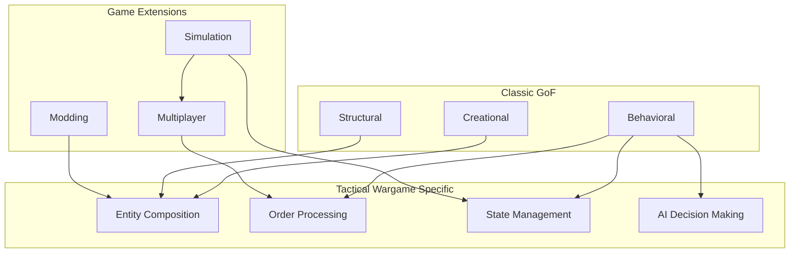
```mermaid
flowchart TB
    subgraph "Classic GoF"
        C[Creational]
        S[Structural]
        B[Behavioral]
    end

    subgraph "Game Extensions"
        SIM[Simulation]
        MOD[Modding]
        MP[Multiplayer]
    end

    subgraph "Tactical Wargame Specific"
        ENT[Entity Composition]
        ORD[Order Processing]
        ST[State Management]
        AI[AI Decision Making]
    end

    C --> ENT
    S --> ENT
    B --> ORD
    B --> ST
    B --> AI
    SIM --> ST
    SIM --> MP
    MOD --> ENT
    MP --> ORD
```

---

## 8.2 Creational Patterns for Wargames

### 8.2.1 Entity Factory Pattern

#### Intent
Create game entities like soldiers, vehicles, and squads without exposing instantiation logic. This approach enables data-driven content creation and centralized initialization.

#### Problem
Units require complex setup involving stats, equipment, and positioning. Multiple entity types share creation logic, and content designers need to create units without modifying code. Centralized validation and error handling are essential.

#### Solution

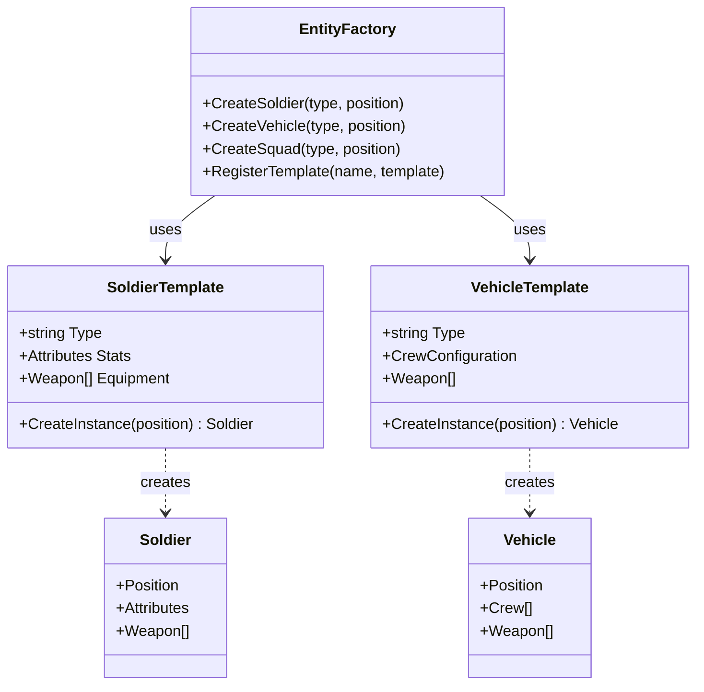
```mermaid
classDiagram
    classDef default fill:#fff,stroke:#000,stroke-width:1px
    classDef light fill:#f0f0f0,stroke:#333,stroke-width:1px
    classDef medium fill:#d0d0d0,stroke:#333,stroke-width:1px
    classDef dark fill:#b0b0b0,stroke:#000,stroke-width:2px

    class EntityFactory {
        +CreateSoldier(type, position)
        +CreateVehicle(type, position)
        +CreateSquad(type, position)
        +RegisterTemplate(name, template)
    }

    class SoldierTemplate {
        +string Type
        +Attributes Stats
        +Weapon[] Equipment
        +CreateInstance(position) Soldier
    }

    class Soldier {
        +Position
        +Attributes
        +Weapon[]
    }

    class VehicleTemplate {
        +string Type
        +CrewConfiguration
        +Weapon[]
        +CreateInstance(position) Vehicle
    }

    class Vehicle {
        +Position
        +Crew[]
        +Weapon[]
    }

    EntityFactory --> SoldierTemplate : uses
    EntityFactory --> VehicleTemplate : uses
    SoldierTemplate ..> Soldier : creates
    VehicleTemplate ..> Vehicle : creates
```

#### Variations Across Games

**OpenCombat-SDL: Manager Classes**
```cpp
class SoldierManager {
    std::vector<SoldierTemplate*> templates;
public:
    Soldier* CreateSoldier(const std::string& type, Point position) {
        for (auto* temp : templates) {
            if (temp->name == type) {
                Soldier* s = new Soldier();
                s->SetAttributes(temp->attributes);
                s->SetPosition(position);
                return s;
            }
        }
        return nullptr;
    }
};
```

**OpenCombat: Deserialization Factory**
```rust
impl Deployment {
    fn load(path: &Path) -> Result<Self, Error> {
        let file = File::open(path)?;
        let deployment: Deployment = serde_json::from_reader(file)?;
        Ok(deployment)
    }
}

// Usage: entities created from JSON deserialization
let deployment = Deployment::load("assets/mission1.json")?;
```

**CloseCombatFree: QML Component Creation**
```cpp
// Factory using Qt's meta-object system
QQmlComponent component(&engine, QUrl::fromLocalFile("units/Tank.qml"));
QObject* unit = component.create();

// Property initialization
unit->setProperty("x", position.x);
unit->setProperty("y", position.y);
```

#### When to Use
Use this pattern when:
- Multiple entity types share initialization logic
- Data-driven content creation is required
- Validation and error handling must be centralized
- Entities require complex construction involving equipment, crew, or stats

#### When NOT to Use
Avoid this pattern when:
- Only one entity type exists
- Runtime entity creation occurs extremely frequently (consider pooling instead)
- All entity data is hardcoded and never changes

#### Related Patterns
- **Prototype Pattern**: For cloning existing entities
- **Builder Pattern**: For step-by-step entity construction
- **Component Pattern**: Factory creates entities with component composition

---

### 8.2.2 Component Builder Pattern

#### Intent
Construct complex entities step-by-step, allowing different configurations through the same construction process.

#### Problem
Entities often include many optional components like weapons, equipment, and modifiers. Constructor telescoping creates unwieldy signatures like `Soldier(pos, weapon, ammo, health, morale, ...)`. Different unit variants need different component combinations, and the order of component addition matters.

#### Solution

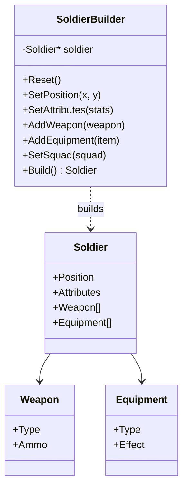
```mermaid
classDiagram
    classDef default fill:#fff,stroke:#000,stroke-width:1px
    classDef light fill:#f0f0f0,stroke:#333,stroke-width:1px
    classDef medium fill:#d0d0d0,stroke:#333,stroke-width:1px
    classDef dark fill:#b0b0b0,stroke:#000,stroke-width:2px

    class SoldierBuilder {
        -Soldier* soldier
        +Reset()
        +SetPosition(x, y)
        +SetAttributes(stats)
        +AddWeapon(weapon)
        +AddEquipment(item)
        +SetSquad(squad)
        +Build() Soldier
    }

    class Soldier {
        +Position
        +Attributes
        +Weapon[]
        +Equipment[]
    }

    class Weapon {
        +Type
        +Ammo
    }

    class Equipment {
        +Type
        +Effect
    }

    SoldierBuilder ..> Soldier : builds
    Soldier --> Weapon
    Soldier --> Equipment
```

#### Variations Across Games

**OpenCombat-SDL: XML-Based Building**
```cpp
// Implicit builder through XML parsing
<Soldier Type="Rifleman">
    <Attributes Aggressiveness="High" Morale="Steady"/>
    <Weapon Type="M1_Garand"/>
    <Equipment Type="Grenade" Count="2"/>
</Soldier>

// Parser builds soldier incrementally
Soldier* ParseSoldierElement(xmlNode* node) {
    auto* soldier = new Soldier();
    soldier->SetType(GetAttribute(node, "Type"));
    // Parse child elements...
    return soldier;
}
```

**OpenCombat: Embedded Components**
```rust
struct Soldier {
    transform: Transform,
    health: Health,
    weapon: Option<Weapon>,
    behavior: Behavior,
    gesture: Gesture,
}

// Builder-like construction
fn create_soldier(pos: Vec2, weapon_type: WeaponType) -> Soldier {
    Soldier {
        transform: Transform::at(pos),
        health: Health::full(100),
        weapon: Some(Weapon::new(weapon_type)),
        behavior: Behavior::Idle(Body::Stand),
        gesture: Gesture::Idle,
    }
}
```

**CloseCombatFree: Declarative Composition**
```qml
// QML declarative building
Soldier {
    id: soldier
    x: 100; y: 200

    Health { max: 100; current: 100 }
    Weapon { type: "Rifle"; ammo: 80 }
    Equipment { type: "Grenade"; count: 2 }
}
```

#### When to Use
Use this pattern when:
- Entities have many optional components
- The same construction process creates different representations
- Fine-grained control over construction steps is needed
- Construction order matters

#### When NOT to Use
Avoid this pattern when:
- All entities have identical structure (use Factory instead)
- Working in performance-critical paths (builder adds overhead)
- Entities are simple with only 2-3 fields

#### Related Patterns
- **Factory Pattern**: Builder creates complex objects; Factory decides which to create
- **Composite Pattern**: Built objects often use composite structure

---

### 8.2.3 Unit Prototype Pattern

#### Intent
Create new objects by copying existing ones, using a prototypical instance as template.

#### Problem
Games often need many similar units with slight variations, like veteran versus green soldiers. This approach avoids subclass explosion (RiflemanVeteran, RiflemanGreen, RiflemanElite) while enabling runtime creation of new unit templates and preserving complex initialization state.

#### Solution

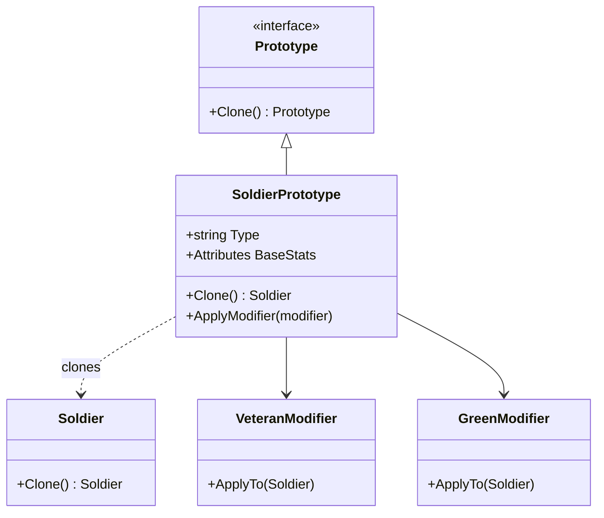
```mermaid
classDiagram
    classDef default fill:#fff,stroke:#000,stroke-width:1px
    classDef light fill:#f0f0f0,stroke:#333,stroke-width:1px
    classDef medium fill:#d0d0d0,stroke:#333,stroke-width:1px
    classDef dark fill:#b0b0b0,stroke:#000,stroke-width:2px

    class Prototype {
        <<interface>>
        +Clone() Prototype
    }

    class SoldierPrototype {
        +string Type
        +Attributes BaseStats
        +Clone() Soldier
        +ApplyModifier(modifier)
    }

    class VeteranModifier {
        +ApplyTo(Soldier)
    }

    class GreenModifier {
        +ApplyTo(Soldier)
    }

    class Soldier {
        +Clone() Soldier
    }

    Prototype <|-- SoldierPrototype
    SoldierPrototype ..> Soldier : clones
    SoldierPrototype --> VeteranModifier
    SoldierPrototype --> GreenModifier
```

### Variations Across Games

**OpenCombat-SDL: Template Cloning**
```cpp
class SoldierTemplate {
public:
    Soldier* Clone(Point position) {
        Soldier* s = new Soldier();
        s->SetAttributes(this->attributes);
        s->SetWeapons(this->weapons);
        s->SetPosition(position);
        return s;
    }
};

// Create different variants from base template
Soldier* CreateVeteranRifleman(Point pos) {
    auto* soldier = riflemanTemplate->Clone(pos);
    soldier->ModifyAttribute(Experience, +2);
    soldier->ModifyAttribute(Morale, +1);
    return soldier;
}
```

**OpenCombat: Data-Driven Variants**
```rust
// JSON template with variation parameters
{
    "base_soldier": "rifleman",
    "variations": {
        "veteran": {
            "experience_bonus": 2,
            "morale_bonus": 1
        },
        "green": {
            "experience_bonus": -1,
            "morale_penalty": 1
        }
    }
}

// Clone with modifications
fn create_variant(base: &Soldier, variant: &str) -> Soldier {
    let mut clone = base.clone();
    apply_variation(&mut clone, variant);
    clone
}
```

**CloseCombatFree: QML Inheritance**
```qml
// Base prototype
SoldierPrototype {
    id: baseRifleman
    health: 100
    weapon: "Rifle"
}

// Cloned and modified instances
Soldier {
    id: veteran1
    prototype: baseRifleman
    experience: baseRifleman.experience + 2
    morale: baseRifleman.morale + 1
}
```

### When to Use Prototype Pattern
- The system should remain independent of how products are created
- Classes to instantiate are specified at runtime
- You want to avoid building a hierarchy of factory classes
- State preservation during cloning is important

### When to Avoid Prototype Pattern
- Objects contain circular references that complicate deep copying
- Simple subclassing would suffice
- Object creation differs significantly from cloning

### Related Patterns
- **Factory Pattern**: Prototype can serve as an alternative
- **Memento Pattern**: Useful for preserving state during undo operations

---

### 8.2.4 Scenario Loader Pattern

### Intent
Encapsulate scenario loading logic to support multiple data formats through a centralized pipeline.

### Problem
Military simulations require loading scenarios from various sources—files, databases, or procedural generation. The process involves multiple steps: terrain parsing, unit placement, and objective setup. Consistent error handling and validation are critical, especially for large scenarios that need progress reporting.

### Solution

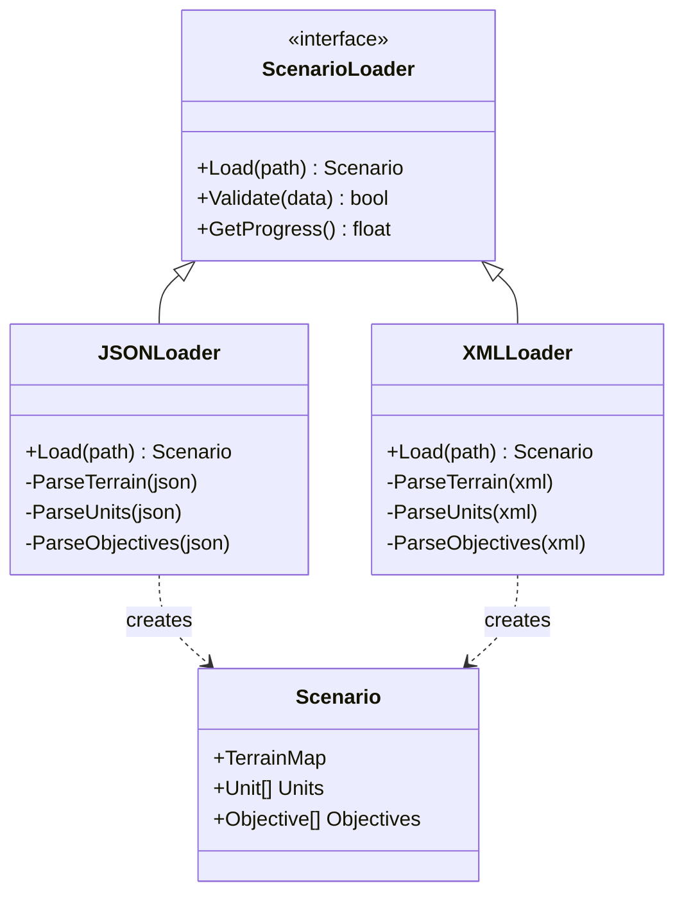
```mermaid
classDiagram
    classDef default fill:#fff,stroke:#000,stroke-width:1px
    classDef light fill:#f0f0f0,stroke:#333,stroke-width:1px
    classDef medium fill:#d0d0d0,stroke:#333,stroke-width:1px
    classDef dark fill:#b0b0b0,stroke:#000,stroke-width:2px

    class ScenarioLoader {
        <<interface>>
        +Load(path) Scenario
        +Validate(data) bool
        +GetProgress() float
    }

    class JSONLoader {
        +Load(path) Scenario
        -ParseTerrain(json)
        -ParseUnits(json)
        -ParseObjectives(json)
    }

    class XMLLoader {
        +Load(path) Scenario
        -ParseTerrain(xml)
        -ParseUnits(xml)
        -ParseObjectives(xml)
    }

    class Scenario {
        +TerrainMap
        +Unit[] Units
        +Objective[] Objectives
    }

    ScenarioLoader <|-- JSONLoader
    ScenarioLoader <|-- XMLLoader
    JSONLoader ..> Scenario : creates
    XMLLoader ..> Scenario : creates
```

### Variations Across Games

**OpenCombat-SDL: XML-Based Loading**
```cpp
class ScenarioLoader {
public:
    Scenario* Load(const std::string& filename) {
        xmlDoc* doc = xmlReadFile(filename.c_str(), nullptr, 0);

        Scenario* scenario = new Scenario();
        scenario->terrain = ParseTerrain(doc);
        scenario->soldiers = ParseSoldiers(doc);
        scenario->objectives = ParseObjectives(doc);

        if (!Validate(scenario)) {
            delete scenario;
            return nullptr;
        }

        return scenario;
    }
};
```

**OpenCombat: Multi-Format Support**
```rust
trait ScenarioLoader {
    fn load(&self, path: &Path) -> Result<Scenario, Error>;
    fn validate(&self, scenario: &Scenario) -> Result<(), Error>;
}

struct JsonLoader;
impl ScenarioLoader for JsonLoader {
    fn load(&self, path: &Path) -> Result<Scenario, Error> {
        let data = std::fs::read_to_string(path)?;
        let deployment: Deployment = serde_json::from_str(&data)?;
        Ok(deployment.into())
    }
}

// Factory to select appropriate loader
fn get_loader(path: &Path) -> Box<dyn ScenarioLoader> {
    match path.extension() {
        Some("json") => Box::new(JsonLoader),
        Some("yaml") => Box::new(YamlLoader),
        _ => Box::new(BinaryLoader),
    }
}
```

**CloseCombatFree: Dynamic QML Loading**
```cpp
class ScenarioLoader : public QObject {
public:
    QObject* Load(const QString& qmlFile) {
        QQmlComponent component(&engine, QUrl::fromLocalFile(qmlFile));

        if (component.status() != QQmlComponent::Ready) {
            qDebug() << "Error loading:" << component.errorString();
            return nullptr;
        }

        QObject* scenario = component.create();

        // Validate required properties
        if (!scenario->property("terrain").isValid()) {
            qDebug() << "Missing terrain property";
            delete scenario;
            return nullptr;
        }

        return scenario;
    }
};
```

### When to Use Scenario Loader Pattern
- Multiple data formats require support
- The loading process involves complex coordination
- Progress reporting or interruptible loading is needed
- Validation logic should remain centralized

### When to Avoid Scenario Loader Pattern
- Only one format is used and loading is simple
- Performance overhead from abstraction is unacceptable

### Related Patterns
- **Factory Pattern**: The loader acts as a specialized factory
- **Strategy Pattern**: Different loaders implement distinct strategies
- **Template Method Pattern**: A common loading skeleton with customizable steps

---

## 8.3 Structural Patterns

### 8.3.1 Aggregate Pattern (Squad Contains Soldiers)

### Intent
Compose objects into tree structures to represent part-whole hierarchies, allowing clients to treat individual objects and compositions uniformly.

### Problem
Military organization is hierarchical—platoons contain squads, squads contain soldiers. Orders issued to squads must propagate to members, and squad effectiveness depends on individual status. The loss of members should affect squad behavior.

### Solution

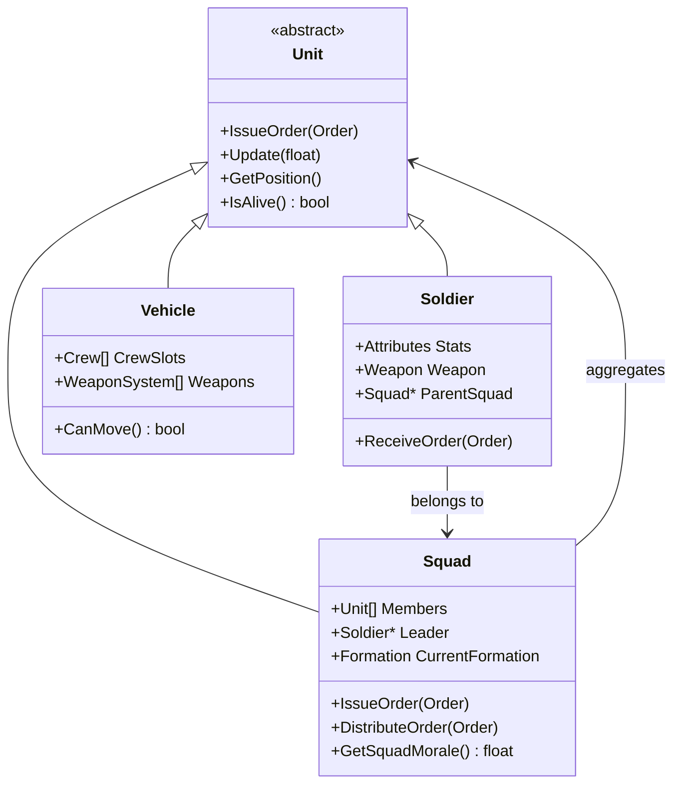
```mermaid
classDiagram
    classDef default fill:#fff,stroke:#000,stroke-width:1px
    classDef light fill:#f0f0f0,stroke:#333,stroke-width:1px
    classDef medium fill:#d0d0d0,stroke:#333,stroke-width:1px
    classDef dark fill:#b0b0b0,stroke:#000,stroke-width:2px

    class Unit {
        <<abstract>>
        +IssueOrder(Order)
        +Update(float)
        +GetPosition()
        +IsAlive() bool
    }

    class Squad {
        +Unit[] Members
        +Soldier* Leader
        +Formation CurrentFormation
        +IssueOrder(Order)
        +DistributeOrder(Order)
        +GetSquadMorale() float
    }

    class Soldier {
        +Attributes Stats
        +Weapon Weapon
        +Squad* ParentSquad
        +ReceiveOrder(Order)
    }

    class Vehicle {
        +Crew[] CrewSlots
        +WeaponSystem[] Weapons
        +CanMove() bool
    }

    Unit <|-- Squad
    Unit <|-- Soldier
    Unit <|-- Vehicle
    Squad --> Unit : aggregates
    Soldier --> Squad : belongs to
```

### Variations Across Games

**OpenCombat-SDL: Object Hierarchy**
```cpp
class Object {
public:
    virtual void Update(float dt) = 0;
    virtual void IssueOrder(Order* order) = 0;
};

class Squad : public Object {
    std::vector<Object*> members;
    Soldier* leader;
public:
    void IssueOrder(Order* order) override {
        // Distribute to members with formation offsets
        for (auto* member : members) {
            auto* memberOrder = AdaptOrderForMember(order, member);
            member->IssueOrder(memberOrder);
        }
    }

    void Update(float dt) override {
        // Update all members
        for (auto* member : members) {
            member->Update(dt);
        }
    }
};
```

**OpenCombat: Index-Based Composition**
```rust
struct Squad {
    leader: SoldierIndex,
    members: Vec<SoldierIndex>,
}

impl Squad {
    fn issue_order(&self, order: Order, state: &mut BattleState) {
        for member_idx in &self.members {
            let member = &mut state.soldiers[member_idx.0];
            let adapted = self.adapt_order(order.clone(), member);
            member.behavior = Behavior::from_order(adapted);
        }
    }

    fn get_morale(&self, state: &BattleState) -> f32 {
        let total: f32 = self.members.iter()
            .map(|idx| state.soldiers[idx.0].morale)
            .sum();
        total / self.members.len() as f32
    }
}
```

**CloseCombatFree: QML Parent-Child**
```qml
Squad {
    id: squad

    Soldier {
        id: leader
        role: "Leader"
        squad: parent
    }

    Soldier {
        role: "Rifleman"
        squad: parent
    }

    Soldier {
        role: "Rifleman"
        squad: parent
    }

    function issueOrder(order) {
        for (var i = 0; i < children.length; i++) {
            if (children[i].isUnit) {
                children[i].receiveOrder(order)
            }
        }
    }
}
```

### When to Use Aggregate Pattern
- Part-whole hierarchies exist (squads/soldiers, vehicles/crew)
- Clients should treat composites and individuals uniformly
- Hierarchical orders and reporting are needed
- Aggregation behavior differs from the sum of parts

### When to Avoid Aggregate Pattern
- The hierarchy is very flat (1-2 levels)
- Components never need uniform treatment
- Parent-child relationships are purely structural

### Related Patterns
- **Iterator Pattern**: Traverses the hierarchy
- **Visitor Pattern**: Performs operations on hierarchy elements
- **Chain of Responsibility**: Propagates orders through the hierarchy

---

### 8.3.2 Component Pattern (Composition over Inheritance)

### Intent
Build complex entities by composing reusable components instead of relying on monolithic inheritance.

### Problem
Inheritance hierarchies become rigid and deep. The "diamond problem" complicates multiple inheritance. Creating novel combinations (like a flying tank) is difficult, and adding new capabilities requires modifying base classes.

### Solution

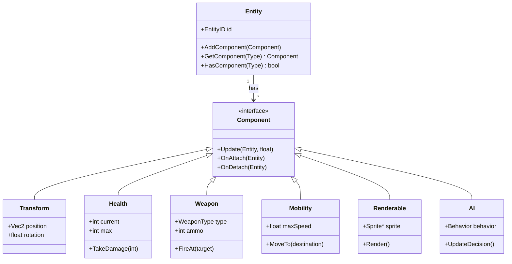
```mermaid
classDiagram
    classDef default fill:#fff,stroke:#000,stroke-width:1px
    classDef light fill:#f0f0f0,stroke:#333,stroke-width:1px
    classDef medium fill:#d0d0d0,stroke:#333,stroke-width:1px
    classDef dark fill:#b0b0b0,stroke:#000,stroke-width:2px

    class Entity {
        +EntityID id
        +AddComponent(Component)
        +GetComponent(Type) Component
        +HasComponent(Type) bool
    }

    class Component {
        <<interface>>
        +Update(Entity, float)
        +OnAttach(Entity)
        +OnDetach(Entity)
    }

    class Transform {
        +Vec2 position
        +float rotation
    }

    class Health {
        +int current
        +int max
        +TakeDamage(int)
    }

    class Weapon {
        +WeaponType type
        +int ammo
        +FireAt(target)
    }

    class Mobility {
        +float maxSpeed
        +MoveTo(destination)
    }

    class Renderable {
        +Sprite* sprite
        +Render()
    }

    class AI {
        +Behavior behavior
        +UpdateDecision()
    }

    Entity "1" --> "*" Component : has
    Component <|-- Transform
    Component <|-- Health
    Component <|-- Weapon
    Component <|-- Mobility
    Component <|-- Renderable
    Component <|-- AI
```

### Variations Across Games

**OpenCombat-SDL: Limited Composition**
```cpp
// Partial composition with inheritance base
class Soldier : public Object {
    Transform transform;
    Health health;
    Weapon* weapons[3];  // Fixed array
    State currentState;
    // Behavior hardcoded in Soldier::Update()
};

// Still largely inheritance-based
class Vehicle : public Object {
    Transform transform;
    Health health;
    CrewSlot crew[4];
    Weapon* mountedWeapons[2];
};
```

**OpenCombat: Embedded Components**
```rust
// Components as struct fields (modified ECS)
struct Soldier {
    transform: Transform,
    health: Health,
    weapon: Option<Weapon>,
    behavior: Behavior,
    gesture: Gesture,
}

struct Vehicle {
    transform: Transform,
    health: Health,
    crew: HashMap<OnBoardPlace, SoldierIndex>,
    turret: Option<Turret>,
}

// Systems iterate and update
fn movement_system(soldiers: &mut [Soldier], dt: f32) {
    for soldier in soldiers {
        if let Behavior::MoveTo(paths) = &soldier.behavior {
            move_along_path(&mut soldier.transform, paths, dt);
        }
    }
}
```

**CloseCombatFree: Full QML Composition**
```qml
// Composition through QML children
Unit {
    id: entity

    Transform { x: 100; y: 200; rotation: 45 }
    Health { max: 100; current: 100 }
    Weapon { type: "Rifle"; ammo: 80 }
    Mobility { maxSpeed: 2.5 }
    Renderable { sprite: "soldier.png"; layer: 1 }
    AI { behavior: "defensive" }
}

// Different compositions for different unit types
Tank {
    Transform { }
    Health { max: 500 }
    Weapon { type: "Cannon"; ammo: 40 }
    Weapon { type: "MG"; ammo: 500 }
    Mobility { maxSpeed: 4.0; turnRate: 0.5 }
    // No AI - player controlled
}
```

### When to Use Component Pattern
- Entities have many optional capabilities
- Entity types vary widely but share components
- Runtime composition is needed
- Deep inheritance hierarchies should be avoided

### When to Avoid Component Pattern
- All entities are homogeneous
- Component lookup overhead is unacceptable
- Simple inheritance models fit perfectly

### Related Patterns
- **Factory Pattern**: Creates entities with specific component sets
- **Strategy Pattern**: Components often encapsulate strategies
- **Observer Pattern**: Components may observe entity events

---

### 8.3.3 Facade Pattern (Simplified AI Interface)

### Intent
Provide a simplified interface to a complex subsystem, making it easier to use while hiding internal complexity.

### Problem
AI systems expose complex interfaces—pathfinding, threat detection, cover evaluation. Game logic shouldn't depend on AI implementation details. Multiple AI systems need a consistent interface, and testing requires mocking complex dependencies.

### Solution

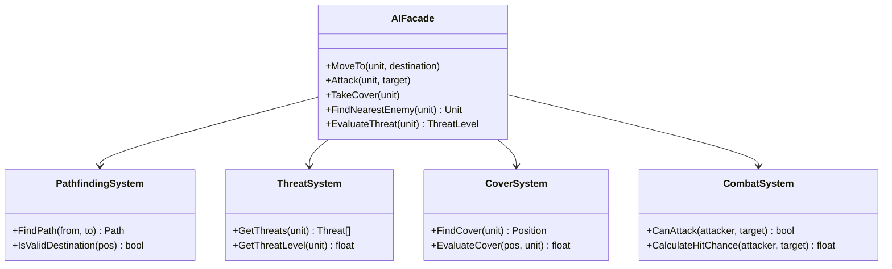
```mermaid
classDiagram
    classDef default fill:#fff,stroke:#000,stroke-width:1px
    classDef light fill:#f0f0f0,stroke:#333,stroke-width:1px
    classDef medium fill:#d0d0d0,stroke:#333,stroke-width:1px
    classDef dark fill:#b0b0b0,stroke:#000,stroke-width:2px

    class AIFacade {
        +MoveTo(unit, destination)
        +Attack(unit, target)
        +TakeCover(unit)
        +FindNearestEnemy(unit) Unit
        +EvaluateThreat(unit) ThreatLevel
    }

    class PathfindingSystem {
        +FindPath(from, to) Path
        +IsValidDestination(pos) bool
    }

    class ThreatSystem {
        +GetThreats(unit) Threat[]
        +GetThreatLevel(unit) float
    }

    class CoverSystem {
        +FindCover(unit) Position
        +EvaluateCover(pos, unit) float
    }

    class CombatSystem {
        +CanAttack(attacker, target) bool
        +CalculateHitChance(attacker, target) float
    }

    AIFacade --> PathfindingSystem
    AIFacade --> ThreatSystem
    AIFacade --> CoverSystem
    AIFacade --> CombatSystem
```

### Variations Across Games

**OpenCombat-SDL: Direct Implementation (No Facade)**
```cpp
// Game logic directly accesses AI systems
void Soldier::Update(float dt) {
    // Direct calls to complex subsystems
    if (ai->DetectThreats(this)) {
        auto* cover = world->GetCoverSystem()->FindCover(this);
        auto* path = world->GetPathfinder()->FindPath(position, cover->position);
        FollowPath(path);
    }
}
// Tight coupling, hard to test, complex interface
```

**OpenCombat: Simplified Interface**
```rust
// Facade providing simple interface
impl AIController {
    fn move_to(&self, soldier_idx: SoldierIndex, dest: Vec2) -> bool {
        let soldier = self.state.soldier(soldier_idx);
        if let Some(path) = self.pathfinder.find_path(soldier.position, dest) {
            self.issue_order(soldier_idx, Order::MoveTo(path));
            true
        } else {
            false
        }
    }

    fn attack(&self, attacker_idx: SoldierIndex, target_idx: SoldierIndex) {
        if self.combat.can_attack(attacker_idx, target_idx) {
            self.issue_order(attacker_idx, Order::EngageSoldier(target_idx));
        }
    }

    fn take_cover(&self, soldier_idx: SoldierIndex) -> bool {
        let soldier = self.state.soldier(soldier_idx);
        if let Some(cover) = self.cover_system.find_cover(soldier) {
            self.move_to(soldier_idx, cover.position);
            true
        }
```

```
        } else {
            false
        }
    }
}

// Game logic uses a simple facade
fn process_ai(state: &mut BattleState, ai: &AIController) {
    for idx in state.soldier_indices() {
        if ai.evaluate_threat(idx) > THREAT_THRESHOLD {
            ai.take_cover(idx);
        }
    }
}
```

**CloseCombatFree: QML Property Interface**
```cpp
// Facade exposing a simple QML interface
class AIFacade : public QObject {
    Q_OBJECT
public:
    Q_INVOKABLE bool moveTo(QObject* unit, qreal x, qreal y);
    Q_INVOKABLE bool attack(QObject* attacker, QObject* target);
    Q_INVOKABLE bool takeCover(QObject* unit);
    Q_INVOKABLE QObject* findNearestEnemy(QObject* unit);

private:
    Pathfinder* pathfinder;
    ThreatSystem* threatSystem;
    CoverSystem* coverSystem;
};

// QML usage
Soldier {
    id: soldier

    function onUnderFire() {
        aiFacade.takeCover(soldier)
    }
}
```

### When to Use Facades
Use this pattern when a complex subsystem needs a simpler interface, when layering is desired to decouple from implementation, when multiple similar subsystems need a unified interface, or when testing requires mocking complex dependencies.

### When to Avoid Facades
Avoid this pattern when direct access is simple and sufficient, when performance is critical and the facade adds indirection, or when flexibility matters more than simplicity.

### Related Patterns
**Adapter Pattern**: A facade simplifies; an adapter converts interfaces.
**Mediator Pattern**: Both simplify communication, but a mediator adds behavior.
**Singleton Pattern**: Facades are often implemented as singletons.

---

### 8.3.4 Proxy Pattern (Network Multiplayer)

### Intent
Provide a surrogate or placeholder for another object to control access, particularly across network boundaries.

### Problem
Network multiplayer introduces several challenges:
- Remote object access requirements
- Latency and packet loss that must remain hidden from game logic
- Server authority that needs to control client access
- Bandwidth optimization through update filtering

### Solution

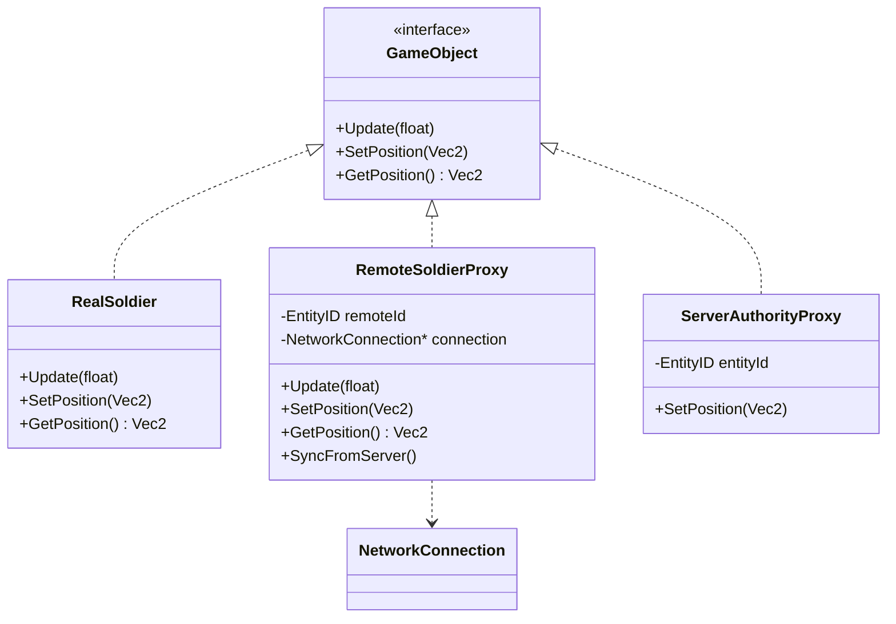
```mermaid
classDiagram
    classDef default fill:#fff,stroke:#000,stroke-width:1px
    classDef light fill:#f0f0f0,stroke:#333,stroke-width:1px
    classDef medium fill:#d0d0d0,stroke:#333,stroke-width:1px
    classDef dark fill:#b0b0b0,stroke:#000,stroke-width:2px

    class GameObject {
        <<interface>>
        +Update(float)
        +SetPosition(Vec2)
        +GetPosition() Vec2
    }

    class RealSoldier {
        +Update(float)
        +SetPosition(Vec2)
        +GetPosition() Vec2
    }

    class RemoteSoldierProxy {
        -EntityID remoteId
        -NetworkConnection* connection
        +Update(float)
        +SetPosition(Vec2)
        +GetPosition() Vec2
        +SyncFromServer()
    }

    class ServerAuthorityProxy {
        -EntityID entityId
        +SetPosition(Vec2)
    }

    GameObject <|.. RealSoldier
    GameObject <|.. RemoteSoldierProxy
    GameObject <|.. ServerAuthorityProxy
    RemoteSoldierProxy ..> NetworkConnection
```

### Variations Across Games

**OpenCombat-SDL: Single Player (No Proxy)**
```cpp
// Direct access only - no multiplayer
class Soldier {
    Point position;
public:
    void SetPosition(Point p) { position = p; }
    Point GetPosition() const { return position; }
};
```

**OpenCombat: Full Network Proxy**
```rust
// Client-side proxy for remote soldiers
struct RemoteSoldier {
    soldier_id: SoldierIndex,
    cached_position: Vec2,
    last_update: u64,
    connection: Arc<ClientConnection>,
}

impl RemoteSoldier {
    fn set_position(&mut self, pos: Vec2) {
        self.connection.send(
            ClientMessage::RequestMove(self.soldier_id, pos)
        );
    }

    fn get_position(&self) -> Vec2 {
        self.cached_position
    }

    fn sync_from_server(&mut self, update: ServerUpdate) {
        if update.soldier_id == self.soldier_id {
            self.cached_position = update.position;
            self.last_update = update.timestamp;
        }
    }
}

// Server-side authority proxy
struct ServerSoldier {
    soldier_id: SoldierIndex,
    position: Vec2,
    clients: Vec<ClientId>,
}

impl ServerSoldier {
    fn set_position(&mut self, pos: Vec2, requester: ClientId) {
        if !self.can_move(requester) {
            return;
        }

        self.position = pos;
        self.broadcast_update();
    }
}
```

**CloseCombatFree: Local Only (No Proxy)**
```qml
// Single player only
Soldier {
    id: soldier
    x: 100
    y: 200
}
```

### When to Use Proxies
Use this pattern for remote object access, when server authority must control state, when bandwidth optimization is required, or when latency hiding becomes necessary.

### When to Avoid Proxies
Avoid proxies in single-player games where they add unnecessary complexity, when real-time synchronization isn't required, or in direct peer-to-peer setups with minimal latency.

### Related Patterns
**Decorator Pattern**: Both wrap objects, but decorators add functionality.
**Observer Pattern**: Proxies often use observers for updates.
**Command Pattern**: Network commands frequently use proxies.

---

## 8.4 Behavioral Patterns

### 8.4.1 Command Pattern (for Orders)

### Intent
Encapsulate requests as objects to enable queuing, logging, undo/redo, and deferred execution.

### Problem
Tactical wargames face several command-related challenges:
- Player orders that need queuing and execution over time
- Undo/redo functionality requirements
- Replay recording through command logging
- Network multiplayer command serialization
- Different order types requiring different handling

### Solution

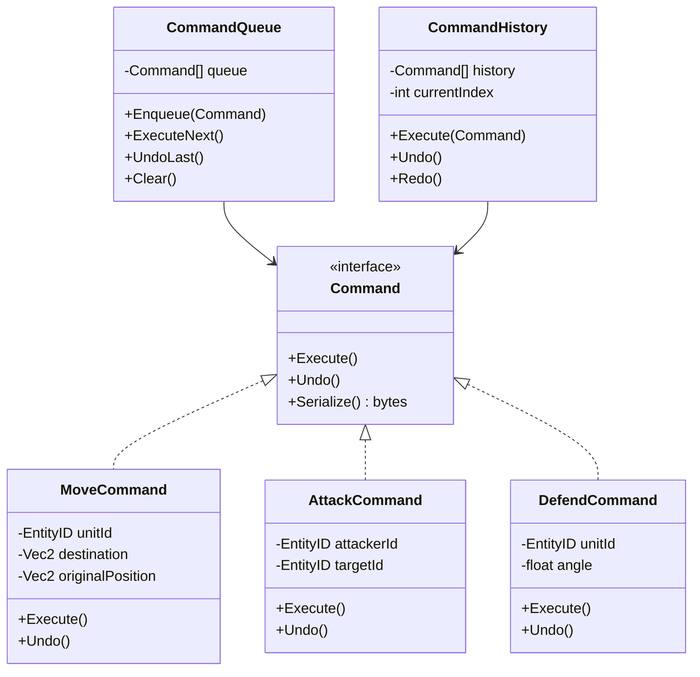
```mermaid
classDiagram
    classDef default fill:#fff,stroke:#000,stroke-width:1px
    classDef light fill:#f0f0f0,stroke:#333,stroke-width:1px
    classDef medium fill:#d0d0d0,stroke:#333,stroke-width:1px
    classDef dark fill:#b0b0b0,stroke:#000,stroke-width:2px

    class Command {
        <<interface>>
        +Execute()
        +Undo()
        +Serialize() bytes
    }

    class MoveCommand {
        -EntityID unitId
        -Vec2 destination
        -Vec2 originalPosition
        +Execute()
        +Undo()
    }

    class AttackCommand {
        -EntityID attackerId
        -EntityID targetId
        +Execute()
        +Undo()
    }

    class DefendCommand {
        -EntityID unitId
        -float angle
        +Execute()
        +Undo()
    }

    class CommandQueue {
        -Command[] queue
        +Enqueue(Command)
        +ExecuteNext()
        +UndoLast()
        +Clear()
    }

    class CommandHistory {
        -Command[] history
        -int currentIndex
        +Execute(Command)
        +Undo()
        +Redo()
    }

    Command <|.. MoveCommand
    Command <|.. AttackCommand
    Command <|.. DefendCommand
    CommandQueue --> Command
    CommandHistory --> Command
```

### Variations Across Games

**OpenCombat-SDL: Order Classes as Commands**
```cpp
class Order {
public:
    virtual void Execute(Object* target) = 0;
    virtual void Undo() {}
    virtual ~Order() = default;
};

class MoveOrder : public Order {
    Point destination;
    Point originalPosition;
    Object* target;
public:
    void Execute(Object* obj) override {
        target = obj;
        originalPosition = obj->GetPosition();
        obj->MoveTo(destination);
    }

    void Undo() override {
        if (target) {
            target->SetPosition(originalPosition);
        }
    }
};

class FireOrder : public Order {
    Object* target;
public:
    void Execute(Object* obj) override {
        obj->FireAt(target);
    }
};

// Command queue in Object
class Object {
    std::deque<Order*> orders;
public:
    void AddOrder(Order* order) {
        orders.push_back(order);
    }

    void ProcessOrders() {
        if (!orders.empty()) {
            orders.front()->Execute(this);
            orders.pop_front();
        }
    }
};
```

**OpenCombat: Messages as Commands**
```rust
// All state changes are commands/messages
enum BattleStateMessage {
    Soldier(SoldierIndex, SoldierMessage),
    SetPhase(Phase),
    PushBulletFire(BulletFire),
}

enum SoldierMessage {
    SetBehavior(Behavior),
    SetGesture(Gesture),
    TakeDamage(i32),
}

// Execution
impl BattleState {
    fn apply(&mut self, msg: BattleStateMessage) {
        match msg {
            BattleStateMessage::Soldier(idx, soldier_msg) => {
                self.update_soldier(idx, soldier_msg);
            }
            BattleStateMessage::SetPhase(phase) => {
                self.phase = phase;
            }
        }
    }
}

// Command queue enables replay
struct CommandLog {
    messages: Vec<(u64, BattleStateMessage)>,
}

impl CommandLog {
    fn replay(&self, state: &mut BattleState) {
        for (tick, msg) in &self.messages {
            state.current_tick = *tick;
            state.apply(msg.clone());
        }
    }
}
```

**CloseCombatFree: Simple Order Queue**
```cpp
// QML-side order queue
class CcfQmlBaseUnit : public QQuickItem {
    Q_OBJECT
    Q_PROPERTY(QStringList orders READ orders NOTIFY ordersChanged)

public slots:
    void moveTo(qreal x, qreal y);
    void attack(QObject* target);
    void defend(qreal angle);
    void undoLastOrder();

private:
    QStringList m_orders;
    void processQueue();

signals:
    void ordersChanged();
    void actionFinished(int unitId, qreal x, qreal y);
};

// QML usage
Unit {
    id: unit

    function issueOrders() {
        moveTo(100, 200)
        attack(enemy1)
        defend(45)
    }
}
```

### When to Use Commands
Use this pattern when queuing and deferred execution become necessary, for undo/redo functionality, replay recording, network command serialization, or when different requests need different handling.

### When to Avoid Commands
Avoid commands when simple immediate execution suffices, when memory overhead becomes a concern, or in performance-critical tight loops.

### Related Patterns
**Memento Pattern**: For storing state during undo operations.
**Prototype Pattern**: For copying commands.
**Chain of Responsibility**: For command routing.

---

### 8.4.2 State Pattern (Unit States)

### Intent
Allow an object to alter its behavior when its internal state changes, making it appear as if the object changed its class.

### Problem
Units in tactical wargames have multiple states that present challenges:
- Idle, moving, firing, reloading, and suppressed states
- Behavior that varies dramatically by state
- State transitions that need explicit validation
- Adding new states without modifying existing code

### Solution

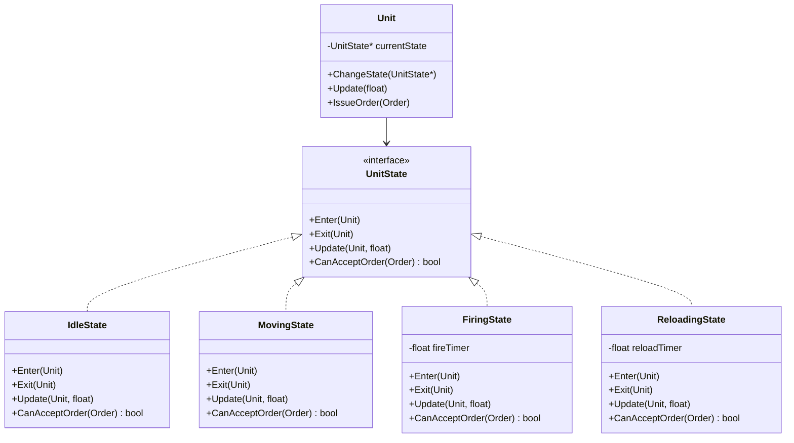
```mermaid
classDiagram
    classDef default fill:#fff,stroke:#000,stroke-width:1px
    classDef light fill:#f0f0f0,stroke:#333,stroke-width:1px
    classDef medium fill:#d0d0d0,stroke:#333,stroke-width:1px
    classDef dark fill:#b0b0b0,stroke:#000,stroke-width:2px

    class UnitState {
        <<interface>>
        +Enter(Unit)
        +Exit(Unit)
        +Update(Unit, float)
        +CanAcceptOrder(Order) bool
    }

    class IdleState {
        +Enter(Unit)
        +Exit(Unit)
        +Update(Unit, float)
        +CanAcceptOrder(Order) bool
    }

    class MovingState {
        +Enter(Unit)
        +Exit(Unit)
        +Update(Unit, float)
        +CanAcceptOrder(Order) bool
    }

    class FiringState {
        -float fireTimer
        +Enter(Unit)
        +Exit(Unit)
        +Update(Unit, float)
        +CanAcceptOrder(Order) bool
    }

    class ReloadingState {
        -float reloadTimer
        +Enter(Unit)
        +Exit(Unit)
        +Update(Unit, float)
        +CanAcceptOrder(Order) bool
    }

    class Unit {
        -UnitState* currentState
        +ChangeState(UnitState*)
        +Update(float)
        +IssueOrder(Order)
    }

    UnitState <|.. IdleState
    UnitState <|.. MovingState
    UnitState <|.. FiringState
    UnitState <|.. ReloadingState
    Unit --> UnitState
```

### Variations Across Games

**OpenCombat-SDL: Bitfield State (Partial Implementation)**
```cpp
// Not a full State pattern, but state-based behavior
class State {
    unsigned long long bits;
public:
    bool IsSet(unsigned int state);
    void Set(unsigned int state);
    void UnSet(unsigned int state);
};

class Soldier {
    State _currentState;
public:
    void Simulate(float dt, World* world) {
        if (_currentState.IsSet(SoldierState::Firing)) {
            ProcessFiring(dt);
        } else if (_currentState.IsSet(SoldierState::Moving)) {
            ProcessMovement(dt);
        } else if (_currentState.IsSet(SoldierState::Reloading)) {
            ProcessReloading(dt);
        }
    }
};
```

**OpenCombat: Enum-Based State (Closer to State Pattern)**
```rust
// State hierarchy with behavior
enum Behavior {
    MoveTo(WorldPaths),
    Defend(Angle),
    EngageSoldier(SoldierIndex),
    Idle(Body),
    Hide(Angle),
    Dead,
}

enum Gesture {
    Idle,
    Reloading(u64),
    Aiming(u64),
    Firing(u64),
}

fn tick_soldier(soldier: &mut Soldier) {
    match soldier.behavior {
        Behavior::MoveTo(paths) => process_movement(soldier, paths),
        Behavior::Defend(angle) => process_defense(soldier, angle),
        Behavior::EngageSoldier(target) => process_engagement(soldier, target),
        Behavior::Idle(body) => process_idle(soldier, body),
        Behavior::Hide(angle) => process_hiding(soldier, angle),
        Behavior::Dead => {}
    }

    match soldier.gesture {
        Gesture::Idle => {},
        Gesture::Reloading(end_frame) => {
            if current_frame() >= end_frame {
                soldier.gesture = Gesture::Idle;
                soldier.weapon.as_mut().unwrap().reload();
            }
        }
    }
}
```

**CloseCombatFree: String-Based Status**
```cpp
// Runtime status string
class CcfQmlBaseUnit : public QQuickItem {
    Q_OBJECT
    Q_PROPERTY(QString unitStatus READ unitStatus WRITE setUnitStatus NOTIFY unitStatusChanged)

public:
    void setUnitStatus(const QString& status) {
        if (_status != status) {
            _status = status;
            emit unitStatusChanged(status);
            onStateEnter(status);
        }
    }

private:
    void onStateEnter(const QString& newStatus) {
        if (newStatus == "MOVING") {
            playAnimation("walk");
        } else if (newStatus == "AIMING") {
            playAnimation("aim");
        } else if (newStatus == "FIRING") {
            playAnimation("fire");
            spawnProjectile();
        }
    }
};
```

### When to Use State Patterns
Use this pattern when object behavior depends on runtime state changes, when states have distinct behaviors, when adding new states without modifying existing code, or when state transitions need explicit control.

### When to Avoid State Patterns
Avoid this pattern with only 2-3 simple states, when state logic is trivial, or when creating many small state classes adds overhead.

### Related Patterns
**Singleton Pattern**: State objects are often implemented as singletons.
**Strategy Pattern**: Similar structure, but state manages transitions.
**Flyweight Pattern**: When many units share state objects.

---

### 8.4.3 Observer Pattern (Event System)

### Intent
Define one-to-many dependencies between objects so that when one object changes state, all dependents receive automatic notification.

### Problem
Game development faces several event-related challenges:
- Game events that need to affect multiple systems (UI, audio, AI, scoring)
- Direct coupling between systems that creates maintenance problems
- Dynamic registration and unregistration of event handlers
- Event filtering based on type or source

### Solution

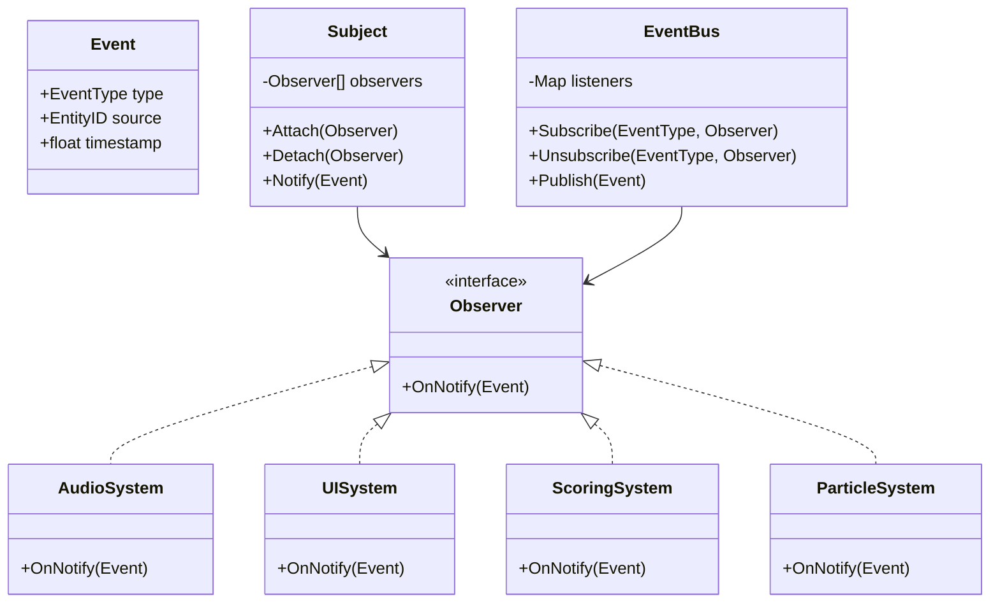
```mermaid
classDiagram
    classDef default fill:#fff,stroke:#000,stroke-width:1px
    classDef light fill:#f0f0f0,stroke:#333,stroke-width:1px
    classDef medium fill:#d0d0d0,stroke:#333,stroke-width:1px
    classDef dark fill:#b0b0b0,stroke:#000,stroke-width:2px

    class Event {
        +EventType type
        +EntityID source
        +float timestamp
    }

    class Subject {
        -Observer[] observers
        +Attach(Observer)
        +Detach(Observer)
        +Notify(Event)
    }

    class Observer {
        <<interface>>
        +OnNotify(Event)
    }

    class AudioSystem {
        +OnNotify(Event)
    }

    class UISystem {
        +OnNotify(Event)
    }

    class ScoringSystem {
        +OnNotify(Event)
    }

    class ParticleSystem {
        +OnNotify(Event)
    }

    class EventBus {
        -Map<EventType, Observer[]> listeners
        +Subscribe(EventType, Observer)
        +Unsubscribe(EventType, Observer)
        +Publish(Event)
    }

    Subject --> Observer
    Observer <|.. AudioSystem
    Observer <|.. UISystem
    Observer <|.. ScoringSystem
    Observer <|.. ParticleSystem
    EventBus --> Observer
```

### Variations Across Games

**OpenCombat-SDL: Direct Calls (No Observer)**
```cpp
// Tight coupling - direct method calls
void Soldier::TakeDamage(int damage) {
    health -= damage;

    world->GetAudio()->PlaySound("hit");
    world->GetUI()->ShowDamageIndicator(this);
    world->GetParticleSystem()->SpawnBlood(position);

    if (health <= 0) {
        world->GetScoring()->RegisterKill(attacker, this);
        world->GetAI()->OnUnitDestroyed(this);
    }
}
```

**OpenCombat: Message-Based Observer**
```rust
// Event system via message passing
trait EventHandler {
    fn handle_event(&mut self, event: &GameEvent);
}

struct EventBus {
    handlers: HashMap<EventType, Vec<Box<dyn EventHandler>>>,
}

impl EventBus {
    fn subscribe(&mut self, event_type: EventType, handler: Box<dyn EventHandler>) {
        self.handlers.entry(event_type).or_default().push(handler);
    }

    fn publish(&mut self, event: GameEvent) {
        if let Some(handlers) = self.handlers.get_mut(&event.event_type) {
            for handler in handlers {
                handler.handle_event(&event);
            }
        }
    }
}

// Usage
enum GameEvent {
    UnitDamaged { unit: SoldierIndex, damage: i32 },
    UnitDestroyed { unit: SoldierIndex, killer: Option<SoldierIndex> },
    WeaponFired { shooter: SoldierIndex, weapon: WeaponType },
}

// Systems subscribe to events
impl EventHandler for AudioSystem {
    fn handle_event(&mut self, event: &GameEvent) {
        match event {
            GameEvent::WeaponFired { weapon, .. } => {
                self.play_sound(weapon.fire_sound());
            }
            GameEvent::UnitDestroyed { .. } => {
                self.play_sound("death");
            }
            _ => {}
        }
    }
}
```

**CloseCombatFree: Qt Signals/Slots (Built-in Observer)**
```cpp
// Qt's signals/slots implement the Observer pattern
class CcfQmlBaseUnit : public QQuickItem {
    Q_OBJECT

signals:
    void unitStatusChanged(const QString& newStatus);
    void positionChanged(qreal x, qreal y);
    void healthChanged(int newHealth);
    void unitDestroyed();

public:
    void setHealth(int health) {
        if (_health != health) {
            _health = health;
            emit healthChanged(health);

            if (health <= 0) {
                emit unitDestroyed();
            }
        }
    }
};

// UI elements observe via slots
Unit {
    onUnitStatusChanged: {
        console.log("Status: " + newStatus);
        updateStatusIcon(newStatus);
    }

    onHealthChanged: {
        updateHealthBar(newHealth);
        if (newHealth < 30) {
            playWarningSound();
        }
    }

    onUnitDestroyed: {
        showDeathAnimation();
        playDeathSound();
        updateScore();
    }
}
```

### When to Use Observers
Use this pattern when changes to one object need to notify multiple others, when decoupling between event source and handlers becomes necessary, when dynamic handler registration is required, or when one-to-many relationships change dynamically.

### When to Avoid Observers
Avoid observers when a single handler with tight coupling suffices, in performance-critical scenarios where notification overhead matters, or when event order must be strictly controlled.

### Related Patterns
**Mediator Pattern**: Observers distribute; mediators centralize.
**Command Pattern**: Events can be commands.
**Singleton Pattern**: Event buses are often singletons.

---

### 8.4.4 Strategy Pattern (AI Behaviors)

### Intent
Define a family of algorithms, encapsulate each, and make them interchangeable. Strategy lets algorithms vary independently from clients.

### Problem
AI development faces several behavioral challenges:
- Different AI behaviors needed (aggressive, defensive, stealth)
- AI that should be swappable at runtime (morale changes behavior)
- Massive switch statements for behavior selection
- Testing individual AI behaviors in isolation

### Solution

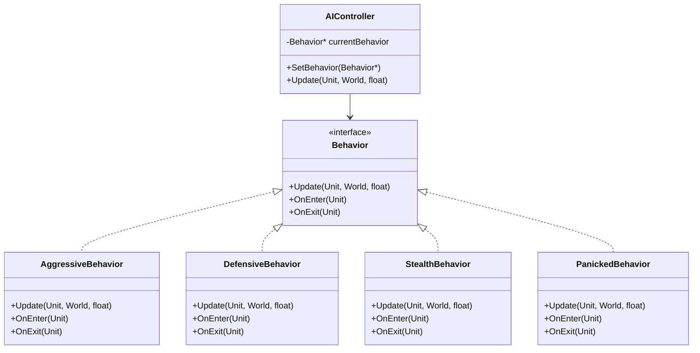
```mermaid
classDiagram
    classDef default fill:#fff,stroke:#000,stroke-width:1px
    classDef light fill:#f0f0f0,stroke:#333,stroke-width:1px
    classDef medium fill:#d0d0d0,stroke:#333,stroke-width:1px
    classDef dark fill:#b0b0b0,stroke:#000,stroke-width:2px

    class Behavior {
        <<interface>>
        +Update(Unit, World, float)
        +OnEnter(Unit)
        +OnExit(Unit)
    }

    class AggressiveBehavior {
        +Update(Unit, World, float)
        +OnEnter(Unit)
        +OnExit(Unit)
    }

    class DefensiveBehavior {
        +Update(Unit, World, float)
        +OnEnter(Unit)
        +OnExit(Unit)
    }

    class StealthBehavior {
        +Update(Unit, World, float)
        +OnEnter(Unit)
        +OnExit(Unit)
    }

    class PanickedBehavior {
        +Update(Unit, World, float)
        +OnEnter(Unit)
        +OnExit(Unit)
    }

    class AIController {
        -Behavior* currentBehavior
        +SetBehavior(Behavior*)
        +Update(Unit, World, float)
    }

    Behavior <|.. AggressiveBehavior
    Behavior <|.. DefensiveBehavior
    Behavior <|.. StealthBehavior
    Behavior <|.. PanickedBehavior
    AIController --> Behavior
```

### Variations Across Games

**OpenCombat-SDL: Hardcoded Behaviors (Partial Strategy)**
```cpp
// Behavior hardcoded in soldier class
class Soldier {
    AIBehavior behavior;
public:
    void SetBehavior(AIBehavior b) { behavior = b; }

    void UpdateAI(World* world) {
        switch (behavior) {
            case AI_AGGRESSIVE:
                if (CanSeeEnemy()) {
                    AttackNearestEnemy();
                } else {
                    MoveTowardEnemy();
                }
                break;
            case AI_DEFENSIVE:
                if (IsUnderFire()) {
                    SeekCover();
                }
                break;
        }
    }
};
```

**OpenCombat: Enum with Function Dispatch**
```rust
// Behavior as enum with associated data
enum Behavior {
    MoveTo(WorldPaths),
    Defend(Angle),
    EngageSoldier(SoldierIndex),
    Hide(Angle),
    Idle(Body),
}

// Strategy execution through pattern matching
fn execute_behavior(soldier: &mut Soldier, behavior: &Behavior, world: &World) {
    match behavior {
        Behavior::MoveTo(paths) => {
            follow_path(soldier, paths);
            if path_complete(soldier) {
                soldier.behavior = Behavior::Idle(Body::Stand);
            }
        }
        Behavior::Defend(angle) => {
            if let Some(enemy) = find_visible_enemy(soldier, world) {
                soldier.behavior = Behavior::EngageSoldier(enemy);
            }
        }
        Behavior::EngageSoldier(target) => {
            if can_fire(soldier, *target, world) {
                fire_at(soldier, *target);
            } else {
                move_to_optimal_range(soldier, *target);
            }
        }
    }
}

// Behavior change based on morale
fn update_ai(soldier: &mut Soldier, world: &World) {
    if soldier.morale < PANIC_THRESHOLD {
        soldier.behavior = Behavior::Hide(calculate_retreat_direction(soldier));
    }
}
```

**CloseCombatFree: Property-Based Behavior**
```qml
// Behavior as property
Soldier {
    id: soldier
    property string behavior: "defensive"

    function updateAI() {
        switch(behavior) {
        case "aggressive":
            if (canSeeEnemy()) {
                attack(nearestEnemy())
            }
            break
        case "defensive":
            if (underFire) {
                takeCover()
            }
            break
        case "stealth":
            if (enemyNearby()) {
                hide()
            } else {
                moveSneaky()
            }
            break
        }
    }

    onMoraleChanged: {
        if (morale < 20) {
            behavior = "panicked"
        }
    }
}
```

### When to Use Strategies
Use this pattern when multiple algorithm variants become necessary, when algorithms need runtime changes, when avoiding conditional statements for behavior selection, or when testing individual behaviors in isolation.

### When to Avoid Strategies
Avoid this pattern when only one algorithm is needed, when behavior differences are minimal, or when the overhead of strategy objects becomes problematic.

- **Use when**: The algorithm needs runtime changes
- **Use when**: Avoiding large switch statements
- **Use when**: Testing algorithms in isolation

#### When Not to Use
- Avoid when only one algorithm exists and it rarely changes
- Avoid in performance-critical code due to virtual call overhead
- Avoid when a simple if/else is clearer

#### Related Patterns
- **State Pattern**: Encapsulates behavior like Strategy, but manages transitions
- **Template Method Pattern**: Strategy varies the entire algorithm; Template varies individual steps
- **Factory Pattern**: Creates appropriate strategies

---

### 8.4.5 Template Method Pattern (Order Execution)

#### Intent
Define an algorithm's structure in a base class while allowing subclasses to override specific steps without altering the overall sequence.

#### Problem
Order execution follows a consistent pattern—validate, pathfind, execute, complete—but specific order types need to customize individual steps. Common error handling and cleanup must apply across all orders, and the algorithm's structure should remain unchanged.

#### Solution

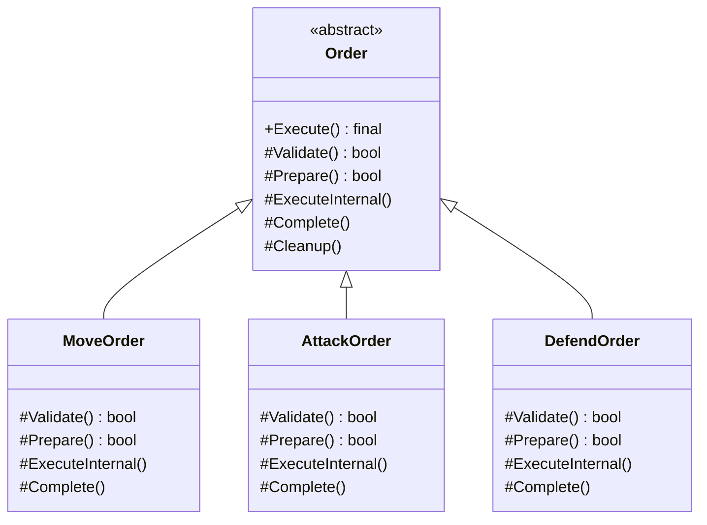
```mermaid
classDiagram
    classDef default fill:#fff,stroke:#000,stroke-width:1px
    classDef light fill:#f0f0f0,stroke:#333,stroke-width:1px
    classDef medium fill:#d0d0d0,stroke:#333,stroke-width:1px
    classDef dark fill:#b0b0b0,stroke:#000,stroke-width:2px

    class Order {
        <<abstract>>
        +Execute() final
        #Validate() bool
        #Prepare() bool
        #ExecuteInternal()
        #Complete()
        #Cleanup()
    }

    class MoveOrder {
        #Validate() bool
        #Prepare() bool
        #ExecuteInternal()
        #Complete()
    }

    class AttackOrder {
        #Validate() bool
        #Prepare() bool
        #ExecuteInternal()
        #Complete()
    }

    class DefendOrder {
        #Validate() bool
        #Prepare() bool
        #ExecuteInternal()
        #Complete()
    }

    Order <|-- MoveOrder
    Order <|-- AttackOrder
    Order <|-- DefendOrder
```

#### Variations Across Games

**OpenCombat-SDL: Partial Template Method**
```cpp
class Order {
public:
    // Template method
    void Execute(Object* target) {
        if (!Validate(target)) {
            OnValidationFailed();
            return;
        }

        if (!Prepare(target)) {
            OnPreparationFailed();
            return;
        }

        ExecuteInternal(target);
        Complete(target);
        Cleanup(target);
    }

protected:
    virtual bool Validate(Object* target) = 0;
    virtual bool Prepare(Object* target) { return true; }
    virtual void ExecuteInternal(Object* target) = 0;
    virtual void Complete(Object* target) {}
    virtual void Cleanup(Object* target) {}

    virtual void OnValidationFailed() {}
    virtual void OnPreparationFailed() {}
};

class MoveOrder : public Order {
    Point destination;
    Path path;

protected:
    bool Validate(Object* target) override {
        return target != nullptr && target->IsMovable();
    }

    bool Prepare(Object* target) override {
        path = world->GetPathfinder()->FindPath(target->GetPosition(), destination);
        return path.IsValid();
    }

    void ExecuteInternal(Object* target) override {
        target->FollowPath(path);
    }

    void Complete(Object* target) override {
        target->OnOrderComplete();
    }
};

class AttackOrder : public Order {
    Object* targetEntity;

protected:
    bool Validate(Object* attacker) override {
        return attacker != nullptr &&
               targetEntity != nullptr &&
               attacker->HasWeapon();
    }

    void ExecuteInternal(Object* attacker) override {
        attacker->FireAt(targetEntity);
    }
};
```

**OpenCombat: Functional Composition**
```rust
// Template method through function composition
type OrderResult = Result<(), OrderError>;

fn execute_order(soldier_idx: SoldierIndex, order: &Order, state: &mut BattleState) -> OrderResult {
    // Template steps
    validate_order(soldier_idx, order, state)?;
    prepare_order(soldier_idx, order, state)?;
    execute_internal(soldier_idx, order, state)?;
    complete_order(soldier_idx, order, state)?;
    cleanup_order(soldier_idx, order, state)?;
    Ok(())
}

// Specific implementations
fn validate_move_order(soldier_idx: SoldierIndex, dest: Vec2, state: &BattleState) -> OrderResult {
    let soldier = state.soldier(soldier_idx);
    if soldier.is_dead() {
        return Err(OrderError::UnitDead);
    }
    if !state.map.is_valid_position(dest) {
        return Err(OrderError::InvalidDestination);
    }
    Ok(())
}

fn execute_move_internal(soldier_idx: SoldierIndex, path: &WorldPaths, state: &mut BattleState) {
    let soldier = &mut state.soldiers[soldier_idx.0];
    soldier.behavior = Behavior::MoveTo(path.clone());
}

// Template with specific implementations
fn execute_move_order(soldier_idx: SoldierIndex, dest: Vec2, state: &mut BattleState) -> OrderResult {
    validate_move_order(soldier_idx, dest, state)?;

    let path = state.pathfinder.find_path(state.soldier(soldier_idx).position, dest)
        .ok_or(OrderError::NoPathFound)?;

    execute_move_internal(soldier_idx, &path, state);

    Ok(())
}
```

**CloseCombatFree: Implicit Template**
```cpp
// Order processing follows implicit template
void CcfQmlBaseUnit::processOrder(QObject* order) {
    // Validate
    if (!canAcceptOrder(order)) {
        setUnitStatus("ORDER_REJECTED");
        return;
    }

    // Prepare (set status)
    QString orderType = order->property("type").toString();
    if (orderType == "Move") {
        setUnitStatus("MOVING");
    } else if (orderType == "Attack") {
        setUnitStatus("AIMING");
    }

    // Execute (animation-driven)
    startOrderAnimation(order);

    // Complete callback
    connect(this, &CcfQmlBaseUnit::animationFinished,
            this, &CcfQmlBaseUnit::onOrderComplete);
```

#### When to Use Template Method
- Algorithm structure remains fixed while individual steps vary
- Code reuse across similar algorithms is needed
- Common error handling and cleanup apply to all cases
- Subclass extensions must be controlled through hook methods

#### When to Avoid Template Method
- Algorithm steps vary too much between cases
- Flexibility outweighs the need for structure
- Strategy Pattern provides sufficient customization

#### Related Patterns
- **Strategy Pattern**: Varies entire algorithms; Template Method varies steps
- **Factory Method Pattern**: Often used alongside Template Method
- **Hook Method Pattern**: Template methods define hooks for customization

---

## 8.5 Simulation Patterns

### 8.5.1 Deterministic Lockstep Pattern

#### Intent
Ensure all simulation participants maintain identical game states by executing the same inputs at the same simulation steps.

#### Problem
Multiplayer games require all clients to see identical game states, but floating-point calculations and timing differences cause desynchronization. Network latency complicates input timing, and replays demand exact reproducibility.

#### Solution

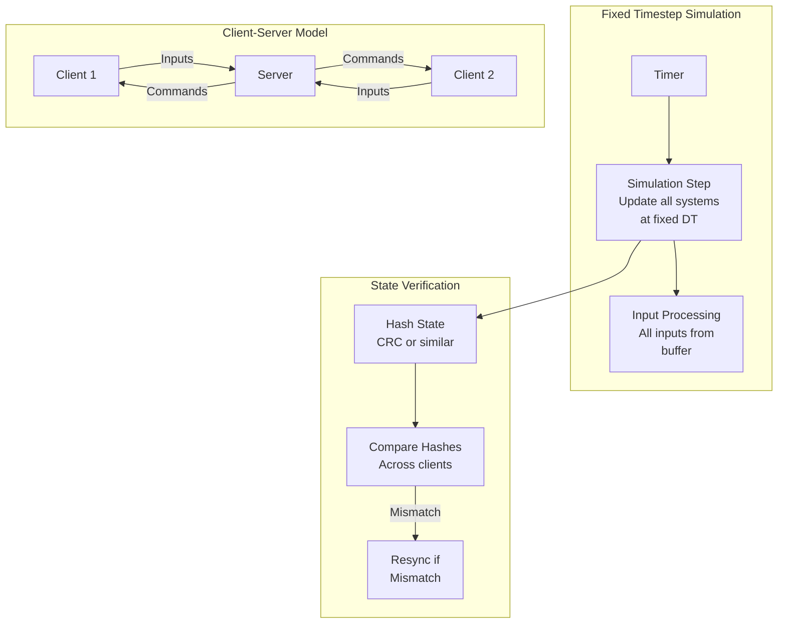
```mermaid
flowchart TB
    subgraph "Fixed Timestep Simulation"
        T[Timer]
        S[Simulation Step<br>Update all systems<br>at fixed DT]
        I[Input Processing<br>All inputs from<br>buffer]
    end

    subgraph "Client-Server Model"
        C1[Client 1]
        C2[Client 2]
        SRV[Server]

        C1 -->|Inputs| SRV
        C2 -->|Inputs| SRV
        SRV -->|Commands| C1
        SRV -->|Commands| C2
    end

    subgraph "State Verification"
        H[Hash State<br>CRC or similar]
        V[Compare Hashes<br>Across clients]
        R[Resync if<br>Mismatch]
    end

    T --> S
    S --> I
    S --> H
    H --> V
    V -->|Mismatch| R
```

#### Variations Across Games

**OpenCombat-SDL: Not Deterministic**
```cpp
// Uses real time - not suitable for multiplayer
void Game::Update() {
    float dt = GetDeltaTime();  // Variable dt
    world->Update(dt);          // Non-deterministic
}
// Not suitable for multiplayer or replay
```

**OpenCombat: Fully Deterministic**
```rust
// Fixed timestep
const DT: f32 = 1.0 / 60.0;  // 60 Hz

pub struct Simulation {
    current_tick: u64,
    state: BattleState,
    rng: SeededRng,
}

impl Simulation {
    pub fn tick(&mut self, inputs: &[PlayerInput]) {
        // Process all inputs for this tick
        for input in inputs {
            self.apply_input(input);
        }

        // Update systems at fixed DT
        update_physics(&mut self.state, DT);
        update_ai(&mut self.state, DT);
        update_combat(&mut self.state, DT, &mut self.rng);

        self.current_tick += 1;
    }

    pub fn verify_state(&self) -> u64 {
        // Hash state for verification
        self.state.hash()
    }
}

// Network synchronization
pub struct Server {
    clients: Vec<Client>,
    simulation: Simulation,
}

impl Server {
    fn tick(&mut self) {
        // Collect inputs from all clients
        let inputs = self.collect_inputs();

        // Run simulation step
        self.simulation.tick(&inputs);

        // Broadcast state hash for verification
        let hash = self.simulation.verify_state();
        self.broadcast_state_hash(hash);
    }
}
```

**CloseCombatFree: Not Applicable**
```qml
// Single-player only, animation-driven
// Not deterministic, not multiplayer
```

#### When to Use Deterministic Lockstep
- Multiplayer synchronization is required
- Replay recording is needed
- Competitive play demands fairness
- Debugging requires reproducibility

#### When to Avoid Deterministic Lockstep
- Single-player games where overhead isn't justified
- Real-time accuracy matters more than determinism
- Variable timestep is acceptable

#### Related Patterns
- **Command Pattern**: Commands serve as inputs to lockstep
- **State Pattern**: State must be serializable for verification
- **Observer Pattern**: Used for broadcasting state hashes

### 8.5.2 Spatial Partitioning Pattern

#### Intent
Organize entities in world space to speed up spatial queries without checking every entity.

#### Problem
Naive O(N) spatial queries scale poorly. Checking 500 units requires 250,000 comparisons. Games frequently need to:
- Find all enemies within 100 meters
- Sample line of sight along rays
- Detect collisions with nearby objects

#### Solution

```mermaid
flowchart TB
    subgraph "Spatial Partitioning Options"
        G[Uniform Grid<br>Fixed cell size<br>O(1) insertion<br>O(k) query]

        Q[Quadtree<br>Adaptive subdivision<br>O(log n) operations<br>Good for uneven distribution]

        H[Spatial Hash<br>Hash map buckets<br>Good for sparse worlds]
    end

    subgraph "Grid Implementation"
        W[World Grid<br>Cell size = 100m]

        C[Cell Array<br>Linked lists per cell]

        I[Insertion<br>Hash position to cell<br>Add to list]

        Q2[Query Radius<br>Calculate cell range<br>Check all in range]
    end

    W --> C
    C --> I
    C --> Q2
```

#### Variations Across Games

**OpenCombat-SDL: Linked Lists Per Tile**
```cpp
class World {
    // One linked list head per tile
    std::vector<Object*> tileObjects;
    int tilesX, tilesY;

public:
    void AddObject(Object* obj, int tileX, int tileY) {
        int index = tileY * tilesX + tileX;

        // Add to front of linked list
        obj->nextInTile = tileObjects[index];
        if (tileObjects[index]) {
            tileObjects[index]->prevInTile = obj;
        }
        tileObjects[index] = obj;
        obj->currentTile = index;
    }

    void RemoveObject(Object* obj) {
        int index = obj->currentTile;

        if (tileObjects[index] == obj) {
            tileObjects[index] = obj->nextInTile;
        }

        if (obj->prevInTile) {
            obj->prevInTile->nextInTile = obj->nextInTile;
        }
        if (obj->nextInTile) {
            obj->nextInTile->prevInTile = obj->prevInTile;
        }
    }

    std::vector<Object*> QueryRadius(Point center, float radius) {
        std::vector<Object*> results;

        int minX = (center.x - radius) / TILE_SIZE;
        int maxX = (center.x + radius) / TILE_SIZE;
        int minY = (center.y - radius) / TILE_SIZE;
        int maxY = (center.y + radius) / TILE_SIZE;

        for (int y = minY; y <= maxY; y++) {
            for (int x = minX; x <= maxX; x++) {
                int index = y * tilesX + x;
                Object* obj = tileObjects[index];
                while (obj) {
                    if (Distance(center, obj->position) <= radius) {
                        results.push_back(obj);
                    }
                    obj = obj->nextInTile;
                }
            }
        }

        return results;
    }
};
```

**OpenCombat: Grid-Based Queries**
```rust
pub struct SpatialIndex {
    cell_size: f32,
    cells: HashMap<CellCoord, Vec<EntityId>>,
}

impl SpatialIndex {
    pub fn insert(&mut self, entity: EntityId, pos: Vec2) {
        let cell = self.world_to_cell(pos);
        self.cells.entry(cell).or_default().push(entity);
    }

    pub fn query_radius(&self, center: Vec2, radius: f32) -> Vec<EntityId> {
        let mut results = Vec::new();

        let min_cell = self.world_to_cell(center - Vec2::splat(radius));
        let max_cell = self.world_to_cell(center + Vec2::splat(radius));

        for y in min_cell.y..=max_cell.y {
            for x in min_cell.x..=max_cell.x {
                if let Some(entities) = self.cells.get(&CellCoord { x, y }) {
                    for &entity in entities {
                        if distance(center, self.get_position(entity)) <= radius {
                            results.push(entity);
                        }
                    }
                }
            }
        }

        results
    }

    pub fn update_entity(&mut self, entity: EntityId, old_pos: Vec2, new_pos: Vec2) {
        let old_cell = self.world_to_cell(old_pos);
        let new_cell = self.world_to_cell(new_pos);

        if old_cell != new_cell {
            // Remove from old cell
            if let Some(entities) = self.cells.get_mut(&old_cell) {
                entities.retain(|&e| e != entity);
            }
            // Add to new cell
            self.cells.entry(new_cell).or_default().push(entity);
        }
    }
}
```

**CloseCombatFree: Visual Tree (Limited)**
```qml
// QML parent-child provides some spatial organization
// But not optimized for queries
Item {
    id: world

    Soldier { x: 100; y: 200 }
    Soldier { x: 150; y: 250 }
    Tank { x: 300; y: 400 }

    // Queries iterate all children
    function findNearby(pos, radius) {
        var nearby = []
        for (var i = 0; i < children.length; i++) {
            var child = children[i]
            var dist = Math.sqrt(
                Math.pow(child.x - pos.x, 2) +
                Math.pow(child.y - pos.y, 2)
            )
            if (dist <= radius) {
                nearby.push(child)
            }
        }
        return nearby
    }
}
// O(N) - not scalable
```

#### When to Use
Spatial partitioning works best when:
- Spatial queries occur frequently
- Entity count exceeds 100
- Query radius is much smaller than world size
- Entities distribute evenly across the world

#### When NOT to Use
Avoid spatial partitioning when:
- Entity count stays below 50 (overhead isn't justified)
- Spatial queries are rare
- Entities cluster unevenly (use Quadtree instead)

#### Related Patterns
- **Iterator Pattern**: Traverse spatial query results
- **Visitor Pattern**: Perform operations on queried entities
- **Observer Pattern**: Entities notify spatial index of movement

---

### 8.5.3 Double Buffer Pattern (State Updates)

#### Intent
Prevent state corruption during updates by separating read and write operations across two buffers, then swapping them.

#### Problem
Systems that read and write to the same state create race conditions. Partial updates produce inconsistent states. Parallel processing requires isolated buffers. Physics and game logic need consistent snapshots.

#### Solution

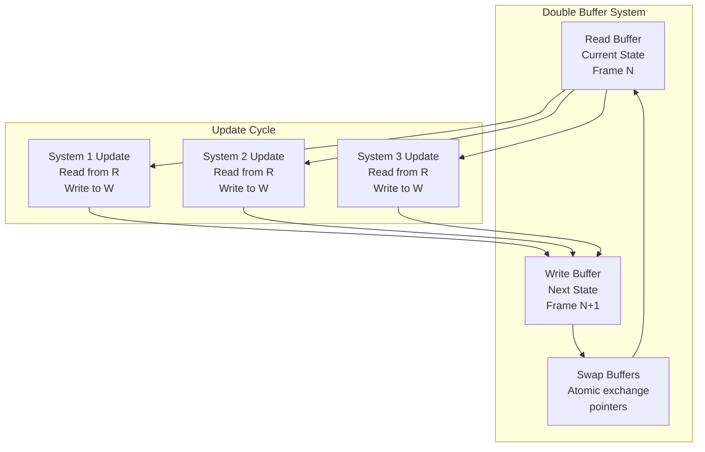
```mermaid
flowchart TB
    subgraph "Double Buffer System"
        R[Read Buffer<br>Current State<br>Frame N]

        W[Write Buffer<br>Next State<br>Frame N+1]

        S[Swap Buffers<br>Atomic exchange<br>pointers]
    end

    subgraph "Update Cycle"
        U1[System 1 Update<br>Read from R<br>Write to W]
        U2[System 2 Update<br>Read from R<br>Write to W]
        U3[System 3 Update<br>Read from R<br>Write to W]
    end

    R --> U1
    R --> U2
    R --> U3
    U1 --> W
    U2 --> W
    U3 --> W
    W --> S
    S --> R
```

#### Variations Across Games

**OpenCombat-SDL: Single Buffer (No Double Buffer)**
```cpp
// Updates happen immediately
void World::Update(float dt) {
    for (auto* obj : objects) {
        obj->Update(dt);  // Modifies state immediately
    }
}
// Risk of reading partial updates
```

**OpenCombat: Current State + Messages**
```rust
// Implicit double buffer through messages
pub struct BattleState {
    soldiers: Vec<Soldier>,        // Current state (read)
    pending_messages: Vec<Message>, // Changes to apply (write buffer)
}

impl BattleState {
    pub fn tick(&mut self) {
        // Process all messages (apply write buffer)
        for msg in self.pending_messages.drain(..) {
            self.apply_message(msg);
        }
    }

    pub fn queue_message(&mut self, msg: Message) {
        self.pending_messages.push(msg);
    }
}

// Systems read current state, queue changes
fn combat_system(state: &mut BattleState) {
    for i in 0..state.soldiers.len() {
        let soldier = &state.soldiers[i];
        if soldier.can_fire() {
            // Queue change, don't apply immediately
            state.queue_message(Message::Fire {
                soldier: SoldierIndex(i),
                target: soldier.target,
            });
        }
    }
}
```

**CloseCombatFree: QML Property Binding**
```cpp
// QML handles buffering internally
// Property changes queued and applied
void setProperty(const char* name, const QVariant& value) {
    // Qt queues property changes
    // Applied at next event loop iteration
}

// Explicit state buffering not needed
// Qt's declarative system handles it
```

#### When to Use
Double buffering helps when:
- Systems read and write the same data structures
- Parallel processing occurs
- Consistent snapshots are required mid-frame
- Physics and game logic must be decoupled

#### When NOT to Use
Avoid double buffering when:
- Memory is constrained (requires 2x memory)
- Systems don't conflict
- A simple single-threaded update suffices

#### Related Patterns
- **Buffer Pool Pattern**: Manage multiple buffers
- **State Pattern**: Often used with double buffering
- **Command Pattern**: Commands can be queued in write buffer

---

### 8.5.4 Update Method Pattern (Game Loop)

#### Intent
Centralize game system updates to ensure consistent, timely processing of game logic.

#### Problem
Multiple systems require regular updates. Update order matters (input before AI, AI before physics). Fixed timesteps ensure determinism. Games must balance variable rendering rates with fixed simulation rates.

#### Solution

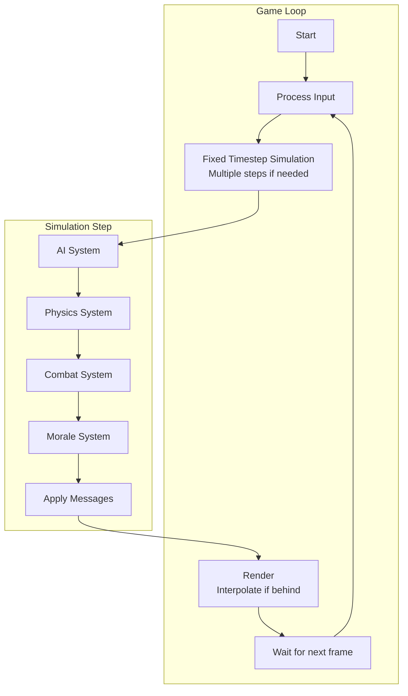
```mermaid
flowchart TB
    subgraph "Game Loop"
        S[Start]
        I[Process Input]
        SIM[Fixed Timestep Simulation<br>Multiple steps if needed]
        R[Render<br>Interpolate if behind]
        V[Wait for next frame]
    end

    subgraph "Simulation Step"
        AI[AI System]
        PHY[Physics System]
        COM[Combat System]
        MOR[Morale System]
        MSG[Apply Messages]
    end

    S --> I
    I --> SIM
    SIM --> AI
    AI --> PHY
    PHY --> COM
    COM --> MOR
    MOR --> MSG
    MSG --> R
    R --> V
    V --> I
```

#### Variations Across Games

**OpenCombat-SDL: Simple Loop**
```cpp
void Game::Run() {
    while (running) {
        float dt = GetDeltaTime();

        ProcessInput();
        world->Update(dt);
        renderer->Render(world);

        SwapBuffers();
    }
}
// Variable timestep - simple but not deterministic
```

**OpenCombat: Fixed Timestep with Interpolation**
```rust
const DT: f32 = 1.0 / 60.0;  // Fixed 60 Hz simulation
const MAX_DT: f32 = 0.25;    // Prevent spiral of death

pub struct GameLoop {
    accumulator: f32,
    last_time: Instant,
}

impl GameLoop {
    pub fn run(&mut self, state: &mut BattleState) {
        let current_time = Instant::now();
        let mut frame_time = current_time.duration_since(self.last_time).as_secs_f32();

        if frame_time > MAX_DT {
            frame_time = MAX_DT;  // Prevent spiral of death
        }

        self.last_time = current_time;
        self.accumulator += frame_time;

        // Fixed timestep simulation
        while self.accumulator >= DT {
            self.update(state, DT);
            self.accumulator -= DT;
        }

        // Interpolation factor for smooth rendering
        let alpha = self.accumulator / DT;
        self.render(state, alpha);
    }

    fn update(&mut self, state: &mut BattleState, dt: f32) {
        // Ordered update
        process_input(state);
        update_ai(state, dt);
        update_physics(state, dt);
        update_combat(state, dt);
        apply_messages(state);
    }

    fn render(&self, state: &BattleState, alpha: f32) {
        // Interpolate positions for smooth rendering
        for soldier in &state.soldiers {
            let pos = soldier.transform.position * alpha +
                     soldier.transform.prev_position * (1.0 - alpha);
            render_soldier(soldier, pos);
        }
    }
}
```

**CloseCombatFree: Event-Driven (Animation-Based)**
```cpp
// Qt's event loop drives updates
void CcfEngine::run() {
    QTimer* gameTimer = new QTimer(this);
    connect(gameTimer, &QTimer::timeout, this, &CcfEngine::update);
    gameTimer->start(16);  // ~60 FPS
}

void CcfEngine::update() {
    // Process QML animations (Qt handles timing)
    // Check order completion
    // Update game state

    for (auto* unit : units) {
        if (unit->isOrderComplete()) {
            unit->processNextOrder();
        }
    }
}
// Less precise timing, animation-driven
```

#### When to Use
The update method pattern works best when:
- Multiple systems need coordinated updates
- Fixed timestep is required for determinism
- Update order is critical
- Smooth rendering with fixed simulation is needed

#### When NOT to Use
Avoid this pattern when:
- Event-driven approaches suffice (simple games)
- The platform provides its own game loop (browsers, some frameworks)

#### Related Patterns
- **Game Loop Pattern**: Update Method is part of Game Loop
- **Double Buffer Pattern**: Often used within update cycle
- **State Pattern**: State changes triggered in update

---

## 8.6 Modding Patterns

### 8.6.1 Data-Driven Pattern

#### Intent
Keep game logic separate from game data. This lets designers modify content without touching code.

#### Problem
Hardcoded values force recompilation for every change. Designers can't tweak settings without programmer help. Content creators shouldn't need to read code. Games often need multiple versions of similar items—weapons, units, terrain.

#### Solution

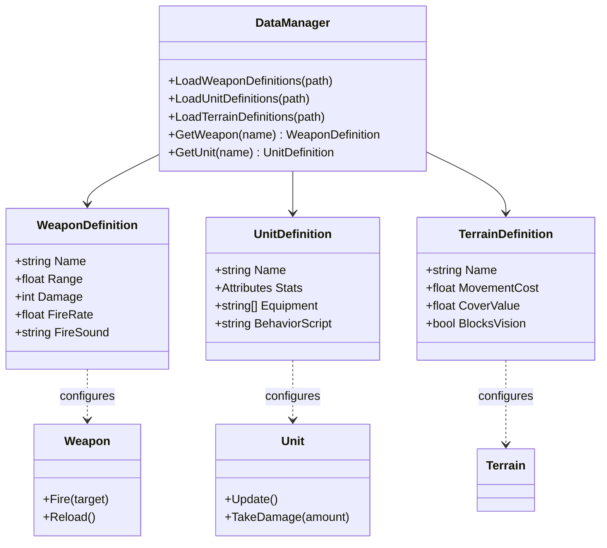
```mermaid
classDiagram
    classDef default fill:#fff,stroke:#000,stroke-width:1px
    classDef light fill:#f0f0f0,stroke:#333,stroke-width:1px
    classDef medium fill:#d0d0d0,stroke:#333,stroke-width:1px
    classDef dark fill:#b0b0b0,stroke:#000,stroke-width:2px

    class DataManager {
        +LoadWeaponDefinitions(path)
        +LoadUnitDefinitions(path)
        +LoadTerrainDefinitions(path)
        +GetWeapon(name) WeaponDefinition
        +GetUnit(name) UnitDefinition
    }

    class WeaponDefinition {
        +string Name
        +float Range
        +int Damage
        +float FireRate
        +string FireSound
    }

    class UnitDefinition {
        +string Name
        +Attributes Stats
        +string[] Equipment
        +string BehaviorScript
    }

    class TerrainDefinition {
        +string Name
        +float MovementCost
        +float CoverValue
        +bool BlocksVision
    }

    class Weapon {
        +Fire(target)
        +Reload()
    }

    class Unit {
        +Update()
        +TakeDamage(amount)
    }

    DataManager --> WeaponDefinition
    DataManager --> UnitDefinition
    DataManager --> TerrainDefinition
    WeaponDefinition ..> Weapon : configures
    UnitDefinition ..> Unit : configures
    TerrainDefinition ..> Terrain : configures
```

#### Variations Across Games

**OpenCombat-SDL: XML Data Files**
```xml
<!-- Weapons.xml -->
<Weapon Name="M1_Garand">
    <Range>300</Range>
    <Damage>45</Damage>
    <FireRate>0.5</FireRate>
    <MagazineSize>8</MagazineSize>
    <FireSound>sounds/garand_fire.wav</FireSound>
    <ReloadTime>3.5</ReloadTime>
</Weapon>

<!-- Units.xml -->
<SoldierType Name="Rifleman">
    <Attributes Aggressiveness="Steady" Morale="Steady"/>
    <DefaultWeapon>M1_Garand</DefaultWeapon>
    <Equipment>Grenade</Equipment>
    <Equipment>Grenade</Equipment>
</SoldierType>

<!-- Terrain.xml -->
<Element Name="StoneWall">
    <MovementCost>1000</MovementCost>  <!-- Impassable -->
    <Cover Standing="0.8" Prone="0.95"/>
    <BlocksVision>true</BlocksVision>
</Element>
```

```cpp
class DataManager {
    std::map<std::string, WeaponTemplate*> weapons;
    std::map<std::string, SoldierTemplate*> soldierTypes;

public:
    void LoadFromXML(const std::string& filename) {
        xmlDoc* doc = xmlReadFile(filename.c_str(), nullptr, 0);
        // Parse and populate maps
    }

    WeaponTemplate* GetWeapon(const std::string& name) {
        return weapons[name];
    }
};
```

**OpenCombat: JSON Definitions**
```json
// weapons.json
{
    "m1_garand": {
        "name": "M1 Garand",
        "range": 300,
        "damage": 45,
        "fire_rate": 0.5,
        "magazine_size": 8,
        "reload_time": 3.5,
        "fire_sound": "sounds/garand_fire.wav",
        "accuracy": 0.85,
        "suppression": 15
    },
    "mg42": {
        "name": "MG42",
        "range": 800,
        "damage": 55,
        "fire_rate": 20.0,
        "magazine_size": 250,
        "reload_time": 8.0,
        "fire_sound": "sounds/mg42_fire.wav",
        "accuracy": 0.65,
        "suppression": 50
    }
}

// units.json
{
    "rifleman": {
        "name": "Rifleman",
        "attributes": {
            "health": 100,
            "speed": 2.5,
            "experience": 1
        },
        "default_weapon": "m1_garand",
        "equipment": ["grenade", "grenade"]
    }
}
```

```rust
pub struct DataManager {
    weapons: HashMap<String, WeaponDefinition>,
    units: HashMap<String, UnitDefinition>,
}

impl DataManager {
    pub fn load_from_json(&mut self, path: &Path) -> Result<(), Error> {
        let file = File::open(path)?;
        let weapons: HashMap<String, WeaponDefinition> = serde_json::from_reader(file)?;
        self.weapons.extend(weapons);
        Ok(())
    }

    pub fn get_weapon(&self, name: &str) -> Option<&WeaponDefinition> {
        self.weapons.get(name)
    }
}
```

**CloseCombatFree: QML Declarative Data**
```qml
// Weapons.qml
WeaponDefinition {
    name: "M1 Garand"
    range: 300
    damage: 45
    fireRate: 0.5
    magazineSize: 8
    fireSound: "sounds/garand_fire.wav"
}

// Units.qml
UnitDefinition {
    name: "Rifleman"
    health: 100
    speed: 2.5
    defaultWeapon: garandDefinition
    equipment: [grenade, grenade]
}

// Terrain.qml
TerrainDefinition {
    name: "Stone Wall"
    movementCost: 1000
    coverStanding: 0.8
    coverProne: 0.95
    blocksVision: true
}
```

#### When to Use
Designers need to adjust values without programmer help. The game includes many similar items. Modding support is a goal. Content changes often.

#### When NOT to Use
Content never changes. Performance is critical and data lookups add overhead. Simple hardcoded values work fine.

#### Related Patterns
**Factory Pattern** creates instances from data definitions.
**Prototype Pattern** treats data definitions as prototypes.
**Component Pattern** composes entities from data-driven components.

---

### 8.6.2 Hot-Reload Pattern

#### Intent
Let designers modify game data and scripts at runtime. This eliminates restarts and speeds up iteration.

#### Problem
The traditional cycle—edit, recompile, restart, navigate, test—takes minutes. Slow iteration breaks creative flow. Designers waste hours waiting for builds. Rapid prototyping becomes impossible.

#### Solution

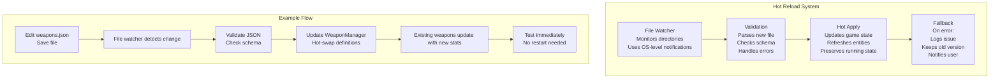
```mermaid
flowchart TB
    subgraph "Hot Reload System"
        W[File Watcher<br>Monitors directories<br>Uses OS-level notifications]

        V[Validation<br>Parses new file<br>Checks schema<br>Handles errors]

        H[Hot Apply<br>Updates game state<br>Refreshes entities<br>Preserves running state]

        F[Fallback<br>On error:<br>Logs issue<br>Keeps old version<br>Notifies user]
    end

    subgraph "Example Flow"
        E1[Edit weapons.json<br>Save file]
        E2[File watcher detects change]
        E3[Validate JSON<br>Check schema]
        E4[Update WeaponManager<br>Hot-swap definitions]
        E5[Existing weapons update with new stats]
        E6[Test immediately<br>No restart needed]
    end

    E1 --> E2 --> E3 --> E4 --> E5 --> E6

    W --> V --> H --> F
```

#### Variations Across Games

**OpenCombat-SDL: No Hot Reload**
```cpp
// Data loaded once at startup
void Game::Initialize() {
    dataManager.LoadFromXML("data/weapons.xml");
    dataManager.LoadFromXML("data/units.xml");
    // Changes require restart
}
```

**OpenCombat: Partial Hot Reload**
```rust
pub struct HotReloadManager {
    watchers: HashMap<PathBuf, FileWatcher>,
    reload_handlers: HashMap<PathBuf, Box<dyn Fn() + Send>>,
}

impl HotReloadManager {
    pub fn watch_file<F>(&mut self, path: &Path, handler: F)
    where F: Fn() + Send + 'static {
        let watcher = FileWatcher::new(path);
        self.watchers.insert(path.to_path_buf(), watcher);
        self.reload_handlers.insert(path.to_path_buf(), Box::new(handler));
    }

    pub fn check_and_reload(&mut self) {
        for (path, watcher) in &self.watchers {
            if watcher.has_changed() {
                if let Some(handler) = self.reload_handlers.get(path) {
                    handler();
                }
            }
        }
    }
}

// Usage
let mut hot_reload = HotReloadManager::new();
hot_reload.watch_file("config/weapons.json", || {
    if let Err(e) = data_manager.reload_weapons() {
        error!("Failed to reload weapons: {}", e);
    } else {
        info!("Weapons reloaded successfully");
    }
});

// Check in main loop
loop {
    hot_reload.check_and_reload();
    // ... game loop
}
```

**CloseCombatFree: Native Hot Reload (QML)**
```cpp
// QML supports hot reload naturally
class HotReloadManager : public QObject {
    Q_OBJECT

public slots:
    void reloadScenario(const QString& file) {
        // Clear current scenario
        clearCurrentScenario();

        // Load new version
        QQmlComponent component(&engine, QUrl::fromLocalFile(file));

        if (component.status() == QQmlComponent::Ready) {
            QObject* newScenario = component.create();

            // Replace current
            setCurrentScenario(newScenario);

            // Preserve player progress if possible
            restorePlayerProgress();
        } else {
            qDebug() << "Reload error:" << component.errorString();
            // Keep old scenario running
        }
    }

    void reloadUnitDefinition(const QString& file) {
        QQmlComponent component(&engine, QUrl::fromLocalFile(file));

        if (component.status() == QQmlComponent::Ready) {
            QObject* definition = component.create();

            // Update existing units with new definition
            for (auto* unit : activeUnits) {
                if (unit->definitionFile() == file) {
                    unit->applyNewDefinition(definition);
                }
            }
        }
    }
};

// File watcher triggers reload
void FileWatcher::onFileChanged(const QString& path) {
    if (path.endsWith(".qml")) {
        if (isScenarioFile(path)) {
            hotReloadManager->reloadScenario(path);
        } else if (isUnitDefinition(path)) {
            hotReloadManager->reloadUnitDefinition(path);
        }
    }
}
```

#### When to Use
Iteration speed matters. Designers create or modify content. Rapid prototyping is essential. Compile times are long (C++, Rust).

#### When NOT to Use
Runtime stability is more important than iteration speed. Memory leaks from reloading are unacceptable. Preserving state is impossible.

#### Related Patterns
**Observer Pattern** lets the file watcher monitor the file system.
**Factory Pattern** recreates objects with updated data.
**Prototype Pattern** clones updated prototypes.

---

### 8.6.3 Scripting Bridge Pattern

#### Intent
Create a clean interface between high-performance engine code and flexible scripting languages. This lets modders customize behaviors without sacrificing speed.

#### Problem
Game engines demand maximum performance, typically achieved in C++ or Rust. Modders, however, need accessible scripting languages like Lua or Python. Bridging these requires solutions for type safety, error handling, sandboxing, and cross-language debugging.

#### Solution

```mermaid
classDiagram
    classDef default fill:#fff,stroke:#000,stroke-width:1px
    classDef light fill:#f0f0f0,stroke:#333,stroke-width:1px
    classDef medium fill:#d0d0d0,stroke:#333,stroke-width:1px
    classDef dark fill:#b0b0b0,stroke:#000,stroke-width:2px

    class ScriptEngine {
        +Initialize()
        +LoadScript(path)
        +CallFunction(name, args)
        +RegisterFunction(name, callback)
        +SetGlobal(name, value)
    }

    class ScriptBridge {
        +ExposeEntity(entity)
        +ExposeWorld(world)
        +ExposeCombatSystem(system)
        +CreateSandbox()
    }

    class LuaEngine {
        +lua_State* L
        +Execute(script)
        +GetGlobal(name)
        +PushValue(value)
    }

    class WrenEngine {
        +WrenVM* vm
        +Interpret(script)
        +Call(method)
    }

    class AIScript {
        +onUpdate(entity, dt)
        +onEnterState(entity, state)
        +onExitState(entity, state)
    }

    ScriptEngine <|-- LuaEngine
    ScriptEngine <|-- WrenEngine
    ScriptBridge --> ScriptEngine
    ScriptEngine --> AIScript : executes
```

#### Variations Across Games

**OpenCombat-SDL: No Scripting**
```cpp
// All AI hardcoded in C++
void Soldier::UpdateAI() {
    if (DetectEnemies()) {
        AttackNearest();
    } else {
        FollowOrders();
    }
}
```

**OpenCombat: Planned Scripting (Rust + Lua)**
```rust
pub struct ScriptBridge {
    lua: Lua,
    entity_wrappers: HashMap<EntityId, EntityWrapper>,
}

impl ScriptBridge {
    pub fn new() -> Self {
        let lua = Lua::new();

        lua.globals().set("findEnemiesInRange", lua.create_function(
            |_, (pos, range): (Vec2, f32)| {
                Ok(find_enemies(pos, range))
            }
        ).unwrap());

        lua.globals().set("moveTo", lua.create_function(
            |_, (entity_id, dest): (EntityId, Vec2)| {
                Ok(queue_move(entity_id, dest))
            }
        ).unwrap());

        Self { lua, entity_wrappers: HashMap::new() }
    }

    pub fn load_behavior(&mut self, path: &Path) -> Result<Behavior, Error> {
        let script = std::fs::read_to_string(path)?;
        self.lua.load(&script).exec()?;
        Ok(Behavior::Scripted(path.to_string_lossy().to_string()))
    }

    pub fn update_behavior(&mut self, entity_id: EntityId, dt: f32) {
        if let Some(wrapper) = self.entity_wrappers.get(&entity_id) {
            let on_update: Function = self.lua.globals().get("onUpdate").unwrap();
            on_update.call::<_, ()>((wrapper, dt)).unwrap();
        }
    }
}

// Lua script (planned)
-- behaviors/defensive.lua
function onUpdate(entity, dt)
    if entity:isUnderFire() then
        local cover = findNearestCover(entity.position, 50)
        if cover then
            entity:moveTo(cover)
        end
    elseif entity:hasValidTarget() then
        entity:engageTarget()
    else
        entity:executeOrder()
    end
end
```

**CloseCombatFree: JavaScript/QML Scripting**
```qml
// QML/JavaScript for behaviors
Soldier {
    id: soldier

    function evaluateThreat() {
        var enemies = findEnemiesInRange(position, viewDistance);
        var threat = 0;
        for (var i = 0; i < enemies.length; i++) {
            threat += calculateThreat(enemies[i]);
        }
        return threat;
    }

    function onUnderFire() {
        var cover = findNearestCover(position, 100);
        if (cover) {
            moveTo(cover);
        } else {
            goProne();
        }
    }

    function updateAI() {
        if (underFire) {
            onUnderFire();
        } else if (evaluateThreat() > threatThreshold) {
            takeCover();
        } else {
            executeCurrentOrder();
        }
    }
}
```

#### When to Use
Use this pattern when moddable AI or behaviors are required, when designers need to create content without programmer involvement, or when rapid iteration on game logic is necessary. It's also useful for sandboxing untrusted code.

#### When NOT to Use
Avoid this pattern for performance-critical paths, when debugging complexity becomes unmanageable, or if the team lacks scripting expertise.

#### Related Patterns
- **Facade Pattern**: The script bridge acts as a facade to the engine.
- **Adapter Pattern**: Adapts engine types to script types.
- **Proxy Pattern**: Script proxies stand in for engine objects.

---

### 8.6.4 Mod Composition Pattern

#### Intent
Enable multiple mods to coexist and interact safely. This includes clear dependency management and conflict resolution.

#### Problem
Mods often modify the same content, creating dependencies that must be resolved. Load order affects overrides, and conflicts require detection and resolution. Mods should also be hot-swappable without breaking the game.

#### Solution

```mermaid
classDiagram
    classDef default fill:#fff,stroke:#000,stroke-width:1px
    classDef light fill:#f0f0f0,stroke:#333,stroke-width:1px
    classDef medium fill:#d0d0d0,stroke:#333,stroke-width:1px
    classDef dark fill:#b0b0b0,stroke:#000,stroke-width:2px

    class ModManager {
        +LoadMod(path)
        +UnloadMod(modId)
        +ResolveDependencies()
        +CheckConflicts()
        +GetMergedData(type) Data
    }

    class Mod {
        +string Id
        +string Name
        +Version Version
        +string[] Dependencies
        +DataFiles Files
        +int Priority
    }

    class DataFile {
        +string Type
        +string Path
        +MergeStrategy Strategy
    }

    class MergeStrategy {
        <<interface>>
        +Merge(base, override) Data
    }

    class OverrideStrategy {
        +Merge(base, override) Data
    }

    class AdditiveStrategy {
        +Merge(base, override) Data
    }

    class PatchStrategy {
        +Merge(base, override) Data
    }

    ModManager --> Mod
    Mod --> DataFile
    DataFile --> MergeStrategy
    MergeStrategy <|.. OverrideStrategy
    MergeStrategy <|.. AdditiveStrategy
    MergeStrategy <|.. PatchStrategy
```

#### Variations Across Games

**OpenCombat-SDL: No Mod System**
```cpp
// No formal mod support
// Users can replace data files manually
// No conflict resolution
```

**OpenCombat: Basic Override System**
```rust
pub struct Mod {
    id: String,
    name: String,
    version: Version,
    dependencies: Vec<String>,
    data_files: Vec<PathBuf>,
    priority: i32,
}

pub struct ModManager {
    mods: Vec<Mod>,
    loaded_data: HashMap<String, Value>,
}

impl ModManager {
    pub fn load_mod(&mut self, path: &Path) -> Result<(), Error> {
        let mod_manifest = self.read_manifest(path)?;

        for dep in &mod_manifest.dependencies {
            if !self.has_mod(dep) {
                return Err(ModError::MissingDependency(dep.clone()));
            }
        }

        self.mods.push(mod_manifest);
        self.resolve_load_order()?;
        self.reload_data()?;

        Ok(())
    }

    fn resolve_load_order(&mut self) -> Result<(), Error> {
        self.mods.sort_by_key(|m| m.priority);
        Ok(())
    }

    fn reload_data(&mut self) -> Result<(), Error> {
        self.loaded_data.clear();
        self.load_base_data()?;

        for mod_manifest in &self.mods {
            for file in &mod_manifest.data_files {
                self.apply_mod_data(file)?;
            }
        }

        Ok(())
    }

    fn apply_mod_data(&mut self, path: &Path) -> Result<(), Error> {
        let data: Value = serde_json::from_reader(File::open(path)?)?;

        if let Some(obj) = data.as_object() {
            for (key, value) in obj {
                self.loaded_data.insert(key.clone(), value.clone());
            }
        }

        Ok(())
    }
}
```

**CloseCombatFree: QML Mod System**
```cpp
class ModManager : public QObject {
    Q_OBJECT

public:
    struct Mod {
        QString id;
        QString name;
        QString version;
        QStringList dependencies;
        QStringList qmlFiles;
        int loadOrder;
    };

    bool loadMod(const QString& path) {
        QDir modDir(path);
        QFile manifestFile(modDir.filePath("mod.json"));
        if (!manifestFile.open(QIODevice::ReadOnly)) {
            return false;
        }

        QJsonDocument doc = QJsonDocument::fromJson(manifestFile.readAll());
        QJsonObject manifest = doc.object();

        Mod mod;
        mod.id = manifest["id"].toString();
        mod.name = manifest["name"].toString();
        mod.version = manifest["version"].toString();

        QJsonArray deps = manifest["dependencies"].toArray();
        for (const auto& dep : deps) {
            mod.dependencies.append(dep.toString());
        }

        for (const auto& dep : mod.dependencies) {
            if (!isModLoaded(dep)) {
                qWarning() << "Missing dependency:" << dep;
                return false;
            }
        }

        mod.qmlFiles = modDir.entryList({"*.qml"}, QDir::Files);
        mods.append(mod);

        std::sort(mods.begin(), mods.end(),
                  [](const Mod& a, const Mod& b) { return a.loadOrder < b.loadOrder; });

        reloadScenario();
        return true;
    }

    void checkConflicts() {
        QMultiMap<QString, QString> fileToMod;

        for (const auto& mod : mods) {
            for (const auto& file : mod.qmlFiles) {
                fileToMod.insert(file, mod.id);
            }
        }

        for (auto it = fileToMod.begin(); it != fileToMod.end(); ++it) {
            QStringList modList = fileToMod.values(it.key());
            if (modList.size() > 1) {
                qWarning() << "Conflict:" << it.key()
                           << "overridden by" << modList;
            }
        }
    }
};
```

#### When to Use
Use this pattern when community modding is expected, when multiple mods need to coexist, or when clear dependency management is necessary. It's also useful when mods modify the same content types.

#### When NOT to Use
Avoid this pattern if no modding is planned, if a simple override system suffices, or if the added complexity isn't justified.

#### Related Patterns
- **Plugin Pattern**: Mods function as plugins.
- **Strategy Pattern**: Different merge strategies handle conflicts.
- **Chain of Responsibility**: Mods apply in sequence.

---

## 8.7 Pattern Selection Guide

### 8.7.1 Decision Matrix

| Problem                     | Primary Pattern        | Secondary Pattern | Example                         |
| --------------------------- | ---------------------- | ----------------- | ------------------------------- |
| Create units from data      | Factory                | Prototype         | OpenCombat-SDL's SoldierManager |
| Complex unit construction   | Builder                | Component         | OpenCombat's Soldier struct     |
| Swap AI at runtime          | Strategy               | State             | Behavior enum dispatch          |
| Order queuing and undo      | Command                | Template Method   | OpenCombat's message system     |
| Multiplayer synchronization | Deterministic Lockstep | Command           | OpenCombat's simulation         |
| Decouple systems            | Observer               | Mediator          | CloseCombatFree's signals       |
| Spatial queries             | Spatial Partitioning   | Iterator          | Grid-based indexing             |
| State-based behavior        | State                  | Strategy          | Three-tier hierarchy            |
| Simplify complex subsystems | Facade                 | Adapter           | AI controller interface         |
| Enable modding              | Data-Driven            | Hot-Reload        | JSON with file watcher          |
| Network object access       | Proxy                  | Observer          | Remote soldier proxy            |
| Entity composition          | Component              | Aggregate         | Modified ECS                    |

### 8.7.2 Pattern Combinations

#### Combination 1: ECS + Command + Event Sourcing
Best for multiplayer tactical games with replay support.

```mermaid
flowchart TB
    subgraph "Entity System"
        E[Entities: IDs only]
        C[Components: Data]
        S[Systems: Logic]
    end

    subgraph "Command System"
        CMD[Commands: Player actions]
        QUE[Command Queue]
    end

    subgraph "Event Sourcing"
        EVT[Events: State changes]
        LOG[Event Log]
    end

    CMD --> QUE --> EVT --> LOG
    S --> C
    C --> E
```

**Key benefits:**
- ECS manages entities efficiently
- Commands serialize player input
- Event sourcing enables replays and deterministic simulation

#### Combination 2: Factory + Component + Data-Driven
Ideal for moddable single-player games.

```mermaid
flowchart TB
    subgraph "Data Layer"
        JSON[JSON Definitions]
        HOT[Hot Reload]
    end

    subgraph "Creation Layer"
        FAC[Factory]
        BUI[Builder]
    end

    subgraph "Entity Layer"
        COMP[Component Composition]
        ENT[Entities]
    end

    JSON --> FAC --> BUI --> COMP --> ENT
    HOT --> JSON
```

**Key benefits:**
- JSON allows moddable content
- Factory creates entities
- Components enable flexible composition
- Hot reload speeds iteration

#### Combination 3: State + Strategy + Observer
Handles complex AI with reactive behaviors.

```mermaid
flowchart TB
    subgraph "AI System"
        ST[State Machine]
        STR[Strategy Pattern]
        OBS[Observer]
    end

    subgraph "Behaviors"
        AGG[Aggressive]
        DEF[Defensive]
        STL[Stealth]
        PAN[Panicked]
    end

    subgraph "Events"
        DMG[Damage Event]
        VIS[Enemy Spotted]
        ORD[Order Received]
    end

    ST --> STR
    STR --> AGG
    STR --> DEF
    STR --> STL
    STR --> PAN
    DMG --> OBS --> ST
    VIS --> OBS --> ST
    ORD --> OBS --> ST
```

**Key benefits:**
- State machine manages high-level AI states
- Strategy pattern enables swappable behaviors
- Observer handles reactive event responses

### 8.7.3 When to Use Patterns

#### Creational Patterns

| Pattern         | Use When                                    | Avoid When                                |
| --------------- | ------------------------------------------- | ----------------------------------------- |
| Factory         | Multiple entity types, data-driven creation | Single entity type, simple construction   |
| Builder         | Complex construction with optional parts    | Simple entities, performance-critical     |
| Prototype       | Runtime variant creation, cloning           | No variation needed, construction differs |
| Scenario Loader | Multiple formats, complex loading           | Single format, simple loading             |

#### Structural Patterns

| Pattern   | Use When                                   | Avoid When                                     |
| --------- | ------------------------------------------ | ---------------------------------------------- |
| Aggregate | Part-whole hierarchies, tree structures    | Flat structure, no behavioral aggregation      |
| Component | Flexible composition, avoiding inheritance | Homogeneous entities, simple structure         |
| Facade    | Complex subsystem needs simple interface   | Direct access sufficient, performance-critical |
| Proxy     | Remote access, server authority            | Single-player, no network needs                |

#### Behavioral Patterns

| Pattern         | Use When                                     | Avoid When                                |
| --------------- | -------------------------------------------- | ----------------------------------------- |
| Command         | Queuing, undo, replay, network               | Simple immediate execution                |
| State           | Multiple distinct behaviors, runtime changes | Only 2-3 simple states                    |
| Observer        | One-to-many notification, decoupling         | Single handler, tight coupling acceptable |
| Strategy        | Multiple algorithms, runtime selection       | Single algorithm, rarely changes          |
| Template Method | Algorithm skeleton with variant steps        | Steps vary too much                       |

#### Simulation Patterns

| Pattern                | Use When                                  | Avoid When                                  |
| ---------------------- | ----------------------------------------- | ------------------------------------------- |
| Deterministic Lockstep | Multiplayer, replay, determinism          | Single-player, variable timestep acceptable |
| Spatial Partitioning   | Many entities, frequent spatial queries   | Fewer than 50 entities, rare queries        |
| Double Buffer          | Read/write conflicts, parallel processing | Memory constrained, simple updates          |
| Update Method          | Multiple systems, fixed timestep          | Event-driven sufficient                     |

#### Modding Patterns

| Pattern          | Use When                                 | Avoid When                       |
| ---------------- | ---------------------------------------- | -------------------------------- |
| Data-Driven      | Designers tune values, multiple variants | Content never changes            |
| Hot Reload       | Rapid iteration, long compile times      | Runtime stability critical       |
| Scripting Bridge | Moddable AI, sandboxed code              | Performance-critical, no modding |
| Mod Composition  | Community mods, dependencies             | No modding planned               |

### 8.7.4 Implementation Priority

For a new Close Combat clone, follow this implementation order:

```mermaid
flowchart LR
    subgraph "Priority 1: Foundation"
        P1[Factory<br>Entity creation]
        P2[Component<br>Composition]
        P3[Update Method<br>Game loop]
    end

    subgraph "Priority 2: Core Gameplay"
        P4[Command<br>Orders]
        P5[State<br>Unit states]
        P6[Observer<br>Events]
    end

    subgraph "Priority 3: Advanced"
        P7[Spatial Partitioning<br>Performance]
        P8[Strategy<br>AI]
        P9[Template Method<br>Order execution]
    end

    subgraph "Priority 4: Polish"
        P10[Deterministic Lockstep<br>Multiplayer]
        P11[Data-Driven<br>Modding]
        P12[Hot Reload<br>Iteration]
    end

    P1 --> P4 --> P7 --> P10
    P2 --> P5 --> P8 --> P11
    P3 --> P6 --> P9 --> P12
```

**Recommended timeline:**
1. Foundation (Weeks 1-4): Factory, Component, Update Method
2. Core Gameplay (Weeks 5-8): Command, State, Observer
3. Advanced (Weeks 9-12): Spatial Partitioning, Strategy, Template Method
4. Polish (Weeks 13+): Deterministic Lockstep, Data-Driven, Hot Reload

---

## 8.8 Conclusion

### 8.8.1 Patterns as Vocabulary

The patterns in this chapter create a shared language for tactical wargame architecture. Saying "we use a Three-Tier State Hierarchy with Command Pattern for orders" tells other developers exactly what to expect.

The three Close Combat clones show how patterns adapt to different needs:

- **OpenCombat-SDL** relied on classical OOP patterns: Factory, Command for orders, and partial State
- **OpenCombat** adopted modern patterns: Deterministic Simulation, Observer for messages, and a modified ECS
- **CloseCombatFree** used declarative patterns: Component composition in QML, Observer through signals/slots, and Data-Driven design

### 8.8.2 Key Insights

1. **Composition beats inheritance**: Modern games prefer Component and Aggregate patterns to deep class hierarchies
2. **Make dependencies explicit**: Dependency injection and Service Locator improve testing and modularity
3. **Event sourcing powers replay**: Message-driven architectures enable debugging and multiplayer
4. **Data-driven design fuels modding**: Keeping data separate from code unlocks community content
5. **Patterns solve problems**: Use them when they help, not just because they exist

### 8.8.3 Final Recommendations

For a new Close Combat clone in 2026, consider this architecture:

**Core Architecture**:
- Modified ECS (OpenCombat style) for entity management
- Three-Tier State Hierarchy for deterministic simulation
- Command Pattern with Event Sourcing for orders and replay
- Observer/Event Bus for communication between systems
- Spatial Partitioning for performance

**Modding Support**:
- Data-Driven Pattern with JSON/YAML definitions
- Hot Reload for rapid iteration
- Scripting Bridge (Lua or Wren) for AI behaviors
- Mod Composition for community content

**Multiplayer**:
- Deterministic Lockstep for synchronization
- Proxy Pattern for network entities
- Command Pattern for input serialization

### 8.8.4 Pattern Evolution

These patterns change with technology and design trends:

- ECS moved from academic research to industry standard
- Data-Oriented Design grew from cache optimization needs
- Scripting bridges became practical with faster virtual machines
- Hot reload is now standard in modern engines

When building your tactical wargame, adapt these patterns to your needs. The goal isn't perfect pattern implementation—it's working, maintainable code that serves your players.

---

*Next: [Chapter 9: Lessons Learned: 20 Years of Tactical Wargame Development](chapter_09_lessons_learned.md)*
