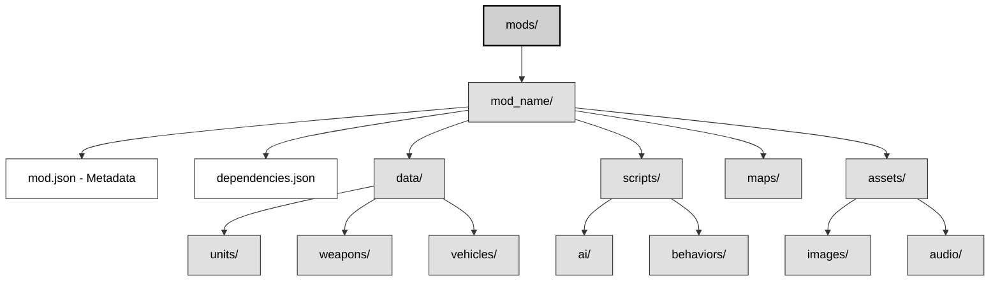
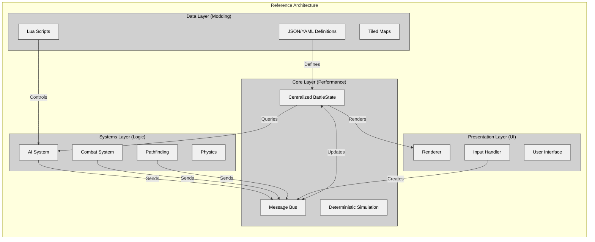

# Chapter 10: Architectural Recommendations for Tactical Wargames

## The Answer Key: What to Do and Why

After analyzing three implementations spanning nearly two decades, this chapter offers concrete recommendations for building your own Close Combat-inspired tactical wargame. These suggestions come from what worked, what failed, and what to improve.

## 10.1 Decision Framework by Game Type

Your architecture must align with your game's primary purpose. Each game type requires specific architectural approaches.

### 10.1.1 Competitive Multiplayer → Use OpenCombat Patterns

Competitive multiplayer needs determinism, fairness, and anti-cheat. Players will exploit any ambiguity in game state.

**Required Patterns**:
- **Server-authoritative simulation**: Server validates all state changes
- **Deterministic lockstep**: Fixed timestep, seeded RNG, reproducible physics
- **Three-tier state hierarchy**: Phase → Behavior → Gesture for clear state relationships
- **Message-driven updates**: All state changes flow through messages (enables replay and sync)
- **Type-safe indices**: Compile-time prevention of entity reference bugs

**Technology Choices**:
```
Language: Rust (memory safety) or C++17 (performance, ecosystem)
Networking: ZeroMQ, ENet, or custom UDP with reliability layer
State Sync: Event sourcing (messages) not snapshots
Physics: Fixed-point or deterministic floating-point
```

**Example: Deterministic State Update**
```rust
// OpenCombat pattern: All changes via messages
enum BattleStateMessage {
    Soldier(SoldierIndex, SoldierMessage),
    SetPhase(Phase),
    PushBulletFire(BulletFire),
}

fn tick(state: &mut BattleState, messages: &[BattleStateMessage]) {
    for msg in messages {
        state.apply(msg);  // Deterministic application
    }
}
```

### 10.1.2 Single-Player Immersive → Use OpenCombat-SDL Patterns

Single-player games focus on simulation depth, emergent behavior, and combat feel rather than synchronization. Rich interactions matter more than message passing overhead.

**Recommended Patterns**:
- **Bitfield state system**: 64 orthogonal states for emergent capability combinations
- **Automatic prerequisite chaining**: Actions declare requirements, system finds prerequisites
- **Deep inheritance hierarchies**: Natural modeling of "Soldier IS-A Object"
- **Direct method calls**: Simple, synchronous, intuitive

**Technology Choices**:
```
Language: C++17 (performance, control, ecosystem)
Graphics: SDL2, Raylib, or SFML
Physics: Box2D (if needed) or custom deterministic
Pathfinding: A* with custom heuristics
```

**Example: Automatic Prerequisite Chain**
```cpp
// OpenCombat-SDL pattern: Declarative action requirements
void Soldier::AddAction(Action* action) {
    // Check what state we need
    int prereq = CheckRequirements(action->Index, &_currentState);

    // Automatically insert prerequisite actions
    while (prereq != -1) {
        Action* prereqAction = new Action(prereq);
        _actionQueue.push_front(prereqAction);  // Insert before
        prereq = CheckRequirements(prereqAction, &_currentState);
    }

    _actionQueue.push_back(action);
}

// Example: Prone soldier ordered to run
// Automatically inserts: StandUp → RunTo
// No player micromanagement required
```

### 10.1.3 Modding-Focused → Use CloseCombatFree Patterns

If your community creates content, runtime flexibility becomes essential. Recompilation creates barriers that stifle creativity.

**Recommended Patterns**:
- **Declarative composition**: QML-style entity definitions
- **Runtime instantiation**: Load units/scenarios from data files
- **Hot reload**: File watcher detects changes, updates game without restart
- **Property binding**: Reactive UI that drives game logic

**Technology Choices**:
```
Language: C++17/Qt5 (QML) or C# (Unity) or JavaScript/Electron
Scripting: Lua, Wren, or QML itself
Data: JSON, YAML, or XML
Hot Reload: File watching + dynamic reloading
```

**Example: Runtime Unit Creation**
```qml
// CloseCombatFree pattern: Declarative unit definition
Tank {
    id: tank
    unitType: "Custom Tank"
    maxSpeed: 15

    Hull { id: hull }
    Turret { id: turret }

    Soldier { role: "Commander" }
    Soldier { role: "Gunner" }
    Soldier { role: "Driver" }
}
```

### 10.1.4 Hybrid/Commercial → Synthesize All Three

**The Recommended Architecture for 2026+**:

```mermaid
flowchart TB
    subgraph HybridArchitecture["Hybrid Architecture"]
        subgraph CoreSim["Core Simulation"]
            CS1[Deterministic game loop]
            CS2[Message-driven state updates]
            CS3[Server-authoritative<br>even for single-player]
            CS4[Fixed timestep physics]
        end

        subgraph EntityDef["Entity Definitions"]
            ED1[JSON/YAML data files]
            ED2[Lua scripting for behaviors]
            ED3[Hot reload for rapid iteration]
            ED4[Component composition<br>over inheritance]
        end

        subgraph SimDepth["Simulation Depth"]
            SD1[Bitfield capability tracking]
            SD2[Automatic prerequisite resolution]
            SD3[Rich state interactions]
        end
    end

    classDef default fill:#f0f0f0,stroke:#333,stroke-width:1px,color:#000
    classDef subgraph fill:#d0d0d0,stroke:#333,stroke-width:1px,color:#000
    class HybridArchitecture,CoreSim,EntityDef,SimDepth subgraph
    class CS1,CS2,CS3,CS4,ED1,ED2,ED3,ED4,SD1,SD2,SD3 default
```

This synthesis works because:
1. The core simulation uses deterministic patterns for multiplayer capability
2. Entity definitions use declarative patterns for modding
3. Simulation depth uses bitfield patterns for emergent behavior
4. You gain determinism, moddability, and depth

## 10.2 Core Architecture Recommendations

Here are concrete recommendations for each system, based on comparative analysis:

### 10.2.1 State Management

**Recommendation**: Use State Hierarchy with Bitfield Overlay

```mermaid
flowchart TD
    subgraph Hierarchy["Three-Tier Hierarchy for Timescale Separation"]
        Phase[Phase<br>Game level: Deployment, Battle, End]
        Behavior[Behavior<br>Tactical: MoveTo, Defend, Engage]
        Gesture[Gesture<br>Physical: Idle, Aiming, Firing<br>with completion time]

        Phase --> Behavior --> Gesture
    end

    subgraph Bitfield["Bitfield for Orthogonal Capabilities"]
        Cap1[CanMove, CanFire, CanSee]
        Cap2[IsProne, IsSuppressed, IsInBuilding]
        Cap3[IsCrewMember, IsVehicleOccupant]

        Cap1 --- Cap2 --- Cap3
    end

    classDef default fill:#f0f0f0,stroke:#333,stroke-width:1px,color:#000
    classDef subgraph fill:#d0d0d0,stroke:#333,stroke-width:1px,color:#000
    class Hierarchy,Bitfield subgraph
    class Phase,Behavior,Gesture,Cap1,Cap2,Cap3 default
```

The hierarchy provides clear relationships and timescale separation. The bitfield enables efficient capability queries. Together, they address both organizational and performance needs.

**Implementation Pattern**:
```cpp
struct UnitState {
    // Hierarchy (from OpenCombat)
    Phase phase;           // Global game phase
    Behavior behavior;     // Current tactical behavior
    Gesture gesture;       // Immediate physical action

    // Bitfield overlay (from OpenCombat-SDL)
    uint64_t capabilities; // CanMove | CanFire | IsProne
    uint64_t conditions;   // IsSuppressed | IsWounded
};

// Query capabilities efficiently
bool canFire = (state.capabilities & CAN_FIRE) == CAN_FIRE;
```

**Language-Specific Implementations**:

**C++**:
```cpp
enum class Capability : uint64_t {
    CanMove = 1 << 0,
    CanFire = 1 << 1,
    IsProne = 1 << 4,
    IsSuppressed = 1 << 6,
};

constexpr uint64_t operator|(Capability a, Capability b) {
    return static_cast<uint64_t>(a) | static_cast<uint64_t>(b);
}
```

**Rust**:
```rust
bitflags! {
    struct Capabilities: u64 {
        const CAN_MOVE = 1 << 0;
        const CAN_FIRE = 1 << 1;
        const IS_PRONE = 1 << 4;
    }
}
```

**C#**:
```csharp
[Flags]
public enum Capabilities : ulong {
    CanMove = 1 << 0,
    CanFire = 1 << 1,
    IsProne = 1 << 4,
}
```

### 10.2.2 Unit Model

**Recommendation**: Build squads using component composition with an aggregate pattern.

This approach avoids rigid inheritance hierarchies. It supports unusual unit types like flying tanks or crewed artillery. The aggregate pattern also models squad relationships naturally.

**Universal Pattern**:
```pseudocode
Entity Unit {
    uuid: EntityId
    components: Map<ComponentType, Component>

    // Aggregation (not inheritance)
    parentSquad: Option<EntityReference>
    children: List<EntityReference>
}

Component Transform {
    position: Vec2
    rotation: float
    scale: Vec2
}

Component Health {
    current: int
    max: int
}

Component SquadMembership {
    squadId: SquadId
    role: Role  // Leader, Rifleman, MachineGunner
}

Aggregate Squad {
    leader: EntityReference
    members: List<EntityReference>
    formation: FormationType

    function issueOrder(order: Order) {
        // Distribute to members based on role
        for member in members {
            roleOrder = adaptOrderForRole(order, member.role)
            member.addOrder(roleOrder)
        }
    }
}
```

**Implementation Pattern (C++)**:
```cpp
// Type-safe indices instead of pointers
struct SoldierIndex { size_t value; };
struct VehicleIndex { size_t value; };

struct Soldier {
    Transform transform;
    Health health;
    Behavior behavior;
    Weapon weapon;
    SquadId squad;  // Reference, not ownership
};

struct Squad {
    SoldierIndex leader;
    std::vector<SoldierIndex> members;
    FormationType formation;
};
```

**Implementation Pattern (Rust)**:
```rust
pub struct Soldier {
    pub transform: Transform,
    pub health: Health,
    pub behavior: Behavior,
    pub weapon: Option<Weapon>,
    pub squad: Option<SquadId>,
}

pub struct Squad {
    pub leader: SoldierIndex,
    pub members: Vec<SoldierIndex>,
    pub formation: FormationType,
}
```

### 10.2.3 Order System

**Recommendation**: Implement a two-tier system with orders and actions, linked by prerequisite chains.

The two-tier structure balances player control with automation. Prerequisite chains reduce micromanagement. Data-driven action definitions make the system moddable.

**Universal Pattern**:
```pseudocode
// Tier 1: Orders (player intent)
enum Order {
    MoveTo(destination, speed),
    Defend(position, facing),
    Engage(target),
    Ambush(position, arc),
    Stop,
}

// Tier 2: Actions (physical execution)
enum Action {
    StandUp,
    LieDown,
    WalkTo(destination),
    RunTo(destination),
    CrawlTo(destination),
    AimAt(target),
    FireAt(target),
    Reload,
}

// Action requirements (data-driven)
table ActionRequirements {
    StandUp: { requires: [], adds: [Standing], removes: [Prone, Crouching] }
    StandingFire: { requires: [Standing, Reloaded], adds: [Firing], removes: [Reloaded] }
    LieDown: { requires: [Standing], adds: [Prone], removes: [Standing] }
}

function queueAction(unit, action) {
    // Automatic prerequisite resolution
    currentState = unit.getCurrentState()
    requiredState = action.getRequiredState()

    while currentState != requiredState {
        prereqAction = findActionThatAchieves(requiredState)
        unit.actionQueue.push_front(prereqAction)
        currentState = prereqAction.getResultState()
    }

    unit.actionQueue.push_back(action)
}
```

**Example Flow**:
When a player orders "Fire at enemy," the system checks the soldier's state—prone with an empty magazine. It automatically inserts the necessary steps:

1. StandUp (prerequisite for firing)
2. Reload (prerequisite for having ammo)
3. FireAtTarget (the requested action)

The result is smooth, intelligent behavior without micromanagement.

### 10.2.4 AI System

**Recommendation**: Use a reactive behavior system with optional proactive planning.

Reactive AI handles immediate threats first. Behavior trees provide clear, debuggable logic. GOAP can be added later for squad-level tactics.

**Universal Pattern (Behavior Tree)**:
```pseudocode
// Priority-ordered behavior tree
Selector Root [
    // Priority 1: Survival (cannot be overridden)
    Sequence [
        Condition: IsUnderHeavyFire
        Selector [
            Sequence [
                Condition: HasNearbyCover
                Action: MoveToCover
            ]
            Action: ReturnFire
        ]
    ]

    // Priority 2: Engage threats
    Sequence [
        Condition: CanSeeEnemy
        Action: EngageTarget
    ]

    // Priority 3: Follow orders
    Sequence [
        Condition: HasPendingOrder
        Action: ExecuteOrder
    ]

    // Priority 4: Idle
    Action: IdleScan
]
```

**Data-Driven Configuration**:
```yaml
# behaviors/infantry_standard.yaml
behavior_tree:
  type: selector
  children:
    - type: sequence
      name: "Survival Response"
      children:
        - type: condition
          check: "under_fire > DANGER_THRESHOLD"
        - type: selector
          children:
            - type: sequence
              children:
                - type: condition
                  check: "has_cover_within(20)"
                - type: action
                  execute: "move_to_cover"
            - type: action
              execute: "return_fire"

    - type: sequence
      name: "Combat Response"
      children:
        - type: condition
          check: "visible_enemies.count > 0"
        - type: action
          execute: "engage_best_target"
```

### 10.2.5 World and Terrain System

**Recommendation:** Use an entity-based world with spatial hashing.

This approach combines speed and flexibility. Tile-based grids offer performance but lack adaptability, while pure entity systems provide flexibility at the cost of speed. Spatial hashing delivers O(1) queries without sacrificing flexibility.

**Universal Pattern:**
```pseudocode
struct World {
    // Entity storage (contiguous for cache efficiency)
    soldiers: Vec<Soldier>
    vehicles: Vec<Vehicle>
    props: Vec<Prop>

    // Spatial index for queries
    spatialHash: SpatialHash<EntityId>

    // Terrain data (grid-based for pathfinding)
    terrainGrid: Grid<TerrainType>
    elevationGrid: Grid<float>
}

struct SpatialHash {
    cellSize: float = 100.0
    cells: Map<uint64_t, List<EntityId>>

    function hash(position: Vec2) -> uint64_t {
        x = position.x / cellSize
        y = position.y / cellSize
        return (x << 32) | y
    }

    function queryRadius(center: Vec2, radius: float) -> List<EntityId> {
        results = []
        radiusInCells = radius / cellSize + 1

        for dy in -radiusInCells..radiusInCells {
            for dx in -radiusInCells..radiusInCells {
                cellHash = hash(center + Vec2(dx, dy) * cellSize)
                for entityId in cells[cellHash] {
                    if distance(center, getPosition(entityId)) <= radius {
                        results.add(entityId)
                    }
                }
            }
        }

        return results
    }
}
```

**Terrain Representation:**
```json
{
    "terrain_types": [
        {
            "id": "tall_grass",
            "cover": { "standing": 0.1, "prone": 0.5 },
            "hindrance": { "pedestrian": 0.67, "vehicle": 0.5 },
            "opacity": 0.3,
            "passable": true
        },
        {
            "id": "stone_wall",
            "cover": { "standing": 0.8, "prone": 0.9 },
            "hindrance": { "pedestrian": 0.0, "vehicle": 0.0 },
            "opacity": 1.0,
            "passable": false
        }
    ]
}
```

### 10.2.6 Modding System

**Recommendation:** Use data-driven JSON with optional scripting.

JSON or YAML handles structure, while Lua or Wren manages behavior. This setup supports hot reloading for iteration and includes a mod manager to handle dependencies, load order, and conflicts.

**Universal Pattern:**


**Mod Metadata (mod.json):**
```json
{
    "name": "Elite Units Pack",
    "version": "1.2.0",
    "author": "ModderName",
    "description": "Adds special forces with unique abilities",
    "game_version": ">= 1.0.0",
    "dependencies": [
        { "name": "base_game", "version": ">= 1.0.0" }
    ],
    "conflicts": ["incompatible_mod"],
    "load_order": 100
}
```

**Data-Driven Unit Definition:**
```yaml
# data/units/sniper_team.yaml
entity_type: infantry
name: Sniper Team

components:
  visual:
    sprite: sprites/sniper_team.png

  squad:
    max_size: 2
    roles: [spotter, sniper]

  equipment:
    spotter: [binoculars, rifle]
    sniper: [sniper_rifle]

  ai:
    script: ai/sniper_team.lua

attributes:
  camouflage: 0.9
  range: 300
  accuracy: 0.95
```

**Scriptable Behavior (Lua):**
```lua
-- scripts/ai/sniper_team.lua
function onInit(team)
    team.state = "HIDDEN"
    team.target = nil
end

function onUpdate(team, dt, world)
    -- Find targets
    if not team.target then
        team.target = world.findTarget(team, {
            maxRange = team.attributes.range,
            visibleOnly = true
        })
    end

    -- Engage if target found
    if team.target and team.state ~= "FIRING" then
        if world.hasLineOfSight(team.spotter, team.target) then
            team.state = "AIMING"
            team.sniper:aimAt(team.target)

            -- Wait for aim
            world.schedule(2.0, function()
                team.state = "FIRING"
                team.sniper:fire()
            end)
        end
    end

    -- Relocate if compromised
    if team.isUnderFire then
        team.state = "RELOCATING"
        local newPos = world.findConcealedPosition(team)
        team:moveTo(newPos)
    end
end
```

## 10.3 Technology-Agnostic Patterns

These patterns work in any language with the right constructs.

### 10.3.1 Pattern: Type-Safe Entity References

**Problem:** Pointers and references create lifetime and ownership issues.
**Solution:** Use type-safe indices with central storage.

**Universal Concept:**
```pseudocode
// Instead of pointers
Soldier* soldier;  // Dangerous: dangling, null, ownership unclear

// Use indices
SoldierIndex idx;  // Just a number
Soldier& soldier = world.soldiers[idx.value];  // Access via central storage
```

**Language Implementations:**

**C++:**
```cpp
struct SoldierIndex {
    size_t value;
    explicit SoldierIndex(size_t v) : value(v) {}
};

struct VehicleIndex {
    size_t value;
    explicit VehicleIndex(size_t v) : value(v) {}
};

// Compile-time type safety
void healSoldier(SoldierIndex idx);      // OK
void healSoldier(VehicleIndex idx);      // Compile error!
```

**Rust:**
```rust
#[derive(Debug, Clone, Copy)]
pub struct SoldierIndex(pub usize);

#[derive(Debug, Clone, Copy)]
pub struct VehicleIndex(pub usize);

// Type safety at compile time
let soldier = &world.soldiers[soldier_idx.0];  // OK
let soldier = &world.soldiers[vehicle_idx.0];  // Compile error!
```

**C#:**
```csharp
public readonly struct SoldierIndex {
    public readonly int Value;
    public SoldierIndex(int value) => Value = value;
}

// Cannot accidentally mix up indices
public void HealSoldier(SoldierIndex idx) { }
public void RepairVehicle(VehicleIndex idx) { }
```

**TypeScript:**
```typescript
type SoldierIndex = { readonly kind: 'soldier'; readonly value: number };
type VehicleIndex = { readonly kind: 'vehicle'; readonly value: number };

const createSoldierIndex = (value: number): SoldierIndex =>
    ({ kind: 'soldier', value });

// Type system prevents mixing
```

### 10.3.2 Pattern: Message-Driven State Updates

**Problem**: Direct mutation complicates debugging, replay, and networking.
**Solution**: Route all changes through messages.

**Example**:
```pseudocode
// Direct mutation hides context
soldier.health -= damage;  // Who caused this? When?

// Messages preserve context
message SoldierDamaged {
    soldierId: SoldierIndex
    damage: int
    attacker: EntityReference
}

bus.publish(SoldierDamaged(soldierIdx, 10, attacker));
// Later: battleState.apply(message)
```

**Benefits**:
1. **Debugging**: Every state change appears in logs.
2. **Replay**: Reprocess messages to recreate any game state.
3. **Networking**: Messages serialize easily.
4. **Determinism**: Same messages plus same initial state produce identical results.

### 10.3.3 Pattern: Spatial Partitioning

**Problem**: Checking every entity for proximity creates O(n) bottlenecks.
**Solution**: Use a spatial hash for O(1) insertion and O(cells_in_radius) queries.

**Example**:
```pseudocode
struct SpatialHash {
    cellSize: float

    // Insert entity at position
    insert(entityId, position) {
        cell = position / cellSize
        cells[hash(cell)].add(entityId)
    }

    // Query entities within radius
    queryRadius(center, radius) -> List<EntityId> {
        results = []
        for cell in cellsOverlapping(center, radius) {
            for entityId in cells[hash(cell)] {
                if distance(center, getPosition(entityId)) <= radius {
                    results.add(entityId)
                }
            }
        }
        return results
    }
}
```

### 10.3.4 Pattern: Component Composition

**Problem**: Inheritance chains create rigid hierarchies.
**Solution**: Build entities from reusable components.

**Example**:
```pseudocode
// Inheritance forces rigid types
class Sniper : public Soldier { ... }

// Components allow flexible combinations
Entity soldier {
    Transform { x, y, rotation }
    Health { current, max }
    Weapon { type: "sniper_rifle" }
    AI { behavior: "sniper_ai.lua" }
}

// Query for specific component sets
for entity in world.query([Transform, Weapon, AI]) {
    // Process sniper logic
}
```

## 10.4 The Hybrid Reference Architecture

The three Close Combat clones share a common architectural foundation. Here's how to build a modern tactical wargame using their best ideas:

### 10.4.1 Architecture Overview



### 10.4.2 Key Design Decisions

| System            | Pattern                         | Implementation                            |
| ----------------- | ------------------------------- | ----------------------------------------- |
| **State Management**  | Three-tier hierarchy + Bitfield | Phase→Behavior→Gesture + Capability flags |
| **Entity Model**      | Component composition           | Entities as component containers          |
| **Entity References** | Type-safe indices               | SoldierIndex, VehicleIndex wrappers       |
| **Order System**      | Two-tier with prerequisites     | Orders→Actions + automatic chaining       |
| **AI**                | Behavior trees                  | Reactive + optional GOAP                  |
| **World**             | Entity-based + Spatial hash     | Contiguous storage + spatial index        |
| **Modding**           | JSON + Lua                      | Data definitions + scripting              |
| **Networking**        | Message-driven                  | Event sourcing for synchronization        |
| **Determinism**       | Fixed timestep                  | Seeded RNG, no floating-point drift       |

### 10.4.3 Technology Stack Recommendations

**For Maximum Performance (AAA/Competitive)**:
```
Language: C++20 or Rust
Graphics: Custom Vulkan/DirectX12 or wgpu
Physics: Custom deterministic or Jolt Physics
Networking: Custom UDP with reliability layer
Scripting: LuaJIT or Wren (optional, not hot path)
Build: CMake or Cargo
```

**For Rapid Development (Indie/First Game)**:
```
Language: C# (Unity/Godot) or C++ (SDL2/Raylib)
Graphics: Unity/Godot engine or SDL2
Physics: Unity Physics2D or Box2D
Networking: Mirror (Unity) or custom
Scripting: Lua or C# (hot reload)
Build: Editor-based or simple Makefile
```

**For Maximum Moddability (Community-Focused)**:
```
Language: C++17/Qt5 or C# (Unity)
Graphics: Qt/QML or Unity
Physics: Qt's built-in or Unity
Networking: Qt Network or Photon (Unity)
Scripting: QML or Lua (full modding API)
Build: qmake or Unity
```

### 10.4.4 Directory Structure

```mermaid
flowchart TD
    ROOT["my-tactical-game/"]
    SRC["src/ - Core systems"]
    CORE["core/"]
    SIM["simulation/"]
    AI_DIR["ai/"]
    GFX["graphics/"]
    INP["input/"]
    NET["network/"]
    MAIN["main.cpp"]
    INC["include/ - Public headers"]
    DATA["data/"]
    UNITS["units/"]
    WEAPONS["weapons/"]
    BEHAVIORS["behaviors/"]
    SCENARIOS["scenarios/"]
    SCRIPTS["scripts/"]
    AI_SCRIPTS["ai/ - Lua AI scripts"]
    BEHAVIOR_SCRIPTS["behaviors/"]
    MAPS["maps/ - Tiled TMX files"]
    ASSETS["assets/"]
    IMAGES["images/"]
    AUDIO["audio/"]
    FONTS["fonts/"]
    MODS["mods/ - Mods directory"]
    DOCS["docs/ - Documentation"]
    TESTS["tests/ - Unit tests"]
    CMAKE["CMakeLists.txt"]
    README["README.md"]

    ROOT --> SRC
    ROOT --> INC
    ROOT --> DATA
    ROOT --> SCRIPTS
    ROOT --> MAPS
    ROOT --> ASSETS
    ROOT --> MODS
    ROOT --> DOCS
    ROOT --> TESTS
    ROOT --> CMAKE
    ROOT --> README

    SRC --> CORE
    SRC --> SIM
    SRC --> AI_DIR
    SRC --> GFX
    SRC --> INP
    SRC --> NET
    SRC --> MAIN

    DATA --> UNITS
    DATA --> WEAPONS
    DATA --> BEHAVIORS
    DATA --> SCENARIOS

    SCRIPTS --> AI_SCRIPTS
    SCRIPTS --> BEHAVIOR_SCRIPTS

    ASSETS --> IMAGES
    ASSETS --> AUDIO
    ASSETS --> FONTS

    classDef default fill:#f0f0f0,stroke:#333,stroke-width:1px,color:#000
    classDef root fill:#d0d0d0,stroke:#000,stroke-width:2px,color:#000
    classDef folder fill:#e0e0e0,stroke:#333,stroke-width:1px,color:#000
    classDef file fill:#fff,stroke:#333,stroke-width:1px,color:#000

    class ROOT root
    class SRC,CORE,SIM,AI_DIR,GFX,INP,NET,INC,DATA,UNITS,WEAPONS,BEHAVIORS,SCENARIOS,SCRIPTS,AI_SCRIPTS,BEHAVIOR_SCRIPTS,MAPS,ASSETS,IMAGES,AUDIO,FONTS,MODS,DOCS,TESTS folder
    class MAIN,CMAKE,README file
```



## 10.5 Checklist for New Projects

### 10.5.1 Pre-Development Questions

Before writing code, answer these questions:

**Game Design**
- Single-player, multiplayer, or both?
- Competitive multiplayer? (Requires determinism)
- Modding support needed?
- Target audience: hardcore wargamers or casual players?
- Scale: maximum units on screen?

**Technical**
- Target platforms: PC, mobile, or console?
- Team size and expertise?
- Timeline: rapid prototype or long-term development?
- Performance constraints: mobile or desktop?
- Budget: engine licensing costs?

**Architecture Decisions**
- Language: based on team skills and performance needs
- State management: hierarchy, bitfield, or hybrid
- Entity model: inheritance, composition, or ECS
- Modding approach: data-only or scripting
- Networking model: client-authoritative or server-authoritative

### 10.5.2 Architecture Validation Checklist

**State Management**
- Can a unit be in multiple orthogonal states at once?
- Can you serialize and deserialize the entire game state?
- Can you easily query "what is this unit doing?"
- Are state transitions explicit, not scattered in code?
- Can two clients stay synchronized? (Determinism check)

**Entity System**
- Can you add new unit types without code changes?
- Are entity references type-safe? (No mixing Soldier/Vehicle)
- Is memory layout cache-friendly? (Contiguous arrays)
- Can entities be composed of reusable components?
- Does the system scale to your target entity count?

**Order System**
- Can players issue orders without micromanagement?
- Are prerequisites handled automatically?
- Can AI override orders appropriately? (Survival takes priority)
- Is the order queue visible and debuggable?
- Can orders be chained or composed?

**AI System**
- Does AI react to threats immediately?
- Can AI show initiative, not just blind obedience?
- Is AI behavior configurable or scriptable?
- Can you debug why an AI made a decision?
- Does AI use cover and tactical positioning?

**World System**
- Can you efficiently query entities in a radius?
- Is line-of-sight realistic? (Accumulated opacity)
- Does terrain meaningfully affect movement?
- Can cover be evaluated and used by AI?
- Is the world representation moddable?

**Modding**
- Can modders add new units without recompilation?
- Can modders add new behaviors or script AI?
- Is there a mod manager for dependencies and load order?
- Can modders create new scenarios or maps?
- Is hot reload supported for rapid iteration?

### 10.5.3 Testing Requirements

**Unit Tests** (Required):
```cpp
TEST(StateManagement, CanCombineOrthogonalStates) {
    State s;
    s.set(Prone);
    s.set(Reloading);
    s.set(Suppressed);

    EXPECT_TRUE(s.isSet(Prone));
    EXPECT_TRUE(s.isSet(Reloading));
    EXPECT_TRUE(s.isSet(Suppressed));
}

TEST(OrderSystem, PrerequisiteChainAutomatic) {
    World world;
    Soldier soldier = world.createSoldier();
    soldier.setState(Prone);
    soldier.weapon.ammo = 0;

    // Order soldier to fire
    soldier.addOrder(FireAt(enemy));

    // System should automatically queue: StandUp, Reload, Fire
    EXPECT_EQ(soldier.actionQueue.size(), 3);
    EXPECT_EQ(soldier.actionQueue[0].type, StandUp);
    EXPECT_EQ(soldier.actionQueue[1].type, Reload);
    EXPECT_EQ(soldier.actionQueue[2].type, Fire);
}

TEST(Determinism, SameInputsProduceSameOutputs) {
    // Run simulation twice with same seed
    State state1 = runSimulation(seed, inputs);
    State state2 = runSimulation(seed, inputs);

    EXPECT_EQ(hash(state1), hash(state2));
}
```

**Integration Tests** (Required):
- Full scenario playthrough without crashes
- AI behavior validation: takes cover when fired upon
- Mod loading and hot reload
- Network synchronization (if multiplayer)
- Save/load roundtrip: state survives serialization

**Performance Tests** (Required):
- 100 units at 60 FPS (minimum)
- 500 units at 30 FPS (target)
- Spatial query benchmark: radius search
- Pathfinding benchmark: A* with terrain
- Memory usage under load

### 10.5.4 Milestone Checklist

**Phase 1: Foundation (Months 1-3)**
- Basic rendering (SDL2 or engine)
- Entity system with type-safe indices
- State management (hierarchy + bitfield)
- Simple terrain (Tiled integration)
- One soldier moves on screen

**Phase 2: Gameplay (Months 4-6)**
- Order system with prerequisites
- Combat: shooting and damage
- Terrain effects: cover and line-of-sight
- Basic AI: reactive behaviors
- Squad command hierarchy

**Phase 3: Content (Months 7-9)**
- Data-driven unit definitions
- JSON scenario system
- Lua scripting support
- Mod loading system
- Hot reload implementation

**Phase 4: Polish (Months 10-12)**
- UI and UX improvements
- Sound effects and music
- Visual effects
- Performance optimization
- 500 units at 60 FPS

**Phase 5: Multiplayer (Optional, Months 13-15)**
- Deterministic simulation verified
- Network message system
- Client-server architecture
- Lag compensation
- Replay recording

## 10.6 Conclusion: The Path Forward

Three implementations across nearly two decades reveal key insights:

**What Always Works**
1. Separation of concerns: orders, behaviors, and gestures
2. Type safety: indices over pointers, enums over strings
3. Data-driven design: JSON or YAML over hardcoded values
4. Spatial partitioning: essential for performance
5. Message-driven updates: enables replay, debugging, and networking

**What Depends on Context**
1. Inheritance vs composition: inheritance for simple games, composition for complex ones
2. Determinism overhead: worth it for multiplayer, unnecessary for single-player
3. Scripting complexity: Lua for deep modding, JSON for simple data
4. State representation: bitfields for capabilities, hierarchy for timescales

**Final Recommendations**

**For Your First Tactical Game**
Start with OpenCombat-SDL patterns. They're simpler and more intuitive. Use C++ with SDL2 or C# with Unity. Focus on single-player with a rich simulation. Add modding later if a community forms.

**For a Commercial Multiplayer Game**
Use OpenCombat patterns. They're deterministic and server-authoritative. Invest in Rust or C++ with custom networking. Build multiplayer from day one—it's hard to retrofit. Prioritize replay and anti-cheat.

**For a Community-Driven Modding Platform**
Use CloseCombatFree patterns. They're declarative with hot reload. Invest in QML or Unity with an extensive scripting API. Build a mod manager and dependency system. Documentation and examples matter as much as features.

**The Universal Truth**

No single "right" architecture exists—only trade-offs. The Close Combat clones prove the same game concept can succeed with radically different approaches. Understand the trade-offs and choose based on your constraints.

The patterns in this book give you the vocabulary. The recommendations provide guidance. Your execution determines the result.

Choose wisely. Build carefully. Ship bravely.

---

*Next: [Chapter 11: The Close Combat Pattern Language](chapter_11_universal_patterns.md)*
