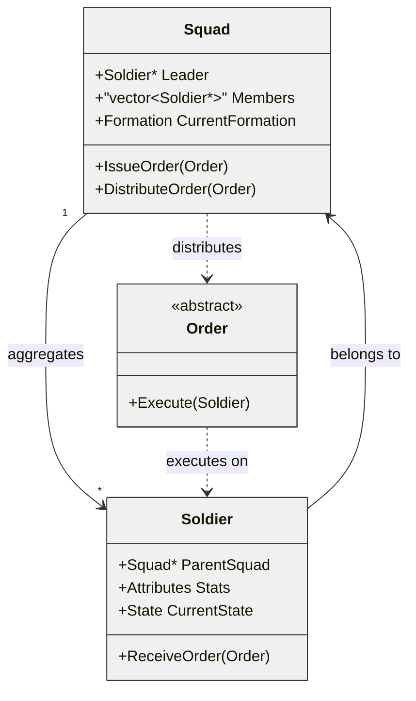
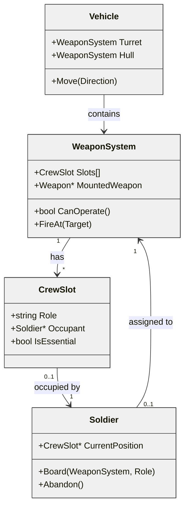
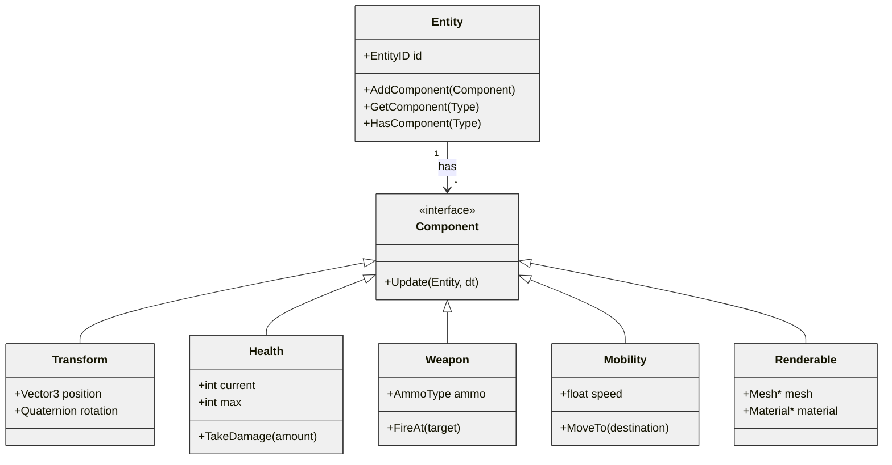
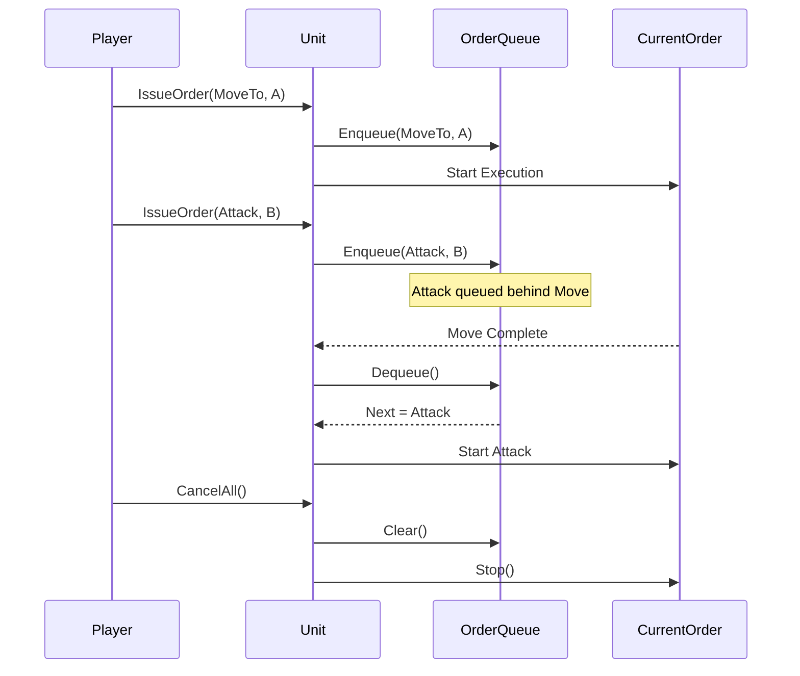
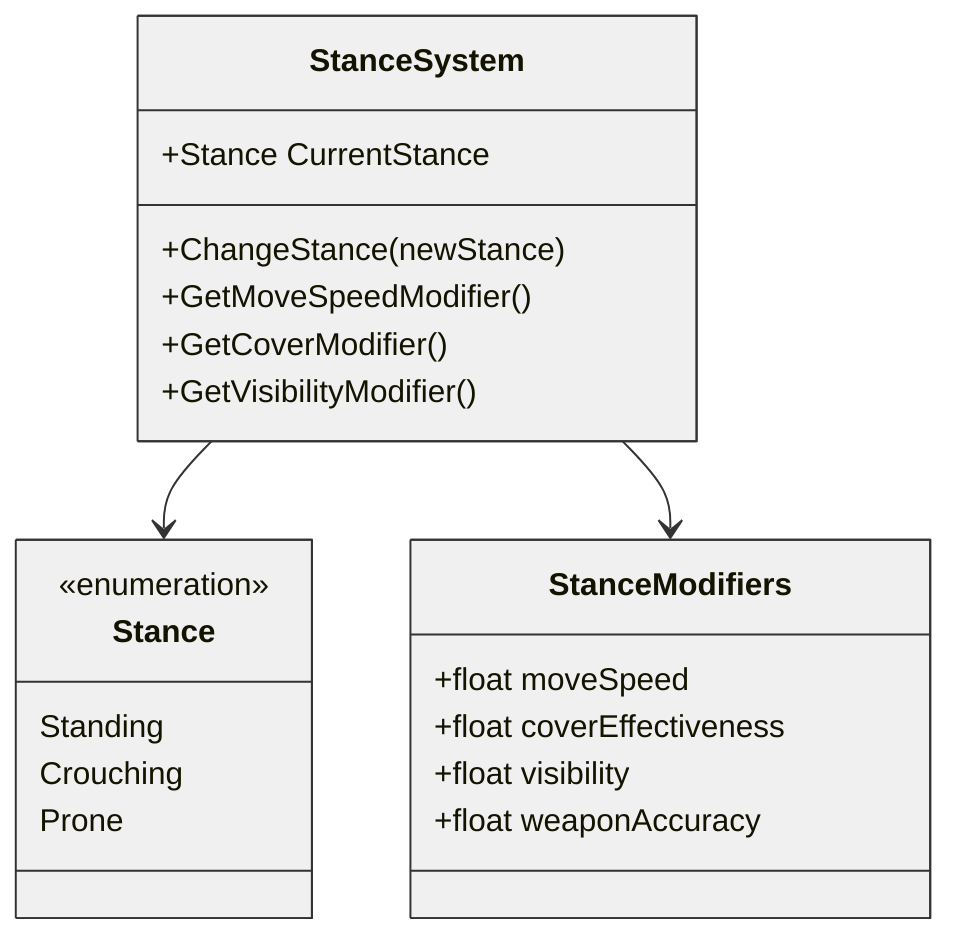
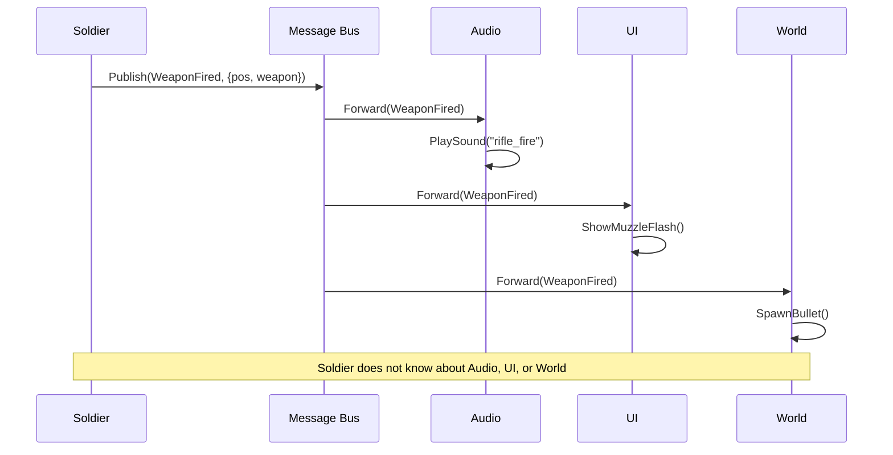

# Chapter 11: The Close Combat Pattern Language

## A Catalog of Universal Design Patterns for Tactical Wargames

---

*"A pattern names a recurring solution that has worked in different contexts."* — Adapted from Christopher Alexander

---

## 11.1 Introduction: Toward a Pattern Language

The previous ten chapters examined three Close Combat-inspired tactical wargames developed over two decades. Though each used different architectures, common patterns emerged from their solutions to the same problems.

This chapter organizes those patterns into a catalog following the *Design Patterns* tradition. Each entry includes:

- **Name and Intent**: The pattern's purpose
- **Problem**: Why the pattern matters
- **Solution**: How it works
- **Mermaid Diagram**: Visual representation
- **Variations**: How the three games implemented it
- **Consequences**: Design tradeoffs
- **Related Patterns**: Connections to other patterns

A **Decision Framework** at the end helps choose between variations based on project needs.

---

## 11.2 Pattern Catalog Overview

The patterns fall into five categories:

| Category            | Patterns                                                    | Purpose                          |
| ------------------- | ----------------------------------------------------------- | -------------------------------- |
| **Entity Patterns**     | Soldier/Squad Aggregate, Weapon Team, Component Composition | Unit structure and relationships |
| **State Patterns**      | State Hierarchy, Order Queue, Stance System, Morale Cascade | Unit behavior modeling           |
| **Command Patterns**    | Command Abstraction, Formation Control, Prerequisite Chain  | Player intent to action flow     |
| **Perception Patterns** | Line of Sight, Threat Assessment, Cover Evaluation          | Unit perception of the world     |
| **System Patterns**     | Spatial Partitioning, Message Bus, Deterministic Simulation | Infrastructure                   |

---

## 11.3 Entity Patterns

### Pattern 1: Soldier/Squad Aggregate Pattern

#### Intent
Model the relationship between soldiers and their squads, allowing both individual autonomy and coordinated group action.

#### Problem
Tactical wargames need control at multiple levels:
- Soldiers have unique attributes (health, ammo, morale)
- Squads must move and fight as units
- Orders to squads must distribute to members
- Squad effectiveness changes with member loss

Without aggregation, code becomes tangled with manual synchronization.

#### Solution



**Key Elements:**
1. **Bidirectional references**: Squads track members; soldiers track their squad
2. **Leader designation**: One member leads pathfinding
3. **Order distribution**: Squads adapt orders for members
4. **Formation positions**: Members calculate positions relative to leader

#### Variations

**OpenCombat-SDL**: Uses deep inheritance with `Squad : public Object`
- Squad inherits from Object base class
- Orders stored in `Object::_orders` queue
- `Squad::Simulate()` delegates to members
- Formation positions calculated in `HandleMoveOrder()`

**OpenCombat**: Uses index-based composition
```rust
struct Squad {
    leader: SoldierIndex,
    members: Vec<SoldierIndex>,
}
```
- Lightweight struct with indices
- Leader promotes dynamically when needed
- No inheritance overhead

**CloseCombatFree**: Uses QML parent-child hierarchy
```qml
Squad {
    Soldier { squad: parent; role: "leader" }
    Soldier { squad: parent; role: "rifleman" }
}
```
- Visual tree defines squad hierarchy
- Parent property establishes relationships automatically

#### Consequences

**Benefits:**
- Maps naturally to military hierarchy
- Squad commands simplify player control
- Formations enable tactical coordination
- Morale propagates through squad

**Tradeoffs:**
- Bidirectional references complicate memory management
- Formation calculations add overhead
- Leader death requires special handling

**When to Use:** Any game with group-based unit control

#### Related Patterns
- **Formation Control Pattern**: Squads use formations
- **Command Abstraction Pattern**: Orders flow through squads
- **State Hierarchy Pattern**: Squad state aggregates member states

---

### Pattern 2: Weapon Team Pattern

#### Intent
Model weapon systems requiring multiple crew members, where each position has distinct responsibilities and the weapon fails without essential crew.

#### Problem
Some military assets need crews:
- Tanks require driver, gunner, loader, commander
- Machine gun teams need gunner and ammo bearer
- Mortar squads need multiple soldiers

The game must handle:
- Crew positions with specific roles
- Weapon effectiveness based on crew skill
- Crew casualties affecting weapon capability
- Crew abandoning destroyed vehicles

#### Solution



**Key Elements:**
1. **Crew slots**: Defined positions with roles (driver, gunner, etc.)
2. **Essential flag**: Some positions required for operation
3. **Competence modifiers**: Crew skill affects weapon performance
4. **Abandon protocol**: Crew evacuates when system destroyed

#### Variations

**OpenCombat-SDL**: Vehicle class with crew array
```cpp
class Vehicle : public Object {
    struct CrewSlot {
        Soldier* CrewMember;
        Weapon* MountedWeapon;
    };
    std::vector<CrewSlot> CrewSlots;

    bool CanMove() { return HasCrewInRole("Driver"); }
    bool CanFire() { return HasCrewInRole("Gunner"); }
};
```

**OpenCombat**: Uses bidirectional boarding maps
```rust
struct BattleState {
    soldiers_on_board: HashMap<SoldierIndex, (VehicleIndex, OnBoardPlace)>,
    vehicle_board: HashMap<VehicleIndex, HashMap<OnBoardPlace, SoldierIndex>>,
}
```
- O(1) lookup: "What vehicle is this soldier in?"
- O(1) lookup: "Who is in this vehicle position?"

**CloseCombatFree**: Uses QML composition
```qml
Tank {
    Soldier { role: "Commander"; id: commander }
    Soldier { role: "Gunner"; id: gunner }
    Soldier { role: "Loader"; id: loader }
    Soldier { role: "Driver"; id: driver }

    function canFire() {
        return gunner !== null && loader !== null;
    }
}
```

#### Consequences

**Benefits:**
- Realistic crew modeling
- Tactical depth (kill driver to stop tank)
- Skill differentiation (veteran gunner improves accuracy)
- Natural damage model (crew casualties)

**Tradeoffs:**
- Complex state management
- Need for crew AI when vehicles are abandoned
- UI complexity showing crew positions

**When to Use:** Games with crewed vehicles or heavy weapons

#### Related Patterns
- **Component Composition Pattern**: Crew slots as components
- **State Hierarchy Pattern**: Crew states aggregate to vehicle state

---

### Pattern 3: Component Composition Pattern

#### Intent
Build complex entities by composing simple, reusable components instead of using deep inheritance.

#### Problem
Inheritance-based entity design creates problems:
- Multiple inheritance leads to the "diamond problem"
- Deep hierarchies become fragile
- Adding behaviors requires modifying base classes
- Novel combinations (flying tank) become difficult

#### Solution



**Key Elements:**
1. **Entity as container**: Just an ID with component list
2. **Components as data**: Pure data or data with behavior
3. **Composition over inheritance**: Mix and match components
4. **System processing**: Systems iterate over entities with specific components

#### Variations

**OpenCombat-SDL**: Limited composition via attributes
- Soldier has Weapon* array (max 3)
- Attributes struct for stats
- Mostly inheritance-based

**OpenCombat**: Modified ECS with embedded components
```rust
struct Soldier {
    transform: Transform,
    health: Health,
    weapon: Option<Weapon>,
    behavior: Behavior,
}
```
- Components as struct fields
- Type-safe at compile time
- Good cache locality

**CloseCombatFree**: Full QML composition
```qml
Unit {
    Transform { x: 100; y: 200 }
    Health { max: 100; current: 100 }
    Weapon { type: "Rifle" }
    Mobility { maxSpeed: 2.5 }
    Renderable { sprite: "soldier.png" }
}
```
- Visual and logic unified
- Declarative composition
- Runtime modifiable

#### Consequences

**Benefits:**
- Flexible entity creation
- No inheritance fragility
- Easy to add new capabilities
- Data-driven entity definitions

**Tradeoffs:**
- Component lookup overhead
- More complex architecture
- Debugging scattered across components

**When to Use:** Games with diverse entity types requiring flexible composition

#### Related Patterns
- **Soldier/Squad Aggregate Pattern**: Squad is entity with member components
- **Factory Pattern**: Create entities from component templates

---

## 11.4 State Patterns

### Pattern 4: State Hierarchy Pattern

#### Intent
Organize unit behavior into hierarchical states that handle different timescales, from strategic decisions to immediate physical actions.

#### Problem
Units operate on multiple timescales at once:
- **Strategic** (minutes): Overall mission, squad objectives
- **Tactical** (seconds): Current action (moving, defending, engaging)
- **Physical** (milliseconds): Animations, firing, reloading

Without clear separation, state management becomes tangled code full of scattered flags.

#### Solution

```mermaid
flowchart TB
    subgraph StateModel["Three-Tier State Model"]
        P[Phase State
        Game Level
        Minutes to Hours]
        B[Behavior State
        Tactical Level
        Seconds to Minutes]
        G[Gesture State
        Physical Level
        Milliseconds to Seconds]
    end

    P -->|Contains| B
    B -->|Executes via| G

    subgraph Example["Example: Attacking"]
        P1[Phase: Battle]
        B1[Behavior: EngageTarget
        Target: Enemy 3]
        G1[Gesture: Aiming
        Completion: Frame 245]
        G2[Gesture: Firing
        Completion: Frame 250]
    end

    P1 --> B1
    B1 --> G1
    G1 --> G2

    classDef default fill:#f0f0f0,stroke:#333,stroke-width:1px
    classDef subgraph fill:#d0d0d0,stroke:#333,stroke-width:1px
    class StateModel,Example subgraph
```

**Key Elements:**
1. **Phase**: Global game state (Deployment, Battle, End)
2. **Behavior**: Tactical decisions (MoveTo, Defend, Engage)
3. **Gesture**: Immediate actions (Idle, Aiming, Firing, Reloading)
4. **Temporal tracking**: Gestures track completion time

#### Variations

**OpenCombat-SDL**: Flat bitfield (partial implementation)
```cpp
class State {
    uint64_t bits;  // 64 orthogonal states
};
// Single tier - all states in bitfield
```
- No hierarchy
- Precedence requires manual management

**OpenCombat**: Full three-tier hierarchy
```rust
enum Phase { Placement, Battle, End }
enum Behavior { MoveTo(Path), Defend(Angle), EngageSoldier(SoldierIndex), ... }
enum Gesture { Idle, Reloading(u64), Aiming(u64), Firing(u64) }
```
- Clear separation of concerns
- Timescales align naturally
- Gesture completion tracking built in

**CloseCombatFree**: Dual-state system
```cpp
QString unitStatus;  // Runtime: MOVING, FIRING, etc.
// QML states handle visual representation
```
- Simpler model
- Single current status
- Less sophisticated but more approachable

#### Consequences

**Benefits:**
- Clear mental model
- Each tier updates at appropriate frequency
- Easy to answer "what is the unit doing?"
- Gesture completion enables precise timing

**Tradeoffs:**
- More complex than flat states
- Tiers must stay synchronized
- Code becomes more verbose

**When to Use:** Games with complex unit behavior across multiple timescales

#### Related Patterns
- **Command Abstraction Pattern**: Orders translate to behaviors
- **Prerequisite Chain Pattern**: Gestures chain automatically

---

### Pattern 5: Order Queue Pattern

#### Intent
Let units accept multiple commands in sequence, executing them one after another with automatic state transitions.

#### Problem
Players need to:
- Issue multiple commands without waiting for completion
- Plan unit actions in advance
- Chain commands (move here, then attack, then defend)
- Cancel or modify pending orders

Without a queue, units can only perform one action at a time.

#### Solution



    classDef default fill:#f0f0f0,stroke:#333,stroke-width:1px

**Key Elements:**
1. **FIFO queue**: Orders processed in sequence
2. **Current order pointer**: Active order being executed
3. **Enqueue operation**: Add order to back of queue
4. **Completion callback**: Trigger next order when current completes
5. **Clear operation**: Cancel all pending orders

#### Variations

**OpenCombat-SDL**: Two-tier queue (Orders + Actions)
```cpp
class Object {
    std::deque<Order*> _orders;      // High-level
    std::deque<Action*> _actionQueue; // Low-level
};
// Orders decompose into Actions
```

**OpenCombat**: Order with chaining
```rust
enum Order {
    MoveTo(WorldPaths, Option<Box<Order>>), // Next order chained
}
// Orders can reference next order directly
```

**CloseCombatFree**: Simple QObjectList
```cpp
QObjectList mOrders;  // Sequential execution
void continueQueue();  // Called on completion
```
- Animation-driven completion
- Very simple implementation

#### Consequences

**Benefits:**
- Enables planning and coordination
- Reduces micromanagement
- Fits real-time gameplay naturally
- Visual feedback shows queue

**Tradeoffs:**
- Requires queue management UI
- Orders can become stale (targets may die)
- Memory overhead for queue storage

**When to Use:** Real-time games where planning matters

#### Related Patterns
- **Command Pattern**: Orders are commands
- **State Hierarchy Pattern**: Orders map to behaviors

---

### Pattern 6: Stance System Pattern

#### Intent
Model how a unit's physical posture affects gameplay—movement speed, visibility, cover effectiveness, and weapon accuracy.

#### Problem
Combatants choose postures:
- **Standing**: Fast movement, good visibility, poor cover
- **Crouching**: Moderate movement, moderate cover
- **Prone**: Slow movement, excellent cover, hard to spot

The game must reflect these tradeoffs meaningfully.

#### Solution



**Key Elements:**
1. **Stance enumeration**: Clear postures (Standing, Crouching, Prone)
2. **Modifier table**: Each stance affects multiple systems
3. **Transition time**: Changing stance takes time
4. **Automatic selection**: AI can choose optimal stance

#### Variations

**OpenCombat-SDL**: Stance as state bit
```cpp
enum SoldierState {
    Standing = 0,
    Prone = 1,
    // ...
};
// Terrain cover varies by stance:
// <Cover Standing="0.1" Prone="0.5" />
```
- Stance affects cover calculation
- Separate from movement states

**OpenCombat**: Body enum in Behavior
```rust
enum Body {
    StandUp,
    Crouch,
    Prone,
}

// Visibility modifiers by stance:
// StandUp: 0.5 visibility
// Crouch: -0.3 visibility
// Prone: -0.9 visibility
```
- Stance heavily affects visibility
- Separate from movement

**CloseCombatFree**: Speed multipliers
```cpp
// Sneak order: 0.4x speed
// MoveFast: 1.5x speed
// Implicit stance from movement type
```
- Less explicit stance modeling
- Speed differences instead

#### Consequences

**Benefits:**
- Meaningful tactical choices
- Realistic combat dynamics
- Players must balance speed and safety
- Rich AI decision space

**Tradeoffs:**
- UI complexity (showing stance)
- AI must consider stance in planning
- Animation requirements

**When to Use:** Tactical games where positioning matters

#### Related Patterns
- **Cover Evaluation Pattern**: Stance affects cover
- **Visibility Pattern**: Stance affects being seen

---

### Pattern 7: Morale Cascade Pattern

#### Intent
Model psychological state and its spread through unit hierarchies, where nearby casualties and threats affect individual and group morale.

#### Problem
Combat psychology plays a crucial role:
- Soldiers panic under fire
- Squad casualties affect remaining members
- Leaders bolster nearby soldiers
- Panic can spread contagiously

Without morale, combat becomes too predictable and unrealistic.

#### Solution

```mermaid
flowchart TB
    subgraph MoraleSystem["Morale System"]
        IM[Individual Morale
        0-100 scale
        Affected by:]

        IM --> S[Suppression
        Nearby explosions
        Under fire]
        IM --> C[Casualties
        Squad members dying
        Leader killed]
        IM --> L[Leadership
        Officer presence
        Charisma]
        IM --> E[Experience
        Combat veteran
        Green recruit]
    end

    subgraph CascadeEffects["Cascade Effects"]
        SM[Squad Morale
        Aggregated from members]

        IM -.->|Influences| SM
        SM -.->|Affects| IM
    end

    subgraph BehavioralThresholds["Behavioral Thresholds"]
        T1[80+: Confident
        Normal operation]
        T2[50-80: Cautious
        Seek cover more]
        T3[20-50: Suppressed
        Reduced accuracy
        May refuse orders]
        T4[Under 20: Panic
        Flee or freeze
        AI takes over]
    end

    IM --> T1
    IM --> T2
    IM --> T3
    IM --> T4

    classDef default fill:#f0f0f0,stroke:#333,stroke-width:1px
    classDef subgraph fill:#d0d0d0,stroke:#333,stroke-width:1px
    class MoraleSystem,CascadeEffects,BehavioralThresholds subgraph
```

**Key Elements:**
1. **Individual morale**: 0-100 scale per soldier
2. **Modifiers**: Suppression, casualties, leadership, experience
3. **Squad aggregation**: Squad morale affects members
4. **Threshold behaviors**: Different AI at different morale levels
5. **Recovery**: Morale regenerates when not under threat

#### Variations

**OpenCombat-SDL**: 8-attribute system
```cpp
struct Attributes {
    Rating Aggressiveness;
    Rating Leadership;
    Rating Charisma;
    Rating Knowledge;
    Rating Experience;
    Rating Intelligence;
    Rating Morale;
    Rating Stamina;
};
// Complex interplay between attributes
```

**OpenCombat**: Simple feeling enum
```rust
enum Feeling {
    Calm,
    Alert,
    Danger,
    Panic,
}
// Under fire → Danger → affects behavior
```

**CloseCombatFree**: Status-based
```cpp
// BROKEN, BERSERK, etc.
// Triggered by casualties
// Less graduated than numeric morale
```

#### Consequences

**Benefits:**
- Realistic combat psychology
- Elite vs green troop differentiation
- Tactical suppression becomes viable
- Emergent behaviors (mass panic)

**Tradeoffs:**
- Complex tuning required
- Can frustrate players ("why won't they obey?")
- Needs clear UI feedback

**When to Use:** Realistic tactical games

#### Related Patterns
- **Threat Assessment Pattern**: Morale responds to threats
- **State Hierarchy Pattern**: Morale affects behavior selection

---

## 11.5 Command Patterns

### Pattern 8: Command Abstraction Pattern

#### Intent
Bridge the gap between player orders and unit actions by separating high-level intent from low-level execution.

#### Problem
Players issue tactical commands like "Move to that building," "Defend this position," or "Attack that enemy." Units, however, perform physical actions—standing up, walking, turning, aiming, firing, and reloading. The system must translate between these layers cleanly.

#### Solution

```mermaid
flowchart TB
    subgraph CommandAbstraction["Command Abstraction Layers"]
        P[Player Intent
        Take that hill!]
        O[Order
        Strategic Command
        - MoveTo(Position)
        - Defend(Angle)
        - Engage(Target)]
        B[Behavior
        Tactical Decision
        - FindPath
        - SelectCover
        - AimWeapon]
        A[Action
        Physical Execution
        - WalkTo(Tile)
        - RotateTo(Angle)
        - FireWeapon]
        G[Gesture
        Animation State
        - Idle
        - Aiming(Frame 130)
        - Firing(Frame 135)]
    end

    P -->|UI Translation| O
    O -->|AI Decomposition| B
    B -->|System Translation| A
    A -->|Animation| G

    classDef default fill:#f0f0f0,stroke:#333,stroke-width:1px
    classDef layer fill:#d0d0d0,stroke:#333,stroke-width:1px
    class CommandAbstraction layer
```

**Key Elements:**
1. **Orders**: High-level player commands
2. **Behaviors**: Tactical AI decisions
3. **Actions**: Low-level system commands
4. **Gestures**: Animation states
5. **Translation layers**: Convert between levels

#### Variations

**OpenCombat-SDL** simplifies this to two tiers (Orders → Actions):
```cpp
// Orders: MoveOrder, FireOrder, DefendOrder
// Actions: WalkTo, RunTo, Rotate, Fire
// Squad::HandleMoveOrder() handles translation
```

**OpenCombat** uses three tiers (Orders → Behaviors → Gestures):
```rust
// Order: MoveTo
// Behavior: MoveTo(WorldPaths)
// Gesture: Idle, Aiming, Firing with frame tracking
// Message passing maintains separation
```

**CloseCombatFree** takes a more direct approach:
```cpp
// Orders queued directly
// Each order triggers status change
// Status drives animation
```

#### Consequences

**Benefits:**
- Clear separation of concerns
- AI operates at the right level
- New order types are easy to add
- Player intent remains intact through the chain

**Tradeoffs:**
- Multiple layers require maintenance
- Debugging means tracing through layers
- Translation errors may occur

**When to Use:** Games with complex command hierarchies

#### Related Patterns
- **Order Queue Pattern**: Commands queued for execution
- **State Hierarchy Pattern**: Behaviors use state systems

---

### Pattern 9: Formation Control Pattern

#### Intent
Coordinate squad movement in geometric formations to reduce pathfinding overhead and enable tactical positioning.

#### Problem
Independent pathfinding for each squad member creates problems:
- High computational cost (N paths for N soldiers)
- Chaotic movement
- No tactical cohesion
- Units obstruct each other

#### Solution

```mermaid
flowchart TB
    subgraph FormationSystem["Formation System"]
        L[Leader/Point Man
        Does actual pathfinding]
        F[Formation Geometry
        - Column (travel)
        - Line (combat)
        - Wedge (assault)
        - File (stealth)]
        M[Member Positions
        Calculated from:
        - Formation type
        - Member index
        - Leader position
        - Heading]
    end

    L -->|Provides path| P[Path]
    F -->|Defines| M
    L -->|Provides| POS[Position/Heading]
    POS -->|Used by| M
    M -->|Results in| IND[Individual destinations
    for each member]

    classDef default fill:#f0f0f0,stroke:#333,stroke-width:1px
    classDef subgraph fill:#d0d0d0,stroke:#333,stroke-width:1px
    class FormationSystem subgraph
```

**Key Elements:**
1. **Point man**: A single unit handles pathfinding
2. **Formation geometry**: Relative positions defined per formation type
3. **Position calculation**: Members determine target positions based on formation
4. **Heading consideration**: Formation rotates with the leader's direction

#### Variations

**OpenCombat-SDL** implements a partial system:
```cpp
enum FormationType {
    Column,    // Travel
    Line,      // Combat
    File,      // Stealth
    Wedge,     // Assault
};
// Only horizontal line implemented
// Formation::GetFormationPosition() remains a stub
```

**OpenCombat** blends individual pathing with formation influence:
```rust
fn issue_squad_order(squad, order) {
    let formation_positions = calculate_formation(
        squad.formation,
        paths.destination(),
        squad.members.len()
    );

    for (i, member) in squad.members.iter().enumerate() {
        let individual_path = calculate_path(
            member.position,
            formation_positions[i]
        );
        member.order = MoveTo(individual_path);
    }
}
```

**CloseCombatFree** skips formations entirely:
- Direct movement only
- No formation system

#### Consequences

**Benefits:**
- Lower pathfinding cost
- Tactical positioning
- Visual cohesion
- Realistic military movement

**Tradeoffs:**
- Complex math for position calculation
- Difficult to implement correctly
- Formation changes mid-movement pose challenges

**When to Use:** Squad-based tactical games

#### Related Patterns
- **Soldier/Squad Aggregate Pattern**: Squads use formations
- **Pathfinding Pattern**: Point man handles pathfinding

---

### Pattern 10: Prerequisite Chain Pattern

#### Intent
Automatically insert required intermediate actions when a unit attempts something it cannot currently perform. This creates emergent behavior without explicit scripting.

#### Problem
Soldiers cannot fire while prone, reloading, or moving. Without automatic prerequisites, players must micromanage every state transition.

#### Solution

```mermaid
flowchart TB
    subgraph PrerequisiteExample["Prerequisite Chain Example"]
        A[Goal: Fire at Enemy]
        B{Can Fire?
        Check: Standing?
        Check: Reloaded?
        Check: Not Busy?}
        C[Insert: StandUp
        Duration: 500ms]
        D[Insert: Reload
        Duration: 3000ms]
        E[Execute: Fire
        Duration: 500ms]
        F[Result: Enemy hit]

        A --> B
        B -->|Not Standing| C
        B -->|Not Reloaded| D
        C --> E
        D --> E
        E --> F
    end

    subgraph ActionRequirements["Action Requirements"]
        R1[StandingFire requires:
        - Standing state
        - Reloaded state]
        R2[Run requires:
        - Standing state
        - Not encumbered]
        R3[Stop requires:
        - (none)
        Removes: Moving]
    end

    classDef default fill:#f0f0f0,stroke:#333,stroke-width:1px
    classDef subgraph fill:#d0d0d0,stroke:#333,stroke-width:1px
    class PrerequisiteExample,ActionRequirements subgraph
```

**Key Elements:**
1. **Action requirements**: Each action specifies prerequisites
2. **Automatic discovery**: The system finds actions that set required states
3. **Chain insertion**: Prerequisites are prepended to the queue
4. **Emergent behavior**: Complex sequences emerge from simple rules

#### Variations

**OpenCombat-SDL** implements a full prerequisite system:
```cpp
// SoldierActions.txt format:
// Name, Group, Time, Requirements, Adds, Subtracts
StandingFire, Combat, 400, "Standing Reloaded", "Firing", "Reloaded"
LieDown, Stance, 500, "Standing", "Prone", "Standing"

void Soldier::AddAction(Action* action) {
    int prereq = CheckRequirements(action->Index, &_currentState);
    while (prereq != -1) {
        Action* prereqAction = new Action(prereq);
        _actionQueue.push_front(prereqAction);
        prereq = CheckRequirements(prereq, &_currentState);
    }
    _actionQueue.push_back(action);
}
```

**OpenCombat** tracks gesture timing:
```rust
// Gesture completion tracked
Gesture::Aiming(end_frame, weapon)
// Cannot fire until frame >= end_frame
// System waits automatically
```

**CloseCombatFree** uses status-driven logic:
```cpp
// setUnitStatus("AIMING")
// Animation completes
// onRunningChanged() continues queue
```

#### Consequences

**Benefits:**
- Intelligent unit behavior
- Less player micromanagement
- Emergent complexity from simple rules
- Natural state transitions

**Tradeoffs:**
- Debugging can be difficult
- Infinite loops possible (circular prerequisites)
- Players may not understand unit actions

**When to Use:** Games with complex state machines

#### Related Patterns
- **State Hierarchy Pattern**: Prerequisites check states
- **Order Queue Pattern**: Prerequisites inserted into queue

---

## 11.6 Perception Patterns

### Pattern 11: Line of Sight Pattern

#### Intent
Determine whether one entity can see another, accounting for terrain elevation, obstacles, and visibility modifiers.

#### Problem
Tactical games need accurate visibility calculations to answer:
- Can Soldier A see Soldier B?
- What cover is available?
- Where are the blind spots?
- How does elevation change what units can see?

#### Solution

```mermaid
flowchart TB
    subgraph LOSSystem["Line of Sight System"]
        Q[Query: Can A see B?]

        Q --> D[Distance Check
        Too far = invisible]
        D -->|Pass| R[Raycast/Bresenham
        Sample points between A and B]
        R --> T[Terrain Check
        Elevation differences
        Obstacles]
        T -->|Pass| M[Modifiers
        - Stance (prone = harder to spot)
        - Movement (moving = easier to spot)
        - Smoke/Effects]
        M -->|Pass| V[Visible!]
    end

    subgraph AccumulatedOpacity["Accumulated Opacity"]
        A[Start: 0.0 opacity]
        B[Sample terrain
        Each point adds opacity]
        C{Accumulated >= 0.5?}
        D2[Blocked!]
        E[Continue to next point]
        F[End: Visible!]

        A --> B
        B --> C
        C -->|Yes| D2
        C -->|No| E
        E --> B
        B -->|End reached| F
    end

    classDef default fill:#f0f0f0,stroke:#333,stroke-width:1px
    classDef subgraph fill:#d0d0d0,stroke:#333,stroke-width:1px
    class LOSSystem,AccumulatedOpacity subgraph
```

**Key Elements:**
1. **Ray sampling**: Bresenham line algorithm
2. **Terrain checks**: Elevation and obstacles
3. **Opacity accumulation**: Gradual blocking
4. **Modifier application**: Stance, movement, effects
5. **Threshold**: Binary visible/hidden decision

#### Variations

**OpenCombat-SDL**: 3D Bresenham
```cpp
bool LineOfSight::IsVisible(Point from, Point to, World* world) {
    std::vector<Point> line = Bresenham3D(from, to);
    for (const Point& p : line) {
        if (world->GetElevation(p) - from.z > threshold)
            return false;
        if (world->GetElement(p)->BlocksVision())
            return false;
    }
    return true;
}
```

**OpenCombat**: Accumulated opacity
```rust
fn calculate_visibility(from, to, map) -> Visibility {
    let mut accumulated_opacity = 0.0;
    for point in bresenham_line(from, to) {
        if distance(from, point) <= 6.0 { continue; } // Near exemption
        accumulated_opacity += map.terrain_at(point).opacity;
        if accumulated_opacity >= 0.5 {
            return Visibility::Hidden;
        }
    }
    Visibility::Visible
}
```

**CloseCombatFree**: Dual check
```cpp
bool isVisible(Point from, Point to) {
    return checkElevationLOS(from, to) && checkObstacleLOS(from, to);
}
```

#### Consequences

Visibility systems create realistic tactical play but come with tradeoffs.

**Benefits:**
- Elevation becomes tactically important
- Cover systems integrate naturally
- Fog of war emerges from the mechanics

**Tradeoffs:**
- Computationally expensive
- Needs optimization through caching and spatial partitioning
- Edge cases require careful handling

**When to Use:** Any tactical game where concealment matters

#### Related Patterns
- **Spatial Partitioning Pattern**: Optimizes LOS queries
- **Threat Assessment Pattern**: Uses LOS for threat detection

---

### Pattern 12: Threat Assessment Pattern

#### Intent
Give units the ability to detect and respond to threats autonomously, allowing them to make smart decisions about engagement, cover-seeking, and suppression.

#### Problem
Without autonomous threat response:
- Units wait passively for orders
- Behavior feels unrealistic
- Players must micromanage every action
- Units stand still under fire, frustrating players

#### Solution

```mermaid
flowchart TB
    subgraph ThreatLoop["Threat Assessment Loop"]
        S[Scan for threats
        Regular interval]

        S --> V1[Visible Enemies
        Within weapon range
        In line of sight]
        S --> V2[Incoming Fire
        Recently fired upon
        Explosions nearby]
        S --> V3[Casualties
        Squad members down
        Friendly fire]

        V1 --> D1{Decision}
        V2 --> D1
        V3 --> D1

        D1 -->|Enemy spotted| E1[Engage
        If weapon range
        If ammunition]
        D1 -->|Under fire| E2[Seek Cover
        Move to nearest cover
        Change stance to prone]
        D1 -->|Suppressed| E3[Hunker Down
        Reduced accuracy
        Cannot advance]
        D1 -->|None| E4[Continue Order
        Player intent preserved]
    end

    classDef default fill:#f0f0f0,stroke:#333,stroke-width:1px
    classDef subgraph fill:#d0d0d0,stroke:#333,stroke-width:1px
    class ThreatLoop subgraph
```

**Key Elements:**
1. **Threat detection**: Visible enemies, incoming fire, explosions
2. **Priority system**: Survival comes before combat, which comes before orders
3. **Response behaviors**: Engage, take cover, suppress, retreat
4. **Override rules**: When AI can ignore player orders

#### Variations

**OpenCombat-SDL**: No AI
```cpp
// Units wait for orders
// No autonomous behavior
// Pure player control
```

**OpenCombat**: Reactive AI
```rust
fn evaluate_threats(soldier, world) -> Option<Behavior> {
    if let Some(enemy) = find_visible_enemy(soldier, world) {
        return Some(Behavior::EngageSoldier(enemy));
    }
    if soldier.under_fire == Feeling::Danger {
        if let Some(cover) = find_nearest_cover(soldier, world) {
            return Some(Behavior::Hide(cover.direction));
        }
    }
    None
}
```

**CloseCombatFree**: State-based triggers
```cpp
// DEFENDING: Fire at enemies in range
// AMBUSHING: Fire when enemy enters radius
// No complex decision making
```

#### Consequences

Autonomous threat response creates more realistic combat but introduces new challenges.

**Benefits:**
- Reduces micromanagement
- Creates emergent tactics
- Gives units self-preservation instincts

**Tradeoffs:**
- May frustrate players when units move unexpectedly
- Requires careful tuning
- Edge cases become complex

**When to Use:** Games where AI autonomy improves gameplay

#### Related Patterns
- **Line of Sight Pattern**: Detects visible threats
- **Cover Evaluation Pattern**: Finds cover when threatened
- **Morale Cascade Pattern**: Affects how units respond to threats

---

### Pattern 13: Cover Evaluation Pattern

#### Intent
Help units identify, evaluate, and use terrain features that reduce incoming damage.

#### Problem
Tactical combat depends on cover:
- Buildings offer complete protection
- Walls provide partial protection
- Elevation creates advantages
- Units must choose optimal positions

#### Solution

```mermaid
flowchart TB
    subgraph CoverSystem["Cover System"]
        Q[Need Cover
        Under fire or moving]

        Q --> S[Scan for cover
        In radius
        Accessible]

        S --> E[Evaluate each:
        - Protection value
        - Distance
        - Path safety
        - Visibility to enemy]

        E --> R[Rank options
        Score = protection / distance
        Penalty for exposure]

        R --> M[Move to best cover
        Or stay if current is good]
    end

    subgraph CoverTypes["Cover Types"]
        C1[Hard Cover
        Buildings, walls
        Blocks fire completely
        Protection: 100%]

        C2[Soft Cover
        Trees, bushes
        Partial protection
        Protection: 25-75%]

        C3[Concealment
        Tall grass
        Harder to spot
        Protection: 0-10%]

        C4[Elevation
        Hills, rooftops
        Better visibility
        Protection: Variable]
    end

    classDef default fill:#f0f0f0,stroke:#333,stroke-width:1px
    classDef subgraph fill:#d0d0d0,stroke:#333,stroke-width:1px
    class CoverSystem,CoverTypes subgraph
```

**Key Elements:**
1. **Cover scan**: Query terrain for protective features
2. **Protection values**: Quantified protection per cover type
3. **Evaluation function**: Score based on protection, distance, exposure
4. **Stance modifiers**: Prone units get more benefit from low cover

#### Variations

**OpenCombat-SDL**: Stance-based cover
```xml
<Element>
    <Name>Stone Wall</Name>
    <Cover Standing="0.8" Prone="0.9" />
</Element>
```

**OpenCombat**: Cover + opacity
```rust
struct TerrainType {
    cover: f32,      // Protection value
    opacity: f32,    // Vision blocking
}
```

**CloseCombatFree**: Category-based
```qml
Prop {
    cover: "great"  // none, poor, average, great
}
```

#### Consequences

Cover systems make terrain matter but add complexity.

**Benefits:**
- Creates meaningful tactical choices
- Makes terrain strategically important
- Enables realistic combat flow
- Allows AI to play competently

**Tradeoffs:**
- Adds computational overhead
- Requires thoughtful level design
- Can create stalemates

**When to Use:** All tactical games

#### Related Patterns
- **Line of Sight Pattern**: Cover blocks LOS
- **Threat Assessment Pattern**: Units seek cover when threatened
- **Stance System Pattern**: Stance affects cover effectiveness

---

## 11.7 System Patterns

### Pattern 14: Spatial Partitioning Pattern

#### Intent
Organize game entities efficiently to speed up spatial queries like finding nearby units, checking line of sight, or detecting tile occupancy.

#### Problem
Brute-force O(N) queries become impractical. Checking every entity for "enemies within 100 meters" or "units on this tile" leads to O(N²) complexity. With 500 units, that means 250,000 checks per frame.

#### Solution

```mermaid
flowchart TB
    subgraph SpatialPartitioning["Spatial Partitioning"]
        G[Grid/Tile Approach
        Uniform cells
        O(1) insertion
        O(cells_in_radius) query]

        H[Hash Approach
        Spatial hash
        Buckets by location
        Good for sparse worlds]

        Q[Quadtree
        Hierarchical
        Variable density
        Good for uneven distribution]
    end

    subgraph TileImplementation["Tile-Based Implementation"]
        W[World Grid
        10x10 pixel tiles]

        L[Linked Lists
        Per-tile entity lists
        Head pointer in array]

        I[Insertion
        O(1) to tile list]

        Q2[Query
        Check radius tiles
        Traverse lists]

        W --> L
        L --> I
        L --> Q2
    end

    classDef default fill:#f0f0f0,stroke:#333,stroke-width:1px
    classDef subgraph fill:#d0d0d0,stroke:#333,stroke-width:1px
    class SpatialPartitioning,TileImplementation subgraph
```

**Key Elements:**
1. **World subdivision**: Divide space into cells or tiles
2. **Entity registration**: Track which cell each entity occupies
3. **Movement update**: Re-register entities when they change cells
4. **Radius queries**: Check only cells within the target radius

#### Variations

**OpenCombat-SDL**: Uses linked lists per tile
```cpp
class World {
    std::vector<Object*> _tileObjects;  // Head pointer per tile

    void AddObject(Object* obj, int tileX, int tileY) {
        obj->NextObject = _tileObjects[tileIndex];
        if (obj->NextObject) obj->NextObject->PrevObject = obj;
        _tileObjects[tileIndex] = obj;
    }
};
```

**OpenCombat**: Implements grid-based terrain
```rust
struct Map {
    terrain: Vec<Vec<TerrainIndex>>,  // 2D grid
}
// Entity positions tracked separately
// Queries use spatial index
```

**CloseCombatFree**: Relies on QML parent-child relationships
```qml
// Visual tree provides spatial organization
// Less optimized for queries
```

#### Consequences

**Benefits:**
- Fast spatial queries
- Scales well to large worlds
- Critical for AI and combat systems

**Tradeoffs:**
- Memory overhead for spatial structures
- Movement requires re-registration
- Edge cases when entities span multiple cells

Use this pattern in any game requiring spatial queries.

#### Related Patterns
- **Line of Sight Pattern**: Builds on spatial partitioning for sampling
- **Threat Assessment Pattern**: Uses spatial queries to detect threats

---

### Pattern 15: Message Bus Pattern

#### Intent
Decouple game systems through a centralized message queue, letting components react to events without direct dependencies.

#### Problem
Direct method calls create tight coupling:
```cpp
// Tight coupling examples:
world->SpawnBullet(from, to);
soldier->GetHealth();
```

Changes in one system ripple through the codebase.

#### Solution



**Key Elements:**
1. **Message types**: Enumerated event types
2. **Bus/queue**: Central message router
3. **Publishers**: Send messages without knowing recipients
4. **Subscribers**: Register interest in specific message types
5. **Delivery**: Bus routes messages to subscribers

#### Variations

**OpenCombat-SDL**: Uses direct method calls
- Tight coupling
- Simple but inflexible

**OpenCombat**: Implements a full message system
```rust
enum BattleStateMessage {
    Soldier(SoldierIndex, SoldierMessage),
    SetPhase(Phase),
    PushBulletFire(BulletFire),
}

// All state changes via messages
// Enables replay and networking
```

**CloseCombatFree**: Uses Qt signals and slots
```cpp
// Qt's built-in message system
signals:
    void unitStatusChanged(QString status);
    void actionFinished(int unit, qreal x, qreal y);
```

#### Consequences

**Benefits:**
- Decoupled systems
- Easy to add new features
- Enables replay by re-sending messages
- Simplifies network synchronization

**Tradeoffs:**
- Debugging becomes harder with indirect flow
- Message overhead
- System order dependencies

Use this pattern in complex games with many interacting systems.

#### Related Patterns
- **Command Pattern**: Messages often represent commands
- **Event Sourcing Pattern**: Log messages for replay

---

### Pattern 16: Deterministic Simulation Pattern

#### Intent
Guarantee identical simulation results from the same initial state and inputs. This is essential for multiplayer synchronization and replay recording.

#### Problem
Floating-point operations, randomness, and timing variations make games non-deterministic:
```cpp
// Non-deterministic examples:
float damage = baseDamage * random();  // Random values differ
soldier.position += velocity * dt;     // Floating-point precision varies
```

All clients in a multiplayer game must see exactly the same game state.

#### Solution

```mermaid
flowchart TB
    subgraph DeterministicSim["Deterministic Simulation"]
        I[Initial State
        Same for all clients]

        C[Consistent Inputs
        All clients receive:
        - Player commands
        - Random seeds
        - At same simulation frame]

        F[Fixed Timestep
        Deterministic dt
        Never use real time]

        R[Reproducible Random
        Seeded RNG
        Same sequence on all clients]

        S[Simulation Step
        State' = f(State, Inputs)
        No external dependencies]

        V[Verification
        Hash game state
        Compare across clients]
    end

    I --> F
    C --> S
    F --> S
    R --> S
    S --> V

    classDef default fill:#f0f0f0,stroke:#333,stroke-width:1px
    classDef subgraph fill:#d0d0d0,stroke:#333,stroke-width:1px
    class DeterministicSim subgraph
```

**Key Elements:**
1. **Fixed timestep**: Use consistent delta time
2. **Seeded RNG**: Generate reproducible randomness
3. **No floating-point accumulation**: Or use consistent rounding
4. **Input synchronization**: All clients process the same inputs
5. **State verification**: Hash game state to detect desyncs

#### Variations

**OpenCombat-SDL**: Not deterministic
- Uses real time
- No multiplayer support

**OpenCombat**: Fully deterministic
```rust
// Fixed timestep
const DT: f32 = 1.0 / 60.0;

// Seeded RNG
let mut rng = SeededRng::new(seed);

// All state changes via messages
// Can replay by reprocessing messages
```

**CloseCombatFree**: Not applicable
- Single-player only
- Uses animation-driven timing

#### Consequences

**Benefits:**
- Multiplayer synchronization
- Replay recording
- Debugging by replaying
- Verification and testing

**Tradeoffs:**
- Complex implementation
- Input latency in multiplayer
- Cannot use real-time features

Use this pattern for multiplayer games or when replay features are needed.

#### Related Patterns
- **Message Bus Pattern**: Messages enable determinism
- **Command Pattern**: Commands can be logged for replay

---

### Pattern 17: Hot Reload Pattern

#### Intent
Modify game data and scripts at runtime without restarting. This dramatically improves iteration speed for developers and modders.

#### Problem
The traditional development cycle slows progress:
1. Edit file
2. Recompile (minutes)
3. Restart game
4. Navigate to test scenario
5. Test change

This kills iteration speed and creative flow.

#### Solution

```mermaid
flowchart TB
    subgraph HotReloadSystem["Hot Reload System"]
        W[File Watcher
        Monitor directories
        Detect changes]

        V[Validation
        Parse new file
        Check for errors
        Schema validation]

        H[Hot Apply
        Update game state
        Refresh entities
        Preserve running state]

        F[Fallback
        On error:
        - Log issue
        - Keep old version
        - Notify user]
    end

    subgraph ExampleWeaponStats["Example: Weapon Stats"]
        E1[Edit weapons.json
        Save file]
        E2[File watcher detects]
        E3[Validate JSON]
        E4[Update WeaponManager]
        E5[Existing weapons updated]
        E6[See changes immediately]

        E1 --> E2 --> E3 --> E4 --> E5 --> E6
    end

    classDef default fill:#f0f0f0,stroke:#333,stroke-width:1px
    classDef subgraph fill:#d0d0d0,stroke:#333,stroke-width:1px
    class HotReloadSystem,ExampleWeaponStats subgraph
```

**Key Elements:**
1. **File watching**: Detect file changes at the OS level
2. **Validation**: Check files before applying changes
3. **Hot apply**: Update game state gracefully
4. **Error handling**: Fail gracefully on bad files

#### Variations

**OpenCombat-SDL**: No hot reload
- Requires restart
- XML parsed only at startup

**OpenCombat**: Supports runtime config changes
```rust
// Some config values can change
ChangeConfigMessage::VisibilityModifier(new_value)
// But not full hot reload
```

**CloseCombatFree**: Full hot reload support
```cpp
// QML supports hot reload naturally
void reloadScenario(const QString& file) {
    QQmlComponent component(&engine, file);
    QObject* scenario = component.create();
    // Replace current scenario
}
```

#### Consequences

**Benefits:**
- Rapid iteration
- Better modding support
- Immediate feedback
- Improved development velocity

**Tradeoffs:**
- Complex implementation
- State consistency challenges
- Not suitable for all types of changes

Use this pattern in any game with significant data or scripting.

#### Related Patterns
- **Component Composition Pattern**: Makes it easier to swap components
- **Data-Driven Design Pattern**: Enables hot reload

---

## 11.8 Decision Framework

### Choosing Pattern Variations

Close Combat clones show how patterns can take different forms. This framework helps you pick the right variation for your project.

#### Simulation Depth vs. Moddability

| Your Priority       | Choose                   | Example                              |
| ------------------- | ------------------------ | ------------------------------------ |
| **Deep Simulation**     | OpenCombat-SDL approach  | Bitfield states, hardcoded behaviors |
| **Balance**             | OpenCombat approach      | Deterministic simulation, JSON data  |
| **Maximum Moddability** | CloseCombatFree approach | QML content, full scripting          |

Ask yourself: Can you recompile quickly? If yes, deeper simulation works. If not, prioritize moddability.

#### Single-Player vs. Multiplayer Determinism

| Requirement         | Pattern Choice                        |
| ------------------- | ------------------------------------- |
| **Single-player only**  | Any approach works                    |
| **Local multiplayer**   | Deterministic simulation recommended  |
| **Network multiplayer** | Deterministic simulation required     |
| **Replay recording**    | Message bus with determinism required |

Determine whether all players need identical game states. If they do, implement deterministic simulation from the start.

#### Procedural vs. Designer-Authored Content

| Content Approach  | Architecture                            |
| ----------------- | --------------------------------------- |
| **Fully procedural**  | Seed-based generation, no content files |
| **Mixed**             | JSON/YAML data with procedural elements |
| **Designer-authored** | Full data-driven, hot reload            |
| **Community modded**  | Scripting support (Lua), mod manager    |

Consider who creates content. Developers only? Keep it simple. Community involvement? Build full modding support.

#### Runtime Flexibility vs. Performance

| Performance Need       | Pattern Selection                      |
| ---------------------- | -------------------------------------- |
| **Maximum performance**    | C++17/20, custom allocators, DOD       |
| **Good performance**       | Modified ECS, spatial hashing          |
| **Acceptable performance** | Scripting for logic, C++ for hot paths |
| **Modding > Performance**  | QML/Lua, hot reload                    |

Match your approach to your target platform and entity count. Mobile or low-end hardware needs performance. Desktop or high-end systems can handle more flexibility.

### Recommended Combinations

#### For a New Close Combat Clone (2026+)

Analysis of all three projects suggests this approach:

**Core Architecture**:
- **Language**: C++20 or Rust
- **Entity System**: Modified ECS (OpenCombat style)
- **State Management**: Three-tier hierarchy
- **Commands**: Order queue with prerequisite chaining
- **Perception**: Opacity-based LOS
- **AI**: Reactive with behavior trees
- **Multiplayer**: Deterministic lockstep

**Modding Support**:
- **Data**: JSON/YAML for definitions
- **Scripts**: Lua for behaviors and AI
- **Hot Reload**: File watcher for rapid iteration
- **Format**: Standard mod structure with dependencies

**Performance**:
- **Spatial**: Grid-based partitioning
- **Pathfinding**: A* with directional costs
- **Object Pool**: For bullets and effects

This hybrid approach combines the best elements: OpenCombat-SDL's simulation depth, OpenCombat's modern architecture, and CloseCombatFree's moddability.

## 11.9 Pattern Relationships

### Pattern Dependency Graph

```mermaid
flowchart TB
    subgraph EntityPatterns["Entity Patterns"]
        P1[Soldier/Squad Aggregate]
        P2[Weapon Team]
        P3[Component Composition]
    end

    subgraph StatePatterns["State Patterns"]
        P4[State Hierarchy]
        P5[Order Queue]
        P6[Stance System]
        P7[Morale Cascade]
    end

    subgraph CommandPatterns["Command Patterns"]
        P8[Command Abstraction]
        P9[Formation Control]
        P10[Prerequisite Chain]
    end

    subgraph PerceptionPatterns["Perception Patterns"]
        P11[Line of Sight]
        P12[Threat Assessment]
        P13[Cover Evaluation]
    end

    subgraph SystemPatterns["System Patterns"]
        P14[Spatial Partitioning]
        P15[Message Bus]
        P16[Deterministic Simulation]
        P17[Hot Reload]
    end

    P1 --> P9
    P4 --> P8
    P4 --> P10
    P5 --> P8
    P5 --> P10
    P8 --> P10
    P9 --> P1
    P11 --> P12
    P11 --> P13
    P12 --> P7
    P13 --> P12
    P14 --> P11
    P14 --> P12
    P15 --> P8
    P16 --> P15
    P3 --> P17

    classDef default fill:#f0f0f0,stroke:#333,stroke-width:1px
    classDef subgraph fill:#d0d0d0,stroke:#333,stroke-width:1px
    class EntityPatterns,StatePatterns,CommandPatterns,PerceptionPatterns,SystemPatterns subgraph
```

### Pattern Combinations That Work Well

1. **Three-Tier State + Command Abstraction + Order Queue**
   - Creates a natural hierarchy of intent
   - Maintains clean separation of concerns
   - Example: OpenCombat

2. **Spatial Partitioning + Line of Sight + Threat Assessment**
   - Enables efficient threat detection
   - Produces realistic perception
   - Example: All three games

3. **Soldier/Squad Aggregate + Formation Control + State Hierarchy**
   - Supports coordinated group behavior
   - Reflects natural military structure
   - Example: OpenCombat-SDL, OpenCombat

4. **Component Composition + Hot Reload + Scripting**
   - Maximizes moddability
   - Allows rapid iteration
   - Example: CloseCombatFree

5. **Message Bus + Deterministic Simulation + Command Pattern**
   - Enables replay and multiplayer
   - Maintains clean architecture
   - Example: OpenCombat

## 11.10 Conclusion: Patterns as Vocabulary

The patterns in this chapter create a shared language for discussing tactical wargame architecture. When you describe using a "Three-Tier State Hierarchy with Order Queues," other developers immediately grasp the structural implications.

The three Close Combat clones reveal important lessons:

1. **No universal solutions exist**—each project adapted implementations to their constraints and goals.

2. **Patterns combine effectively**—the strongest architectures blend multiple patterns, like OpenCombat's message-driven state updates with deterministic simulation.

3. **Tradeoffs matter**—CloseCombatFree prioritized moddability over performance; OpenCombat chose determinism over simplicity. Both made valid choices based on their priorities.

4. **Patterns emerge from practice**—these weren't invented for these games. Developers discovered them while solving real problems.

### For Future Implementers

Use this pattern language to:
- Communicate with your team using shared terminology
- Evaluate architectural decisions against proven solutions
- Anticipate problems before they occur
- Document your architecture in terms others understand

These patterns aren't rigid rules but observations of what works. Adapt them to your context, combine them creatively, and develop new patterns as you go.

The Close Combat series set a high standard for tactical wargaming. These patterns provide the foundation to meet—and surpass—that standard in your own work.

---

*Next: [Chapter 12: Implementation Guide](chapter_12_implementation_guide.md)*
