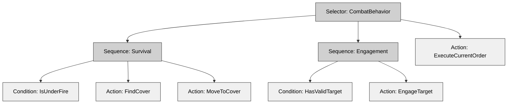

# Chapter 12: Implementation Guide

## A Practical Blueprint for Building a Close Combat Clone Today

---

*"Most projects fail in the space between theory and working code. This chapter provides concrete, actionable steps to cross that gap."*

---

## 12.1 Architecture Decision Record (ADR)

### 12.1.1 Why Architectural Decisions Matter

Every major choice in a tactical wargame's architecture influences the project for years. The three implementations studied in this book each made distinct decisions about state management, entity composition, and command abstraction. These choices determined which features came easily and which became impossible obstacles.

An Architecture Decision Record documents both the decision and its rationale. It gives future developers context and prevents endless debates about settled questions. For projects lasting multiple years, ADRs preserve institutional knowledge through team changes.

### 12.1.2 ADR Template

Document each architectural decision with this template:

```
# ADR-XXX: [Title]

**Status**: Proposed / Accepted / Deprecated / Superseded by ADR-YYY
**Date**: YYYY-MM-DD
**Deciders**: [Names of people involved in decision]
**Context**: [What problem prompted this decision?]

## Decision

[The decision that was made]

## Consequences

### Positive
- [Benefit 1]
- [Benefit 2]

### Negative
- [Trade-off 1]
- [Trade-off 2]

## Alternatives Considered

### [Alternative 1]
- Pros: ...
- Cons: ...
- Why rejected: ...

## Related Decisions
- ADR-ABC: [Related decision]
- ADR-DEF: [Another related decision]
```

### 12.1.3 Example ADR: State Management Strategy

```
# ADR-003: Three-Tier State Hierarchy with Capability Bitfield

**Status**: Accepted
**Date**: 2024-03-15
**Deciders**: Lead Architect, Gameplay Director, Lead Programmer

## Context

The game must model unit behavior across different timescales:
- Strategic decisions (minutes): Squad objectives, orders
- Tactical actions (seconds): Movement, engagement, defense
- Physical gestures (milliseconds): Aiming, firing, reloading

Previous projects tried three approaches:
1. Bitfield system (OpenCombat-SDL): Fast but lacked hierarchy
2. Dual-state strings (CloseCombatFree): Flexible but unsafe
3. Three-tier hierarchy (OpenCombat): Clean separation, deterministic

## Decision

We chose a hybrid approach:

1. **Three-Tier Hierarchy** for behavioral states:
   - Phase: Game-level state (Deployment, Battle, End)
   - Behavior: Tactical state (MoveTo, Engage, Defend)
   - Gesture: Physical action (Aiming, Firing, Reloading)

2. **64-bit Capability Bitfield** for orthogonal capabilities:
   - CanMove, CanFire, IsProne, IsSuppressed, etc.

3. **Message-driven state changes** for determinism

## Consequences

### Positive
- Clear separation of concerns by timescale
- Deterministic simulation enables multiplayer and replays
- Capability queries execute in constant time via bit operations
- Type-safe enums prevent invalid states

### Negative
- More complex than single state systems
- All three tiers require synchronization
- Steeper learning curve for new developers

## Alternatives Considered

### Pure Bitfield System
- Pros: Fast, simple, supports 64 states
- Cons: No hierarchy, difficult to query current activity
- Why rejected: Couldn't handle complex AI behaviors

### Pure String-Based States
- Pros: Maximum moddability, human-readable
- Cons: No compile-time validation, error-prone
- Why rejected: Type safety essential for multiplayer

## Related Decisions
- ADR-001: Server-authoritative architecture
- ADR-007: Message-driven state updates
```

### 12.1.4 Example ADR: Entity Composition Model

```
# ADR-008: Modified ECS with Type-Safe Indices

**Status**: Accepted
**Date**: 2024-04-02
**Deciders**: Technical Lead, Performance Engineer

## Context

Entity systems vary from deep inheritance (traditional OOP) to pure ECS (data-oriented). Our requirements:
- Cache efficiency for 500+ units
- Type safety to prevent entity reference bugs
- Flexibility for complex unit types (soldiers, vehicles, squads)

## Decision

We implemented a modified ECS:

1. **Contiguous storage**: `Vec<Soldier>`, `Vec<Vehicle>` in BattleState
2. **Type-safe indices**: `SoldierIndex(usize)`, `VehicleIndex(usize)`
3. **Components as struct fields**: Not separate sparse arrays
4. **Systems as functions**: Pure functions over state, not classes

```pseudocode
struct SoldierIndex(usize);
struct VehicleIndex(usize);

struct BattleState {
    soldiers: Vec<Soldier>,
    vehicles: Vec<Vehicle>,
}

struct Soldier {
    transform: Transform,
    health: Health,
    behavior: Behavior,
    weapon: Option<Weapon>,
}
```

## Consequences

### Positive
- Cache-friendly for moderate entity counts (500-1000)
- Compile-time type safety prevents reference confusion
- Simpler serialization than pure ECS
- Easy to profile and optimize

### Negative
- Less cache-efficient than pure structure-of-arrays ECS
- Adding components requires struct modification
- Less flexible than archetype-based ECS

## Alternatives Considered

### Deep Inheritance
- Pros: Simple, familiar to C++ developers
- Cons: Fragile hierarchies, diamond problem
- Why rejected: Poor fit for varied unit types

### Pure ECS (SoA)
- Pros: Maximum cache efficiency, parallel processing
- Cons: Complex, overkill for our entity count
- Why rejected: Performance gains didn't justify complexity
```

### 12.1.5 Example ADR: AI Architecture

```
# ADR-015: Reactive Behavior Trees with Scripted Actions

**Status**: Accepted
**Date**: 2024-05-20
**Deciders**: AI Programmer, Gameplay Director, Lead Designer

## Context

AI must balance autonomous decision-making with player control. Requirements include:
- Reacting to threats (returning fire, seeking cover)
- Following orders with intelligent interpretation
- Supporting modding (custom behaviors)
- Deterministic execution for multiplayer

## Decision

We built a hybrid AI system:

1. **Behavior Trees** for high-level decision flow:
   - Selector nodes for priority decisions
   - Sequence nodes for action chains

2. **Scripted Actions** for moddable behaviors:
   - Lua scripts for custom AI
   - Hot-reloadable during development

3. **Perception System** for threat detection:
   - Line-of-sight checks
   - Memory of enemy positions
   - Threat level assessment



## Consequences

### Positive
- Clear, debuggable decision structure
- Designers can create new behaviors without coding
- Deterministic when scripted actions are pure functions
- Players can override AI with orders

### Negative
- Behavior trees can grow complex
- Lua integration adds dependencies
- Debugging across language boundaries is challenging

## Alternatives Considered

### Pure Finite State Machine
- Pros: Simple, predictable
- Cons: Explodes with state combinations
- Why rejected: Couldn't handle emergent behaviors

### Utility AI
- Pros: Sophisticated decision-making
- Cons: Hard to tune, unpredictable
- Why rejected: Too complex for our needs
```

---

## 12.2 Recommended Technology Stack

### 12.2.1 Architecture Layers

This section presents technology options by functional category. The recommendations work with C++, Rust, C#, or any systems language.

| Layer            | Responsibility                     | Key Requirements                       |
| ---------------- | ---------------------------------- | -------------------------------------- |
| **State System**     | Track and transition unit states   | Deterministic, type-safe, serializable |
| **Entity Model**     | Structure units, equipment, squads | Flexible, cache-efficient, moddable    |
| **Spatial Indexing** | Fast spatial queries               | O(log n) or better lookup, dynamic     |
| **Serialization**    | Save/load, network sync            | Versionable, compact, fast             |
| **Scripting**        | Moddable behaviors, AI             | Sandboxed, hot-reloadable, performant  |

### 12.2.2 State System Options

The state system forms the foundation of all gameplay. Three architectural approaches stand out:

#### Option A: Bitfield with Prerequisite Chaining

**Pattern**: Single 64-bit integer represents all states

```pseudocode
define State {
    bits: uint64

    function set(StateFlag flag) {
        bits = bits | (1 << flag)
    }

    function has(StateFlag flag): bool {
        return (bits & (1 << flag)) != 0
    }
}

define Action {
    requires: StateMask
    adds: StateMask
    removes: StateMask
    duration: milliseconds
}

// Automatic prerequisite resolution
function queueAction(action: Action, unit: Unit) {
    missing = action.requires & ~unit.state.bits

    while missing != 0 {
        prereq = findActionThatAdds(missing.firstBit())
        actionQueue.prepend(prereq)
        missing = missing & ~prereq.adds
    }

    actionQueue.append(action)
}
```

**Strengths**:
- Capability queries execute in constant time via bit operations
- Natural composition (states are orthogonal)
- Automatic prerequisite chaining reduces micromanagement
- Memory efficient (8 bytes per unit)

**Weaknesses**:
- Limited to 64 states (or requires bitset for more)
- No inherent hierarchy
- Mutual exclusion requires external enforcement

**Best For**: Games with many orthogonal capabilities and automatic action chaining

---

#### Option B: Three-Tier Hierarchy

**Pattern**: Separate states by timescale and authority

```pseudocode
enum Phase {
    Deployment,
    Battle,
    Victory(Side),
    Defeat(Side)
}

enum Behavior {
    Idle(Body),
    MoveTo(Path),
    Defend(Angle),
    EngageSoldier(EntityRef),
    Hide(Angle),
    Dead,
    Panicked
}

enum Gesture {
    Idle,
    Reloading(endFrame: uint64, weapon: WeaponRef),
    Aiming(endFrame: uint64, weapon: WeaponRef),
    Firing(endFrame: uint64, weapon: WeaponRef),
    ChangingStance(from: Body, to: Body, endFrame: uint64)
}

struct UnitState {
    phase: Phase
    behavior: Behavior
    gesture: Gesture
}
```

**Strengths**:
- Clear mental model (each tier answers specific questions)
- Natural timescale separation
- Temporal precision via gesture completion frames
- Deterministic for multiplayer

**Weaknesses**:
- More verbose than flat states
- Three tiers require synchronization
- Steeper learning curve for new team members

**Best For**: Multiplayer games, deterministic simulation, complex AI

---

#### Option C: Dual-State (Runtime + Visual)

**Pattern**: Separate simulation state from visual representation

```pseudocode
struct Unit {
    // Simulation state
    status: String  // "MOVING", "AIMING", "READY"

    // Visual state (declarative)
    visualState: VisualState
}

// State transitions driven by order completion
function processOrderQueue(unit: Unit) {
    for order in unit.orders {
        if order.completed then continue

        match order.type {
            Move => {
                unit.status = "MOVING"
                startMovement(order.destination)
            }
            Attack => {
                unit.status = "AIMING"
                startAiming(order.target)
            }
        }

        order.completed = true
        break  // One order at a time
    }
}

// Visual state reacts to simulation state
on unit.status changed to "DAMAGED":
    visualState = damagedState
    playDamageEffect()
```

**Strengths**:
- Maximum moddability (new states without recompilation)
- Clean separation of logic and visuals
- Simple mental model
- Good for rapid iteration

**Weaknesses**:
- No type safety (runtime errors possible)
- Cannot represent composite states
- String comparison overhead
- Challenging for deterministic multiplayer

**Best For**: Single-player games with heavy modding focus

---

### 12.2.3 Entity Model: OOP vs ECS vs Composition

The entity model you choose determines how your code takes shape. Here are three common approaches:

#### Object-Oriented Programming (OOP)

**Pattern**: Inheritance hierarchies with polymorphic behavior

```pseudocode
class Entity {
    position: Vec2
    health: Health

    function update(dt: float)
    function render(renderer: Renderer)
}

class Soldier extends Entity {
    weapon: Weapon
    squad: SquadRef

    override function update(dt: float) {
        super.update(dt)
        processWeapon(dt)
        checkSquadCohesion()
    }
}

class Vehicle extends Entity {
    crew: Array<CrewSlot>
    turret: Turret

    override function update(dt: float) {
        super.update(dt)
        updateCrew()
        updateTurret(dt)
    }
}
```

**Strengths**:
- Most developers already know it
- Naturally models "IS-A" relationships
- Polymorphism enables varied behavior
- Encapsulation protects invariants

**Weaknesses**:
- Deep hierarchies become brittle
- Multiple inheritance creates the diamond problem
- Hard to create novel combinations, like a flying tank
- Cache-unfriendly due to scattered vtables

**Best For**: Small teams, rapid prototyping, traditional game development

---

#### Entity-Component-System (ECS)

**Pattern**: Entities are IDs, components are data, systems are logic

```pseudocode
// Entity = just an ID
type Entity = uint32

// Components = plain data
struct Transform {
    position: Vec2
    rotation: float
}

struct Health {
    current: int
    max: int
}

struct Weapon {
    type: WeaponType
    ammo: int
    lastFired: uint64
}

// Component storage (Structure of Arrays)
class ComponentStorage<T> {
    entityToIndex: Map<Entity, int>
    components: Array<T>

    function add(entity: Entity, component: T)
    function get(entity: Entity): T
    function remove(entity: Entity)
}

// Systems = logic operating on components
class MovementSystem extends System {
    function update(dt: float) {
        for entity in query(Transform, Velocity) {
            transform = getComponent<Transform>(entity)
            velocity = getComponent<Velocity>(entity)

            transform.position += velocity.value * dt
        }
    }
}

class CombatSystem extends System {
    function update(dt: float) {
        for entity in query(Weapon, Target) {
            weapon = getComponent<Weapon>(entity)
            target = getComponent<Target>(entity)

            if canFire(weapon) {
                fireAt(entity, target.entity)
            }
        }
    }
}
```

**Strengths**:
- Cache-friendly with contiguous arrays
- Flexible composition lets you add or remove components
- Parallel processing friendly
- Encourages data-driven design

**Weaknesses**:
- Steep learning curve
- Verbose with lots of boilerplate
- Component lookup adds overhead
- Harder to debug with scattered logic

**Best For**: Large-scale simulations, performance-critical code, many similar entities

---

#### Component Composition (Modified ECS)

**Pattern**: Entities are structs with embedded components, systems are functions

```pseudocode
// Type-safe indices prevent reference confusion
struct SoldierIndex(uint32)
struct VehicleIndex(uint32)

// Entity = struct with components as fields
struct Soldier {
    transform: Transform
    health: Health
    weapon: Option<Weapon>
    behavior: Behavior
    gesture: Gesture
    squad: Option<SquadIndex>
}

struct Vehicle {
    transform: Transform
    health: Health
    crew: Array<CrewSlot>
    turret: Turret
}

// Central storage = contiguous arrays
struct BattleState {
    soldiers: Array<Soldier>
    vehicles: Array<Vehicle>
    squads: Map<SquadIndex, Squad>
}

// Systems = pure functions over state
function updateSoldiers(state: BattleState, dt: float) {
    for soldier in state.soldiers {
        match soldier.behavior {
            MoveTo(path) => updateMovement(soldier, path, dt)
            Engage(target) => updateCombat(soldier, target, state)
            Defend(angle) => updateDefense(soldier, angle)
            _ => updateIdle(soldier)
        }

        updateGesture(soldier, dt)
    }
}

function updateVehicles(state: BattleState, dt: float) {
    for vehicle in state.vehicles {
        if hasDriver(vehicle, state) {
            updateMovement(vehicle, dt)
        }
        updateTurret(vehicle, dt)
    }
}
```

**Strengths**:
- Type-safe at compile time
- Good cache locality
- Simpler than pure ECS
- Easy to serialize
- Combines the best of OOP and ECS

**Weaknesses**:
- Adding components requires struct changes
- Less flexible than pure ECS
- Entity types are static

**Best For**: Tactical wargames with 500-1000 entities, when type safety matters, moderate complexity

---

### 12.2.4 Decision Matrix

| If You Need...                    | Consider...             | From This Book                    |
| --------------------------------- | ----------------------- | --------------------------------- |
| Maximum moddability               | Component Composition   | CloseCombatFree's QML approach    |
| Deterministic multiplayer         | Three-Tier Hierarchy    | OpenCombat's message system       |
| Automatic action chaining         | Bitfield + Prerequisite | OpenCombat-SDL's state system     |
| Maximum performance (1000+ units) | Pure ECS                | Modern game architecture          |
| Rapid development                 | OOP Inheritance         | OpenCombat-SDL's Object hierarchy |
| Type safety                       | Modified ECS            | OpenCombat's BattleState          |

---

### 12.2.5 Spatial Indexing Options

Tactical games often need to answer questions like "find all enemies within 100 meters." A naive O(N) iteration won't scale.

#### Uniform Grid (Tile-Based)

```pseudocode
class SpatialGrid {
    cellSize: float = 100.0
    cells: Map<CellCoord, Array<Entity>>

    function insert(entity: Entity, position: Vec2) {
        cell = worldToCell(position)
        cells[cell].append(entity)
        entity.cell = cell
    }

    function queryRadius(center: Vec2, radius: float): Array<Entity> {
        results = []
        minCell = worldToCell(center - Vec2(radius, radius))
        maxCell = worldToCell(center + Vec2(radius, radius))

        for y in minCell.y to maxCell.y {
            for x in minCell.x to maxCell.x {
                for entity in cells[CellCoord(x, y)] {
                    if distance(center, entity.position) <= radius {
                        results.append(entity)
                    }
                }
            }
        }

        return results
    }

    function updateEntity(entity: Entity, newPosition: Vec2) {
        newCell = worldToCell(newPosition)
        if newCell != entity.cell {
            cells[entity.cell].remove(entity)
            cells[newCell].append(entity)
            entity.cell = newCell
        }
    }
}
```

**Complexity**:
- Insertion: O(1)
- Query: O(k) where k = entities in radius
- Update: O(1)

**Best For**: Uniformly distributed entities, grid-aligned worlds, frequent updates

---

#### Spatial Hash

```pseudocode
class SpatialHash {
    cellSize: float = 100.0
    cells: Map<uint64, Array<Entity>>

    function hash(position: Vec2): uint64 {
        x = floor(position.x / cellSize)
        y = floor(position.y / cellSize)
        return (uint64(x) << 32) | uint32(y)
    }

    function insert(entity: Entity, position: Vec2) {
        h = hash(position)
        cells[h].append(entity)
    }

    function queryRadius(center: Vec2, radius: float): Array<Entity> {
        results = []
        radiusInCells = ceil(radius / cellSize)
        centerCell = worldToCell(center)

        for dy in -radiusInCells to radiusInCells {
            for dx in -radiusInCells to radiusInCells {
                h = hashCell(centerCell + Vec2(dx, dy))
                for entity in cells[h] {
                    if distance(center, entity.position) <= radius {
                        results.append(entity)
                    }
                }
            }
        }

        return results
    }
}
```

**Complexity**: Same as uniform grid, but with hash map overhead

**Best For**: Sparse worlds, non-grid alignment, infinite worlds

---

#### Quadtree

```pseudocode
class Quadtree {
    boundary: Rect
    capacity: int = 4
    entities: Array<Entity>
    divided: bool = false

    nw: Option<Quadtree>
    ne: Option<Quadtree>
    sw: Option<Quadtree>
    se: Option<Quadtree>

    function insert(entity: Entity): bool {
        if !boundary.contains(entity.position) {
            return false
        }

        if entities.length < capacity && !divided {
            entities.append(entity)
            return true
        }

        if !divided {
            subdivide()
        }

        return nw.insert(entity) ||
               ne.insert(entity) ||
               sw.insert(entity) ||
               se.insert(entity)
    }

    function queryRange(range: Rect): Array<Entity> {
        results = []

        if !boundary.intersects(range) {
            return results
        }

        for entity in entities {
            if range.contains(entity.position) {
                results.append(entity)
            }
        }

        if divided {
            results.appendAll(nw.queryRange(range))
            results.appendAll(ne.queryRange(range))
            results.appendAll(sw.queryRange(range))
            results.appendAll(se.queryRange(range))
        }

        return results
    }

    function subdivide() {
        x = boundary.x
        y = boundary.y
        w = boundary.width / 2
        h = boundary.height / 2

        nw = Quadtree(Rect(x, y, w, h))
        ne = Quadtree(Rect(x + w, y, w, h))
        sw = Quadtree(Rect(x, y + h, w, h))
        se = Quadtree(Rect(x + w, y + h, w, h))

        divided = true
    }
}
```

**Complexity**:
- Insertion: O(log n)
- Query: O(log n + k)
- Best for uneven entity distribution

**Best For**: Varying entity density, static geometry, LOD culling

---

### 12.2.6 Serialization Strategy

Tactical games need to save and load states, record replays, and synchronize over networks. Here are three approaches:

#### Snapshot Serialization

```pseudocode
function serialize(state: BattleState): Bytes {
    buffer = ByteBuffer()

    // Write header
    buffer.writeU32(state.soldiers.length)
    buffer.writeU32(state.vehicles.length)
    buffer.writeU64(state.currentFrame)

    // Write soldiers
    for soldier in state.soldiers {
        buffer.writeVec2(soldier.transform.position)
        buffer.writeFloat(soldier.transform.rotation)
        buffer.writeU32(soldier.health.current)
        buffer.writeU8(soldier.behavior as uint8)
        buffer.writeU64(soldier.gesture.endFrame)
    }

    return buffer.toBytes()
}

function deserialize(data: Bytes): BattleState {
    buffer = ByteBuffer(data)
    state = BattleState()

    soldierCount = buffer.readU32()
    vehicleCount = buffer.readU32()
    state.currentFrame = buffer.readU64()

    for i in 0 to soldierCount {
        soldier = Soldier()
        soldier.transform.position = buffer.readVec2()
        soldier.transform.rotation = buffer.readFloat()
        soldier.health.current = buffer.readU32()
        soldier.behavior = Behavior(buffer.readU8())
        soldier.gesture.endFrame = buffer.readU64()
        state.soldiers.append(soldier)
    }

    return state
}
```

**Strengths**:
- Fast deserialization
- Simple to implement
- Compact binary format

**Weaknesses**:
- Version compatibility issues
- Not human-readable
- Full state transfer uses more bandwidth

---

#### Event Sourcing

```pseudocode
enum BattleMessage {
    SetPhase(Phase),
    Soldier(SoldierIndex, SoldierMessage),
    Vehicle(VehicleIndex, VehicleMessage),
    FireBullet(BulletFire),
}

enum SoldierMessage {
    SetBehavior(Behavior),
    SetGesture(Gesture),
    TakeDamage(int),
    SetHealth(int),
}

// State = fold over messages
function applyMessage(state: BattleState, msg: BattleMessage) {
    match msg {
        SetPhase(phase) => state.phase = phase
        Soldier(idx, soldierMsg) => applySoldierMessage(state.soldiers[idx], soldierMsg)
        Vehicle(idx, vehicleMsg) => applyVehicleMessage(state.vehicles[idx], vehicleMsg)
        FireBullet(bullet) => state.projectiles.append(bullet)
    }
}

function serializeReplay(state: BattleState): Bytes {
    return serialize(state.messageHistory)
}

function loadReplay(data: Bytes): BattleState {
    messages = deserialize<Array<BattleMessage>>(data)
    state = BattleState()

    for msg in messages {
        applyMessage(state, msg)
    }

    return state
}
```

**Strengths**:
- Complete history enables replay debugging
- Smaller than snapshots since it stores only deltas
- Network-friendly
- Easier version migration

**Weaknesses**:
- Slower loading because it replays all messages
- Message schema must remain stable
- More complex to implement

---

#### Delta Compression

```pseudocode
function computeDelta(oldState: BattleState, newState: BattleState): Delta {
    delta = Delta()

    for i in 0 to newState.soldiers.length {
        oldSoldier = oldState.soldiers[i]
        newSoldier = newState.soldiers[i]

        if oldSoldier != newSoldier {
            soldierDelta = SoldierDelta()
            soldierDelta.index = i

            if oldSoldier.transform != newSoldier.transform {
                soldierDelta.transform = newSoldier.transform
            }

            if oldSoldier.health != newSoldier.health {
                soldierDelta.health = newSoldier.health
            }

            delta.soldiers.append(soldierDelta)
        }
    }

    return delta
}

function applyDelta(state: BattleState, delta: Delta) {
    for soldierDelta in delta.soldiers {
        soldier = state.soldiers[soldierDelta.index]

        if soldierDelta.hasTransform {
            soldier.transform = soldierDelta.transform
        }

        if soldierDelta.hasHealth {
            soldier.health = soldierDelta.health
        }
    }
}
```

**Strengths**:
- Minimal bandwidth usage
- Fast state updates
- Good for frequent synchronization

**Weaknesses**:
- Requires a baseline state
- Complex to implement correctly
- Desync recovery can be challenging

---

### 12.2.7 Scripting Options

Moddable behaviors need a scripting layer. Here are three approaches:

#### Lua Integration

```pseudocode
// C++ side
class LuaBehavior {
    lua_State* L;
    string scriptPath;

    function onUpdate(soldier: Soldier, dt: float) {
        lua_getglobal(L, "onUpdate");
        pushSoldier(L, soldier);
        lua_pushnumber(L, dt);

        if lua_pcall(L, 2, 1, 0) != 0 {
            logError("Lua error: " + lua_tostring(L, -1));
            return;
        }

        newBehavior = lua_tostring(L, -1);
        soldier.behavior = parseBehavior(newBehavior);
    }
}

// Lua side (behaviors/sniper.lua)
function onUpdate(soldier, dt)
    -- Find high-value targets
    local target = findOfficer(soldier);

    if target then
        if hasLineOfSight(soldier, target) then
            return "ENGAGE";
        else
            return "MOVE_TO_POSITION";
        end
    end

    -- Default to standard behavior
    return executeStandardOrder(soldier);
end

function findOfficer(soldier)
    local enemies = getEnemiesInRange(soldier, 200);

    for _, enemy in ipairs(enemies) do
        if enemy.rank == "OFFICER" then
            return enemy;
        end
    end

    return nil;
end
```

**Strengths**:
- Fast, proven, and widely used
- Excellent C++ bindings like sol2
- Easy to learn
- Supports hot-reloading

**Weaknesses**:
- Dynamic typing leads to runtime errors
- Requires maintaining another language
- Sandboxing adds complexity

---

#### Wren Integration

```pseudocode
// Wren script (behaviors/defensive.wren)
import "game" for Soldier, World

class DefensiveBehavior {
    construct new() {}

    update(soldier, dt) {
        // Check for threats
        if (soldier.underFire) {
            return seekCover(soldier);
        }

        // Maintain formation
        if (soldier.distanceToSquadCenter > 50) {
            return moveToSquad(soldier);
        }

        return "HOLD_POSITION";
    }

    seekCover(soldier) {
        var cover = World.findNearestCover(soldier.position, 100);
        if (cover) {
            soldier.moveTo(cover);
            return "MOVING_TO_COVER";
        }
        return "NO_COVER_FOUND";
    }
}
```

**Strengths**:
- Small embeddable VM
- Class-based, familiar to OOP developers
- Good performance
- Minimal dependencies

**Weaknesses**:
- Less mature ecosystem than Lua
- Smaller community
- Fewer libraries

---

#### Data-Driven Behavior Trees

```pseudocode
// JSON behavior definition
{
    "type": "Selector",
    "name": "InfantryCombat",
    "children": [
        {
            "type": "Sequence",
            "name": "Survival",
            "children": [
                {
                    "type": "Condition",
                    "check": "IsUnderFire"
                },
                {
                    "type": "Action",
                    "action": "FindCover"
                },
                {
                    "type": "Action",
                    "action": "MoveToCover"
                }
            ]
        },
        {
            "type": "Sequence",
            "name": "Engagement",
            "children": [
                {
                    "type": "Condition",
                    "check": "HasValidTarget"
                },
                {
                    "type": "Action",
                    "action": "EngageTarget"
                }
            ]
        },
        {
            "type": "Action",
            "action": "ExecuteOrder"
        }
    ]
}

// Runtime execution
class BehaviorTree {
    root: BehaviorNode;

    function tick(entity: Entity, world: World): Status {
        return root.tick(entity, world);
    }
}

class Selector extends BehaviorNode {
    children: Array<BehaviorNode>;
    currentIndex: int = 0;

    function tick(entity: Entity, world: World): Status {
        while currentIndex < children.length {
            status = children[currentIndex].tick(entity, world);

            if status == Status.Success {
                currentIndex = 0;
                return Status.Success;
            }

            if status == Status.Running {
                return Status.Running;
            }

            currentIndex++;
        }

        currentIndex = 0;
        return Status.Failure;
    }
}
```

**Strengths**:
- Declarative, allows visual editing
- No scripting language needed
- Deterministic and safe
- Designer-friendly

**Weaknesses**:
- Less flexible than code
- Complex logic becomes difficult to express
- Requires a custom editor

---

## 12.3 Implementation Roadmap

### 12.3.1 Overview

Building a Close Combat clone takes years. This roadmap divides the work into five phases, each with clear deliverables. While phases are sequential, teams can parallelize work within them.

| Phase   | Duration   | Focus             | Deliverable                        |
| ------- | ---------- | ----------------- | ---------------------------------- |
| **Phase 1** | 3-4 months | Core Simulation   | Units move, basic state system     |
| **Phase 2** | 2-3 months | Orders & Movement | Squad commands, pathfinding        |
| **Phase 3** | 3-4 months | Combat & Morale   | Shooting, suppression, morale      |
| **Phase 4** | 2-3 months | AI & Behaviors    | Reactive AI, tactical decisions    |
| **Phase 5** | 2-3 months | Modding Support   | Lua scripting, data-driven content |

Total estimated time: **12-17 months** for a small team of 3-5 developers.

### 12.3.2 Phase 1: Core Simulation

**Goal**: Create the foundational systems. By the end, units should exist in the world, move, and track basic states.

**Key Components**:

#### 1.1 State Management System

```pseudocode
// Priority: Critical
// Pattern: Three-Tier Hierarchy with Capability Bitfield

enum Phase {
    Deployment,
    Battle,
    End
}

enum Behavior {
    Idle(Body),
    MoveTo(Path),
    Defend(Angle),
    Dead
}

enum Gesture {
    Idle,
    Reloading(endFrame: uint64),
    Aiming(endFrame: uint64)
}

struct UnitState {
    phase: Phase;
    behavior: Behavior;
    gesture: Gesture;
    capabilities: uint64;  // Bitfield
}

class StateSystem {
    function transition(unit: Unit, newBehavior: Behavior) {
        // Validate transition
        if !isValidTransition(unit.state.behavior, newBehavior) {
            logWarning("Invalid transition attempted");
            return;
        }

        // Exit old behavior
        onBehaviorExit(unit, unit.state.behavior);

        // Update state
        unit.state.behavior = newBehavior;

        // Enter new behavior
        onBehaviorEnter(unit, newBehavior);
    }

    function canPerform(unit: Unit, capability: uint64): bool {
        return (unit.state.capabilities & capability) == capability;
    }

    function addCapability(unit: Unit, capability: uint64) {
        unit.state.capabilities |= capability;
    }

    function removeCapability(unit: Unit, capability: uint64) {
        unit.state.capabilities &= ~capability;
    }
}
```

**Exit Criteria**:
- [ ] Units can transition between Idle, MoveTo, Defend states
- [ ] Capability system blocks invalid actions (can't fire while reloading)
- [ ] State changes are deterministic (same inputs = same outputs)
- [ ] States serialize and deserialize correctly

---

#### 1.2 Entity System

```pseudocode
// Priority: Critical
// Pattern: Modified ECS with Type-Safe Indices

struct SoldierIndex(uint32);
struct VehicleIndex(uint32);

struct Soldier {
    transform: Transform;
    health: Health;
    state: UnitState;
    weapon: Option<Weapon>;
}

struct BattleState {
    soldiers: Array<Soldier>;
    vehicles: Array<Vehicle>;
    currentFrame: uint64;
}

class EntityManager {
    state: BattleState;

    function createSoldier(position: Vec2): SoldierIndex {
        soldier = Soldier();
        soldier.transform.position = position;
        soldier.health.current = 100;
        soldier.health.max = 100;
        soldier.state.phase = Phase.Deployment;
        soldier.state.behavior = Behavior.Idle(Body.Stand);
        soldier.state.gesture = Gesture.Idle;

        state.soldiers.append(soldier);
        return SoldierIndex(state.soldiers.length - 1);
    }

    function getSoldier(index: SoldierIndex): Soldier {
        return state.soldiers[index.value];
    }

    function destroySoldier(index: SoldierIndex) {
        // Swap-remove for O(1) deletion
        state.soldiers.swapRemove(index.value);
    }
}
```

**Exit Criteria**:
- [ ] Can create and destroy soldiers
- [ ] Soldiers store position, health, state
- [ ] Memory is contiguous (cache-friendly)
- [ ] No use-after-free or dangling references

---

#### 1.3 Rendering Integration

```pseudocode
// Priority: High
// Note: Keep rendering separate from simulation

class Renderer {
    function render(state: BattleState, camera: Camera) {
        for soldier in state.soldiers {
            if isVisible(soldier.transform.position, camera) {
                sprite = getSpriteForState(soldier);
                drawSprite(sprite, soldier.transform.position);

                // Visual feedback
                if isSelected(soldier) {
                    drawSelectionCircle(soldier.transform.position);
                }
            }
        }
    }

    function getSpriteForState(soldier: Soldier): Sprite {
        // Map state to visual representation
        match soldier.state.behavior {
            Idle(_) => return sprites.idle;
            MoveTo(_) => return sprites.moving;
            Defend(_) => return sprites.defending;
            Dead => return sprites.dead;
        }
    }
}
```

**Exit Criteria**:
- [ ] Soldiers render on screen
- [ ] Visual state matches simulation state
- [ ] Can select units (basic input)
- [ ] Camera can pan and zoom

---

#### 1.4 Terrain System

```pseudocode
// Priority: High
// Pattern: Tiled Map Integration

struct TerrainType {
    name: String;
    movementCost: float;
    coverStanding: float;  // 0.0 to 1.0
    coverProne: float;
    blocksVision: bool;
    opacity: float;
}

class TerrainSystem {
    tiles: Array<Tile>;
    width: int;
    height: int;

    function loadFromTMX(filename: String) {
        // Parse Tiled map file
        // Convert to internal representation
    }

    function getTile(position: Vec2): Tile {
        x = floor(position.x / TILE_SIZE);
        y = floor(position.y / TILE_SIZE);
        return tiles[y * width + x];
    }

    function getCoverAt(position: Vec2, stance: Body): float {
        tile = getTile(position);
        match stance {
            Stand => return tile.terrain.coverStanding;
            Crouch => return (tile.terrain.coverStanding + tile.terrain.coverProne) / 2;
            Prone => return tile.terrain.coverProne;
        }
    }

    function isValidPosition(position: Vec2): bool {
        tile = getTile(position);
        return tile != null && !tile.terrain.blocksMovement;
    }
}
```

**Exit Criteria**:
- [ ] Can load and display Tiled maps
- [ ] Terrain affects movement (different costs)
- [ ] Terrain provides cover values
- [ ] Units cannot walk through walls

---

**Patterns to Use in Phase 1**:

1. **Three-Tier State Hierarchy**: Separates game phases, tactical behaviors, and physical gestures.
2. **Modified ECS**: Uses type-safe entity storage with contiguous arrays.
3. **Service Locator**: Accesses terrain, renderer, and input systems without tight coupling.
4. **Command Pattern**: Queues and executes unit creation commands.

**Pitfalls to Avoid in Phase 1**:

1. **Mixing Simulation and Rendering**: Keep them separate from the start. The renderer should only display the simulation.
2. **God Object**: Avoid a "Unit" class with too many fields. Use composition.
3. **Magic Numbers**: Define constants for tile sizes, view distances, etc.
4. **No Save/Load**: Implement serialization early to avoid technical debt.
5. **Floating-Point in Core Logic**: Use fixed-point or integers for position tracking if determinism is needed.

---

### 12.3.3 Phase 2: Orders and Movement

**Goal**: Enable player control through orders. Units should respond to commands, pathfind intelligently, and move in formations.

**Key Components**:

#### 2.1 Order System

```pseudocode
// Priority: Critical
// Pattern: Command Pattern with Prerequisite Chaining

enum OrderType {
    MoveTo,
    MoveFastTo,
    SneakTo,
    Defend,
    Hide,
    Engage
}

struct Order {
    type: OrderType;
    targetPosition: Option<Vec2>;
    targetEntity: Option<EntityRef>;
    formation: FormationType;
}

class OrderSystem {
    function issueOrder(unit: Unit, order: Order) {
        // Clear existing orders if not queueing
        if !isQueueing() {
            unit.orders.clear();
        }

        // Validate order
        if !canAcceptOrder(unit, order) {
            logWarning("Unit cannot accept this order");
            return;
        }

        // Add to queue
        unit.orders.append(order);

        // Process immediately if idle
        if unit.state.behavior is Idle {
            processNextOrder(unit);
        }
    }

    function processNextOrder(unit: Unit) {
        if unit.orders.empty() {
            transitionToState(unit, Behavior.Idle(getCurrentBody(unit)));
            return;
        }

        order = unit.orders[0];

        match order.type {
            MoveTo => {
                path = pathfinder.findPath(unit.position, order.targetPosition);
                if path.valid {
                    transitionToState(unit, Behavior.MoveTo(path));
                } else {
                    logWarning("No path found");
                    unit.orders.remove(0);
                    processNextOrder(unit);
                }
            }
            Defend => {
                transitionToState(unit, Behavior.Defend(order.targetPosition));
            }
            // ... other order types
        }
    }

    function onOrderComplete(unit: Unit) {
        unit.orders.remove(0);
        processNextOrder(unit);
    }

    function canAcceptOrder(unit: Unit, order: Order): bool {
        // Check if unit state allows this order
        if unit.state.behavior is Dead {
            return false;
        }

        if order.type == MoveFastTo && unit.state.phase != Phase.Battle {
            return false;  // Can't run during deployment
        }

        return true;
    }
}
```

**Exit Criteria**:
- [ ] Can issue Move, MoveFast, Sneak, Defend orders
- [ ] Orders queue properly
- [ ] Orders validate (can't order dead units)
- [ ] Orders can be cancelled

---

#### 2.2 Pathfinding

```pseudocode
// Priority: Critical
// Pattern: A* with Terrain Costs

struct PathNode {
    position: Vec2;
    gCost: float;  // Cost from start
    hCost: float;  // Heuristic to end
    parent: Option<PathNode>;

    function fCost(): float { return gCost + hCost; }
}

class Pathfinder {
    terrain: TerrainSystem;

    function findPath(start: Vec2, end: Vec2): Path {
        openSet = PriorityQueue<PathNode>(compareByFCost);
        closedSet = Set<Vec2>();

        startNode = PathNode(start, 0, heuristic(start, end), null);
        openSet.push(startNode);

        while !openSet.empty() {
            current = openSet.pop();

            if distance(current.position, end) < THRESHOLD {
                return reconstructPath(current);
            }

            closedSet.insert(current.position);

            for neighbor in getNeighbors(current.position) {
                if closedSet.contains(neighbor) {
                    continue;
                }

                movementCost = terrain.getMovementCost(neighbor);
                tentativeG = current.gCost + movementCost;

                existing = openSet.find(neighbor);
                if existing == null {
                    neighborNode = PathNode(
                        neighbor,
                        tentativeG,
                        heuristic(neighbor, end),
                        current
                    );
                    openSet.push(neighborNode);
                } else if tentativeG < existing.gCost {
                    existing.gCost = tentativeG;
                    existing.parent = current;
                }
            }
        }

        return Path.invalid();  // No path found
    }

    function heuristic(a: Vec2, b: Vec2): float {
        // Manhattan distance on grid
        return abs(a.x - b.x) + abs(a.y - b.y);
    }

    function getNeighbors(position: Vec2): Array<Vec2> {
        // Return 8-connected neighbors
        return [
            position + Vec2(-1, -1), position + Vec2(0, -1), position + Vec2(1, -1),
            position + Vec2(-1, 0),                          position + Vec2(1, 0),
            position + Vec2(-1, 1),  position + Vec2(0, 1),  position + Vec2(1, 1)
        ];
    }
}
```

**Exit Criteria**:
- [ ] A* finds paths around obstacles
- [ ] Terrain affects path cost (slow through mud)
- [ ] Paths are reasonable (no zigzagging)
- [ ] Pathfinding is fast (< 10ms for 100m path)

---

#### 2.3 Squad Movement

```pseudocode
// Priority: High
// Pattern: Formation Control

enum FormationType {
    Column,      // Single file (travel)
    Line,        // Horizontal line (combat)
    Wedge,       // V-shape (assault)
    File         // Follow the leader
}

struct Formation {
    type: FormationType;
    spacing: float = 10.0;

    function getPosition(memberIndex: int, leaderPosition: Vec2, leaderHeading: Vec2): Vec2 {
        match type {
            Column => {
                // Members follow behind leader
                offset = -memberIndex * spacing;
                return leaderPosition + leaderHeading * offset;
            }
            Line => {
                // Members form line perpendicular to heading
                perpendicular = leaderHeading.perpendicular();
                offset = (memberIndex - centerIndex()) * spacing;
                return leaderPosition + perpendicular * offset;
            }
            Wedge => {
                // V-shape formation
                if memberIndex == 0 {
                    return leaderPosition;
                }

                side = (memberIndex % 2 == 1) ? 1 : -1;
                row = (memberIndex + 1) / 2;

                forward = leaderHeading * (-row * spacing);
                lateral = leaderHeading.perpendicular() * (side * row * spacing);

                return leaderPosition + forward + lateral;
            }
        }
    }
}

class SquadMovement {
    function moveSquad(squad: Squad, destination: Vec2, formation: FormationType) {
        leader = squad.getLeader();

        // Leader pathfinds
        leaderPath = pathfinder.findPath(leader.position, destination);

        // Calculate formation positions along path
        formation = Formation(formation);

        for i, member in squad.members.enumerate() {
            if member == leader {
                issueOrder(member, Order(MoveTo, leaderPath));
            } else {
                // Calculate member's target in formation
                targetPos = formation.getPosition(i, destination, leader.heading);
                memberPath = pathfinder.findPath(member.position, targetPos);
                issueOrder(member, Order(MoveTo, memberPath));
            }
        }
    }
}
```

**Exit Criteria**:
- [ ] Squads can move in Column formation
- [ ] Formation positions calculated correctly
- [ ] Members maintain relative positions
- [ ] Formation updates as leader turns

---

**Patterns to Use in Phase 2**:

1. **Command Pattern**: Orders are commands that can be queued, cancelled, and potentially undone.
2. **Prerequisite Chain**: Automatically inserts stand-up before running.
3. **Strategy Pattern**: Different pathfinding algorithms (A*, Dijkstra).
4. **Observer Pattern**: Notifies UI when orders complete.

**Pitfalls to Avoid in Phase 2**:

1. **Synchronous Pathfinding**: Pathfind on a background thread or in chunks to avoid hitches.
2. **Ignoring Unit Radius**: Units need personal space. Don't let them stack on the same pixel.
3. **No Path Smoothing**: A* produces jagged paths. Smooth them or units look robotic.
4. **Formation Rigidity**: Real formations adjust to terrain. Don't force units into walls.
5. **Order Staleness**: A queued order to attack a target that died causes crashes. Validate orders before executing.

---

### 12.3.4 Phase 3: Combat and Morale

**Goal**: Build the core tactical gameplay—shooting, suppression, and the psychological effects of combat.

**Key Components**:

#### 3.1 Weapon System

```pseudocode
// Priority: Critical
// Pattern: Data-Driven Weapon Definitions

struct WeaponType {
    name: String
    range: float
    damage: int
    fireRate: float  // Rounds per second
    magazineSize: int
    reloadTime: float
    accuracy: float  // 0.0 to 1.0
    suppression: float  // Suppression generated per shot

    // Ballistics
    projectileSpeed: float
    penetration: float

    // Sounds
    fireSound: String
    reloadSound: String
}

struct Weapon {
    type: WeaponTypeRef
    ammoInMagazine: int
    ammoInReserve: int
    lastFiredTime: uint64
    isReloading: bool
    reloadCompleteTime: uint64
}

class WeaponSystem {
    weaponTypes: Map<String, WeaponType>

    function loadWeaponTypes(filename: String) {
        // Load from JSON
    }

    function canFire(weapon: Weapon, currentTime: uint64): bool {
        if weapon.isReloading || weapon.ammoInMagazine <= 0 {
            return false
        }

        timeSinceLastShot = currentTime - weapon.lastFiredTime
        minTimeBetweenShots = 1.0 / weapon.type.fireRate

        return timeSinceLastShot >= minTimeBetweenShots
    }

    function fire(weapon: Weapon, shooter: Unit, target: Unit, currentTime: uint64): FireResult {
        if !canFire(weapon, currentTime) {
            return FireResult.CannotFire
        }

        weapon.ammoInMagazine--
        weapon.lastFiredTime = currentTime

        hitChance = calculateHitChance(shooter, target, weapon)

        if random() < hitChance {
            damage = calculateDamage(weapon, shooter, target)
            applyDamage(target, damage)
            return FireResult.Hit(damage)
        }
        return FireResult.Miss
    }

    function startReload(weapon: Weapon, currentTime: uint64) {
        if weapon.isReloading || weapon.ammoInReserve <= 0 {
            return
        }

        weapon.isReloading = true
        weapon.reloadCompleteTime = currentTime + weapon.type.reloadTime
    }

    function finishReload(weapon: Weapon, currentTime: uint64) {
        if !weapon.isReloading || currentTime < weapon.reloadCompleteTime {
            return
        }

        ammoNeeded = weapon.type.magazineSize - weapon.ammoInMagazine
        ammoToLoad = min(ammoNeeded, weapon.ammoInReserve)

        weapon.ammoInMagazine += ammoToLoad
        weapon.ammoInReserve -= ammoToLoad
        weapon.isReloading = false
    }
}
```

**Exit Criteria**:
- Weapons fire and reload correctly.
- Ammunition is tracked and consumed.
- Hit chance depends on range, stance, and cover.
- Different weapon types behave uniquely.

---

#### 3.2 Combat Resolution

```pseudocode
// Priority: Critical
// Pattern: Deterministic Combat with Seeded RNG

class CombatSystem {
    rng: SeededRandom

    function calculateHitChance(shooter: Unit, target: Unit, weapon: Weapon): float {
        baseChance = weapon.type.accuracy

        distance = distance(shooter.position, target.position)
        effectiveRange = weapon.type.range

        if distance > effectiveRange {
            baseChance *= 0.1
        } else {
            baseChance *= (1.0 - (distance / effectiveRange) * 0.5)
        }

        match getStance(shooter) {
            Stand => baseChance *= 0.7
            Crouch => baseChance *= 0.85
            Prone => baseChance *= 1.0
        }

        match getStance(target) {
            Stand => baseChance *= 1.0
            Crouch => baseChance *= 0.85
            Prone => baseChance *= 0.6
        }

        cover = terrain.getCoverAt(target.position, getStance(target))
        baseChance *= (1.0 - cover * 0.8)

        if shooter.state.capabilities & IsSuppressed {
            baseChance *= 0.5
        }

        moraleModifier = shooter.morale / 100.0
        baseChance *= moraleModifier

        return clamp(baseChance, 0.01, 0.99)
    }

    function calculateDamage(weapon: Weapon, shooter: Unit, target: Unit): int {
        baseDamage = weapon.type.damage
        variation = rng.randomFloat(0.8, 1.2)

        locationRoll = rng.randomFloat(0, 1)
        locationModifier = match locationRoll {
            < 0.05 => 3.0
            < 0.25 => 1.5
            _ => 1.0
        }

        return floor(baseDamage * variation * locationModifier)
    }

    function applyDamage(unit: Unit, damage: int) {
        unit.health.current -= damage

        if unit.health.current <= 0 {
            killUnit(unit)
        } else if unit.health.current < unit.health.max * 0.3 {
            unit.morale -= 20
        }

        spawnHitEffect(unit.position)
    }
}
```

**Exit Criteria**:
- Hit chance accounts for all relevant factors.
- Damage varies realistically.
- Combat remains deterministic (same seed produces same results).
- Units can die from damage.

---

#### 3.3 Line of Sight

```pseudocode
// Priority: High
// Pattern: Accumulated Opacity with Bresenham

class LineOfSight {
    terrain: TerrainSystem

    function canSee(from: Unit, to: Unit): bool {
        return canSeePosition(from.position, to.position, from.state.phase)
    }

    function canSeePosition(from: Vec2, to: Vec2, phase: Phase): bool {
        if distance(from, to) < 6.0 {
            return true
        }

        points = bresenhamLine(from, to)
        accumulatedOpacity = 0.0

        for point in points {
            if distance(from, point) < 6.0 {
                continue
            }

            terrainType = terrain.getTile(point)
            accumulatedOpacity += terrainType.opacity

            if accumulatedOpacity >= 0.5 {
                return false
            }
        }

        return true
    }

    function getVisibleEnemies(unit: Unit): Array<Unit> {
        enemies = []

        for other in getAllEnemies(unit.side) {
            if canSee(unit, other) {
                enemies.append(other)
            }
        }

        return enemies
    }
}
```

**Exit Criteria**:
- Terrain blocks vision.
- Elevation affects line of sight.
- The system can query visible enemies.
- Line of sight checks complete in under 1ms per unit.

---

#### 3.4 Morale System

```pseudocode
// Priority: High
// Pattern: Morale Cascade

struct MoraleState {
    current: float  // 0 to 100
    suppression: float  // Temporary reduction
    recentCasualties: int  // Count in last 30 seconds
    leaderAlive: bool
}

enum MoraleLevel {
    Steady,      // > 80
    Cautious,    // 50-80
    Shaken,      // 30-50
    Broken,      // 10-30
    Panicked     // < 10
}

class MoraleSystem {
    function updateMorale(unit: Unit, dt: float) {
        if unit.morale.suppression > 0 {
            unit.morale.suppression -= dt * 5.0
        }

        if !unit.morale.leaderAlive {
            unit.morale.current -= dt * 2.0
        }

        casualtyPenalty = unit.morale.recentCasualties * 5.0
        unit.morale.current -= casualtyPenalty * dt

        unit.morale.current = clamp(unit.morale.current, 0, 100)
        updateBehaviorFromMorale(unit)
    }

    function applySuppression(unit: Unit, amount: float) {
        unit.morale.suppression += amount

        if unit.morale.suppression > 30 {
            unit.state.capabilities |= IsSuppressed
            addStatusEffect(unit, Suppressed)
        }
    }

    function onCasualty(unit: Unit, squad: Squad) {
        unit.morale.recentCasualties++

        for member in squad.members {
            if member != unit && member.alive {
                member.morale.current -= 10

                if isLeader(unit, squad) {
                    member.morale.leaderAlive = false
                }
            }
        }
    }

    function updateBehaviorFromMorale(unit: Unit) {
        level = getMoraleLevel(unit)

        match level {
            Steady => {
                removeStatusEffect(unit, Suppressed)
                unit.state.capabilities &= ~IsSuppressed
            }
            Cautious => {
                // More likely to seek cover
            }
            Shaken => {
                unit.state.capabilities |= IsSuppressed
            }
            Broken => {
                if random() < 0.3 {
                    cancelCurrentOrder(unit)
                }
            }
            Panicked => {
                issueOrder(unit, Order(Flee))
            }
        }
    }
}
```

**Exit Criteria**:
- Morale influences unit behavior.
- Suppression reduces combat effectiveness.
- Casualties lower squad morale.
- Leader death impacts the squad.

---

**Patterns to Use in Phase 3**:
1. **Strategy Pattern**: Different weapons enable different tactics.
2. **Observer Pattern**: Notify systems when units die or morale changes.
3. **State Pattern**: Morale levels drive behavior.
4. **Flyweight Pattern**: Share weapon type data across units.

**Pitfalls to Avoid in Phase 3**:
1. **Unbalanced Combat**: Test extensively. Rifles should not one-shot tanks.
2. **Overly Harsh Morale**: Units refusing orders frustrates players. Balance carefully.
3. **Slow Line of Sight**: Cache results. Avoid recalculating every frame for every unit pair.
4. **No Feedback**: Players need to know why they missed—suppression, cover, or range.
5. **Unseeded Randomness**: Use seeded RNG for deterministic combat.

---

### 12.3.5 Phase 4: AI and Behaviors

**Goal**: Create autonomous units that react intelligently to threats without requiring player micromanagement.

**Key Components**:

#### 4.1 Perception System

```pseudocode
// Priority: Critical
// Pattern: Sensory Memory

struct SensoryData {
    visibleEnemies: Array<Unit>
    audibleEvents: Array<SoundEvent>
    knownEnemyPositions: Map<Unit, Vec2>  // Last known positions
    underFire: bool
    lastThreatTime: uint64
}

class PerceptionSystem {
    los: LineOfSight

    function updatePerception(unit: Unit) {
        sensory = unit.sensoryData

        sensory.visibleEnemies.clear()
        for enemy in getAllEnemies(unit.side) {
            if los.canSee(unit, enemy) {
                sensory.visibleEnemies.append(enemy)
                sensory.knownEnemyPositions[enemy] = enemy.position
            }
        }

        for event in getRecentSoundEvents(unit.position, 100) {
            if event.time > sensory.lastThreatTime {
                sensory.audibleEvents.append(event)
            }
        }

        if sensory.visibleEnemies.length > 0 {
            sensory.underFire = true
            sensory.lastThreatTime = currentTime()
        } else if currentTime() - sensory.lastThreatTime > 5000 {
            sensory.underFire = false
        }
    }

    function getNearestKnownEnemy(unit: Unit): Option<Unit> {
        sensory = unit.sensoryData
        nearest = null
        nearestDist = infinity

        for (enemy, position) in sensory.knownEnemyPositions {
            dist = distance(unit.position, position)
            if dist < nearestDist {
                nearest = enemy
                nearestDist = dist
            }
        }

        return nearest
    }
}
```

**Exit Criteria**:
- Units track visible enemies.
- Last known enemy positions are remembered.
- Auditory events are processed.
- Under-fire status updates accurately.

---

#### 4.2 Behavior Trees

```pseudocode
// Priority: Critical
// Pattern: Hierarchical Decision Making

enum NodeStatus {
    Success,
    Failure,
    Running
}

class BehaviorNode {
    function tick(unit: Unit, world: World): NodeStatus
}

class Selector extends BehaviorNode {
    children: Array<BehaviorNode>
    currentIndex: int = 0

    function tick(unit: Unit, world: World): NodeStatus {
        while currentIndex < children.length {
            status = children[currentIndex].tick(unit, world)

            if status == Success {
                currentIndex = 0
                return Success
            }

            if status == Running {
                return Running
            }

            currentIndex++
        }

        currentIndex = 0
        return Failure
    }
}

class Sequence extends BehaviorNode {
    children: Array<BehaviorNode>
    currentIndex: int = 0

    function tick(unit: Unit, world: World): NodeStatus {
        while currentIndex < children.length {
            status = children[currentIndex].tick(unit, world)

            if status == Failure {
                currentIndex = 0
                return Failure
            }

            if status == Running {
                return Running
            }

            currentIndex++
        }

        currentIndex = 0
        return Success
    }
}

class Condition extends BehaviorNode {
    check: Function<Unit, bool>

    function tick(unit: Unit, world: World): NodeStatus {
        if check(unit) {
            return Success
        }
        return Failure
    }
}

class Action extends BehaviorNode {
    action: Function<Unit, NodeStatus>

    function tick(unit: Unit, world: World): NodeStatus {
        return action(unit)
    }
}

// Example: Infantry AI tree
function createInfantryTree(): BehaviorNode {
    root = Selector()

    survival = Sequence()
    survival.addChild(Condition(unit => unit.sensoryData.underFire))
    survival.addChild(Action(unit => {
        cover = findNearestCover(unit, world)
        if cover {
            issueOrder(unit, Order(Hide, cover.position))
            return Success
        }
        return Failure
    }))
    root.addChild(survival)

    engagement = Sequence()
    engagement.addChild(Condition(unit => unit.sensoryData.visibleEnemies.length > 0))
    engagement.addChild(Action(unit => {
        target = selectBestTarget(unit, unit.sensoryData.visibleEnemies)
        issueOrder(unit, Order(Engage, target))
        return Running
    }))
    root.addChild(engagement)

    root.addChild(Action(unit => {
        if unit.orders.length > 0 {
            return Running
        }
        return Failure
    }))

    root.addChild(Action(unit => {
        transitionToState(unit, Behavior.Idle)
        return Success
    }))

    return root
}
```

**Exit Criteria**:
- Behavior trees evaluate correctly.
- Selectors try children until one succeeds.
- Sequences execute children in order.
- Actions can return Running for multi-frame tasks.

---

#### 4.3 Tactical AI

```pseudocode
// Priority: High
// Pattern: Utility-Based Position Selection

class TacticalAI {
    function selectBestPosition(unit: Unit, goal: Goal): Vec2 {
        candidates = generateCandidatePositions(unit.position, 50)

        bestScore = -infinity
        bestPosition = unit.position

        for pos in candidates {
            score = evaluatePosition(unit, pos, goal)
            if score > bestScore {
                bestScore = score
                bestPosition = pos
            }
        }

        return bestPosition
    }

    function evaluatePosition(unit: Unit, pos: Vec2, goal: Goal): float {
        score = 0.0

        match goal {
            SeekCover => {
                cover = terrain.getCoverAt(pos, getStance(unit))
                score += cover * 100

                distancePenalty = distance(unit.position, pos) * 0.5
                score -= distancePenalty

                for enemy in unit.sensoryData.visibleEnemies {
                    if canSeePosition(enemy.position, pos) {
                        score -= 50
                    }
                }
            }

            Ambush => {
                cover = terrain.getCoverAt(pos, Prone)
                score += cover * 50

                for approach in getLikelyApproaches() {
                    if canSeePosition(pos, approach) {
                        score += 20
                    }
                }

                visibility = calculateVisibilityScore(pos)
                score += visibility
            }

            Advance => {
                progress = distance(unit.position, objective) - distance(pos, objective)
                score += progress * 2

                cover = terrain.getCoverAt(pos, getStance(unit))
                score += cover * 30

                for enemy in unit.sensoryData.visibleEnemies {
                    if canSeePosition(enemy.position, pos) {
                        score -= 40
                    }
                }
            }
        }

        return score
    }
}
```

**Exit Criteria**:
- AI seeks cover when under fire.
- AI selects effective ambush positions.
- AI advances toward objectives intelligently.
- AI conserves ammunition.

---

**Patterns to Use in Phase 4**:
1. **Behavior Tree Pattern**: Modular, hierarchical AI decisions.
2. **Strategy Pattern**: Different AI personalities (aggressive, cautious).
3. **Blackboard Pattern**: Shared AI memory for coordination.
4. **Goal-Oriented Action Planning**: Complex, multi-step goals.

**Pitfalls to Avoid in Phase 4**:
1. **Perfect AI**: AI with perfect knowledge frustrates players. Limit perception.
2. **No Player Override**: Players must be able to override AI decisions.
3. **Stupid Behavior**: AI should not run into the open or ignore obvious threats.
4. **Performance Issues**: AI can be expensive. Profile and optimize hot paths.
5. **Non-Determinism**: Ensure AI behaves deterministically for multiplayer.

---

### 12.3.6 Phase 5: Modding Support

**Goal**: Enable community content creation for new units, weapons, behaviors, and scenarios.

**Key Components**:

#### 5.1 Data-Driven Definitions

```pseudocode
// Priority: Critical
// Format: JSON/YAML for unit definitions

// Example: data/units/rifle_squad.json
{
    "id": "us_rifle_squad",
    "name": "Rifle Squad",
    "faction": "us_army",
    "size": 12,
    "composition": [
        {
            "role": "squad_leader",
            "count": 1,
            "weapon": "m1_carbine",
            "experience": "veteran"
        },
        {
            "role": "rifleman",
            "count": 10,
            "weapon": "m1_garand",
            "experience": "regular"
        },
        {
            "role": "bar_gunner",
            "count": 1,
            "weapon": "m1918_bar",
            "experience": "regular"
        }
    ],
    "behaviors": {
        "default": "standard_infantry",
        "defensive": "defensive_position",
        "aggressive": "assault_behavior"
    }
}

// Example: data/weapons/m1_garand.json
{
    "id": "m1_garand",
    "name": "M1 Garand",
    "type": "rifle",
    "range": 300,
    "damage": 25,
    "fire_rate": 4.5,
    "magazine_size": 8,
    "reload_time": 3.5,
    "accuracy": 0.85,
    "suppression": 5.0,
    "ammunition": "30_06_springfield",
    "sounds": {
        "fire": "sounds/garand_fire.wav",
        "reload": "sounds/garand_reload.wav",
        "ping": "sounds/garand_ping.wav"
    }
}
```

```pseudocode
class DataLoader {
    function loadUnitTypes(directory: String): Map<String, UnitType> {
        unitTypes = {}

        for filename in listFiles(directory, ".json") {
            json = parseJSON(filename)
            unitType = UnitType()
            unitType.id = json.id
            unitType.name = json.name
            unitType.faction = json.faction

            for memberJson in json.composition {
                member = SquadMember()
                member.role = memberJson.role
                member.count = memberJson.count
                member.weapon = memberJson.weapon
                member.experience = parseExperience(memberJson.experience)
                unitType.composition.append(member)
            }

            unitTypes[unitType.id] = unitType
        }

        return unitTypes
    }
}
```

**Exit Criteria**:
- Units defined in JSON
- Weapons defined in JSON
- Can load new units without recompilation
- Validation catches malformed data

---

#### 5.2 Scripting Integration

```pseudocode
// Priority: High
// Pattern: Lua for Behavior Scripts

// Example: scripts/behaviors/standard_infantry.lua
function onInit(soldier)
    soldier.state = "IDLE"
    soldier.target = nil
    soldier.coverPosition = nil
end

function onUpdate(soldier, dt, world)
    if soldier.isUnderFire then
        if not soldier.coverPosition then
            soldier.coverPosition = world.findNearestCover(soldier.position, 100)
        end

        if soldier.coverPosition then
            soldier:orderMoveTo(soldier.coverPosition)
            return
        end
    end

    local enemies = world.getVisibleEnemies(soldier, 200)
    if #enemies > 0 then
        local target = selectBestTarget(soldier, enemies)
        soldier:orderEngage(target)
        return
    end

    if soldier.currentOrder then
        soldier:executeOrder(soldier.currentOrder)
        return
    end

    soldier:orderIdle()
end

function onDamaged(soldier, attacker, damage)
    if damage > soldier.maxHealth * 0.5 then
        soldier:moraleDrop(30)
    end

    if attacker then
        soldier:addKnownEnemyPosition(attacker, attacker.position)
    end
end

function selectBestTarget(soldier, enemies)
    local bestTarget = nil
    local bestScore = -1

    for _, enemy in ipairs(enemies) do
        local score = 0
        local dist = world.distance(soldier.position, enemy.position)
        score = score + (200 - dist)

        if enemy.isFiring then
            score = score + 50
        end

        if enemy.isExposed then
            score = score + 30
        end

        if score > bestScore then
            bestScore = score
            bestTarget = enemy
        end
    end

    return bestTarget
end
```

```pseudocode
class ScriptSystem {
    lua: LuaState

    function init() {
        lua = LuaState()

        lua.registerFunction("world.findNearestCover", findNearestCover)
        lua.registerFunction("world.getVisibleEnemies", getVisibleEnemies)
        lua.registerFunction("world.distance", distance)
        lua.registerFunction("soldier.orderMoveTo", orderMoveTo)
        lua.registerFunction("soldier.orderEngage", orderEngage)
        lua.registerFunction("soldier.moraleDrop", moraleDrop)
    }

    function loadBehaviorScript(path: String): Script {
        script = Script()
        script.path = path
        script.luaRef = lua.loadFile(path)
        return script
    }

    function executeUpdate(script: Script, soldier: Soldier, dt: float) {
        lua.pushFunction(script.luaRef, "onUpdate")
        lua.pushUserdata(soldier)
        lua.pushNumber(dt)
        lua.pushUserdata(world)

        if lua.pcall(3, 0, 0) != 0 {
            logError("Lua error in " + script.path + ": " + lua.toString(-1))
        }
    }
}
```

**Exit Criteria**:
- Lua scripts can control unit behavior
- Game API exposed to scripts
- Scripts can be hot-reloaded
- Sandboxed to prevent crashes

---

#### 5.3 Mod Structure

```pseudocode
// Priority: Medium
// Pattern: Package-Based Mod System

// Mod directory structure:
// mods/
//   my_mod/
//     mod.json              # Metadata
//     dependencies.json     # Required mods
//     data/
//       units/
//       weapons/
//       scenarios/
//     scripts/
//       behaviors/
//       ai/
//     assets/
//       images/
//       audio/

struct ModInfo {
    id: String
    name: String
    version: String
    author: String
    description: String
    gameVersion: String
    dependencies: Array<ModDependency>
    conflicts: Array<String>
    loadOrder: int
}

struct ModDependency {
    modId: String
    version: String
}

class ModManager {
    mods: Map<String, Mod>
    loadedMods: Array<Mod>

    function scanMods(directory: String) {
        for modDir in listDirectories(directory) {
            infoPath = modDir + "/mod.json"
            if fileExists(infoPath) {
                info = parseJSON(infoPath)
                mod = Mod(info)
                mod.path = modDir
                mods[mod.id] = mod
            }
        }
    }

    function loadMod(modId: String) {
        mod = mods[modId]

        for dep in mod.info.dependencies {
            if !isModLoaded(dep.modId) {
                if dep.optional {
                    continue
                }
                throw Error("Missing dependency: " + dep.modId)
            }

            loadedVersion = getLoadedModVersion(dep.modId)
            if !versionSatisfies(loadedVersion, dep.version) {
                throw Error("Version mismatch for " + dep.modId)
            }
        }

        for conflict in mod.info.conflicts {
            if isModLoaded(conflict) {
                throw Error("Mod conflict: " + mod.id + " conflicts with " + conflict)
            }
        }

        loadModData(mod)

        loadedMods.append(mod)
        sortByLoadOrder(loadedMods)
    }

    function loadModData(mod: Mod) {
        for file in listFiles(mod.path + "/data/units", ".json") {
            unitType = dataLoader.loadUnitType(file)
            registerUnitType(unitType)
        }

        for file in listFiles(mod.path + "/data/weapons", ".json") {
            weapon = dataLoader.loadWeapon(file)
            registerWeapon(weapon)
        }

        for file in listFiles(mod.path + "/scripts", ".lua") {
            script = scriptSystem.loadBehaviorScript(file)
            registerBehaviorScript(script)
        }

        assetLoader.loadDirectory(mod.path + "/assets")
    }
}
```

**Exit Criteria**:
- Mods have metadata and dependencies
- Mod loading order respected
- Conflicts detected and reported
- Can enable/disable mods at runtime

---

**Patterns to Use in Phase 5**:

1. **Factory Pattern**: Create units and entities from data
2. **Plugin Architecture**: Load scripts as plugins
3. **Virtual File System**: Overlay mod files over base game
4. **Dependency Injection**: Make systems replaceable by mods

**Pitfalls to Avoid in Phase 5**:

1. **No Versioning**: Mods break with game updates. Provide migration paths.
2. **Monolithic Data**: Hard to override single values. Make data granular.
3. **No Validation**: Crashes from malformed mod data. Validate everything.
4. **Security**: Scripts can access filesystem. Use sandboxing.
5. **No Documentation**: Modders need docs. Provide API reference.

---

## 12.4 Testing Strategies

### 12.4.1 Determinism Testing

Deterministic simulation matters for multiplayer and replay. Test it thoroughly.

```pseudocode
class DeterminismTest {
    function testDeterministicSimulation() {
        state1 = createTestState()
        state2 = cloneState(state1)

        for frame in 0 to 1000 {
            input = generateTestInput(frame)

            applyInput(state1, input)
            applyInput(state2, input)

            stepSimulation(state1)
            stepSimulation(state2)

            if !statesEqual(state1, state2) {
                logError("Desync at frame " + frame)
                dumpStates(state1, state2)
                return false
            }
        }

        return true
    }

    function generateTestInput(frame: int): Input {
        rng = SeededRandom(12345)
        commands = []
        for i in 0 to 10 {
            if rng.random() < 0.1 {
                commands.append(generateRandomCommand(rng))
            }
        }

        return Input(frame, commands)
    }

    function statesEqual(a: BattleState, b: BattleState): bool {
        for i in 0 to a.soldiers.length {
            if a.soldiers[i].position != b.soldiers[i].position {
                return false
            }
            if a.soldiers[i].health.current != b.soldiers[i].health.current {
                return false
            }
            if a.soldiers[i].state.behavior != b.soldiers[i].state.behavior {
                return false
            }
        }

        if a.currentFrame != b.currentFrame {
            return false
        }

        return true
    }
}
```

**Test Cases**:

1. **Basic Movement**: Two identical runs should produce identical positions
2. **Combat**: Same seed plus same actions equals same hits and misses
3. **Random Events**: Seeded RNG produces same sequence
4. **Floating-Point**: Use fixed-point or consistent rounding
5. **Threading**: Single-threaded simulation or deterministic ordering

---

### 12.4.2 State Validation

Validate state transitions and invariants.

```pseudocode
class StateValidationTest {
    function testStateTransitions() {
        unit = createTestUnit()

        assert(canTransition(unit, Idle, MoveTo))
        assert(canTransition(unit, MoveTo, Defend))
        assert(!canTransition(unit, Dead, MoveTo))
    }

    function testStateInvariants() {
        state = createTestState()

        for soldier in state.soldiers {
            assert(soldier.health.current >= 0)
            assert(soldier.health.current <= soldier.health.max)
        }

        for soldier in state.soldiers {
            assert(isValidPosition(soldier.position))
        }

        ids = Set()
        for soldier in state.soldiers {
            assert(!ids.contains(soldier.id))
            ids.insert(soldier.id)
        }
    }
}
```

---

### 12.4.3 Performance Benchmarking

Profile and benchmark critical systems.

```pseudocode
class PerformanceBenchmark {
    function benchmarkPathfinding() {
        world = createLargeWorld()

        for distance in [50, 100, 200, 500] {
            totalTime = 0
            iterations = 100

            for i in 0 to iterations {
                start = randomPosition()
                end = start + randomDirection() * distance

                timer = Timer()
                path = pathfinder.findPath(start, end)
                elapsed = timer.elapsed()

                totalTime += elapsed
            }

            avgTime = totalTime / iterations
            log("Pathfinding " + distance + "m: " + avgTime + "ms avg")

            assert(avgTime < 10.0)
        }
    }

    function benchmarkLineOfSight() {
        world = createLargeWorld()

        totalTime = 0
        iterations = 10000

        for i in 0 to iterations {
            from = randomPosition()
            to = randomPosition()

            timer = Timer()
            visible = los.canSeePosition(from, to)
            elapsed = timer.elapsed()

            totalTime += elapsed
        }

        avgTime = totalTime / iterations
        log("LOS check: " + (avgTime * 1000) + "µs avg")

        assert(avgTime < 0.001)
    }

    function benchmarkAI() {
        state = createStressTestState(1000)

        timer = Timer()
        aiSystem.updateAll(state, 0.016)
        elapsed = timer.elapsed()

        log("AI update (1000 units): " + elapsed + "ms")

        assert(elapsed < 16.0)
    }
}
```

---

### 12.4.4 Mod Compatibility Testing

Test that mods work correctly and don't break the game.

```pseudocode
class ModCompatibilityTest {
    function testModLoading() {
        modManager = ModManager()

        validMod = createTestMod("valid_mod")
        assertNoThrow(() => modManager.loadMod(validMod.id))

        missingDepMod = createTestMod("missing_dep")
        missingDepMod.dependencies = ["nonexistent_mod"]
        assertThrows(() => modManager.loadMod(missingDepMod.id))

        versionConflictMod = createTestMod("version_conflict")
        versionConflictMod.dependencies = [{modId: "base", version: ">= 2.0"}]
        assertThrows(() => modManager.loadMod(versionConflictMod.id))
    }

    function testModIsolation() {
        modA = createTestMod("mod_a")
        modA.data.units = {custom_unit: {...}}
        modManager.loadMod(modA.id)

        modB = createTestMod("mod_b")
        modB.data.units = {custom_unit: {...}}
        modManager.loadMod(modB.id)

        assert(exists("mod_a:custom_unit"))
        assert(exists("mod_b:custom_unit"))
    }

    function testModHotReload() {
        mod = createTestMod("hot_reload_test")
        modManager.loadMod(mod.id)

        originalValue = getModValue(mod.id, "test_value")

        modifyModFile(mod, "test_value", "new_value")

        modManager.reloadMod(mod.id)

        newValue = getModValue(mod.id, "test_value")
        assert(newValue == "new_value")
        assert(newValue != originalValue)
    }
}
```

---

## 12.5 Migration Paths

### 12.5.1 From OOP to ECS

If you start with OOP and need to migrate to ECS:

#### Step 1: Identify Components

```pseudocode
class Soldier {
    position: Vec2
    health: int
    weapon: Weapon
    behavior: Behavior
    renderData: RenderData
    aiData: AIData
}

struct Transform { position: Vec2, rotation: float }
struct Health { current: int, max: int }
struct Weapon { type: WeaponType, ammo: int }
struct Behavior { current: BehaviorType }
struct Renderable { sprite: Sprite, layer: int }
struct AI { personality: AIPersonality }
```

#### Step 2: Extract Systems

```pseudocode
class Soldier {
    function update(dt: float) {
        if moving {
            position += velocity * dt
        }

        if target && canFire() {
            fireAt(target)
        }

        if !orders {
            evaluateSituation()
        }
    }
}

class MovementSystem {
    function update(entities: Array<Entity>, dt: float) {
        for e in entities {
            if e.has<Transform>() && e.has<Velocity>() {
                transform = e.get<Transform>()
                velocity = e.get<Velocity>()
                transform.position += velocity.value * dt
            }
        }
    }
}

class CombatSystem {
    function update(entities: Array<Entity>, dt: float) {
        for e in entities {
            if e.has<Weapon>() && e.has<Target>() {
                weapon = e.get<Weapon>()
                target = e.get<Target>()
                if canFire(weapon) {
                    fireAt(e, target.entity)
                }
            }
        }
    }
}

class AISystem {
    function update(entities: Array<Entity>, dt: float) {
        for e in entities {
            if e.has<AI>() && e.has<SensoryData>() {
                ai = e.get<AI>()
                sensory = e.get<SensoryData>()
                evaluateSituation(e, ai, sensory)
            }
        }
    }
}
```

#### Step 3: Migrate Gradually

```pseudocode
class Entity {
    id: EntityID

    soldier: Option<Soldier>
    transform: Option<Transform>
    health: Option<Health>
    weapon: Option<Weapon>
}

class HybridWorld {
    oldWorld: OldWorld
    newWorld: ECSWorld
    entityMap: Map<OldSoldierID, EntityID>

    function update(dt: float) {
        for oldSoldier in oldWorld.soldiers {
            entityId = entityMap[oldSoldier.id]
            entity = newWorld.getEntity(entityId)

            entity.transform.position = oldSoldier.position
            entity.health.current = oldSoldier.health
        }

        newWorld.update(dt)

        for (oldId, newId) in entityMap {
            entity = newWorld.getEntity(newId)
            oldSoldier = oldWorld.getSoldier(oldId)

            oldSoldier.position = entity.transform.position
        }

        oldWorld.render()
    }
}
```

#### Step 4: Full Migration

Once all systems are ECS-based, remove OOP code.

---

### 12.5.2 Adding Modding to Existing Codebase

If your game is hardcoded and you want to add modding:

#### Step 1: Externalize Data

```pseudocode
function createM1Garand(): Weapon {
    weapon = Weapon()
    weapon.name = "M1 Garand"
    weapon.damage = 25
    weapon.range = 300
    return weapon
}

function loadWeapon(weaponId: String): Weapon {
    json = loadJSON("data/weapons/" + weaponId + ".json")

    weapon = Weapon()
    weapon.id = weaponId
    weapon.name = json.name
    weapon.damage = json.damage
    weapon.range = json.range
    return weapon
}
```

#### Step 2: Add Script Hooks

```pseudocode
function updateAI(soldier: Soldier) {
    if soldier.underFire {
        seekCover(soldier)
    } else if soldier.visibleEnemies.length > 0 {
        engage(soldier)
    }
}

function updateAI(soldier: Soldier) {
    if hasBehaviorScript(soldier.behaviorType) {
        script = getBehaviorScript(soldier.behaviorType)
        script.call("onUpdate", soldier)
        return
    }

    defaultAI(soldier)
}
```

#### Step 3: Virtual File System

```pseudocode
class VirtualFileSystem {
    basePath: String
    modPaths: Array<String>

    function readFile(path: String): Data {
        for modPath in modPaths.reversed() {
            fullPath = modPath + "/" + path
            if fileExists(fullPath) {
                return readFileData(fullPath)
            }
        }

        fullPath = basePath + "/" + path
        return readFileData(fullPath)
    }

    function listFiles(directory: String): Array<String> {
        files = Set()

        for file in listFilesImpl(basePath + "/" + directory) {
            files.insert(file)
        }

        for modPath in modPaths {
            for file in listFilesImpl(modPath + "/" + directory) {
                files.insert(file)
            }
        }

        return files.toArray()
    }
}
```

#### Step 4: Mod Loader UI

```pseudocode
class ModMenu {
    function show() {
        availableMods = modManager.scanAvailableMods()
        loadedMods = modManager.getLoadedMods()

        for mod in availableMods {
            renderModEntry(mod, isLoaded(mod))
        }
    }

    function enableMod(modId: String) {
        modManager.loadMod(modId)
        showNotification("Mod enabled: " + modId)
    }

    function disableMod(modId: String) {
        modManager.unloadMod(modId)
        showNotification("Mod disabled: " + modId)
    }

    function applyChanges() {
        showDialog("Restart required to apply mod changes")
    }
}
```

---

### 12.5.3 Making Deterministic for Multiplayer

If your game is non-deterministic and you need multiplayer:

#### Step 1: Eliminate Floating-Point Non-Determinism

```pseudocode
struct Transform {
    position: Vec2
}

struct FixedTransform {
    position: FixedVec2
}

function fixedAdd(a: Fixed, b: Fixed): Fixed
function fixedMul(a: Fixed, b: Fixed): Fixed
function fixedDiv(a: Fixed, b: Fixed): Fixed
function fixedToFloat(a: Fixed): float
```

#### Step 2: Seeded Random Number Generation

```pseudocode
function rollDice(): int {
    return random() % 6 + 1
}

class SeededRNG {
    seed: uint64
    state: uint64

    function init(seed: uint64) {
        this.seed = seed
        this.state = seed
    }

    function next(): uint64 {
        state ^= state << 13
        state ^= state >> 7
        state ^= state << 17
        return state
    }

    function randomFloat(min: float, max: float): float {
        return min + (next() / maxUint64) * (max - min)
    }
}

rng = SeededRNG(gameState.randomSeed)
damage = rng.randomFloat(0.8, 1.2) * baseDamage
```

#### Step 3: Fixed Timestep

```pseudocode
function update() {
    dt = getDeltaTime()
    updatePhysics(dt)
    updateAI(dt)
}

const FIXED_DT = 1.0 / 60.0

function update() {
    accumulatedTime += getDeltaTime()

    while accumulatedTime >= FIXED_DT {
        updatePhysics(FIXED_DT)
        updateAI(FIXED_DT)
        accumulatedTime -= FIXED_DT
        gameState.frame++
    }

    interpolationFactor = accumulatedTime / FIXED_DT
    render(interpolationFactor)
}
```

#### Step 4: Message-Driven State Updates

```pseudocode
function fireWeapon(shooter: Unit, target: Unit) {
    if hit(shooter, target) {
        target.health -= calculateDamage()
        spawnHitEffect(target.position)
    }
}

function fireWeapon(shooter: Unit, target: Unit) {
    msg = WeaponFiredMessage()
    msg.shooter = shooter.id
    msg.target = target.id
    msg.hit = hit(shooter, target)
    msg.damage = calculateDamage()

    broadcastMessage(msg)
}

function onWeaponFired(msg: WeaponFiredMessage) {
    if msg.hit {
        target = getUnit(msg.target)
        target.health -= msg.damage
        spawnHitEffect(target.position)
    }
}
```

#### Step 5: State Verification

```pseudocode
function verifyDeterminism() {
    stateHash = hash(gameState)
    broadcastToAllPlayers(stateHash)

    if !allHashesMatch() {
        logError("Desync detected!")
        requestStateSync()
    }
}

function hash(state: BattleState): uint64 {
    hasher = XXHash64()

    for soldier in state.soldiers {
        hasher.update(soldier.position.x)
        hasher.update(soldier.position.y)
        hasher.update(soldier.health.current)
        hasher.update(soldier.state.behavior as int)
    }

    hasher.update(state.currentFrame)

    return hasher.finalize()
}
```

---

## 12.6 Anti-Patterns

### 12.6.1 God Objects

**The Problem**: A single class that knows and does too much.

```pseudocode
class Unit {
    position: Vec2
    velocity: Vec2
    heading: float
    health: int
    maxHealth: int
    isAlive: bool
    morale: float
    suppression: float
    primaryWeapon: Weapon
    secondaryWeapon: Weapon
    equipment: Array<Item>
    ammunition: Map<AmmoType, int>
    currentState: String
    previousState: String
    stateTimer: float
    currentOrder: Order
    orderQueue: Array<Order>
    behaviorTree: BehaviorTree
    target: Unit
    visibleEnemies: Array<Unit>
    squad: Squad
    isLeader: bool
    sprite: Sprite
    animation: Animation
    selectionCircle: Sprite
    footstepSound: Sound
    voiceLines: Map<String, Sound>
    isSelected: bool
    wasClicked: bool

    function update(dt: float) { /* 500 lines */ }
    function render(renderer: Renderer) { /* 300 lines */ }
    function onInput(event: InputEvent) { /* 200 lines */ }
    function simulateAI(world: World) { /* 400 lines */ }
    function playSound(soundType: String) { /* ... */ }
    function calculatePathTo(destination: Vec2) { /* ... */ }
    function fireAt(target: Unit) { /* ... */ }
    function takeDamage(amount: int, attacker: Unit) { /* ... */ }
    function updateMorale(delta: float) { /* ... */ }
    function updateAnimation(dt: float) { /* ... */ }
}
```

**Why It's Bad**:
- Violates Single Responsibility Principle
- Hard to test with 500-line methods
- Merge conflicts as everyone touches this file
- Can't reuse components elsewhere
- Memory waste as all units have all fields, even if unused

**The Solution**: Decompose into focused components

```pseudocode
transform: Transform
health: Health
weapon: Weapon
behavior: Behavior
orders: OrderQueue
sensory: SensoryData
renderable: Renderable
audio: AudioEmitter

struct Transform {
    position: Vec2
    rotation: float
    scale: Vec2 = Vec2(1, 1)
}

struct Health {
    current: int
    max: int

    function takeDamage(amount: int) {
        current = max(0, current - amount)
    }

    function isAlive(): bool {
        return current > 0
    }
}

struct Weapon {
    type: WeaponTypeRef
    ammoInMagazine: int
    lastFiredTime: uint64

    function canFire(currentTime: uint64): bool
    function fire(): FireResult
}

class CombatSystem {
    function update(entities: Query<Transform, Weapon, Health>) {
        for entity in entities {
            if entity.weapon.canFire() && entity.behavior.shouldFire() {
                result = entity.weapon.fire()
                if result.hit {
                    result.target.health.takeDamage(result.damage)
                }
            }
        }
    }
}
```

---

### 12.6.2 Tight Coupling

**The Problem**: Systems depend directly on each other, creating a web of dependencies.

```pseudocode
class Soldier {
    function update(dt: float) {
        world.spawnBullet(this, target)
        audio.playSound("rifle_fire")
        renderer.spawnParticle("muzzle_flash", position)
        ui.showHitMarker(target)
        achievements.check("first_kill")
        analytics.track("shot_fired")
    }
}
```

**Why It's Bad**:
- Can't test Soldier without all other systems
- Changing one system breaks others
- Can't reuse Soldier in different contexts
- Circular dependencies common
- Hard to refactor

**The Solution**: Use messages and events

```pseudocode
enum GameEvent {
    WeaponFired,
    BulletHit,
    UnitDied,
    OrderIssued
}

struct WeaponFiredEvent {
    shooter: Entity
    target: Entity
    position: Vec2
    weaponType: WeaponType
}

class EventBus {
    listeners: Map<GameEvent, Array<Function>>

    function subscribe(event: GameEvent, callback: Function) {
        listeners[event].append(callback)
    }

    function publish(event: GameEvent, data: Any) {
        for callback in listeners[event] {
            callback(data)
        }
    }
}

class Soldier {
    eventBus: EventBus

    function fireAt(target: Entity) {
        eventBus.publish(WeaponFired, WeaponFiredEvent {
            shooter: this.entity,
            target: target,
            position: this.transform.position,
            weaponType: this.weapon.type
        })
    }
}

class AudioSystem {
    function init(eventBus: EventBus) {
        eventBus.subscribe(WeaponFired, onWeaponFired)
    }

    function onWeaponFired(event: WeaponFiredEvent) {
        sound = getSoundForWeapon(event.weaponType)
        playSoundAt(sound, event.position)
    }
}

class ParticleSystem {
    function init(eventBus: EventBus) {
        eventBus.subscribe(WeaponFired, onWeaponFired)
    }

    function onWeaponFired(event: WeaponFiredEvent) {
        spawnParticle("muzzle_flash", event.position)
    }
}
```

---

### 12.6.3 Hardcoded Content

**The Problem**: Game data embedded in code, requiring recompilation for changes.

```pseudocode
function createM1Garand(): Weapon {
    weapon = Weapon()
    weapon.name = "M1 Garand"
    weapon.damage = 25
    weapon.range = 300
    weapon.fireRate = 4.5
    weapon.magazineSize = 8
    weapon.reloadTime = 3.5
    weapon.accuracy = 0.85
    weapon.ammoType = AmmoType.ThirtyCal
    return weapon
}

function createRifleSquad(): Squad {
    squad = Squad()
    squad.addMember(createSoldier(SoldierType.SquadLeader))
    squad.addMember(createSoldier(SoldierType.Rifleman))
    squad.addMember(createSoldier(SoldierType.Rifleman))
    squad.addMember(createSoldier(SoldierType.Rifleman))
    squad.addMember(createSoldier(SoldierType.Rifleman))
    squad.addMember(createSoldier(SoldierType.Rifleman))
    squad.addMember(createSoldier(SoldierType.Rifleman))
    squad.addMember(createSoldier(SoldierType.Rifleman))
    squad.addMember(createSoldier(SoldierType.Rifleman))
    squad.addMember(createSoldier(SoldierType.Rifleman))
    squad.addMember(createSoldier(SoldierType.Rifleman))
    squad.addMember(createSoldier(SoldierType.MachineGunner))
    return squad
}
```

**Why It's Bad**:
- Slow iteration with minutes per change
- Non-designers can't modify
- Code bloat with thousands of create functions
- No modding support
- Balance changes require patches

**The Solution**: Data-driven design

```pseudocode
{
    "id": "m1_garand",
    "name": "M1 Garand",
    "damage": 25,
    "range": 300,
    "fireRate": 4.5,
    "magazineSize": 8,
    "reloadTime": 3.5,
    "accuracy": 0.85,
    "ammoType": "30_06_springfield"
}

{
    "id": "us_rifle_squad",
    "name": "Rifle Squad",
    "composition": [
        {"role": "squad_leader", "weapon": "m1_carbine", "count": 1},
        {"role": "rifleman", "weapon": "m1_garand", "count": 10},
        {"role": "machine_gunner", "weapon": "m1918_bar", "count": 1}
    ]
}

class DataLoader {
    function loadWeapon(weaponId: String): Weapon {
        json = loadJSON("data/weapons/" + weaponId + ".json")

        weapon = Weapon()
        weapon.id = weaponId
        weapon.name = json.name
        weapon.damage = json.damage
        weapon.range = json.range
        return weapon
    }

    function loadSquadType(squadId: String): SquadType {
        json = loadJSON("data/units/" + squadId + ".json")

        squadType = SquadType()
        squadType.id = squadId
        squadType.name = json.name

        for memberJson in json.composition {
            for i in 0 to memberJson.count {
                member = SquadMember()
                member.role = memberJson.role
                member.weapon = loadWeapon(memberJson.weapon)
                squadType.members.append(member)
            }
        }

        return squadType
    }
}

weapon = dataLoader.loadWeapon("m1_garand")
squad = dataLoader.loadSquadType("us_rifle_squad")
```

---

### 12.6.4 Save-Game Incompatibility

**The Problem**: Save files break when game updates.

```pseudocode
function saveGame(state: BattleState): Bytes {
    buffer = ByteBuffer()

    for soldier in state.soldiers {
        buffer.writeFloat(soldier.position.x)
        buffer.writeFloat(soldier.position.y)
        buffer.writeInt(soldier.health)
        buffer.writeString(soldier.name)
        buffer.writeInt(soldier.state as int)
    }

    return buffer.toBytes()
}

function loadGame(data: Bytes): BattleState {
    buffer = ByteBuffer(data)
    state = BattleState()

    while buffer.hasRemaining() {
        soldier = Soldier()
        soldier.position.x = buffer.readFloat()
        soldier.position.y = buffer.readFloat()
        soldier.health = buffer.readInt()
        soldier.name = buffer.readString()
        soldier.state = SoldierState(buffer.readInt())
        state.soldiers.append(soldier)
    }

    return state
}
```

**Why It's Bad**:
- Players lose progress on updates
- Can't test old scenarios
- Can't migrate saved games
- Technical support nightmare

**The Solution**: Versioned, schema-based serialization

```pseudocode
{
    "version": 3,
    "savedAt": "2024-03-15T10:30:00Z",
    "gameVersion": "1.2.0",
    "state": {
        "currentFrame": 12345,
        "phase": "Battle",
        "soldiers": [
            {
                "id": "soldier_001",
                "position": {"x": 100.5, "y": 200.3},
                "health": {"current": 85, "max": 100},
                "state": {
                    "phase": "Battle",
                    "behavior": "MoveTo",
                    "gesture": "Idle"
                },
                "weapon": {
                    "type": "m1_garand",
                    "ammoInMagazine": 5,
                    "ammoInReserve": 40
                }
            }
        ]
    }
}

class SaveSystem {
    CURRENT_VERSION = 3

    function save(state: BattleState): JSON {
        saveData = {}
        saveData.version = CURRENT_VERSION
        saveData.savedAt = getCurrentTime()
        saveData.gameVersion = getGameVersion()

        saveData.state = serializeState(state)

        return saveData
    }

    function load(json: JSON): BattleState {
        version = json.version

        if version == 1 {
            json = migrateV1ToV2(json)
            version = 2
        }

        if version == 2 {
            json = migrateV2ToV3(json)
            version = 3
        }

        if version != CURRENT_VERSION {
            throw Error("Unsupported save version: " + version)
        }

        return deserializeState(json.state)
    }

    function migrateV1ToV2(old: JSON): JSON {
        for soldier in old.state.soldiers {
            health = soldier.health
            soldier.health = {
                current: health,
                max: 100
            }
        }

        return old
    }

    function migrateV2ToV3(old: JSON): JSON {
        for soldier in old.state.soldiers {
            oldState = soldier.state
            soldier.state = {
                phase: "Battle",
                behavior: oldState,
                gesture: "Idle"
            }
        }

        return old
    }
}
```

---

### 12.6.5 Premature Optimization

**The Problem**: Optimizing before knowing what needs optimization.

```pseudocode
class Soldier {
    position: FixedPoint64

    static pool: ObjectPool<Soldier>

    function calculateDistance(other: Soldier): FixedPoint64 {
    }

    function destroy() {
    }
}

class SoldierSystem {
    positionsX: Array<float>
    positionsY: Array<float>
    healths: Array<int>

    function update(dt: float) {
        for i in 0 to count {
            positionsX[i] += velocitiesX[i] * dt
            positionsY[i] += velocitiesY[i] * dt
        }
    }
}
```

**Why It's Bad**:
- Wasted development time
- Harder to read and maintain
- Bugs in complex optimization code
- May not even be faster

**The Solution**: Profile first, optimize second

```pseudocode
class Soldier {
    position: Vec2
    health: int

    function update(dt: float) {
        position += velocity * dt
    }
}

function profileGame() {
    Profiler.begin("update")
    updateAllSoldiers()
    Profiler.end("update")

    Profiler.begin("render")
    renderAllSoldiers()
    Profiler.end("render")

    Profiler.begin("pathfinding")
    updatePathfinding()
    Profiler.end("pathfinding")

    Profiler.report()
}

class Pathfinder {
    function findPath(start: Vec2, end: Vec2): Path {
    }
}
```

---

### 12.6.6 Ignoring Determinism Until Too Late

**The Problem**: Designing for single-player, then trying to add multiplayer later.

```pseudocode
class Game {
    function update() {
        dt = getDeltaTime()

        for soldier in soldiers {
            if random() < 0.5 {
                soldier.shoot()
            }

            soldier.position += soldier.velocity * dt

            if getCurrentTime() - soldier.lastShot > 1.0 {
                soldier.reload()
            }
        }
    }
}
```

**Why It's Bad**:
- Impossible to synchronize multiplayer
- Replays don't work
- Bugs can't be reproduced
- Requires complete rewrite for determinism

**The Solution**: Design for determinism from day one

```pseudocode
class Game {
    const FIXED_DT = 1.0 / 60.0
    currentFrame: uint64 = 0
    rng: SeededRandom

    function init(seed: uint64) {
        rng = SeededRandom(seed)
    }

    function update() {
        accumulatedTime += getDeltaTime()

        while accumulatedTime >= FIXED_DT {
            fixedUpdate(FIXED_DT)
            accumulatedTime -= FIXED_DT
            currentFrame++
        }
    }

    function fixedUpdate(dt: float) {
        for soldier in soldiers {
            if rng.randomFloat(0, 1) < 0.5 {
                soldier.shoot()
            }

            soldier.position = fixedPointAdd(
                soldier.position,
                fixedPointMul(soldier.velocity, dt)
            )

            if currentFrame - soldier.lastShotFrame > 60 {
                soldier.reload()
            }
        }
    }
}
```

---

## 12.7 Conclusion

This chapter provides a practical guide for implementing a Close Combat clone. From architecture decisions to migration paths and anti-patterns, you now have a blueprint for building a robust tactical wargame.

Key takeaways:

1. **Start simple**. Complexity emerges from simple systems interacting.
2. **Test everything**. Determinism, state validation, performance, and mod compatibility matter.
3. **Plan for change**. Your codebase will evolve.
4. **Avoid anti-patterns**. God objects, tight coupling, hardcoded content, save-game incompatibility, premature optimization, and ignoring determinism will cost you months of rework.
5. **Learn from the past**. The three implementations in this book made different choices, each valid for their context.

The architecture you build today determines what your game can become tomorrow. Choose wisely, build carefully, and ship bravely.

---

*Next: [Chapter 13: Practical Case Studies](chapter_13_case_studies.md)*
