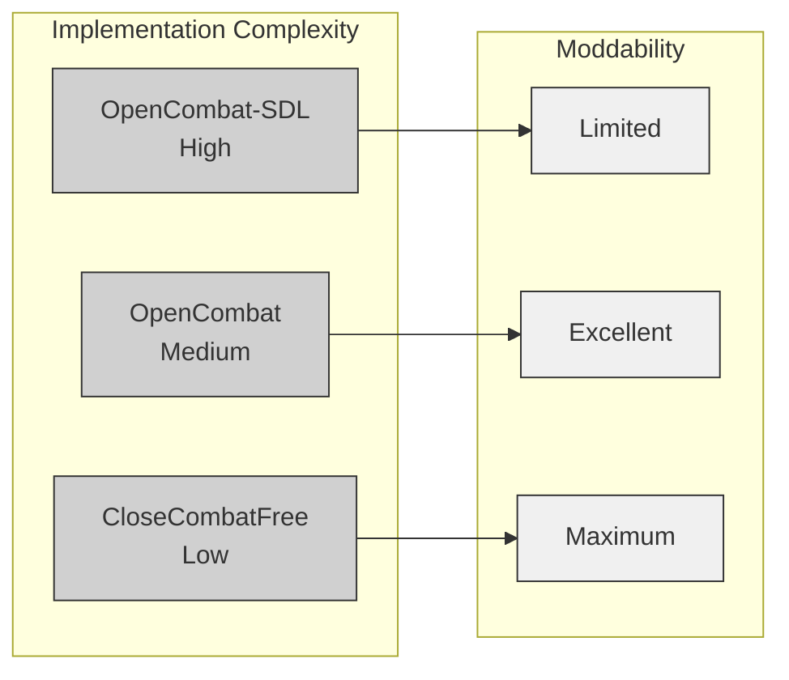
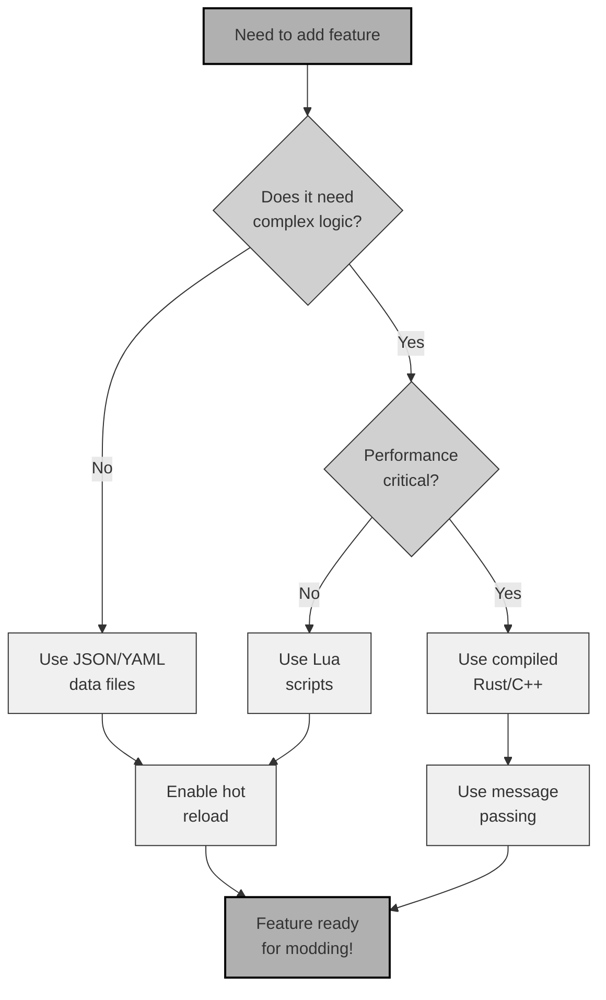

# Chapter 13: Practical Case Studies

## Applying Patterns in Real-World Scenarios

---

## 13.1 Introduction: From Theory to Practice

Earlier chapters built a complete pattern language for tactical wargame architecture. This chapter puts those patterns to work through five case studies. Each one tackles a common development challenge and shows how the three Close Combat clones solve it differently.

**How to Use This Chapter:**

1. **Skim the Problem** to understand the challenge
2. **Study Each Solution** to see how architecture shapes implementation
3. **Review the Comparison** to weigh trade-offs
4. **Apply the Synthesis** to your own projects

The case studies follow this structure:
- **Problem Definition**: The goal and requirements
- **OpenCombat-SDL Approach**: Traditional C++/XML implementation
- **OpenCombat Approach**: Modern Rust/JSON implementation
- **CloseCombatFree Approach**: Declarative QML implementation
- **Comparative Analysis**: Lines of code, moddability, performance
- **Synthesis**: Recommended hybrid approach

---

## 13.2 Case Study 1: Implementing a Sniper Team

### 13.2.1 Problem Definition

**Goal**: Add a two-man sniper team with specialized equipment and behaviors.

**Requirements**:
- Team composition: spotter and sniper
- Equipment: sniper rifle, binoculars, sidearms
- Behaviors: concealment, long-range engagement, repositioning after firing
- Attributes: high camouflage, high accuracy, low rate of fire
- Moddability: should allow definition without code changes

**Challenge**: Each architecture implements new unit types differently based on its entity composition model.

### 13.2.2 OpenCombat-SDL Approach: Deep Inheritance + XML Data

**Architecture**: Deep inheritance hierarchy with XML data files

**Step 1: Add to Soldier Type System** (requires code changes)

```cpp
// SoldierTypes.h - Add to enum
enum SoldierType {
    TYPE_RIFLEMAN,
    TYPE_MACHINE_GUNNER,
    TYPE_SNIPER_SPOTTER,  // NEW
    TYPE_SNIPER_SHOOTER   // NEW
};
```

**Step 2: Define in XML** (data only)

```xml
<!-- config/Soldiers.xml -->
<Soldier>
    <Name>SniperSpotter</Name>
    <PrimaryWeapon>Binoculars</PrimaryWeapon>
    <SecondaryWeapon>M1911</SecondaryWeapon>
    <Attributes>
        <WalkingSpeed>2.2</WalkingSpeed>
        <Camouflage>0.9</Camouflage>
        <Stealth>0.95</Stealth>
    </Attributes>
    <States>
        <State><Name>Concealed</Name><Animation>Prone Hidden</Animation></State>
        <State><Name>Spotting</Name><Animation>Binoculars Scan</Animation></State>
    </States>
</Soldier>

<Soldier>
    <Name>SniperShooter</Name>
    <PrimaryWeapon>Springfield M1903A4</PrimaryWeapon>
    <SecondaryWeapon>M1911</SecondaryWeapon>
    <Attributes>
        <WalkingSpeed>2.0</WalkingSpeed>
        <Camouflage>0.85</Camouflage>
        <Accuracy>0.98</Accuracy>
    </Attributes>
</Soldier>
```

**Step 3: Create Sniper Team Squad Template**

```xml
<!-- config/Squads.xml -->
<Squad>
    <Name>Sniper Team</Name>
    <Type>Special</Type>
    <Composition>
        <Soldier type="SniperSpotter" count="1"/>
        <Soldier type="SniperShooter" count="1"/>
    </Composition>
    <SpecialAbilities>
        <Ability>LongRangeEngagement</Ability>
        <Ability>ConcealedMovement</Ability>
        <Ability>RepositionAfterFire</Ability>
    </SpecialAbilities>
</Squad>
```

**Step 4: Hardcoded Behavior Logic** (requires C++ changes)

```cpp
// SniperAI.cpp - Must implement special behaviors
class SniperBehavior : public SoldierBehavior {
public:
    void Update(Soldier* soldier, World* world) override {
        // Sniper-specific AI
        if (soldier->GetType() == TYPE_SNIPER_SHOOTER) {
            if (CanSeeEnemy(world) && IsConcealed()) {
                if (HasClearShot() && !RecentlyFired()) {
                    FireAtTarget();
                    MarkForReposition();
                }
            }
        }
        else if (soldier->GetType() == TYPE_SNIPER_SPOTTER) {
            // Spotter marks targets for shooter
            if (auto* target = FindEnemyWithBinoculars(world)) {
                MarkTargetForShooter(target);
            }
        }
    }

private:
    void MarkForReposition() {
        // Set flag to relocate after firing
        _needsReposition = true;
    }
};
```

**Step 5: Add to Soldier Manager**

```cpp
// SoldierManager.cpp
void SoldierManager::LoadTemplates() {
    // Existing types...

    // Add sniper types
    RegisterTemplate(TYPE_SNIPER_SPOTTER, "SniperSpotter");
    RegisterTemplate(TYPE_SNIPER_SHOOTER, "SniperShooter");
}
```

**Lines of Code**: ~300 (C++) + ~80 (XML) = **380 lines**

**Time to Implement**: 2-3 days (requires recompilation)

**Moddability**: Limited—new soldier types require code changes

### 13.2.3 OpenCombat Approach: Component Composition + JSON

**Architecture**: Modified ECS with JSON deployment configurations

**Step 1: Define Sniper Team in Deployment JSON**

No code changes are required. The team is configured entirely through JSON:

```json
{
    "soldiers": [
        {
            "type": "Rifleman",
            "side": "Allies",
            "squad_uuid": "sniper_team_01",
            "position": {"x": 150, "y": 200},
            "weapon": "Binoculars",
            "equipment": ["M1911", "Radio"],
            "attributes": {
                "role": "spotter",
                "camouflage": 0.9,
                "stealth": 0.95,
                "vision_range": 400
            }
        },
        {
            "type": "Rifleman",
            "side": "Allies",
            "squad_uuid": "sniper_team_01",
            "position": {"x": 152, "y": 202},
            "weapon": "SniperRifle",
            "equipment": ["M1911", "CamoNet"],
            "attributes": {
                "role": "shooter",
                "camouflage": 0.85,
                "accuracy": 0.98,
                "effective_range": 600,
                "reposition_after_fire": true
            }
        }
    ],
    "squads": {
        "sniper_team_01": {
            "leader": 1,
            "type": "SniperTeam",
            "members": [0, 1],
            "formation": "Dispersed"
        }
    }
}
```

**Step 2: Behavior Scripts**

Moddable Lua scripts handle behavior logic without recompilation:

```lua
-- behaviors/sniper_team.lua
SniperTeamBehavior = {}

function SniperTeamBehavior.evaluate(soldier, world)
    local role = soldier:getAttribute("role")

    if role == "shooter" then
        return evaluateShooter(soldier, world)
    elseif role == "spotter" then
        return evaluateSpotter(soldier, world)
    end

    return nil  -- Default behavior
end

function evaluateShooter(soldier, world)
    -- Only engage if concealed and has clear shot
    if not soldier:isConcealed() then
        return Behavior.Hide(findConcealedPosition(soldier))
    end

    -- Check if spotter has marked a target
    local markedTarget = getMarkedTarget(soldier:getSquad())
    if markedTarget and soldier:canSee(markedTarget) then
        if soldier:getAttribute("reposition_after_fire") and soldier:recentlyFired() then
            return Behavior.MoveTo(findRepositionPoint(soldier))
        end
        return Behavior.EngageSoldier(markedTarget)
    end

    -- Wait for spotter
    return Behavior.Idle(Body.Prone)
end

function evaluateSpotter(soldier, world)
    -- Find targets with binoculars
    local targets = world:findVisibleEnemies(soldier, 400)

    if #targets > 0 then
        -- Mark best target for shooter
        local bestTarget = selectBestTarget(targets)
        markTargetForSquad(soldier:getSquad(), bestTarget)
        return Behavior.Defend(soldier:getFacing())
    end

    -- Scan for enemies
    return Behavior.RotateTo(findScanDirection(soldier))
end

return SniperTeamBehavior
```

**Step 3: Register in Behavior System**

The Rust implementation loads and registers behavior scripts:

```rust
// behavior_system.rs
fn load_behavior_scripts() {
    let scripts = vec![
        ("sniper_team", "behaviors/sniper_team.lua"),
        ("standard_infantry", "behaviors/infantry.lua"),
    ];

    for (name, path) in scripts {
        BehaviorRegistry::register(name, LuaScript::load(path));
    }
}

fn evaluate_soldier_behavior(soldier: &Soldier, world: &World) -> Behavior {
    // Check if squad has custom behavior
    if let Some(script) = get_squad_behavior_script(soldier.squad_uuid) {
        return script.evaluate(soldier, world);
    }

    // Default behavior
    standard_behavior(soldier, world)
}
```

**Step 4: Weapon Definition**

Weapons are also defined in JSON:

```json
{
    "weapons": [
        {
            "name": "SniperRifle",
            "type": "BoltAction",
            "damage": 95,
            "range": 600,
            "accuracy": 0.98,
            "rate_of_fire": 0.2,
            "ammo_capacity": 5,
            "reload_time": 4.0,
            "requires_stance": ["Prone", "Crouch"],
            "special_effects": ["SuppressionOnHit", "RevealOnFire"]
        }
    ]
}
```

**Implementation Metrics**
- Lines of code: ~150 (Lua) + ~60 (JSON) = **210 lines**
- Time to implement: 1 day (hot reload eliminates recompilation)
- Moddability: Excellent—new behaviors can be added via Lua scripts

### 13.2.4 CloseCombatFree Approach: Pure QML Definition

**Architecture**: C++/QML hybrid with QML as the content definition language

**Step 1: Create Sniper Team QML File**

```qml
// units/SniperTeam.qml
import QtQuick 2.1
import "../components"

Unit {
    id: sniperTeam
    unitType: "Sniper Team"
    unitSide: "allies"
    maxSpeed: 2.0

    Soldier {
        id: spotter
        role: "Spotter"

        equipment: [
            Equipment { type: "Binoculars"; range: 400 },
            Equipment { type: "Pistol"; damage: 25 }
        ]

        camouflage: 0.9
        stealth: 0.95
        visionRange: 400

        function onUpdate() {
            var enemies = findEnemiesInRange(visionRange);
            if (enemies.length > 0) {
                markTarget(enemies[0]);
                setStatus("SPOTTING");
            } else {
                setStatus("SCANNING");
            }
        }

        states: [
            State {
                name: "SPOTTING"
                PropertyChanges { target: spotterVisual; animation: "binoculars_scan" }
            },
            State {
                name: "SCANNING"
                PropertyChanges { target: spotterVisual; animation: "prone_look" }
            }
        ]
    }

    Soldier {
        id: sniper
        role: "Sniper"

        primaryWeapon: SniperRifle {
            damage: 95
            range: 600
            accuracy: 0.98
            fireRate: 0.2
            reloadTime: 4000
            effectiveStances: ["Prone", "Crouch"]
        }

        secondaryWeapon: Pistol { damage: 25 }

        camouflage: 0.85
        accuracy: 0.98
        effectiveRange: 600

        property bool needsReposition: false
        property var markedTarget: null

        function onUpdate() {
            if (needsReposition) {
                moveTo(findConcealedPosition());
                needsReposition = false;
                return;
            }

            if (spotter.markedTarget && canSee(spotter.markedTarget)) {
                if (isConcealed() && isStanceEffective("Prone")) {
                    aimAt(spotter.markedTarget);
                    if (aimComplete()) {
                        fire();
                        needsReposition = true;
                    }
                }
            } else {
                setStatus("CONCEALED");
            }
        }

        states: [
            State {
                name: "CONCEALED"
                PropertyChanges { target: sniperVisual; opacity: 0.3 }
            },
            State {
                name: "AIMING"
                PropertyChanges { target: sniperVisual; animation: "sniper_aim" }
            },
            State {
                name: "FIRING"
                PropertyChanges { target: sniperVisual; animation: "sniper_fire" }
            }
        ]
    }

    function markTarget(target) {
        sniper.markedTarget = target;
        emit targetMarked(target);
    }

    function handleOrder(order) {
        if (order.type === "Ambush") {
            spotter.setStatus("SCANNING");
            sniper.setStatus("CONCEALED");
            setAmbushZone(order.position, order.radius);
        } else {
            defaultHandleOrder(order);
        }
    }
}
```

**Step 2: Sniper Rifle Component**

```qml
// components/SniperRifle.qml
import QtQuick 2.1

Weapon {
    id: sniperRifle
    weaponType: "BoltActionRifle"

    property int damage: 95
    property int range: 600
    property real accuracy: 0.98
    property real fireRate: 0.2
    property int reloadTime: 4000
    property var effectiveStances: ["Prone", "Crouch"]

    property bool isAiming: false
    property bool isReloading: false
    property int ammo: 5

    function fire(target) {
        if (ammo <= 0 || isReloading) {
            reload();
            return;
        }

        if (!isAiming) {
            startAiming(target);
            return;
        }

        ammo--;
        spawnBullet(target, damage, accuracy);
        playSound("sniper_fire");

        createMuzzleFlash();
        revealPosition();

        if (ammo <= 0) {
            reload();
        }
    }

    function startAiming(target) {
        isAiming = true;
        aimTimer.start();
    }

    Timer {
        id: aimTimer
        interval: 2000
        onTriggered: isAiming = false
    }

    function reload() {
        isReloading = true;
        reloadTimer.start();
    }

    Timer {
        id: reloadTimer
        interval: reloadTime
        onTriggered: {
            ammo = 5;
            isReloading = false;
        }
    }
}
```

**Step 3: Scenario Integration**

```qml
// scenarios/SniperMission.qml
import "../units"

Scenario {
    name: "Sniper Ambush"

    SniperTeam {
        id: team1
        x: 500
        y: 300
        initialStatus: "AMBUSHPOS"
    }

    SniperTeam {
        id: team2
        x: 550
        y: 350
        initialStatus: "AMBUSHPOS"
    }

    EnemySquad {
        id: patrol
        x: 100
        y: 100
        waypoints: [Qt.point(200, 200), Qt.point(400, 400)]
    }

    function checkVictory() {
        if (patrol.casualties >= 5) {
            return "victory";
        }
        if (team1.isDestroyed() && team2.isDestroyed()) {
            return "defeat";
        }
        return "ongoing";
    }
}
```

**Lines of Code**: ~180 (QML)
**Time to Implement**: 4-6 hours (hot reload, no compilation)
**Moddability**: Excellent—pure QML allows instant edits and previews

### 13.2.5 Comparative Analysis

| Aspect             | OpenCombat-SDL | OpenCombat           | CloseCombatFree |
| ------------------ | -------------- | -------------------- | --------------- |
| **Lines of Code**      | ~380           | ~210                 | ~180            |
| **Time to Implement**  | 2-3 days       | 1 day                | 4-6 hours       |
| **Requires Recompile** | Yes            | No (with hot reload) | No              |
| **Moddability**        | Limited        | Excellent            | Excellent       |
| **Performance**        | Best           | Good                 | Moderate        |
| **Type Safety**        | Runtime        | Compile-time         | Runtime         |
| **Visual Feedback**    | Manual         | Via debug            | Built-in        |



**Key Insights**:

1. OpenCombat-SDL trades behavior flexibility for C++ performance, while scripted approaches prioritize rapid iteration.
2. QML offers the most accessible workflow for non-programmers.
3. Performance differences become negligible when handling small unit counts.
4. Hot reload in QML accelerates experimentation tenfold compared to compiled approaches.

### 13.2.6 Synthesis: Recommended Hybrid Approach

The optimal solution combines elements from all three implementations:

**Architecture**:

```pseudocode
Unit: {
    name: "Sniper Team"
    composition: [
        { role: "spotter", equipment: ["binoculars", "pistol"] },
        { role: "sniper", equipment: ["sniper_rifle", "pistol"] }
    ]

    behavior: {
        script: "ai/sniper_team.lua"
        default: "conceal_and_engage"
    }

    attributes: {
        camouflage: 0.9
        stealth: 0.95
    }
}
```

**Benefits**:
- JSON handles static data like stats and equipment
- Lua scripts manage complex behaviors
- Compiled code ensures type safety and performance
- Both JSON and Lua support hot reloading
- Critical paths remain in optimized compiled code

**Lines of Code**: ~80 (JSON) + ~70 (Lua) = **~150 lines**

This hybrid approach delivers CloseCombatFree's moddability, OpenCombat-SDL's performance, and OpenCombat's type safety.

---

## 13.3 Case Study 2: Adding Ambush Behavior

### 13.3.1 Problem Definition

**Goal**: Implement ambush behavior where units conceal themselves, hold fire until enemies enter a kill zone, then coordinate firing for maximum effect. After engagement, they reposition to avoid counter-fire.

**Requirements**:
- State: Ambush/Hold-fire mode
- Trigger: Enemy enters defined zone
- Action: Coordinated volley fire
- Post-action: Reposition or disengage
- UI: Clear feedback on ambush status and trigger conditions

The challenge involves coordinating state management, AI decision-making, the order system, and visual feedback.

### 13.3.2 OpenCombat-SDL Approach: Bitfield States + Action Handlers

**Architecture**: Bitfield state system with C++ action handlers

**Step 1: Add Ambush State to Bitfield** (requires recompilation)

```cpp
// SoldierState.h
enum SoldierState {
    // Existing states...
    STATE_AMBUSH = 32,        // NEW: In ambush position
    STATE_HOLD_FIRE = 33,     // NEW: Will not fire until triggered
    STATE_AMBUSH_TRIGGERED = 34,  // NEW: Ambush has been sprung
};
```

**Step 2: Define Ambush Order**

```cpp
// Orders.h
class AmbushOrder : public Order {
public:
    Point ambushCenter;
    float triggerRadius;
    float killZoneArc;        // Firing arc in degrees
    bool autoReposition;      // Move after firing?

    AmbushOrder(Point center, float radius, float arc)
        : ambushCenter(center), triggerRadius(radius), killZoneArc(arc) {}

    void Execute(Squad* squad) override;
};

void AmbushOrder::Execute(Squad* squad) {
    for (auto* soldier : squad->GetMembers()) {
        // Set ambush state
        soldier->GetState().Set(STATE_AMBUSH);
        soldier->GetState().Set(STATE_HOLD_FIRE);
        soldier->GetState().Set(STATE_PRONE);  // Auto-prone for concealment

        // Store ambush parameters
        soldier->SetAmbushData(ambushCenter, triggerRadius, killZoneArc);
    }
}
```

**Step 3: Ambush Detection Logic**

```cpp
// Soldier.cpp - Added to Update()
void Soldier::CheckAmbushTriggers(World* world) {
    if (!_currentState.IsSet(STATE_AMBUSH) ||
        _currentState.IsSet(STATE_AMBUSH_TRIGGERED)) {
        return;  // Not in ambush or already triggered
    }

    // Scan for enemies in trigger zone
    auto enemies = world->GetEnemiesInRadius(_ambushCenter, _triggerRadius, GetSide());

    for (auto* enemy : enemies) {
        // Check if enemy is within kill zone arc
        float angleToEnemy = CalculateAngle(_ambushCenter, enemy->GetPosition());
        if (IsAngleInArc(angleToEnemy, _ambushFacing, _killZoneArc)) {
            // TRIGGER THE AMBUSH!
            TriggerAmbush(world);
            return;
        }
    }
}

void Soldier::TriggerAmbush(World* world) {
    // Mark as triggered
    _currentState.Set(STATE_AMBUSH_TRIGGERED);
    _currentState.UnSet(STATE_HOLD_FIRE);

    // Notify squad leader
    if (Squad* squad = GetSquad()) {
        squad->OnAmbushTriggered();
    }

    // Begin engagement
    AddAction(new Action(ACTION_STAND_UP));
    AddAction(new Action(ACTION_ENGAGE));
}
```

**Step 4: Squad Coordination**

```cpp
// Squad.cpp
void Squad::OnAmbushTriggered() {
    // Coordinate firing for maximum effect
    int memberCount = _soldiers.size();
    int delayMs = 0;

    for (auto* soldier : _soldiers) {
        if (soldier->IsAlive() && soldier->HasState(STATE_AMBUSH_TRIGGERED)) {
            // Stagger firing for continuous suppression
            soldier->SetFireDelay(delayMs);
            delayMs += 200;  // 200ms between soldiers
        }
    }

    // Play ambush sprung sound
    g_Globals.g_Audio->PlaySound("ambush_triggered");
}
```

**Step 5: Post-Ambush Repositioning**

```cpp
// SoldierAI.cpp
void Soldier::PostAmbushLogic() {
    if (!_ambushData.autoReposition) {
        return;
    }

    // Find concealed position away from ambush site
    auto coverPositions = FindConcealedPositions(_position, 50.0f, 150.0f);

    if (!coverPositions.empty()) {
        Point newPos = SelectFarthestFromEnemies(coverPositions);
        AddOrder(new MoveOrder(newPos, SPEED_SNEAK));
    }

    // Clear ambush state
    _currentState.UnSet(STATE_AMBUSH);
    _currentState.UnSet(STATE_AMBUSH_TRIGGERED);
}
```

**Step 6: XML Configuration**

```xml
<!-- config/AmbushSettings.xml -->
<AmbushConfig>
    <TriggerRadius default="100"/>
    <KillZoneArc default="90"/>
    <AutoReposition default="true"/>
    <FiringDelayBetweenSoldiers>200</FiringDelayBetweenSoldiers>
    <MinConcealmentForAmbush>0.7</MinConcealmentForAmbush>
</AmbushConfig>
```

This implementation adds about 400 lines of C++ and 20 lines of XML configuration. The complexity comes from bitfield operations and state transitions.

### 13.3.3 OpenCombat Approach: Behavior Layer + Message System

**Architecture**: Three-tier state hierarchy with message-driven updates

**Step 1: Define Ambush Behavior**

```rust
// behavior.rs
#[derive(Debug, Clone)]
pub enum Behavior {
    // Existing behaviors...
    Ambush {
        center: WorldPoint,
        radius: f32,
        arc: Angle,
        triggered: bool,
        reposition_after: bool,
    },
    HoldFireUntil {
        condition: TriggerCondition,
        then_behavior: Box<Behavior>,
    },
}

#[derive(Debug, Clone)]
pub enum TriggerCondition {
    EnemyInRadius { radius: f32 },
    EnemyInArc { center: WorldPoint, radius: f32, arc: Angle },
    SquadCommand,
    Timer { duration_secs: f32 },
}
```

**Step 2: Order to Behavior Translation**

```rust
// order_interpreter.rs
fn translate_order_to_behavior(order: &Order, soldier: &Soldier) -> Behavior {
    match order {
        Order::Ambush { center, radius, arc, reposition } => {
            Behavior::Ambush {
                center: *center,
                radius: *radius,
                arc: *arc,
                triggered: false,
                reposition_after: *reposition,
            }
        },
        // ... other orders
    }
}
```

**Step 3: Ambush Evaluation System**

```rust
// ai_system.rs
pub fn evaluate_ambush(
    soldier: &Soldier,
    behavior: &Behavior,
    world: &World,
) -> Option<Behavior> {
    if let Behavior::Ambush { center, radius, arc, triggered, reposition_after } = behavior {
        if *triggered {
            return evaluate_post_ambush(soldier, *reposition_after, world);
        }

        if let Some(enemy) = find_enemy_in_ambush_zone(soldier, *center, *radius, *arc, world) {
            return Some(Behavior::Ambush {
                center: *center,
                radius: *radius,
                arc: *arc,
                triggered: true,
                reposition_after: *reposition_after,
            });
        }

        None
    } else {
        None
    }
}
```

**Step 4: Coordinated Ambush Trigger**

```rust
// squad_system.rs
pub fn coordinate_ambush_trigger(
    squad_uuid: SquadUuid,
    triggered_by: SoldierIndex,
    state: &mut BattleState,
) -> Vec<BattleStateMessage> {
    let mut messages = vec![];

    if let Some(squad) = state.squads.get(&squad_uuid) {
        let ambushers: Vec<SoldierIndex> = squad.members.iter()
            .filter(|&&idx| {
                let soldier = &state.soldiers[idx.0];
                matches!(soldier.behavior, Behavior::Ambush { triggered: false, .. })
            })
            .cloned()
            .collect();

        for (i, &soldier_idx) in ambushers.iter().enumerate() {
            let delay_frames = i as u64 * 12;

            messages.push(BattleStateMessage::ScheduleMessage {
                delay_frames,
                message: Box::new(BattleStateMessage::Soldier(
                    soldier_idx,
                    SoldierMessage::TriggerAmbush,
                )),
            });
        }

        messages.push(BattleStateMessage::AmbushSprung {
            squad: squad_uuid,
            location: state.soldiers[triggered_by.0].position,
        });
    }

    messages
}
```

**Lines of Code**: ~350 (Rust) + ~20 (JSON) = **~370 lines**

**Complexity**: Medium. The three-tier system requires understanding the hierarchy.

### 13.3.4 CloseCombatFree Approach: QML State Machine

**Architecture**: QML state machine with declarative transitions

**Step 1: Ambush State Machine Component**

```qml
// components/AmbushBehavior.qml
import QtQuick 2.1

Item {
    id: ambushController

    // Configuration
    property var ambushZone: null
    property real triggerRadius: 100
    property real killZoneArc: 90
    property bool autoReposition: true

    // State machine
    state: "CONCEALED"

    states: [
        State {
            name: "CONCEALED"
            StateChangeScript {
                script: {
                    unit.setUnitStatus("AMBUSH-CONCEALED");
                    unit.setPosture("Prone");
                    unit.holdFire = true;
                }
            }
        },
        State {
            name: "TRIGGERED"
            StateChangeScript {
                script: springAmbush()
            }
        }
    ]

    // Trigger detection
    Timer {
        id: scanTimer
        interval: 250
        running: ambushController.state === "CONCEALED"
        repeat: true
        onTriggered: scanForTriggers()
    }

    function scanForTriggers() {
        if (!ambushZone) return;

        var enemies = scene.findEnemiesInRadius(ambushZone.center, triggerRadius, unit.unitSide);

        for (var i = 0; i < enemies.length; i++) {
            var enemy = enemies[i];
            var angle = calculateAngle(ambushZone.center, enemy.position);

            if (isAngleInArc(angle, ambushZone.facing, killZoneArc)) {
                state = "TRIGGERED";
                targetEnemy = enemy;
                return;
            }
        }
    }

    function springAmbush() {
        emit ambushSprung(unit.squad, ambushZone.center);
        engagementSequence.start();
    }

    SequentialAnimation {
        id: engagementSequence

        ScriptAction {
            script: {
                unit.setPosture("Standing");
                unit.holdFire = false;
            }
        }

        PauseAnimation { duration: 500 }

        ScriptAction {
            script: {
                if (targetEnemy && targetEnemy.isAlive) {
                    unit.engageTarget(targetEnemy);
                }
            }
        }
    }
}
```

**Lines of Code**: ~250 (QML) = **~250 lines**

**Complexity**: Low. The declarative state machine is intuitive.

### 13.3.5 Comparative Analysis

| Aspect           | OpenCombat-SDL    | OpenCombat        | CloseCombatFree  |
| ---------------- | ----------------- | ----------------- | ---------------- |
| **Lines of Code**    | ~420              | ~370              | ~250             |
| **State Complexity** | High (bitfield)   | Medium (enums)    | Low (QML states) |
| **Coordination**     | Manual C++        | Message-based     | Signal-based     |
| **Debugging**        | Hard (bit values) | Medium (messages) | Easy (visual)    |
| **Moddability**      | Poor              | Good              | Excellent        |

### 13.3.6 Synthesis: Recommended Approach

**Hybrid Behavior System**:

```pseudocode
// Core state in enum (type-safe)
// Behavior defined in Lua (moddable)

enum AmbushState {
    Concealed,
    Scanning,
    Triggered,
    Engaging,
    Repositioning,
}

-- behaviors/ambush.lua
AmbushBehavior = {
    states = {
        CONCEALED = {
            on_enter = function(soldier)
                soldier:set_posture("prone")
                soldier:hold_fire(true)
            end,
            update = function(soldier, dt)
                if detect_trigger(soldier) then
                    return "TRIGGERED"
                end
                return nil
            end
        },

        TRIGGERED = {
            on_enter = function(soldier)
                notify_squad(soldier.squad, "ambush_sprung")
                soldier:hold_fire(false)
            end,
            update = function(soldier, dt)
                local delay = soldier.squad_index * 0.2
                if soldier.time_in_state >= delay then
                    soldier:engage_nearest()
                end

                if soldier.time_in_state >= 3.0 then
                    return "REPOSITIONING"
                end
                return nil
            end
        }
    }
}
```

---

## 13.4 Case Study 3: Dynamic Cover System

### 13.4.1 Problem Definition

**Goal**: Implement destructible and dynamic cover that blocks line of sight, stops incoming fire, and can be destroyed by explosions or heavy weapons. The system must also affect pathfinding, AI decisions, and update visibility calculations in real time while synchronizing across multiplayer networks.

**Requirements**:
- Cover types: Walls, buildings, sandbags, trees
- Destruction: Visual changes, cover reduction, debris
- Performance: Efficient updates with minimal recomputation
- Network: Synchronized destruction across all clients

The challenge lies in coordinating cover changes across multiple systems—line of sight, pathfinding, AI, and rendering—while maintaining atomic updates.

### 13.4.2 OpenCombat-SDL Approach: Tile-Based Cover Updates

**Architecture**: Grid-based world with parallel arrays

**Step 1: Extend Element System for Destruction**

```cpp
// Element.h
class Element {
public:
    std::string name;
    CoverValues cover;
    int hindrance;
    bool blocksVision;

    // Destruction properties
    bool isDestructible;
    int hitPoints;
    Element* destroyedVariant;
    Element* damagedVariant;
    std::string destructionEffect;
};

struct CoverValues {
    float standing;
    float prone;

    float getCurrentCover(float integrity) {
        return standing * integrity;
    }
};
```

**Step 2: Track Cover Integrity**

```cpp
// World.h - Add to tile data
class World {
    std::vector<Element*> _elements;
    std::vector<int> _elevations;
    std::vector<float> _coverIntegrity;

public:
    void DamageCover(int tileX, int tileY, float damage);
    void DestroyCover(int tileX, int tileY);
};
```

**Step 3: Destruction Logic**

```cpp
// World.cpp
void World::DamageCover(int tileX, int tileY, float damage) {
    int index = GetTileIndex(tileX, tileY);
    Element* elem = _elements[index];

    if (!elem || !elem->isDestructible) return;

    _coverIntegrity[index] -= damage;

    if (_coverIntegrity[index] <= 0) {
        DestroyCover(tileX, tileY);
    } else if (_coverIntegrity[index] <= 50.0f && elem->damagedVariant) {
        _elements[index] = elem->damagedVariant;
    }
}

void World::DestroyCover(int tileX, int tileY) {
    int index = GetTileIndex(tileX, tileY);
    Element* elem = _elements[index];

    if (elem && elem->destroyedVariant) {
        _elements[index] = elem->destroyedVariant;
        _coverIntegrity[index] = 0.0f;

        SpawnEffect(elem->destructionEffect, tileX, tileY);
        InvalidatePathfindingCache(tileX, tileY);
        ClearLOSCache();
        g_Globals.g_Audio->PlaySound("wall_destroyed");
    }
}
```

**Lines of Code**: ~500 (C++) + ~50 (XML) = **~550 lines**

### 13.4.3 OpenCombat Approach: Message-Based Cover Updates

**Architecture**: Message-driven with accumulated opacity

**Step 1: Cover as Dynamic World Object**

```rust
// cover.rs
#[derive(Debug, Clone)]
pub struct CoverObject {
    pub id: CoverId,
    pub position: WorldPoint,
    pub size: Vec2,
    pub cover_type: CoverType,
    pub integrity: f32,
    pub is_destroyed: bool,
}

impl CoverObject {
    pub fn take_damage(&mut self, damage: f32) -> Vec<CoverEvent> {
        let mut events = vec![];
        self.integrity -= damage / self.get_max_integrity();

        if self.integrity <= 0.0 && !self.is_destroyed {
            self.is_destroyed = true;
            events.push(CoverEvent::Destroyed(self.id));
        }

        events
    }
}
```

**Step 2: Spatial Index for Cover Objects**

```rust
// spatial_index.rs
pub struct CoverSpatialIndex {
    grid: HashMap<GridPoint, Vec<CoverId>>,
    cell_size: f32,
}

impl CoverSpatialIndex {
    pub fn query_radius(&self, center: WorldPoint, radius: f32) -> Vec<CoverId> {
        let center_cell = world_to_grid(center, self.cell_size);
        let radius_cells = (radius / self.cell_size).ceil() as i32;

        let mut result = HashSet::new();

        for dx in -radius_cells..=radius_cells {
            for dy in -radius_cells..=radius_cells {
                let cell = GridPoint::new(center_cell.x + dx, center_cell.y + dy);
                if let Some(covers) = self.grid.get(&cell) {
                    result.extend(covers.iter().cloned());
                }
            }
        }

        result.into_iter().collect()
    }
}
```

**Step 3: Message-Based Updates**

```rust
// messages.rs
#[derive(Debug, Clone)]
pub enum CoverMessage {
    TakeDamage { cover_id: CoverId, damage: f32 },
    Destroyed { cover_id: CoverId },
}

impl BattleState {
    pub fn apply_cover_message(&mut self, msg: CoverMessage) {
        match msg {
            CoverMessage::TakeDamage { cover_id, damage } => {
                if let Some(cover) = self.cover_objects.get_mut(&cover_id) {
                    let events = cover.take_damage(damage);
                }
            }
        }
    }
}
```

**Lines of Code**: ~600 (Rust)

### 13.4.4 CloseCombatFree Approach: QML Object Destruction

**Architecture**: QML components with visual state changes

```qml
// components/DestructibleCover.qml
import QtQuick 2.1

Prop {
    id: cover

    property int maxHitPoints: 100
    property int currentHitPoints: maxHitPoints
    property bool isDestroyed: false

    property url intactImage: "props/wall_intact.png"
    property url damagedImage: "props/wall_damaged.png"
    property url destroyedImage: "props/wall_destroyed.png"

    Image {
        id: coverVisual
        anchors.fill: parent
        source: {
            if (isDestroyed) return destroyedImage;
            if (currentHitPoints < maxHitPoints * 0.5) return damagedImage;
            return intactImage;
        }
    }

    states: [
        State {
            name: "INTACT"
            when: currentHitPoints > maxHitPoints * 0.5
            PropertyChanges { target: cover; coverValue: 0.9 }
        },
        State {
            name: "DESTROYED"
            when: currentHitPoints <= 0
            PropertyChanges { target: cover; coverValue: 0.1; blocksLOS: false }
        }
    ]

    function takeDamage(amount) {
        if (isDestroyed) return;

        currentHitPoints -= amount;

        if (currentHitPoints <= 0) {
            destroyCover();
        }
    }

    function destroyCover() {
        isDestroyed = true;
        spawnDebris();
        emit coverDestroyed(cover);
    }
}
```

**Lines of Code**: ~300 (QML)

### 13.4.5 Comparative Analysis

| Aspect         | OpenCombat-SDL | OpenCombat      | CloseCombatFree |
| -------------- | -------------- | --------------- | --------------- |
| **Lines of Code**  | ~550           | ~600            | ~300            |
| **Granularity**    | Tile-based     | Object-based    | Object-based    |
| **Network Sync**   | Hard           | Easy (messages) | Hard            |
| **Visual Quality** | Good           | Good            | Excellent       |
| **Moddability**    | Limited        | Good            | Excellent       |

### 13.4.6 Synthesis: Recommended Approach

**Hybrid Grid + Object System**:

```pseudocode
// Static cover in grid (performance)
// Dynamic cover as objects (flexibility)

World: {
    terrain_cover: Grid<float>
    dynamic_cover: List<CoverObject>
    cover_index: SpatialHash
}

CoverObject: {
    id: UUID
    position: Vec2
    bounds: Rect
    integrity: float

    take_damage(amount): {
        self.integrity -= amount
        if self.integrity <= 0 {
            destroy()
        }
        emit CoverDamaged(self.id, self.integrity)
    }
}

// LOS calculation
calculate_visibility(from, to): {
    // 1. Check terrain (grid - fast)
    if terrain_blocks(from, to) {
        return Hidden
    }

    // 2. Check dynamic cover (spatial index)
    covers = cover_index.query_line(from, to)
    for cover in covers {
        if cover.integrity > 0 {
            return Hidden
        }
    }

    return Visible
}
```

---

## 13.5 Case Study 4: Implementing Fog of War

### 13.5.1 Problem Definition

**Goal**: Build a fog of war system where units reveal terrain and enemies based on actual line of sight. The system must:
- Show only what soldiers can see
- Remember discovered terrain permanently
- Display enemy units only when spotted
- Animate smooth visual transitions
- Run efficiently at 60 FPS
- Stay synchronized in multiplayer

**Key requirements**:
- Sight-based terrain revelation
- Line of sight calculations for each soldier
- Memory of explored areas
- Temporary enemy visibility

The challenge lies in performing continuous LOS calculations for hundreds of units while maintaining performance.

### 13.5.2 OpenCombat-SDL Approach: Sight-Based Revelation

**Architecture**: Per-tile visibility flags with LOS calculations

```cpp
// World.h
class World {
    std::vector<uint8_t> _visibility[2];  // [side][tile_index]

    static constexpr uint8_t VIS_HIDDEN = 0x00;
    static constexpr uint8_t VIS_FOGGED = 0x01;
    static constexpr uint8_t VIS_VISIBLE = 0x02;
    static constexpr uint8_t VIS_REVEALED = 0x04;

public:
    void UpdateFogOfWar(int side);
};

void World::UpdateFogOfWar(int side) {
    // Reset visible tiles to fogged
    for (size_t i = 0; i < _visibility[side].size(); i++) {
        if (_visibility[side][i] & VIS_VISIBLE) {
            _visibility[side][i] &= ~VIS_VISIBLE;
            _visibility[side][i] |= VIS_FOGGED;
        }
    }

    // Calculate vision from each soldier
    for (auto* soldier : GetSoldiersForSide(side)) {
        if (!soldier->IsAlive()) continue;

        Point pos = soldier->GetPosition();
        float sightRange = soldier->GetSightRange();

        std::vector<Point> visionTiles = GetCirclePoints(pos, sightRange);

        for (const Point& tile : visionTiles) {
            if (!IsValidTile(tile.x, tile.y)) continue;

            if (LineOfSight::IsVisible(pos, tile, this)) {
                int index = GetTileIndex(tile.x, tile.y);
                _visibility[side][index] = VIS_VISIBLE | VIS_REVEALED;
            }
        }
    }
}
```

**Lines of Code**: ~400 (C++)

### 13.5.3 OpenCombat Approach: Message-Based Visibility State

**Architecture**: Shadow casting with message-driven updates

```rust
// visibility.rs
#[derive(Debug, Clone, Default)]
pub struct VisibilityState {
    pub currently_visible: HashSet<GridPoint>,
    pub revealed_tiles: HashSet<GridPoint>,
    pub visible_enemies: HashSet<SoldierIndex>,
}

pub fn calculate_vision_field(
    center: WorldPoint,
    radius: f32,
    map: &Map,
) -> HashSet<GridPoint> {
    let mut visible = HashSet::new();
    let center_grid = center.to_grid();

    for octant in 0..8 {
        cast_light(center_grid.x, center_grid.y, 1, 1.0, 0.0,
                   radius as i32, octant, map, &mut visible);
    }

    visible
}
```

**Lines of Code**: ~500 (Rust)

### 13.5.4 CloseCombatFree Approach: Visibility State Machine

**Architecture**: QML state machine with declarative visibility

```qml
// components/VisibilityManager.qml
import QtQuick 2.1

Item {
    id: visibilityManager

    property var revealedTiles: ({})
    property var visibleTiles: []
    property var visibleEnemies: []

    Timer {
        id: updateTimer
        interval: 100
        running: true
        repeat: true
        onTriggered: updateVisibility()
    }

    function updateVisibility() {
        var newVisibleTiles = [];
        var newVisibleEnemies = [];

        for (var i = 0; i < friendlyUnits.length; i++) {
            var unit = friendlyUnits[i];
            if (!unit.isAlive) continue;

            var vision = calculateVisionField(unit.position, unit.sightRange);
            newVisibleTiles = newVisibleTiles.concat(vision.tiles);
            newVisibleEnemies = newVisibleEnemies.concat(vision.enemies);
        }

        updateTileVisibility(newVisibleTiles);
        updateEnemyVisibility(newVisibleEnemies);
    }
}
```

**Lines of Code**: ~350 (QML)

### 13.5.5 Comparative Analysis

| Aspect            | OpenCombat-SDL | OpenCombat    | CloseCombatFree      |
| ----------------- | -------------- | ------------- | -------------------- |
| **Lines of Code**     | ~400           | ~500          | ~350                 |
| **Update Frequency**  | Every frame    | Every frame   | 10 Hz                |
| **Visual Quality**    | Basic (tile)   | Good (smooth) | Excellent (animated) |
| **Performance**       | Good           | Good          | Moderate             |
| **Elevation Support** | No             | Yes           | Limited              |

### 13.5.6 Synthesis: Recommended Approach

**Hybrid Visibility System**:

```pseudocode
VisibilitySystem: {
    update(): {
        for each soldier in soldiers {
            if soldier.alive && soldier.side == current_side {
                vision = shadow_cast(soldier.position, soldier.sight_range)

                for tile in vision {
                    if not revealed[tile] {
                        reveal(tile)
                    }
                    visible_now[tile] = true
                }
            }
        }
    }

    render_fog(): {
        for each tile in map {
            if visible_now[tile] {
                set_opacity(tile, 0.0)
            } else if revealed[tile] {
                set_opacity(tile, 0.6)
            } else {
                set_opacity(tile, 1.0)
            }

            lerp_opacity(tile, target_opacity, delta_time * 2.0)
        }
    }
}
```

---

## 13.6 Case Study 5: Creating a Campaign System

### 13.6.1 Problem Definition

**Goal**: Implement a campaign system that connects multiple battles into a narrative while maintaining:
- Persistent unit state between missions (experience, casualties, equipment)
- Strategic layer with map movement and resource management
- Experience and upgrade systems
- Save and load functionality across the campaign
- Story events and decision points

**Requirements**:
- Units that persist across missions
- Experience and skill progression
- Equipment and reinforcement management
- Strategic decisions that affect battles
- Campaign state save and load
- Victory and defeat conditions

The challenge lies in handling state persistence, narrative scripting, and complex UI integration across multiple battles.

### 13.6.2 OpenCombat-SDL Approach: Save/Load + XML Campaign

**Architecture**: File-based persistence with XML campaign definitions

```cpp
// Campaign.h
class Campaign {
public:
    std::string name;
    std::string currentMission;
    std::vector<std::string> completedMissions;

    struct PersistentSoldier {
        std::string id;
        std::string type;
        int experience;
        bool isAlive;
        Attributes currentAttributes;
        std::vector<std::string> equipment;
    };

    std::vector<PersistentSoldier> roster;
    int reinforcementPoints;

    void Save(const std::string& filename);
    bool Load(const std::string& filename);
};

void Campaign::Save(const std::string& filename) {
    XMLDocument doc;
    XMLElement* root = doc.NewElement("Campaign");

    root->SetAttribute("name", name.c_str());
    root->SetAttribute("currentMission", currentMission.c_str());

    XMLElement* rosterNode = doc.NewElement("Roster");
    for (auto& soldier : roster) {
        XMLElement* soldierNode = doc.NewElement("Soldier");
        soldierNode->SetAttribute("id", soldier.id.c_str());
        soldierNode->SetAttribute("experience", soldier.experience);
        soldierNode->SetAttribute("alive", soldier.isAlive);
        rosterNode->InsertEndChild(soldierNode);
    }
    root->InsertEndChild(rosterNode);

    doc.InsertEndChild(root);
    doc.SaveFile(filename.c_str());
}
```

**Lines of Code**: ~800 (C++) + ~150 (XML)

### 13.6.3 OpenCombat Approach: JSON Persistence + Deterministic Replay

**Architecture**: JSON stores data while deterministic simulation enables replay.

```rust
// campaign.rs
#[derive(Debug, Clone, Serialize, Deserialize)]
pub struct CampaignState {
    pub name: String,
    pub current_mission: String,
    pub roster: Vec<PersistentSoldier>,
    pub resources: StrategicResources,
    pub mission_history: Vec<MissionRecord>,
}

#[derive(Debug, Clone, Serialize, Deserialize)]
pub struct MissionRecord {
    pub mission_id: String,
    pub result: MissionResult,
    pub replay_data: Vec<BattleStateMessage>,  // Full replay!
}

pub struct CampaignManager {
    campaign: CampaignState,
}

impl CampaignManager {
    pub fn save(&self, slot: u32) -> Result<(), SaveError> {
        let save_path = self.save_directory.join(format!("save_{}.json", slot));
        let json = serde_json::to_string_pretty(&self.campaign)?;
        fs::write(save_path, json)?;
        Ok(())
    }

    pub fn get_replay(&self, mission_index: usize) -> Option<Vec<BattleStateMessage>> {
        self.campaign.mission_history
            .get(mission_index)
            .map(|r| r.replay_data.clone())
    }
}
```

**Lines of Code**: ~700 (Rust) + ~100 (JSON) = **~800 lines**

### 13.6.4 CloseCombatFree Approach: QML Campaign Definition

**Architecture**: QML defines campaign structure with JavaScript handling logic.

```qml
// campaigns/NormandyCampaign.qml
import QtQuick 2.1

Campaign {
    id: normandyCampaign

    name: "Operation Overlord"
    description: "Lead Allied forces from D-Day to liberation"

    startingRoster: [
        { type: "Rifleman", count: 40, experience: 0 },
        { type: "MachineGunner", count: 6, experience: 20 },
        { type: "Officer", count: 4, experience: 50 }
    ]

    startingResources: {
        reinforcementPoints: 100,
        ammunition: 500,
        medicalSupplies: 100
    }

    missions: [
        Mission {
            id: "dday"
            name: "D-Day"
            mapFile: "maps/beaches.qml"

            victoryConditions: [
                VictoryCondition { type: "secure_beachhead"; target: "beach_zone" }
            ]
        }
    ]

    experienceTable: [
        { rank: "Green", minXP: 0, bonuses: {} },
        { rank: "Elite", minXP: 500, bonuses: { accuracy: 20, morale: 20 } }
    ]
}
```

**Lines of Code**: ~600 (QML) = **~600 lines**

### 13.6.5 Comparative Analysis

| Aspect         | OpenCombat-SDL | OpenCombat    | CloseCombatFree |
| -------------- | -------------- | ------------- | --------------- |
| **Lines of Code**  | ~950           | ~800          | ~600            |
| **Persistence**    | Binary save    | JSON + replay | JSON            |
| **Moddability**    | Moderate       | Good          | Excellent       |
| **Replay Support** | No             | Yes           | No              |
| **Visual Tools**   | Limited        | Limited       | Built-in        |

### 13.6.6 Synthesis: Recommended Approach

**Hybrid Campaign System**:

```pseudocode
// JSON for campaign structure (moddable)
// Rust/C++ for core logic (performance)
// Lua for story scripting (flexibility)

Campaign: {
    // JSON definition
    name: "Eastern Front 1941"
    starting_roster: [...]

    // Scripted events
    events: [
        {
            trigger: "mission_complete"
            script: "scripts/events/victory_at_stalingrad.lua"
        }
    ]

    // Mission flow
    missions: [
        {
            id: "barbarossa"
            next: { success: "moscow", failure: "retreat" }
        }
    ]
}

-- scripts/events/victory_at_stalingrad.lua
function onTrigger(campaign, result)
    -- Award bonuses
    campaign:addReputation(50)
    campaign:unlockUnit("IS2_Tank")

    -- Show story message
    ui:showDialog("The tide has turned!")

    -- Update strategic map
    campaign:controlTerritory("Stalingrad")
end
```

---

## 13.7 Chapter Summary

### 13.7.1 Key Insights from Case Studies

| Case Study      | Best Approach | Key Insight                                              |
| --------------- | ------------- | -------------------------------------------------------- |
| **Sniper Team**     | OpenCombat    | Lua scripting makes behaviors moddable                   |
| **Ambush Behavior** | Hybrid        | State machines combined with scripts provide flexibility |
| **Dynamic Cover**   | OpenCombat    | Spatial indexing and messages improve performance        |
| **Fog of War**      | Hybrid        | Shadow casting with smooth rendering delivers quality    |
| **Campaign**        | Hybrid        | JSON structure with Lua events creates power             |

### 13.7.2 Universal Recommendations

**For New Projects**:

1. **Use JSON/YAML for data definitions**
   - Human-readable and version-controllable
   - Supports hot-reloading for rapid iteration

2. **Use Lua for behaviors and scripts**
   - Industry standard for game scripting
   - Sandboxed and secure
   - Fast enough for most gameplay logic

3. **Use compiled code for hot paths**
   - LOS calculations
   - Physics and movement
   - Spatial queries

4. **Implement message-driven architecture**
   - Enables replay and debugging
   - Works well for multiplayer
   - Provides a clear audit trail

5. **Support hot reload from day one**
   - Speeds up iteration dramatically
   - Essential for modding
   - Worth the architectural investment

### 13.7.3 Decision Framework



---

## 13.8 Conclusion

These case studies show no single approach works best—each architecture makes different trade-offs. A hybrid approach consistently delivers the best results:

- **Data (JSON/YAML)** for definitions and configuration
- **Scripts (Lua)** for behaviors, AI, and events
- **Compiled code (Rust/C++)** for performance-critical systems
- **Messages** for state updates and synchronization

This combination offers:
- **Moddability**: Communities can create content
- **Performance**: Critical paths stay optimized
- **Flexibility**: Designers iterate without programmers
- **Determinism**: Supports multiplayer and replay
- **Maintainability**: Clear separation of concerns

Close Combat clones prove architecture decisions compound over time. Invest in moddability early, choose patterns that fit your team's workflow, and profile before optimizing.

---

*Next: [Chapter 14: AI Systems in Tactical Wargames](chapter_14_ai_systems.md)*
