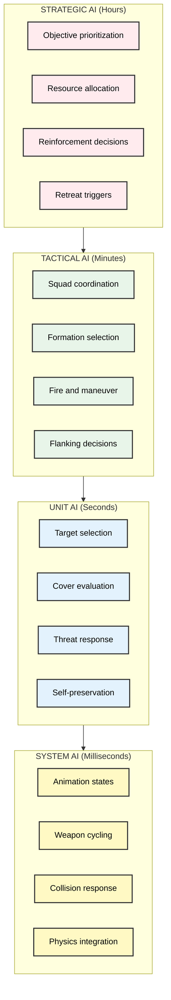
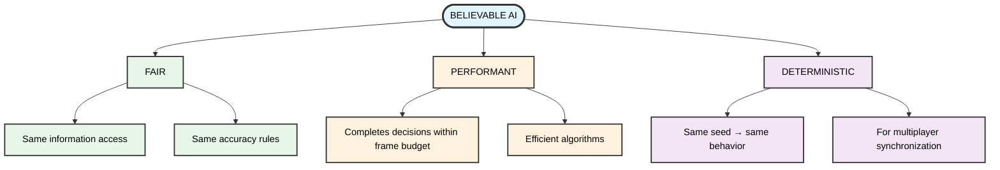
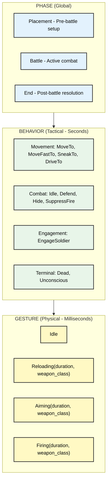
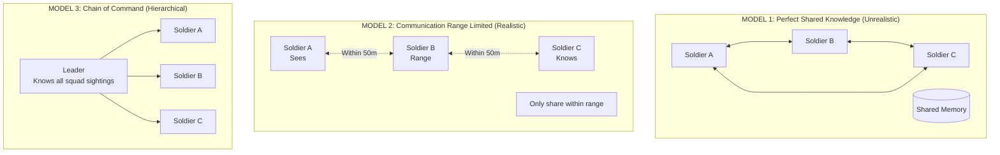
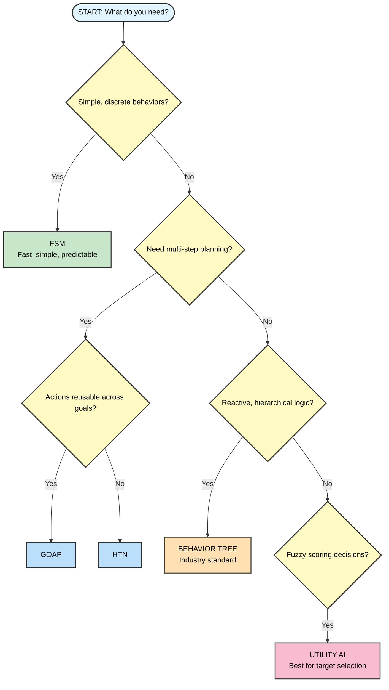
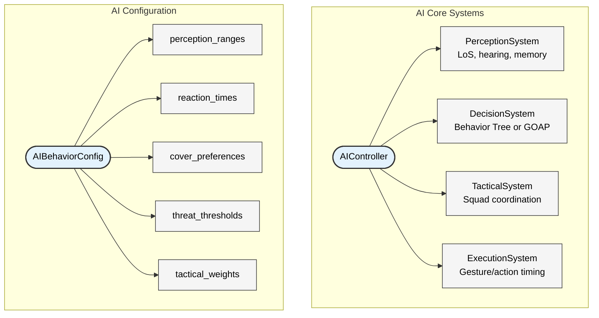

# Chapter 14: AI Systems in Tactical Wargames

## 14.1 The AI Landscape in Tactical Wargames

### 14.1.1 Introduction: Why AI Matters

Artificial Intelligence shapes player experience in tactical wargames. While first-person shooters need AI opponents that appear intelligent for brief encounters, tactical wargames require AI that maintains believable behavior over extended engagements lasting minutes or hours. The challenge lies in creating opponents that respond to threats with appropriate caution, seize opportunities with tactical cunning, and make occasional human-like mistakes.

The three Close Combat clones in this book demonstrate different approaches to AI sophistication:

| Project         | AI Approach                | Autonomy Level      | Key Innovation                        |
| --------------- | -------------------------- | ------------------- | ------------------------------------- |
| **OpenCombat-SDL**  | No autonomous AI           | Pure obedience      | Automatic prerequisite handling       |
| **OpenCombat**      | Reactive self-preservation | Tactical initiative | "Feeling" system for emotional states |
| **CloseCombatFree** | State-based triggers       | Minimal autonomy    | Visual feedback integration           |

### 14.1.2 The Four AI Types in Tactical Games

Tactical wargames require multiple AI systems operating at different scales:

#### **System AI (Milliseconds)**
Handles low-level behaviors:
- Animation state machines
- Physics interactions
- Collision responses
- Weapon cycling and reloading

#### **Unit AI (Seconds)**
Controls individual soldiers or vehicles:
- Target selection and engagement
- Cover seeking and position evaluation
- Threat response (return fire, suppression)
- Self-preservation behaviors

#### **Tactical AI (Minutes)**
Coordinates small groups (squads, fire teams):
- Formation maintenance
- Fire and maneuver tactics
- Suppression and flanking
- Casualty response and reorganization

#### **Strategic AI (Hours)**
Manages high-level battle planning:
- Objective prioritization
- Resource allocation
- Reinforcement decisions
- Retreat and regroup triggers



### 14.1.3 The Four Challenges of Tactical AI

Effective tactical AI balances four requirements:

#### **Believability**
AI behavior must align with player expectations:
- Units use cover appropriately
- Suppression affects behavior
- Soldiers show self-preservation instincts
- Tactical mistakes appear human

#### **Fairness**
AI should not frustrate players with unfair advantages:
- Information access is limited by fog of war
- Accuracy follows the same rules as player units
- Reaction times remain realistic
- Resources are constrained

#### **Performance**
AI calculations must not slow real-time simulation:
- Pathfinding completes within frame budgets
- Target evaluation uses efficient algorithms
- Decision trees minimize branching
- Spatial queries use acceleration structures

#### **Determinism**
For multiplayer and replay systems, AI must be predictable:
- Same inputs produce same outputs
- Random decisions use seeded generators
- Timing is frame-rate independent
- Floating-point operations remain consistent



**Constraint Definitions:**
- **Believable**: Uses cover, shows fear, makes human-like mistakes
- **Fair**: Same information access, same accuracy rules
- **Performant**: Completes decisions within frame budget
- **Deterministic**: Same seed → same behavior (for multiplayer)

---

## 14.2 The Three AI Architectures Compared

### 14.2.1 OpenCombat-SDL: Rule-Based with State Machines

OpenCombat-SDL uses the simplest AI approach: no autonomous AI. Every action requires explicit player orders.

```cpp
void Soldier::Simulate(long dt, World* world) {
    if (!_orders.empty()) {
        ProcessOrder();
    } else {
        // Idle—no autonomous behavior
        // Soldier simply waits for next command
    }
}
```

**Design Philosophy**: The player controls everything. Soldiers act as extensions of player will.

**Architecture Characteristics**:
- **State Representation**: 64-bit bitfield allowing orthogonal state composition
- **Decision Making**: Explicit player commands only
- **Prerequisite Handling**: Automatic action chaining (e.g., prone → stand → reload → fire)
- **Visual Feedback**: Action markers show current execution

**Advantages**:
- Predictable behavior
- Player maintains full control
- Eliminates "AI did something stupid" frustration
- Easy debugging and balancing

**Disadvantages**:
- Heavy micromanagement burden
- Unrealistic as real soldiers take initiative
- Doesn't scale to large unit counts
- No emergent gameplay from AI interactions

### 14.2.2 CloseCombatFree: Behavioral State Triggers

CloseCombatFree implements minimal AI through state-based triggers.

```cpp
// States exist but minimal logic
if (unitStatus == "DEFENDING") {
    // Will fire at enemies in range
    // No complex decision making
}

if (unitStatus == "AMBUSHING") {
    // Will fire when enemy enters detection radius
    // No flanking or repositioning
}
```

**Design Philosophy**: Simple state triggers provide basic automation while keeping player control.

**Architecture Characteristics**:
- **State Representation**: String-based unitStatus property
- **Decision Making**: State-based triggers (Defend, Ambush)
- **Prerequisite Handling**: Animation-driven completion
- **Visual Feedback**: Order markers with color coding

**Available States**:
| State     | AI Behavior              | Trigger        |
| --------- | ------------------------ | -------------- |
| READY     | None                     | Default        |
| DEFENDING | Fire at enemies in arc   | Player command |
| AMBUSHING | Fire when enemy detected | Player command |
| MOVING    | Follow path              | Player order   |
| FIRING    | Execute attack           | Player order   |

**Limitations**:
- No target selection AI
- No cover seeking
- No suppression response
- No threat assessment

### 14.2.3 OpenCombat: Reactive Perception + Proactive Planning

OpenCombat implements the most sophisticated AI of the three clones, featuring a "Feeling" system that drives emotional states and reactive behaviors.

```rust
fn tick_soldiers(&mut self) {
    for soldier_idx in self.all_soldiers() {
        let soldier = self.soldier(soldier_idx);

        // Check for threats
        if let Some(threat) = self.find_nearest_enemy(soldier) {
            if self.can_see(soldier_idx, threat) {
                // Override to engage
                self.change_behavior(
                    soldier_idx,
                    Behavior::EngageSoldier(threat)
                );
            }
        }

        // Check if under fire
        if soldier.under_fire == Feeling::Danger {
            // Find cover
            if let Some(cover_pos) = self.find_cover(soldier) {
                self.change_behavior(
                    soldier_idx,
                    Behavior::Hide(cover_pos.direction)
                );
            }
        }
    }
}
```

**Design Philosophy**: Soldiers have self-preservation instincts but remain loyal to player intent when not threatened.

**Architecture Characteristics**:
- **State Representation**: Three-tier hierarchy (Phase → Behavior → Gesture)
- **Decision Making**: Threat evaluation with behavior overrides
- **Prerequisite Handling**: Gesture timing system
- **Emotional Model**: Feeling enum with intensity levels

**The Feeling System**:
```rust
enum Feeling {
    UnderFire(intensity: u32),  // 0-200 scale
}

const UNDER_FIRE_TICK: u32 = 10;       // Decay per frame
const UNDER_FIRE_DANGER: u32 = 150;    // Threshold for danger response
const UNDER_FIRE_WARNING: u32 = 100;   // Threshold for caution

fn update_feeling(soldier: &mut Soldier, world: &World) {
    // Increase from nearby explosions
    for explosion in &world.recent_explosions {
        let distance = distance(soldier.position, explosion.position);
        if distance < 5.0 {
            soldier.under_fire.increase(150);
        } else if distance < 10.0 {
            soldier.under_fire.increase(100);
        } else {
            soldier.under_fire.increase(50);
        }
    }

    // Increase from bullet impacts
    for bullet in &world.recent_bullets {
        let distance = distance(soldier.position, bullet.impact);
        if distance < 3.0 {
            soldier.under_fire.increase(100);
        } else if distance < 10.0 {
            soldier.under_fire.increase(35);
        } else {
            soldier.under_fire.increase(1);
        }
    }

    // Natural decay
    soldier.under_fire.decrease(UNDER_FIRE_TICK);
}
```

**Behavior Hierarchy**:


**AI Behaviors**:

| Situation           | Response                           | Priority               |
| ------------------- | ---------------------------------- | ---------------------- |
| Under heavy fire    | Seek cover or return fire          | 100 (Survival)         |
| Enemy spotted       | Engage if in range                 | 50 (Combat)            |
| Squad leader killed | Promote new leader                 | 75 (Cohesion)          |
| Out of ammo         | Reload (blocking)                  | 90 (Readiness)         |
| Wounded             | Continue or retreat (morale check) | 80 (Self-preservation) |

### 14.2.4 Comparative Summary

| Aspect            | OpenCombat-SDL       | CloseCombatFree | OpenCombat           |
| ----------------- | -------------------- | --------------- | -------------------- |
| **AI Philosophy**     | Pure obedience       | State triggers  | Reactive + proactive |
| **Autonomy Level**    | None                 | Minimal         | Tactical             |
| **Decision System**   | Player commands only | State-based     | Threat evaluation    |
| **Self-Preservation** | No                   | No              | Yes (Feeling system) |
| **Cover Seeking**     | Manual               | No              | Automatic            |
| **Target Selection**  | Manual               | Basic range     | Dynamic evaluation   |
| **Implementation**    | C++ bitfield         | C++ strings     | Rust enums           |
| **Complexity**        | Low                  | Very Low        | Medium               |

---

## 14.3 Perception Systems

### 14.3.1 What Can AI Perceive?

In tactical wargames, AI perception defines the boundary between fair challenge and frustrating omniscience. The system determines what information AI-controlled units can access.

#### **Visual Perception**
AI can "see":
- Enemy units within line of sight
- Terrain features and obstacles
- Weapon effects (muzzle flashes, tracers)
- Movement and posture changes

#### **Auditory Perception**
AI can "hear":
- Gunfire and explosions (direction and distance)
- Vehicle engines
- Footsteps (close range)
- Shouted orders and radio chatter

#### **Tactile/Environmental Perception**
AI can "feel":
- Nearby explosions (concussion)
- Bullet impacts (suppression)
- Ground vibrations (vehicle movement)
- Temperature (fire, smoke)

#### **Knowledge-Based Perception**
AI "knows":
- Last known enemy positions
- Squad member locations
- Objective locations
- Terrain hazards

### 14.3.2 Line of Sight (LoS) Calculations

Accurate line of sight calculation forms the foundation of visual perception. The three clones implement LoS with varying sophistication:

**CloseCombatFree Implementation**:
```cpp
bool CcfEngineHelpers::isObstacleInLOS(QList<QObject *> items, qreal x1, qreal y1,
                                        qreal x2, qreal y2, QObject *currentUnit) {
    qreal distance = targetDistance(x1, y1, x2, y2);
    qreal a = (y2 - y1) / (x2 - x1);  // Slope
    qreal b = y1 - (a * x1);           // Intercept

    // Sample points along the line
    for (int i = 0; i < distance; ++i) {
        qreal x = (x2 >= x1) ? x1 + i : x1 - i;
        qreal y = (a * x) + b;

        // Check collision with all items
        for (int j = 0; j < items.length(); ++j) {
            QObject *item = items.at(j);
            if (item == currentUnit) continue;

            // AABB collision detection
            if (pointInRect(x, y, item)) {
                return true;  // Obstacle found
            }
        }
    }
    return false;
}
```

**Optimization Strategies**:
1. **Spatial Partitioning**: Divide map into grids for faster queries
2. **Ray Marching**: Sample at fixed intervals rather than every pixel
3. **Height Fields**: Use terrain elevation data for over/under checks
4. **Caching**: Store LoS results for static geometry

### 14.3.3 OpenCombat's "Feeling" System

OpenCombat's Feeling system abstracts sensory input into emotional states that drive behavior.

```rust
enum Feeling {
    UnderFire(intensity: u32),  // 0-200 scale
}

struct Soldier {
    under_fire: Feeling,
    last_known_enemies: Vec<EnemyContact>,
    suppression_level: f32,
}
```

**Sensory Input Sources**:

| Source              | Effect on Feeling | Range            |
| ------------------- | ----------------- | ---------------- |
| Explosion < 5m      | +150 intensity    | Immediate danger |
| Explosion 5-10m     | +100 intensity    | Nearby threat    |
| Explosion > 10m     | +50 intensity     | Distant threat   |
| Bullet impact < 3m  | +100 intensity    | Direct fire      |
| Bullet impact 3-10m | +35 intensity     | Close fire       |
| Bullet impact > 10m | +1 intensity      | Distant fire     |

**Behavior Triggers**:
```rust
fn evaluate_threat_response(soldier: &Soldier) -> Option<Behavior> {
    match soldier.under_fire.intensity {
        150..=200 => {
            // Critical danger - seek cover immediately
            find_immediate_cover(soldier)
        }
        100..=149 => {
            // Warning level - proceed with caution
            if soldier.has_good_cover {
                None  // Stay in cover
            } else {
                find_better_cover(soldier)
            }
        }
        _ => None,  // No immediate threat
    }
}
```

### 14.3.4 Information Sharing (Squad Coordination)

Real soldiers communicate threats and observations. AI systems model this through information sharing:



**Implementation Example**:
```rust
fn share_contact_info(squad: &mut Squad, world: &World) {
    let leader = world.soldier_mut(squad.leader);

    // Collect all sightings from squad members
    let mut all_contacts: Vec<EnemyContact> = Vec::new();

    for member_idx in &squad.members {
        let member = world.soldier(*member_idx);
        for contact in &member.visible_enemies {
            all_contacts.push(contact.clone());
        }
    }

    // Distribute shared knowledge to all members
    for member_idx in &squad.members {
        let member = world.soldier_mut(*member_idx);
        for contact in &all_contacts {
            if !member.knows_about(contact) {
                member.add_contact(contact.clone());
            }
        }
    }
}
```

### 14.3.5 Fog of War for AI

To ensure fair play, AI should operate under the same fog of war constraints as human players:

```rust
struct FogOfWar {
    revealed_tiles: HashSet<GridPosition>,
    last_seen: HashMap<EntityId, (Position, Time)>,
    suspicion_level: HashMap<GridPosition, f32>,
}

impl FogOfWar {
    fn can_see(&self, entity: &Entity, target: &Entity) -> bool {
        // Check if target position was ever revealed
        if !self.revealed_tiles.contains(&target.position.to_grid()) {
            return false;
        }

        // Check if position is currently visible
        if !has_line_of_sight(entity.position, target.position) {
            // Can only see if we have recent memory
            if let Some((_, time)) = self.last_seen.get(&target.id) {
                if time.elapsed() < Duration::from_secs(30) {
                    return true;  // Memory of recent position
                }
            }
            return false;
        }

        true
    }

    fn update(&mut self, viewer: &Entity, world: &World) {
        // Reveal tiles within view radius
        for pos in iterate_view_cone(viewer.position, viewer.facing, viewer.view_distance) {
            self.revealed_tiles.insert(pos);
        }

        // Update last seen positions for visible enemies
        for enemy in world.visible_enemies(viewer) {
            self.last_seen.insert(enemy.id, (enemy.position, Time::now()));
        }
    }
}
```

**AI Cheating Prevention**:
- AI cannot target enemies it cannot see
- AI uses last known position for area fire only
- AI must scout to reveal unknown areas
- AI accuracy suffers when firing at suspected versus confirmed targets

---

## 14.4 Decision Making

### 14.4.1 Overview of Decision Architectures

Modern game AI uses several architectural patterns for decision-making, each suited to different tactical needs:

| Architecture          | Best For                            | Complexity | Emergence |
| --------------------- | ----------------------------------- | ---------- | --------- |
| **Behavior Trees**        | Reactive behaviors, clear structure | Medium     | Low       |
| **GOAP**                  | Multi-step planning, complex goals  | High       | High      |
| **Utility AI**            | Fuzzy decisions, scoring actions    | Medium     | Medium    |
| **Finite State Machines** | Simple, discrete states             | Low        | Low       |
| **HTN**                   | Hierarchical task decomposition     | High       | Medium    |

### 14.4.2 Behavior Trees

Behavior Trees structure AI logic as a tree of hierarchical behaviors with standardized execution patterns.

**Node Types**:

```pseudocode
// Selector: Tries children until one succeeds
class Selector extends BTNode
    children: List<BTNode>

    function Execute(context)
        for child in children
            result = child.Execute(context)
            if result == Success
                return Success
            else if result == Running
                return Running
        return Failure

// Sequence: Executes children until one fails
class Sequence extends BTNode
    children: List<BTNode>

    function Execute(context)
        for child in children
            result = child.Execute(context)
            if result == Failure
                return Failure
            else if result == Running
                return Running
        return Success

// Condition: Checks world state
class Condition extends BTNode
    predicate: Function<Context, bool>

    function Execute(context)
        if predicate(context)
            return Success
        else
            return Failure

// Action: Performs game action
class Action extends BTNode
    action: Function<Context, Status>

    function Execute(context)
        return action(context)
```

**Example: Soldier Behavior Tree**:

```pseudocode
class SoldierBehaviorTree
    function BuildTree()
        return Selector([
            // Priority 1: React to immediate danger
            Sequence([
                Condition(IsUnderHeavyFire),
                Selector([
                    Sequence([
                        Condition(HasNearbyCover),
                        Action(MoveToCover)
                    ]),
                    Action(ReturnFire)
                ])
            ]),

            // Priority 2: Engage visible enemies
            Sequence([
                Condition(CanSeeEnemy),
                Action(EngageTarget)
            ]),

            // Priority 3: Follow orders
            Sequence([
                Condition(HasPendingOrder),
                Action(ExecuteCurrentOrder)
            ]),

            // Priority 4: Idle behavior
            Action(IdleScan)
        ])
```

**Advantages**:
- The structure is visual and intuitive
- Debugging and modification are straightforward
- Performance scales well (O(depth) per tick)
- Industry standard in engines like Unreal and Unity

**Disadvantages**:
- Long-term planning can become unwieldy
- The system is reactive by default
- All possible behaviors must be manually structured

### 14.4.3 Goal-Oriented Action Planning (GOAP)

GOAP reverses the decision-making process. Instead of checking conditions top-down, the AI plans backward from goals.

```pseudocode
class WorldState
    facts: Map<String, Value>

    function DistanceTo(otherState)
        differences = 0
        for key in facts.keys
            if facts[key] != otherState.facts[key]
                differences += 1
        return differences

class Action
    name: String
    cost: float
    preconditions: Map<String, Value>
    effects: Map<String, Value>

    function IsValid(state)
        for key, value in preconditions
            if state.Get(key) != value
                return false
        return true

    function Apply(state)
        newState = state.Clone()
        for key, value in effects
            newState.Set(key, value)
        return newState

class GOAPPlanner
    function Plan(currentState, goalState, availableActions)
        openSet = PriorityQueue()
        openSet.Add(Node(currentState, [], 0))

        while not openSet.empty()
            current = openSet.Pop()

            if current.state == goalState
                return current.actions

            for action in availableActions
                if action.IsValid(current.state)
                    newState = action.Apply(current.state)
                    newActions = current.actions + [action]
                    cost = current.cost + action.cost
                    heuristic = newState.DistanceTo(goalState)

                    openSet.Add(Node(newState, newActions, cost + heuristic))

        return null  // No plan found
```

**Example: Soldier GOAP Domain**:

```pseudocode
// World State Facts
enum Fact
    HasWeaponLoaded
    IsInCover
    IsSafe
    CanSeeEnemy
    EnemyDead
    IsReloading

// Available Actions
actions = [
    Action(
        name: "Reload",
        cost: 3.0,
        preconditions: {IsReloading: false},
        effects: {HasWeaponLoaded: true}
    ),

    Action(
        name: "MoveToCover",
        cost: 2.0,
        preconditions: {IsInCover: false},
        effects: {IsInCover: true, IsSafe: true}
    ),

    Action(
        name: "EngageEnemy",
        cost: 1.0,
        preconditions: {
            CanSeeEnemy: true,
            HasWeaponLoaded: true
        },
        effects: {EnemyDead: true}
    ),

    Action(
        name: "TakeCover",
        cost: 0.5,
        preconditions: {IsInCover: false, IsUnderFire: true},
        effects: {IsInCover: true, IsSafe: true}
    )
]

// Example planning
function ReactToContact(soldier, world)
    currentState = WorldState({
        HasWeaponLoaded: soldier.weapon.loaded,
        IsInCover: soldier.isInCover,
        IsSafe: not soldier.underFire,
        CanSeeEnemy: CanSeeEnemy(soldier, world)
    })

    goalState = WorldState({
        IsSafe: true,
        EnemyDead: true
    })

    plan = GOAPPlanner.Plan(currentState, goalState, actions)

    if plan
        ExecutePlan(plan)
    else
        ExecuteAction(MoveToCover)
```

**Advantages**:
- Behavior emerges from action combinations
- Handles complex, multi-step planning well
- New actions integrate without restructuring
- The system is proactive

**Disadvantages**:
- Computational cost is higher (A* search)
- Plans may appear unrealistic
- Cost tuning requires care
- Debugging planned sequences can be difficult

### 14.4.4 Utility AI (Scoring Actions)

Utility AI evaluates all possible actions and selects the highest-scoring option based on context.

```pseudocode
class UtilityAI
    actions: List<ScoredAction>

    function SelectAction(context): Action
        bestAction = null
        bestScore = -infinity

        for action in actions
            score = action.CalculateScore(context)
            if score > bestScore
                bestScore = score
                bestAction = action

        return bestAction

class ScoredAction
    name: String
    considerations: List<Consideration>

    function CalculateScore(context): float
        score = 1.0

        for consideration in considerations
            score *= consideration.Evaluate(context)
            if score < 0.01  // Early exit for very low scores
                return 0.0

        return score

class Consideration
    input: Function<Context, float>  // Raw value from world
    curve: ResponseCurve             // How to transform value
    weight: float                    // Importance multiplier

    function Evaluate(context): float
        rawValue = input(context)
        curvedValue = curve.Evaluate(rawValue)
        return curvedValue * weight
```

**Example: Target Selection**:

```pseudocode
class EngageTargetAction extends ScoredAction
    considerations = [
        // Distance consideration (closer is better)
        Consideration(
            input: DistanceToTarget,
            curve: InverseLinear(0, 100),  // Score 1.0 at 0m, 0.0 at 100m
            weight: 1.0
        ),

        // Threat consideration (higher threat is better target)
        Consideration(
            input: TargetThreatLevel,
            curve: Linear(0, 100),  // Score 0.0 at low threat, 1.0 at high
            weight: 0.8
        ),

        // Visibility consideration (must be visible)
        Consideration(
            input: CanSeeTarget,
            curve: Step(0.9),  // 0.0 if < 0.9 visibility, 1.0 otherwise
            weight: 1.0  // Critical - must see to engage
        ),

        // Cover consideration (prefer targets not in heavy cover)
        Consideration(
            input: TargetCoverQuality,
            curve: InverseLinear(0, 100),  // Lower cover = higher score
            weight: 0.5
        )
    ]

// Example usage
function SelectTarget(soldier, visibleEnemies)
    engageAction = EngageTargetAction()

    bestTarget = null
    bestScore = 0.0

    for enemy in visibleEnemies
        context = EngagementContext(soldier, enemy)
        score = engageAction.CalculateScore(context)

        if score > bestScore
            bestScore = score
            bestTarget = enemy

    return bestTarget
```

**Response Curves**:

```pseudocode
enum CurveType
    Linear          // y = x
    InverseLinear   // y = 1 - x
    Quadratic       // y = x²
    InverseQuad     // y = 1 - x²
    Logistic        // S-curve
    Step            // Threshold function

class ResponseCurve
    type: CurveType

    function Evaluate(x: float): float
        x = clamp(x, 0.0, 1.0)

        switch type
            case Linear: return x
            case InverseLinear: return 1.0 - x
            case Quadratic: return x * x
            case InverseQuad: return 1.0 - (x * x)
            case Logistic: return 1.0 / (1.0 + exp(-10 * (x - 0.5)))
            case Step(threshold): return x >= threshold ? 1.0 : 0.0
```

### 14.4.5 Finite State Machines (FSM)

FSMs offer the simplest approach, working well for basic behaviors but struggling with complexity.

```pseudocode
enum SoldierState
    Idle
    Moving
    Engaging
    TakingCover
    Reloading
    Dead

class FSMController
    currentState: SoldierState

    function Update(soldier, world)
        switch currentState
            case Idle:
                if CanSeeEnemy(soldier, world)
                    TransitionTo(Engaging)
                else if soldier.underFire
                    TransitionTo(TakingCover)

            case Engaging:
                if not CanSeeEnemy(soldier, world)
                    TransitionTo(Idle)
                else if soldier.ammo <= 0
                    TransitionTo(Reloading)

            case Reloading:
                if ReloadComplete(soldier)
                    TransitionTo(Idle)

            case TakingCover:
                if Safe(soldier) and soldier.ammo > 0
                    TransitionTo(Idle)

    function TransitionTo(newState)
        OnExit(currentState)
        currentState = newState
        OnEnter(currentState)
```

**Advantages**:
- Simple to implement and understand
- Behavior is predictable
- Efficient (O(1) per update)
- Easy to debug

**Disadvantages**:
- State explosion occurs as complexity grows
- Transition logic becomes hard to maintain
- No support for concurrent behaviors
- Modifications risk breaking existing transitions

### 14.4.6 Hierarchical Task Networks (HTN)

HTN planners break down high-level goals into primitive tasks through method application.

```pseudocode
class Task
    name: String

class CompoundTask extends Task
    methods: List<Method>

class PrimitiveTask extends Task
    preconditions: Function<World, bool>
    effects: Function<World, World>
    cost: float

class Method
    name: String
    preconditions: Function<World, bool>
    subtasks: List<Task>

class HTNPlanner
    function Plan(rootTask, worldState)
        plan = []

        if Decompose(rootTask, worldState, plan)
            return plan
        else
            return null

    function Decompose(task, worldState, plan): bool
        if task is PrimitiveTask
            if task.preconditions(worldState)
                plan.Add(task)
                worldState = task.effects(worldState)
                return true
            else
                return false

        // Compound task - try methods
        for method in task.methods
            if method.preconditions(worldState)
                allSucceeded = true
                for subtask in method.subtasks
                    if not Decompose(subtask, worldState, plan)
                        allSucceeded = false
                        break

                if allSucceeded
                    return true

        return false
```

**Example: Squad Assault HTN**:

```pseudocode
// Compound Tasks
class AssaultObjective extends CompoundTask
    methods = [
        Method(
            name: "Standard Assault",
            preconditions: {squad.size >= 4},
            subtasks: [
                SuppressEnemy(),
                FlankEnemy(),
                ClearObjective()
            ]
        ),

        Method(
            name: "Reduced Force Assault",
            preconditions: {squad.size < 4},
            subtasks: [
                WaitForReinforcements(),
                SuppressEnemy(),
                ClearObjective()
            ]
        )
    ]

// Primitive Tasks
class SuppressEnemy extends PrimitiveTask
    preconditions = {hasAmmo: true}
    effects = {enemySuppressed: true}
    cost = 2.0

class ClearObjective extends PrimitiveTask
    preconditions = {enemySuppressed: true}
    effects = {objectiveSecure: true}
    cost = 3.0
```

### 14.4.7 Decision Architecture Selection Guide



---

## 14.5 Tactical AI

### 14.5.1 Squad Coordination

Tactical AI coordinates units to achieve objectives through synchronized action.

```pseudocode
class SquadTacticalAI
    function CoordinateSquad(squad, objective)
        // Assess situation
        threatLevel = AssessThreat(squad, objective)
        availableForces = CountEffectiveUnits(squad)

        // Select tactic based on situation
        if threatLevel > availableForces * 2
            ExecuteTactic(Retreat, squad, objective)
        else if threatLevel > availableForces
            ExecuteTactic(SuppressAndFlank, squad, objective)
        else
            ExecuteTactic(DirectAssault, squad, objective)

    function ExecuteTactic(tactic, squad, objective)
        switch tactic
            case SuppressAndFlank:
                // Split squad
                fireTeam = squad.GetFireTeam()
                assaultTeam = squad.GetAssaultTeam()

                // Suppression team establishes base of fire
                fireTeam.Order(SuppressFire(objective.enemyPosition))

                // Assault team flanks
                flankPosition = FindFlankingPosition(objective)
                assaultTeam.Order(MoveTo(flankPosition))

            case DirectAssault:
                squad.Order(Assault(objective))

            case Retreat:
                safePosition = FindRetreatPosition(squad)
                squad.Order(RetreatTo(safePosition))
```

### 14.5.2 Formation Management

Formations structure squad movement and positioning.

```pseudocode
enum Formation
    Column       // Single file, good for roads
    Line         // Extended front, good for assault
    Wedge        // V-shape, good for open terrain
    Diamond      // All-around security
    Staggered    // Alternating left/right offsets

class FormationManager
    function CalculatePositions(formation, center, facing, spacing)
        positions = []

        switch formation
            case Column:
                for i in 0..squadSize
                    offset = Vector2(0, -i * spacing)
                    positions[i] = center + Rotate(offset, facing)

            case Line:
                halfWidth = (squadSize - 1) * spacing / 2
                for i in 0..squadSize
                    offset = Vector2(i * spacing - halfWidth, 0)
                    positions[i] = center + Rotate(offset, facing)

            case Wedge:
                positions[0] = center + Forward(facing) * spacing  // Point
                for i in 1..squadSize
                    side = i % 2 == 0 ? 1 : -1
                    row = (i + 1) / 2
                    offset = Vector2(side * row * spacing, -row * spacing)
                    positions[i] = center + Rotate(offset, facing)

        return positions

    function MaintainFormation(squad, formation)
        idealPositions = CalculatePositions(formation, squad.center,
                                           squad.facing, squad.spacing)

        for i, soldier in squad.members
            if Distance(soldier.position, idealPositions[i]) > formationTolerance
                soldier.Order(MoveTo(idealPositions[i]))
```

**Formation Characteristics**:

| Formation | Best For                   | Vulnerability     | Speed  |
| --------- | -------------------------- | ----------------- | ------ |
| Column    | Roads, narrow paths        | Flank attacks     | Fast   |
| Line      | Assault, maximum firepower | Enfilade fire     | Slow   |
| Wedge     | Open terrain, all-around   | Concentrated fire | Medium |
| Diamond   | Defensive positions        | None (balanced)   | Slow   |
| Staggered | Cover-rich environments    | Aerial attack     | Medium |

### 14.5.3 Fire and Maneuver

The core tactical principle: some units provide covering fire while others advance.

```pseudocode
class FireAndManeuver
    function Execute(squad, objective)
        // Split into fire team and maneuver team
        fireTeam = squad.GetBestMarksmen(2)
        maneuverTeam = squad.GetRemaining()

        // Phase 1: Establish base of fire
        baseOfFire = FindBestOverwatchPosition(fireTeam, objective)
        fireTeam.Order(MoveTo(baseOfFire))

        WaitUntil(Positioned(fireTeam))

        // Phase 2: Suppress objective
        fireTeam.Order(SuppressFire(objective))

        // Phase 3: Maneuver team advances
        advancePositions = FindAdvancePositions(maneuverTeam, objective)

        for position in advancePositions
            maneuverTeam.Order(MoveTo(position))
            WaitUntil(CoveredByFire(fireTeam, maneuverTeam))

            // Check if suppression effective
            if not EffectiveSuppression(fireTeam)
                // Halt advance, suppress more
                maneuverTeam.Order(Hold())
                fireTeam.Order(IncreaseRateOfFire())

        // Phase 4: Assault
        maneuverTeam.Order(Assault(objective))

    function FindBestOverwatchPosition(team, objective)
        candidates = FindElevatedPositionsNear(objective, range: 50..100)

        bestPosition = null
        bestScore = -infinity

        for pos in candidates
            score = 0

            // Prefer positions with LoS to objective
            if HasLineOfSight(pos, objective)
                score += 100

            // Prefer positions with cover
            score += CoverQuality(pos) * 50

            // Prefer positions with retreat routes
            if HasMultipleRetreatPaths(pos)
                score += 25

            if score > bestScore
                bestScore = score
                bestPosition = pos

        return bestPosition
```

### 14.5.4 Cover Evaluation and Positioning

AI evaluates cover positions based on multiple factors.

```pseudocode
class CoverEvaluator
    function EvaluateCover(position, soldier, world): float
        score = 0.0

        // Factor 1: Protection from known threats
        for threat in soldier.knownEnemies
            if not HasLineOfSight(threat.position, position)
                score += 50  // Good cover blocks LoS
            else
                score -= 20  // Bad cover exposes soldier

        // Factor 2: Distance to current position
        distance = Distance(soldier.position, position)
        score -= distance * 0.5  // Prefer closer cover

        // Factor 3: Protection quality
        score += CoverThickness(position) * 30

        // Factor 4: Engagement potential
        for enemy in soldier.knownEnemies
            if HasLineOfSight(position, enemy.position)
                score += 10  // Can shoot from this position

        // Factor 5: Escape routes
        adjacentCover = CountAdjacentCoverPositions(position, radius: 20)
        score += adjacentCover * 5

        // Factor 6: Vulnerability to grenades
        if IsEnclosedSpace(position)
            score -= 20  // Risk of grenades

        return score

    function FindBestCover(soldier, world): Position
        candidates = FindCoverPositionsWithin(soldier.position, radius: 50)

        bestPosition = null
        bestScore = -infinity

        for pos in candidates
            score = EvaluateCover(pos, soldier, world)
            if score > bestScore
                bestScore = score
                bestPosition = pos

        return bestPosition
```

### 14.5.5 Suppression and Morale

Suppression mechanics create feedback loops where AI behavior degrades under fire.

```pseudocode
struct SuppressionState
    level: float  // 0.0 to 1.0
    source: Vector2  // Direction of suppression
    duration: float  // How long suppressed

class SuppressionSystem
    function ApplySuppression(soldier, source, intensity)
        soldier.suppression.level = min(1.0,
            soldier.suppression.level + intensity)
        soldier.suppression.source = source
        soldier.suppression.duration = 0

        // Trigger morale check
        if soldier.suppression.level > 0.7
            MoraleCheck(soldier)

    function UpdateSuppression(soldier, dt)
        if soldier.suppression.level > 0
            soldier.suppression.duration += dt

            // Natural decay
            soldier.suppression.level -= dt * 0.1

            // Effects based on suppression level
            if soldier.suppression.level > 0.5
                soldier.accuracy *= 0.5
                soldier.moveSpeed *= 0.7

            if soldier.suppression.level > 0.8
                // May freeze or retreat
                if Random() < 0.1 * dt
                    soldier.Order(TakeCover)

    function MoraleCheck(soldier)
        baseMorale = soldier.experience * 0.3 + soldier.leadership * 0.2
        suppressionPenalty = soldier.suppression.level * 50
        casualtiesPenalty = soldier.squad.casualties * 10

        moraleRoll = Random(0, 100)
        threshold = baseMorale - suppressionPenalty - casualtiesPenalty

        if moraleRoll > threshold
            // Failed morale check
            soldier.behavior = Flee or Surrender
```

---

## 14.6 Strategic AI

### 14.6.1 Higher-Level Decision Making

Strategic AI manages the broader battle plan, while tactical AI controls individual units and squads.

```pseudocode
class StrategicAI
    function MakeStrategicDecision(commander, battlefield, resources)
        // Evaluate current situation
        situation = AnalyzeSituation(battlefield)

        // Generate candidate strategies
        strategies = [
            Strategy(name: "Assault", action: PlanAssault),
            Strategy(name: "Defend", action: PlanDefense),
            Strategy(name: "Flank", action: PlanFlanking),
            Strategy(name: "Retreat", action: PlanRetreat)
        ]

        // Score each strategy
        bestStrategy = null
        bestScore = -infinity

        for strategy in strategies
            score = strategy.action.Evaluate(commander, battlefield, resources)
            if score > bestScore
                bestScore = score
                bestStrategy = strategy

        // Execute chosen strategy
        return bestStrategy.action.Execute(commander, battlefield, resources)
```

**Strategic Considerations**:

| Factor             | Weight | Evaluation                                |
| ------------------ | ------ | ----------------------------------------- |
| Force Ratio        | 1.0    | Friendly vs enemy strength                |
| Position Advantage | 0.8    | Cover, elevation, terrain                 |
| Morale             | 0.7    | Unit condition and experience             |
| Supply Status      | 0.6    | Ammunition and reinforcement availability |
| Time Pressure      | 0.5    | Mission time limits                       |
| Casualty Tolerance | 0.4    | Acceptable loss threshold                 |

### 14.6.2 Resource Allocation

Strategic AI distributes limited resources across the battlefield:

```pseudocode
class ResourceAllocator
    function AllocateResources(units, availableResources, priorities)
        allocations = Map<Unit, Resource>()

        // Phase 1: Critical needs (ammunition, medical)
        for unit in units
            if unit.ammoLevel < CRITICAL_AMMO_THRESHOLD
                allocations[unit] = Resource(type: Ammunition, priority: 100)

            if unit.casualties > 0 and not unit.hasMedicalSupport
                allocations[unit] = Resource(type: Medical, priority: 90)

        // Phase 2: Reinforce weak sectors
        weakSectors = IdentifyWeakSectors(units)
        for sector in weakSectors
            reinforcements = CalculateNeededReinforcements(sector)
            allocations[sector.commander] = Resource(
                type: Reinforcements,
                amount: reinforcements,
                priority: 70
            )

        // Phase 3: Support main effort
        mainEffort = IdentifyMainEffort(units)
        allocations[mainEffort] = Resource(
            type: FireSupport,
            priority: 80
        )

        return allocations
```

### 14.6.3 Mission Planning

Strategic AI breaks down mission objectives into tactical operations:

```pseudocode
class MissionPlanner
    function PlanMission(objective, availableForces, battlefield)
        plan = MissionPlan()

        // Phase 1: Reconnaissance
        plan.AddPhase(
            name: "Phase 1: Recon",
            tasks: [
                Task(type: Scout, position: objective.approaches),
                Task(type: Identify, target: enemyPositions)
            ]
        )

        // Phase 2: Approach and positioning
        plan.AddPhase(
            name: "Phase 2: Positioning",
            tasks: [
                Task(type: MoveTo, position: assaultPositions),
                Task(type: Establish, objective: BaseOfFire)
            ]
        )

        // Phase 3: Assault
        plan.AddPhase(
            name: "Phase 3: Assault",
            tasks: [
                Task(type: Suppress, target: objective),
                Task(type: Assault, objective: objective),
                Task(type: Consolidate, position: objective)
            ]
        )

        // Assign forces to phases
        for phase in plan.phases
            phase.assignedForces = AllocateForces(phase, availableForces)

        return plan
```

### 14.6.4 Reinforcement Learning (Optional Discussion)

Traditional AI relies on handcrafted rules, but reinforcement learning (RL) enables AI to learn optimal tactics through experience.

**RL for Tactical Decisions**:

```pseudocode
// Simplified RL concept (not implemented in clones)
class TacticalRLAgent
    state: TacticalState      // Position, cover, enemies, etc.
    action: TacticalAction    // Move, Shoot, Hide, etc.
    reward: float             // Casualties inflicted, survival, objective progress

    function ChooseAction(state): Action
        // Epsilon-greedy: explore or exploit
        if random() < epsilon
            return RandomAction()  // Explore
        else
            return QTable.BestAction(state)  // Exploit

    function Learn(state, action, reward, nextState)
        // Q-learning update
        oldQ = QTable.Get(state, action)
        maxNextQ = QTable.MaxQ(nextState)
        newQ = oldQ + alpha * (reward + gamma * maxNextQ - oldQ)
        QTable.Set(state, action, newQ)
```

**Challenges for Tactical RL**:
1. **State Space Size**: Tactical situations create enormous state spaces
2. **Credit Assignment**: Determining which action led to victory
3. **Training Time**: Requires millions of simulated battles
4. **Explainability**: RL agents operate as black boxes
5. **Determinism**: RL introduces non-determinism, problematic for multiplayer

**Practical RL Applications**:
- **Offline Training**: Train AI against itself in simulation
- **Behavioral Cloning**: Learn from human player replays
- **Hybrid Approach**: RL tunes parameters of scripted behaviors

---

## 14.7 Determinism in AI

### 14.7.1 Why Determinism Matters

Deterministic AI ensures:
- **Multiplayer Synchronization**: All clients see identical AI behavior
- **Replay Systems**: Recorded games play back exactly as they occurred
- **Debugging**: The same inputs always produce the same outputs, making bugs reproducible
- **Fairness**: Players experience consistent AI behavior across sessions

### 14.7.2 Sources of Non-Determinism

Common causes of non-determinism include:

1. **Floating-Point Operations**
   - Compilers may reorder operations differently
   - CPU architectures (x86 vs ARM) produce slightly different results
   - Vectorization alters operation order

2. **Random Number Generation**
   - Unseeded RNG generates different sequences each run
   - Thread-local RNG advances unpredictably
   - Hardware random sources are inherently non-deterministic

3. **Timing Dependencies**
   - Logic tied to frame rate
   - Real-time timers instead of simulation time
   - Async operations completing in unpredictable orders

4. **Data Structure Iteration**
   - Hash map iteration order varies by implementation
   - Unstable sorting algorithms
   - Pointer-based ordering

### 14.7.3 Achieving Determinism

**Use Fixed-Point Math**:
```pseudocode
// Instead of floating point
float distance = sqrt(dx*dx + dy*dy)  // Non-deterministic

// Use fixed-point integers
int32 distance = FixedPointSqrt(dx*dx + dy*dy)  // Deterministic

// Or use deterministic FP libraries that control rounding
```

**Seeded Random Number Generation**:
```pseudocode
class DeterministicRNG
    seed: uint64

    function Random(): float
        // Linear congruential generator (deterministic)
        seed = (seed * 1103515245 + 12345) % 2^31
        return seed / 2^31

    function RandomRange(min, max): float
        return min + Random() * (max - min)

    function SetSeed(newSeed)
        seed = newSeed

// Usage
rng = DeterministicRNG(seed: battleSeed + soldier.id)
decisionRoll = rng.RandomRange(0, 100)
```

**Simulation Time Instead of Real Time**:
```pseudocode
class SimulationClock
    currentTime: float  // Simulation seconds, not real seconds
    timeStep: float     // Fixed timestep (e.g., 1/60)

    function Tick()
        currentTime += timeStep

    function Now(): float
        return currentTime

// AI updates use simulation time
if (clock.Now() - lastDecisionTime) > decisionInterval
    MakeDecision()
```

**Deterministic Data Structures**:
```pseudocode
// Use sorted structures with deterministic ordering
sortedEnemies = enemies.SortBy(id)  // Sort by stable key

// Or iterate in deterministic order
for id in sortedEnemyIds
    enemy = enemies[id]
    // Process enemy...
```

### 14.7.4 Testing for Determinism

```pseudocode
class DeterminismTest
    function RunDeterminismTest(scenario, seed, frames)
        // Run simulation twice with same seed
        world1 = CreateWorld(scenario, seed)
        world2 = CreateWorld(scenario, seed)

        for i in 0..frames
            Update(world1)
            Update(world2)

            // Check state equality periodically
            if i % 60 == 0  // Every second at 60fps
                hash1 = HashWorldState(world1)
                hash2 = HashWorldState(world2)

                if hash1 != hash2
                    LogDivergence(world1, world2, i)
                    return false

        return true
```

---

## 14.8 AI Difficulty Levels

### 14.8.1 Dimensions of Difficulty

AI difficulty adjusts across several independent dimensions:

| Dimension           | Easy AI     | Normal AI  | Hard AI    |
| ------------------- | ----------- | ---------- | ---------- |
| **Accuracy**            | -30%        | 0%         | +15%       |
| **Reaction Time**       | 1.5s        | 0.8s       | 0.3s       |
| **Information**         | Limited FoV | Normal FoV | +25% range |
| **Tactical Skill**      | Basic       | Standard   | Advanced   |
| **Resource Efficiency** | Wasteful    | Normal     | Optimal    |

### 14.8.2 Implementation Approaches

**Parameter Modulation**:
```pseudocode
class AIDifficultyProfile
    accuracyModifier: float      // 0.7 to 1.15
    reactionTimeDelay: float     // 0.3s to 1.5s
    perceptionRangeMult: float   // 0.8 to 1.25
    coverEvaluationBias: float   // -0.2 to 0.2
    tacticalAggression: float    // 0.0 to 1.0

function CalculateShotAccuracy(baseAccuracy, difficulty)
    return baseAccuracy * difficulty.accuracyModifier

function EvaluateReaction(soldier, stimulus, difficulty)
    baseReaction = CalculateReactionTime(soldier, stimulus)
    return baseReaction + difficulty.reactionTimeDelay
```

**Behavior Restriction**:
```pseudocode
class TacticalAI
    function EvaluateTactics(squad, difficulty)
        allTactics = [
            DirectAssault,
            SuppressAndFlank,
            BoundAndOverwatch,
            RetreatAndReorganize
        ]

        // Filter tactics by difficulty
        allowedTactics = FilterByDifficulty(allTactics, difficulty)

        // Score available tactics
        bestTactic = null
        bestScore = -infinity

        for tactic in allowedTactics
            score = tactic.Evaluate(squad)
            if score > bestScore
                bestScore = score
                bestTactic = tactic

        return bestTactic
```

**Resource Cheating (Last Resort)**:
```pseudocode
// Hard AI gets subtle bonuses without player knowledge
function CalculateAmmunitionConsumption(difficulty, baseAmount)
    if difficulty == Easy
        return baseAmount * 1.2  // AI wastes ammo
    else if difficulty == Hard
        return baseAmount * 0.9  // AI conserves ammo
    else
        return baseAmount

// Avoid obvious cheating
// if difficulty == Hard
//     aiAccuracy = 1.0  // Perfect aim breaks immersion
```

### 14.8.3 Dynamic Difficulty Adjustment

For single-player campaigns, dynamic difficulty works well:

```pseudocode
class DynamicDifficultyAdjuster
    playerPerformanceHistory: List<float>  // Recent mission scores

    function UpdateDifficulty(currentDifficulty)
        avgPerformance = Average(playerPerformanceHistory[-5:])

        if avgPerformance < 0.3  // Player struggling
            newDifficulty = currentDifficulty.Easier()
            NotifyPlayer("Difficulty adjusted to help you succeed")
        else if avgPerformance > 0.8  // Player dominating
            newDifficulty = currentDifficulty.Harder()
            // Silent adjustment maintains player confidence

        return newDifficulty
```

---

## 14.9 Implementation Guide

### 14.9.1 Getting Started: Minimum Viable AI

For new projects, begin with the simplest implementation:

**Phase 1: FSM (Week 1)**
```pseudocode
enum State
    Idle
    Moving
    Attacking

function Update()
    switch state
        case Idle:
            if EnemyInRange()
                state = Attacking
        case Attacking:
            if not EnemyInRange()
                state = Idle
            else
                FireAtTarget()
```

**Phase 2: Add Perception (Week 2)**
- Line of sight checks
- Distance-based detection
- Simple cover evaluation

**Phase 3: Add Reactivity (Week 3-4)**
- Cover seeking under fire
- Basic suppression response
- Self-preservation behaviors

**Phase 4: Add Coordination (Month 2)**
- Squad-level tactics
- Formation management
- Fire and maneuver

**Phase 5: Polish (Ongoing)**
- Behavior trees for complex behaviors
- Utility AI for decision scoring
- Strategic layer

### 14.9.2 Recommended Architecture for New Projects

Based on analysis of three clones, a hybrid approach works best:



**Technology Stack Recommendations**:

| Component       | Recommended    | Alternatives     |
| --------------- | -------------- | ---------------- |
| Core AI         | Behavior Trees | GOAP, Utility    |
| Pathfinding     | A* + JPS       | Theta*, RRT      |
| Spatial Queries | Uniform Grid   | Quadtree, R-tree |
| Decision Making | Utility + BT   | Pure GOAP        |
| Scripting       | Lua            | C#, Python       |

### 14.9.3 Testing AI

**Unit Tests**:
```pseudocode
class AITestSuite
    function TestCoverSeeking()
        // Setup: Soldier under fire with nearby cover
        soldier = CreateSoldier(position: (100, 100))
        cover = CreateCover(position: (120, 100))
        enemy = CreateEnemy(position: (50, 100))

        // Simulate enemy fire
        FireAt(soldier, enemy)

        // Update AI
        for i in 0..10
            soldier.AI.Update()

        // Verify: Soldier should move to cover
        assert(IsInCover(soldier, cover))

    function TestDeterminism()
        // Setup: Same scenario, same seed
        world1 = CreateWorld(seed: 12345)
        world2 = CreateWorld(seed: 12345)

        // Run identical simulations
        for i in 0..100
            Update(world1)
            Update(world2)

        // Verify: States should be identical
        assert(world1.Hash() == world2.Hash())

    function TestSuppressionResponse()
        // Setup: Squad under heavy suppression
        squad = CreateSquad(size: 6)
        mg = CreateMachineGun()

        // Suppress with machine gun
        for i in 0..30
            SuppressFire(mg, squad.Center())

        // Verify: Squad should seek cover or retreat
        assert(CountInCover(squad) > 3 or IsRetreating(squad))
```

**Visual Debugging Tools**:

```pseudocode
class AIDebugVisualizer
    function DrawDebugInfo(renderer, world)
        for soldier in world.soldiers
            // Draw perception radius
            renderer.DrawCircle(soldier.position, soldier.perceptionRange, Color.Yellow)

            // Draw LoS to visible enemies
            for enemy in soldier.visibleEnemies
                if HasLineOfSight(soldier, enemy)
                    renderer.DrawLine(soldier.position, enemy.position, Color.Green)
                else
                    renderer.DrawLine(soldier.position, enemy.position, Color.Red)

            // Draw current behavior
            renderer.DrawText(soldier.position, soldier.currentBehavior.ToString())

            // Draw cover evaluation
            for cover in FindNearbyCover(soldier, radius: 50)
                score = EvaluateCover(cover, soldier, world)
                color = Lerp(Color.Red, Color.Green, score)
                renderer.DrawCircle(cover, 5, color)
```

### 14.9.4 Key Takeaways

1. Start simple with FSM or basic behavior trees, then add complexity
2. Keep perception, decision-making, and execution separate
3. Test determinism from the beginning if multiplayer matters
4. Debug visualizers are essential for AI development
5. Choose the right tool: behavior trees for reactivity, GOAP for planning, utility for fuzzy decisions
6. AI should challenge players without feeling omniscient
7. Use multiple difficulty knobs (accuracy, information, speed, tactics) for fine-tuning
8. Emotional modeling systems like OpenCombat's "Feeling" add believability
9. Combine individual AI with squad coordination for emergent tactics
10. Profile early—AI can become computationally expensive

---

## Chapter Summary

This chapter explored AI systems in tactical wargames through three Close Combat clones, each representing a different approach:

- **OpenCombat-SDL** shows that no AI can work when player control is the priority
- **CloseCombatFree** demonstrates how simple state triggers provide basic automation
- **OpenCombat** reveals how reactive systems with emotional modeling create believable soldier behaviors

Key architectural decisions for tactical AI include:
1. Perception systems that balance fairness with challenge
2. Decision architectures suited to complexity needs (Behavior Trees, GOAP, Utility AI)
3. Tactical coordination for squad operations
4. Strategic planning for higher-level battle management
5. Determinism for multiplayer and replay systems
6. Difficulty modulation through multiple tunable parameters

For new implementations, a hybrid approach combining systems-oriented core simulation with behavior trees for reactive behaviors and utility AI for decision scoring offers the best balance of power, flexibility, and maintainability.

---

*Next: [Chapter 15: Multiplayer Architecture for Tactical Wargames](chapter_15_multiplayer.md)*
