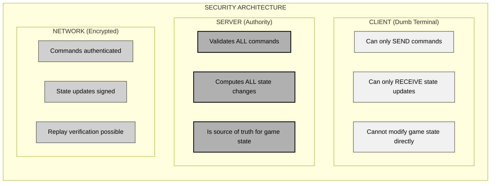
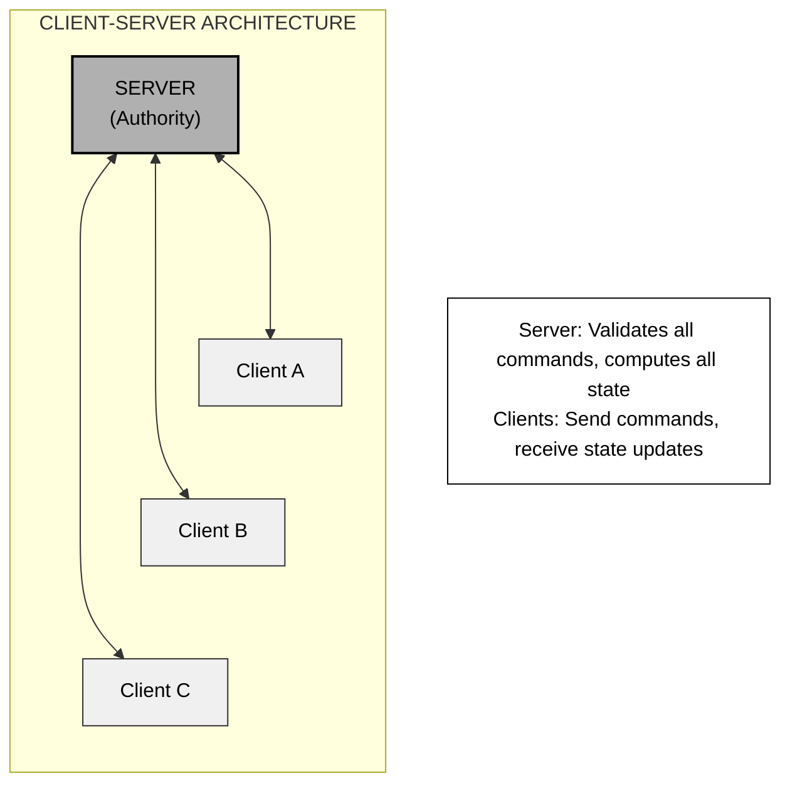
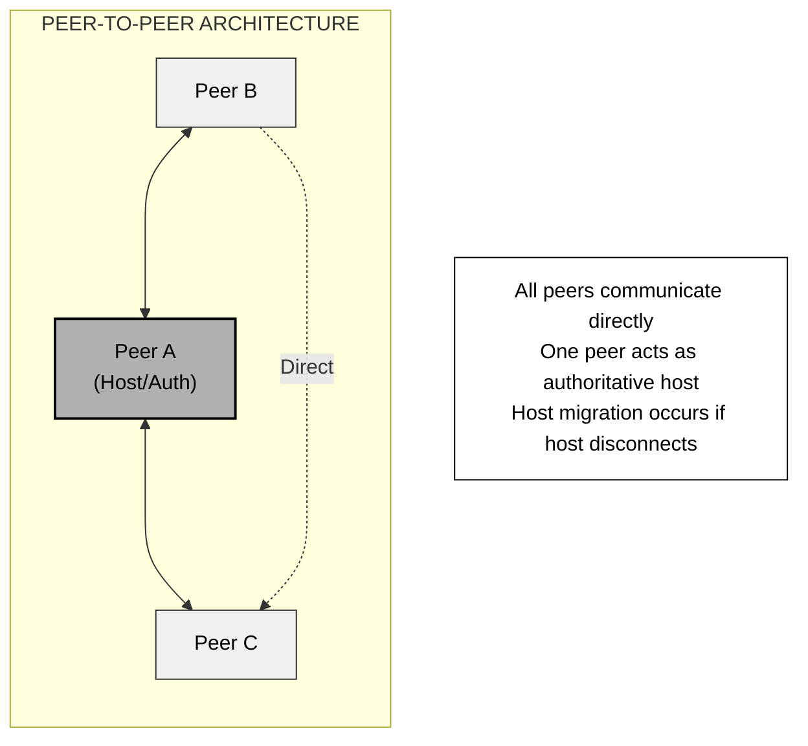
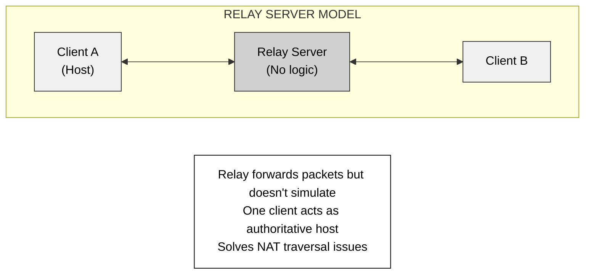
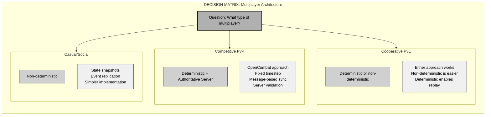
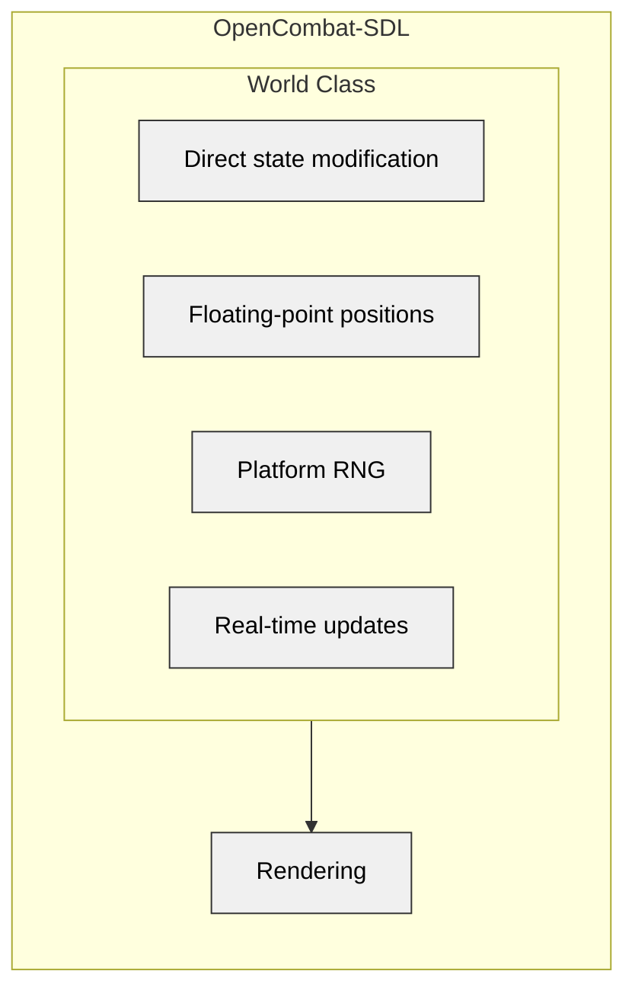
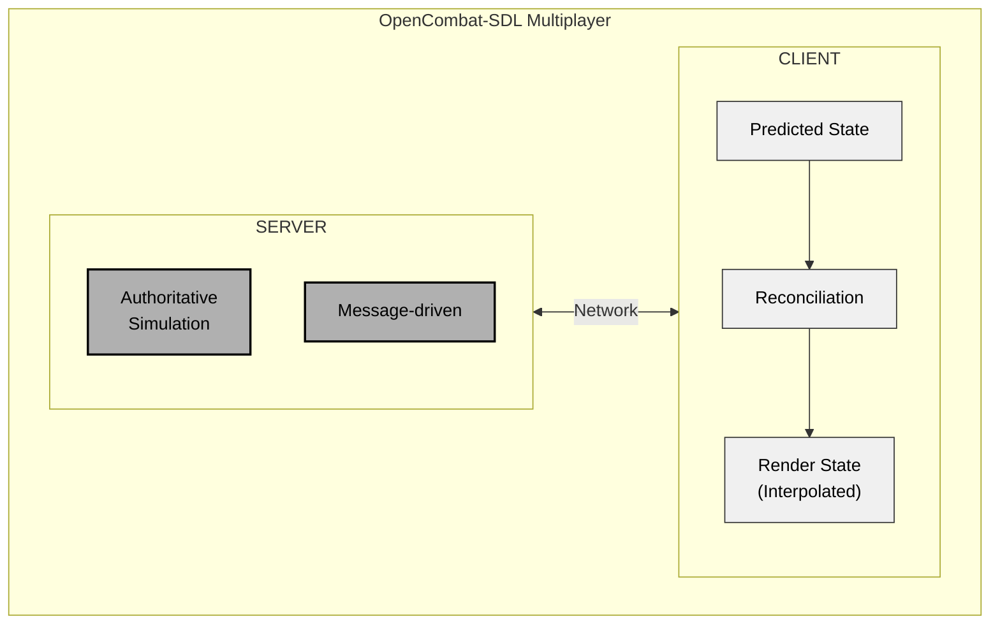

# Chapter 15: Multiplayer Architecture for Tactical Wargames

## Synchronization, Determinism, and Network Architecture

---

*"Adding multiplayer to a single-player game transforms a monologue into a conversation where both speakers must recite identical words simultaneously—without knowing each other's lines in advance."*

---

## 15.1 Why Multiplayer Changes Everything

Multiplayer isn't just another feature—it reshapes the entire architecture of a game. The three Close Combat clones demonstrate this clearly: OpenCombat-SDL and CloseCombatFree remain single-player, while OpenCombat was built from the ground up for networked play. This chapter explains why that early decision carries such weight.

### 15.1.1 The Determinism Requirement

Single-player games keep their simulation state in one place: the player's machine. They can freely use floating-point math, system timers, and platform-specific random number generators. Multiplayer breaks this model completely.

**The Core Problem**: When two players perform the same sequence of actions, they must reach identical game states. If Player A calculates a bullet hit at (100.5, 200.3) while Player B gets (100.500001, 200.299999), their simulations diverge. These tiny differences compound rapidly—within seconds, players experience completely different games.

**OpenCombat's Solution**: The Rust-based OpenCombat ensures determinism through:

```rust
// Fixed-point arithmetic for positions
pub struct WorldPoint {
    pub x: FixedPoint,  // 16.16 fixed-point, not float
    pub y: FixedPoint,
}

// Seeded RNG for combat
pub struct DeterministicRNG {
    state: u64,  // Same seed = same sequence across all platforms
}

impl DeterministicRNG {
    pub fn new(seed: u64) -> Self {
        Self { state: seed }
    }

    pub fn next(&mut self) -> u64 {
        // xorshift algorithm - identical on all platforms
        self.state ^= self.state << 13;
        self.state ^= self.state >> 7;
        self.state ^= self.state << 17;
        self.state
    }
}
```

**Why This Matters**: Deterministic simulation means only player inputs need to travel across the network. Each machine runs the simulation independently, producing identical results. This forms the foundation of all multiplayer synchronization strategies.

### 15.1.2 Latency Challenges

Tactical wargames face different latency challenges than fast-paced action games:

| Game Type            | Acceptable Latency | Input Frequency   | Latency Compensation   |
| -------------------- | ------------------ | ----------------- | ---------------------- |
| First-Person Shooter | < 100ms            | Continuous        | Client prediction      |
| Fighting Game        | < 50ms             | Discrete frames   | Rollback netcode       |
| RTS Game             | 150-300ms          | Discrete commands | Command delay          |
| Tactical Wargame     | 200-500ms          | Intermittent      | Deterministic lockstep |

**The Tactical Advantage**: The slower pace of tactical games works in their favor. When a player issues a "move to position" command, they expect a delay while the unit acknowledges and begins moving. The natural rhythm of tactical decision-making—seconds or minutes between significant actions—handles network latency better than twitch-based games.

This creates a design requirement: the game must feel responsive even with 200-500ms latencies. Developers need careful input acknowledgment and feedback systems:

```pseudocode
// Immediate feedback loop
onPlayerIssueOrder(order) {
    // 1. Show acknowledgment immediately (no network wait)
    ui.showOrderMarker(order.target)
    playAcknowledgmentSound()

    // 2. Send to server
    network.sendOrder(order)

    // 3. Optimistically update local state (client-side prediction)
    predictedState.apply(order)
}

onServerConfirmOrder(confirmedOrder) {
    // 4. Reconcile if prediction was wrong
    if predictedState != serverState {
        state = serverState  // Authoritative server always wins
    }
}
```

### 15.1.3 Synchronization Complexity

Synchronizing game state across multiple machines requires solving three distinct problems:

**Problem 1: State Consistency**
All clients must maintain identical game state through:
- Deterministic simulation (same inputs produce same outputs)
- Synchronized random number generators
- Fixed timestep updates
- No platform-specific behaviors

**Problem 2: Bandwidth Optimization**
A tactical wargame with 500 units contains thousands of state variables. Transmitting complete state 60 times per second isn't feasible.

**Problem 3: Latency Hiding**
Players must feel in control even when commands take 200ms to reach the server and another 200ms for results to return.

### 15.1.4 Security Concerns

Single-player games trust the client completely. Multiplayer games trust nothing.

**The Cheating Spectrum**:

| Cheat Type                    | Single-Player Impact | Multiplayer Impact | Detection Difficulty |
| ----------------------------- | -------------------- | ------------------ | -------------------- |
| Wallhacks (see through walls) | None                 | Severe             | Hard                 |
| Aimbots (perfect accuracy)    | None                 | Severe             | Medium               |
| Speed hacks                   | None                 | Severe             | Easy                 |
| Map hacks (reveal fog of war) | None                 | Severe             | Hard                 |
| Replay editing                | None                 | Moderate           | Easy                 |

**OpenCombat's Security Model**:



This server-authoritative architecture eliminates all client-side cheating. The client cannot modify game state—it can only request actions that the server validates and executes.

---

## 15.2 The Deterministic Simulation Approach (OpenCombat)

OpenCombat sets the standard for tactical wargame multiplayer architecture. Its message-based state updates with deterministic simulation provide a blueprint for networked tactical games.

### 15.2.1 Message-Based State Updates

OpenCombat never changes game state directly. All modifications flow through a message system:

```rust
// Core message enum - every state change is a message
pub enum BattleStateMessage {
    // Soldier-level updates
    Soldier(SoldierIndex, SoldierMessage),

    // Global game phase
    SetPhase(Phase),

    // Combat events
    PushBulletFire(BulletFire),
    PushExplosion(Explosion),

    // Terrain changes
    SetTerrainBlocking { grid_point: GridPoint, blocking: bool },

    // Entity lifecycle
    SoldierSpawn(Soldier),
    SoldierDespawn(SoldierIndex),
}

// Per-soldier messages
pub enum SoldierMessage {
    SetWorldPosition(WorldPoint),
    SetBehavior(Behavior),
    SetGesture(Gesture),
    SetOrientation(Angle),
    TakeDamage(f32),
    SetHealth(f32),
    SetUnderFire(u32),
}

// State application - the ONLY way to modify state
impl BattleState {
    pub fn apply(&mut self, msg: BattleStateMessage) {
        match msg {
            BattleStateMessage::Soldier(idx, soldier_msg) => {
                if let Some(soldier) = self.soldiers.get_mut(idx.0) {
                    soldier.apply(soldier_msg);
                }
            }
            BattleStateMessage::SetPhase(phase) => {
                self.phase = phase;
            }
            // ... other messages
        }
    }
}
```

**Why Messages?**

1. **Network Transparency**: Messages serialize naturally for network transmission
2. **Replay Capability**: Recording messages captures complete game history
3. **Debugging**: Message logs show exactly what changed and when
4. **Testing**: Developers can inject messages to test specific scenarios
5. **Determinism**: The same message sequence always produces the same state

### 15.2.2 Fixed Timestep Simulation

OpenCombat uses a fixed timestep to ensure determinism:

```rust
pub const TICK_RATE: u32 = 60;  // 60 FPS
pub const TICK_DURATION_MICROS: u64 = 1_000_000 / TICK_RATE as u64;  // 16,666 µs

pub struct SimulationLoop {
    last_tick: Instant,
    accumulator: Duration,
}

impl SimulationLoop {
    pub fn run(&mut self, state: &mut BattleState) {
        let now = Instant::now();
        let delta = now - self.last_tick;
        self.last_tick = now;

        self.accumulator += delta;

        // Fixed timestep: consume time in discrete chunks
        while self.accumulator >= Duration::from_micros(TICK_DURATION_MICROS) {
            // Collect all messages from this tick
            let messages = collect_messages();

            // Apply messages deterministically (sorted by priority)
            let sorted_messages = sort_by_priority(messages);

            for msg in sorted_messages {
                state.apply(msg);
            }

            // Run simulation systems
            update_physics(state);
            update_ai(state);
            update_combat(state);

            self.accumulator -= Duration::from_micros(TICK_DURATION_MICROS);
            state.frame_i += 1;
        }
    }
}
```

**Critical Rule**: Simulation logic must never depend on real time, frame rate, or platform-specific behaviors. Only the tick count matters.

### 15.2.3 Replay System

Deterministic simulation enables perfect replays:

```rust
pub struct Replay {
    initial_state: BattleState,
    messages: Vec<TimedMessage>,  // (frame_index, message)
    random_seed: u64,
}

pub struct TimedMessage {
    pub frame: u64,
    pub message: BattleStateMessage,
}

impl Replay {
    pub fn record(state: &BattleState) -> Self {
        Self {
            initial_state: state.clone(),
            messages: Vec::new(),
            random_seed: state.rng_seed,
        }
    }

    pub fn add_message(&mut self, frame: u64, msg: BattleStateMessage) {
        self.messages.push(TimedMessage { frame, message: msg });
    }

    pub fn playback(&self) -> BattleState {
        let mut state = self.initial_state.clone();
        state.rng = DeterministicRNG::new(self.random_seed);

        let mut msg_iter = self.messages.iter();
        let mut next_msg = msg_iter.next();

        loop {
            // Apply all messages for this frame
            while let Some(msg) = next_msg {
                if msg.frame == state.frame_i {
                    state.apply(msg.message.clone());
                    next_msg = msg_iter.next();
                } else {
                    break;
                }
            }

            // Run simulation tick
            update_physics(&mut state);
            update_ai(&mut state);
            update_combat(&mut state);

            state.frame_i += 1;

            // Check if replay complete
            if next_msg.is_none() {
                break;
            }
        }

        state
    }
}
```

---

## 15.3 Non-Deterministic Approaches

### 15.3.1 State Snapshot Synchronization

Some multiplayer games skip determinism and use state replication instead.

```pseudocode
class StateSnapshotSync {
    function SendFullState(state) {
        // Serialize entire state
        snapshot = Serialize(state)

        // Compress
        compressed = Compress(snapshot)

        // Broadcast to all clients
        for client in connectedClients {
            client.Send(compressed)
        }
    }

    function OnClientReceive(snapshot) {
        // Deserialize
        state = Deserialize(snapshot)

        // Apply (with interpolation to smooth)
        currentState = Interpolate(currentState, state, delta: 0.1)
    }
}
```

**When to Use**:
- Casual or social games where perfect synchronization isn't critical
- Small-scale multiplayer (2-4 players)
- Games with simple state (not hundreds of units)

**Disadvantages**:
- High bandwidth usage
- No replay capability
- Harder to debug
- Susceptible to cheating

### 15.3.2 Event Replication

Games can replicate events instead of synchronizing state.

```pseudocode
class EventReplication {
    function OnPlayerAction(action) {
        // Create event
        event = GameEvent {
            type: action.type,
            player: action.playerId,
            data: action.data,
            timestamp: GetNetworkTime()
        }

        // Broadcast to all clients
        BroadcastEvent(event)
    }

    function OnReceiveEvent(event) {
        // Queue for execution at appropriate time
        executionTime = event.timestamp + latencyCompensation
        eventQueue.Schedule(event, executionTime)
    }

    function Update() {
        // Execute due events
        while eventQueue.Peek().time <= currentTime {
            event = eventQueue.Pop()
            ExecuteEvent(event)
        }
    }
}
```

**Advantages**:
- Lower bandwidth than state snapshots
- Works well for discrete actions
- Easier to implement than determinism

**Disadvantages**:
- Events can arrive out of order
- Harder to recover from desync
- Still vulnerable to cheating

---

## 15.4 Network Architecture Patterns

### 15.4.1 Client-Server (Authoritative)

The standard for competitive multiplayer:



**Characteristics**:
- Server is the sole authority
- Clients act as "dumb terminals"
- Prevents client-side cheating
- Requires dedicated server infrastructure

### 15.4.2 Peer-to-Peer

Ideal for LAN or small-scale multiplayer:



**Advantages**:
- No dedicated server required
- Lower latency with direct connections
- Works well for LAN parties

**Disadvantages**:
- Host advantage (zero latency for the host)
- Harder to prevent cheating
- Host migration adds complexity
- Doesn't scale beyond 4-8 players

### 15.4.3 Relay Server (Listen Server)

A compromise between client-server and P2P:



**Use Cases**:
- Indie games without a dedicated server budget
- Early prototyping
- Games with low security requirements

### 15.4.4 Hybrid Approaches

Modern games often mix multiple approaches.

```pseudocode
class HybridNetworkManager {
    // Authoritative server for critical state
    AuthoritativeServer gameServer;

    // Client-side prediction for responsiveness
    ClientPrediction predictor;

    // P2P for non-critical data (voice chat, presence)
    PeerNetwork peerNetwork;

    function Update() {
        // Critical game state: authoritative server
        if (HasServerAuthority()) {
            serverState = gameServer.GetAuthoritativeState();
            ReconcileWithServer(serverState);
        }

        // Local responsiveness: client prediction
        if (IsLocalPlayer()) {
            predictedState = predictor.PredictNextState();
            Render(predictedState);
        }

        // Non-critical: P2P
        peerNetwork.BroadcastPresence();
    }
}
```

---

## 15.5 Dealing with Latency

### 15.5.1 Input Delay

A simple but effective method delays all inputs by a fixed amount.

```pseudocode
class InputDelaySystem {
    delayFrames: int = 6;  // 100ms at 60fps
    inputQueue: Queue<TimedInput>;

    function OnPlayerInput(input) {
        // Schedule for future execution
        executionFrame = currentFrame + delayFrames;
        inputQueue.Enqueue({
            frame: executionFrame,
            input: input
        });

        // Show feedback immediately
        ui.ShowInputFeedback(input);
    }

    function Update() {
        // Execute inputs that are due
        while inputQueue.Peek().frame == currentFrame {
            input = inputQueue.Dequeue();
            Execute(input);
        }
    }
}
```

**Pros**: Simple, deterministic, no misprediction
**Cons**: 100ms delay on all actions

### 15.5.2 Client-Side Prediction

Predict the outcome of local actions immediately.

```pseudocode
class ClientSidePrediction {
    Simulation localSimulation;      // What we think will happen
    Simulation serverSimulation;     // What server says happened

    function OnLocalInput(input) {
        // Apply immediately to local simulation
        localSimulation.Apply(input);

        // Send to server
        network.Send(input);

        // Render from local simulation (no lag!)
        Render(localSimulation);
    }

    function OnServerState(serverState) {
        // Check if prediction was correct
        if (localSimulation.Hash() != serverState.Hash()) {
            // Misprediction! Roll back and replay
            localSimulation = serverState;

            // Replay inputs since that state
            for input in unacknowledgedInputs {
                localSimulation.Apply(input);
            }
        }
    }
}
```

**Pros**: Feels responsive with zero perceived lag
**Cons**: Mispredictions cause jarring corrections

### 15.5.3 Server Reconciliation

The server has the final say, but the client predicts optimistically.

```pseudocode
class ServerReconciliation {
    Queue<Input> pendingInputs;  // Inputs not yet acknowledged
    Simulation authoritative;    // Server's state
    Simulation predicted;        // Client's prediction

    function OnPlayerInput(input) {
        // Store for reconciliation
        pendingInputs.Enqueue(input);

        // Apply to prediction
        predicted.Apply(input);

        // Send to server
        server.Send(input);
    }

    function OnServerUpdate(serverState, lastProcessedInput) {
        // Update authoritative state
        authoritative = serverState;

        // Remove acknowledged inputs
        while pendingInputs.Front().id <= lastProcessedInput {
            pendingInputs.Dequeue();
        }

        // Replay unacknowledged inputs on top of server state
        predicted = authoritative;
        for input in pendingInputs {
            predicted.Apply(input);
        }
    }
}
```

### 15.5.4 Entity Interpolation

For remote entities, interpolate between known positions.

```pseudocode
class EntityInterpolation {
    struct PositionSnapshot {
        Vector3 position;
        float timestamp;
    }

    Queue<PositionSnapshot> snapshotHistory;
    float interpolationDelay = 0.1;  // 100ms

    function OnServerSnapshot(snapshot) {
        snapshotHistory.Enqueue(snapshot);

        // Keep only recent history
        while snapshotHistory.Oldest().timestamp < currentTime - 1.0 {
            snapshotHistory.Dequeue();
        }
    }

    function GetInterpolatedPosition(): Vector3 {
        // Find two snapshots to interpolate between
        targetTime = currentTime - interpolationDelay;

        // Find snapshots before and after target time
        before = FindSnapshotBefore(targetTime);
        after = FindSnapshotAfter(targetTime);

        // Interpolate
        t = (targetTime - before.timestamp) / (after.timestamp - before.timestamp);
        return Lerp(before.position, after.position, t);
    }
}
```

**When to Use Each Technique**:

| Technique             | Use For              | Best Latency  |
| --------------------- | -------------------- | ------------- |
| Input Delay           | Turn-based, slow RTS | 100-300ms     |
| Client Prediction     | Local player only    | 0ms perceived |
| Server Reconciliation | Competitive games    | 50-100ms      |
| Entity Interpolation  | Remote entities      | 100-200ms     |

---

## 15.6 Synchronization Strategies

### 15.6.1 Lockstep Synchronization

All clients wait for each other before advancing.

```pseudocode
class LockstepSync {
    Map<PlayerId, Input> receivedInputs;
    bool waiting = false;

    function Update() {
        if (!waiting) {
            // Collect local input
            localInput = GetLocalInput();
            BroadcastInput(localInput);

            waiting = true;
        }

        // Check if we have all inputs
        if (receivedInputs.Count == totalPlayers) {
            // Execute all inputs deterministically
            for input in SortByPlayerId(receivedInputs) {
                simulation.Apply(input);
            }

            receivedInputs.Clear();
            waiting = false;
        }
    }

    function OnReceiveInput(playerId, input) {
        receivedInputs[playerId] = input;
    }
}
```

**Pros**: Perfect synchronization, simple
**Cons**: Game speed matches the slowest player's connection

### 15.6.2 Delta Compression

Send only what changed.

```pseudocode
class DeltaCompression {
    BattleState previousState;

    function CreateDelta(currentState): Delta {
        delta = Delta();

        for (i, soldier) in currentState.soldiers {
            prevSoldier = previousState.soldiers[i];

            // Only include changed fields
            if soldier.position != prevSoldier.position {
                delta.AddChange(i, "position", soldier.position);
            }

            if soldier.health != prevSoldier.health {
                delta.AddChange(i, "health", soldier.health);
            }

            // Don't include unchanged fields
        }

        previousState = currentState;
        return delta;
    }
}
```

**Bandwidth Savings**: 90%+ reduction vs full state snapshots

### 15.6.3 Dead Reckoning

Predict where entities will be.

```pseudocode
class DeadReckoning {
    function PredictPosition(entity): Vector3 {
        // Position = last_known + velocity * time + 0.5 * acceleration * time^2
        timeSinceUpdate = currentTime - entity.lastUpdateTime;

        predicted = entity.position +
                    entity.velocity * timeSinceUpdate +
                    0.5 * entity.acceleration * timeSinceUpdate^2;

        return predicted;
    }

    function OnServerUpdate(entity) {
        // If prediction was close, don't snap
        predicted = PredictPosition(entity);
        actual = entity.position;

        if (Distance(predicted, actual) < threshold) {
            // Smooth correction
            entity.position = Lerp(predicted, actual, 0.1);
        } else {
            // Large error, snap to server
            entity.position = actual;
        }
    }
}
```

---

## 15.7 Security and Anti-Cheat

### 15.7.1 Server-Side Validation

Never trust the client.

```pseudocode
class ServerValidator {
    function ValidateCommand(cmd, playerState): bool {
        // Check cooldowns
        if (cmd.type == "Fire" && playerState.weapon.cooldown > 0) {
            return false;  // Firing too fast
        }

        // Check range
        if (Distance(playerState.position, cmd.target) > playerState.weapon.range) {
            return false;  // Target out of range
        }

        // Check ammo
        if (playerState.weapon.ammo <= 0) {
            return false;  // Out of ammo
        }

        // Check movement speed (prevent speed hacks)
        maxDistance = playerState.maxSpeed * timeSinceLastCommand;
        if (Distance(playerState.position, cmd.newPosition) > maxDistance) {
            return false;  // Moving too fast
        }

        return true;
    }
}
```

### 15.7.2 Replay Validation

Record games and analyze them for cheats.

```pseudocode
class ReplayAnalyzer {
    function AnalyzeForCheats(replay): List<Cheat> {
        cheats = [];

        // Check for impossible accuracy
        accuracy = CalculateAccuracy(replay.player);
        if (accuracy > 0.99) {
            cheats.Add(Cheat {
                type: AIMBOT,
                confidence: 0.95
            });
        }

        // Check for wallhacks (tracking through walls)
        for kill in replay.kills {
            if (!kill.victimWasVisible && kill.trackingTime > 2.0) {
                cheats.Add(Cheat {
                    type: WALLHACK,
                    timestamp: kill.timestamp
                });
            }
        }

        // Check for speed hacks
        for movement in replay.movements {
            if (movement.speed > movement.maxPossibleSpeed * 1.1) {
                cheats.Add(Cheat {
                    type: SPEEDHACK,
                    timestamp: movement.timestamp
                });
            }
        }

        return cheats;
    }
}
```

### 15.7.3 Anti-Tampering Measures

Protect the game client.

```pseudocode
class AntiTamper {
    function VerifyIntegrity() {
        // Check code checksums
        if (CalculateChecksum(gameCode) != expectedChecksum) {
            ReportTampering("Code modified");
            ExitGame();
        }

        // Check for debuggers
        if (IsDebuggerPresent()) {
            ReportTampering("Debugger detected");
            ExitGame();
        }

        // Check memory integrity
        if (DetectMemoryModification()) {
            ReportTampering("Memory modified");
            ExitGame();
        }
    }
}
```

**Note**: Client-side anti-cheat can always be defeated. Server authority is the only reliable protection.

---

## 15.8 Spectator Mode and Replays

### 15.8.1 Recording Replays

Deterministic simulation simplifies replay recording:

```rust
struct Replay {
    initial_state: BattleState,
    messages: Vec<TimedMessage>,
    random_seed: u64,
}

impl Replay {
    fn record(initial: BattleState) -> Self {
        Self {
            initial_state: initial,
            messages: Vec::new(),
            random_seed: initial.rng_seed,
        }
    }

    fn add_message(&mut self, frame: u64, msg: BattleStateMessage) {
        self.messages.push(TimedMessage { frame, message: msg });
    }

    fn save(&self, path: &Path) -> Result<(), Error> {
        // Serialize to binary format
        let data = bincode::serialize(self)?;
        fs::write(path, data)?;
        Ok(())
    }

    fn load(path: &Path) -> Result<Self, Error> {
        let data = fs::read(path)?;
        let replay = bincode::deserialize(&data)?;
        Ok(replay)
    }
}
```

**Replay File Size**: ~1MB per minute of gameplay, mostly messages rather than state.

### 15.8.2 Playback Controls

```rust
enum PlaybackMode {
    Playing,
    Paused,
    Rewinding,
    FastForward(u32),  // Speed multiplier
}

struct ReplayController {
    replay: Replay,
    current_frame: u64,
    mode: PlaybackMode,

    fn update(&mut self) {
        match self.mode {
            PlaybackMode::Playing => {
                self.current_frame += 1;
            }
            PlaybackMode::Rewinding => {
                if self.current_frame > 0 {
                    self.current_frame -= 1;
                }
            }
            PlaybackMode::FastForward(speed) => {
                self.current_frame += speed as u64;
            }
            PlaybackMode::Paused => {}
        }
    }

    fn jump_to(&mut self, frame: u64) {
        // For jumping forward, just set frame
        // For jumping backward, must replay from start
        if frame < self.current_frame {
            self.replay_from_start(frame);
        } else {
            self.current_frame = frame;
        }
    }
}
```

### 15.8.3 Spectator Mode

Spectators join as non-participating observers:

```pseudocode
class SpectatorManager {
    List<Spectator> spectators;
    BattleState currentState;

    function AddSpectator(connection) {
        spectator = Spectator {
            connection: connection,
            viewTarget: null,
            fogOfWar: false  // Spectators see everything
        };

        spectators.Add(spectator);

        // Send current state
        snapshot = CreateSnapshot(currentState);
        connection.Send(snapshot);
    }

    function BroadcastToSpectators(delta) {
        for spectator in spectators {
            // Spectators get full state (no fog of war)
            fullDelta = CreateFullDelta(delta);
            spectator.connection.Send(fullDelta);
        }
    }
}
```

**Spectator Features**:
- Free camera
- Follow specific units
- View from player's perspective
- Full fog-of-war override
- Replay controls for recorded games

---

## 15.9 Implementation Guide

### 15.9.1 Making a Single-Player Game Multiplayer-Ready

Converting OpenCombat-SDL to multiplayer requires these steps:

**Phase 1: Extract Deterministic Core**

```cpp
// Before: Everything in World class
class World {
    void Update(float dt);  // Non-deterministic, uses real time
};

// After: Separate simulation from rendering
class Simulation {
    void Tick(uint32_t frame);  // Deterministic, uses frame count
};

class Renderer {
    void Render(const SimulationState& state, float interpolation);
};
```

**Phase 2: Message-Based State Updates**

```cpp
// Before: Direct modification
void Soldier::TakeDamage(float amount) {
    health -= amount;
}

// After: Message-based
void Soldier::TakeDamage(float amount) {
    auto msg = std::make_shared<DamageMessage>(
        this->GetId(), amount
    );
    MessageQueue::GetInstance()->Post(msg);
}

void BattleState::Apply(const DamageMessage& msg) {
    auto* soldier = GetSoldier(msg.soldier_id);
    if (soldier) {
        soldier->health -= msg.amount;
    }
}
```

**Phase 3: Replace Floating-Point**

```cpp
// Before: Float positions
struct Position {
    float x, y;
};

// After: Fixed-point positions
struct Position {
    FixedPoint x, y;  // 16.16 fixed-point

    Position operator+(const Position& other) const {
        return {x + other.x, y + other.y};
    }
};
```

**Phase 4: Add Seeded RNG**

```cpp
// Before: Platform RNG
int RollDice() {
    return rand() % 6 + 1;
}

// After: Seeded RNG
class DeterministicRNG {
    uint64_t state;

public:
    uint64_t Next() {
        state ^= state << 13;
        state ^= state >> 7;
        state ^= state << 17;
        return state;
    }

    int RollDice() {
        return (Next() % 6) + 1;
    }
};
```

**Phase 5: Add Network Layer**

```cpp
// Server
class GameServer {
    Simulation simulation;
    NetworkSocket socket;

    void Run() {
        while (running) {
            // Receive commands
            auto commands = socket.ReceiveCommands();
            for (auto& cmd : commands) {
                if (ValidateCommand(cmd)) {
                    auto msg = cmd.ToMessage();
                    simulation.Apply(msg);
                }
            }

            // Tick simulation
            simulation.Tick();

            // Broadcast state
            auto delta = simulation.ComputeDelta();
            socket.Broadcast(delta);
        }
    }
};

// Client
class GameClient {
    Simulation localSimulation;
    Simulation predictedSimulation;
    NetworkSocket serverConnection;

    void IssueCommand(Command cmd) {
        // Predict locally
        auto msg = cmd.ToMessage();
        predictedSimulation.Apply(msg);

        // Send to server
        serverConnection.Send(cmd);
    }

    void OnStateUpdate(StateUpdate update) {
        localSimulation = update.state;

        // Reconcile
        if (predictedSimulation != localSimulation) {
            predictedSimulation = localSimulation;
        }
    }
};
```

### 15.9.2 Architecture Decisions for Deterministic Simulation



### 15.9.3 Testing Determinism

```rust
#[test]
fn test_deterministic_simulation() {
    // Create two identical simulations
    let mut sim1 = create_test_simulation();
    let mut sim2 = create_test_simulation();

    // Same seed
    sim1.rng = DeterministicRNG::new(12345);
    sim2.rng = DeterministicRNG::new(12345);

    // Same inputs
    let inputs = generate_test_inputs(1000);

    // Run both simulations
    for input in inputs {
        sim1.apply(input.clone());
        sim2.apply(input);

        sim1.tick();
        sim2.tick();

        // States must match exactly
        assert_eq!(sim1.state_hash(), sim2.state_hash(),
            "Desync at frame {}", sim1.frame);
    }
}

#[test]
fn test_cross_platform_determinism() {
    // Run simulation on different platforms
    let results = vec![
        run_on_platform(Platform::Windows),
        run_on_platform(Platform::Linux),
        run_on_platform(Platform::MacOS),
    ];

    // All results must match
    for i in 1..results.len() {
        assert_eq!(results[0], results[i],
            "Platform {} differs from Windows", i);
    }
}

#[test]
fn test_floating_point_consistency() {
    // Test that floating-point operations are consistent
    let a = 0.1_f32;
    let b = 0.2_f32;
    let c = a + b;

    // This will pass on all platforms with IEEE 754 compliance
    assert_eq!(c, 0.30000001192092896);
}
```

---

## 15.10 Case Study: Converting OpenCombat-SDL to Multiplayer

### 15.10.1 What Would Need to Change

**Current Architecture** (Single-Player):



**Target Architecture** (Multiplayer):



### 15.10.2 State Management Modifications

**1. Convert State to Message-Based**:

```cpp
// Current: Direct state in Soldier class
class Soldier {
    State _currentState;

public:
    void SetState(unsigned int state) {
        _currentState.Set(state);  // Immediate, non-reversible
    }
};

// Required: Message-based state
class Soldier {
    State _currentState;

public:
    void RequestStateChange(unsigned int state) {
        auto msg = std::make_shared<StateChangeMessage>(
            GetId(), state
        );
        g_GameState->PostMessage(msg);  // Queued, reversible
    }

    void ApplyMessage(const StateChangeMessage& msg) {
        _currentState.Set(msg.newState);
    }
};
```

**2. Add Three-Tier State Hierarchy**:

```cpp
// Current: 64-bit bitfield (simple but limiting)
class State {
    uint64_t _bits;
};

// Required: Hierarchical with capability overlay
struct UnitState {
    Phase phase;              // Global game phase
    Behavior behavior;        // Tactical behavior
    Gesture gesture;          // Physical action
    uint64_t capabilities;    // Bitfield for orthogonal states
};

enum class Phase {
    Placement,
    Battle,
    End
};

enum class Behavior {
    Idle,
    MoveTo(WorldPath),
    Defend(Angle),
    Engage(SoldierIndex),
    Dead
};

enum class Gesture {
    Idle,
    Reloading(uint64_t endFrame),
    Aiming(uint64_t endFrame),
    Firing(uint64_t endFrame)
};
```

**3. Centralize State in BattleState**:

```cpp
// Current: State distributed in objects
class World {
    std::vector<Soldier*> _soldiers;
    std::vector<Vehicle*> _vehicles;

    void Update() {
        for (auto* s : _soldiers) s->Simulate();
        for (auto* v : _vehicles) v->Simulate();
    }
};

// Required: Centralized state
class BattleState {
    std::vector<Soldier> soldiers;  // Contiguous storage
    std::vector<Vehicle> vehicles;
    uint64_t frame_i;

    void Apply(const BattleStateMessage& msg);
    void Tick();  // Fixed timestep
};
```

### 15.10.3 Serialization Requirements

**Current**: No serialization, as the game is single-player only.

**Required**: Full serialization for network synchronization:

```cpp
// Binary serialization for network efficiency
class Serializer {
public:
    template<typename T>
    void Write(const T& value);

    void WriteString(const std::string& str);
    void WriteBytes(const std::vector<uint8_t>& bytes);
};

// Example: Serialize BattleStateMessage
void SerializeBattleStateMessage(
    const BattleStateMessage& msg,
    Serializer& ser
) {
    ser.Write<uint8_t>(static_cast<uint8_t>(msg.type));

    switch (msg.type) {
        case MessageType::SoldierState:
            ser.Write<uint32_t>(msg.soldier_index);
            ser.Write<uint8_t>(static_cast<uint8_t>(msg.behavior));
            ser.Write<float>(msg.position.x);
            ser.Write<float>(msg.position.y);
            break;

        case MessageType::CombatEvent:
            ser.Write<uint32_t>(msg.attacker);
            ser.Write<uint32_t>(msg.target);
            ser.Write<float>(msg.damage);
            break;

        // ... other message types
    }
}

// Deserialize
BattleStateMessage DeserializeMessage(Deserializer& des) {
    auto type = static_cast<MessageType>(des.Read<uint8_t>());

    switch (type) {
        case MessageType::SoldierState:
            return SoldierStateMessage {
                .soldier_index = des.Read<uint32_t>(),
                .behavior = static_cast<Behavior>(des.Read<uint8_t>()),
                .position = {
                    des.Read<float>(),
                    des.Read<float>()
                }
            };

        // ... other cases
    }
}
```

**Bandwidth Optimization**:

```cpp
// Delta compression: only send what changed
delta = currentState - previousState;
compressed = Compress(delta);
network.Send(compressed);
```

### 15.10.4 Conversion Timeline

Converting OpenCombat-SDL to multiplayer would take approximately:

**Phase 1: Core Refactoring (2-3 months)**
- Extract deterministic simulation core
- Implement message-based state updates
- Replace floating-point with fixed-point
- Add seeded RNG

**Phase 2: Network Layer (1-2 months)**
- Implement client-server architecture
- Add serialization and deserialization
- Implement delta compression
- Add basic prediction and reconciliation

**Phase 3: Security & Polish (1-2 months)**
- Add server-side validation
- Implement anti-cheat measures
- Add replay recording
- Optimize bandwidth usage

**Total**: 4-7 months for a small team of 2-3 developers.

---

## 15.11 Conclusion

Multiplayer changes every aspect of tactical wargame architecture. Five principles summarize the lessons from this chapter:

### The Five Principles of Multiplayer Architecture

**1. Determinism is Non-Negotiable**
Competitive multiplayer requires deterministic simulation. Without it, synchronization becomes impossible and exploits inevitable.

**2. Server Authority is Sacred**
The server must validate every action, compute every state change, and serve as the single source of truth. Never trust the client.

**3. Messages Over State**
Transmit intentions through messages and events, not state snapshots. This enables replay, reduces bandwidth, and simplifies debugging.

**4. Embrace Latency**
Work with latency instead of against it. Input delay, client prediction, and server reconciliation can make 200ms feel responsive.

**5. Security is Architecture**
Anti-cheat isn't a feature added later—it's a consequence of architectural choices. Authoritative servers, replay validation, and state verification must be designed in from the start.

### The Multiplayer Decision Matrix

| If Your Game Is...                   | Use This Approach                                       |
| ------------------------------------ | ------------------------------------------------------- |
| Competitive PvP                      | Deterministic + Authoritative Server (OpenCombat model) |
| Cooperative PvE                      | Deterministic recommended, non-deterministic acceptable |
| Casual/Social                        | Non-deterministic (snapshots or events)                 |
| LAN-only                             | Peer-to-peer with lockstep                              |
| Single-player now, multiplayer later | Design for determinism from day one                     |

### Final Recommendation

If you're building a tactical wargame and considering multiplayer in the future, adopt OpenCombat's architectural patterns from the beginning. Retrofitting determinism into a non-deterministic codebase is difficult and often fails. The patterns in this chapter—message-driven state updates, fixed timestep simulation, three-tier state hierarchy, and server-authoritative architecture—are not just best practices. They are essential for multiplayer tactical games.

The choice between single-player and multiplayer isn't a feature toggle. It's an architectural commitment that shapes every system in your game. Choose wisely, commit fully, and build with confidence.

---

**Key Takeaways**:

1. **Deterministic simulation** enables synchronization, replay, and verification.
2. **Message-based updates** provide network transparency and debuggability.
3. **Server-authoritative** architecture prevents cheating.
4. **Latency compensation** techniques make slow-paced games feel responsive.
5. **Retrofitting multiplayer** is significantly harder than designing for it initially.

---

**THE END**
