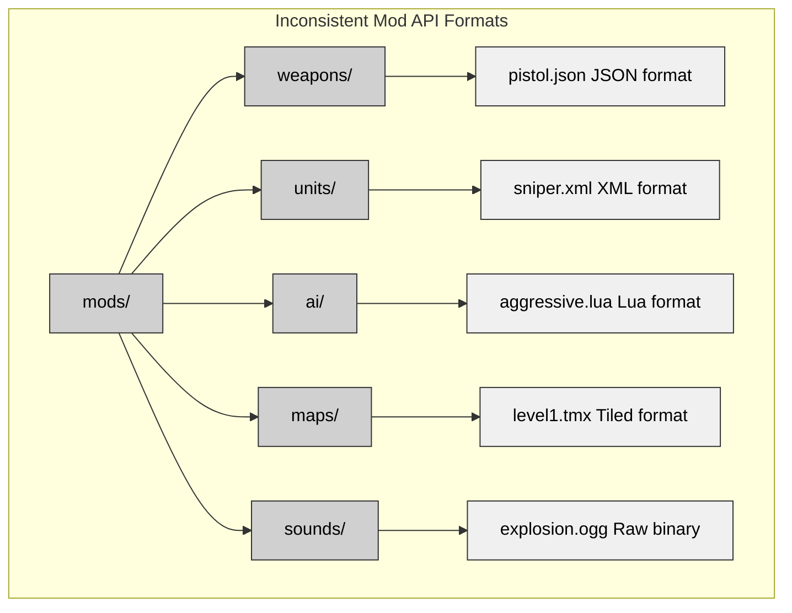
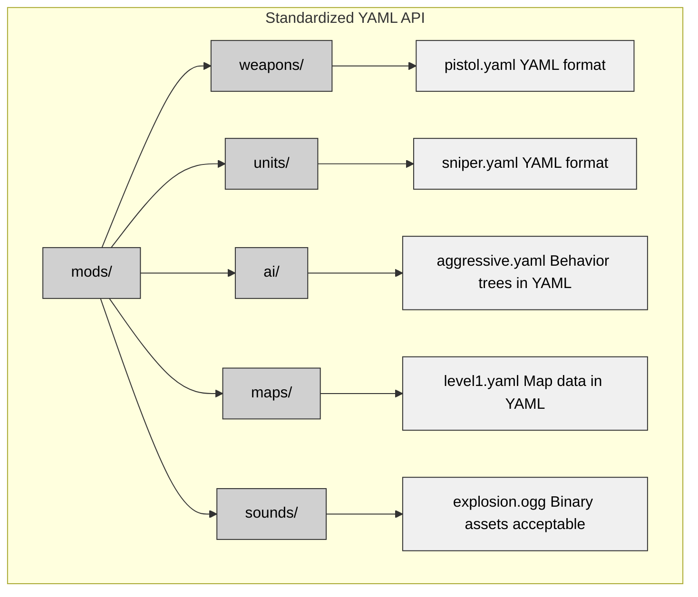

# Common Pitfalls in Tactical Wargame Development

## A Practical Guide Based on 20 Years of Close Combat Clones

*Lessons from OpenCombat-SDL (2005-2008), CloseCombatFree (2011-2012), and OpenCombat (2020-2024)*

---

## Introduction

Three Close Combat-style tactical wargame implementations over two decades reveal consistent problem patterns. This guide documents these pitfalls with practical solutions for your own projects.

Each pitfall includes:
- **Consequences** of the problem
- **Detection methods** for your codebase
- **Solutions** with concrete examples
- **Prevention** strategies
- **Reference** to architecture book details

---

## Category 1: State Management Pitfalls

### 1.1 The God Object (Unit That Does Everything)

**The Problem:**
A single `Unit` or `Soldier` class with 50+ fields handling position, health, AI, rendering, physics, and networking.

**Real Example from OpenCombat-SDL:**
```cpp
// What NOT to do
class Soldier : public Object {
    // Simulation state
    Vector2D position, velocity;
    float health, morale, suppression;
    uint64_t state_bits;

    // AI
    AIState ai_state;
    Path current_path;
    Target current_target;

    // Rendering
    Sprite sprite;
    Animation current_animation;
    float animation_frame;

    // Physics
    CollisionShape hitbox;
    PhysicsBody body;

    // Orders
    Queue<Order> orders;
    Action current_action;

    // 40+ more fields...
};
```

**Consequences:**
- Cache inefficiency from mixing frequently and rarely accessed data
- Unclear data ownership across systems
- Testing difficulties with excessive dependencies
- Complex serialization for save/load operations

**Detection:**
```bash
# Look for classes with excessive fields
grep -r "class.*{" --include="*.cpp" --include="*.h" -A 100 | grep -c ";" | sort -n

# Classes with >30 fields are suspicious
```

**Solution:**
Use component composition:
```rust
// OpenCombat's approach - components as fields
struct Soldier {
    transform: Transform,      // Position/rotation
    health: Health,            // Vitality
    state: UnitState,          // Behavior state
    weapon: Option<Weapon>,    // Equipment
    behavior: Behavior,        // AI
}

// Each component is a small, focused struct
struct Transform {
    position: Vec2,
    rotation: f32,
}

struct Health {
    current: f32,
    max: f32,
    wounded: bool,
}
```

**Prevention:**
- Apply the Single Responsibility Principle
- Group fields by update frequency
- Separate simulation data from rendering data

**Reference:** Chapter 5: Unit Hierarchy and Chapter 12: Modified ECS with Type-Safe Indices

---

### 1.2 Spaghetti State Transitions

**The Problem:**
State transitions spread across the codebase with undocumented rules.

**Real Example from CloseCombatFree:**
```cpp
// State transitions scattered in multiple places
void Unit::ProcessOrder() {
    if (unitStatus == "READY") {
        unitStatus = "MOVING";  // One place sets this
    }
}

void Unit::OnAnimationComplete() {
    if (unitStatus == "MOVING") {
        unitStatus = "READY";  // Another place changes it back
    }
}

void Unit::OnHit() {
    unitStatus = "SUPPRESSED";  // Yet another place
}

// Meanwhile, in AI code...
void AI::Update() {
    if (enemy_visible && unitStatus != "RELOADING") {
        unitStatus = "AIMING";  // No validation of transition!
    }
}
```

**Consequences:**
- Impossible to track all valid state transitions
- Race conditions from simultaneous state changes
- No validation for multiplayer security
- Bugs from invalid transitions (aiming while prone reloading)

**Detection:**
```bash
# Find all places where state is modified
grep -r "unitStatus\s*=" --include="*.cpp" --include="*.h"

# Modifications in >5 different files indicate spaghetti
```

**Solution:**
Centralize state transitions with explicit rules:
```rust
// OpenCombat's message-based approach
enum Behavior {
    Idle(Body),
    MoveTo(Path),
    Defend(Angle),
    EngageSoldier(SoldierIndex),
    Hide(Angle),
}

impl BattleState {
    // Only way to change behavior
    pub fn apply(&mut self, msg: BattleStateMessage) {
        match msg {
            BattleStateMessage::SetBehavior(idx, behavior) => {
                if self.can_transition(idx, behavior) {
                    self.soldiers[idx.0].behavior = behavior;
                }
            }
        }
    }

    fn can_transition(&self, idx: SoldierIndex, new: Behavior) -> bool {
        let current = &self.soldiers[idx.0].behavior;
        match (current, new) {
            (Behavior::Dead, _) => false,  // Dead units don't change
            (_, Behavior::Dead) => true,   // Can always die
            (Behavior::Engage(_), Behavior::Hide(_)) => true,  // Retreat allowed
            _ => true
        }
    }
}
```

**Prevention:**
- Use message-based architecture with a single state change function
- Define explicit transition rules
- Prevent direct state mutation from arbitrary code

**Reference:** Chapter 3: State Management Patterns, Section 3.8.2

---

### 1.3 Mutating State During Iteration

**The Problem:**
Modifying collections while iterating over them causes skipped elements, use-after-free, or infinite loops.

**Real Example from OpenCombat-SDL:**
```cpp
void World::UpdateSoldiers(float dt) {
    for (auto& soldier : _soldiers) {
        soldier->Update(dt);

        // DANGER: What if Update() removes the soldier?
        // DANGER: What if Update() adds new soldiers?
    }
    // Iterator may now be invalid!
}
```

**Consequences:**
- Iterator invalidation when removing elements
- Infinite loops from adding matching elements
- Non-deterministic behavior based on collection order
- Memory corruption in unsafe languages

**Detection:**
```bash
# Look for modification inside loops
grep -rn "for.*soldier" --include="*.cpp" -A 10 | grep -E "(remove|add|push|delete)"
```

**Solution:**
Use deferred updates:
```rust
// OpenCombat's approach
tick_soldiers(&mut self) {
    // Collect changes first
    let mut changes: Vec<(SoldierIndex, SoldierMessage)> = Vec::new();

    for idx in self.all_soldiers() {
        let soldier = self.soldier(idx);
        if let Some(msg) = soldier.update() {
            changes.push((idx, msg));
        }
    }

    // Apply all changes after iteration
    for (idx, msg) in changes {
        self.apply_soldier_message(idx, msg);
    }
}
```

Or use swap-remove for deletion:
```rust
fn remove_soldier(&mut self, idx: SoldierIndex) {
    // Swap with last element and remove (O(1))
    let last_idx = self.soldiers.len() - 1;
    self.soldiers.swap(idx.0, last_idx);
    self.soldiers.pop();

    // Update index of moved soldier
    if idx.0 != last_idx {
        self.soldier_index_map.insert(self.soldiers[idx.0].id, idx);
    }
}
```

**Prevention:**
- Never modify collections during iteration
- Use deferred updates: collect changes, apply after iteration
- For deletion, use swap-remove or mark-and-sweep patterns

**Reference:** Chapter 5: Section 5.2.3 Modified ECS Pattern

---

### 1.4 Ignoring State Prerequisites

**The Problem:**
Requiring manual handling of obvious state transitions (prone soldiers must stand before running).

**Real Example from CloseCombatFree:**
```cpp
// Player must manually sequence actions
void Unit::ProcessOrder(Order order) {
    if (order.type == "Run") {
        // Player must have already issued "Stand Up" order!
        if (unitStatus == "PRONE") {
            // FAIL: Cannot run while prone
            Log("ERROR: Must stand up first");
            return;
        }
        StartRunning();
    }
}
```

**Consequences:**
- Frustrating micromanagement for players
- Unrealistic behavior (real soldiers handle these transitions automatically)
- Forces players to memorize valid state sequences
- Wastes actions on trivial details

**Detection:**
- Playtest: Count clicks needed for a simple "attack while moving" command
- More than 3 clicks indicates a prerequisite problem

**Solution:**
Implement automatic prerequisite chaining:
```cpp
// OpenCombat-SDL's solution
class Action {
public:
    uint64_t requires;  // Bitfield of required states
    uint64_t adds;      // Bitfield of states this action adds
    uint64_t removes;   // Bitfield of states this action removes
};

void Soldier::QueueAction(Action action) {
    // Check prerequisites
    uint64_t missing = action.requires & ~state_bits;

    // Automatically insert actions to meet prerequisites
    while (missing != 0) {
        Action prereq = FindActionThatAdds(missing.firstBit());
        action_queue.push_front(prereq);
        missing &= ~prereq.adds;
    }

    action_queue.push_back(action);
}

// Example: Order prone soldier to run
// Player clicks: "Run to X"
// System automatically inserts:
// 1. StandUp (removes PRONE, adds STANDING)
// 2. RunTo (requires STANDING, adds RUNNING)
```

**Prevention:**
- Define actions with explicit requirements
- Implement automatic prerequisite resolution
- Avoid requiring players to handle obvious transitions

**Reference:** Chapter 3: Section 3.3.2 Automatic Prerequisite Chaining

---

### 1.5 Hardcoded State Dependencies

**The Problem:**
State logic scattered in if-statements throughout the codebase, making it impossible to find all affected code.

**Real Example from OpenCombat-SDL:**
```cpp
// Scattered throughout the codebase
// In Soldier.cpp:
void Soldier::Fire() {
    if (state_bits & PRONE) {
        accuracy *= 1.2f;  // Bonus for prone
    }
}

// In Weapon.cpp:
void Weapon::CanFire() {
    if (owner->state_bits & RELOADING) {
        return false;  // Can't fire while reloading
    }
}

// In Movement.cpp:
void Movement::GetSpeed() {
    if (owner->state_bits & PRONE) {
        return crawl_speed;  // Slow when prone
    }
}

// Finding all places that check PRONE requires grep!
```

**Consequences:**
- Impossible to track all effects of a state
- Adding new states requires searching the entire codebase
- Inconsistent handling (some places miss state checks)
- Can't data-drive state effects

**Detection:**
```bash
# Count state checks scattered in code
grep -r "state_bits\s*&" --include="*.cpp" | wc -l
# More than 20 indicates scattered dependencies
```

**Solution:**
Centralize state effects:
```rust
// Define capabilities as a bitfield
bitflags! {
    struct Capabilities: u64 {
        const CAN_MOVE = 1 << 0;
        const CAN_FIRE = 1 << 1;
        const CAN_SPRINT = 1 << 2;
        const IS_VISIBLE = 1 << 3;
        // etc.
    }
}

impl Soldier {
    fn update_capabilities(&mut self) {
        self.capabilities = Capabilities::empty();

        // Centralized logic: all capability calculations in one place
        if self.health > 0 && !self.unconscious {
            self.capabilities |= Capabilities::CAN_MOVE;

            if self.stance != Stance::Prone {
                self.capabilities |= Capabilities::CAN_SPRINT;
            }
        }

        if self.weapon.is_some() && !self.reloading {
            self.capabilities |= Capabilities::CAN_FIRE;
        }
    }
}

// Usage elsewhere is simple and consistent
if soldier.capabilities.contains(Capabilities::CAN_FIRE) {
    // Fire logic
}
```

**Prevention:**
- Use capability bitfields instead of raw state checks
- Recalculate capabilities when state changes
- Never check raw state bits outside capability calculation

**Reference:** Chapter 3: Section 3.6.3 Pattern Combinations

---

## Category 2: Architecture Pitfalls

### 2.1 Deep Inheritance Hierarchies

**The Problem:**
Inheritance trees five or more levels deep create the diamond problem and rigid taxonomies.

**Real Example from OpenCombat-SDL:**
```cpp
// What NOT to do
class Object { /* base */ };
class Unit : public Object { /* ... */ };
class Soldier : public Unit { /* ... */ };
class Sniper : public Soldier { /* ... */ };
class VeteranSniper : public Sniper { /* ... */ };

// Problem: A vehicle that acts like both soldier and vehicle becomes impossible.
// Problem: A defensive emplacement that acts like terrain can't be modeled.
// The diamond problem appears if Mobile and Armed mixins are added.
```

**Why It's Bad:**
- Multiple inheritance creates the diamond problem
- Rigid taxonomies force premature classification
- Novel combinations become impossible (flying tank?)
- The fragile base class problem emerges
- Cache performance suffers from scattered vtables

**How to Detect It:**
```bash
# Check inheritance depth
grep -r "class.*:.*public" --include="*.h" | grep -v "//" | awk -F: '{print $2}' | grep -c "public"
# Chains like A->B->C->D indicate deep hierarchies
```

**How to Fix It:**
Use component composition:
```rust
// OpenCombat's flat ECS approach
struct Soldier {
    transform: Transform,
    health: Health,
    mobility: Mobility,      // Movement capabilities
    weapon: Option<Weapon>,  // Combat capabilities
    armor: Option<Armor>,    // Defense capabilities
}

// A flying tank needs only different components:
struct Vehicle {
    transform: Transform,
    health: Health,
    mobility: Mobility,      // Now with tracks
    weapon: Option<Weapon>,  // Big gun
    armor: Option<Armor>,    // Heavy armor
    flight: Option<Flight>,  // VTOL capability
}

// Components replace inheritance
```

Or CloseCombatFree's QML composition:
```qml
// Tank composed of components, not inheriting from Vehicle
Entity {
    id: tank

    Mobile { maxSpeed: 15 }
    Armored { armor: 50 }
    Turret { rotationSpeed: 20 }
    CrewCapacity { maxCrew: 5 }
}
```

**Prevention Tips:**
- Prefer composition over inheritance
- Keep inheritance hierarchies shallow (2-3 levels maximum)
- Use ECS or component-based architecture

**Reference:** See Chapter 5: Section 5.2 Evolution from Deep Inheritance to Composition

---

### 2.2 Premature ECS Adoption

**The Problem:**
Implementing a full Entity-Component-System architecture for small games adds unnecessary complexity.

**The Temptation:**
```cpp
// Pure ECS (overkill for small games)
class World {
    ComponentStorage<Position> positions;
    ComponentStorage<Health> healths;
    ComponentStorage<Weapon> weapons;
    ComponentStorage<AI> ais;

    void Update() {
        // Complex query system
        for (auto [pos, health, weapon] :
             Query<Position, Health, Weapon>()) {
            // Process...
        }
    }
};
```

**Why It's Bad:**
- Excessive boilerplate for simple games
- Component lookup overhead
- Debugging becomes difficult with scattered logic
- Overkill for games with fewer than 1,000 entities
- Steep learning curve for teams

**How to Detect It:**
- The game has fewer than 500 units
- More time is spent on ECS plumbing than gameplay
- Simple operations require 50+ lines of code

**How to Fix It:**
Use a modified ECS (OpenCombat's approach):
```rust
// Modified ECS - entities are structs, not just IDs
pub struct BattleState {
    pub soldiers: Vec<Soldier>,    // Contiguous array
    pub vehicles: Vec<Vehicle>,    // Separate array
}

pub struct Soldier {
    pub transform: Transform,      // Component as field
    pub health: Health,            // Component as field
    pub weapon: Option<Weapon>,    // Optional component
}

// Systems become simple functions
fn update_soldiers(state: &mut BattleState, dt: f32) {
    for soldier in &mut state.soldiers {
        update_movement(soldier, dt);
    }
}

// Benefits include:
// - Cache-friendly contiguous arrays
// - Type safety at compile time
// - Simplicity without complex query systems
```

**Prevention Tips:**
- Use pure ECS only for games with 10,000+ entities
- For tactical wargames (500-1,000 units), use modified ECS
- Start simple, add complexity only when needed

**Reference:** See Chapter 5: Section 5.2.3 Modified ECS with Type-Safe Indices

---

### 2.3 Mixing Simulation with Rendering

**The Problem:**
Calling render functions from simulation update code creates tight coupling and prevents headless operation.

**Real Example from Early Prototypes:**
```cpp
void Soldier::Update(float dt) {
    // Simulation logic
    position += velocity * dt;

    // DANGER: Rendering inside simulation
    sprite.SetPosition(position);
    sprite.Draw();  // This couples simulation to rendering
}

void World::Simulate(float dt) {
    for (auto& soldier : soldiers) {
        soldier.Update(dt);  // Implicitly renders
    }
}
```

**Why It's Bad:**
- Simulation cannot run without graphics initialized
- Headless servers become impossible
- Different framerates for simulation and rendering can't be used
- Deterministic replay cannot be implemented
- Testing requires display initialization

**How to Detect It:**
```bash
# Look for Draw/Render calls in Update functions
grep -rn "Update.*{" --include="*.cpp" -A 20 | grep -E "(Draw|Render|Sprite)"
```

**How to Fix It:**
Strict separation:
```cpp
// OpenCombat-SDL got this right
class World {
public:
    void Simulate(float dt) {
        for (auto& soldier : _soldiers) {
            soldier->Update(dt);  // Pure simulation
        }
    }

    void Render(Screen* screen) {
        for (auto& soldier : _soldiers) {
            soldier->Draw(screen);  // Pure rendering
        }
    }
};

// Game loop
game_loop() {
    while (running) {
        ProcessInput();
        World::Simulate(dt);      // Fixed timestep
        World::Render(screen);    // Variable framerate
    }
}
```

**Prevention Tips:**
- Never call render functions from simulation code
- Use separate update rates (simulation at 60Hz, rendering at display rate)
- Ensure simulation can run without graphics

**Reference:** See Chapter 9: Section 9.2.2 Separation of Simulation from Rendering

---

### 2.4 Tight Coupling (AI in Graphics)

**The Problem:**
AI systems directly access rendering data or vice versa, creating bidirectional dependencies.

**Real Example from Prototype Code:**
```cpp
class AI {
    void SelectTarget(Soldier* self) {
        // AI should not know about sprites
        for (auto& enemy : world->soldiers) {
            if (enemy->sprite.IsVisible() &&  // Tight coupling
                enemy->side != self->side) {
                return enemy;
            }
        }
    }
};

class Renderer {
    void DrawSoldier(Soldier* soldier) {
        // Renderer should not make AI decisions
        if (soldier->ai.IsAlert()) {  // Tight coupling
            sprite.color = RED;
        }
    }
};
```

**Why It's Bad:**
- AI cannot be tested without the rendering system
- Rendering cannot be modified without breaking AI
- Circular dependencies appear
- Separation of concerns is violated

**How to Detect It:**
- Graphics headers appear in AI code
- AI headers appear in rendering code
- Dependency analysis tools reveal circular references

**How to Fix It:**
Use intermediate data structures:
```rust
// Simulation produces pure data
pub struct SoldierView {
    pub position: WorldPoint,
    pub side: Side,
    pub health: f32,
    pub visible: bool,  // Calculated by simulation, not rendering
}

// AI operates only on simulation data
impl AI {
    fn select_target(&self, soldier: &Soldier, world: &World) -> Option<SoldierIndex> {
        for (idx, other) in world.soldiers.iter().enumerate() {
            if other.side != soldier.side && other.visible {
                return Some(SoldierIndex(idx));
            }
        }
        None
    }
}

// Renderer gets separate render data
impl Renderer {
    fn draw(&self, state: &RenderState) {
        for soldier in &state.soldiers {
            // Pure rendering, no AI logic
            draw_sprite(soldier.sprite, soldier.position);
        }
    }
}

// RenderState is built from BattleState by a converter
fn build_render_state(battle: &BattleState) -> RenderState {
    RenderState {
        soldiers: battle.soldiers.iter().map(|s| RenderSoldier {
            position: s.position,
            sprite: get_sprite(&s),
            color: if s.health < 50 { RED } else { WHITE },
        }).collect()
    }
}
```

**Prevention Tips:**
- AI should access only simulation state
- Rendering should access only render state
- Use explicit conversion between states
- Never import graphics headers in AI code

**Reference:** See Chapter 12: Section 12.3 Phase 1 Implementation

---

## Category 3: Multiplayer Pitfalls

### 3.1 Adding Determinism Late

**The Problem:**
Developers often build a complete single-player game, then attempt to add multiplayer support by making the simulation deterministic afterward.

**Real Example from OpenCombat-SDL:**
```cpp
// Original code - NOT deterministic
void Soldier::Fire() {
    // Uses system RNG - different on each machine!
    if (rand() % 100 < accuracy) {
        HitTarget();
    }

    // Uses floating-point - slightly different on different CPUs!
    float damage = base_damage * distance_factor;
    target.TakeDamage(damage);
}

// Frame-rate dependent!
void Soldier::Move(float dt) {
    position += velocity * dt;  // dt varies by frame rate
}
```

**Why It's Bad:**
Rewriting core systems becomes necessary. Floating-point behavior differs across platforms. Random number generation requires synchronization. Frame-rate dependent logic causes desyncs. The process often demands a complete architectural overhaul.

**How to Detect It:**
```bash
# Search for non-deterministic functions
grep -rn "rand()\|srand()\|random()" --include="*.cpp"
grep -rn "gettimeofday\|clock_gettime" --include="*.cpp"
grep -rn "float.*=.*dt\|delta_time" --include="*.cpp"
```

**How to Fix It:**
Design for determinism from the start:
```rust
// OpenCombat's deterministic approach
pub struct DeterministicRNG {
    state: u64,
}

impl DeterministicRNG {
    pub fn next(&mut self) -> u64 {
        // xorshift algorithm - identical on all platforms
        self.state ^= self.state << 13;
        self.state ^= self.state >> 7;
        self.state ^= self.state << 17;
        self.state
    }
}

// Fixed-point arithmetic instead of float
pub struct FixedPoint(i32);  // 16.16 fixed-point

impl FixedPoint {
    pub fn new(value: f32) -> Self {
        FixedPoint((value * 65536.0) as i32)
    }

    pub fn to_f32(&self) -> f32 {
        self.0 as f32 / 65536.0
    }
}

// Frame-rate independent using tick count
pub fn tick(state: &mut BattleState, tick_number: u64) {
    // Always advance by fixed amount
    let dt = TICK_DURATION;

    // Use tick_number for any time-based decisions
    if tick_number % RELOAD_TICKS == 0 {
        // Reload completes exactly at this tick
    }
}
```

**Prevention Tips:**
Use deterministic RNG from the beginning. Implement fixed-point or consistent floating-point rounding. Adopt fixed timestep simulation instead of frame-rate dependent logic. Ensure all state changes occur through a message system.

**Reference:** See Chapter 15: Section 15.1.1 The Determinism Requirement

---

### 3.2 Non-Deterministic Random

**The Problem:**
System random number generators produce different sequences across platforms or compiler versions.

**Real Example:**
```cpp
// DON'T do this
void Soldier::Fire() {
    srand(time(NULL));  // Seeding with time - different on each machine!
    int roll = rand();

    if (roll % 100 < accuracy) {
        HitTarget();
    }
}

// Also problematic
#include <random>
std::mt19937 rng(std::random_device{}());  // Different seed on each machine!
```

**Why It's Bad:**
RNG sequences vary across platforms, causing multiplayer desyncs. Bug reproduction becomes unreliable. Replay systems fail.

**How to Detect It:**
```bash
grep -rn "rand()\|srand()\|std::random" --include="*.cpp" --include="*.h"
```

**How to Fix It:**
Implement deterministic RNG with synchronized seeds:
```rust
// OpenCombat's solution
pub struct SeededRNG {
    state: u64,
}

impl SeededRNG {
    pub fn new(seed: u64) -> Self {
        Self { state: seed }
    }

    pub fn next_u64(&mut self) -> u64 {
        // xorshift64* - deterministic across platforms
        self.state ^= self.state << 13;
        self.state ^= self.state >> 7;
        self.state ^= self.state << 17;
        self.state.wrapping_mul(2685821657736338717)
    }

    pub fn next_f32(&mut self) -> f32 {
        (self.next_u64() as f32) / (u64::MAX as f32)
    }
}

// Usage
pub struct BattleState {
    rng: SeededRNG,
    seed: u64,
}

impl BattleState {
    pub fn new(seed: u64) -> Self {
        Self {
            rng: SeededRNG::new(seed),
            seed,
        }
    }

    pub fn fire_weapon(&mut self, soldier: SoldierIndex) -> FireResult {
        let roll = self.rng.next_f32();
        if roll < self.soldiers[soldier.0].accuracy {
            FireResult::Hit
        } else {
            FireResult::Miss
        }
    }
}

// Same seed produces identical sequence on all machines
// Replay only requires initial seed plus inputs
```

**Prevention Tips:**
Avoid system RNG entirely. Always seed from game state, not system time. Use deterministic algorithms like xorshift or PCG. Include RNG state in save files.

**Reference:** See Chapter 15: Section 15.2.1 Message-Based State Updates

---

### 3.3 Floating-Point Inconsistencies

**The Problem:**
Floating-point arithmetic in critical calculations introduces tiny differences between platforms that compound into desyncs.

**Real Example:**
```cpp
// DANGER: Different results on x86 vs ARM vs different compilers
float distance = sqrt(dx*dx + dy*dy);
float damage = base_damage * (1.0f - distance / max_range);

// Sin/cos can vary between math libraries
float new_x = position.x + cos(angle) * speed;
float new_y = position.y + sin(angle) * speed;
```

**Why It's Bad:**
x86 and ARM have different FPU implementations. Compilers use different optimization strategies. Math libraries show slight variations in transcendental functions. Tiny differences accumulate over thousands of operations.

**How to Detect It:**
Search for `float` or `double` in simulation code. Test on multiple platforms (x86, ARM). Use different compilers (GCC, Clang, MSVC).

**How to Fix It:**
Use fixed-point arithmetic or consistent rounding:
```rust
// Fixed-point for positions (OpenCombat approach)
pub struct WorldPoint {
    pub x: FixedPoint,  // 16.16 fixed-point
    pub y: FixedPoint,
}

pub struct FixedPoint(i32);

impl FixedPoint {
    pub const SCALE: i32 = 65536;  // 2^16

    pub fn from_f32(value: f32) -> Self {
        FixedPoint((value * Self::SCALE as f32) as i32)
    }

    pub fn to_f32(&self) -> f32 {
        self.0 as f32 / Self::SCALE as f32
    }

    // Deterministic arithmetic
    pub fn add(self, other: FixedPoint) -> FixedPoint {
        FixedPoint(self.0 + other.0)
    }

    pub fn mul(self, other: FixedPoint) -> FixedPoint {
        // Use 64-bit intermediate to avoid overflow
        let result = (self.0 as i64 * other.0 as i64) / Self::SCALE as i64;
        FixedPoint(result as i32)
    }
}

// For cases where float is necessary, use consistent rounding
pub fn consistent_sqrt(value: f32) -> f32 {
    let result = value.sqrt();
    // Round to consistent precision
    (result * 1000.0).round() / 1000.0
}
```

**Prevention Tips:**
Use fixed-point for positions and critical calculations. Round floating-point results to consistent precision. Avoid transcendental functions like sin/cos in simulation code. Use lookup tables for trigonometry when needed.

**Reference:** See Chapter 15: Section 15.1.1 The Determinism Requirement

---

### 3.4 State Mutation Order

**The Problem:**
Processing state changes in different orders on different machines leads to divergent simulations.

**Real Example:**
```cpp
void World::Update() {
    // DANGER: Iteration order affects results!
    for (auto& soldier : soldiers) {
        soldier->Update();  // May affect other soldiers
    }
}

// Machine A: Soldiers updated in order [0, 1, 2, 3]
// Machine B: Soldiers updated in order [1, 0, 2, 3] (hash map iteration!)
// Results diverge!
```

**Why It's Bad:**
Hash map iteration order varies by implementation. Different STL versions iterate differently. Results depend on memory layout. Desyncs occur even with identical inputs.

**How to Detect It:**
Check if `std::unordered_map` or hash maps are used. Verify whether the order of `Update()` calls affects results.

**How to Fix It:**
Use deterministic ordering:
```rust
// OpenCombat's solution
pub fn tick(state: &mut BattleState) {
    // Sort soldiers by ID for deterministic iteration
    let mut soldier_indices: Vec<SoldierIndex> =
        (0..state.soldiers.len()).map(SoldierIndex).collect();
    soldier_indices.sort_by_key(|idx| state.soldiers[idx.0].id);

    // Collect all changes first (no mutation during iteration)
    let mut changes: Vec<(SoldierIndex, SoldierMessage)> = Vec::new();

    for idx in &soldier_indices {
        let soldier = &state.soldiers[idx.0];
        if let Some(msg) = soldier.update(state) {
            changes.push((*idx, msg));
        }
    }

    // Apply changes in deterministic order
    changes.sort_by_key(|(idx, _)| state.soldiers[idx.0].id);

    for (idx, msg) in changes {
        state.apply_soldier_message(idx, msg);
    }
}
```

**Prevention Tips:**
Always iterate in sorted order. Never rely on hash map iteration order. Collect changes before applying them. Sort changes before application.

**Reference:** See Chapter 15: Section 15.2.2 Fixed Timestep Simulation

---

### 3.5 Solution: Message-Based Architecture

A message-based architecture solves all multiplayer pitfalls:

```rust
// All state changes are messages
pub enum BattleStateMessage {
    Soldier(SoldierIndex, SoldierMessage),
    SetPhase(Phase),
    PushBulletFire(BulletFire),
    PushExplosion(Explosion),
}

pub enum SoldierMessage {
    SetBehavior(Behavior),
    SetGesture(Gesture),
    TakeDamage(f32),
    SetHealth(f32),
}

impl BattleState {
    // The ONLY way to modify state
    pub fn apply(&mut self, msg: BattleStateMessage) {
        match msg {
            BattleStateMessage::Soldier(idx, soldier_msg) => {
                if let Some(soldier) = self.soldiers.get_mut(idx.0) {
                    soldier.apply(soldier_msg);
                }
            }
            // ...
        }
    }
}

// Benefits:
1. Deterministic: Same messages produce the same state
2. Replay: Record messages to recreate sessions
3. Network: Serialize messages for transmission
4. Debug: Logs show every state change
5. Multiplayer: Server validates and broadcasts messages
```

**Reference:** See Chapter 15: Section 15.2 The Deterministic Simulation Approach

---

## Category 4: AI Pitfalls

### 4.1 Omniscient AI (Cheating)

**The Problem:**
AI gains unfair advantages by accessing information it shouldn't—seeing through walls, achieving perfect accuracy, or monitoring the entire battlefield.

**Real Example from Early Prototypes:**
```cpp
class AI {
    void Update() {
        // AI can see ALL enemies, even through walls!
        for (auto& enemy : world->all_enemies) {
            if (enemy->IsAlive()) {
                Attack(enemy);  // Cheating!
            }
        }
    }
};
```

**Why It's Bad:**
Players find it frustrating when AI operates outside the same rules. Immersion breaks, balance becomes impossible, and fog of war fails to function.

**How to Detect It:**
- Does the AI use different line-of-sight checks than the player?
- Can the AI target enemies the player can't see?
- Does the AI possess map-wide knowledge?

**How to Fix It:**
Implement a proper perception system:
```rust
// OpenCombat's perception system
pub struct Perception {
    pub visible_enemies: Vec<EnemyContact>,  // What AI can actually see
    pub last_known_positions: HashMap<SoldierIndex, (WorldPoint, u64)>,
    pub suspected_positions: Vec<WorldPoint>,
}

impl AI {
    fn update_perception(&mut self, soldier: &Soldier, world: &World) {
        self.perception.visible_enemies.clear();

        for (idx, enemy) in world.enemies() {
            // Same LoS check as player!
            if has_line_of_sight(soldier.position, enemy.position, world) {
                self.perception.visible_enemies.push(EnemyContact {
                    soldier: idx,
                    position: enemy.position,
                    last_seen: world.tick,
                });
            }
        }
    }

    fn select_target(&self) -> Option<SoldierIndex> {
        // Can ONLY target visible enemies
        self.perception.visible_enemies
            .iter()
            .max_by_key(|e| threat_level(e))
            .map(|e| e.soldier)
    }
}
```

**Prevention Tips:**
Use the same line-of-sight checks for AI and players. Limit AI knowledge to what it can perceive, implement fog of war, and ensure AI makes mistakes—no perfect accuracy.

**Reference:** See Chapter 14: Section 14.3 Perception Systems

---

### 4.2 Frame-Rate Dependent AI

**The Problem:**
AI behavior changes with frame rate, creating unpredictability and balance issues.

**Real Example:**
```cpp
void AI::Update(float dt) {
    // Frame-rate dependent!
    if (dt > 0.1f) {  // Different behavior at low FPS
        panic_mode = true;
    }

    // Timing based on real time, not game time
    if (last_decision_time + 1000 < GetTime()) {
        MakeDecision();
        last_decision_time = GetTime();
    }
}
```

**Why It's Bad:**
AI behaves differently on fast and slow machines. Timing exploits emerge, bugs become hard to reproduce, and multiplayer fairness suffers.

**How to Detect It:**
- Does the AI use `delta_time` for decision timing?
- Does the AI rely on system time (`gettimeofday`)?
- Test AI at 30fps, 60fps, and 144fps to spot inconsistencies.

**How to Fix It:**
Use a fixed timestep for AI:
```rust
// OpenCombat's approach
pub fn tick_ai(state: &mut BattleState, tick: u64) {
    // AI updates at 10Hz regardless of frame rate
    if tick % 6 == 0 {  // Every 6 ticks at 60Hz = 10Hz
        for idx in state.all_soldiers() {
            if let Some(behavior) = evaluate_threats(idx, state) {
                state.apply(BattleStateMessage::Soldier(
                    idx,
                    SoldierMessage::SetBehavior(behavior)
                ));
            }
        }
    }
}
```

**Prevention Tips:**
Avoid real time for AI decisions. Never use `delta_time` for AI logic. Rely on tick counts for timing and run AI at a fixed frequency, such as 10Hz.

**Reference:** See Chapter 14: Section 14.1.2 System AI Timescales

---

### 4.3 Too Complex AI (Unpredictable)

**The Problem:**
Overly sophisticated AI becomes unpredictable, leaving players confused about unit decisions.

**Real Example:**
```cpp
// Overly complex utility AI with 20 considerations
class UtilityAI {
    float EvaluatePosition(Position pos) {
        float score = 0;
        score += ConsiderDistance(pos) * 0.15f;
        score += ConsiderCover(pos) * 0.2f;
        score += ConsiderFlanking(pos) * 0.1f;
        score += ConsiderRetreat(pos) * 0.05f;
        score += ConsiderAmmo(pos) * 0.08f;
        score += ConsiderSquadCohesion(pos) * 0.12f;
        score += ConsiderObjectiveDistance(pos) * 0.1f;
        score += ConsiderEnemyThreat(pos) * 0.2f;
        // ... 12 more considerations
        return score;
    }
};
// Players can't understand why AI chose position A over B.
```

**Why It's Bad:**
Players struggle to predict AI behavior. Debugging becomes difficult, balance suffers from too many variables, and emergent behavior turns chaotic.

**How to Detect It:**
- Can you explain why the AI made a specific decision?
- Does the AI require more than 10 considerations per decision?
- Does AI behavior vary chaotically between playthroughs?

**How to Fix It:**
Simplify AI with clear rules:
```rust
// OpenCombat's simpler approach
fn evaluate_threat_response(soldier: &Soldier) -> Option<Behavior> {
    // Simple priority system

    // 1. Critical danger - seek cover immediately
    if soldier.under_fire.intensity >= 150 {
        return find_immediate_cover(soldier);
    }

    // 2. Warning level - proceed with caution
    if soldier.under_fire.intensity >= 100 {
        if !has_good_cover(soldier) {
            return find_better_cover(soldier);
        }
    }

    // 3. Visible enemy - engage if possible
    if let Some(enemy) = find_visible_enemy(soldier) {
        if can_engage(soldier, enemy) {
            return Some(Behavior::EngageSoldier(enemy));
        }
    }

    // 4. Follow orders
    None
}
```

**Prevention Tips:**
Keep AI explainable. Use simple priority systems instead of complex scoring. Limit considerations to 3-5 per decision. Ensure AI behavior remains consistent and predictable.

**Reference:** See Chapter 14: Section 14.2.4 Comparative Summary

---

### 4.4 AI That Ignores Orders

**The Problem:**
AI overrides player commands, leading to frustration and loss of control.

**Real Example:**
```cpp
// AI completely overrides player orders
void Soldier::Update() {
    if (enemy_visible) {
        // Ignores player order!
        Attack(enemy);
        return;
    }

    // ... never checks current_order
}
```

**Why It's Bad:**
Players lose control when units disregard commands. Frustration builds, planned strategies fail, and the game feels like it plays itself.

**How to Detect It:**
- Can units be ordered to retreat?
- Do units always attack when enemies are visible?
- Can you order a unit to hold fire?

**How to Fix It:**
Implement order override with priority:
```rust
// OpenCombat's approach - three-tier system
pub fn tick_soldier(soldier_idx: SoldierIndex, state: &mut BattleState) {
    let soldier = state.soldier(soldier_idx);

    // Check for threats that override orders
    if soldier.under_fire.intensity >= 150 {
        // Survival priority: seek cover
        if let Some(cover) = find_cover(soldier, state) {
            state.apply(BattleStateMessage::Soldier(
                soldier_idx,
                SoldierMessage::SetBehavior(Behavior::Hide(cover.direction))
            ));
            return;
        }
    }

    // Otherwise, follow player orders
    if let Some(order) = &soldier.current_order {
        let behavior = translate_order_to_behavior(order, soldier, state);
        state.apply(BattleStateMessage::Soldier(
            soldier_idx,
            SoldierMessage::SetBehavior(behavior)
        ));
    }
}

// Behavior hierarchy:
// 1. Survival (under heavy fire) - automatic
// 2. Player orders - unless survival engaged
// 3. Default AI - if no orders
```

**Prevention Tips:**
AI should prioritize survival—returning fire or seeking cover—but otherwise follow player orders. Allow "hold fire" and "hold position" commands. Make AI autonomy visible to players.

**Reference:** See Chapter 6: Section 6.2.2 Dynamic Behavior Override

---

### 4.5 Solution: Perception + Behavior Separation

The key to avoiding AI pitfalls lies in separating perception from behavior:

```rust
// Perception system - what AI knows
pub struct PerceptionSystem;

impl PerceptionSystem {
    pub fn update(soldier: &mut Soldier, world: &World) {
        // Update what this soldier can see/hear
        soldier.visible_enemies.clear();

        for enemy in world.enemies_near(soldier.position, soldier.view_distance) {
            if has_line_of_sight(soldier, enemy, world) {
                soldier.visible_enemies.push(enemy);
            }
        }

        // Update suppression level
        for explosion in world.recent_explosions_near(soldier.position, 10.0) {
            soldier.under_fire.increase(explosion.intensity);
        }

        soldier.under_fire.decay();
    }
}

// Behavior system - what AI does
pub struct BehaviorSystem;

impl BehaviorSystem {
    pub fn update(soldier_idx: SoldierIndex, state: &mut BattleState) {
        let soldier = &state.soldiers[soldier_idx.0];

        // Simple priority-based decisions
        if soldier.under_fire.intensity >= 150 {
            // Survival
            if let Some(cover) = find_cover(soldier, state) {
                set_behavior(state, soldier_idx, Behavior::Hide(cover.direction));
            }
        } else if !soldier.visible_enemies.is_empty() {
            // Combat
            let target = select_best_target(soldier);
            set_behavior(state, soldier_idx, Behavior::EngageSoldier(target));
        } else {
            // Follow orders
            if let Some(order) = &soldier.current_order {
                let behavior = order.to_behavior();
                set_behavior(state, soldier_idx, behavior);
            }
        }
    }
}
```

**Benefits:**
Perception limits information, preventing cheating. Behavior becomes simple and explainable. Systems can be tested independently, and balancing becomes straightforward.

**Reference:** See Chapter 14: Section 14.4.1 Overview of Decision Architectures

---

## Category 5: Modding Pitfalls

### 5.1 Hardcoded Content

**The Problem:**
Game content like weapons, units, and scenarios embedded directly in code forces recompilation for any changes.

**Real Example from OpenCombat-SDL:**
```cpp
// BAD: Content in code
enum class SoldierType {
    RIFLEMAN = 0,
    MACHINE_GUNNER = 1,
    SNIPER = 2,
    // Adding a new type requires recompilation!
};

void Soldier::Fire() {
    switch (weapon_type) {
        case WeaponType::M1_GARAND:
            damage = 45;  // Hardcoded!
            break;
        case WeaponType::M1919:
            damage = 35;  // Hardcoded!
            break;
    }
}
```

**Why It's Bad:**
Balancing requires recompilation. The community can't create mods. Developers lose time waiting for builds. Binaries bloat with compiled content.

**How to Detect It:**
```bash
# Count enums for content types
grep -rn "enum.*Type" --include="*.cpp" --include="*.h"

# Look for hardcoded values
grep -rn "damage\s*=\s*[0-9]" --include="*.cpp"
```

**How to Fix It:**
Move content to external data files:
```json
// weapons.json
{
  "weapons": [
    {
      "id": "m1_garand",
      "name": "M1 Garand",
      "damage": 45,
      "range": 400,
      "rate_of_fire": 0.5,
      "magazine_size": 8
    },
    {
      "id": "m1919",
      "name": "M1919 Browning",
      "damage": 35,
      "range": 800,
      "rate_of_fire": 8.0,
      "magazine_size": 250
    }
  ]
}
```

```rust
// Load at runtime
pub struct WeaponDatabase {
    weapons: HashMap<String, WeaponTemplate>,
}

impl WeaponDatabase {
    pub fn load_from_json(path: &str) -> Result<Self> {
        let file = std::fs::read_to_string(path)?;
        let data: WeaponData = serde_json::from_str(&file)?;

        let mut weapons = HashMap::new();
        for weapon in data.weapons {
            weapons.insert(weapon.id.clone(), weapon);
        }

        Ok(Self { weapons })
    }

    pub fn get(&self, id: &str) -> Option<&WeaponTemplate> {
        self.weapons.get(id)
    }
}
```

**Prevention Tips:**
Externalize all content to JSON, XML, or YAML. Use string IDs instead of enums. Load data at runtime. Implement hot-reload for development.

**Reference:** See Chapter 7: Section 7.3 OpenCombat-SDL Configuration Approach

---

### 5.2 Binary Save Formats

**The Problem:**
Opaque binary save files break between versions and resist editing.

**Real Example:**
```cpp
// BAD: Binary save
void SaveGame(const char* filename) {
    FILE* f = fopen(filename, "wb");

    // Write raw structs - breaks if struct changes!
    fwrite(&world, sizeof(World), 1, f);

    // Write pointers - corrupted on load!
    fwrite(soldiers.data(), sizeof(Soldier*), soldiers.size(), f);

    fclose(f);
}
```

**Why It's Bad:**
Saves break when game updates. Debugging becomes impossible. Corrupted saves can't be recovered. Modders can't edit files. Platform differences cause issues.

**How to Detect It:**
Check if save files are human-readable. Try opening them in a text editor. Test if saves break between versions.

**How to Fix It:**
Use text-based serialization:
```rust
// OpenCombat's JSON-based saves
pub fn save_game(state: &BattleState, path: &str) -> Result<()> {
    let save_data = SaveData {
        version: SAVE_VERSION,
        timestamp: SystemTime::now(),
        soldiers: state.soldiers.iter().map(|s| SoldierSave {
            id: s.id,
            position: s.position,
            health: s.health,
            behavior: s.behavior.clone(),
        }).collect(),
    };

    let json = serde_json::to_string_pretty(&save_data)?;
    std::fs::write(path, json)?;

    Ok(())
}

// Benefits:
// Human-readable
// Version-migratable
// Debuggable
// Platform-independent
```

**Prevention Tips:**
Use JSON, XML, or YAML for saves. Include version numbers for migration. Pretty-print for debugging. Never write raw memory.

**Reference:** See Chapter 7: Section 7.4.2 JSON Deployment System

---

### 5.3 No Hot-Reload Capability

**The Problem:**
Content changes require game restarts, turning iteration into a slow process.

**Real Example:**
```cpp
// Content loaded once at startup
class Game {
    void Init() {
        // Loaded once - changes require restart!
        weapon_db.Load("weapons.json");
        unit_db.Load("units.json");
    }
};

// Designer tweaks weapon damage
// Must restart game to test
// 30-second iteration cycle
// 100 tweaks = 50 minutes wasted
```

**Why It's Bad:**
Developers wait too long. Balancing becomes inefficient. Modders get frustrated. Time gets wasted.

**How to Detect It:**
Check if changing a JSON file requires restart. Measure iteration cycle time. Test if values can be tweaked while playing.

**How to Fix It:**
Implement hot-reload:
```rust
pub struct ConfigSystem {
    config: ServerConfig,
    last_modified: SystemTime,
    path: PathBuf,
}

impl ConfigSystem {
    pub fn update(&mut self) {
        // Check if file changed
        if let Ok(modified) = std::fs::metadata(&self.path)
            .and_then(|m| m.modified()) {

            if modified > self.last_modified {
                // Reload!
                if let Ok(contents) = std::fs::read_to_string(&self.path) {
                    if let Ok(new_config) = serde_json::from_str(&contents) {
                        self.config = new_config;
                        self.last_modified = modified;
                        println!("Config hot-reloaded!");
                    }
                }
            }
        }
    }

    pub fn get(&self) -> &ServerConfig {
        &self.config
    }
}

// In game loop
fn tick(state: &mut BattleState) {
    state.config_system.update();  // Check for changes every frame

    // Use latest config
    let visibility = state.config_system.get().visibility_modifier;
}
```

**Prevention Tips:**
Watch files for changes. Reload automatically. Keep iteration cycles under five seconds. Use inotify or FSEvents for efficient watching.

**Reference:** See Chapter 9: Section 9.6.3 Hot-Reload Development

---

### 5.4 Inconsistent Mod API

**The Problem:**
Different systems use different modding interfaces—JSON for weapons, XML for units, Lua for AI, custom formats for maps.

**Real Example:**


**Why It's Bad:**
Modders must learn multiple formats. Tooling varies. Workflows become fragmented. Documentation gets complicated.

**How to Detect It:**
Count how many file formats your modding system uses. Check if modders need multiple editors or tools.

**How to Fix It:**
Standardize on one format:


Or adopt CloseCombatFree's QML approach:
```qml
// Everything in one declarative language
Sniper {
    weapon: Weapon {
        type: "rifle"
        damage: 80
        range: 800
    }

    ai: BehaviorTree {
        Selector {
            Sequence {
                Condition { check: "HasHighValueTarget" }
                Action { action: "EngageTarget" }
            }
            Action { action: "Hide" }
        }
    }

    spawn_position: Point { x: 100; y: 200 }
}
```

**Prevention Tips:**
Choose one primary format like JSON or YAML. Maintain consistency across all content types. Provide unified tooling. Document the API thoroughly.

**Reference:** See Chapter 7: Section 7.5 CloseCombatFree Declarative Modding

---

### 5.5 Solution: Data-Driven from Day One

Design for modding from the start:

```rust
// Core principle: Content is data, not code

// 1. Define everything in external files
// weapons.json, units.json, scenarios.json

// 2. Load at runtime
pub struct ContentDatabase {
    weapons: HashMap<String, WeaponTemplate>,
    units: HashMap<String, UnitTemplate>,
    scenarios: HashMap<String, ScenarioTemplate>,
}

// 3. Hot-reload during development
impl ContentDatabase {
    pub fn check_and_reload(&mut self) {
        for file in self.watched_files.iter() {
            if file.has_changed() {
                self.reload_file(file);
            }
        }
    }
}

// 4. Consistent API
// All content follows the same pattern:
// JSON definition
// Runtime loading
// Hot-reload support
// Version migration
```

**Reference:** See Chapter 7: Section 7.2 The Modding Spectrum

---

## Category 6: Performance Pitfalls

### 6.1 O(n²) Squad Coordination

**The Problem:**
Nested loops over squad members create performance bottlenecks when calculating cohesion or coordination.

**Real Example:**
```cpp
// O(n²) - disaster with large squads!
void UpdateSquadCohesion(Squad* squad) {
    for (auto& soldier : squad->members) {
        for (auto& other : squad->members) {
            if (soldier != other) {
                float dist = Distance(soldier->pos, other->pos);
                if (dist > MAX_COHESION_DIST) {
                    soldier->cohesion_penalty += (dist - MAX_COHESION_DIST);
                }
            }
        }
    }
}
// 100 soldiers = 10,000 iterations per frame!
```

**Why It's Bad:**
Squad coordination checks scale poorly. Ten soldiers require 100 checks; 100 soldiers need 10,000. This causes frame drops with large units and delivers unnecessary precision since squad cohesion is inherently fuzzy.

**How to Detect It:**
Profile with large unit counts (100+). Watch for nested loops over unit lists and O(n²) algorithms.

**How to Fix It:**
Use leader-based approximation instead:

```rust
// O(n) - leader-based cohesion
pub fn update_squad_cohesion(squad: &mut Squad, state: &BattleState) {
    let leader_pos = state.soldiers[squad.leader.0].position;

    // Only check distance to leader, not all members
    for member_idx in &squad.members {
        let member = &state.soldiers[member_idx.0];
        let dist = distance(member.position, leader_pos);

        if dist > squad.cohesion_radius {
            // Issue move order to return to formation
            let target = formation_position(leader_pos, *member_idx, squad);
            issue_move_order(*member_idx, target);
        }
    }
}
```

**Prevention Tips:**
Use spatial partitioning. Approximate with leader-based calculations. Keep squad sizes realistic (8-12 members). Cache results when possible.

**Reference:** See Chapter 5: Section 5.4.3 Formation Following

---

### 6.2 No Spatial Partitioning

**The Problem:**
Checking every unit against every other unit for line-of-sight, collision, or targeting creates quadratic scaling.

**Real Example:**
```cpp
// O(n²) visibility checks!
void UpdateVisibility() {
    for (auto& soldier : all_soldiers) {
        for (auto& enemy : all_enemies) {
            // Always checks ALL enemies, even far away!
            if (HasLineOfSight(soldier, enemy)) {
                soldier->visible_enemies.push_back(enemy);
            }
        }
    }
}
// 500 soldiers × 500 enemies = 250,000 checks per frame!
```

**Why It's Bad:**
Quadratic scaling destroys performance. Most checks are unnecessary because units are too distant. Random memory access patterns hurt cache efficiency.

**How to Detect It:**
Profile with more than 200 units. Look for nested loops over all units. Watch for frame time increasing quadratically with unit count.

**How to Fix It:**
Implement spatial hashing:

```rust
pub struct SpatialHash {
    cell_size: f32,
    cells: HashMap<u64, Vec<EntityIndex>>,
}

impl SpatialHash {
    pub fn insert(&mut self, entity: EntityIndex, position: Vec2) {
        let hash = self.hash(position);
        self.cells.entry(hash).or_default().push(entity);
    }

    pub fn query_radius(&self, center: Vec2, radius: f32) -> Vec<EntityIndex> {
        let mut results = Vec::new();
        let radius_in_cells = (radius / self.cell_size).ceil() as i32;
        let center_cell = self.world_to_cell(center);

        // Only check nearby cells
        for dy in -radius_in_cells..=radius_in_cells {
            for dx in -radius_in_cells..=radius_in_cells {
                let cell_hash = self.hash_cell(center_cell + Vec2i::new(dx, dy));
                if let Some(entities) = self.cells.get(&cell_hash) {
                    for &entity in entities {
                        if distance(center, get_position(entity)) <= radius {
                            results.push(entity);
                        }
                    }
                }
            }
        }

        results
    }
}

// Usage - only checks nearby units!
let nearby_enemies = spatial_hash.query_radius(soldier.position, view_distance);
for enemy in nearby_enemies {
    if has_line_of_sight(soldier, enemy) {
        // Process...
    }
}
```

**Prevention Tips:**
Always use spatial partitioning for queries. Choose cell size based on typical query radius. Update the spatial hash when units move. Query before expensive operations.

**Reference:** See Chapter 12: Section 12.2.5 Spatial Indexing Options

---

### 6.3 Excessive Memory Allocation

**The Problem:**
Allocating memory every frame creates temporary vectors, strings, or objects that cause garbage collection pressure or fragmentation.

**Real Example:**
```cpp
// Allocating every frame!
void Update() {
    std::vector<Soldier*> visible;  // Allocated on heap every frame!

    for (auto& soldier : soldiers) {
        if (CanSee(soldier)) {
            visible.push_back(soldier);  // Reallocation as vector grows!
        }
    }

    std::string status = GetStatusString();  // String allocation!

    ProcessTargets(visible);  // Temporary vector discarded
}
```

**Why It's Bad:**
Frequent allocations cause garbage collection pauses in managed languages. Memory fragmentation leads to scattered heap allocations and cache misses. Frame times become unpredictable.

**How to Detect It:**
Use memory profilers like Valgrind or heaptrack. Watch for `malloc`/`new` in frame loops. Monitor garbage collection frequency in Java, C#, or JavaScript.

**How to Fix It:**
Preallocate and reuse buffers:

```rust
pub struct GameSystems {
    // Preallocated buffers
    visible_buffer: Vec<SoldierIndex>,
    path_buffer: Vec<GridPoint>,
    message_buffer: Vec<BattleStateMessage>,
}

impl GameSystems {
    pub fn tick(&mut self, state: &mut BattleState) {
        // Clear and reuse (no allocation!)
        self.visible_buffer.clear();

        // Collect visible enemies
        for idx in state.all_soldiers() {
            if is_visible(idx, state) {
                self.visible_buffer.push(idx);
            }
        }

        // Process using preallocated buffer
        process_visible(&self.visible_buffer, state);

        // Buffer is reused next frame, not reallocated
    }
}

// Or use object pools for frequently created objects
pub struct BulletPool {
    available: Vec<Bullet>,
    active: Vec<Bullet>,
}

impl BulletPool {
    pub fn spawn(&mut self, position: Vec2, velocity: Vec2) -> &mut Bullet {
        let mut bullet = self.available.pop()
            .unwrap_or_else(Bullet::new);
        bullet.reset(position, velocity);
        self.active.push(bullet);
        self.active.last_mut().unwrap()
    }
}
```

**Prevention Tips:**
Preallocate buffers at startup. Use `clear()` instead of `new`. Implement object pools for temporary objects. Profile memory allocations per frame.

**Reference:** See Chapter 5: Section 5.2.3 Cache Efficiency

---

### 6.4 Pathfinding on Every Frame

**The Problem:**
Recalculating paths every frame wastes CPU cycles when paths rarely change.

**Real Example:**
```cpp
// Recalculating path every frame!
void UpdateSoldier(Soldier* soldier) {
    if (soldier->has_destination) {
        // DANGER: A* every frame!
        auto path = pathfinder.FindPath(soldier->position, soldier->destination);
        soldier->FollowPath(path);
    }
}
// 100 soldiers × 60fps = 6000 pathfinding calls per second!
```

**Why It's Bad:**
A* pathfinding is expensive (O(n log n)). Paths rarely change every frame. This wastes CPU on redundant calculations.

**How to Detect It:**
Profile pathfinding calls per frame. Check if paths are recalculated when destinations remain unchanged. Watch for frame time spikes when units move.

**How to Fix It:**
Cache paths and only recalculate when necessary:

```rust
pub struct MovementSystem;

impl MovementSystem {
    pub fn update(state: &mut BattleState, dt: f32) {
        for idx in state.all_soldiers() {
            let soldier = &state.soldiers[idx.0];

            if let Behavior::MoveTo(ref path) = soldier.behavior {
                // Only recalculate if:
                // 1. No current path
                // 2. Path is blocked
                // 3. Destination changed
                // 4. Soldier strayed too far from path

                if path.needs_recalculation(soldier.position) {
                    let new_path = pathfinder.find_path(
                        soldier.position,
                        path.destination
                    );

                    state.apply(BattleStateMessage::Soldier(
                        idx,
                        SoldierMessage::SetBehavior(Behavior::MoveTo(new_path))
                    ));
                }
            }
        }
    }
}

// Path validity check
impl Path {
    pub fn needs_recalculation(&self, current_pos: WorldPoint) -> bool {
        // Path expired
        if self.age > MAX_PATH_AGE {
            return true;
        }

        // Too far from path
        if self.distance_from_path(current_pos) > MAX_DEVIATION {
            return true;
        }

        // Obstacle appeared
        if self.is_blocked() {
            return true;
        }

        false
    }
}
```

**Prevention Tips:**
Cache paths until invalidated. Only recalculate when obstacles change. Use cheaper steering for local avoidance. Limit pathfinding to 1-2Hz instead of every frame.

**Reference:** See Chapter 12: Section 12.3.2 Phase 2 Pathfinding

---

### 6.5 Solution: Spatial Hash + Caching

The best performance comes from combining spatial hashing with smart caching:

```rust
pub struct OptimizedWorld {
    // Spatial partitioning for queries
    spatial_hash: SpatialHash,

    // Cached pathfinding
    path_cache: PathCache,

    // Preallocated buffers
    query_buffer: Vec<SoldierIndex>,
    message_buffer: Vec<BattleStateMessage>,
}

impl OptimizedWorld {
    pub fn tick(&mut self, dt: f32) {
        // 1. Update spatial hash (O(n))
        self.spatial_hash.clear();
        for idx in self.all_soldiers() {
            let pos = self.soldiers[idx.0].position;
            self.spatial_hash.insert(idx, pos);
        }

        // 2. Process with spatial queries (O(1) per query)
        self.query_buffer.clear();
        for idx in self.all_soldiers() {
            let soldier = &self.soldiers[idx.0];

            // Only check nearby enemies!
            let enemies = self.spatial_hash.query_radius(
                soldier.position,
                soldier.view_distance
            );

            for enemy in enemies {
                if self.has_line_of_sight(idx, enemy) {
                    self.query_buffer.push(enemy);
                }
            }

            // Update AI with visible enemies
            if let Some(behavior) = self.evaluate_threats(idx, &self.query_buffer) {
                self.message_buffer.push((idx, behavior));
            }
        }

        // 3. Batch apply changes
        for (idx, behavior) in &self.message_buffer {
            self.apply_behavior(*idx, behavior.clone());
        }

        // 4. Pathfinding only when needed (not every frame)
        if self.tick % 6 == 0 {  // 10Hz
            self.update_paths();
        }
    }
}
```

**Benefits:**
Updates become O(n) instead of O(n²). Spatial queries run in constant time. Allocations are minimal. Pathfinding uses cached results.

**Reference:** See Chapter 12: Section 12.3 Phase 1-2 Implementation Roadmap

---

## Quick Reference: Detection Checklist

Use this checklist to audit your codebase:

### State Management
- [ ] Classes have no more than 30 fields
- [ ] State changes are centralized
- [ ] Collections are not modified during iteration
- [ ] Prerequisites are handled automatically
- [ ] Capability bitfields replace scattered checks

### Architecture
- [ ] Inheritance hierarchies stay under three levels deep
- [ ] A modified ECS works better than pure ECS for fewer than 1,000 entities
- [ ] Simulation remains separate from rendering
- [ ] Simulation code contains no rendering calls
- [ ] AI never accesses rendering data

### Multiplayer
- [ ] Deterministic RNG is implemented from the start
- [ ] Fixed-point or consistent float arithmetic is used
- [ ] A fixed timestep ensures frame-rate independence
- [ ] Iteration order is deterministic
- [ ] State changes occur through messages

### AI
- [ ] AI uses the same line of sight as the player
- [ ] AI perception is limited, not omniscient
- [ ] AI runs at a fixed frequency
- [ ] AI decisions are explainable
- [ ] AI respects player orders, except when survival is at stake

### Modding
- [ ] All content resides in external files
- [ ] Save formats are text-based
- [ ] Hot-reload capability is included
- [ ] The API remains consistent across all content
- [ ] Content types avoid hardcoded enums

### Performance
- [ ] Spatial partitioning speeds up queries
- [ ] No O(n²) algorithms are used
- [ ] Buffers are preallocated, not created per frame
- [ ] Pathfinding is cached
- [ ] Profiling shows each frame takes less than 16ms

---

## The Golden Rules

Twenty years of Close Combat clones reveal these rules as the most reliable way to avoid problems:

1. **Separate concerns**: Keep simulation, rendering, AI, and input distinct.
2. **Centralize state changes**: Route all mutations through messages.
3. **Design for determinism from the start**: Even single-player games benefit.
4. **Prefer composition over inheritance**: Flat ECS structures offer flexibility.
5. **Make content data-driven**: Use JSON or YAML, not code.
6. **Optimize for cache efficiency**: Contiguous arrays outperform linked lists.
7. **Use spatial partitioning**: Queries should never run in O(n²) time.
8. **Enforce a fixed timestep**: Frame-rate independence is critical.
9. **Limit AI perception**: AI should see only what the player sees.
10. **Enable hot-reloading**: Reduce iteration time from minutes to seconds.

---

## References by Chapter

- **Chapter 3**: State Management Patterns (pitfalls 1.1-1.5)
- **Chapter 5**: Unit Hierarchy and Composition (pitfalls 2.1, 2.2, 6.1)
- **Chapter 6**: Orders and AI (pitfalls 4.1-4.4)
- **Chapter 7**: Moddability (pitfalls 5.1-5.4)
- **Chapter 9**: Lessons Learned (all categories)
- **Chapter 12**: Implementation Guide (pitfalls 2.3, 2.4, 6.2-6.4)
- **Chapter 14**: AI Systems (pitfalls 4.1-4.5)
- **Chapter 15**: Multiplayer (pitfalls 3.1-3.5)
