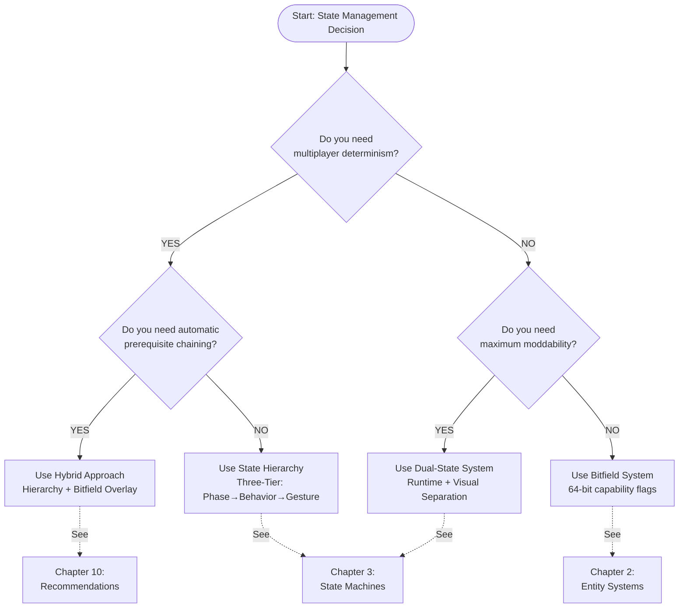
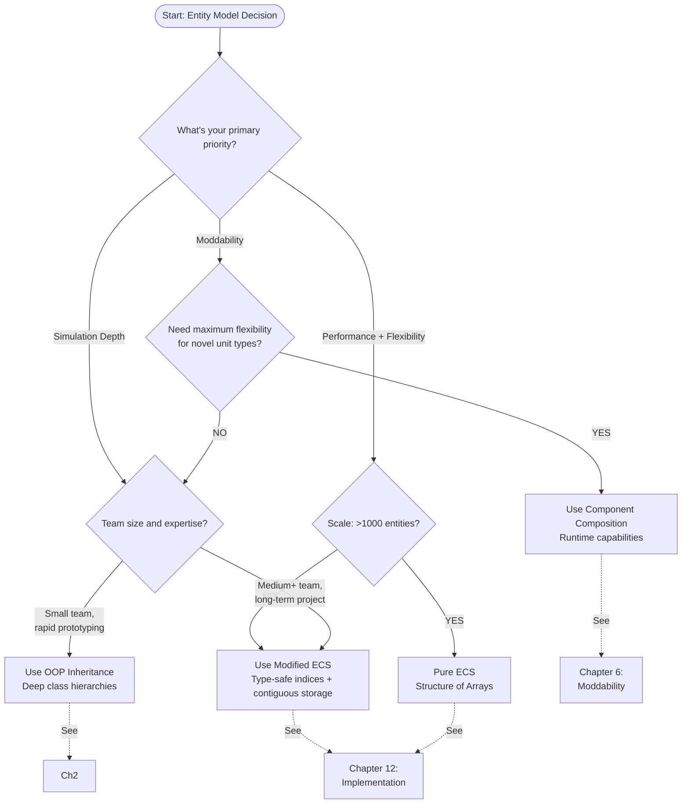
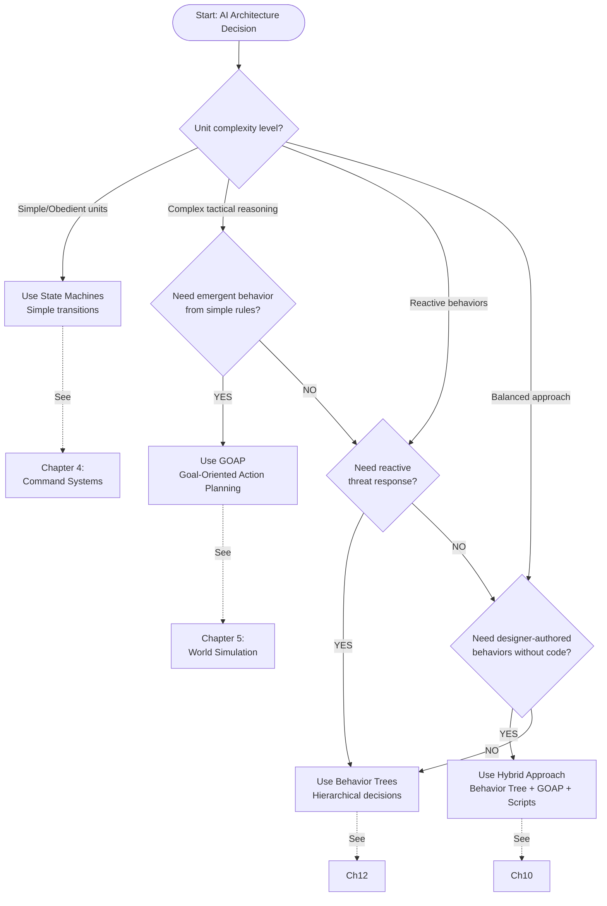
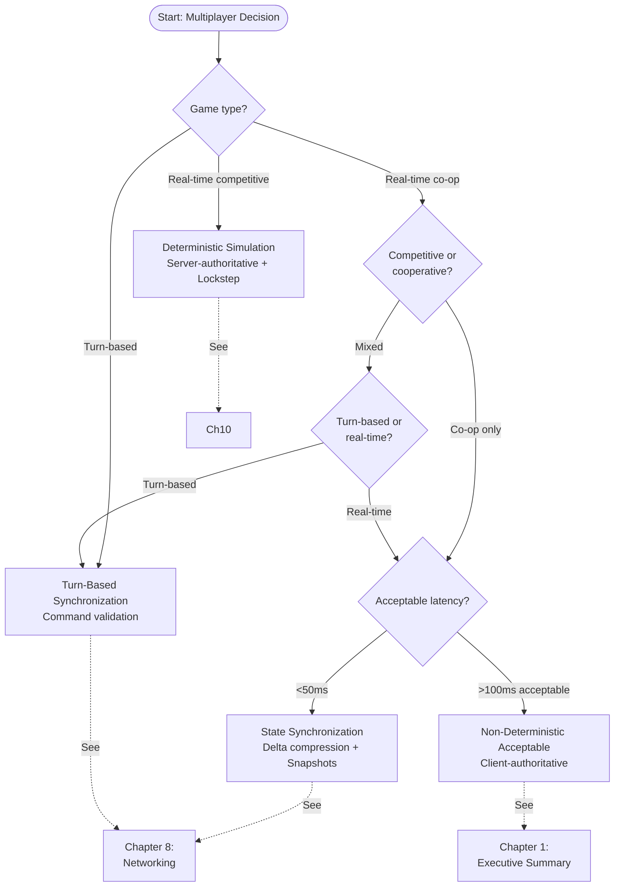
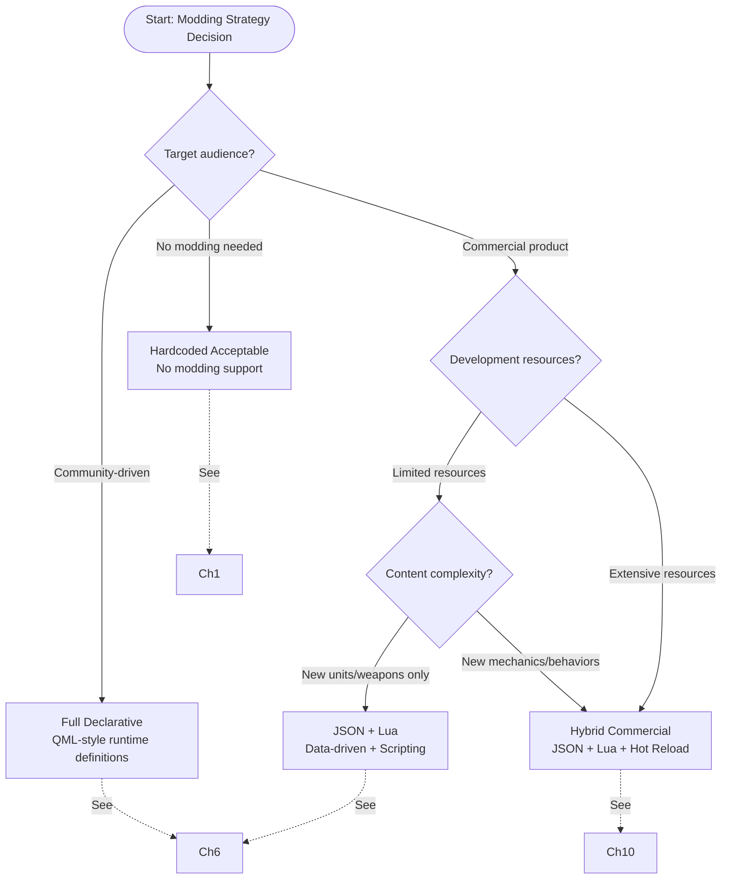
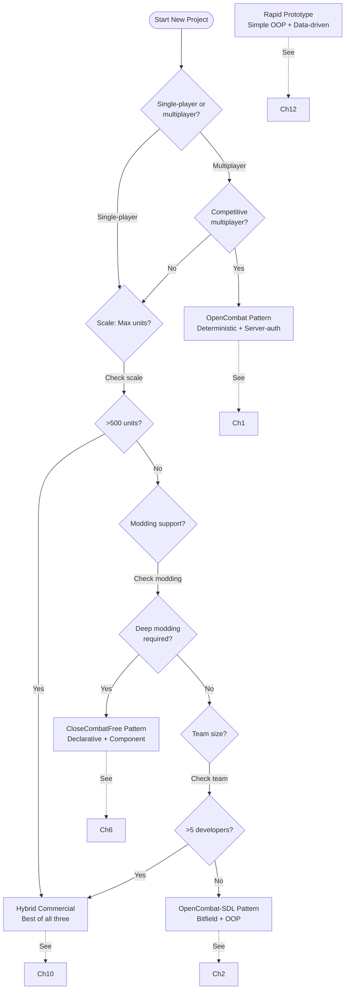

# Decision Flowcharts for Close Combat Clones

Visual decision trees for key architectural choices in tactical wargame development

---

## Overview

These flowcharts help architects navigate critical decisions covered in this book. Each maps decision criteria to specific recommendations with chapter references for deeper analysis.

---

## Flowchart 1: Choosing Your State Management System

**Key Question:** How should you represent unit actions at any moment?

### Decision Criteria at Each Node

**Q1: Multiplayer Determinism Required?**
- **YES:** Competitive multiplayer, replay recording, or synchronized co-op
- **NO:** Single-player only or asynchronous multiplayer
- Determinism requires type-safe, reproducible state representation. String-based states risk platform-dependent hashing.

**Q2: Maximum Moddability Required?**
- **YES:** Community-driven content, runtime unit creation, or designer-authored behaviors
- **NO:** Curated content only or fixed mechanics
- String-based states allow modders to add new states without recompilation. Type-safe enums require code changes.

**Q3: Automatic Prerequisite Chaining Required?**
- **YES:** Complex action sequences (stand up before running, reload before firing)
- **NO:** Simple actions or player handles all transitions manually
- Bitfield prerequisite chains enable intelligent automation. Hierarchical states alone don't capture capability composition.

### Recommendation Details

| Approach        | Best For                      | Pros                                          | Cons                                          |
| --------------- | ----------------------------- | --------------------------------------------- | --------------------------------------------- |
| **State Hierarchy** | Multiplayer, complex AI       | Type-safe, deterministic, clear relationships | Verbose, requires code changes for new states |
| **Dual-State**      | Heavy modding focus           | Runtime flexibility, visual separation        | No type safety, harder to debug               |
| **Bitfield**        | Single-player, simple systems | O(1) queries, automatic prerequisites         | 64-state limit, no hierarchy                  |
| **Hybrid**          | Most commercial games         | Best of both worlds                           | Higher complexity                             |

---

## Flowchart 2: Choosing Your Entity Model

**Key Question:** How do you structure soldiers, equipment, and squads?

### Decision Criteria

**Simulation Depth Priority**
Choose OOP when modeling clear "IS-A" relationships.
Best for traditional unit types (infantry, vehicles) with stable hierarchies.
Trade-off: Rigid structure, diamond inheritance issues.

**Moddability Priority**
Choose Component Composition when modders need runtime flexibility.
Best for games where players create custom units with unexpected combinations.
Trade-off: More complex interactions between components.

**Performance + Flexibility Priority**
Choose ECS for cache efficiency and parallel processing.
Best for large-scale battles (500+ units), type safety requirements.
Trade-off: Steeper learning curve, more boilerplate.

### Entity Model Comparison

| Model        | Cache Efficiency | Flexibility | Type Safety | Learning Curve |
| ------------ | ---------------- | ----------- | ----------- | -------------- |
| **OOP**          | Low (scattered)  | Low         | High        | Low            |
| **Component**    | Medium           | Very High   | Low         | Medium         |
| **ECS**          | High             | High        | High        | High           |
| **Modified ECS** | Medium-High      | Medium-High | High        | Medium         |

---

## Flowchart 3: Choosing Your AI Architecture

**Key Question:** How do units decide what to do?

### Decision Criteria

**Simple/Obedient Units**
State Machines work best when units follow explicit orders without interpretation.
Best for scripted scenarios, puzzle-like encounters, tutorial units.
Example: "If ordered to move, move. If sees enemy, engage."

**Complex Tactical Reasoning**
GOAP works best when units must plan multi-step strategies.
Best for squad-level tactics, autonomous decision-making.
Example: "Ambush requires: find cover → wait → engage when enemy in range."

**Reactive Behaviors**
Behavior Trees work best when units must respond to changing threats.
Best for survival-first AI, cover-seeking, suppression response.
Example: "If under fire → seek cover. If no cover → return fire."

**Designer-Authored Behaviors**
Hybrid works best when non-programmers need to create AI.
Best for community modding, frequent iteration, complex scenarios.
Combines behavior trees for structure with scripts for custom logic.

### AI Architecture Comparison

| Architecture   | Predictability | Complexity | Moddability | Performance |
| -------------- | -------------- | ---------- | ----------- | ----------- |
| **State Machines** | Very High      | Low        | Low         | Very Fast   |
| **Behavior Trees** | High           | Medium     | Medium      | Fast        |
| **GOAP**           | Medium         | High       | Low-Medium  | Medium      |
| **Hybrid**         | Medium         | Very High  | High        | Medium      |

---

## Flowchart 4: Multiplayer Decision Tree

**Key Question:** What multiplayer architecture fits your game?

### Decision Criteria

**Real-Time Competitive**
Use deterministic lockstep simulation.
Required: Server-authoritative, anti-cheat, replay support.
Trade-off: Higher latency, complex implementation.
Bandwidth: ~20-30 bytes per soldier update (event sourcing).

**Real-Time Co-op**
Depends on acceptable latency and cheat tolerance.
Low latency + cheat tolerance: Client-authoritative.
Cheat-sensitive: Server-authoritative with state sync.

**Turn-Based**
Use command validation with state snapshots.
Advantage: No determinism concerns, simpler networking.
Trade-off: Different game feel, less emergent.

### Multiplayer Architecture Comparison

| Architecture  | Anti-Cheat | Latency | Bandwidth | Replay Support |
| ------------- | ---------- | ------- | --------- | -------------- |
| **Deterministic** | Excellent  | High    | Very Low  | Complete       |
| **State Sync**    | Good       | Medium  | Medium    | Limited        |
| **Client-Auth**   | Poor       | Low     | N/A       | None           |
| **Turn-Based**    | Excellent  | N/A     | Low       | Complete       |

---

## Flowchart 5: Modding Strategy

**Key Question:** How do you enable players to create content?

### Decision Criteria

**Commercial Product**
JSON + Lua works best when you want curated modding within safe boundaries.
Best for weapon packs, unit variants, scenarios.
Trade-off: Requires API design and sandboxing.

**Community-Driven**
Full Declarative (QML) works best when players should create entirely new game modes.
Best for total conversions, novel mechanics, deep customization.
Trade-off: Higher security risks, more support burden.

**No Modding Needed**
Hardcoded works for focused single-player experiences.
Best for narrative games, curated experiences, rapid prototypes.
Trade-off: No community longevity.

### Modding Capability Matrix

| Modding Goal     | Hardcoded | JSON Only | JSON + Lua | Full Declarative |
| ---------------- | --------- | --------- | ---------- | ---------------- |
| Add new maps     | ✗         | ✓         | ✓          | ✓                |
| Create scenarios | ✗         | ✓         | ✓          | ✓                |
| Add weapons      | ✗         | ✓         | ✓          | ✓                |
| Add unit types   | ✗         | ✗         | ✓          | ✓                |
| New mechanics    | ✗         | ✗         | ✓          | ✓                |
| New AI behaviors | ✗         | ✗         | ✓          | ✓                |
| Total conversion | ✗         | ✗         | ✗          | ✓                |

---

## Flowchart 6: Overall Architecture Selection

**Master Flowchart:** Complete decision tree for initial project setup

### Architecture Selection Guide

| Scenario                 | Recommended Pattern | Key Characteristics                                             |
| ------------------------ | ------------------- | --------------------------------------------------------------- |
| **Competitive Multiplayer**  | OpenCombat          | Deterministic, server-authoritative, three-tier state hierarchy |
| **Commercial Release**       | Hybrid              | Combines determinism with modding, type-safe ECS                |
| **Single-Player Simulation** | OpenCombat-SDL      | Bitfield states, automatic prerequisites, rich interactions     |
| **Community Platform**       | CloseCombatFree     | QML declarative, hot reload, maximum flexibility                |
| **First Game/Prototype**     | Rapid Prototype     | Simple OOP, data-driven, focus on gameplay first                |

---

## Quick Reference: Decision Summary Tables

### State Management Quick Pick

| If you need...          | Choose          | From Chapter |
| ----------------------- | --------------- | ------------ |
| Multiplayer determinism | State Hierarchy | 3            |
| Maximum moddability     | Dual-State      | 6            |
| Automatic prerequisites | Bitfield        | 2            |
| Best overall            | Hybrid          | 10           |

### Entity Model Quick Pick

| If you need...              | Choose       | From Chapter |
| --------------------------- | ------------ | ------------ |
| Maximum performance (1000+) | Pure ECS     | 12           |
| Type safety + flexibility   | Modified ECS | 12           |
| Maximum moddability         | Component    | 6            |
| Rapid development           | OOP          | 2            |

### AI Quick Pick

| If you need...              | Choose         | From Chapter |
| --------------------------- | -------------- | ------------ |
| Simple/obedient units       | State Machines | 4            |
| Complex tactical reasoning  | GOAP           | 5            |
| Reactive behaviors          | Behavior Trees | 12           |
| Designer-friendly + complex | Hybrid         | 10           |

### Multiplayer Quick Pick

| If you need...        | Choose               | From Chapter |
| --------------------- | -------------------- | ------------ |
| Real-time competitive | Deterministic        | 10           |
| Turn-based            | Command validation   | 8            |
| Co-op only            | Client-authoritative | 1            |

### Modding Quick Pick

| If you need...     | Choose           | From Chapter |
| ------------------ | ---------------- | ------------ |
| Commercial product | JSON + Lua       | 6            |
| Community platform | Full Declarative | 6            |
| No modding         | Hardcoded        | 1            |

---

## Implementation Checklist

After using these flowcharts, verify your choices:

### State Management
- [ ] Can you serialize game state completely?
- [ ] Can you query "what is this unit doing?" easily?
- [ ] Are state transitions explicit?
- [ ] (Multiplayer) Can two clients stay synchronized?

### Entity System
- [ ] Can you add new unit types without code changes (if modding)?
- [ ] Are entity references type-safe?
- [ ] Is memory layout cache-friendly?
- [ ] Can entities be composed of reusable components?

### AI System
- [ ] Does AI react to threats immediately?
- [ ] Can AI show initiative?
- [ ] Is AI behavior configurable/scriptable?
- [ ] (Multiplayer) Is AI deterministic?

### Multiplayer
- [ ] Is simulation deterministic?
- [ ] Can you record and replay games?
- [ ] Is cheating prevented?
- [ ] Is latency acceptable for target audience?

### Modding
- [ ] Can modders add content without recompilation?
- [ ] Is there a mod manager for dependencies?
- [ ] Can data be hot-reloaded?
- [ ] Is there API documentation?

---

## Further Reading

Each flowchart references specific chapters for implementation details:

- **Chapter 1:** Executive Summary - Universal patterns and trade-offs
- **Chapter 2:** Entity Systems - OOP vs ECS vs Composition
- **Chapter 3:** State Machines - Managing unit behavior
- **Chapter 4:** Command Systems - From intent to action
- **Chapter 5:** World Simulation - Terrain, LOS, environment
- **Chapter 6:** Moddability - Content creation strategies
- **Chapter 8:** Networking - Synchronization strategies
- **Chapter 10:** Recommendations - Synthesized best practices
- **Chapter 12:** Implementation Guide - Concrete code patterns

---

These flowcharts distill nearly two decades of Close Combat clone development. Use them as starting points, but adapt recommendations to your specific constraints and goals.
